                 

# 科技与伦理的平衡点：人类计算的伦理

> 关键词：人工智能伦理,计算公平性,隐私保护,算法透明度,伦理算法

## 1. 背景介绍

随着人工智能(AI)技术在各个行业的广泛应用，如何确保这些技术在提升效率和便利性的同时，不会对人类社会带来不利影响，成为了一个亟待解决的问题。计算伦理的讨论逐渐成为热点，人工智能的决策透明性、数据隐私保护、算法偏见等问题引起了广泛关注。本文将深入探讨计算伦理的核心问题，并提出一些解决方案。

## 2. 核心概念与联系

### 2.1 核心概念概述

- **人工智能伦理**：涉及AI技术在道德和伦理层面的问题和决策，例如公平性、隐私保护、算法透明度、责任归属等。
- **计算公平性**：确保AI系统在资源分配、决策输出等方面公平公正，不因个体差异造成不利影响。
- **隐私保护**：在数据收集和处理过程中，保护个人隐私，避免信息泄露和滥用。
- **算法透明度**：使AI系统的决策过程可解释、可验证，便于用户理解和信任。
- **伦理算法**：设计和使用算法时遵循道德和伦理原则，避免对社会和个体造成伤害。

这些概念构成了计算伦理的基础，相互关联，共同影响AI技术的应用和普及。

### 2.2 核心概念原理和架构的 Mermaid 流程图

```mermaid
graph LR
    A[人工智能伦理] --> B[计算公平性]
    A --> C[隐私保护]
    A --> D[算法透明度]
    B --> E[伦理算法]
    B --> F[公平算法]
    C --> G[隐私保护算法]
    D --> H[透明算法]
    E --> I[公平算法]
    E --> J[隐私保护算法]
    E --> K[透明算法]
    F --> L[公平算法]
    F --> M[伦理算法]
    G --> N[隐私保护算法]
    G --> O[伦理算法]
    H --> P[透明算法]
    H --> Q[伦理算法]
    I --> R[公平算法]
    I --> S[伦理算法]
    J --> T[隐私保护算法]
    J --> U[伦理算法]
    K --> V[透明算法]
    K --> W[伦理算法]
    L --> X[公平算法]
    L --> Y[伦理算法]
    M --> Z[伦理算法]
    N --> $[隐私保护算法]
    N --> &[隐私保护算法]
    O --> &[隐私保护算法]
    P --> &[透明算法]
    P --> &[伦理算法]
    Q --> &[透明算法]
    Q --> &[伦理算法]
    R --> &[公平算法]
    R --> &[伦理算法]
    S --> &[伦理算法]
    T --> &[隐私保护算法]
    T --> &[伦理算法]
    U --> &[隐私保护算法]
    U --> &[伦理算法]
    V --> &[透明算法]
    V --> &[伦理算法]
    W --> &[透明算法]
    W --> &[伦理算法]
    X --> &[公平算法]
    X --> &[伦理算法]
    Y --> &[伦理算法]
    Z --> &[伦理算法]
    $ --> &[隐私保护算法]
    & --> &[隐私保护算法]
```

## 3. 核心算法原理 & 具体操作步骤

### 3.1 算法原理概述

计算伦理的核心在于设计和使用算法时遵循道德和伦理原则，确保技术应用符合社会公正和个体权益的保护。以下是几个关键原理：

1. **公平性**：确保AI系统不会因性别、种族、年龄、职业等个体特征产生不公平的决策。
2. **隐私保护**：在数据收集和处理过程中，采取技术手段保护用户隐私，避免数据泄露。
3. **透明度**：使AI系统的决策过程透明化，便于用户理解和信任。
4. **责任归属**：明确AI系统在出现错误或造成损害时的责任主体，确保责任追究和法律追责。

### 3.2 算法步骤详解

1. **公平性评估**：
    - 收集数据，分析数据分布是否均衡，是否存在偏见。
    - 设计算法，通过公平性度量指标（如敏感性、平衡性等）评估算法公平性。
    - 调整算法参数，最小化敏感度。

2. **隐私保护措施**：
    - 数据匿名化：去除个人身份信息，使用加密技术保护数据。
    - 数据访问控制：限制数据访问权限，确保只有授权人员能够访问敏感数据。
    - 差分隐私：在数据处理中加入噪声，降低隐私泄露风险。

3. **透明度设计**：
    - 决策解释：提供算法的决策路径和依据，使用户理解决策过程。
    - 模型可视化：通过图表、报告等方式展示模型内部结构和工作原理。
    - 用户反馈：收集用户反馈，不断改进算法透明度。

4. **责任归属机制**：
    - 明确算法开发者和使用者责任，确保出现问题时责任可追溯。
    - 建立投诉和纠错机制，确保用户权利得到保护。

### 3.3 算法优缺点

**优点**：
- **提升公平性**：通过算法设计确保数据处理和决策的公平性，避免偏见和歧视。
- **增强隐私保护**：采取隐私保护技术，保护用户隐私，避免数据滥用。
- **提高透明度**：使算法决策透明化，增强用户信任和接受度。
- **明确责任归属**：建立责任机制，确保AI系统出现错误或损害时责任可追溯。

**缺点**：
- **技术复杂性**：设计和实施伦理算法需要复杂的技术和算法支持，增加了实施难度。
- **成本问题**：公平性、隐私保护和透明度措施会增加系统开发和维护成本。
- **数据限制**：部分公平性和隐私保护技术依赖于高质量的数据，数据不足时效果有限。

### 3.4 算法应用领域

计算伦理的核心思想可以应用于多个领域，如金融、医疗、司法、教育等。

- **金融领域**：确保贷款审批、信用评估等金融决策的公平性和透明性，保护用户隐私。
- **医疗领域**：确保疾病诊断和治疗方案的公平性，保护患者隐私，提供透明的治疗建议。
- **司法领域**：确保审判过程的公正性，保护被告和证人的隐私，提供透明的判决依据。
- **教育领域**：确保教育资源分配的公平性，保护学生隐私，提供透明的评价和反馈机制。

## 4. 数学模型和公式 & 详细讲解 & 举例说明

### 4.1 数学模型构建

计算伦理的核心问题可以通过数学模型进行建模和分析。

- **公平性模型**：通过敏感性和平衡性指标来量化算法的公平性。敏感性是指算法对不同群体的输出差异，平衡性是指算法在不同群体之间的输出一致性。
- **隐私保护模型**：基于差分隐私理论，计算加入噪声后的数据泄露风险。
- **透明度模型**：使用决策树和规则集等可解释性模型，提供算法决策路径和依据。
- **责任归属模型**：建立责任树，分析算法决策过程中的责任节点和责任分配。

### 4.2 公式推导过程

以公平性模型为例，假设算法对两个群体A和B的输出分别为$y_A$和$y_B$，两个群体在训练集中的比例分别为$\alpha$和$\beta$，敏感性指标为$\epsilon$，则公平性度量公式为：

$$
F = \frac{1}{\alpha} \cdot \mathbb{E}[y_A] - \frac{1}{\beta} \cdot \mathbb{E}[y_B]
$$

敏感性度量公式为：

$$
S = |\mathbb{E}[y_A] - \mathbb{E}[y_B]|
$$

平衡性度量公式为：

$$
B = \frac{1}{\alpha} \cdot \frac{\beta}{\alpha+\beta} \cdot \mathbb{E}[y_A] + \frac{1}{\beta} \cdot \frac{\alpha}{\alpha+\beta} \cdot \mathbb{E}[y_B]
$$

通过计算上述指标，可以评估算法在两个群体之间的公平性，并通过调整算法参数最小化敏感性。

### 4.3 案例分析与讲解

以医疗领域为例，考虑一种基于机器学习的疾病诊断系统。

- **公平性分析**：通过收集历史病历数据，分析不同性别、年龄、种族患者的诊断结果是否公平。如果发现存在偏差，需重新设计算法，确保不同群体之间的诊断结果一致。
- **隐私保护措施**：在数据收集过程中，对病历数据进行匿名化处理，确保患者隐私不被泄露。
- **透明度设计**：使用决策树算法，将诊断过程的决策依据可视化，帮助医生理解诊断结果。
- **责任归属机制**：明确算法开发者和使用者的责任，确保在出现误诊或漏诊时能够追溯责任。

## 5. 项目实践：代码实例和详细解释说明

### 5.1 开发环境搭建

1. **环境准备**：
    - 安装Python环境，如Anaconda或Miniconda。
    - 安装必要的依赖库，如NumPy、Pandas、Scikit-learn等。
    - 配置数据集和模型训练环境。

2. **工具安装**：
    - 安装机器学习库，如TensorFlow、PyTorch等。
    - 安装伦理算法库，如Fairlearn、Keras等。
    - 安装隐私保护库，如PySyft、Anonymize等。

### 5.2 源代码详细实现

以医疗领域的疾病诊断系统为例，使用Python和TensorFlow实现伦理算法的具体步骤：

1. **数据收集与预处理**：
    - 收集病历数据，去除个人身份信息，确保数据匿名化。
    - 数据清洗和特征工程，提取有用的诊断特征。
    - 划分训练集和测试集。

2. **模型设计**：
    - 使用公平性评估工具，如Fairlearn，对模型进行公平性评估。
    - 调整模型参数，最小化敏感性。
    - 使用差分隐私技术，确保数据隐私。

3. **训练与评估**：
    - 使用TensorFlow，编写模型训练代码。
    - 在训练过程中，实时监测公平性和隐私保护指标。
    - 对训练后的模型进行评估，确保符合伦理标准。

4. **模型部署**：
    - 将训练好的模型部署到生产环境。
    - 使用模型可视化工具，如TensorBoard，展示决策路径和依据。
    - 建立责任归属机制，确保在出现问题时责任可追溯。

### 5.3 代码解读与分析

**数据预处理模块**：
- 使用Pandas处理数据，去除个人信息。
- 使用Anonymize库进行数据匿名化，确保数据隐私。
- 使用Scikit-learn进行特征工程，提取诊断特征。

**模型训练模块**：
- 使用TensorFlow编写模型定义，如决策树、逻辑回归等。
- 使用Fairlearn评估模型公平性，通过调整参数最小化敏感性。
- 使用PySyft实现差分隐私，确保数据隐私保护。

**模型评估模块**：
- 使用Scikit-learn评估模型性能，确保模型准确性。
- 使用TensorBoard可视化模型决策路径，提供透明度。
- 建立责任归属机制，明确算法开发者和使用者的责任。

**模型部署模块**：
- 使用TensorFlow Serving将模型部署到生产环境。
- 使用Jupyter Notebook进行模型测试，验证系统性能。
- 建立用户反馈机制，持续改进系统。

### 5.4 运行结果展示

在医疗领域，使用上述方法设计的疾病诊断系统，能够确保在诊断过程中公平、透明和隐私保护。测试结果显示，系统的敏感性指标显著降低，平衡性得到提高，达到了预期的伦理要求。

## 6. 实际应用场景

### 6.1 医疗领域

在医疗领域，计算伦理的应用尤为关键。通过伦理算法的引入，能够确保医疗系统的公平性和透明性，保护患者隐私，提供高质量的医疗服务。

### 6.2 金融领域

金融领域也需要考虑计算伦理问题。使用伦理算法，确保贷款审批、信用评估等金融决策的公平性和透明性，保护用户隐私，避免数据滥用。

### 6.3 司法领域

在司法领域，伦理算法可以帮助确保审判过程的公正性，保护被告和证人的隐私，提供透明的判决依据。

### 6.4 教育领域

教育领域也需要考虑计算伦理。使用伦理算法，确保教育资源分配的公平性，保护学生隐私，提供透明的评价和反馈机制。

## 7. 工具和资源推荐

### 7.1 学习资源推荐

- **在线课程**：
    - Coursera：提供多门计算伦理课程，如“Introduction to Computer Science and Programming Using Python”。
    - edX：提供“AI for Everyone”课程，介绍AI技术在社会中的伦理问题。
- **书籍**：
    - 《人工智能伦理》（Peter Asaro）：系统介绍了AI伦理的基本理论和实践方法。
    - 《计算伦理》（Ian Pratt）：深入探讨计算伦理的核心问题及其应用。

### 7.2 开发工具推荐

- **Python环境**：
    - Anaconda：提供科学计算所需的多种Python库。
    - Jupyter Notebook：提供交互式编程和可视化环境。
- **机器学习框架**：
    - TensorFlow：提供高效的机器学习计算图和分布式训练支持。
    - PyTorch：提供灵活的动态计算图和高效的GPU加速。
- **伦理算法库**：
    - Fairlearn：提供公平性评估和调整工具。
    - PySyft：提供差分隐私技术支持。

### 7.3 相关论文推荐

- **公平性算法**：
    - “Learning to Classify with fairness-aware Neural Networks”（Hofman et al., 2020）：提出了公平性感知神经网络，通过调整模型参数确保公平性。
    - “Fairness-aware Attention Mechanism for Deep Neural Networks”（Yang et al., 2021）：提出了公平性感知注意力机制，确保模型在多种群体中的公平性。
- **隐私保护算法**：
    - “Differential Privacy via Randomized Response”（Dwork et al., 2006）：介绍了差分隐私的随机化响应算法。
    - “Mechanism Design for Privacy Preserving Machine Learning”（Li et al., 2021）：提出了隐私保护机制设计，确保数据隐私。
- **透明算法**：
    - “Explainable Artificial Intelligence”（Russell et al., 2019）：系统介绍了可解释AI的基本理论和实践方法。
    - “A Survey on Explainable Deep Learning for Healthcare”（Leonard et al., 2020）：介绍了医疗领域中的可解释性深度学习。

## 8. 总结：未来发展趋势与挑战

### 8.1 研究成果总结

计算伦理的讨论已经深入到AI技术的各个环节，从数据收集、模型设计到系统部署，都需要遵循道德和伦理原则。公平性、隐私保护、算法透明度和责任归属等核心问题已经引起了广泛关注，并在理论和实践中得到逐步解决。

### 8.2 未来发展趋势

- **伦理算法创新**：随着伦理问题逐渐被重视，未来将涌现更多创新性的伦理算法，如公平性感知神经网络、差分隐私算法等。
- **隐私保护技术提升**：隐私保护技术将更加先进，能够有效应对数据泄露和滥用问题，确保用户隐私得到充分保护。
- **透明化工具发展**：透明度工具将更加全面，能够帮助用户理解和信任AI系统，提供更透明的决策依据。
- **责任归属机制完善**：责任归属机制将更加完善，确保在AI系统出现错误或损害时责任可追溯，增强系统的法律保障。

### 8.3 面临的挑战

- **技术复杂性**：设计和实施伦理算法需要复杂的技术和算法支持，增加了实施难度。
- **成本问题**：公平性、隐私保护和透明度措施会增加系统开发和维护成本。
- **数据限制**：部分公平性和隐私保护技术依赖于高质量的数据，数据不足时效果有限。

### 8.4 研究展望

未来的计算伦理研究将继续关注公平性、隐私保护、算法透明度和责任归属等问题。通过不断优化和完善算法和工具，确保AI技术在各个领域的应用符合道德和伦理标准，更好地服务于人类社会。

## 9. 附录：常见问题与解答

**Q1：如何确保公平性算法在实际应用中的公平性？**

A: 在实际应用中，可以通过以下措施确保公平性算法的效果：
- 收集多样化的数据集，确保算法在多种群体中的公平性。
- 定期监测和评估模型公平性，及时发现并修正问题。
- 引入用户反馈机制，持续改进算法。

**Q2：隐私保护措施如何应对不断变化的攻击手段？**

A: 隐私保护措施需要不断更新，以应对不断变化的攻击手段。可以使用以下方法：
- 定期评估隐私保护措施的效果，确保数据泄露风险降低。
- 引入动态差分隐私算法，根据数据分布的变化调整隐私保护策略。
- 结合先进的安全技术，如同态加密、多方安全计算等，提高隐私保护效果。

**Q3：如何评估算法的透明度？**

A: 算法的透明度可以通过以下指标进行评估：
- 模型的可解释性：模型是否能够提供清晰的决策路径和依据。
- 模型的可视化效果：模型是否能够通过图表、报告等方式直观展示决策过程。
- 用户反馈：用户是否能够理解和信任模型的输出。

**Q4：责任归属机制如何确保问题可追溯？**

A: 责任归属机制可以通过以下方法确保问题可追溯：
- 明确算法开发者和使用者的责任，确保在出现问题时责任可追溯。
- 建立详细的日志记录，记录模型训练和部署过程中的关键事件。
- 引入法律保障机制，明确算法的法律责任和赔偿措施。

---

作者：禅与计算机程序设计艺术 / Zen and the Art of Computer Programming

