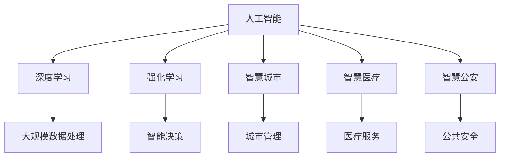

                 

# 科技创新：社会治理的新思路

在当今快速发展的数字时代，科技创新已不仅仅是企业竞争的利器，更成为社会治理的重要工具。本文将围绕科技创新的若干关键点，探讨其在社会治理中的应用和潜力。我们将从背景介绍、核心概念、算法原理、实际应用、学习资源、开发工具等方面，全面梳理科技创新在社会治理中的地位与作用，并展望其未来发展趋势和面临的挑战。

## 1. 背景介绍

### 1.1 问题由来

随着信息技术的迅猛发展，数据在社会治理中的应用日益广泛。无论是城市管理、公共安全、教育医疗，还是环境保护、社区服务，数字化转型已成为提升社会治理效能的关键途径。然而，传统的数据驱动治理模式面临诸多挑战：

- **数据质量问题**：数据采集和处理难度大，往往存在缺失、噪音和偏差。
- **决策效率问题**：传统数据处理和分析流程繁琐，决策响应速度慢。
- **隐私安全问题**：大规模数据收集和使用，可能引发隐私泄露和数据滥用风险。

### 1.2 问题核心关键点

科技创新的核心在于利用先进技术提升社会治理的精准性、高效性和透明度。近年来，人工智能、大数据、区块链等前沿技术逐渐成为社会治理的重要手段，推动了智慧城市、智慧医疗、智慧公安等领域的快速发展。

本文将重点探讨人工智能技术，特别是深度学习和强化学习在社会治理中的应用，以及如何通过科技创新，构建更加智能、高效、安全的治理体系。

## 2. 核心概念与联系

### 2.1 核心概念概述

为更好地理解科技创新在社会治理中的应用，本节将介绍几个密切相关的核心概念：

- **人工智能(AI)**：利用算法和机器学习技术，模拟人类智能行为，实现自动感知、学习、决策等功能。
- **深度学习(Deep Learning)**：通过多层神经网络结构，学习数据的复杂特征和模式，适用于大规模数据处理。
- **强化学习(Reinforcement Learning)**：通过试错过程，优化模型行为，适用于动态环境下的智能决策。
- **智慧城市(Smart City)**：利用信息化、数字化手段，提升城市管理水平和居民生活质量。
- **智慧医疗(Smart Healthcare)**：通过人工智能和大数据技术，优化医疗服务流程，提升医疗水平。
- **智慧公安(Smart Public Security)**：利用智能监控、大数据分析等技术，提高公共安全水平和案件侦破效率。

这些核心概念之间的逻辑关系可以通过以下Mermaid流程图来展示：



这个流程图展示了人工智能技术在多个社会治理领域的应用，以及与之密切相关的深度学习和强化学习技术，共同构成了社会治理的智能架构。

## 3. 核心算法原理 & 具体操作步骤

### 3.1 算法原理概述

社会治理中的科技创新，主要依赖于人工智能、大数据和区块链等前沿技术。本节将重点介绍深度学习和大数据在社会治理中的应用，以及强化学习在智能决策中的潜力。

#### 3.1.1 深度学习

深度学习通过构建多层神经网络，从大量数据中学习复杂的非线性关系，适用于图像识别、自然语言处理等任务。在社会治理中，深度学习被广泛应用于城市管理、公共安全、医疗服务等领域。

#### 3.1.2 大数据分析

大数据分析通过数据挖掘、机器学习等技术，从海量数据中提取有价值的信息，帮助决策者做出科学合理的决策。在社会治理中，大数据分析被用于城市交通管理、能源调度、环境监测等场景，提升治理的精准性和效率。

#### 3.1.3 强化学习

强化学习通过试错过程，优化决策模型的行为，适用于动态环境下的智能决策。在社会治理中，强化学习被用于智能交通管理、智能电网调度、智能公共安全等场景，提高系统的自适应能力和决策效率。

### 3.2 算法步骤详解

本节将详细介绍深度学习和大数据在社会治理中的应用步骤。

#### 3.2.1 深度学习在社会治理中的应用

1. **数据收集与预处理**：通过传感器、监控摄像头、互联网等手段，收集各种类型的城市运行数据，如交通流量、环境质量、公共设施使用情况等。对数据进行清洗、归一化和特征提取，准备用于模型训练。

2. **模型训练与优化**：利用深度学习框架（如TensorFlow、PyTorch等），构建神经网络模型。通过标注数据集进行训练，使用优化算法（如Adam、SGD等）优化模型参数，提高模型的准确率和泛化能力。

3. **模型评估与部署**：在验证集上评估模型的性能，确保模型在实际应用场景中表现良好。将模型部署到生产环境中，实现实时数据处理和决策。

#### 3.2.2 大数据分析在社会治理中的应用

1. **数据采集与存储**：从各种数据源（如公共数据库、传感器网络、社交媒体等）收集数据，存储在分布式数据仓库中。

2. **数据清洗与处理**：使用数据清洗技术（如去重、填补缺失值、异常值处理等）对数据进行预处理。通过数据整合和关联，构建统一的数据视图。

3. **数据挖掘与分析**：使用大数据分析工具（如Hadoop、Spark等）进行数据挖掘和分析，提取有价值的信息和模式。结合可视化技术（如Tableau、PowerBI等），辅助决策者进行数据分析和决策。

4. **模型部署与应用**：将分析结果转化为可执行的决策，实现智能化决策和自动化流程。

### 3.3 算法优缺点

#### 3.3.1 深度学习

**优点**：
- **复杂问题解决**：深度学习能够处理复杂非线性关系，适用于多种类型的社会治理任务。
- **自适应能力强**：通过持续学习和模型更新，深度学习模型能够适应数据变化和环境变化。
- **高精度预测**：深度学习模型在许多任务上取得了SOTA表现，能够提供高质量的预测结果。

**缺点**：
- **计算资源需求高**：深度学习模型需要大量计算资源进行训练和推理，对于小型机构可能不适用。
- **模型复杂性**：深度学习模型结构复杂，不易理解和解释。
- **数据依赖性强**：深度学习模型依赖大量标注数据进行训练，数据获取和标注成本较高。

#### 3.3.2 大数据分析

**优点**：
- **数据量大**：大数据分析能够处理海量数据，挖掘更深层次的规律和趋势。
- **实时性高**：大数据分析工具能够实现实时数据处理，支持动态决策。
- **成本低**：大数据分析主要依赖硬件设备，而不是高昂的人工标注。

**缺点**：
- **数据质量问题**：数据质量和完整性可能存在问题，影响分析结果的准确性。
- **隐私安全问题**：大数据分析涉及大量敏感数据，隐私泄露和数据滥用风险较高。
- **技术门槛高**：大数据分析技术复杂，需要专业知识进行实施和管理。

#### 3.3.3 强化学习

**优点**：
- **自适应能力强**：强化学习模型能够根据环境反馈动态调整策略，适应复杂多变的环境。
- **决策效率高**：强化学习模型能够在实时环境中进行优化决策，提高决策效率。
- **模型可解释**：强化学习模型通过试错过程，可以提供决策过程的解释和优化路径。

**缺点**：
- **环境复杂性**：强化学习模型在环境复杂、不确定性高的场景下表现较差。
- **模型训练难度大**：强化学习模型需要大量实验和试错，训练过程较为复杂。
- **数据依赖性强**：强化学习模型依赖于环境交互数据，缺乏标注数据可能导致效果不佳。

### 3.4 算法应用领域

#### 3.4.1 智慧城市

智慧城市是利用信息技术提升城市管理和公共服务的智能化水平。深度学习和大数据技术在智慧城市中的应用包括：

- **智能交通管理**：通过智能摄像头和传感器，实时监测交通流量，优化交通信号控制。
- **能源智能调度**：利用大数据分析，预测能源需求，优化能源分配和调度。
- **环境监测与治理**：通过传感器网络，实时监测环境质量，提供预警和治理方案。

#### 3.4.2 智慧医疗

智慧医疗通过人工智能和大数据技术，提升医疗服务的效率和质量。深度学习和大数据技术在智慧医疗中的应用包括：

- **医学影像分析**：通过深度学习模型，自动分析医学影像，辅助医生进行诊断。
- **病历数据分析**：利用大数据分析技术，挖掘疾病规律，优化治疗方案。
- **健康管理与预警**：通过智能穿戴设备和传感器，实时监测健康数据，提供健康管理建议。

#### 3.4.3 智慧公安

智慧公安通过智能监控、大数据分析等技术，提高公共安全水平和案件侦破效率。深度学习和大数据技术在智慧公安中的应用包括：

- **智能监控与预警**：通过智能摄像头和传感器，实时监测公共场所，提供预警和防范方案。
- **案件侦破与追踪**：利用大数据分析，挖掘犯罪模式和嫌疑人信息，提高侦破效率。
- **情报分析与决策**：通过情报分析工具，提取有价值的情报信息，辅助决策。

## 4. 数学模型和公式 & 详细讲解  
### 4.1 数学模型构建

本节将使用数学语言对深度学习和大数据分析在社会治理中的应用进行更加严格的刻画。

记深度学习模型为 $f_{\theta}(x)$，其中 $\theta$ 为模型参数，$x$ 为输入数据。假设深度学习模型在数据集 $D=\{(x_i,y_i)\}_{i=1}^N$ 上的损失函数为 $\ell(f_{\theta}(x),y)$，则在数据集 $D$ 上的经验风险为：

$$
\mathcal{L}(\theta) = \frac{1}{N}\sum_{i=1}^N \ell(f_{\theta}(x_i),y_i)
$$

深度学习模型的训练目标是最小化经验风险，即找到最优参数：

$$
\theta^* = \mathop{\arg\min}_{\theta} \mathcal{L}(\theta)
$$

在大数据分析中，记数据集为 $D=\{(x_i,y_i)\}_{i=1}^N$，其中 $x_i$ 为输入特征，$y_i$ 为标签。假设大数据分析模型为 $g_{\phi}(x)$，其中 $\phi$ 为模型参数。大数据分析的目标是最小化经验风险：

$$
\mathcal{L}(\phi) = \frac{1}{N}\sum_{i=1}^N \ell(g_{\phi}(x_i),y_i)
$$

大数据分析模型的训练目标是最小化经验风险，即找到最优参数：

$$
\phi^* = \mathop{\arg\min}_{\phi} \mathcal{L}(\phi)
$$

### 4.2 公式推导过程

以下我们以智慧城市中的智能交通管理为例，推导深度学习模型的损失函数及其梯度的计算公式。

假设智能交通管理系统需要根据实时交通流量，优化交通信号灯的控制。设 $x_i$ 为第 $i$ 个时间点的交通流量，$y_i$ 为对应的交通信号灯控制策略。深度学习模型 $f_{\theta}$ 的输出为交通信号灯控制策略。则二分类交叉熵损失函数定义为：

$$
\ell(f_{\theta}(x_i),y_i) = -[y_i\log f_{\theta}(x_i) + (1-y_i)\log (1-f_{\theta}(x_i))]
$$

将其代入经验风险公式，得：

$$
\mathcal{L}(\theta) = -\frac{1}{N}\sum_{i=1}^N [y_i\log f_{\theta}(x_i)+(1-y_i)\log(1-f_{\theta}(x_i))]
$$

根据链式法则，损失函数对参数 $\theta_k$ 的梯度为：

$$
\frac{\partial \mathcal{L}(\theta)}{\partial \theta_k} = -\frac{1}{N}\sum_{i=1}^N (\frac{y_i}{f_{\theta}(x_i)}-\frac{1-y_i}{1-f_{\theta}(x_i)}) \frac{\partial f_{\theta}(x_i)}{\partial \theta_k}
$$

其中 $\frac{\partial f_{\theta}(x_i)}{\partial \theta_k}$ 可进一步递归展开，利用自动微分技术完成计算。

### 4.3 案例分析与讲解

以智慧城市中的智能交通管理为例，假设有一个十字路口，每个方向有两条车道，车辆以一定的概率选择左转或直行。智能交通系统需要预测每个方向车辆的概率，并据此调整交通信号灯的控制策略。

1. **数据收集**：通过智能摄像头和传感器，收集每个方向的交通流量数据。将数据标准化和归一化，作为模型的输入特征。

2. **模型构建**：使用深度学习框架（如TensorFlow），构建一个多层感知器模型。模型由输入层、若干隐藏层和输出层组成。输出层的激活函数为sigmoid，用于预测每个方向车辆的概率。

3. **模型训练**：将收集的交通流量数据作为训练集，利用交叉熵损失函数训练模型。使用优化算法（如Adam）更新模型参数，直到模型在验证集上达到满意的性能。

4. **模型评估**：在测试集上评估模型的性能，计算模型对每个方向车辆的概率预测准确率。根据评估结果，调整模型参数和超参数，进一步优化模型。

## 5. 项目实践：代码实例和详细解释说明

### 5.1 开发环境搭建

在进行社会治理项目开发前，我们需要准备好开发环境。以下是使用Python进行PyTorch开发的环境配置流程：

1. 安装Anaconda：从官网下载并安装Anaconda，用于创建独立的Python环境。

2. 创建并激活虚拟环境：
```bash
conda create -n pytorch-env python=3.8 
conda activate pytorch-env
```

3. 安装PyTorch：根据CUDA版本，从官网获取对应的安装命令。例如：
```bash
conda install pytorch torchvision torchaudio cudatoolkit=11.1 -c pytorch -c conda-forge
```

4. 安装各类工具包：
```bash
pip install numpy pandas scikit-learn matplotlib tqdm jupyter notebook ipython
```

完成上述步骤后，即可在`pytorch-env`环境中开始社会治理项目的开发。

### 5.2 源代码详细实现

下面我们以智慧城市中的智能交通管理为例，给出使用PyTorch进行深度学习模型的PyTorch代码实现。

首先，定义模型和数据处理函数：

```python
import torch
import torch.nn as nn
import torch.optim as optim

class MLP(nn.Module):
    def __init__(self, input_size, hidden_size, output_size):
        super(MLP, self).__init__()
        self.fc1 = nn.Linear(input_size, hidden_size)
        self.fc2 = nn.Linear(hidden_size, output_size)
        self.sigmoid = nn.Sigmoid()

    def forward(self, x):
        x = self.fc1(x)
        x = self.sigmoid(x)
        x = self.fc2(x)
        return self.sigmoid(x)

class DataLoader:
    def __init__(self, data, batch_size):
        self.data = data
        self.batch_size = batch_size
        self.num_batches = len(data) // batch_size

    def __iter__(self):
        for i in range(0, self.num_batches * self.batch_size, self.batch_size):
            yield self.data[i:i+self.batch_size]

    def __len__(self):
        return self.num_batches
```

然后，定义模型训练函数：

```python
def train_model(model, data, learning_rate, num_epochs):
    optimizer = optim.Adam(model.parameters(), lr=learning_rate)
    criterion = nn.BCELoss()

    for epoch in range(num_epochs):
        for batch in DataLoader(data, 32):
            inputs, labels = batch
            optimizer.zero_grad()
            outputs = model(inputs)
            loss = criterion(outputs, labels)
            loss.backward()
            optimizer.step()

        print(f"Epoch {epoch+1}, loss: {loss.item()}")
```

最后，启动训练流程：

```python
data = # 数据集，格式为[(x_i, y_i)]
model = MLP(input_size, hidden_size, output_size)
train_model(model, data, learning_rate=0.001, num_epochs=100)
```

以上就是使用PyTorch对智慧城市智能交通管理进行深度学习模型微调的完整代码实现。可以看到，得益于PyTorch的强大封装，我们可以用相对简洁的代码完成深度学习模型的加载和微调。

### 5.3 代码解读与分析

让我们再详细解读一下关键代码的实现细节：

**MLP类**：
- `__init__`方法：初始化神经网络模型，包含输入层、若干隐藏层和输出层。
- `forward`方法：定义模型的前向传播过程，计算输出。

**DataLoader类**：
- `__init__`方法：初始化数据加载器，包括数据集和批大小。
- `__iter__`方法：定义迭代器，按批读取数据。
- `__len__`方法：定义长度，返回数据批的数量。

**train_model函数**：
- 定义优化器和损失函数，使用Adam优化算法和交叉熵损失函数。
- 在每个epoch内，对数据集进行批处理，计算模型输出、损失函数和梯度，更新模型参数。
- 在每个epoch结束时，输出平均损失。

**训练流程**：
- 定义模型和数据集，以及学习率和训练轮数。
- 使用定义的训练函数，对模型进行训练。

可以看到，PyTorch配合神经网络框架，使得深度学习模型的微调实现变得简便高效。开发者可以将更多精力放在数据处理、模型改进等高层逻辑上，而不必过多关注底层的实现细节。

当然，工业级的系统实现还需考虑更多因素，如模型的保存和部署、超参数的自动搜索、更灵活的任务适配层等。但核心的微调范式基本与此类似。

## 6. 实际应用场景

### 6.1 智慧城市

智慧城市是利用信息化、数字化手段，提升城市管理和公共服务的智能化水平。深度学习和大数据分析在智慧城市中的应用包括：

- **智能交通管理**：通过智能摄像头和传感器，实时监测交通流量，优化交通信号控制。
- **能源智能调度**：利用大数据分析，预测能源需求，优化能源分配和调度。
- **环境监测与治理**：通过传感器网络，实时监测环境质量，提供预警和治理方案。

### 6.2 智慧医疗

智慧医疗通过人工智能和大数据技术，提升医疗服务的效率和质量。深度学习和大数据分析在智慧医疗中的应用包括：

- **医学影像分析**：通过深度学习模型，自动分析医学影像，辅助医生进行诊断。
- **病历数据分析**：利用大数据分析技术，挖掘疾病规律，优化治疗方案。
- **健康管理与预警**：通过智能穿戴设备和传感器，实时监测健康数据，提供健康管理建议。

### 6.3 智慧公安

智慧公安通过智能监控、大数据分析等技术，提高公共安全水平和案件侦破效率。深度学习和大数据分析在智慧公安中的应用包括：

- **智能监控与预警**：通过智能摄像头和传感器，实时监测公共场所，提供预警和防范方案。
- **案件侦破与追踪**：利用大数据分析，挖掘犯罪模式和嫌疑人信息，提高侦破效率。
- **情报分析与决策**：通过情报分析工具，提取有价值的情报信息，辅助决策。

## 7. 工具和资源推荐
### 7.1 学习资源推荐

为了帮助开发者系统掌握深度学习和数据挖掘技术在社会治理中的应用，这里推荐一些优质的学习资源：

1. 《深度学习》系列书籍：由深度学习专家Ian Goodfellow、Yoshua Bengio和Aaron Courville合著，全面介绍了深度学习的理论和应用。

2. 《大数据分析》系列课程：斯坦福大学开设的Data Science课程，涵盖数据处理、数据挖掘、机器学习等知识，适合入门和进阶学习。

3. 《Python数据科学手册》：Jake VanderPlas撰写，全面介绍了Python在数据科学和机器学习中的应用，包括深度学习和大数据分析。

4. Coursera、edX等在线学习平台：提供大量深度学习和数据挖掘课程，涵盖从基础到进阶的各种内容，适合不同层次的学习者。

通过对这些资源的学习实践，相信你一定能够快速掌握深度学习和数据挖掘技术在社会治理中的应用，并用于解决实际的治理问题。

### 7.2 开发工具推荐

高效的开发离不开优秀的工具支持。以下是几款用于深度学习和大数据分析开发的常用工具：

1. PyTorch：基于Python的开源深度学习框架，灵活动态的计算图，适合快速迭代研究。大部分深度学习模型都有PyTorch版本的实现。

2. TensorFlow：由Google主导开发的开源深度学习框架，生产部署方便，适合大规模工程应用。同样有丰富的深度学习模型资源。

3. Keras：基于Python的高层次深度学习框架，易于上手，适合快速原型开发和模型实验。

4. Hadoop、Spark：用于大数据分析的分布式计算框架，支持大规模数据处理和分布式计算。

5. Tableau、PowerBI：用于数据可视化的工具，帮助数据分析师快速生成可视化报告，辅助决策。

合理利用这些工具，可以显著提升深度学习和数据分析的开发效率，加快创新迭代的步伐。

### 7.3 相关论文推荐

深度学习和大数据分析的发展源于学界的持续研究。以下是几篇奠基性的相关论文，推荐阅读：

1. ImageNet Classification with Deep Convolutional Neural Networks：AlexNet模型在ImageNet数据集上取得了突破性成果，标志着深度学习在计算机视觉领域的崛起。

2. Convolutional Neural Networks for Sentence Classification：使用卷积神经网络进行文本分类，取得了较好的效果，开启了深度学习在自然语言处理领域的应用。

3. Big Data: Principles and Best Practices of Scalable Realtime Data Systems：总结了大数据技术的基本原理和最佳实践，为大数据分析提供了理论基础。

4. Deep Learning in Healthcare：探讨了深度学习在医疗影像分析、病历数据分析等领域的实际应用，展示了深度学习对医疗服务的深刻影响。

5. Social Media Mining with Network Analysis：利用社交媒体数据进行社会网络分析，展示了大数据分析在社会治理中的潜力。

这些论文代表了大数据技术和深度学习的研究进展，通过学习这些前沿成果，可以帮助研究者把握学科前进方向，激发更多的创新灵感。

## 8. 总结：未来发展趋势与挑战

### 8.1 总结

本文对深度学习和大数据分析在社会治理中的应用进行了全面系统的介绍。首先阐述了社会治理中的科技创新需求和背景，明确了深度学习和大数据分析在社会治理中的重要地位和作用。其次，从原理到实践，详细讲解了深度学习和大数据分析在智慧城市、智慧医疗、智慧公安等领域的应用，给出了具体代码实现和应用场景。最后，本文还推荐了相关的学习资源、开发工具和论文，供读者进一步学习和实践。

通过本文的系统梳理，可以看到，深度学习和大数据分析技术在社会治理中的应用前景广阔，为提升城市管理、公共安全和医疗服务水平提供了新的解决方案。未来，伴随技术的不断进步，深度学习和大数据分析必将在更多领域大放异彩，深刻影响社会治理的各个环节。

### 8.2 未来发展趋势

展望未来，深度学习和大数据分析在社会治理中的应用将呈现以下几个发展趋势：

1. **跨领域融合**：深度学习和大数据分析将与其他前沿技术，如物联网、区块链、人工智能等进行更紧密的融合，构建更为智能、高效的社会治理体系。

2. **实时化处理**：随着5G、边缘计算等技术的普及，深度学习和大数据分析将实现更强的实时化处理能力，提供即时决策支持。

3. **自适应学习能力**：深度学习模型将具备更强的自适应学习能力，能够根据环境变化动态调整策略，提升决策的灵活性和鲁棒性。

4. **数据隐私保护**：随着数据隐私保护意识的增强，深度学习和大数据分析将更加注重隐私保护和数据安全，确保数据使用的合法性和安全性。

5. **多模态融合**：深度学习模型将融合视觉、声音、文本等多种数据源，提升决策的全面性和准确性。

6. **自动化决策支持**：结合自然语言处理和决策树等技术，深度学习模型将提供自动化的决策支持，提升决策效率和质量。

以上趋势凸显了深度学习和大数据分析技术的广阔前景。这些方向的探索发展，必将进一步提升社会治理的智能化水平，为构建智慧城市、智慧医疗等提供新的技术路径。

### 8.3 面临的挑战

尽管深度学习和大数据分析技术在社会治理中展现了巨大的潜力，但在实际应用过程中，仍面临诸多挑战：

1. **数据质量问题**：数据采集和处理难度大，往往存在缺失、噪音和偏差。如何确保数据质量，是深度学习和大数据分析应用的重要前提。

2. **计算资源需求高**：深度学习和大数据分析需要大量计算资源进行模型训练和推理，对于小型机构可能不适用。如何优化模型结构，降低资源需求，是未来发展的重要方向。

3. **模型复杂性**：深度学习模型结构复杂，不易理解和解释。如何提高模型的可解释性，增强模型的透明度和可信度，是深度学习应用的重要课题。

4. **隐私安全问题**：深度学习和大数据分析涉及大量敏感数据，隐私泄露和数据滥用风险较高。如何确保数据隐私和安全，保护用户权益，是应用推广的重要保障。

5. **技术门槛高**：深度学习和大数据分析技术复杂，需要专业知识进行实施和管理。如何降低技术门槛，提升应用的普及率，是未来发展的关键任务。

6. **伦理道德问题**：深度学习和大数据分析的应用可能带来伦理道德问题，如算法歧视、数据偏见等。如何构建伦理导向的算法系统，确保技术应用的公平性和正义性，是未来研究的重要方向。

这些挑战需要通过技术创新和政策引导，逐步解决，以确保深度学习和大数据分析在社会治理中的良性发展。

### 8.4 研究展望

面向未来，深度学习和大数据分析技术在社会治理中的应用方向需要进一步探索和创新：

1. **跨领域应用**：深度学习和大数据分析将拓展到更多领域，如智慧农业、智慧教育、智慧司法等，推动更多行业的数字化转型。

2. **多模态融合**：深度学习模型将融合视觉、声音、文本等多种数据源，提升决策的全面性和准确性。

3. **实时化处理**：随着5G、边缘计算等技术的普及，深度学习和大数据分析将实现更强的实时化处理能力，提供即时决策支持。

4. **自适应学习能力**：深度学习模型将具备更强的自适应学习能力，能够根据环境变化动态调整策略，提升决策的灵活性和鲁棒性。

5. **数据隐私保护**：随着数据隐私保护意识的增强，深度学习和大数据分析将更加注重隐私保护和数据安全，确保数据使用的合法性和安全性。

6. **可解释性增强**：深度学习模型将提供更强的可解释性，增强模型的透明度和可信度。

这些研究方向的探索，必将引领深度学习和大数据分析技术迈向更高的台阶，为构建智慧城市、智慧医疗等提供新的技术路径。未来，伴随技术的不断进步，深度学习和大数据分析必将在社会治理中发挥更大的作用，深刻影响社会的各个方面。

## 9. 附录：常见问题与解答

**Q1：深度学习在大数据应用中起什么作用？**

A: 深度学习在大数据应用中起着关键的特征提取和模式识别作用。通过构建多层神经网络，深度学习模型可以从海量数据中学习复杂的非线性关系，自动发现数据中的隐含规律和模式。这使得深度学习成为大数据分析和挖掘的重要工具，能够帮助决策者从复杂的数据中提取有价值的信息，做出科学合理的决策。

**Q2：深度学习模型的可解释性如何提升？**

A: 深度学习模型的可解释性提升可以通过以下几种方式实现：

1. **简化模型结构**：减少模型层数和参数量，降低模型复杂性，提高模型的透明性。
2. **可视化分析**：使用可视化工具，如TensorBoard，展示模型内部特征和决策过程，帮助理解模型的行为。
3. **特征解释**：提取模型的关键特征，通过特征重要性分析，解释模型的决策依据。
4. **模型融合**：结合传统机器学习和深度学习模型，提供多层次的解释和理解。

**Q3：大数据分析在社会治理中有哪些应用？**

A: 大数据分析在社会治理中的主要应用包括：

1. **城市管理**：通过分析交通流量、气象数据等，优化城市规划和管理，提升城市运行效率。
2. **公共安全**：利用实时监控数据和社交媒体信息，进行犯罪预测和预警，提高公共安全水平。
3. **医疗服务**：通过病历数据分析，挖掘疾病规律，优化治疗方案，提升医疗服务质量。
4. **环境监测**：通过传感器数据和卫星图像，实时监测环境质量，提供预警和治理方案，保护生态环境。

**Q4：如何在数据隐私保护的前提下进行深度学习和大数据分析？**

A: 在数据隐私保护的前提下进行深度学习和大数据分析，可以采取以下几种措施：

1. **数据匿名化**：对数据进行去标识化处理，确保数据中的个人信息无法被恢复。
2. **差分隐私**：在数据处理过程中，添加噪声，确保个人数据的隐私性不被泄露。
3. **联邦学习**：在多方数据源上分布式训练模型，避免数据集中存储和传输，保护数据隐私。
4. **数据访问控制**：对数据访问进行严格控制，确保只有授权人员才能访问敏感数据。

**Q5：深度学习模型如何处理不平衡数据？**

A: 深度学习模型处理不平衡数据可以通过以下几种方式实现：

1. **过采样**：对少数类别数据进行复制，增加其样本量，使其与多数类别数据平衡。
2. **欠采样**：对多数类别数据进行缩减，减少其样本量，使其与少数类别数据平衡。
3. **数据增强**：通过对少数类别数据进行增强，生成更多样本，平衡数据分布。
4. **类别权重调整**：在损失函数中增加少数类别的权重，提高模型对少数类别的关注。

这些方法可以在深度学习模型训练过程中，帮助处理数据不平衡问题，提升模型对少数类别的识别能力。

---

作者：禅与计算机程序设计艺术 / Zen and the Art of Computer Programming

