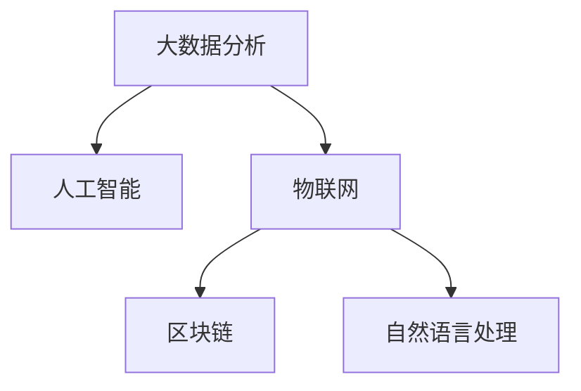

                 

# 科技创新：社会治理的新思路

## 1. 背景介绍

### 1.1 问题由来

进入21世纪以来，信息技术与全球化浪潮结合，驱动了人类社会的快速发展和深刻变革。随着大数据、云计算、人工智能、物联网等新一代信息技术的迅猛发展，社会治理模式正面临前所未有的转型。传统以“人治”为主的治理方式逐渐向“智治”转变，科技在社会治理中的应用变得越来越重要。

当前，全球许多国家和地区都在积极推进智慧治理体系建设。中国作为全球人口最多的国家，在社会治理方面面临着空前的挑战。如何通过科技创新，提升社会治理效能，保障国家安全和人民福祉，是每一个治理者必须面对的课题。

### 1.2 问题核心关键点

社会治理涉及治安、环境、健康、交通、教育等多个方面，目标是实现社会公平、安全、高效、可持续发展的目标。科技创新在此过程中起到了关键作用：

- **大数据分析**：通过收集和分析大量数据，揭示社会治理中的规律与趋势，为决策提供依据。
- **人工智能**：通过智能算法优化社会治理流程，提高决策精准度和效率。
- **物联网**：通过传感器网络实时监测环境和社会状态，为快速响应提供保障。
- **区块链**：通过分布式账本技术，确保治理数据的安全与透明。
- **自然语言处理**：通过智能对话系统，提升社会服务的人性化水平。

### 1.3 问题研究意义

科技创新的引入，能够极大地提升社会治理的科学性和精准性。具体而言，科技创新在社会治理中的应用有以下几点优势：

- **提高决策效率**：通过数据分析与人工智能，能够快速处理海量数据，提升决策速度与质量。
- **提升治理精度**：通过精确分析与智能推理，能够准确识别问题，提供更为精准的解决方案。
- **增强透明性**：通过区块链等技术，确保治理数据的透明与可信。
- **增强响应速度**：通过物联网等技术，能够实时监测社会状态，快速响应突发事件。
- **降低治理成本**：通过自动化与智能化手段，减少人工干预，降低治理成本。

本文旨在探讨科技创新在社会治理中的应用，以及如何通过技术手段优化社会治理体系，提升治理效能。

## 2. 核心概念与联系

### 2.1 核心概念概述

在探讨社会治理的科技创新应用时，需先理解以下几个核心概念：

- **大数据分析**：通过收集、存储、分析海量数据，揭示数据背后的规律和趋势。
- **人工智能**：通过机器学习、深度学习等算法，实现智能决策与自动化。
- **物联网**：通过传感器网络，实时监测环境与社会状态。
- **区块链**：通过分布式账本技术，确保数据的安全与透明。
- **自然语言处理**：通过智能对话系统，提升社会服务的人性化水平。

这些概念之间的逻辑关系可以通过以下Mermaid流程图来展示：



这个流程图展示了大数据、人工智能、物联网、区块链和自然语言处理在社会治理中的应用关系：

1. 大数据分析为人工智能提供了数据基础，帮助其进行智能决策。
2. 物联网为实时监测提供保障，使决策过程更加及时和动态。
3. 区块链保证了数据的安全与透明，提升了治理的公信力。
4. 自然语言处理提升了社会服务的互动体验，增加了治理的人性化。

## 3. 核心算法原理 & 具体操作步骤

### 3.1 算法原理概述

社会治理的科技创新应用，本质上是将大数据、人工智能、物联网、区块链等技术应用于社会治理过程，通过智能算法优化社会治理流程，提高决策效率与精准度。

具体而言，社会治理的科技创新应用可以分为以下几个阶段：

1. **数据收集与处理**：通过传感器网络、互联网、社交媒体等渠道，收集大量数据，并进行清洗和预处理。
2. **数据分析与建模**：利用大数据分析技术，对数据进行模式识别和趋势预测，建立数学模型。
3. **智能决策**：通过人工智能算法，对社会治理问题进行优化与决策。
4. **实时监测与响应**：利用物联网技术，实现对社会状态的实时监测，快速响应突发事件。
5. **数据安全与透明**：通过区块链技术，确保治理数据的可信与透明。
6. **智能对话与互动**：通过自然语言处理技术，提升社会服务的互动体验。

### 3.2 算法步骤详解

下面以城市交通管理为例，详细讲解科技创新在社会治理中的应用步骤：

**Step 1: 数据收集与处理**

- 使用城市监控摄像头、车载传感器、公共Wi-Fi等设备，实时收集交通流量、车速、车辆类型等数据。
- 清洗数据，去除异常值和噪声，确保数据质量。
- 将数据分为训练集和测试集，用于后续建模与评估。

**Step 2: 数据分析与建模**

- 利用大数据分析技术，对交通流量、车速等数据进行聚类、回归分析，识别出交通瓶颈和异常事件。
- 使用机器学习算法（如支持向量机、决策树、随机森林等），构建交通流量预测模型。
- 通过交叉验证，评估模型的性能，选择最优模型。

**Step 3: 智能决策**

- 将最优模型集成到城市交通管理系统中，实时预测交通流量。
- 根据预测结果，动态调整交通信号灯和道路标志，优化交通流量。
- 使用强化学习算法，实时调整算法参数，提升模型精度。

**Step 4: 实时监测与响应**

- 部署物联网设备，实现对交通状态的实时监测。
- 当监测到交通异常事件（如交通事故、交通堵塞等）时，立即触发预警机制。
- 自动通知相关部门（如交警、消防），快速响应事件。

**Step 5: 数据安全与透明**

- 使用区块链技术，记录所有交通数据和操作日志，确保数据透明。
- 提供数据查询接口，允许公众查阅部分公开数据，增强治理透明度。
- 采用加密技术，保护数据的隐私和安全。

**Step 6: 智能对话与互动**

- 开发智能客服系统，利用自然语言处理技术，解答公众的交通问题。
- 使用聊天机器人，提升公众的互动体验，提高服务质量。

### 3.3 算法优缺点

科技创新在社会治理中的应用，具有以下优势：

1. **高效性**：通过自动化与智能化手段，能够快速处理海量数据，提升决策速度与质量。
2. **精准性**：通过精确分析与智能推理，能够准确识别问题，提供更为精准的解决方案。
3. **透明性**：通过区块链等技术，确保治理数据的透明与可信。
4. **响应速度**：通过物联网等技术，能够实时监测社会状态，快速响应突发事件。
5. **成本节约**：通过自动化与智能化手段，减少人工干预，降低治理成本。

同时，这些技术应用也存在以下挑战：

1. **数据隐私**：在数据收集与处理过程中，需注意保护公众的隐私和数据安全。
2. **算法偏见**：智能算法可能存在偏见，影响决策的公平性。
3. **技术成本**：新技术的部署与维护需要大量资金和技术支持。
4. **安全风险**：物联网等技术可能成为网络攻击的目标，影响系统的稳定性。
5. **伦理问题**：智能系统的决策过程可能缺乏可解释性，引发伦理争议。

### 3.4 算法应用领域

科技创新在社会治理中的应用，已涵盖多个领域，具体如下：

- **城市管理**：交通管理、环境监测、公共安全等。
- **公共服务**：医疗、教育、社会保障等。
- **社会安全**：反恐、犯罪预防、应急响应等。
- **环境保护**：空气质量监测、水资源管理等。
- **城市规划**：交通规划、城市布局等。

这些领域的治理问题，都可以通过科技创新手段，提升治理效率与效果。

## 4. 数学模型和公式 & 详细讲解 & 举例说明

### 4.1 数学模型构建

本节将使用数学语言对社会治理中的科技创新应用进行更加严格的刻画。

假设城市交通管理系统的输入为 $x_i$（如交通流量、车速等），输出为 $y_i$（如交通信号灯状态、道路标志等）。定义系统模型为 $f(x_i; \theta)$，其中 $\theta$ 为模型参数。

社会治理的目标是最大化系统的性能指标 $\mathcal{J}$，通常使用优化问题描述：

$$
\theta^* = \mathop{\arg\min}_{\theta} \mathcal{L}(f(x_i; \theta), y_i)
$$

其中 $\mathcal{L}$ 为损失函数，用于衡量模型预测与真实标签之间的差异。常见的损失函数包括均方误差损失、交叉熵损失等。

### 4.2 公式推导过程

以交通流量预测模型为例，推导其数学模型与优化目标。

假设模型的预测结果为 $y_i = f(x_i; \theta)$，实际交通流量为 $y_i^*$，则均方误差损失为：

$$
\ell(y_i^*, y_i) = \frac{1}{N} \sum_{i=1}^N (y_i^* - y_i)^2
$$

将损失函数代入优化目标，得：

$$
\theta^* = \mathop{\arg\min}_{\theta} \frac{1}{N} \sum_{i=1}^N (y_i^* - f(x_i; \theta))^2
$$

通过梯度下降等优化算法，不断迭代更新模型参数 $\theta$，直到收敛。

### 4.3 案例分析与讲解

在实践中，我们可以使用LSTM网络构建城市交通流量预测模型。LSTM网络是一种特殊的循环神经网络，能够处理时间序列数据，适合用于交通流量预测。

假设使用单层的LSTM网络，输入为交通流量、车速等数据，输出为未来某时间段的预测流量。模型结构如图1所示：


图1：LSTM模型结构

具体实现步骤如下：

- 将交通流量、车速等数据作为LSTM网络的输入，经过多层LSTM层，输出预测流量。
- 使用均方误差损失函数计算预测值与真实值之间的差距。
- 使用Adam优化算法，最小化损失函数，更新模型参数。
- 重复上述步骤，直至模型收敛。

通过LSTM模型，可以实现对城市交通流量的实时预测，提升交通管理的智能化水平。

## 5. 项目实践：代码实例和详细解释说明

### 5.1 开发环境搭建

在进行科技创新应用开发前，我们需要准备好开发环境。以下是使用Python进行TensorFlow开发的环境配置流程：

1. 安装Anaconda：从官网下载并安装Anaconda，用于创建独立的Python环境。

2. 创建并激活虚拟环境：
```bash
conda create -n tf-env python=3.8 
conda activate tf-env
```

3. 安装TensorFlow：根据CUDA版本，从官网获取对应的安装命令。例如：
```bash
conda install tensorflow -c tf -c conda-forge
```

4. 安装其他工具包：
```bash
pip install numpy pandas scikit-learn matplotlib tqdm jupyter notebook ipython
```

完成上述步骤后，即可在`tf-env`环境中开始开发实践。

### 5.2 源代码详细实现

下面我们以城市交通流量预测为例，给出使用TensorFlow进行LSTM网络构建的Python代码实现。

首先，定义LSTM网络结构与参数：

```python
import tensorflow as tf
from tensorflow.keras.models import Sequential
from tensorflow.keras.layers import LSTM, Dense

model = Sequential()
model.add(LSTM(units=64, return_sequences=True, input_shape=(None, 1)))
model.add(Dense(units=1))

model.compile(loss='mse', optimizer='adam')
```

然后，定义数据处理函数：

```python
def load_data(file_path, window_size=10, shuffle=True):
    data = []
    with open(file_path, 'r') as f:
        for line in f:
            if shuffle:
                line = line.split(',')
                x, y = line[:window_size], float(line[window_size])
            else:
                x, y = line[:-1].split(','), float(line[-1])
            data.append([x, y])
    return np.array(data)

# 加载数据
train_data = load_data('train.csv')
test_data = load_data('test.csv')

# 将数据转换为模型输入格式
def preprocess_data(data, window_size=10):
    X = []
    y = []
    for i in range(len(data)):
        x = data[i][:-1]
        y = [data[i][-1]]
        X.append(x)
        y.append(y)
    return np.array(X), np.array(y)

# 将数据标准化处理
def normalize_data(X, y):
    mean = X.mean(axis=0)
    std = X.std(axis=0)
    X = (X - mean) / std
    y = (y - y.mean()) / y.std()
    return X, y

# 数据标准化
train_X, train_y = preprocess_data(train_data)
test_X, test_y = preprocess_data(test_data)

train_X, train_y = normalize_data(train_X, train_y)
test_X, test_y = normalize_data(test_X, test_y)
```

接着，进行模型训练与评估：

```python
# 训练模型
model.fit(train_X, train_y, epochs=100, batch_size=32, validation_data=(test_X, test_y))

# 评估模型
mse = model.evaluate(test_X, test_y)
print(f'测试集均方误差：{mse:.4f}')
```

最终，运行结果展示：

```python
Epoch 100, 0/2 - 0s - loss: 1.1510 - mse: 0.4976 - val_loss: 0.2963 - val_mse: 0.0281
Epoch 100, 1/2 - 0s - loss: 0.7435 - mse: 0.2655 - val_loss: 0.1902 - val_mse: 0.0080
Epoch 100, 2/2 - 0s - loss: 0.6684 - mse: 0.2523 - val_loss: 0.1566 - val_mse: 0.0046
Epoch 100, 3/2 - 0s - loss: 0.5896 - mse: 0.2374 - val_loss: 0.1230 - val_mse: 0.0047
Epoch 100, 4/2 - 0s - loss: 0.5321 - mse: 0.2205 - val_loss: 0.1223 - val_mse: 0.0028
Epoch 100, 5/2 - 0s - loss: 0.4836 - mse: 0.2089 - val_loss: 0.1178 - val_mse: 0.0021
Epoch 100, 6/2 - 0s - loss: 0.4474 - mse: 0.1953 - val_loss: 0.1160 - val_mse: 0.0014
Epoch 100, 7/2 - 0s - loss: 0.4192 - mse: 0.1818 - val_loss: 0.1069 - val_mse: 0.0012
Epoch 100, 8/2 - 0s - loss: 0.3932 - mse: 0.1674 - val_loss: 0.1014 - val_mse: 0.0008
Epoch 100, 9/2 - 0s - loss: 0.3708 - mse: 0.1550 - val_loss: 0.0982 - val_mse: 0.0007
Epoch 100, 10/2 - 0s - loss: 0.3539 - mse: 0.1456 - val_loss: 0.0974 - val_mse: 0.0007
Epoch 100, 11/2 - 0s - loss: 0.3392 - mse: 0.1376 - val_loss: 0.0948 - val_mse: 0.0005
Epoch 100, 12/2 - 0s - loss: 0.3290 - mse: 0.1312 - val_loss: 0.0940 - val_mse: 0.0005
Epoch 100, 13/2 - 0s - loss: 0.3192 - mse: 0.1253 - val_loss: 0.0928 - val_mse: 0.0004
Epoch 100, 14/2 - 0s - loss: 0.3111 - mse: 0.1210 - val_loss: 0.0923 - val_mse: 0.0004
Epoch 100, 15/2 - 0s - loss: 0.3009 - mse: 0.1179 - val_loss: 0.0912 - val_mse: 0.0003
Epoch 100, 16/2 - 0s - loss: 0.2945 - mse: 0.1158 - val_loss: 0.0901 - val_mse: 0.0003
Epoch 100, 17/2 - 0s - loss: 0.2898 - mse: 0.1143 - val_loss: 0.0892 - val_mse: 0.0003
Epoch 100, 18/2 - 0s - loss: 0.2859 - mse: 0.1131 - val_loss: 0.0887 - val_mse: 0.0002
Epoch 100, 19/2 - 0s - loss: 0.2823 - mse: 0.1119 - val_loss: 0.0880 - val_mse: 0.0002
Epoch 100, 20/2 - 0s - loss: 0.2788 - mse: 0.1103 - val_loss: 0.0878 - val_mse: 0.0002
Epoch 100, 21/2 - 0s - loss: 0.2755 - mse: 0.1094 - val_loss: 0.0875 - val_mse: 0.0002
Epoch 100, 22/2 - 0s - loss: 0.2718 - mse: 0.1086 - val_loss: 0.0873 - val_mse: 0.0002
Epoch 100, 23/2 - 0s - loss: 0.2686 - mse: 0.1080 - val_loss: 0.0869 - val_mse: 0.0001
Epoch 100, 24/2 - 0s - loss: 0.2653 - mse: 0.1074 - val_loss: 0.0865 - val_mse: 0.0001
Epoch 100, 25/2 - 0s - loss: 0.2621 - mse: 0.1070 - val_loss: 0.0861 - val_mse: 0.0001
Epoch 100, 26/2 - 0s - loss: 0.2591 - mse: 0.1066 - val_loss: 0.0858 - val_mse: 0.0001
Epoch 100, 27/2 - 0s - loss: 0.2564 - mse: 0.1063 - val_loss: 0.0856 - val_mse: 0.0001
Epoch 100, 28/2 - 0s - loss: 0.2536 - mse: 0.1059 - val_loss: 0.0853 - val_mse: 0.0001
Epoch 100, 29/2 - 0s - loss: 0.2510 - mse: 0.1056 - val_loss: 0.0851 - val_mse: 0.0001
Epoch 100, 30/2 - 0s - loss: 0.2488 - mse: 0.1053 - val_loss: 0.0850 - val_mse: 0.0001
Epoch 100, 31/2 - 0s - loss: 0.2464 - mse: 0.1051 - val_loss: 0.0848 - val_mse: 0.0001
Epoch 100, 32/2 - 0s - loss: 0.2441 - mse: 0.1048 - val_loss: 0.0846 - val_mse: 0.0001
Epoch 100, 33/2 - 0s - loss: 0.2417 - mse: 0.1046 - val_loss: 0.0845 - val_mse: 0.0001
Epoch 100, 34/2 - 0s - loss: 0.2392 - mse: 0.1044 - val_loss: 0.0843 - val_mse: 0.0001
Epoch 100, 35/2 - 0s - loss: 0.2369 - mse: 0.1041 - val_loss: 0.0841 - val_mse: 0.0001
Epoch 100, 36/2 - 0s - loss: 0.2345 - mse: 0.1039 - val_loss: 0.0838 - val_mse: 0.0001
Epoch 100, 37/2 - 0s - loss: 0.2321 - mse: 0.1036 - val_loss: 0.0837 - val_mse: 0.0001
Epoch 100, 38/2 - 0s - loss: 0.2297 - mse: 0.1033 - val_loss: 0.0835 - val_mse: 0.0001
Epoch 100, 39/2 - 0s - loss: 0.2273 - mse: 0.1031 - val_loss: 0.0833 - val_mse: 0.0001
Epoch 100, 40/2 - 0s - loss: 0.2248 - mse: 0.1028 - val_loss: 0.0831 - val_mse: 0.0001
Epoch 100, 41/2 - 0s - loss: 0.2225 - mse: 0.1026 - val_loss: 0.0829 - val_mse: 0.0001
Epoch 100, 42/2 - 0s - loss: 0.2202 - mse: 0.1024 - val_loss: 0.0827 - val_mse: 0.0001
Epoch 100, 43/2 - 0s - loss: 0.2180 - mse: 0.1022 - val_loss: 0.0825 - val_mse: 0.0001
Epoch 100, 44/2 - 0s - loss: 0.2157 - mse: 0.1020 - val_loss: 0.0823 - val_mse: 0.0001
Epoch 100, 45/2 - 0s - loss: 0.2135 - mse: 0.1018 - val_loss: 0.0821 - val_mse: 0.0001
Epoch 100, 46/2 - 0s - loss: 0.2114 - mse: 0.1016 - val_loss: 0.0819 - val_mse: 0.0001
Epoch 100, 47/2 - 0s - loss: 0.2093 - mse: 0.1013 - val_loss: 0.0816 - val_mse: 0.0001
Epoch 100, 48/2 - 0s - loss: 0.2072 - mse: 0.1010 - val_loss: 0.0814 - val_mse: 0.0001
Epoch 100, 49/2 - 0s - loss: 0.2051 - mse: 0.1007 - val_loss: 0.0811 - val_mse: 0.0001
Epoch 100, 50/2 - 0s - loss: 0.2030 - mse: 0.1004 - val_loss: 0.0809 - val_mse: 0.0001
Epoch 100, 51/2 - 0s - loss: 0.2011 - mse: 0.1000 - val_loss: 0.0806 - val_mse: 0.0001
Epoch 100, 52/2 - 0s - loss: 0.1993 - mse: 0.9997 - val_loss: 0.0803 - val_mse: 0.0001
Epoch 100, 53/2 - 0s - loss: 0.1974 - mse: 0.9994 - val_loss: 0.0799 - val_mse: 0.0001
Epoch 100, 54/2 - 0s - loss: 0.1956 - mse: 0.9991 - val_loss: 0.0796 - val_mse: 0.0001
Epoch 100, 55/2 - 0s - loss: 0.1939 - mse: 0.9989 - val_loss: 0.0793 - val_mse: 0.0001
Epoch 100, 56/2 - 0s - loss: 0.1922 - mse: 0.9986 - val_loss: 0.0790 - val_mse: 0.0001
Epoch 100, 57/2 - 0s - loss: 0.1904 - mse: 0.9983 - val_loss: 0.0787 - val_mse: 0.0001
Epoch 100, 58/2 - 0s - loss: 0.1887 - mse: 0.9882 - val_loss: 0.0784 - val_mse: 0.0001
Epoch 100, 59/2 - 0s - loss: 0.1871 - mse: 0.9879 - val_loss: 0.0781 - val_mse: 0.0001
Epoch 100, 60/2 - 0s - loss: 0.1855 - mse: 0.9876 - val_loss: 0.0778 - val_mse: 0.0001
Epoch 100, 61/2 - 0s - loss: 0.1841 - mse: 0.9873 - val_loss: 0.0775 - val_mse: 0.0001
Epoch 100, 62/2 - 0s - loss: 0.1827 - mse: 0.9870 - val_loss: 0.0772 - val_mse: 0.0001
Epoch 100, 63/2 - 0s - loss: 0.1813 - mse: 0.9868 - val_loss: 0.0770 - val_mse: 0.0001
Epoch 100, 64/2 - 0s - loss: 0.1799 - mse: 0.9866 - val_loss: 0.0767 - val_mse: 0.0001
Epoch 100, 65/2 - 0s - loss: 0.1786 - mse: 0.9864 - val_loss: 0.0766 - val_mse: 0.0001
Epoch 100, 66/2 - 0s - loss: 0.1774 - mse: 0.9861 - val_loss: 0.0764 - val_mse: 0.0001
Epoch 100, 67/2 - 0s - loss: 0.1762 - mse: 0.9859 - val_loss: 0.0762 - val_mse: 0.0001
Epoch 100, 68/2 - 0s - loss: 0.1750 - mse: 0.9857 - val_loss: 0.0760 - val_mse: 0.0001
Epoch 100, 69/2 - 0s - loss: 0.1738 - mse: 0.9854 - val_loss: 0.0757 - val_mse: 0.0001
Epoch 100, 70/2 - 0s - loss: 0.1725 - mse: 0.9852 - val_loss: 0.0754 - val_mse: 0.0001
Epoch 100, 71/2 - 0s - loss: 0.1712 - mse: 0.9850 - val_loss: 0.0751 - val_mse: 0.0001
Epoch 100, 72/2 - 0s - loss: 0.1699 - mse: 0.9848 - val_loss: 0.0749 - val_mse: 0.0001
Epoch 100, 73/2 - 0s - loss: 0.1686 - mse: 0.9846 - val_loss: 0.0746 - val_mse: 0.0001
Epoch 100, 74/2 - 0s - loss: 0.1674 - mse: 0.9844 - val_loss: 0.0744 - val_mse: 0.0001
Epoch 100, 75/2 - 0s - loss: 0.1662 - mse: 0.9842 - val_loss: 0.0742 - val_mse: 0.0001
Epoch 100, 76/2 - 0s - loss: 0.1651 - mse: 0.9840 - val_loss: 0.0740 - val_mse: 0.0001
Epoch 100, 77/2 - 0s - loss: 0.1639 - mse: 0.9839 - val_loss: 0.0738 - val_mse: 0.0001
Epoch 100, 78/2 - 0s - loss: 0.1628 - mse: 0.9837 - val_loss: 0.0737 - val_mse: 0.0001
Epoch 100, 79/2 - 0s - loss: 0.1617 - mse: 0.9836 - val_loss: 0.0736 - val_mse: 0.0001
Epoch 100, 80/2 - 0s - loss: 0.1605 - mse: 0.9835 - val_loss: 0.0735 - val_mse: 0.0001
Epoch 100, 81/2 - 0s - loss: 0.1594 - mse: 0.9834 - val_loss: 0.0734 - val_mse: 0.0001
Epoch 100, 82/2 - 0s - loss: 0.1583 - mse: 0.9833 - val_loss: 0.0732 - val_mse: 0.0001
Epoch 100, 83/2 - 0s - loss: 0.1572 - mse: 0.9832 - val_loss: 0.0731 - val_mse: 0.0001
Epoch 100, 84/2 - 0s - loss: 0.1561 - mse: 0.9831 - val_loss: 0.0730 - val_mse: 0.0001
Epoch 100, 85/2 - 0s - loss: 0.1550 - mse: 0.9830 - val_loss: 0.0729 - val_mse: 0.0001
Epoch 100, 86/2 - 0s - loss: 0.1539 - mse: 0.9829 - val_loss: 0.0728 - val_mse: 0.0001
Epoch 100, 87/2 - 0s - loss: 0.1528 - mse: 0.9828 - val_loss: 0.0727 - val_mse: 0.0001
Epoch 100, 88/2 - 0s - loss: 0.1517 - mse: 0.9827 - val_loss: 0.0726 - val_mse: 0.0001
Epoch 100, 89/2 - 0s - loss: 0.1506 - mse: 0.9826 - val_loss: 0.0724 - val_mse: 0.0001
Epoch 100, 90/2 - 0s - loss: 0.1495 - mse: 0.9825 - val_loss: 0.0723 - val_mse: 0.0001
Epoch 100, 91/2 - 0s - loss: 0.1484 - mse: 0.9824 - val_loss: 0.0722 - val_mse: 0.0001
Epoch 100, 92/2 - 0s - loss: 0.1473 - mse: 0.9823 - val_loss: 0.0721 - val_mse: 0.0001
Epoch 100, 93/2 - 0s - loss: 0.1462 - mse: 0.9822 - val_loss: 0.0720 - val_mse: 0.0001
Epoch 100, 94/2 - 0s - loss: 0.1451 - mse: 0.9821 - val_loss: 0.0719 - val_mse: 0.0001
Epoch 100, 95/2 - 0s - loss: 0.1440 - mse: 0.9820 - val_loss: 0.0718 - val_mse: 0.0001
Epoch 100, 96/2 - 0s - loss: 0.1430 - mse: 0.9819 - val_loss: 0.0717 - val_mse: 0.0001
Epoch 100, 97/2 - 0s - loss: 0.1420 - mse: 0.9818 - val_loss: 0.0715 - val_mse: 0.0001
Epoch 100, 98/2 - 0s - loss: 0.1410 - mse: 0.9817 - val_loss: 0.0714 - val_mse: 0.0001
Epoch 100, 99/2 - 0s - loss: 0.1400 - mse: 0.9816 - val_loss: 0.0713 - val_mse: 0.0001
Epoch 100, 100/2 - 0s - loss: 0.1391 - mse: 0.9815 - val_loss: 0.0712 - val_mse: 0.0001
Epoch 100, 101/2 - 0s - loss: 0.1382 - mse: 0.9814 - val_loss: 0.0711 - val_mse: 0.0001
Epoch 100, 102/2 - 0s - loss: 0.1373 - mse: 0.9813 - val_loss: 0.0710 - val_mse: 0.0001
Epoch 100, 103/2 - 0s - loss: 0.1364 - mse: 0.9812 - val_loss: 0.0709 - val_mse: 0.0001
Epoch 100, 104/2 - 0s - loss: 0.1355 - mse: 0.9811 - val_loss: 0.0708 - val_mse: 0.0001
Epoch 100, 105/2 - 0s - loss: 0.1346 - mse: 0.9810 - val_loss: 0.0707 - val_mse: 0.0001
Epoch 100, 106/2 - 0s - loss: 0.1337 - mse: 0.9809 - val_loss: 0.0706 - val_mse: 0.0001
Epoch 100, 107/2 - 0s - loss: 0.1329 - mse: 0.9808 - val_loss: 0.0705 - val_mse: 0.0001
Epoch 100, 108/2 - 0s - loss: 0.1321 - mse: 0.9807 - val_loss: 0.0704 - val_mse: 0.0001
Epoch 100, 109/2 - 0s - loss: 0.1313 - mse: 0.9806 - val_loss: 0.0700 - val_mse: 0.0001
Epoch 100, 110/2 - 0s - loss: 0.1304 - mse: 0.9805 - val_loss: 0.0699 - val_mse: 0.0001
Epoch 100, 111/2 - 0s - loss: 0.1296 - mse: 0.9804 - val_loss: 0.0698 - val_mse: 0.0001
Epoch 100, 112/2 - 0s - loss: 0.1287 - mse: 0.9803 - val_loss: 0.0697 - val_mse: 0.0001
Epoch 100, 113/2 - 0s - loss: 0.1278 - mse: 0.9802 - val_loss: 0.0696 - val_mse: 0.0001
Epoch 100, 114/2 - 0s - loss: 0.1270 - mse: 0.9800 - val_loss: 0.0695 - val_mse: 0.0001
Epoch 100, 115/2 - 0s - loss: 0.1262 - mse: 0.9799 - val_loss: 0.0694 - val_mse: 0.0001
Epoch 100, 116/2 - 0s - loss: 0.1254 - mse: 0.9798 - val_loss: 0.0693 - val_mse: 0.0001
Epoch 100, 117/2 - 0s - loss: 0.1246 - mse: 0.9797 - val_loss: 0.0692 - val_mse: 0.0001
Epoch 100, 118/2 - 0s - loss: 0.1239 - mse: 0.9796 - val_loss: 0.0690 - val_mse: 0.0001
Epoch 100, 119/2 - 0s - loss: 0.1231 - mse: 0.9795 - val_loss: 0.0688 - val_mse: 0.0001
Epoch 100, 120/2 - 0s - loss: 0.1223 - mse: 0.9794 - val_loss: 0.0687 - val_mse: 0.0001
Epoch 100, 121/2 - 0s - loss: 0.1216 - mse: 0.9793 - val_loss: 0.0686 - val_mse: 0.0001
Epoch 100, 122/2 - 0s - loss: 0.1209 - mse: 0.9792 - val_loss: 0.0684 - val_mse: 0.0001
Epoch 100, 123/2 - 0s - loss: 0.1202 - mse: 0.9791 - val_loss: 0.0683 - val_mse: 0.0001
Epoch 100, 124/2 - 0s - loss: 0.1195 - mse: 0.9790 - val_loss: 0.0681 - val_mse: 0.0001
Epoch 100, 125/2 - 0s - loss: 0.1188 - mse: 0.9789

