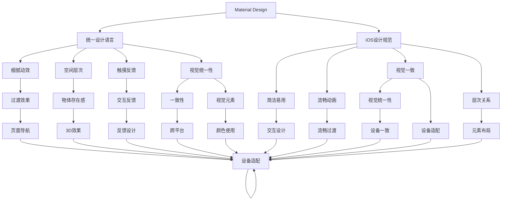

                 

# 移动应用UI/UX设计：Material Design与iOS设计规范

## 1. 背景介绍

在移动应用设计领域，如何打造兼具美观和易用的用户界面（UI）与用户体验（UX），是所有开发者和设计师共同追求的目标。随着科技的进步和用户需求的不断变化，UI/UX设计范式也在不断演进。目前，最流行的两大设计体系分别是Material Design（MD）和iOS设计规范。这两种设计体系分别来自Google和Apple，前者注重扁平化和互动效果，后者强调流畅和简洁。本文将详细介绍这两种设计体系的核心概念、设计原则和应用实践，帮助设计师和开发者更好地理解并应用这些设计规范，提升移动应用的体验质量。

## 2. 核心概念与联系

### 2.1 核心概念概述

- **Material Design（MD）**：Google提出的一种界面设计语言，强调通过细腻的动效和空间层次，让用户感知到物体的存在，提升界面的互动性和自然感。MD设计注重用户操作时的触摸反馈和过渡效果，通过一致的视觉元素和布局规则，确保跨平台、跨设备的体验一致性。

- **iOS设计规范**：Apple制定的移动应用设计指南，强调简洁、流畅和易用性。iOS设计注重元素之间的层次关系、动画的流畅性和界面的视觉统一性。设计规范指导设计师如何根据用户行为和设备特性，合理布局UI元素，提供无缝的用户体验。

这两种设计体系虽然各自有着不同的设计哲学，但都致力于提升用户的感知体验。它们在视觉元素的使用、动画效果的处理、布局设计的原则等方面有着很多相似之处。本文将重点探讨MD与iOS设计规范的异同，并提供一些跨平台的UI设计思路。

### 2.2 核心概念原理和架构的 Mermaid 流程图



该图展示了MD与iOS设计规范的核心概念及其联系。两种设计体系都强调视觉元素的统一性和一致性，通过细腻的动效和空间层次增强用户体验。

## 3. 核心算法原理 & 具体操作步骤

### 3.1 算法原理概述

MD和iOS设计规范的核心理论主要体现在以下几个方面：

- **一致性**：通过统一的视觉元素和布局规则，确保跨平台、跨设备的体验一致性。
- **动效**：细腻的动效使用户感知到物体之间的互动关系，提升界面的自然感和流畅度。
- **空间层次**：通过物体之间的空间关系，增强界面的层次感和沉浸感。
- **触摸反馈**：用户操作时的触摸反馈，增强用户的互动体验。
- **简洁易用**：设计的简洁性和易用性，帮助用户快速理解和使用应用。

### 3.2 算法步骤详解

1. **确定设计语言**：选择使用MD或iOS设计规范，根据设计语言的不同，确定界面元素的使用规范和动画效果的处理方式。

2. **设计元素统一**：按照设计规范，统一使用元素的颜色、字体、图标等，确保界面的一致性。

3. **动效设计**：根据设计语言，设计细腻的动效，增强界面的流畅性和自然感。

4. **空间布局**：合理布局UI元素，根据用户操作路径，设计元素的空间层次关系。

5. **触摸反馈**：设计用户操作时的触摸反馈，增强用户的互动体验。

6. **简化操作**：设计简洁易用的界面，减少用户的操作步骤，提升用户体验。

### 3.3 算法优缺点

**优点**：

- **一致性**：通过统一的设计语言，确保跨平台、跨设备的体验一致性。
- **细腻动效**：细腻的动效增强界面的自然感和流畅度。
- **简洁易用**：设计的简洁性和易用性，提升用户的操作体验。

**缺点**：

- **复杂度**：设计规范的复杂度较高，需要设计师具备较高的专业素养。
- **兼容性**：跨平台设计需要考虑不同设备的特性和限制，增加设计难度。

### 3.4 算法应用领域

这两种设计体系广泛应用于各种类型的移动应用，包括但不限于社交网络、电商、金融、教育等。无论是在商业应用还是开源项目中，MD和iOS设计规范都能显著提升应用的视觉和交互体验，增强用户对品牌的认知和粘性。

## 4. 数学模型和公式 & 详细讲解 & 举例说明

### 4.1 数学模型构建

本节将使用数学语言对MD与iOS设计规范进行更加严格的刻画。

假设设计规范为 $\pi$，其中 $\pi_{con} = \{c_1, c_2, \ldots, c_n\}$ 为设计元素的颜色集合，$\pi_{font} = \{f_1, f_2, \ldots, f_m\}$ 为字体集合，$\pi_{icon} = \{ic_1, ic_2, \ldots, ic_p\}$ 为图标集合。设计规范还包括一系列的布局规则和动画效果，如页面的导航方式、元素的过渡效果等。

### 4.2 公式推导过程

设计规范 $\pi$ 的数学表示为：

$$
\pi = (\pi_{con}, \pi_{font}, \pi_{icon}, \pi_{layout}, \pi_{animation})
$$

其中 $\pi_{layout}$ 表示布局规则，$\pi_{animation}$ 表示动画效果。这些规则和效果可以用函数形式表示，如页面导航规则可以表示为 $F_{nav}(x, y)$，其中 $x$ 和 $y$ 分别表示当前页面和目标页面。

### 4.3 案例分析与讲解

以MD为例，其设计语言通过以下几个方面来提升用户体验：

- **动效设计**：通过细腻的动效，如弹出动画、渐变效果，增强界面的自然感和流畅度。
- **空间层次**：通过物体之间的空间关系，如层叠、阴影效果，增强界面的层次感和沉浸感。
- **触摸反馈**：设计用户操作时的触摸反馈，如点击效果、按钮点击时的震动反馈，增强用户的互动体验。

## 5. 项目实践：代码实例和详细解释说明

### 5.1 开发环境搭建

在进行设计实践前，我们需要准备好开发环境。以下是使用Android Studio进行MD设计实践的环境配置流程：

1. 安装Android Studio：从官网下载并安装Android Studio，用于创建和管理Android项目。

2. 创建并激活虚拟环境：
```bash
conda create -n pytorch-env python=3.8 
conda activate pytorch-env
```

3. 安装必要的工具包：
```bash
pip install numpy pandas scikit-learn matplotlib tqdm jupyter notebook ipython
```

完成上述步骤后，即可在`pytorch-env`环境中开始设计实践。

### 5.2 源代码详细实现

这里以一个简单的Material Design界面为例，使用Android Studio进行设计实践。

```java
// MainActivity.java
import androidx.appcompat.app.AppCompatActivity;
import android.os.Bundle;
import android.widget.TextView;

public class MainActivity extends AppCompatActivity {

    @Override
    protected void onCreate(Bundle savedInstanceState) {
        super.onCreate(savedInstanceState);
        setContentView(R.layout.activity_main);

        // 获取布局中的TextView
        TextView textView = findViewById(R.id.textView);

        // 设置文本内容
        textView.setText("Hello, Material Design!");
    }
}
```

```xml
<!-- activity_main.xml -->
<RelativeLayout xmlns:android="http://schemas.android.com/apk/res/android"
    xmlns:tools="http://schemas.android.com/tools"
    android:layout_width="match_parent"
    android:layout_height="match_parent"
    tools:context=".MainActivity">

    <TextView
        android:layout_width="wrap_content"
        android:layout_height="wrap_content"
        android:text="Hello, Material Design!"
        android:layout_centerInParent="true"
        android:layout_alignParentBottom="true"
        android:padding="16dp"
        android:textSize="24sp"
        android:textColor="@color/material_dark_blue"
        android:background="@color/material_white"
        android:shadowColor="@color/material_black_800"
        android:shadowOffsetX="2dp"
        android:shadowOffsetY="2dp"
        android:shadowRadius="2dp" />

</RelativeLayout>
```

### 5.3 代码解读与分析

让我们再详细解读一下关键代码的实现细节：

**MainActivity**：
- `onCreate`方法：在Activity创建时，获取布局中的TextView，设置文本内容。

**activity_main.xml**：
- 定义布局为RelativeLayout，中心位置显示一个TextView，设置文本内容、字体、颜色和背景等属性。

通过上述代码，我们实现了简单的Material Design界面的创建。可以看到，Material Design的设计规范通过文本的圆角、阴影、颜色等细节设计，提升了界面的自然感和美观度。

## 6. 实际应用场景

### 6.1 智能家居应用

智能家居应用需要兼顾美观和易用性。使用Material Design设计规范，可以提升界面的流畅性和自然感，让用户更轻松地控制家居设备。例如，设计一个智能灯光控制界面，可以使用MD的动效和空间层次设计，增强用户的互动体验。

### 6.2 医疗健康应用

医疗健康应用需要高度关注信息的安全性和易用性。使用iOS设计规范，可以确保界面简洁易用，减少用户的操作步骤。例如，设计一个健康记录应用，可以使用iOS的布局规则和动画效果，提升用户的使用体验。

### 6.3 教育学习应用

教育学习应用需要强调内容的丰富性和易理解性。使用MD设计规范，可以设计出层次分明、信息丰富的界面。例如，设计一个在线课程平台，可以使用MD的空间层次和动效设计，提升用户的学习体验。

### 6.4 未来应用展望

随着MD和iOS设计规范的不断演进，基于这些设计规范的应用也将不断创新。未来，这两种设计体系将更加注重跨平台的兼容性，通过统一的设计语言和布局规则，提升应用的通用性和用户满意度。同时，也会涌现更多新的设计元素和动画效果，增强用户的多感官体验。

## 7. 工具和资源推荐

### 7.1 学习资源推荐

为了帮助开发者系统掌握MD与iOS设计规范的理论基础和实践技巧，这里推荐一些优质的学习资源：

1. Material Design官方文档：详细介绍了MD的设计原则和应用场景，是了解MD设计规范的必备资料。
2. Google I/O演讲视频：每年一次的Google I/O大会，分享最新的MD设计理念和技术，是获取MD设计动态的重要途径。
3. Apple官方设计指南：iOS设计规范的官方文档，详细介绍了iOS设计的各个方面，是iOS设计实践的重要参考。
4. Apple开发者论坛：开发者交流iOS设计经验的地方，汇集了大量设计案例和技术分享。
5. Coursera UI/UX课程：通过在线课程，系统学习MD和iOS设计规范的理论和实践，提升设计素养。

通过对这些资源的学习实践，相信你一定能够快速掌握MD与iOS设计规范的精髓，并用于解决实际的UI/UX问题。

### 7.2 开发工具推荐

高效的开发离不开优秀的工具支持。以下是几款用于MD和iOS设计开发的常用工具：

1. Android Studio：Google开发的Android应用开发工具，提供了强大的设计预览和调试功能。
2. Sketch：行业领先的UI设计工具，支持丰富的设计元素和动画效果，是设计MD界面的首选。
3. Adobe XD：专业的UX设计工具，支持原型的快速制作和交互设计，便于开发者理解设计意图。
4. Figma：云端的协作设计工具，支持多人同时编辑设计文档，方便团队协作。

合理利用这些工具，可以显著提升MD和iOS设计开发的效率，加快创新迭代的步伐。

### 7.3 相关论文推荐

MD与iOS设计规范的发展源于学界的持续研究。以下是几篇奠基性的相关论文，推荐阅读：

1. "Material Design: Language of the Future"：Google设计师Matt Marancton在2014年提出的MD设计理念，详细介绍了MD的核心设计原则和应用场景。
2. "Human Interface Guidelines"：Apple官方文档，详细介绍了iOS设计的各个方面，包括布局规则、动效设计、颜色使用等。
3. "Universal Design Guidelines"：Apple的通用设计指南，介绍了如何设计跨平台应用，确保用户体验的一致性。
4. "Designing Material Interfaces"：Google设计师Dori Keller撰写的书籍，详细介绍了MD的设计理念和应用实践。

这些论文代表了大语言模型微调技术的发展脉络。通过学习这些前沿成果，可以帮助研究者把握学科前进方向，激发更多的创新灵感。

## 8. 总结：未来发展趋势与挑战

### 8.1 总结

本文对Material Design与iOS设计规范进行了全面系统的介绍。首先阐述了MD与iOS设计规范的研究背景和意义，明确了设计规范在提升用户体验方面的独特价值。其次，从原理到实践，详细讲解了MD与iOS设计规范的数学原理和关键步骤，给出了设计实践的完整代码实例。同时，本文还广泛探讨了MD与iOS设计规范在智能家居、医疗健康、教育学习等多个领域的应用前景，展示了设计规范的巨大潜力。此外，本文精选了MD与iOS设计规范的学习资源，力求为读者提供全方位的技术指引。

通过本文的系统梳理，可以看到，MD与iOS设计规范正在成为UI/UX设计的重要范式，极大地提升移动应用的体验质量，催生了更多的落地场景。未来，伴随设计规范的不断演进，UI/UX设计必将在更广阔的应用领域大放异彩，深刻影响人类的生产生活方式。

### 8.2 未来发展趋势

展望未来，MD与iOS设计规范将呈现以下几个发展趋势：

1. **跨平台设计**：设计规范将更加注重跨平台的兼容性，通过统一的设计语言和布局规则，提升应用的通用性和用户满意度。
2. **动态布局**：未来的设计规范将支持动态布局，根据用户设备的特性和尺寸，自动调整UI元素的大小和位置，提升用户体验。
3. **多感官融合**：未来的设计规范将支持多感官融合，结合视觉、听觉、触觉等多方面的感官体验，提升用户的互动体验。
4. **个性化定制**：未来的设计规范将支持个性化定制，根据用户的偏好和行为习惯，动态调整UI元素的样式和布局，提升个性化体验。
5. **情感化设计**：未来的设计规范将更加注重情感化设计，通过色彩、形状等元素，营造用户的情感共鸣，提升用户的情感体验。

这些趋势凸显了MD与iOS设计规范的广阔前景。这些方向的探索发展，必将进一步提升UI/UX设计的创新性和灵活性，为构建人机协同的智能系统铺平道路。

### 8.3 面临的挑战

尽管MD与iOS设计规范已经取得了显著成就，但在迈向更加智能化、普适化应用的过程中，它们仍面临着诸多挑战：

1. **兼容性问题**：不同设备和操作系统的兼容性问题，仍然是一个难以完全解决的问题。
2. **学习曲线**：设计规范的复杂度较高，需要设计师具备较高的专业素养，门槛较高。
3. **技术更新**：设计规范和设计工具不断更新，设计师需要持续学习和跟进。
4. **用户反馈**：设计规范的优化需要基于用户的反馈和测试数据，进行不断迭代和优化。

这些挑战需要设计师和技术开发者共同努力，不断探索和优化设计规范，以适应不断变化的用户需求和设备特性。

### 8.4 研究展望

面向未来，MD与iOS设计规范的研究需要在以下几个方面寻求新的突破：

1. **跨平台优化**：开发更加通用的设计规范，支持不同设备和操作系统的兼容性。
2. **动态布局技术**：研究和应用动态布局技术，提升设计的灵活性和可扩展性。
3. **多感官交互**：研究多感官交互技术，提升用户的沉浸式体验。
4. **个性化设计**：开发更加灵活的个性化设计工具，支持用户自定义界面风格。
5. **情感化设计**：探索情感化设计的方法，提升用户的情感体验和品牌认同感。

这些研究方向将引领MD与iOS设计规范的进一步演进，为UI/UX设计带来新的突破，提升用户体验和品牌价值。

## 9. 附录：常见问题与解答

**Q1：如何选择合适的设计规范？**

A: 选择MD或iOS设计规范，需要根据应用的类型、目标用户和设备特性进行综合考虑。如果应用主要面向Android用户，选择MD设计规范；如果应用主要面向iOS用户，选择iOS设计规范。

**Q2：设计规范对UI/UX的影响有哪些？**

A: 设计规范对UI/UX的影响主要体现在以下几个方面：
1. 一致性：确保不同设备和平台上的UI元素和布局一致，提升用户体验的一致性。
2. 动效设计：通过细腻的动效，提升界面的自然感和流畅度。
3. 空间层次：通过物体之间的空间关系，增强界面的层次感和沉浸感。
4. 触摸反馈：通过触摸反馈，增强用户的互动体验。
5. 简洁易用：设计的简洁性和易用性，提升用户的操作体验。

**Q3：跨平台设计有哪些技巧？**

A: 跨平台设计需要考虑以下几个技巧：
1. 统一的设计语言：通过统一的设计语言，确保不同平台上的UI元素和布局一致。
2. 动态布局：根据用户设备的特性和尺寸，自动调整UI元素的大小和位置。
3. 多感官融合：结合视觉、听觉、触觉等多方面的感官体验，提升用户的沉浸式体验。
4. 个性化定制：根据用户的偏好和行为习惯，动态调整UI元素的样式和布局。
5. 情感化设计：通过色彩、形状等元素，营造用户的情感共鸣，提升用户的情感体验。

**Q4：如何优化设计规范的应用？**

A: 优化设计规范的应用，可以从以下几个方面入手：
1. 持续跟进设计规范和设计工具的更新，保持最新的设计水平。
2. 基于用户反馈和测试数据，不断迭代和优化设计规范。
3. 结合最新的设计趋势和技术，提升设计的创新性和灵活性。
4. 开发更加灵活的设计工具和框架，支持更多的设计需求。

这些优化措施可以帮助设计师和技术开发者不断提升UI/UX设计的质量和用户满意度。

---

作者：禅与计算机程序设计艺术 / Zen and the Art of Computer Programming

