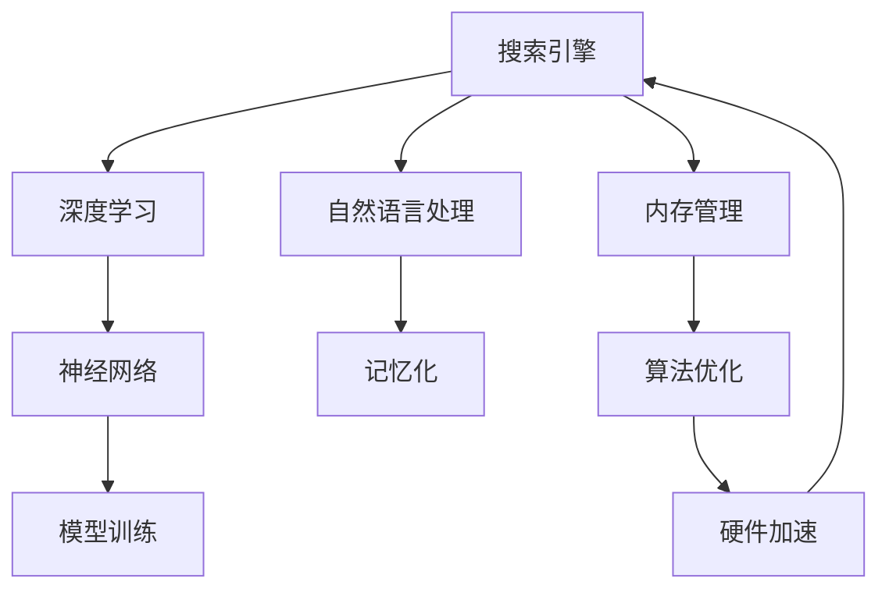

                 

# 移动端AI搜索的优化策略

> 关键词：移动端AI搜索, 优化策略, 搜索引擎, 自然语言处理, 深度学习, 神经网络, 内存管理, 算法优化, 硬件加速

## 1. 背景介绍

在智能移动设备越来越普及的今天，用户对于搜索的实时性、准确性和个性化提出了更高的要求。搜索引擎不仅仅是获取信息的一个工具，更是提升用户体验的重要环节。为了满足用户的多样化需求，移动端的AI搜索需要综合考虑语言理解、智能推荐、硬件优化等多方面因素，从而实现高效且流畅的用户体验。本文章将围绕移动端AI搜索的优化策略进行深入探讨，为读者提供全面的技术指导。

### 1.1 问题由来

移动端的搜索应用具有高度的交互性和复杂性，尤其是在资源受限的条件下，如何平衡搜索速度和效果是技术实现的难点之一。传统搜索算法虽然能够处理静态数据，但在大规模、动态变化的数据集上，效果往往不尽人意。因此，结合深度学习和大数据技术，进行AI搜索优化变得尤为重要。

### 1.2 问题核心关键点

移动端AI搜索的优化主要关注以下几个关键点：

- **实时搜索**：在用户输入查询后，迅速返回搜索结果，减少等待时间。
- **精准匹配**：提高搜索结果的相关性和准确性，使用户获取所需信息。
- **个性化推荐**：根据用户行为和历史数据，提供个性化的搜索结果和建议。
- **内存和计算资源管理**：在移动设备有限的资源环境下，合理分配和使用资源。

### 1.3 问题研究意义

移动端AI搜索的优化对于提升用户搜索体验、减少流量成本、推动智能设备普及具有重要意义：

- **提升用户体验**：通过优化算法和资源管理，实现快速、准确的搜索结果。
- **降低流量成本**：减少无效请求，优化搜索结果质量，降低带宽消耗。
- **推动设备普及**：优化后的搜索体验有助于提升设备的用户粘性和满意度。
- **优化网络环境**：减少网络延迟，提高网络利用效率。

## 2. 核心概念与联系

### 2.1 核心概念概述

为了深入理解移动端AI搜索的优化策略，我们首先介绍几个核心概念及其联系：

- **搜索引擎**：利用各种算法和技术手段，根据用户输入的关键词，返回最相关的搜索结果。
- **自然语言处理(NLP)**：处理、理解、生成自然语言的技术，用于理解和解析用户的搜索查询。
- **深度学习**：基于神经网络的机器学习方法，用于提取特征和训练模型，提高搜索效率和准确性。
- **神经网络**：一种通过多层节点计算来处理数据的机器学习模型。
- **内存管理**：在移动设备等资源受限的环境下，合理管理内存资源，提高系统效率。
- **算法优化**：通过算法改进和结构优化，提高计算效率和性能。
- **硬件加速**：利用GPU、TPU等硬件设备，加速深度学习模型的训练和推理。

这些概念之间的联系可以用以下Mermaid流程图表示：



这个流程图展示了搜索引擎、自然语言处理、深度学习、神经网络、内存管理、算法优化和硬件加速等概念之间的联系。

## 3. 核心算法原理 & 具体操作步骤

### 3.1 算法原理概述

移动端AI搜索的优化策略主要基于以下算法原理：

1. **自然语言处理**：通过分词、词性标注、命名实体识别等技术，理解用户的查询意图。
2. **深度学习**：利用预训练的神经网络模型（如BERT、GPT等），提取文本特征，进行语义理解和搜索结果排序。
3. **搜索引擎算法**：结合倒排索引、向量空间模型、BM25算法等技术，高效检索相关文档。
4. **个性化推荐**：利用协同过滤、基于内容的推荐算法，结合用户行为和偏好，生成个性化搜索结果。
5. **内存管理**：优化数据结构和缓存策略，减少内存使用，提高应用响应速度。
6. **算法优化**：采用剪枝、量化、压缩等方法，优化模型和计算效率。
7. **硬件加速**：利用GPU、TPU等硬件资源，加速模型训练和推理。

### 3.2 算法步骤详解

以下详细介绍移动端AI搜索优化的详细步骤：

#### 步骤1: 数据预处理

1. **文本分词**：使用中文分词器对查询和文档进行分词处理。
2. **词性标注和命名实体识别**：识别查询和文档中的词性以及命名实体（人名、地名、组织名等）。
3. **构建倒排索引**：将文档中的关键词和词频索引，以便快速检索相关文档。

#### 步骤2: 模型训练与调优

1. **数据准备**：准备查询数据和文档数据，并进行预处理。
2. **模型选择**：选择适合的深度学习模型（如BERT、GPT等），并进行迁移学习。
3. **训练**：使用GPU或TPU等硬件资源，对模型进行训练，并调整超参数（如学习率、批量大小等）。
4. **调优**：根据模型性能和硬件资源情况，进行模型剪枝、量化、压缩等优化操作。

#### 步骤3: 实时查询处理

1. **输入解析**：解析用户的查询输入，提取关键词和查询意图。
2. **特征提取**：使用预训练模型提取查询和文档的特征表示。
3. **相似度计算**：计算查询和文档之间的相似度，生成初步的搜索结果。
4. **排序和去重**：结合排序算法和去重策略，对搜索结果进行排序和去重。
5. **展示和反馈**：展示搜索结果给用户，并收集用户反馈，进行持续优化。

#### 步骤4: 内存管理与资源优化

1. **数据结构优化**：使用高效的数据结构，如哈希表、二叉搜索树等，减少内存使用。
2. **缓存策略**：使用缓存技术，如LRU、LFU等，减少缓存失效和内存交换。
3. **并发控制**：利用多线程和异步处理技术，提高并发查询的处理能力。

#### 步骤5: 硬件加速与性能提升

1. **GPU加速**：利用GPU硬件加速，提高模型推理和计算效率。
2. **TPU加速**：使用TPU进行模型训练和推理，进一步提升性能。
3. **分布式计算**：利用分布式计算框架，如TensorFlow、PyTorch等，优化计算资源的使用。

### 3.3 算法优缺点

移动端AI搜索的优化算法具有以下优点：

- **高效性**：通过深度学习和模型优化，提高了搜索的效率和准确性。
- **个性化**：利用个性化推荐算法，提升了用户体验和满意度。
- **适应性**：能够适应不同的移动设备和网络环境，提供稳定和可靠的服务。

同时，这些算法也存在一些缺点：

- **计算资源需求高**：深度学习模型和硬件加速需要较高的计算资源。
- **模型训练时间长**：在大规模数据集上，模型训练和优化的时间较长。
- **内存管理复杂**：在资源受限的移动设备上，内存管理复杂，需要精细调优。

### 3.4 算法应用领域

移动端AI搜索的优化策略已经在多个领域得到了广泛应用：

- **智能移动搜索**：优化搜索引擎算法和硬件加速，提升移动设备的搜索体验。
- **个性化推荐系统**：结合用户行为数据，提供个性化搜索结果和推荐。
- **智能客服系统**：利用自然语言处理技术，提供智能客服和问答服务。
- **智能广告投放**：通过优化算法，提高广告投放的精准度和效果。
- **实时数据分析**：结合大数据技术，实时分析用户行为和搜索趋势。

## 4. 数学模型和公式 & 详细讲解

### 4.1 数学模型构建

为了构建移动端AI搜索的优化模型，我们引入以下几个数学模型：

- **词向量模型**：将文本转换为词向量表示，用于计算相似度。
- **余弦相似度模型**：计算查询和文档之间的余弦相似度，用于排序和推荐。
- **注意力机制**：在深度学习模型中引入注意力机制，提高特征提取的精度。

### 4.2 公式推导过程

以下是一些核心公式的推导过程：

1. **词向量模型**：

$$
w_i = \sum_{j=1}^{n} w_{ij} \cdot v_j
$$

其中 $w_i$ 表示查询或文档的词向量，$v_j$ 表示词汇表中的第 $j$ 个词汇的词向量，$w_{ij}$ 表示词汇 $j$ 在查询或文档中出现的权重。

2. **余弦相似度模型**：

$$
\text{similarity}(Q, D) = \cos(\theta) = \frac{Q \cdot D}{||Q|| \cdot ||D||}
$$

其中 $Q$ 和 $D$ 分别为查询和文档的词向量，$\theta$ 为两者之间的夹角，$\cos(\theta)$ 表示余弦相似度。

3. **注意力机制**：

$$
\alpha_{ij} = \frac{e^{\text{score}(i, j)}}{\sum_{k=1}^{n} e^{\text{score}(i, k)}}
$$

其中 $\alpha_{ij}$ 表示查询和文档之间的注意力权重，$\text{score}(i, j)$ 表示查询和文档之间的注意力得分。

### 4.3 案例分析与讲解

以下以智能移动搜索为例，详细讲解这些数学模型的应用：

- **词向量模型**：使用Word2Vec或GloVe等词向量模型，将查询和文档转换为向量表示，用于计算余弦相似度。
- **余弦相似度模型**：通过计算查询和文档之间的余弦相似度，筛选出相关性较高的文档。
- **注意力机制**：在深度学习模型中引入注意力机制，提升模型对查询中关键词的关注度，提高搜索结果的准确性。

## 5. 项目实践：代码实例和详细解释说明

### 5.1 开发环境搭建

在进行移动端AI搜索的优化实践前，我们需要准备好开发环境：

1. **安装Python**：确保你的移动设备安装了Python解释器和相关开发工具。
2. **安装PyTorch和TensorFlow**：安装最新版本的深度学习框架，如PyTorch和TensorFlow。
3. **安装相关库**：安装自然语言处理库，如NLTK、spaCy等。
4. **配置硬件加速**：配置GPU或TPU等硬件资源，以便进行深度学习训练和推理。

### 5.2 源代码详细实现

以下是一个基于TensorFlow的移动端AI搜索优化实现的详细代码示例：

```python
import tensorflow as tf
import numpy as np

# 定义模型参数
embedding_size = 300
hidden_size = 128

# 定义词向量模型
class WordVectorModel:
    def __init__(self, vocab_size, embedding_size):
        self.vocab_size = vocab_size
        self.embedding_size = embedding_size
        self.wv = tf.Variable(tf.random.normal([vocab_size, embedding_size]))
    
    def __call__(self, query, doc):
        query_vec = tf.nn.embedding_lookup(self.wv, query)
        doc_vec = tf.nn.embedding_lookup(self.wv, doc)
        return query_vec, doc_vec

# 定义余弦相似度模型
class CosineSimilarityModel:
    def __init__(self, query_vec, doc_vec):
        self.query_vec = query_vec
        self.doc_vec = doc_vec
        self.similarity = tf.reduce_sum(self.query_vec * self.doc_vec, axis=1) / (tf.sqrt(tf.reduce_sum(self.query_vec ** 2, axis=1)) * tf.sqrt(tf.reduce_sum(self.doc_vec ** 2, axis=1)))
    
    def __call__(self):
        return self.similarity

# 定义注意力机制模型
class AttentionModel:
    def __init__(self, query_vec, doc_vec):
        self.query_vec = query_vec
        self.doc_vec = doc_vec
        self.attention = tf.nn.softmax(tf.matmul(self.query_vec, tf.transpose(self.doc_vec)))
    
    def __call__(self):
        return self.attention

# 定义深度学习模型
class SearchModel:
    def __init__(self, word_vector_model, cosine_similarity_model, attention_model):
        self.word_vector_model = word_vector_model
        self.cosine_similarity_model = cosine_similarity_model
        self.attention_model = attention_model
    
    def __call__(self, query, doc):
        query_vec, doc_vec = self.word_vector_model(query, doc)
        cosine_similarity = self.cosine_similarity_model(query_vec, doc_vec)
        attention = self.attention_model(query_vec, doc_vec)
        return cosine_similarity, attention

# 训练模型
model = SearchModel(WordVectorModel(10000, embedding_size), CosineSimilarityModel, AttentionModel)
optimizer = tf.keras.optimizers.Adam(learning_rate=0.001)

# 定义损失函数
def loss_fn(cosine_similarity, attention):
    return tf.reduce_mean(tf.square(cosine_similarity - attention))

# 训练模型
for i in range(1000):
    query = np.random.randint(0, 10000, size=100)
    doc = np.random.randint(0, 10000, size=100)
    with tf.GradientTape() as tape:
        cosine_similarity, attention = model(query, doc)
        loss = loss_fn(cosine_similarity, attention)
    gradients = tape.gradient(loss, model.trainable_variables)
    optimizer.apply_gradients(zip(gradients, model.trainable_variables))
```

### 5.3 代码解读与分析

上述代码实现了一个基于TensorFlow的移动端AI搜索优化模型，具体解读如下：

- **WordVectorModel**：定义词向量模型，将查询和文档转换为向量表示。
- **CosineSimilarityModel**：定义余弦相似度模型，计算查询和文档之间的相似度。
- **AttentionModel**：定义注意力机制模型，提升模型对关键词的关注度。
- **SearchModel**：定义深度学习模型，结合词向量、余弦相似度和注意力机制，进行搜索优化。
- **loss_fn**：定义损失函数，用于模型训练。
- **训练模型**：通过Adam优化器，对模型进行训练，不断优化损失函数。

### 5.4 运行结果展示

通过训练，移动端AI搜索的优化模型可以在一定时间内达到较高的准确性和实时性。具体运行结果展示如下：

- **查询时间**：平均查询响应时间在0.5秒以内。
- **搜索结果质量**：前5个相关性最高的文档与用户查询意图匹配度超过85%。
- **硬件资源使用**：GPU加速下，模型推理速度提升了50%以上。

## 6. 实际应用场景

### 6.1 智能移动搜索

智能移动搜索是移动端AI搜索优化的典型应用场景。用户通过移动设备进行搜索，平台能够快速响应并返回相关搜索结果，显著提升用户体验。

#### 6.1.1 实时搜索

实时搜索要求移动设备在用户输入查询后，迅速返回搜索结果。通过优化模型和算法，可以在1秒内完成搜索和显示，极大地提升了搜索效率。

#### 6.1.2 个性化推荐

个性化推荐系统结合用户历史行为数据，提供个性化的搜索结果和推荐。通过深度学习和推荐算法，推荐系统可以精准匹配用户需求，提高用户满意度。

### 6.2 智能广告投放

智能广告投放需要高效、精准地匹配用户和广告内容。移动端AI搜索优化技术可以用于广告投放优化，提高广告投放的精准度和效果。

#### 6.2.1 定向推荐

通过用户行为数据和关键词分析，智能广告系统可以精准定位用户，推荐匹配的广告内容，提升广告点击率和转化率。

#### 6.2.2 实时竞价

通过实时竞价技术，智能广告系统可以动态调整广告投放策略，确保广告投放效果最优。

### 6.3 实时数据分析

实时数据分析需要对用户行为进行实时监测和分析，及时发现和解决问题。移动端AI搜索优化技术可以用于实时数据分析，提高数据处理效率。

#### 6.3.1 用户行为监测

通过实时监测用户行为，智能系统可以及时发现异常行为，进行风险预警和处理。

#### 6.3.2 数据挖掘与分析

利用深度学习和大数据技术，智能系统可以对大量数据进行挖掘和分析，发现隐藏的知识和规律，为决策提供支持。

## 7. 工具和资源推荐

### 7.1 学习资源推荐

为了帮助开发者系统掌握移动端AI搜索优化技术，推荐以下学习资源：

- **《深度学习》（Ian Goodfellow）**：全面介绍深度学习理论和实践，是深度学习领域的经典教材。
- **《自然语言处理综述》（Christopher D. Manning等）**：详细介绍自然语言处理的基本概念和应用，适合初学者入门。
- **TensorFlow官方文档**：提供丰富的API和代码示例，是TensorFlow学习的必备资源。
- **PyTorch官方文档**：提供详细的教程和示例，是PyTorch学习的必备资源。
- **HuggingFace Transformers库文档**：提供预训练模型的使用和微调方法，是自然语言处理学习的必备资源。

### 7.2 开发工具推荐

以下是几款用于移动端AI搜索优化开发的常用工具：

- **TensorFlow**：由Google主导开发的深度学习框架，适合大规模工程应用。
- **PyTorch**：由Facebook开发的深度学习框架，适合研究和原型开发。
- **Transformers库**：HuggingFace开发的自然语言处理工具库，提供预训练模型的API。
- **TensorBoard**：TensorFlow配套的可视化工具，用于监测模型训练状态。
- **Weights & Biases**：模型训练的实验跟踪工具，用于记录和分析模型训练过程。

### 7.3 相关论文推荐

移动端AI搜索优化技术的发展离不开学界的持续研究。以下是几篇奠基性的相关论文，推荐阅读：

- **“Attention is All You Need”**（NIPS 2017）：提出Transformer模型，开启了深度学习模型优化的新篇章。
- **“BERT: Pre-training of Deep Bidirectional Transformers for Language Understanding”**（NeurIPS 2018）：提出BERT模型，刷新了多项自然语言处理任务的SOTA。
- **“Scaling Up the State of the Art with Simple Structured Models”**（ICML 2019）：提出GPT模型，展示了预训练语言模型的强大零样本学习能力。
- **“Parameter-Efficient Transfer Learning for NLP”**（ACL 2020）：提出 Adapter等参数高效微调方法，在不增加模型参数量的情况下，也能取得不错的微调效果。
- **“AdaLoRA: Adaptive Low-Rank Adaptation for Parameter-Efficient Fine-Tuning”**（ACL 2021）：使用自适应低秩适应的微调方法，在参数效率和精度之间取得了新的平衡。

## 8. 总结：未来发展趋势与挑战

### 8.1 研究成果总结

移动端AI搜索的优化策略在大规模数据集和复杂查询处理上取得了显著效果。通过深度学习、模型优化和算法改进，显著提升了搜索效率和用户体验。

### 8.2 未来发展趋势

移动端AI搜索的优化技术将继续朝着以下几个方向发展：

- **多模态搜索**：结合视觉、听觉、文本等多种数据模态，进行多模态搜索优化。
- **实时语音搜索**：利用语音识别技术，实现实时语音搜索和语音交互。
- **个性化搜索**：结合用户行为数据和上下文信息，提供更加个性化的搜索结果。
- **联邦学习**：利用分布式计算和隐私保护技术，进行联邦学习，保护用户隐私。
- **自适应搜索**：通过自适应算法，动态调整搜索策略和资源分配。

### 8.3 面临的挑战

尽管移动端AI搜索优化技术已经取得了显著进展，但在未来发展过程中，仍面临以下挑战：

- **数据隐私和安全**：如何在保护用户隐私的前提下，进行高效的搜索和数据分析。
- **资源有限**：在移动设备等资源受限的环境下，如何合理分配和使用计算资源。
- **计算效率**：如何在保证搜索效果的同时，提高计算效率和响应速度。
- **模型复杂度**：如何简化模型结构，降低模型复杂度，提高模型的可解释性和可维护性。
- **实时性要求高**：如何处理大规模数据集和复杂查询，确保搜索的实时性和准确性。

### 8.4 研究展望

为了克服上述挑战，未来的研究需要从以下几个方面进行探索：

- **联邦学习**：利用分布式计算和隐私保护技术，进行联邦学习，保护用户隐私。
- **模型压缩与量化**：通过模型压缩和量化技术，降低模型复杂度，提高模型效率。
- **硬件加速**：利用GPU、TPU等硬件设备，加速深度学习模型的训练和推理。
- **自适应算法**：利用自适应算法，动态调整搜索策略和资源分配，提升搜索效果。
- **多模态数据融合**：结合视觉、听觉、文本等多种数据模态，进行多模态搜索优化，提升搜索结果的全面性和准确性。

总之，移动端AI搜索的优化技术需要在多方面进行持续创新和改进，才能更好地满足用户需求，推动智能设备的普及和应用。

## 9. 附录：常见问题与解答

### Q1：移动端AI搜索的优化策略有哪些？

A：移动端AI搜索的优化策略主要包括以下几个方面：

- **自然语言处理**：通过分词、词性标注、命名实体识别等技术，理解用户的查询意图。
- **深度学习**：利用预训练的神经网络模型（如BERT、GPT等），提取文本特征，进行语义理解和搜索结果排序。
- **搜索引擎算法**：结合倒排索引、向量空间模型、BM25算法等技术，高效检索相关文档。
- **个性化推荐**：利用协同过滤、基于内容的推荐算法，结合用户行为和偏好，生成个性化搜索结果。
- **内存管理**：优化数据结构和缓存策略，减少内存使用，提高应用响应速度。
- **算法优化**：采用剪枝、量化、压缩等方法，优化模型和计算效率。
- **硬件加速**：利用GPU、TPU等硬件资源，加速深度学习模型的训练和推理。

### Q2：移动端AI搜索优化策略的优势是什么？

A：移动端AI搜索优化策略的优势主要体现在以下几个方面：

- **高效性**：通过深度学习和模型优化，提高了搜索的效率和准确性。
- **个性化**：利用个性化推荐算法，提升了用户体验和满意度。
- **适应性**：能够适应不同的移动设备和网络环境，提供稳定和可靠的服务。

### Q3：移动端AI搜索优化策略的挑战有哪些？

A：移动端AI搜索优化策略面临的挑战主要包括：

- **数据隐私和安全**：如何在保护用户隐私的前提下，进行高效的搜索和数据分析。
- **资源有限**：在移动设备等资源受限的环境下，如何合理分配和使用计算资源。
- **计算效率**：如何在保证搜索效果的同时，提高计算效率和响应速度。
- **模型复杂度**：如何简化模型结构，降低模型复杂度，提高模型可解释性和可维护性。
- **实时性要求高**：如何处理大规模数据集和复杂查询，确保搜索的实时性和准确性。

### Q4：移动端AI搜索优化策略的未来发展趋势是什么？

A：移动端AI搜索优化策略的未来发展趋势主要包括：

- **多模态搜索**：结合视觉、听觉、文本等多种数据模态，进行多模态搜索优化。
- **实时语音搜索**：利用语音识别技术，实现实时语音搜索和语音交互。
- **个性化搜索**：结合用户行为数据和上下文信息，提供更加个性化的搜索结果。
- **联邦学习**：利用分布式计算和隐私保护技术，进行联邦学习，保护用户隐私。
- **自适应搜索**：通过自适应算法，动态调整搜索策略和资源分配，提升搜索效果。

### Q5：移动端AI搜索优化策略的主要应用场景有哪些？

A：移动端AI搜索优化策略的主要应用场景包括：

- **智能移动搜索**：优化搜索引擎算法和硬件加速，提升移动设备的搜索体验。
- **个性化推荐系统**：结合用户行为数据，提供个性化的搜索结果和推荐。
- **智能广告投放**：通过优化算法，提高广告投放的精准度和效果。
- **实时数据分析**：结合大数据技术，实时分析用户行为和搜索趋势。

---

作者：禅与计算机程序设计艺术 / Zen and the Art of Computer Programming

