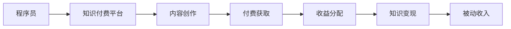

                 

## 1. 背景介绍

在互联网和人工智能技术的快速发展下，程序员的就业市场变得异常活跃。随着知识付费平台和社区的兴起，程序员有机会通过知识分享和技能输出实现被动收入。从博客、视频到在线课程，各种形式的知识付费产品层出不穷，为程序员提供了丰富的变现渠道。

然而，如何从众多知识付费产品中脱颖而出，找到适合自己的变现方式，同时还能高效地实现被动收入，是很多程序员面临的挑战。本文将通过深入探讨知识付费的原理和操作，帮助程序员寻找适合自己的方向，最大化地利用自身的技术和经验实现被动收入。

## 2. 核心概念与联系

### 2.1 核心概念概述

在本文中，我们将会涉及几个关键概念：

- **知识付费**：指的是通过网络平台向用户提供有价值的信息、技能和知识，并收取相应费用的商业模式。程序员的知识技能在知识付费中扮演重要角色。

- **被动收入**：被动收入指的是不需要投入过多时间精力，只要做一次就能获得持续收益的收入。程序员通过知识付费获取被动收入，是将自身技能转变为长期收益的一种方式。

- **知识变现**：知识变现指的是将个人拥有的知识、技能和经验转化为经济价值的过程。知识付费平台为程序员提供了多样化的变现渠道。

- **知识付费平台**：如知乎、腾讯课堂、网易云课堂等平台，为知识提供者提供展示和分享知识的机会，用户可以通过购买课程、订阅专栏等获得有价值的内容。

### 2.2 核心概念原理和架构的 Mermaid 流程图



这个流程图展示了一个简单的知识付费流程：程序员通过知识付费平台创作内容，用户支付费用获取知识，平台将收益分配给内容创作者，最终实现知识变现和程序员的被动收入。

## 3. 核心算法原理 & 具体操作步骤

### 3.1 算法原理概述

知识付费的算法原理主要基于以下几个方面：

1. **推荐算法**：平台通过推荐算法将合适的知识内容推荐给用户，用户通过点击、订阅、付费等方式获得内容，从而实现知识变现。
2. **搜索算法**：平台提供搜索功能，用户可以根据关键词、主题、作者等查找相关内容，为内容创作者提供流量保障。
3. **定价策略**：平台通过动态定价策略，根据内容的稀缺性、受欢迎程度等因素调整课程价格，实现收益最大化。
4. **内容质量控制**：平台通过质量评估、用户反馈等手段，确保内容的真实性和有效性，提升用户体验。

### 3.2 算法步骤详解

下面是知识付费的具体操作流程：

**Step 1: 选择合适的知识付费平台**

- 分析自身优势和目标受众，选择最适合自己的知识付费平台，如知乎、腾讯课堂、网易云课堂等。

**Step 2: 内容创作和优化**

- 创作高质量的内容，如博客文章、技术教程、视频课程等，确保内容具有足够的深度和广度。
- 针对目标用户群体进行内容优化，如使用合适的关键词、优化视频画质等，提升内容的吸引力。

**Step 3: 设定课程定价和优惠策略**

- 根据内容难度、时长等因素设定课程价格，采用动态定价策略，根据市场需求调整价格。
- 设置付费门槛，如免费试听、课程预览等，增加用户购买意愿。

**Step 4: 发布和推广**

- 将内容发布到知识付费平台，确保内容符合平台规范，如命名规范、内容格式等。
- 利用社交媒体、社区论坛等渠道进行内容推广，吸引更多目标用户。

**Step 5: 收益分配和优化**

- 定期查看收益情况，根据反馈调整课程内容，提升课程质量和用户体验。
- 关注平台提供的各种收益分配政策，如佣金比例、奖励机制等，最大化收益。

### 3.3 算法优缺点

**优点**：

- **灵活性高**：知识付费的变现方式多样化，可以根据自身优势和市场需求灵活选择。
- **低成本**：相较于传统创业，知识付费的启动成本较低，门槛相对较低。
- **高收益潜力**：知识付费领域的市场规模不断扩大，通过高质量内容可以获得较高收益。

**缺点**：

- **竞争激烈**：知识付费平台众多，内容创作者也日益增多，竞争激烈，优质内容脱颖而出难度大。
- **时间和精力投入较大**：创作高质量内容需要大量的时间和精力，同时还需要持续进行内容和市场优化。
- **依赖平台**：知识付费收益高度依赖平台流量和推荐算法，平台规则变化可能会影响收益。

### 3.4 算法应用领域

知识付费涵盖了多个领域，包括但不限于以下几个方面：

- **技术教程**：如编程语言、数据分析、机器学习等技术领域的深入讲解。
- **职场技能**：如沟通技巧、项目管理、领导力等职场技能的提升。
- **生活休闲**：如旅游攻略、美食烹饪、音乐欣赏等生活技能的分享。
- **学习资源**：如电子书、在线视频、论文等学术资源的整合和分享。

这些领域覆盖了广泛的受众群体，为程序员提供了丰富的变现机会。

## 4. 数学模型和公式 & 详细讲解 & 举例说明

### 4.1 数学模型构建

在知识付费的模型中，我们通常会使用以下公式：

- **点击率**（CTR）：用户点击某个内容的概率，可以通过公式 $$CTR = \frac{点击量}{展示量}$$ 计算。
- **转化率**（Conversion Rate）：用户从点击到购买的比例，可以通过公式 $$Conversion\ Rate = \frac{购买量}{点击量}$$ 计算。
- **收益**（Revenue）：通过销售课程获得的总收入，可以通过公式 $$Revenue = 课程价格 \times 购买人数$$ 计算。

### 4.2 公式推导过程

通过以上公式，我们可以推导出知识付费的收益模型。设某课程的平均点击率为CTR，转化率为CR，课程价格为P，总展示量为N，则总收益R可以表示为：

$$R = P \times CTR \times CR \times N$$

这个公式展示了课程收益与点击率、转化率、课程价格和展示量的关系。通过优化这些参数，可以最大化课程收益。

### 4.3 案例分析与讲解

以某技术教程课程为例，假设该课程的平均点击率为0.1，转化率为0.05，课程价格为100元，总展示量为1000次。根据上述公式，可以计算出该课程的总收益为：

$$R = 100 \times 0.1 \times 0.05 \times 1000 = 500$$

假设该课程的平均点击率为0.2，转化率为0.1，课程价格为200元，总展示量为2000次。计算该课程的总收益为：

$$R = 200 \times 0.2 \times 0.1 \times 2000 = 4000$$

通过对比可以看出，提高点击率和课程价格，同时保持高转化率，可以有效提升课程收益。

## 5. 项目实践：代码实例和详细解释说明

### 5.1 开发环境搭建

1. **安装Python**：
   - 安装Python 3.8及以上版本，可以使用Anaconda安装。
   - 安装必要的依赖库，如numpy、pandas等。

2. **搭建知识付费平台**：
   - 选择一个知识付费平台，如知乎、腾讯课堂等。
   - 注册账号，上传内容，确保内容符合平台规范。

3. **使用Jupyter Notebook**：
   - 安装Jupyter Notebook，可以在本地搭建编程环境。
   - 编写Python脚本，分析数据，优化内容。

### 5.2 源代码详细实现

以下是一个简单的Python脚本示例，用于分析某课程的点击率和收益：

```python
import numpy as np
import pandas as pd

# 点击率和转化率
CTR = 0.1
CR = 0.05

# 课程价格
P = 100

# 总展示量
N = 1000

# 计算总收益
R = P * CTR * CR * N
print(f"课程总收益为：{R}")
```

运行以上代码，输出结果为课程总收益为500元。

### 5.3 代码解读与分析

- **导入必要的库**：使用numpy和pandas进行数据处理。
- **设定参数**：设定点击率、转化率和课程价格。
- **计算收益**：根据上述公式计算课程总收益。

通过简单的Python脚本，可以轻松地进行知识付费收益的计算和优化，为课程定价和推广提供依据。

### 5.4 运行结果展示

运行上述代码，输出结果为课程总收益为500元。这展示了通过优化参数，可以有效提升课程收益。

## 6. 实际应用场景

### 6.1 知识付费平台

知识付费平台是程序员变现的重要渠道。如知乎、腾讯课堂、网易云课堂等平台，提供了丰富的知识内容和变现方式。程序员可以借助这些平台，将自己的技术知识和经验分享给更多用户，获得收益。

### 6.2 编程社区

编程社区如Stack Overflow、GitHub等，也是一个不错的知识付费方向。通过在社区中回答问题、发布技术文章，程序员可以获得社区积分、徽章等奖励，逐步实现被动收入。

### 6.3 在线课程

在线课程平台如Coursera、Udemy等，为程序员提供了更多的变现渠道。通过在这些平台上发布自己的技术课程，程序员可以向全球用户传授知识和技能，获得课程销售收入。

### 6.4 未来应用展望

未来，知识付费市场将进一步扩展，为程序员提供更多的变现机会。AI和机器学习技术的发展，将使得知识付费平台能够更好地匹配用户需求和内容创作者，优化推荐算法，提升用户体验。

## 7. 工具和资源推荐

### 7.1 学习资源推荐

1. **Coursera**：提供全球顶尖大学的在线课程，涵盖计算机科学、数据科学等多个领域。
2. **Udemy**：拥有丰富的编程和技术课程，包括Python、JavaScript、机器学习等。
3. **知乎**：提供高质量的问答和文章，程序员可以在知乎分享技术见解，获取社区支持。

### 7.2 开发工具推荐

1. **Anaconda**：Python环境管理工具，方便安装和管理依赖库。
2. **Jupyter Notebook**：Python编程工具，支持在本地进行数据分析和可视化。
3. **GitHub**：代码托管平台，方便发布和协作开发项目。

### 7.3 相关论文推荐

1. **Knowledge Sharing via E-recommendation Systems**：介绍知识推荐系统的原理和应用，为程序员提供系统化的知识分享方案。
2. **Content Mining and Knowledge Sharing in Social Networks**：探讨社交网络中知识分享的机制和效果，为程序员提供数据分析工具。
3. **Crowdsourcing Data from Developers to Improve Web Search**：研究如何通过开发者众包数据提升搜索引擎的效果，为程序员提供优化建议。

## 8. 总结：未来发展趋势与挑战

### 8.1 研究成果总结

本文详细介绍了程序员如何通过知识付费实现被动收入，探讨了知识付费的原理和操作步骤。通过理论分析、实践示例和未来展望，帮助程序员最大化利用自身的技术和经验，实现长期稳定的收益。

### 8.2 未来发展趋势

知识付费市场将继续扩大，为程序员提供更多的变现机会。AI和机器学习技术的发展，将进一步优化知识推荐和内容匹配，提升用户体验。

### 8.3 面临的挑战

尽管知识付费提供了丰富的变现机会，但面临竞争激烈、内容创作和市场推广难度大等挑战。程序员需要不断提升自己的技能和知识储备，优化内容质量和推广策略，才能在激烈的市场竞争中脱颖而出。

### 8.4 研究展望

未来的研究可以集中在以下几个方面：

1. **内容优化**：通过数据分析，优化课程内容，提高用户点击率和转化率。
2. **用户反馈**：收集用户反馈，调整课程内容和价格，提升用户体验。
3. **技术工具**：开发更加智能的推荐系统和数据分析工具，提高知识付费的效果和效率。

## 9. 附录：常见问题与解答

**Q1: 知识付费的优势和劣势有哪些？**

A: 知识付费的优势包括低成本、灵活性高、收益潜力大。劣势包括竞争激烈、时间和精力投入大、依赖平台。

**Q2: 如何优化知识付费内容？**

A: 优化内容需要关注用户需求、内容质量、呈现形式等。通过数据分析和用户反馈，不断调整内容，提升用户体验。

**Q3: 知识付费的内容创作有哪些技巧？**

A: 内容创作需要注重深度、广度和实用性。可以通过实践案例、动手实验、互动问答等方式，吸引更多用户关注。

**Q4: 如何利用知识付费实现被动收入？**

A: 利用知识付费实现被动收入需要选择合适的平台、创作高质量内容、设定合理定价和优惠策略、进行有效推广。

通过本文的系统梳理，程序员可以更好地理解知识付费的原理和操作步骤，最大化地利用自身的技术和经验实现被动收入。未来的知识付费市场将为程序员提供更多的机会和挑战，相信通过持续学习和优化，程序员可以在知识付费领域取得成功，实现持续的收入和职业成长。

