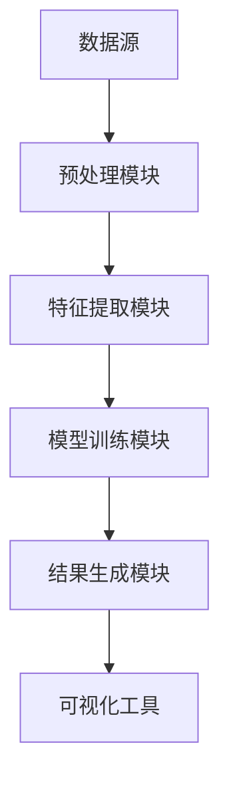
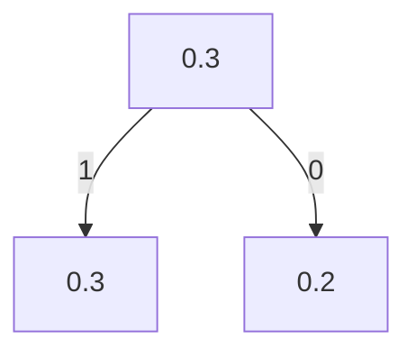

                 

# 程序员利用知识发现引擎提高解决问题能力

## 1. 背景介绍

在日新月异的IT领域，程序员每天都面临着新的技术挑战和问题。快速解决问题、提高工作效率是每个程序员的共同追求。近年来，知识发现(Knowledge Discovery, KD)技术在IT行业中的应用日益广泛，为程序员提高问题解决能力提供了新的思路和方法。

本文将介绍知识发现引擎的核心概念、工作原理、操作步骤，以及实际应用中的具体案例。通过深入浅出的讲解，帮助程序员掌握知识发现技术的精髓，充分利用知识发现引擎提高工作效率。

## 2. 核心概念与联系

### 2.1 核心概念概述

知识发现(Knowledge Discovery)是数据分析领域的核心技术之一，旨在从大量数据中自动或半自动地挖掘出有价值的模式、规律、关联等知识。知识发现的应用覆盖了数据挖掘、信息检索、智能推荐等多个领域，对于IT行业的技术迭代和业务创新具有重要意义。

本文重点介绍知识发现引擎的核心组件和关键技术。知识发现引擎通常由以下几个部分构成：

- **数据源**：包含原始数据，如日志文件、数据库记录、网络流量等。
- **预处理模块**：负责数据清洗、去噪、归一化等预处理操作，确保数据的完整性和可用性。
- **特征提取模块**：提取数据中的特征向量，用于模型训练和知识挖掘。
- **模型训练模块**：应用机器学习算法训练模型，发现数据中的隐含知识。
- **结果生成模块**：将挖掘出的知识转换为可用的形式，如模式图、关联规则、分类结果等。
- **可视化工具**：提供交互式界面，辅助用户理解分析结果，提取关键信息。

以上各组件通过数据的流动和转换，实现知识从数据中提取和展现。

### 2.2 核心概念原理和架构的 Mermaid 流程图



该图展示了知识发现引擎的工作流程：

1. 数据源提供原始数据。
2. 预处理模块对数据进行清洗和整理。
3. 特征提取模块将数据转化为特征向量。
4. 模型训练模块应用机器学习算法训练模型。
5. 结果生成模块生成分析结果。
6. 可视化工具帮助用户理解分析结果。

## 3. 核心算法原理 & 具体操作步骤

### 3.1 算法原理概述

知识发现引擎的核心算法主要包括分类、聚类、关联规则、异常检测等。本文重点介绍分类算法。分类算法通过模型学习样本数据的特征，将数据分为不同的类别。其核心原理为：

1. **特征选择**：从数据集中提取最具代表性的特征，用于训练分类器。
2. **模型训练**：应用机器学习算法，如决策树、随机森林、神经网络等，训练分类器。
3. **模型评估**：使用测试集评估分类器的性能，优化模型参数。
4. **模型应用**：将训练好的模型应用于新的数据样本，进行分类预测。

### 3.2 算法步骤详解

以下详细介绍知识发现引擎中分类算法的详细步骤：

#### 3.2.1 特征选择

特征选择是分类算法的第一步，用于从原始数据中提取最具代表性的特征。常用的特征选择方法包括：

- **卡方检验(Chi-square test)**：评估特征与分类标签之间的关联性，选择相关性较高的特征。
- **信息增益(Information gain)**：基于熵的概念，选择能够最大化分类信息增益的特征。
- **相关系数(Correlation coefficient)**：计算特征与分类标签之间的相关性，选择相关性较高的特征。

#### 3.2.2 模型训练

选择合适的机器学习算法，使用特征向量训练分类器。常用的算法包括：

- **决策树(Decision Tree)**：基于树形结构进行分类决策。
- **随机森林(Random Forest)**：由多棵决策树组成，通过投票决定分类结果。
- **神经网络(Neural Network)**：通过多层神经元模型学习数据特征，实现非线性分类。

#### 3.2.3 模型评估

使用测试集评估分类器的性能，常用的评估指标包括：

- **准确率(Accuracy)**：分类正确的样本数占总样本数的比例。
- **精确率(Precision)**：分类为正类的样本中，真正为正类的样本数占总正类样本数的比例。
- **召回率(Recall)**：真正为正类的样本中，分类为正类的样本数占总正类样本数的比例。

#### 3.2.4 模型应用

将训练好的模型应用于新的数据样本，进行分类预测。具体步骤包括：

1. 对新数据进行特征提取，得到特征向量。
2. 将特征向量输入分类器，进行分类预测。
3. 根据分类结果进行后续处理。

### 3.3 算法优缺点

知识发现引擎的分类算法具有以下优点：

1. **自动化程度高**：通过自动化的特征选择和模型训练，减少了人工干预，提高了工作效率。
2. **泛化能力强**：利用历史数据训练模型，模型能够适应新数据，泛化能力强。
3. **可解释性强**：分类器生成可解释的决策路径，便于用户理解和调试。

同时，也存在一些缺点：

1. **数据依赖性强**：分类器的性能依赖于数据质量和特征选择，数据偏差可能影响结果。
2. **模型复杂度高**：复杂的分类器如神经网络，需要大量计算资源和数据量。
3. **过拟合风险高**：训练数据不足时，分类器容易过拟合，泛化能力下降。

### 3.4 算法应用领域

知识发现引擎的分类算法广泛应用于多个领域，包括但不限于：

- **日志分析**：对系统日志进行分类，如异常事件、正常事件等。
- **网络安全**：对网络流量进行分类，识别攻击行为。
- **客户行为分析**：对用户行为数据进行分类，如购买行为、访问行为等。
- **智能推荐**：对用户历史行为进行分类，生成个性化推荐。
- **金融风控**：对交易数据进行分类，识别欺诈行为。

这些领域对数据处理和分类预测的需求日益增长，知识发现引擎的分类算法在其中扮演着重要角色。

## 4. 数学模型和公式 & 详细讲解 & 举例说明

### 4.1 数学模型构建

本文以决策树分类算法为例，介绍知识发现引擎中的数学模型构建。

假设有一个二分类问题，输入特征为 $x_1,x_2,\ldots,x_n$，输出标签为 $y$。目标是通过训练决策树模型，将输入数据分为两个类别 $C_1$ 和 $C_2$。

### 4.2 公式推导过程

决策树模型的核心公式为：

$$
f(x) = \begin{cases}
1, & \text{if} \quad x_1 \leq \theta_1 \land x_2 \leq \theta_2 \land \ldots \land x_n \leq \theta_n \\
0, & \text{otherwise}
\end{cases}
$$

其中 $\theta_i$ 为决策树的划分阈值。

决策树的生成过程分为两个阶段：

1. **选择最优特征**：从所有特征中选择最优的特征作为当前节点，并计算其划分阈值。
2. **递归划分**：对当前节点的子集继续选择最优特征，生成子树，递归执行。

### 4.3 案例分析与讲解

假设有一个包含三个特征的数据集，每个特征取值范围为 $[0,1]$，训练数据如表所示：

| $x_1$ | $x_2$ | $x_3$ | $y$ |
| --- | --- | --- | --- |
| 0.3 | 0.6 | 0.4 | 0 |
| 0.2 | 0.8 | 0.3 | 1 |
| 0.8 | 0.4 | 0.7 | 1 |
| 0.7 | 0.2 | 0.5 | 1 |
| 0.4 | 0.9 | 0.1 | 0 |

训练一个二分类决策树模型，步骤如下：

1. **选择最优特征**：计算每个特征的信息增益，选择信息增益最大的特征作为当前节点。
2. **计算划分阈值**：对选择的特征计算划分阈值，得到当前节点的划分条件。
3. **递归划分**：对当前节点的子集重复上述步骤，生成子树。

经过计算，得到最终的决策树模型如下：



即 $x_1$ 在 $0.3$ 和 $0.8$ 处划分，$x_3$ 在 $0.3$ 和 $0.9$ 处划分。

## 5. 项目实践：代码实例和详细解释说明

### 5.1 开发环境搭建

开发知识发现引擎项目，需要搭建相应的开发环境。本文以Python为例，介绍开发环境搭建步骤：

1. 安装Python 3.x版本。
2. 安装Pandas、NumPy、Scikit-learn等Python库。
3. 安装Jupyter Notebook，用于交互式编程。
4. 安装必要的IDE和版本控制工具，如PyCharm、Git等。

### 5.2 源代码详细实现

以下是一个简单的决策树分类器代码实现，用于对上述数据集进行分类：

```python
import pandas as pd
from sklearn.tree import DecisionTreeClassifier

# 读取数据集
data = pd.read_csv('data.csv')

# 数据预处理
X = data.drop('y', axis=1)
y = data['y']

# 特征选择
features = ['x1', 'x2', 'x3']
X = X[features]

# 模型训练
clf = DecisionTreeClassifier()
clf.fit(X, y)

# 模型应用
test_data = [[0.4, 0.9, 0.1], [0.5, 0.2, 0.8]]
result = clf.predict(test_data)
print(result)
```

### 5.3 代码解读与分析

该代码实现如下步骤：

1. 读取数据集。
2. 数据预处理，选择特征，准备模型训练数据。
3. 应用决策树算法训练分类器。
4. 对测试数据进行分类预测。

代码中使用了Scikit-learn库的DecisionTreeClassifier类，该类提供了简单易用的决策树实现。在训练过程中，决策树算法自动选择最优特征和划分阈值，生成分类树。

### 5.4 运行结果展示

运行上述代码，得到测试数据的分类预测结果。假设测试数据为[[0.4, 0.9, 0.1]]，预测结果为[0]，表示该数据属于类别0。

## 6. 实际应用场景

### 6.1 网络安全

网络安全领域面临海量流量数据的分析和处理任务。利用知识发现引擎的分类算法，可以对网络流量进行实时监控和异常检测。

例如，通过分析网络流量中的数据包大小、协议类型等特征，构建决策树模型。当新的数据包进入网络时，模型自动进行分类，识别出异常数据包，如DDoS攻击、SQL注入等。

### 6.2 金融风控

金融风控领域需要对交易数据进行分类和分析，识别欺诈行为。利用知识发现引擎的分类算法，对交易数据进行特征提取和模型训练。

例如，通过分析交易数据中的时间、金额、地点等特征，构建随机森林模型。当新交易发生时，模型自动进行分类，判断是否为欺诈交易。

### 6.3 智能推荐

智能推荐系统需要对用户行为数据进行分类和分析，生成个性化推荐。利用知识发现引擎的分类算法，对用户行为数据进行特征提取和模型训练。

例如，通过分析用户的浏览、购买、评分等行为特征，构建决策树模型。当用户再次访问时，模型自动进行分类，推荐相关商品或内容。

## 7. 工具和资源推荐

### 7.1 学习资源推荐

为了帮助程序员深入掌握知识发现引擎的技术，推荐以下学习资源：

1. 《Python数据科学手册》：介绍Python数据处理和机器学习的基础知识。
2. 《机器学习实战》：提供机器学习算法的实际案例和代码实现。
3. 《数据挖掘导论》：全面介绍数据挖掘和知识发现的核心概念和算法。
4. Kaggle平台：提供大量公开数据集和竞赛，实践知识发现技术的实战技能。

### 7.2 开发工具推荐

以下是几个常用的知识发现引擎开发工具：

1. Jupyter Notebook：交互式编程工具，支持Python、R等多种语言，易于实现数据探索和模型训练。
2. PyCharm：Python IDE，提供代码调试、版本控制等功能，适用于复杂项目开发。
3. Git：版本控制工具，支持团队协作，版本管理。

### 7.3 相关论文推荐

以下是几篇前沿的知识发现引擎论文，推荐阅读：

1. Quinlan, J. R. (1986). "Induction of Decision Trees". Machine Learning, 1(1), 81-106.
2. Breiman, L., Friedman, J., Olshen, R. A., & Stone, C. J. (1984). "Classification and Regression Trees". Wadsworth & Brooks.
3. Tjoa, E., & Quek, E. Y. (2004). "Data Mining and Statistical Learning". World Scientific.
4. Zhang, Y., & Chen, Y. (2016). "Ensemble Methods for Data Mining". Springer.
5. Elkan, C. (2001). "Ensemble Methods for Data Mining". Machine Learning, 43(3), 387-403.

## 8. 总结：未来发展趋势与挑战

### 8.1 研究成果总结

本文详细介绍了知识发现引擎的核心概念、工作原理、操作步骤和实际应用，通过具体案例和代码实现，帮助程序员掌握知识发现技术。

### 8.2 未来发展趋势

知识发现引擎的未来发展趋势包括：

1. **自动化程度更高**：自动化特征选择和模型训练，减少人工干预，提高效率。
2. **模型性能更好**：引入更多先进的机器学习算法，提高分类精度和泛化能力。
3. **应用领域更广**：应用于更多行业和场景，如医疗、物流、电商等。
4. **交互性更强**：提供更加丰富的可视化工具，增强用户体验。

### 8.3 面临的挑战

知识发现引擎面临的主要挑战包括：

1. **数据质量问题**：数据存在缺失、噪声等问题，影响模型效果。
2. **模型复杂度问题**：复杂算法如深度学习模型，需要大量计算资源。
3. **过拟合风险**：训练数据不足时，模型容易过拟合。

### 8.4 研究展望

未来的研究需要关注以下几个方向：

1. **大数据处理**：处理海量数据，提高模型训练和预测速度。
2. **多模态融合**：将多种数据类型融合，构建更全面的知识模型。
3. **实时性优化**：优化模型训练和推理过程，提高实时响应能力。
4. **自动化调参**：实现模型自动调参，提升模型性能和鲁棒性。

## 9. 附录：常见问题与解答

### Q1: 知识发现引擎的特征选择方法有哪些？

A: 知识发现引擎的特征选择方法包括卡方检验、信息增益、相关系数等。其中卡方检验通过计算特征与标签之间的关联性，选择相关性较高的特征；信息增益基于熵的概念，选择最大化分类信息增益的特征；相关系数计算特征与标签之间的相关性，选择相关性较高的特征。

### Q2: 如何提高知识发现引擎的分类性能？

A: 提高知识发现引擎的分类性能可以采用以下方法：

1. **增加数据量**：通过增加训练数据量，提高模型的泛化能力。
2. **选择更好的算法**：选择合适的机器学习算法，如随机森林、神经网络等，提高分类精度。
3. **特征工程**：对数据进行特征选择、特征转换等工程，提高特征的代表性。
4. **正则化技术**：应用正则化技术，如L2正则、Dropout等，防止过拟合。
5. **交叉验证**：通过交叉验证，评估模型性能，优化模型参数。

### Q3: 知识发现引擎在金融风控中的应用有哪些？

A: 知识发现引擎在金融风控中的应用包括：

1. **交易分类**：对交易数据进行分类，识别正常交易和欺诈交易。
2. **风险评估**：通过分析交易数据，评估客户的信用风险。
3. **异常检测**：对网络流量进行异常检测，识别钓鱼网站和恶意软件。

### Q4: 如何降低知识发现引擎的计算成本？

A: 降低知识发现引擎的计算成本可以采用以下方法：

1. **模型压缩**：使用模型压缩技术，如剪枝、量化等，减小模型参数量。
2. **分布式训练**：采用分布式训练技术，提高模型训练速度。
3. **模型裁剪**：只保留模型中重要的参数，减少计算量。
4. **算法优化**：优化算法实现，提高计算效率。

### Q5: 如何提高知识发现引擎的可视化效果？

A: 提高知识发现引擎的可视化效果可以采用以下方法：

1. **交互式可视化**：使用交互式可视化工具，如Tableau、Plotly等，方便用户交互操作。
2. **多维度展示**：通过多维度展示技术，如散点图、柱状图等，展示分析结果。
3. **动态更新**：实时更新可视化结果，展示最新数据。

---

作者：禅与计算机程序设计艺术 / Zen and the Art of Computer Programming

