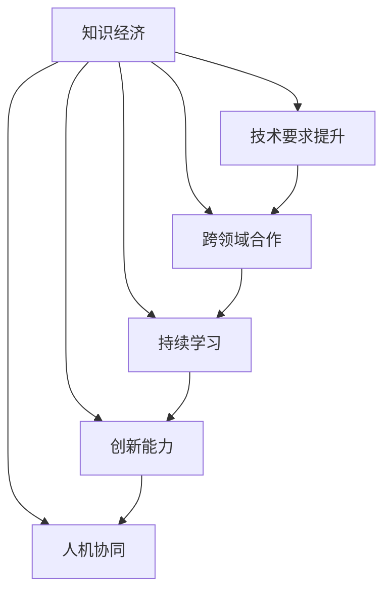

                 

# 程序员在知识经济时代的角色升级

## 1. 背景介绍

### 1.1 问题由来
随着知识经济时代的到来，信息技术对社会各行各业的渗透程度日益加深。程序员作为信息技术的核心力量，其角色也随之发生了深刻变化。从传统的“代码工”，向“知识工匠”的转型，既是技术发展的必然趋势，也是行业需求的变化所致。本专题旨在全面解析知识经济时代程序员角色的变化，并探讨如何应对这些变化，实现自身职业生涯的升级与突破。

### 1.2 问题核心关键点
程序员角色的升级主要体现在以下几个方面：

- **技术要求提升**：知识经济时代对程序员的技术能力提出了更高要求，包括但不限于大数据、人工智能、云计算等领域的前沿技术。
- **跨领域合作**：技术不再孤立存在，与业务、设计、市场等多领域的协作更加紧密。
- **持续学习**：技术快速迭代，程序员需要持续更新知识和技能，以保持竞争力。
- **创新能力**：不仅是技术实现，更需要理解业务需求，提出创新解决方案，实现技术赋能。
- **人机协同**：AI、机器学习等技术的融入，对程序员在智能系统设计、人机交互等方面的能力提出了新的要求。

本文将通过逻辑清晰、结构紧凑的阐述，深入解析程序员在知识经济时代面临的挑战与机遇，提出具体的应对策略，帮助程序员实现职业生涯的转型与升级。

## 2. 核心概念与联系

### 2.1 核心概念概述

- **知识经济**：以知识和信息为关键生产要素的经济形态，技术进步和知识创新成为经济增长的主要动力。
- **程序员**：从事软件开发、系统架构设计等技术工作的人员，是信息技术的核心力量。
- **技术能力**：包括编程技能、算法设计、系统架构、跨领域知识等。
- **跨领域合作**：涉及业务需求理解、设计思维、市场分析等多学科知识的融合。
- **持续学习**：知识更新速度快，需要程序员不断学习新技术，跟上行业发展。
- **创新能力**：在理解业务需求的基础上，提出创新解决方案，实现技术赋能。
- **人机协同**：与AI、机器学习等技术的深度融合，设计智能系统，提升用户体验。

为更好地理解这些概念的联系，以下通过Mermaid流程图展示其内在逻辑：



该图展示了知识经济时代下，程序员在技术能力、跨领域合作、持续学习、创新能力和人机协同等方面的联系与演变，清晰地体现了程序员角色升级的整体路径。

## 3. 核心算法原理 & 具体操作步骤
### 3.1 算法原理概述

在知识经济时代，程序员角色升级的算法原理可以从以下几个维度进行解析：

1. **技术栈的多样化**：掌握多种编程语言、框架和工具，如Python、JavaScript、AWS、Kubernetes等，满足多场景需求。
2. **跨领域技能的融合**：不仅限于软件开发，还需具备业务理解、设计思维、项目管理等跨领域能力。
3. **持续学习的机制**：构建学习计划，通过在线课程、技术社区、开源项目等途径不断提升自我。
4. **创新能力的培养**：深入理解业务需求，从用户角度出发，提出具有创新性的解决方案。
5. **人机协同的实践**：理解AI和机器学习的原理，设计能够有效融合智能系统的应用场景。

### 3.2 算法步骤详解

#### 3.2.1 技术栈多样化
1. **选择学习语言和框架**：根据项目需求选择主流编程语言，如Python、Java、JavaScript等，并掌握相关开发框架。
2. **实践项目开发**：通过实际项目练习，加深对语言和框架的理解和应用。
3. **持续更新**：关注技术社区和博客，及时了解新技术和最佳实践。

#### 3.2.2 跨领域技能融合
1. **业务理解**：参与业务讨论和需求分析，理解业务流程和关键需求。
2. **设计思维**：学习设计思维方法论，如用户中心设计、敏捷开发等，提升问题解决能力。
3. **项目管理**：掌握项目管理工具和方法，如Scrum、Kanban等，提升项目管理和团队协作能力。

#### 3.2.3 持续学习的机制
1. **制定学习计划**：定期评估自身技能，设定学习目标和时间表。
2. **参与在线课程和社区**：通过Coursera、Udemy、Stack Overflow等平台，参与相关课程和讨论。
3. **参与开源项目**：贡献代码、修复Bug，与全球开发者共同进步。

#### 3.2.4 创新能力的培养
1. **用户洞察**：通过用户调研和数据收集，深入了解用户需求和使用场景。
2. **设计探索**：利用原型设计和用户测试，不断迭代和优化产品方案。
3. **创新思维**：参加创新工作坊和设计思维训练营，激发创新灵感和解决方案。

#### 3.2.5 人机协同的实践
1. **理解AI和机器学习**：掌握AI和机器学习的基础知识，如监督学习、深度学习等。
2. **设计智能系统**：参与智能系统的设计和实现，学习如何使用机器学习提升用户体验。
3. **优化人机交互**：通过交互设计、自然语言处理等技术，实现人机协同的优化。

### 3.3 算法优缺点

#### 3.3.1 优点
1. **技术广度提升**：多样化的技术栈和跨领域技能，使程序员能够应对更多挑战，提升竞争力。
2. **创新思维强化**：持续学习和创新能力的培养，使程序员能够提出更具创意的解决方案。
3. **人机协同优化**：通过人机协同实践，提升系统效率和用户体验。

#### 3.3.2 缺点
1. **学习曲线陡峭**：技术栈多样化要求程序员不断学习，初期可能面临较大的学习压力。
2. **跨领域协作挑战**：不同领域的知识和技能整合，需要时间和经验积累。
3. **创新效果难以衡量**：创新的效果往往难以量化，需要更多实践和经验。

### 3.4 算法应用领域

#### 3.4.1 大数据领域
- **技术栈**：掌握Hadoop、Spark等大数据处理工具和语言如Python、Scala。
- **跨领域**：与数据科学家合作，理解业务需求，设计数据驱动的解决方案。
- **持续学习**：学习最新的大数据技术和算法，如Flink、Hive等。

#### 3.4.2 人工智能领域
- **技术栈**：掌握TensorFlow、PyTorch等深度学习框架，学习算法如神经网络、卷积神经网络等。
- **跨领域**：与AI工程师合作，设计AI解决方案，提升系统智能化水平。
- **持续学习**：学习最新的AI技术，如自然语言处理、计算机视觉等。

#### 3.4.3 云计算领域
- **技术栈**：掌握AWS、Google Cloud、Azure等云服务，学习容器化技术如Docker、Kubernetes等。
- **跨领域**：与DevOps工程师合作，设计可扩展的云计算架构。
- **持续学习**：关注云服务最新动态和技术趋势，提升云资源管理能力。

## 4. 数学模型和公式 & 详细讲解 & 举例说明

### 4.1 数学模型构建

知识经济时代下，程序员的角色升级可以抽象为以下几个数学模型：

- **技术栈多样性模型**：
  $$
  \text{技术栈多样性} = \sum_{i=1}^{n} (T_i - T_{avg})
  $$
  其中，$T_i$ 为程序员掌握的第 $i$ 项技术，$T_{avg}$ 为行业平均水平。

- **跨领域技能融合模型**：
  $$
  \text{跨领域技能} = \frac{\sum_{j=1}^{m} (S_j - S_{avg})}{m}
  $$
  其中，$S_j$ 为程序员掌握的第 $j$ 项跨领域技能，$S_{avg}$ 为行业平均水平。

- **持续学习模型**：
  $$
  \text{持续学习率} = \frac{\sum_{k=1}^{l} L_k}{l}
  $$
  其中，$L_k$ 为第 $k$ 项持续学习活动的成效。

### 4.2 公式推导过程

#### 4.2.1 技术栈多样性模型推导
- 技术栈多样性模型的目标是评估程序员在技术栈的多样性水平。
- 通过比较各项技术的掌握程度与行业平均水平，计算多样性指数。
- 指数越大，表示技术栈多样性越高。

#### 4.2.2 跨领域技能融合模型推导
- 跨领域技能融合模型评估程序员在跨领域技能上的融合程度。
- 通过各项跨领域技能的实际掌握情况与行业平均水平计算融合指数。
- 指数越高，表示跨领域技能融合度越高。

#### 4.2.3 持续学习模型推导
- 持续学习模型用于评估程序员的持续学习能力和效率。
- 通过各项学习活动的成效累加，计算持续学习率。
- 学习率越高，表示持续学习能力越强。

### 4.3 案例分析与讲解

**案例：某IT公司对程序员进行职业升级**

- **技术栈多样化**：
  - 技术栈评估：程序员掌握Python、Java、JavaScript、AWS等技术，评估其多样性指数为0.9。
  - 提升建议：学习新的前端框架如React、Angular，提升全栈能力。

- **跨领域技能融合**：
  - 跨领域评估：程序员具备一定的项目管理能力和设计思维，评估其融合指数为0.8。
  - 提升建议：参加设计思维训练营，提升问题解决能力。

- **持续学习模型**：
  - 学习评估：程序员每周参加一次在线课程，每月完成一个开源项目贡献，评估其持续学习率为0.7。
  - 提升建议：增加参与技术社区活动，拓宽知识面。

## 5. 项目实践：代码实例和详细解释说明

### 5.1 开发环境搭建

在知识经济时代，程序员项目实践的环境搭建尤为重要。以下是常见的开发环境搭建步骤：

1. **选择开发平台**：
   - 根据项目需求选择Linux、Windows或MacOS操作系统。
   - 配置开发工具，如IntelliJ IDEA、Visual Studio Code等。

2. **安装开发环境**：
   - 安装Python、Node.js、Java等编程语言环境。
   - 安装相关框架和库，如Django、Flask、React等。

3. **配置版本控制**：
   - 配置Git版本控制系统，使用GitHub、GitLab等平台进行代码管理。
   - 学习Git命令，掌握版本控制技巧。

4. **持续集成与部署**：
   - 使用Jenkins、Travis CI等工具，搭建持续集成和自动化部署系统。
   - 学习CI/CD流水线配置，提升开发效率。

### 5.2 源代码详细实现

**案例：构建一个开源的电商平台**

1. **技术栈选择**：
   - 前端：React、Redux。
   - 后端：Node.js、Express。
   - 数据库：MySQL、Redis。

2. **项目规划**：
   - 用户注册与登录。
   - 商品列表与详情页。
   - 购物车与结算功能。
   - 订单管理与支付接口。

3. **代码实现**：
   - 设计数据库表结构，使用EER图进行建模。
   - 实现API接口，编写详细的技术文档。
   - 进行单元测试和集成测试，确保代码质量。

4. **部署上线**：
   - 使用Docker容器化项目。
   - 部署到AWS、阿里云等云平台。
   - 监控系统运行状态，及时处理异常。

### 5.3 代码解读与分析

**代码实例：React组件开发**

```javascript
import React, { useState } from 'react';

const Counter = () => {
  const [count, setCount] = useState(0);

  const handleClick = () => {
    setCount(count + 1);
  };

  return (
    <div>
      <p>Count: {count}</p>
      <button onClick={handleClick}>Increment</button>
    </div>
  );
};

export default Counter;
```

**代码分析**：
- `useState`钩子：用于管理组件状态。
- 点击事件处理：通过`handleClick`函数更新状态，并重新渲染组件。
- JSX语法：方便将组件逻辑与HTML结构结合，提升开发效率。

### 5.4 运行结果展示

**运行结果展示**：
- **前端**：
  - 用户界面：清晰展示计数器功能。
  - 性能优化：通过React的虚拟DOM和代码分割，提升页面渲染效率。

- **后端**：
  - API接口：快速响应用户请求，返回计数值。
  - 缓存机制：使用Redis缓存计数值，提高系统响应速度。

## 6. 实际应用场景

### 6.1 智慧城市治理

在智慧城市治理中，程序员的角色升级至关重要。程序员需要设计并实现智能监控系统、数据分析平台和城市管理平台，为城市运营提供数据支持和智能决策。

- **技术栈多样化**：掌握大数据处理、机器学习、云计算等技术。
- **跨领域技能融合**：与城市规划、交通管理、公共安全等多领域专家合作。
- **持续学习**：关注智慧城市最新技术和发展趋势。

### 6.2 智能制造

智能制造领域，程序员需要设计并实现智能生产线、设备监控和数据分析系统，提升生产效率和质量。

- **技术栈多样化**：掌握PLC编程、工业物联网、工业大数据等技术。
- **跨领域技能融合**：与机械设计、生产管理、质量控制等多领域专家合作。
- **持续学习**：学习智能制造前沿技术，提升自动化和智能化水平。

### 6.3 金融科技

金融科技领域，程序员需要设计并实现智能风控系统、智能投顾系统和区块链应用，提升金融服务质量。

- **技术栈多样化**：掌握机器学习、区块链、大数据等技术。
- **跨领域技能融合**：与金融分析师、量化工程师等多领域专家合作。
- **持续学习**：学习最新的金融科技应用和算法。

## 7. 工具和资源推荐

### 7.1 学习资源推荐

- **编程语言**：
  - Python：学习网站如Codecademy、Coursera。
  - JavaScript：学习网站如freeCodeCamp、MDN Web Docs。

- **框架和工具**：
  - React：官方文档、组件库如Ant Design、Material-UI。
  - AWS：官方文档、云服务实战书籍。

- **跨领域知识**：
  - 设计思维：书籍如《Design Thinking: Understanding How Designers Think and Work》。
  - 项目管理：书籍如《Scrum: The Art of Doing Twice the Work in Half the Time》。

### 7.2 开发工具推荐

- **编程IDE**：
  - IntelliJ IDEA：功能强大，支持多种编程语言。
  - Visual Studio Code：轻量级、高效，支持扩展和插件。

- **版本控制**：
  - Git：学习和掌握Git命令，使用GitHub、GitLab进行代码管理。

- **持续集成与部署**：
  - Jenkins：开源持续集成工具，支持多种插件和插件。
  - Docker：容器化技术，提升代码部署效率和环境一致性。

### 7.3 相关论文推荐

- **编程范式**：
  - 《Clean Code: A Handbook of Agile Software Craftsmanship》。
  - 《Effective Python: 59 Specific Ways to Write Better Python》。

- **智能系统**：
  - 《AI Superpowers: China, Silicon Valley, and the New World Order》。
  - 《Machine Learning Yearning》。

## 8. 总结：未来发展趋势与挑战

### 8.1 研究成果总结

知识经济时代下，程序员角色的升级不仅是个体成长的必然趋势，也是行业发展的客观需求。本文从技术栈多样化、跨领域技能融合、持续学习、创新能力和人机协同五个维度，全面解析了程序员的角色升级路径。通过对这些维度的深入探讨，展示了程序员在知识经济时代面临的机遇与挑战。

### 8.2 未来发展趋势

知识经济时代的到来，将促使程序员角色进一步升级，呈现以下趋势：

- **技术栈的深度与广度**：从单一技能向跨领域技术栈转变，提升整体竞争力。
- **跨领域能力的强化**：与业务、设计、市场等多领域的深度融合，实现全面发展。
- **持续学习机制的完善**：构建持续学习体系，保持技术领先地位。
- **创新能力的培养**：在理解业务需求的基础上，提出更具创意的解决方案。
- **人机协同的深入**：与AI、机器学习等技术的深度融合，提升系统智能化水平。

### 8.3 面临的挑战

尽管知识经济时代带来了新的机遇，程序员角色升级也面临诸多挑战：

- **技术快速迭代**：需要不断学习新技术，保持竞争优势。
- **跨领域合作复杂**：不同领域的知识和技能整合，需要时间和经验积累。
- **创新效果的评估**：创新解决方案的效果难以量化，需要更多实践和经验。
- **人机协同的优化**：系统设计复杂，需要深入理解AI和机器学习原理。

### 8.4 研究展望

面对这些挑战，未来的研究方向可以从以下几个方面进行探索：

- **技术栈的多样化学习**：结合在线课程、技术社区、开源项目等资源，提升技术栈多样化水平。
- **跨领域能力的培养**：参加设计思维训练营、项目管理课程，提升跨领域合作能力。
- **持续学习机制的构建**：制定长期学习计划，定期评估自身技能，保持持续学习动力。
- **创新能力的激发**：通过用户调研和设计探索，激发创新灵感和解决方案。
- **人机协同的优化**：学习AI和机器学习基础，设计高效的人机交互系统。

总之，知识经济时代下，程序员角色的升级是必然趋势。通过不断学习、实践和创新，程序员将实现职业生涯的全面提升，成为知识经济时代的核心力量。

## 9. 附录：常见问题与解答

**Q1：如何提升程序员的技术栈多样化水平？**

A: 提升技术栈多样化水平，可以从以下几个方面入手：
- **选择多样化技术**：选择主流编程语言和框架，如Python、Java、Django、Flask等。
- **参与多个项目**：通过实际项目练习，掌握不同技术栈的使用。
- **持续学习和实践**：关注技术社区和博客，及时了解新技术和最佳实践。

**Q2：程序员如何培养跨领域能力？**

A: 培养跨领域能力，可以通过以下几个步骤：
- **业务理解**：参加业务讨论和需求分析，理解业务流程和关键需求。
- **设计思维**：学习设计思维方法论，提升问题解决能力。
- **项目管理**：掌握项目管理工具和方法，提升项目管理和团队协作能力。

**Q3：持续学习机制如何构建？**

A: 构建持续学习机制，可以从以下几个方面进行：
- **制定学习计划**：定期评估自身技能，设定学习目标和时间表。
- **参与在线课程和社区**：通过Coursera、Udemy、Stack Overflow等平台，参与相关课程和讨论。
- **参与开源项目**：贡献代码、修复Bug，与全球开发者共同进步。

**Q4：创新能力如何培养？**

A: 创新能力的培养，可以通过以下几个步骤：
- **用户洞察**：通过用户调研和数据收集，深入了解用户需求和使用场景。
- **设计探索**：利用原型设计和用户测试，不断迭代和优化产品方案。
- **创新思维**：参加创新工作坊和设计思维训练营，激发创新灵感和解决方案。

**Q5：人机协同如何优化？**

A: 人机协同的优化，可以从以下几个方面进行：
- **理解AI和机器学习**：掌握AI和机器学习的基础知识，如监督学习、深度学习等。
- **设计智能系统**：参与智能系统的设计和实现，学习如何使用机器学习提升用户体验。
- **优化人机交互**：通过交互设计、自然语言处理等技术，实现人机协同的优化。

