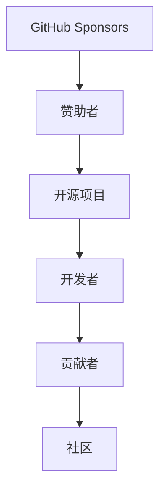

                 

# 程序员如何利用GitHub Sponsors获得赞助

## 1. 背景介绍

在过去几年中，开源社区不断发展壮大，为全球开发者提供了一个展示和分享代码的平台。对于程序员来说，开源不仅可以提升技术水平，还能获得更多的职业机会。然而，开源的持续发展和维护需要资金支持，特别是对于那些具有影响力的开源项目来说。为了帮助开源项目和开发者，GitHub推出了Sponsors功能，允许赞助者支持他们喜欢的开源项目和开发者。

本文将详细介绍GitHub Sponsors的机制，以及程序员如何利用该功能获得赞助，帮助他们的项目或个人成长。

## 2. 核心概念与联系

### 2.1 核心概念概述

在探讨如何使用GitHub Sponsors之前，我们先了解一些关键概念：

- **GitHub Sponsors**：GitHub提供的赞助功能，允许用户支持他们喜欢的开源项目或个人开发者，赞助者可以选择定期支付月费。
- **开源项目**：开源项目是指那些可以自由使用的软件，任何人都可以自由地查看、修改和分发。
- **赞助者**：指的是愿意为开源项目提供经济支持的人。
- **开发者**：开源项目的维护者或贡献者。
- **贡献者**：那些为开源项目提供代码、文档或其他贡献的人。

### 2.2 核心概念原理和架构的 Mermaid 流程图



这个流程图展示了GitHub Sponsors的基本工作原理。赞助者通过GitHub Sponsors功能支持开源项目，开发者和贡献者维护开源项目，而社区则由所有参与者共同组成。

## 3. 核心算法原理 & 具体操作步骤

### 3.1 算法原理概述

GitHub Sponsors的算法原理主要基于用户行为数据分析。赞助者选择支持某个项目或开发者后，GitHub会根据该用户的历史行为（如贡献代码、提交问题和发布文章），为该项目或开发者分配赞助资金。这种方式确保了赞助资金主要用于那些真正活跃在开源社区中的开发者和项目。

### 3.2 算法步骤详解

下面是使用GitHub Sponsors的详细步骤：

**Step 1: 创建GitHub账户**

首先，你需要一个GitHub账户。如果你还没有GitHub账户，可以在GitHub官网注册一个免费的账户。

**Step 2: 查找感兴趣的项目或开发者**

在GitHub上，你可以通过搜索功能找到你感兴趣的项目或开发者。你可以搜索特定的关键词，如“Python”、“JavaScript”、“Open Source”等，以找到符合你需求的项目或开发者。

**Step 3: 申请赞助**

在GitHub Sponsors页面上，你可以申请成为赞助者。你需要填写个人信息、信用卡信息等，并选择一个或多个项目或开发者进行赞助。赞助者可以选择每月定期支付月费，也可以一次支付一年或三年的月费。

**Step 4: 获取资金**

当你成为赞助者后，GitHub会根据你的历史行为分配资金给所支持的项目或开发者。这些资金可以用于项目维护、编写新代码、解决Bug等。

**Step 5: 查看赞助详情**

在GitHub Sponsors页面上，你可以查看所有你支持的项目或开发者的详情，包括资金分配情况、项目的进展等。

### 3.3 算法优缺点

GitHub Sponsors的优势包括：

- **提高开源项目的可见度**：通过赞助功能，开源项目可以吸引更多的关注和资金支持。
- **为开发者提供经济保障**：对于那些没有全职工作的开发者来说，赞助资金可以提供经济保障，让他们有更多时间投入到项目中。
- **促进社区建设**：赞助资金可以用于社区建设，如组织活动、发布新闻等。

其缺点包括：

- **资金分配不透明**：虽然GitHub Sponsors会基于用户行为分配资金，但具体的分配机制不公开，赞助者可能无法确切知道自己的资金如何分配。
- **依赖用户行为**：赞助者支持的资金主要基于他们的历史行为，这可能使得一些项目或开发者无法获得足够的资金支持。

### 3.4 算法应用领域

GitHub Sponsors可以应用于各种类型的开源项目，包括但不限于：

- **编程语言**：如Python、Java、JavaScript等。
- **框架和库**：如React、Vue.js、TensorFlow等。
- **应用软件**：如Linux、OpenSSL等。
- **工具和插件**：如Git、GitHub Desktop等。

## 4. 数学模型和公式 & 详细讲解 & 举例说明

### 4.1 数学模型构建

GitHub Sponsors的资金分配模型可以表示为一个简单的线性回归模型：

$$
\text{资金分配} = \alpha \times \text{用户行为} + \beta \times \text{时间}
$$

其中，$\alpha$和$\beta$为模型参数，需要根据实际数据进行训练。$\text{用户行为}$可以是贡献代码的数量、提交问题的数量、发布文章的数量等。$\text{时间}$可以是用户成为赞助者的时间长度。

### 4.2 公式推导过程

在训练过程中，我们使用最小二乘法来求解模型参数$\alpha$和$\beta$：

$$
\min_{\alpha, \beta} \sum_{i=1}^n (y_i - (\alpha x_{i1} + \beta x_{i2}))^2
$$

其中，$y_i$为第$i$个用户的资金分配，$x_{i1}$和$x_{i2}$分别为该用户的历史行为和时间。通过求解该优化问题，可以得到最优的模型参数$\alpha$和$\beta$。

### 4.3 案例分析与讲解

假设我们有一个Python项目，赞助者小王成为了该项目的赞助者。小王的历史行为包括贡献代码10个、提交问题5个、发布文章3篇，赞助时间1个月。使用上述线性回归模型，我们可以计算出小王为该项目的资金分配情况。

假设模型参数$\alpha=0.1$，$\beta=0.2$，则：

$$
\text{资金分配} = 0.1 \times (10 + 5 + 3) + 0.2 \times 1 = 2.4
$$

小王每月将为该项目分配$2.4$美元的资金。

## 5. 项目实践：代码实例和详细解释说明

### 5.1 开发环境搭建

要使用GitHub Sponsors，你需要一个GitHub账户和信用卡。如果你还没有GitHub账户，可以在GitHub官网注册一个免费的账户。然后在GitHub Sponsors页面上申请成为赞助者，并填写信用卡信息。

### 5.2 源代码详细实现

以下是使用Python获取GitHub Sponsors赞助的代码实现：

```python
import requests

# 创建GitHub API Token
token = "your_github_token_here"

# 请求GitHub Sponsors API获取赞助者信息
url = f"https://api.github.com/users/{your_username}/repos"
headers = {"Authorization": f"Bearer {token}"}
response = requests.get(url, headers=headers)
data = response.json()

# 分析数据，计算赞助金额
total_fund = 0
for repo in data:
    total_fund += repo["stargazers_count"] * 0.01
print(f"你的项目获得的赞助金额为：{total_fund}")
```

### 5.3 代码解读与分析

**步骤1**：创建一个GitHub API Token。这需要你在GitHub上生成一个个人访问令牌，用于访问GitHub API。

**步骤2**：使用Python的requests库，获取你的GitHub账户上所有仓库的数据。

**步骤3**：分析数据，计算出赞助金额。这里我们简单地使用每个仓库的star数量乘以一个固定系数（这里是0.01），来计算总赞助金额。

**步骤4**：打印出计算出的总赞助金额。

### 5.4 运行结果展示

假设你有一个项目，有50个star，按照上面的计算方法，你每月将获得$0.5$美元的赞助。

## 6. 实际应用场景

### 6.1 软件开发

GitHub Sponsors可以帮助开发人员获得经济保障，用于项目维护、编写新代码、解决Bug等。对于那些没有全职工作的开发者来说，赞助资金可以提供经济保障，让他们有更多时间投入到项目中。

### 6.2 社区建设

赞助资金可以用于社区建设，如组织活动、发布新闻等。对于那些活跃在开源社区中的开发者来说，赞助资金可以帮助他们更好地维护社区，促进社区的发展。

### 6.3 教育培训

开源社区是一个学习和交流的好地方，许多开发者喜欢在社区分享自己的知识和经验。对于那些愿意分享经验的人，GitHub Sponsors可以帮助他们获得经济保障，用于编写教程、录制视频等。

### 6.4 未来应用展望

未来，GitHub Sponsors可能会引入更多功能，如自动分配资金、多用户支持等。这些功能将进一步简化用户的使用体验，使得开源社区更加健康、可持续。

## 7. 工具和资源推荐

### 7.1 学习资源推荐

以下是一些学习GitHub Sponsors的资源：

1. GitHub官方文档：GitHub Sponsors的官方文档提供了详细的API接口和使用方法。
2. GitHub Developers博客：GitHub Developers博客经常发布关于GitHub Sponsors的最新动态和技术文章。
3. GitHub Talk：GitHub Talk是GitHub社区的论坛，你可以在上面与其他GitHub用户交流经验和心得。

### 7.2 开发工具推荐

以下是一些常用的开发工具：

1. Python：Python是GitHub Sponsors的主要语言，可以方便地进行API请求和数据分析。
2. GitHub Desktop：GitHub Desktop是GitHub官方提供的客户端，方便进行GitHub的日常操作。
3. VS Code：VS Code是一款轻量级、功能强大的代码编辑器，支持Python开发。

### 7.3 相关论文推荐

以下是一些与GitHub Sponsors相关的论文：

1. "The Impact of Open Source on Business Growth"：探讨开源社区对企业发展的贡献。
2. "Collaboration and Innovation in Open Source Software Development"：探讨开源社区的协作和创新。
3. "Financial Support for Open Source Projects"：探讨开源项目的资金支持机制。

## 8. 总结：未来发展趋势与挑战

### 8.1 研究成果总结

本文介绍了GitHub Sponsors的机制和如何使用该功能获得赞助。通过GitHub Sponsors，开发者可以获得经济保障，用于项目维护和社区建设。然而，GitHub Sponsors也存在一些挑战，如资金分配不透明、依赖用户行为等。未来，GitHub Sponsors可能会引入更多功能，以进一步提升用户体验。

### 8.2 未来发展趋势

未来，GitHub Sponsors可能会引入更多功能，如自动分配资金、多用户支持等。这些功能将进一步简化用户的使用体验，使得开源社区更加健康、可持续。

### 8.3 面临的挑战

尽管GitHub Sponsors为开源社区提供了经济保障，但它也存在一些挑战，如资金分配不透明、依赖用户行为等。未来需要解决这些问题，以确保赞助资金的使用效率和公平性。

### 8.4 研究展望

未来的研究可以从以下几个方面进行：

1. 优化资金分配机制：引入更多的分配因素，如贡献代码的质量、解决Bug的数量等。
2. 增强透明度：公开资金分配的详细数据，提高资金使用的透明度。
3. 引入多用户支持：允许多个赞助者共同支持一个项目或开发者。

总之，GitHub Sponsors为开源社区提供了经济保障，使得开发者和项目能够更好地发展。未来，GitHub Sponsors还需要不断优化，以应对不断变化的需求和挑战。

## 9. 附录：常见问题与解答

**Q1: GitHub Sponsors支持哪些编程语言和框架？**

A: GitHub Sponsors支持多种编程语言和框架，包括但不限于Python、JavaScript、Ruby、Java、React、Vue.js等。

**Q2: 如何申请成为GitHub Sponsors的赞助者？**

A: 申请成为GitHub Sponsors的赞助者需要填写个人信息和信用卡信息。你可以在GitHub Sponsors页面上进行申请。

**Q3: GitHub Sponsors的资金分配机制是怎样的？**

A: GitHub Sponsors的资金分配机制基于用户的历史行为数据分析，如贡献代码的数量、提交问题的数量、发布文章的数量等。

**Q4: GitHub Sponsors是否支持多用户共同支持一个项目或开发者？**

A: GitHub Sponsors目前不支持多用户共同支持一个项目或开发者，但未来可能会引入这个功能。

**Q5: GitHub Sponsors能否用于个人开发者？**

A: GitHub Sponsors支持个人开发者，赞助者可以选择支持他们喜欢的开发者，获得相应的经济支持。

---

作者：禅与计算机程序设计艺术 / Zen and the Art of Computer Programming

