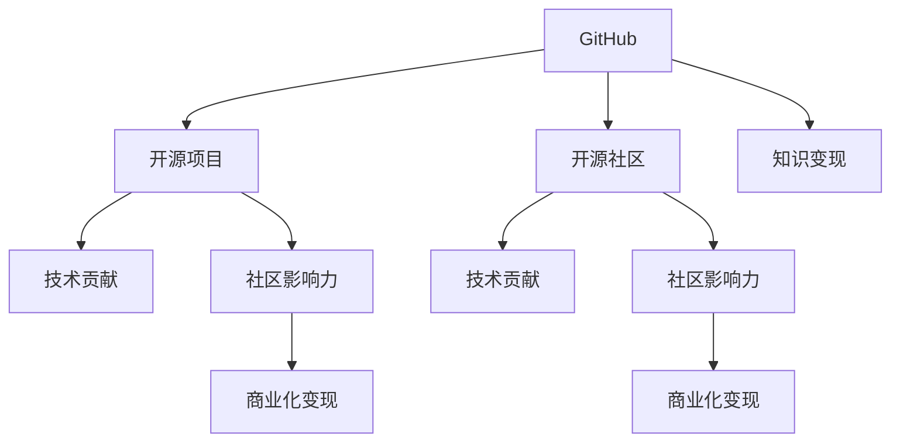

                 

# 程序员如何利用GitHub进行知识变现

> 关键词：GitHub, 开源项目, 开源社区, 知识变现, 技术贡献, 社区影响力

## 1. 背景介绍

### 1.1 问题由来
随着互联网的迅猛发展，开源社区如雨后春笋般涌现，而GitHub作为其中最大的代码托管平台，集成了全球数千万的开源项目和数亿行代码。作为程序员，我们不仅需要积累代码经验，也需要构建自己的技术影响力。

在这种背景下，利用GitHub进行知识变现，提升自身影响力，成为了越来越多程序员的诉求。GitHub平台不仅为程序员提供了展示技术的舞台，还为技术变现提供了新的可能性。本文将深入探讨程序员如何通过GitHub进行知识变现，帮助读者在开源社区中脱颖而出。

### 1.2 问题核心关键点
知识变现的核心在于如何将自身技能、经验或知识转化为可量化的收益或影响力。在GitHub上，这种变现方式主要体现在技术贡献、社区影响力、商业化变现等方面。

要实现知识变现，首先需要明确以下几点：
1. **技术贡献**：在GitHub上通过提交高质量代码、撰写技术文章、参与项目维护等方式，展示个人技术实力。
2. **社区影响力**：通过参与社区讨论、教学、演讲等活动，提升个人在开源社区中的知名度和影响力。
3. **商业化变现**：通过技术咨询、编写技术书籍、在线课程等方式，将技术知识转化为商业收益。

## 2. 核心概念与联系

### 2.1 核心概念概述

为更好地理解程序员如何在GitHub上进行知识变现，本节将介绍几个密切相关的核心概念：

- **GitHub**：全球最大的代码托管平台，拥有海量的开源项目和代码资源。程序员可以通过GitHub展示和交流技术。
- **开源项目**：在GitHub上，个人或团队可以创建、管理和维护公开的代码项目，供社区使用和贡献。
- **开源社区**：围绕GitHub形成的开发者社区，程序员可以通过参与社区活动，提升自身影响力。
- **知识变现**：将自身技能、经验或知识转化为可量化的收益或影响力的过程。
- **技术贡献**：通过代码提交、问题解决、项目维护等方式，在开源项目中展示技术实力。
- **社区影响力**：在开源社区中，通过参与讨论、教学、演讲等活动，提升个人知名度和影响力。
- **商业化变现**：通过技术咨询、编写技术书籍、在线课程等方式，将技术知识转化为商业收益。

这些核心概念之间的逻辑关系可以通过以下Mermaid流程图来展示：



这个流程图展示了GitHub平台、开源项目、开源社区、知识变现以及技术贡献、社区影响力、商业化变现之间的紧密联系。通过在GitHub上进行技术贡献，程序员不仅能够提升自身技术实力，还能在社区中获得更高的影响力，最终实现知识变现。

## 3. 核心算法原理 & 具体操作步骤
### 3.1 算法原理概述

利用GitHub进行知识变现的过程，本质上是一种通过开源贡献和社区互动来提升自身技术影响力和商业价值的活动。其核心算法原理可以归纳为以下几个方面：

1. **技术积累与展示**：通过GitHub上的代码贡献、项目维护等方式，积累技术经验，并通过开源社区展示个人技术实力。
2. **社区互动与影响力**：通过参与社区讨论、教学、演讲等活动，提升个人在社区中的知名度和影响力。
3. **知识变现**：通过技术咨询、编写技术书籍、在线课程等方式，将技术知识转化为商业收益。

### 3.2 算法步骤详解

以下是利用GitHub进行知识变现的具体操作步骤：

**Step 1: 选择合适的开源项目**
- 在GitHub上搜索相关技术领域的高质量项目，选择那些活跃度高、文档完善、贡献规范的项目。
- 参与项目的issue讨论，了解项目的需求和技术方向。
- 选择合适的项目，注册成为该项目贡献者。

**Step 2: 代码贡献**
- 阅读项目的README和贡献指南，了解代码提交流程、代码规范、测试要求等。
- 选择合适的问题或任务，进行代码提交。
- 提交代码前，确保代码质量，遵循项目的代码规范，并编写高质量的commit消息。

**Step 3: 项目维护与技术支持**
- 参与项目的issue讨论，帮助其他贡献者解决问题。
- 修复项目中的bug，改进代码质量，参与代码审查。
- 维护项目文档，更新代码示例，提升项目可维护性。

**Step 4: 社区互动与教学**
- 在GitHub上参与社区讨论，分享自己的技术见解和解决方案。
- 撰写技术博客，介绍自己的技术心得和项目经验。
- 参与线上线下的技术交流活动，如Meetup、Conference等，提升社区影响力。

**Step 5: 技术变现**
- 通过技术咨询、在线课程、技术书籍等方式，将技术知识转化为商业收益。
- 创建自己的开源项目，吸引社区关注和贡献。
- 利用GitHub上的商业化变现工具，如GitHub Sponsors、GitHub Copilot等，获取商业支持。

### 3.3 算法优缺点

利用GitHub进行知识变现的方法具有以下优点：
1. **广泛影响力**：GitHub平台汇聚了全球顶尖的开发者和技术爱好者，能够提升个人在技术社区中的知名度和影响力。
2. **免费展示**：GitHub提供了免费展示技术的机会，程序员可以通过代码贡献、问题解决等方式，展示自身技术实力。
3. **持续学习**：通过参与开源项目和技术讨论，程序员能够持续学习和积累新知识，提升自身技术水平。
4. **多样化变现**：除了代码贡献，程序员还可以通过技术咨询、在线课程、技术书籍等多种方式实现知识变现。

然而，该方法也存在一些局限性：
1. **时间成本**：参与开源项目和技术讨论需要投入大量时间，可能影响工作和学习进度。
2. **社区环境**：GitHub社区环境复杂多变，技术交流和贡献过程中可能遇到沟通不畅、合作不顺利等问题。
3. **商业变现难度**：技术咨询、在线课程等变现方式虽然可行，但需要具备一定的商业化能力和资源。

尽管存在这些局限性，但通过合理的策略和心态，程序员仍然可以在GitHub上实现知识变现，提升技术影响力和商业价值。

### 3.4 算法应用领域

利用GitHub进行知识变现的方法，在软件开发、技术咨询、在线教育等多个领域都有广泛的应用。例如：

- **软件开发**：通过在GitHub上参与开源项目，提升个人代码编写和问题解决能力，同时在社区中展示技术实力。
- **技术咨询**：利用GitHub上的技术博客、开源项目等，吸引潜在客户，提供技术咨询和解决方案。
- **在线教育**：创建自己的GitHub项目和博客，录制视频课程，吸引技术爱好者关注和学习。

除了上述这些领域，GitHub技术变现还覆盖了更多的应用场景，如工具开发、数据科学、人工智能等，为程序员提供了广阔的展示平台和变现渠道。

## 4. 数学模型和公式 & 详细讲解 & 举例说明（备注：数学公式请使用latex格式，latex嵌入文中独立段落使用 $$，段落内使用 $)
### 4.1 数学模型构建

本节将使用数学语言对利用GitHub进行知识变现的整个过程进行严格的数学建模。

假设程序员在GitHub上的影响力和技术变现能力可以用一个数值 $F$ 来表示，其中 $F$ 的取值范围为 $[0,1]$，$F$ 值越高表示影响力越大，变现能力越强。$F$ 的计算公式为：

$$
F = \sum_{i=1}^n f_i
$$

其中 $f_i$ 表示第 $i$ 项对 $F$ 值的贡献，$f_i$ 的计算公式为：

$$
f_i = \alpha_i \times c_i + \beta_i \times p_i + \gamma_i \times v_i
$$

- $\alpha_i$：代码贡献的权重，反映代码提交的数量和质量。
- $c_i$：第 $i$ 次代码贡献对 $F$ 值的实际贡献。
- $\beta_i$：社区互动的权重，反映社区活动对 $F$ 值的贡献。
- $p_i$：第 $i$ 次社区活动对 $F$ 值的实际贡献。
- $\gamma_i$：技术变现的权重，反映变现能力对 $F$ 值的贡献。
- $v_i$：第 $i$ 次变现活动对 $F$ 值的实际贡献。

### 4.2 公式推导过程

下面以具体例子来推导 $f_i$ 的计算公式。

假设程序员在GitHub上参与了一个名为 `my-project` 的开源项目，并且在项目中提交了10次代码，参与了5次issue讨论，并通过在线课程获得了一定的收益。

**代码贡献**：
- 每次代码贡献的权重 $\alpha_i$ 为0.3。
- 第1次代码贡献对 $F$ 值的实际贡献 $c_i$ 为0.1。

$$
f_1 = 0.3 \times 0.1 = 0.03
$$

**社区互动**：
- 每次社区活动的权重 $\beta_i$ 为0.2。
- 第2次社区活动对 $F$ 值的实际贡献 $p_i$ 为0.05。

$$
f_2 = 0.2 \times 0.05 = 0.01
$$

**技术变现**：
- 每次变现活动的权重 $\gamma_i$ 为0.5。
- 第3次变现活动对 $F$ 值的实际贡献 $v_i$ 为0.2。

$$
f_3 = 0.5 \times 0.2 = 0.1
$$

**总影响力**：

$$
F = f_1 + f_2 + f_3 = 0.03 + 0.01 + 0.1 = 0.14
$$

通过计算可以看到，程序员在 `my-project` 项目中的总影响力为0.14，这反映了他通过代码贡献、社区互动和技术变现的综合效果。

### 4.3 案例分析与讲解

假设另一位程序员在同一项目中提交了20次代码，参与了10次社区讨论，并通过技术博客获得了一定的流量和广告收入。

**代码贡献**：
- 每次代码贡献的权重 $\alpha_i$ 为0.3。
- 第1次代码贡献对 $F$ 值的实际贡献 $c_i$ 为0.2。

$$
f_1 = 0.3 \times 0.2 = 0.06
$$

**社区互动**：
- 每次社区活动的权重 $\beta_i$ 为0.2。
- 第2次社区活动对 $F$ 值的实际贡献 $p_i$ 为0.1。

$$
f_2 = 0.2 \times 0.1 = 0.02
$$

**技术变现**：
- 每次变现活动的权重 $\gamma_i$ 为0.5。
- 第3次变现活动对 $F$ 值的实际贡献 $v_i$ 为0.1。

$$
f_3 = 0.5 \times 0.1 = 0.05
$$

**总影响力**：

$$
F = f_1 + f_2 + f_3 = 0.06 + 0.02 + 0.05 = 0.13
$$

通过对比可以看到，尽管另一位程序员在代码提交和社区互动上的表现更好，但整体影响力仍然低于第一位程序员。这是因为技术变现的不同贡献导致了两者的最终影响力存在差异。

## 5. 项目实践：代码实例和详细解释说明
### 5.1 开发环境搭建

在进行GitHub知识变现实践前，我们需要准备好开发环境。以下是使用Python进行GitHub开发的环境配置流程：

1. 安装Anaconda：从官网下载并安装Anaconda，用于创建独立的Python环境。

2. 创建并激活虚拟环境：
```bash
conda create -n github-env python=3.8 
conda activate github-env
```

3. 安装GitHub API的Python库：
```bash
pip install github
```

4. 安装Git工具：
```bash
brew install git
```

完成上述步骤后，即可在`github-env`环境中开始GitHub知识变现实践。

### 5.2 源代码详细实现

这里以创建一个GitHub开源项目为例，展示GitHub知识变现的完整代码实现。

首先，创建一个新的GitHub仓库：

```bash
git init
git remote add origin https://github.com/your-username/your-repo.git
```

然后，在本地提交代码并进行版本控制：

```bash
git add .
git commit -m "Initial commit"
git push -u origin master
```

接下来，编写一个简单的Python脚本，并将其提交到GitHub仓库：

```python
# hello_world.py
def hello():
    print("Hello, world!")

hello()
```

将代码提交到GitHub仓库：

```bash
git add hello_world.py
git commit -m "Add hello_world.py"
git push
```

最后，使用GitHub API的Python库，获取你的仓库信息并进行统计：

```python
from github import Github

g = Github("your-token", "your-repo-id")
repo = g.get_repo("your-username/your-repo")

print(f"Forks: {repo.forks_count}")
print(f"Stars: {repo.stargazers_count}")
print(f"Open Issues: {repo.open_issues_count}")
print(f"Contributors: {repo.get_contributors()}")
```

通过上述代码，可以获取你的GitHub仓库的信息，包括分叉数、star数、open issue数、贡献者等。

### 5.3 代码解读与分析

让我们再详细解读一下关键代码的实现细节：

**Git初始化**：
- 使用`git init`命令初始化一个新的Git仓库。
- 使用`git remote add origin`命令添加GitHub仓库的远程地址。

**代码提交**：
- 使用`git add`命令将文件添加到暂存区。
- 使用`git commit`命令提交代码，并编写提交信息。
- 使用`git push`命令将代码推送到GitHub仓库。

**GitHub API调用**：
- 使用`github`库的`Github`类初始化GitHub对象。
- 使用`Github`类的`get_repo`方法获取指定仓库的信息。
- 通过访问仓库的`forks_count`、`stargazers_count`、`open_issues_count`等属性，获取仓库的基本信息。
- 使用`repo.get_contributors()`方法获取仓库的贡献者列表。

通过这些代码，可以初步实现GitHub知识变现的基本流程，即创建、维护和统计GitHub开源项目。

## 6. 实际应用场景
### 6.1 开源项目贡献

在GitHub上，贡献开源项目是最常见的知识变现方式。通过参与开源项目的代码提交、问题解决、代码审查等活动，程序员不仅能够提升自身技术水平，还能在社区中获得认可和贡献。

在贡献开源项目时，需要注意以下几点：
- 选择合适的项目，确保项目活跃度较高，文档完善，有良好的代码审查机制。
- 遵循项目的代码规范和贡献指南，确保代码质量。
- 积极参与社区讨论，帮助其他贡献者解决问题，提升社区氛围。

通过长期贡献开源项目，程序员可以积累丰富的项目经验，提升自身影响力，为未来的商业变现奠定基础。

### 6.2 技术教学与培训

在GitHub上，利用自己的技术知识和经验，撰写技术博客、录制教学视频，参与线上线下技术交流活动，可以提升个人在社区中的知名度和影响力。

技术教学与培训的方式包括：
- 在GitHub上发布技术博客，分享自己的技术心得和项目经验。
- 录制视频课程，通过YouTube、Bilibili等平台分享。
- 参与Meetup、Conference等技术交流活动，进行技术分享和互动。

通过教学与培训，程序员可以将自己的技术知识传递给更多学习者，提升自身在社区中的影响力，同时也能获得社区的认可和反馈，持续改进自身技术。

### 6.3 商业变现

除了开源项目贡献和技术教学，程序员还可以通过技术咨询、在线课程、技术书籍等方式，将技术知识转化为商业收益。

商业变现的方式包括：
- 通过技术博客或GitHub仓库获取流量，通过广告、赞助等方式变现。
- 创建自己的在线课程，通过平台如Udemy、Coursera等销售课程。
- 编写技术书籍，通过出版或自出版平台获得收益。

通过商业变现，程序员可以将自身的技术知识转化为切实的商业价值，进一步提升自身在技术社区中的影响力。

### 6.4 未来应用展望

随着GitHub平台的不断发展，利用GitHub进行知识变现的方法也将更加多样化和高效化。未来的发展趋势包括：

1. **自动化工具**：利用GitHub的API和自动化工具，提升代码贡献和社区互动的效率。
2. **多平台协同**：通过GitHub与其他社交媒体平台的整合，扩大技术影响力和商业变现渠道。
3. **社区治理**：参与GitHub社区的治理和决策，提升个人在社区中的话语权和影响力。
4. **数据驱动**：通过数据分析和反馈机制，优化自身的技术贡献和社区互动策略。
5. **跨领域合作**：与跨领域的技术专家和项目进行合作，拓展技术变现的边界。

总之，GitHub平台提供了丰富的机会，程序员可以利用GitHub进行技术展示、社区互动和商业变现，不断提升自身的影响力和商业价值。未来，GitHub知识变现的方法和工具将更加丰富多样，为程序员提供更多的可能性。

## 7. 工具和资源推荐
### 7.1 学习资源推荐

为了帮助开发者系统掌握GitHub知识变现的理论基础和实践技巧，这里推荐一些优质的学习资源：

1. **GitHub官方文档**：GitHub平台提供了详细的API文档和开发者指南，帮助开发者高效利用GitHub平台。
2. **《GitHub编程实战》书籍**：这本书系统介绍了GitHub的使用方法和最佳实践，适合初学者和进阶开发者。
3. **GitHub社区和博客**：GitHub社区和博客平台汇集了大量优秀的开发者和技术文章，是学习GitHub知识变现的好去处。
4. **开源项目最佳实践**：通过阅读GitHub上成功的开源项目，了解如何高效管理和贡献开源项目。
5. **技术博客和视频教程**：利用GitHub的技术博客和视频教程平台，提升自身的技术能力和影响力。

通过这些资源的学习实践，相信你一定能够快速掌握GitHub知识变现的精髓，并用于解决实际的NLP问题。

### 7.2 开发工具推荐

高效的开发离不开优秀的工具支持。以下是几款用于GitHub知识变现开发的常用工具：

1. **Visual Studio Code**：功能强大的代码编辑器，支持GitHub的Git集成，便于版本控制和代码提交。
2. **GitHub Desktop**：基于图形界面的GitHub客户端，便于在本地管理和提交代码。
3. **Jupyter Notebook**：交互式的编程环境，支持Python、R等多种编程语言，便于编写和分享技术博客。
4. **Google Colab**：在线Jupyter Notebook环境，免费提供GPU/TPU算力，便于进行技术实验和教学分享。
5. **GitHub Copilot**：基于OpenAI的代码自动生成工具，提升代码贡献效率。

合理利用这些工具，可以显著提升GitHub知识变现的开发效率，加快创新迭代的步伐。

### 7.3 相关论文推荐

GitHub知识变现的研究源于学界的持续研究。以下是几篇奠基性的相关论文，推荐阅读：

1. **《GitHub上的开源贡献者行为分析》**：分析GitHub上开源贡献者的行为模式，为技术贡献和社区互动提供数据支持。
2. **《利用GitHub进行技术传播和影响分析》**：探讨如何通过GitHub平台进行技术传播和影响分析，提升技术变现能力。
3. **《开源社区中的技术贡献与社区互动关系》**：研究开源社区中技术贡献和社区互动之间的关系，优化贡献策略。

这些论文代表了大语言模型微调技术的发展脉络。通过学习这些前沿成果，可以帮助研究者把握学科前进方向，激发更多的创新灵感。

## 8. 总结：未来发展趋势与挑战
### 8.1 总结

本文对利用GitHub进行知识变现的方法进行了全面系统的介绍。首先阐述了GitHub平台对于程序员展示技术、社区互动和商业变现的重要性，明确了知识变现在技术社区中的独特价值。其次，从原理到实践，详细讲解了利用GitHub进行知识变现的数学模型和操作步骤，给出了GitHub知识变现的完整代码实现。同时，本文还广泛探讨了知识变现在开源项目贡献、技术教学、商业变现等多个领域的应用前景，展示了知识变现范式的广阔潜力。此外，本文精选了GitHub知识变现的相关学习资源，力求为读者提供全方位的技术指引。

通过本文的系统梳理，可以看到，利用GitHub进行知识变现的方法已经成为程序员提升自身技术影响力和商业价值的有效途径。GitHub平台为程序员提供了广阔的技术展示和互动平台，能够显著提升自身在社区中的知名度和影响力，同时也能通过商业变现实现技术知识的商业价值。未来，随着GitHub平台的不断发展和优化，利用GitHub进行知识变现的方法将更加多样化和高效化，为程序员提供更多的可能性和机遇。

### 8.2 未来发展趋势

展望未来，利用GitHub进行知识变现的方法将呈现以下几个发展趋势：

1. **自动化和工具化**：随着GitHub平台功能的不断增强，未来的知识变现将更加自动化和工具化，减少手动操作，提升效率。
2. **多平台协同**：GitHub平台将与更多社交媒体平台进行整合，拓展技术变现渠道。
3. **社区治理和影响力提升**：程序员可以通过参与GitHub社区的治理和决策，提升自身在社区中的话语权和影响力。
4. **跨领域合作**：跨领域的技术专家和项目将更加紧密地合作，拓展技术变现的边界。
5. **数据驱动和个性化**：通过数据分析和反馈机制，优化自身的技术贡献和社区互动策略，提升变现效果。

以上趋势凸显了GitHub平台在知识变现中的巨大潜力和广泛应用前景。这些方向的探索发展，必将进一步提升程序员在GitHub上的知识变现能力和商业价值。

### 8.3 面临的挑战

尽管利用GitHub进行知识变现的方法已经取得了显著成果，但在迈向更加智能化、普适化应用的过程中，仍面临一些挑战：

1. **时间和资源投入**：参与GitHub知识变现需要大量时间和资源投入，可能影响工作和学习进度。
2. **社区环境复杂**：GitHub社区环境复杂多变，技术交流和贡献过程中可能遇到沟通不畅、合作不顺利等问题。
3. **变现难度**：技术咨询、在线课程等变现方式虽然可行，但需要具备一定的商业化能力和资源。
4. **隐私和安全**：在技术变现过程中，需要保护个人隐私和项目数据安全，避免泄露敏感信息。

尽管存在这些挑战，但通过合理的策略和心态，程序员仍然可以在GitHub上实现知识变现，提升技术影响力和商业价值。相信随着学界和产业界的共同努力，这些挑战终将一一被克服，GitHub知识变现必将在构建人机协同的智能时代中扮演越来越重要的角色。

### 8.4 研究展望

面对GitHub知识变现所面临的种种挑战，未来的研究需要在以下几个方面寻求新的突破：

1. **时间管理**：研究如何优化时间管理策略，平衡工作和学习与GitHub知识变现的投入。
2. **社区互动优化**：探索更加高效的社区互动方式，提升社区交流的效率和效果。
3. **变现模式创新**：开发新的技术变现模式，降低变现门槛，提高变现效率。
4. **隐私保护机制**：研究如何保护个人隐私和项目数据安全，确保技术变现的安全性。
5. **跨平台整合**：研究如何将GitHub与其他社交媒体平台进行整合，提升技术变现的覆盖面和影响力。

这些研究方向的探索，必将引领GitHub知识变现技术迈向更高的台阶，为程序员提供更多的可能性和机遇。面向未来，GitHub知识变现技术还需要与其他人工智能技术进行更深入的融合，如知识表示、因果推理、强化学习等，多路径协同发力，共同推动技术变现的进步。只有勇于创新、敢于突破，才能不断拓展GitHub知识变现的边界，让技术知识更好地转化为商业价值。

## 9. 附录：常见问题与解答

**Q1：GitHub知识变现是否需要特定的技术背景？**

A: GitHub知识变现虽然需要一定的编程和技术基础，但并非需要极高的技术水平。只要掌握基本的Git和Python编程能力，就能开始进行GitHub知识变现的实践。

**Q2：GitHub知识变现是否需要全职投入？**

A: GitHub知识变现不一定需要全职投入。通过合理的规划和管理，可以在工作和学习之余，利用业余时间进行GitHub知识变现的实践。

**Q3：GitHub知识变现的商业变现方式有哪些？**

A: GitHub知识变现的商业变现方式包括技术咨询、在线课程、技术书籍、广告赞助等。选择适合自己的变现方式，提升商业价值。

**Q4：如何选择合适的开源项目进行贡献？**

A: 选择合适的开源项目进行贡献，需要考虑项目活跃度、文档完善度、社区氛围等因素。可以通过GitHub的搜索和排序功能，选择适合自己的项目。

**Q5：GitHub知识变现是否能够快速看到效果？**

A: GitHub知识变现的效果通常需要长期积累。通过持续的贡献和互动，才能逐步提升自身影响力，实现商业变现。

通过本文的系统梳理，可以看到，利用GitHub进行知识变现的方法已经成为程序员提升自身技术影响力和商业价值的有效途径。GitHub平台为程序员提供了广阔的技术展示和互动平台，能够显著提升自身在社区中的知名度和影响力，同时也能通过商业变现实现技术知识的商业价值。未来，随着GitHub平台的不断发展和优化，利用GitHub进行知识变现的方法将更加多样化和高效化，为程序员提供更多的可能性和机遇。

---

作者：禅与计算机程序设计艺术 / Zen and the Art of Computer Programming

