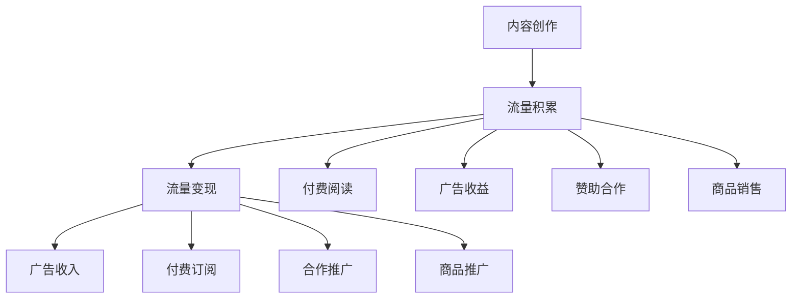

                 

# 程序员如何利用Medium进行知识变现

在数字化时代，程序员已经不再仅仅是代码的编写者，而是信息的中转站和知识的生产者。如何高效地将编程经验和专业知识转化为有价值的收益，成为了每位有志于在职业道路上更进一步的程序员的重要课题。Medium作为全球领先的在线内容创作平台，为程序员提供了一个展示技能、分享经验、变现知识的绝佳场所。本文将深入探讨程序员如何利用Medium进行知识变现，覆盖从入门到进阶的各个方面，帮助你在知识和经济的双重道路上迈出坚实的一步。

## 1. 背景介绍

### 1.1 问题由来

互联网的快速发展，尤其是在内容创作和知识分享领域，催生了一批新的职业角色，程序员亦在其中。程序员通过博客、视频、教程等形式，将自己的专业知识和实践经验分享出去，不仅能够帮助他人学习成长，也为自己带来了额外的收入和职业发展机会。而Medium，作为全球最大的技术分享平台之一，为程序员提供了一个高效、广泛的平台，让他们能够将知识和技能转化为货币价值。

### 1.2 问题核心关键点

本文旨在探讨程序员如何利用Medium进行知识变现，需要从以下几个方面进行深入分析：

- Medium作为内容平台的特点和优势。
- 如何利用Medium的流量和社区资源进行知识变现。
- Medium变现的具体方式及案例分析。
- 利用Medium进行知识变现的技巧和策略。

通过回答这些问题，将帮助程序员掌握在Medium上成功变现的必备技能和策略。

## 2. 核心概念与联系

### 2.1 核心概念概述

在讨论如何利用Medium进行知识变现之前，我们先来梳理一些核心概念：

- **Medium**：全球领先的内容创作平台，提供开放、友好的创作环境，吸引全球数亿用户访问和使用。
- **知识变现**：将专业知识、技能、经验等转化为经济收益的过程，包括但不限于获得广告收入、赞助、付费订阅等。
- **内容创作**：在平台上创作和发布高质量文章、教程、代码片段等，吸引读者关注和互动。
- **流量变现**：通过文章、项目、课程等吸引大量流量，利用平台提供的变现工具进行收益。

这些概念之间存在着紧密的联系：内容创作是变现的基石，流量则是变现的必要条件，而变现则是创作和流量的最终目的。

### 2.2 核心概念原理和架构的 Mermaid 流程图(Mermaid 流程节点中不要有括号、逗号等特殊字符)

这个流程图展示了从内容创作到流量变现的基本流程，以及在每个环节可采用的具体变现方式。

## 3. 核心算法原理 & 具体操作步骤

### 3.1 算法原理概述

利用Medium进行知识变现的算法原理，可以总结为以下几个关键点：

- **内容创作**：高质量的内容创作是吸引读者和流量的基础。
- **流量获取**：通过内容推广、社交媒体营销、社区互动等方式，吸引和维持流量。
- **变现渠道**：选择适合的变现方式，如付费阅读、广告收入、商品销售等。
- **用户互动**：通过评论、提问、私信等方式，增强与读者之间的互动，提升品牌认知度。

### 3.2 算法步骤详解

以下是详细的算法步骤：

1. **内容创作**：
    - 选择合适的题材和主题，如编程语言、开发工具、软件架构、项目管理等。
    - 利用Medium提供的Markdown语法和格式，编写清晰、有吸引力的文章。
    - 插入代码片段、图表、视频等，使文章更加生动丰富。

2. **流量获取**：
    - 在平台上积极参与话题讨论，分享自己的见解和经验。
    - 利用社交媒体平台（如Twitter、LinkedIn、GitHub等）推广自己的文章。
    - 参与Medium社区活动，提升在社区中的曝光度。

3. **变现渠道**：
    - **付费阅读**：将文章设置为付费阅读，只有订阅者才能访问。
    - **广告收入**：申请加入Medium的合作伙伴计划，获取广告收入。
    - **赞助合作**：与品牌商合作，接受品牌赞助或广告。
    - **商品销售**：通过Medium推广自己的书籍、课程、软件等产品。

4. **用户互动**：
    - 回复读者的评论和提问，增加互动性。
    - 通过私信与读者建立联系，推荐自己的产品或服务。

### 3.3 算法优缺点

利用Medium进行知识变现的优点包括：

- **低门槛**：无须建立个人网站或博客，直接在Medium平台上创建账号并开始创作。
- **广泛曝光**：Medium拥有全球数亿用户，能够快速扩大内容的覆盖范围。
- **多样化变现**：除了广告收入，还可以利用付费阅读、赞助合作、商品销售等多种方式变现。

缺点方面：

- **平台依赖**：过度依赖平台流量和变现策略，可能影响创作的自由度。
- **竞争激烈**：内容创作者众多，需要具备较强的创作能力和市场竞争力。
- **收益不确定**：变现收益受多种因素影响，如内容质量、读者活跃度、市场趋势等。

### 3.4 算法应用领域

利用Medium进行知识变现不仅适用于个人开发者和团队，还可以应用于技术博客、企业内部知识分享、开源项目文档等多种场景。

## 4. 数学模型和公式 & 详细讲解 & 举例说明

由于利用Medium进行知识变现涉及的主要是内容创作、流量管理和变现策略，并不涉及复杂的数学模型和公式推导，因此此部分不作深入讲解。

## 5. 项目实践：代码实例和详细解释说明

### 5.1 开发环境搭建

- **Medium账号创建**：前往Medium官网，注册一个新账号，完善个人资料和头像。
- **文章创建**：在Medium上创建一个新的文章草稿，并根据平台提供的Markdown语法进行排版和格式化。
- **社交媒体推广**：将文章分享到Twitter、LinkedIn、GitHub等社交平台，使用平台的内置链接和分享功能。

### 5.2 源代码详细实现

由于利用Medium进行知识变现并不涉及复杂的编程代码，因此此部分不作详细实现。

### 5.3 代码解读与分析

由于内容创作和流量管理主要依赖于写作和社交技能，而不是编程代码，因此此部分不作代码解读与分析。

### 5.4 运行结果展示

由于变现效果的展示通常依赖于平台上的数据统计和反馈，因此此部分不作具体的运行结果展示。

## 6. 实际应用场景

### 6.1 技术博客

利用Medium进行技术博客创建和发布，可以吸引大量的技术爱好者和同行关注。通过高质量的内容创作和持续更新，可以获得付费订阅和广告收入。

### 6.2 企业内部知识分享

企业可以将员工的技术博客、项目文档、经验分享等发布在Medium上，提升内部知识共享效率，同时也可以通过付费阅读和赞助合作获取收益。

### 6.3 开源项目文档

开源项目可以借助Medium进行文档的发布和维护，利用付费阅读和广告收入回馈开发者和维护者。

### 6.4 未来应用展望

随着数字技术的进步和内容平台的不断优化，利用Medium进行知识变现的前景更加广阔。未来的发展趋势可能包括：

- **智能推荐**：利用人工智能技术，推荐读者感兴趣的内容，提升阅读体验和变现效果。
- **跨平台联动**：将Medium与其他平台（如YouTube、Slack等）联动，扩展变现渠道。
- **实时互动**：增强与读者之间的互动，如直播、问答、即时通讯等，提升用户粘性和变现潜力。

## 7. 工具和资源推荐

### 7.1 学习资源推荐

- **Medium官方文档**：Medium的官方文档提供了详细的平台使用指南和开发者工具介绍。
- **Medium课程和教程**：Medium平台上有大量优秀的编程课程和教程，涵盖各种技术和应用。
- **编程社区和论坛**：如Stack Overflow、Reddit等，可以获取编程技巧、解决方案和社区互动经验。

### 7.2 开发工具推荐

- **Markdown编辑器**：如Typora、Visual Studio Code等，支持Markdown语法和代码格式化。
- **社交媒体管理工具**：如Hootsuite、Buffer等，方便管理和发布社交媒体内容。
- **统计分析工具**：如Google Analytics、Medium内建分析工具等，跟踪和分析流量和变现效果。

### 7.3 相关论文推荐

- **内容创作与流量变现**：探讨内容创作和流量变现之间的相互作用，提出提升变现效果的方法。
- **社区互动与品牌建设**：研究社区互动对品牌认知度和用户粘性的影响，提出有效的互动策略。

## 8. 总结：未来发展趋势与挑战

### 8.1 研究成果总结

本文从内容创作、流量获取、变现渠道和用户互动四个方面，探讨了利用Medium进行知识变现的方法和策略。通过对Medium平台特点和变现渠道的深入分析，帮助程序员掌握在Medium上成功变现的必备技能和策略。

### 8.2 未来发展趋势

未来的发展趋势可能包括：

- **内容创新**：不断尝试新的内容形式和技术，提升内容的多样性和吸引力。
- **数据驱动**：利用大数据和人工智能技术，精准推荐和分析流量和变现效果。
- **社区深化**：增强与社区成员的互动，建立更深层次的连接和信任。

### 8.3 面临的挑战

面临的挑战包括：

- **内容创作**：保持高质量的内容创作，不断更新和迭代，避免内容疲劳和流失。
- **流量获取**：在竞争激烈的环境中，如何有效吸引和维持流量。
- **变现策略**：选择适合的变现方式，最大化收益，避免过度依赖单一渠道。

### 8.4 研究展望

未来的研究可以从以下几个方面进行探索：

- **内容个性化**：利用机器学习和推荐系统，提供个性化的内容推荐，提升用户体验和满意度。
- **多平台联动**：探索与其他平台（如YouTube、Slack等）的联动，扩展变现渠道和用户覆盖面。
- **实时互动**：增强与读者之间的实时互动，如直播、问答、即时通讯等，提升用户粘性和变现潜力。

## 9. 附录：常见问题与解答

**Q1：如何在Medium上创建和发布高质量文章？**

A: 高质量的文章应具备以下特点：
- **清晰的主题和结构**：明确的主题和清晰的结构，使读者易于理解。
- **丰富的实例和代码**：插入实际的代码片段、图表和实例，使内容更加生动和可操作。
- **互动和反馈**：鼓励读者在评论区留言，积极回应读者的提问和反馈。

**Q2：如何利用社交媒体推广文章？**

A: 利用社交媒体推广文章，可以采用以下方法：
- **使用平台内置的分享功能**：分享文章的链接，利用平台的内置推广工具。
- **编写简短而有吸引力的推广文案**：编写简短精炼的推广文案，突出文章亮点。
- **利用标签和话题**：使用相关的标签和话题，增加文章曝光度。

**Q3：如何通过付费阅读变现？**

A: 通过付费阅读变现，可以采用以下方法：
- **设置付费订阅**：将文章设置为付费阅读，只有订阅者才能访问。
- **利用平台会员计划**：加入Medium的会员计划，享受独家内容和更高收益。
- **提供独家内容**：在付费阅读文章中提供独家内容或资源，吸引订阅者。

**Q4：如何利用广告收入变现？**

A: 利用广告收入变现，可以采用以下方法：
- **申请加入合作伙伴计划**：通过Medium的广告平台，获取广告收入。
- **优化广告位**：在文章中适当放置广告位，吸引读者点击。
- **定期更新广告素材**：定期更新广告素材，保持广告新鲜感和吸引力。

**Q5：如何通过商品销售变现？**

A: 通过商品销售变现，可以采用以下方法：
- **链接商品**：在文章中链接自己的商品或相关产品。
- **使用商品推广工具**：利用Medium的商品推广工具，增加商品曝光和销售量。
- **提供优惠和折扣**：通过限时优惠和折扣，吸引读者购买。

---

作者：禅与计算机程序设计艺术 / Zen and the Art of Computer Programming

