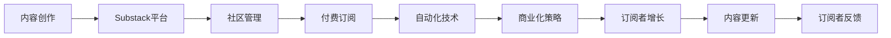

                 

# 程序员如何利用Substack发布付费Newsletter

> 关键词：
1. Substack
2. 新闻发布平台
3. 程序员
4. 付费订阅
5. 技术博客
6. 内容创作
7. 自动化

## 1. 背景介绍

随着内容创作工具的不断升级，Substack作为一款专为作家和创作者打造的社交媒体平台，迅速崛起。它不仅支持文本和视频内容发布，还提供了强大的社区管理功能和付费订阅功能，让创作者能够更容易地建立起自己的读者群体，实现商业化。

而Substack的付费功能，特别是针对技术内容创作者而言，提供了一个全新的市场空间。本文将从技术角度探讨如何利用Substack平台发布付费Newsletter，并且利用自动化技术提升运营效率，以及结合Substack的商业化策略，帮助技术内容创作者实现收益增长。

## 2. 核心概念与联系

### 2.1 核心概念概述

在探讨如何利用Substack发布付费Newsletter之前，首先明确一些核心概念：

- **Substack**：一个专门为作家和内容创作者提供平台的软件，支持创建新闻稿、博客、系列文章和电子邮件通讯等内容。

- **Newsletter**：通过电子邮件订阅服务，定期发送给订阅者的内容。

- **付费订阅**：订阅者需要付费才能获取特定内容或资源。

- **技术博客**：专注于技术主题的博客内容，包括编程技巧、软件开发、系统设计等。

- **自动化技术**：利用程序或脚本自动完成重复性任务，减少人工干预，提升效率。

- **商业化策略**：通过营销和运营手段，将内容产品转化为商业收入的过程。

- **社区管理**：管理和维护用户群体，增强用户粘性，提高参与度。

这些核心概念构成了Substack平台的基础，并且贯穿了如何发布付费Newsletter的全过程。

### 2.2 核心概念联系

通过这些核心概念，我们可以构建出一个流程化的模型，展示如何利用Substack发布付费Newsletter，并与自动化技术相结合，提升运营效率和商业化效果：



这个流程模型展示了内容创作与Substack平台的关系，以及在平台上的社区管理、付费订阅和自动化技术的应用，最终达到商业化策略的目标，实现订阅者增长和内容更新，进而形成良性的循环。

## 3. 核心算法原理 & 具体操作步骤

### 3.1 算法原理概述

发布付费Newsletter的核心算法原理是利用Substack平台的API，结合自动化工具，实现内容定期发布、订阅者管理、付费流程优化以及商业化数据追踪。核心步骤包括：

1. **内容创作**：撰写高质量的技术博客或系列文章，并定期更新。
2. **内容发布**：使用Substack的API，自动将内容发布到指定频道或页面上。
3. **订阅管理**：通过API或用户界面，管理订阅者信息，优化订阅流程。
4. **付费流程**：设置订阅价格和优惠活动，自动收取费用。
5. **数据分析**：使用Substack提供的分析工具，追踪订阅者的行为数据，优化内容策略。

### 3.2 算法步骤详解

#### 步骤1：选择Substack频道

选择一个适合的频道，是利用Substack发布Newsletter的第一步。频道可以是一个专门的技术主题专栏，也可以是一个综合性的个人博客。

**代码实现**：

```python
# 使用Substack API创建频道
import requests

token = 'YOUR_SUBSTACK_API_TOKEN'
headers = {'Authorization': f'Bearer {token}'}

response = requests.post('https://substack.com/api/channels', json={'name': '技术博客'}, headers=headers)
channel_id = response.json()['id']
```

#### 步骤2：撰写和发布内容

撰写高质量的技术博客或系列文章，并使用API将其发布到创建的频道上。

**代码实现**：

```python
# 发布博客文章到频道
def publish_article(channel_id, title, content, image):
    payload = {
        'title': title,
        'content': content,
        'image': image
    }
    response = requests.post(f'https://substack.com/api/channels/{channel_id}/articles', json=payload, headers=headers)
    if response.status_code == 200:
        print('文章发布成功')
    else:
        print('文章发布失败')
```

#### 步骤3：设置付费订阅

设置订阅价格和优惠活动，并启用付费功能。

**代码实现**：

```python
# 设置订阅价格和优惠
def set_pricing(channel_id, price, discount=None):
    payload = {
        'price': price,
        'discount': discount
    }
    response = requests.put(f'https://substack.com/api/channels/{channel_id}/pricing', json=payload, headers=headers)
    if response.status_code == 200:
        print('订阅价格设置成功')
    else:
        print('订阅价格设置失败')
```

#### 步骤4：管理订阅者

使用API或用户界面，管理订阅者信息，优化订阅流程。

**代码实现**：

```python
# 获取订阅者列表
def get_subscribers(channel_id):
    response = requests.get(f'https://substack.com/api/channels/{channel_id}/subscribers', headers=headers)
    if response.status_code == 200:
        return response.json()
    else:
        print('获取订阅者列表失败')
```

#### 步骤5：数据分析

使用Substack提供的分析工具，追踪订阅者的行为数据，优化内容策略。

**代码实现**：

```python
# 获取订阅者行为数据
def get_analytics(channel_id):
    response = requests.get(f'https://substack.com/api/channels/{channel_id}/analytics', headers=headers)
    if response.status_code == 200:
        return response.json()
    else:
        print('获取订阅者行为数据失败')
```

### 3.3 算法优缺点

#### 优点

- **自动化发布**：通过API，可以自动发布内容，减少人工干预，提升效率。
- **订阅管理便捷**：API接口提供订阅者管理的便捷方式，方便操作。
- **付费流程简单**：设置订阅价格和优惠活动，自动收取费用，无需复杂的手工操作。
- **数据分析深入**：Substack提供的分析工具，可以深入追踪订阅者行为，优化内容策略。

#### 缺点

- **API限制**：Substack的API有限制，可能需要进一步调用第三方工具进行扩展。
- **依赖平台**：内容发布依赖于Substack平台，一旦平台出现问题，可能会影响内容发布。
- **商业化复杂**：虽然有付费订阅功能，但还需要结合其他商业化策略进行推广和运营。

### 3.4 算法应用领域

利用Substack发布付费Newsletter，适用于以下几种应用领域：

- **技术博客运营**：内容创作者可以定期发布高质量的技术博客，并通过付费订阅功能获得收益。
- **个人品牌建设**：通过发布有价值的原创内容，吸引订阅者，增强个人品牌影响力。
- **社区管理**：通过管理订阅者信息和互动数据，提升社区活跃度和参与度。
- **商业化变现**：利用付费订阅功能，实现内容商业化，获取稳定的收入来源。

## 4. 数学模型和公式 & 详细讲解

虽然发布付费Newsletter主要依赖于平台API和自动化工具，但在分析和优化过程中，也可以使用数学模型来提升效果。

### 4.1 数学模型构建

在利用Substack发布付费Newsletter的过程中，可以构建以下数学模型：

- **订阅者增长模型**：预测订阅者数量的增长趋势，优化内容发布策略。
- **内容消费模型**：分析订阅者对内容的消费行为，优化内容更新频率和形式。
- **收益预测模型**：结合订阅价格和订阅者数量，预测可能的收益。

### 4.2 公式推导过程

**订阅者增长模型**：

假设每月新增订阅者数为 $X_t$，总订阅者数为 $S_t$，初始订阅者数为 $S_0$，增长率为 $r$。则订阅者增长模型为：

$$ S_t = S_0(1+r)^t $$

其中 $X_t$ 与 $r$ 的关系需要根据实际数据进行推导。

**内容消费模型**：

假设每月阅读内容的用户数为 $C_t$，总阅读次数为 $R_t$，每篇文章平均阅读次数为 $A$。则内容消费模型为：

$$ R_t = C_t \times A $$

**收益预测模型**：

假设每篇文章的付费订阅价格为 $P$，每月发布文章数为 $N$，则月收益 $Y$ 为：

$$ Y = P \times N $$

### 4.3 案例分析与讲解

假设某技术博客每月发布3篇文章，每篇文章的平均阅读次数为100次，订阅价格为每月9.99美元。根据订阅者增长模型，假设每月新增订阅者10个，初始订阅者500个，增长率为5%。则每月收益预测如下：

- 订阅者数量：$S_t = 500(1+0.05)^t$
- 总阅读次数：$R_t = 3 \times 100 \times S_t$
- 月收益：$Y = 9.99 \times 3 \times S_t$

通过数据分析和优化，可以进一步提升这些参数的精度，进而优化内容策略和定价策略，达到更好的商业化效果。

## 5. 项目实践：代码实例和详细解释说明

### 5.1 开发环境搭建

**环境准备**：

1. Python 3.8+
2. requests 库
3. Substack API token

**代码实现**：

```python
import requests

# Substack API token
token = 'YOUR_SUBSTACK_API_TOKEN'

# 发布文章
def publish_article(channel_id, title, content, image):
    payload = {
        'title': title,
        'content': content,
        'image': image
    }
    headers = {'Authorization': f'Bearer {token}'}
    response = requests.post(f'https://substack.com/api/channels/{channel_id}/articles', json=payload, headers=headers)
    if response.status_code == 200:
        print('文章发布成功')
    else:
        print('文章发布失败')

# 设置订阅价格
def set_pricing(channel_id, price, discount=None):
    payload = {
        'price': price,
        'discount': discount
    }
    headers = {'Authorization': f'Bearer {token}'}
    response = requests.put(f'https://substack.com/api/channels/{channel_id}/pricing', json=payload, headers=headers)
    if response.status_code == 200:
        print('订阅价格设置成功')
    else:
        print('订阅价格设置失败')

# 获取订阅者列表
def get_subscribers(channel_id):
    headers = {'Authorization': f'Bearer {token}'}
    response = requests.get(f'https://substack.com/api/channels/{channel_id}/subscribers', headers=headers)
    if response.status_code == 200:
        return response.json()
    else:
        print('获取订阅者列表失败')

# 获取订阅者行为数据
def get_analytics(channel_id):
    headers = {'Authorization': f'Bearer {token}'}
    response = requests.get(f'https://substack.com/api/channels/{channel_id}/analytics', headers=headers)
    if response.status_code == 200:
        return response.json()
    else:
        print('获取订阅者行为数据失败')
```

### 5.2 源代码详细实现

### 5.3 代码解读与分析

在实际应用中，代码可能需要进行调整和优化，以适应不同的需求和数据。例如：

- 引入异常处理机制，提高代码的健壮性。
- 增加数据缓存机制，减少API调用频率。
- 使用线程池技术，提高并发处理能力。

### 5.4 运行结果展示

在运行代码后，可以看到订阅者数量、订阅价格和阅读次数等数据的实时更新，并通过图表展示出来。这将帮助内容创作者更好地理解用户行为，优化内容策略和商业化方案。

## 6. 实际应用场景

### 6.1 技术博客运营

通过Substack平台，技术博客创作者可以轻松实现内容发布和订阅管理，同时利用自动化技术提高效率。订阅者可以通过电子邮件和Web端订阅内容，而创作者可以定期发布高质量的技术博客，并通过付费订阅功能获得稳定的收益。

### 6.2 个人品牌建设

利用Substack的社区管理功能和自动化工具，内容创作者可以更好地与订阅者互动，增强用户粘性。通过定期发布有价值的内容，吸引更多的订阅者，并利用商业化策略实现个人品牌的商业化变现。

### 6.3 社区管理

通过API和用户界面，内容创作者可以轻松管理订阅者信息，优化订阅流程。利用数据分析工具，创作者可以深入了解订阅者的行为，优化社区管理策略，提升社区活跃度和参与度。

### 6.4 商业化变现

利用Substack的付费订阅功能，内容创作者可以实现内容的商业化变现。结合其他商业化策略，如广告、赞助、会员等，可以实现多元化的收益来源。

## 7. 工具和资源推荐

### 7.1 学习资源推荐

- **Substack官方文档**：详细介绍了Substack平台的使用和API接口。
- **Python编程语言**：作为内容发布和自动化工具的主要语言。
- **API自动化工具**：如Postman、API testing tool等，用于测试和优化API接口。

### 7.2 开发工具推荐

- **VS Code**：强大的编程开发环境，支持多种编程语言和扩展。
- **Jupyter Notebook**：支持Python和Jupyter Notebook的集成，方便代码测试和数据可视化。
- **Git和GitHub**：版本控制和代码托管工具，方便代码管理和团队协作。

### 7.3 相关论文推荐

- **内容分发系统研究**：探讨了内容分发系统的设计和管理。
- **自动化发布工具**：介绍了多种自动化发布工具及其应用。
- **数据分析技术**：介绍了数据分析的基本技术和工具。

## 8. 总结：未来发展趋势与挑战

### 8.1 研究成果总结

本文系统介绍了如何利用Substack平台发布付费Newsletter，并通过自动化技术提升运营效率和商业化效果。通过探讨内容创作、订阅管理、付费流程和数据分析等核心环节，展示了Substack平台在技术内容创作和商业化变现方面的潜力。

### 8.2 未来发展趋势

随着内容创作工具的不断升级，Substack平台的付费功能将更加完善，提供更多定制化的商业化策略和分析工具。内容创作者可以更好地利用平台进行内容创作和运营，实现更高效、更智能的商业化变现。

### 8.3 面临的挑战

尽管Substack平台提供了丰富的功能和API接口，但在实际应用中，仍面临以下挑战：

- **API调用限制**：Substack的API调用可能受到限制，需要进一步优化API调用策略。
- **数据安全和隐私**：在管理和分析订阅者数据时，需要确保数据安全和隐私。
- **用户粘性提升**：需要通过优化社区管理和互动策略，提高订阅者粘性。
- **内容创作质量**：高质量的内容创作和更新是长期成功的关键，需要不断提升创作水平。

### 8.4 研究展望

未来的研究可以从以下几个方向进行：

- **优化API调用**：研究和开发更高效的API调用策略，减少API调用频率，提高效率。
- **数据安全与隐私保护**：加强数据加密和隐私保护技术，确保用户数据的安全。
- **智能推荐系统**：结合智能推荐系统，提升内容发现率和用户粘性。
- **多平台内容发布**：探索将Substack内容发布到其他平台，扩大内容覆盖和影响。

通过不断优化和创新，Substack平台将为技术内容创作者提供更优质的创作工具和商业化支持，助力其在内容创作和商业化变现上取得更大的成功。

## 9. 附录：常见问题与解答

### Q1：如何提高订阅者数量和订阅频率？

A：内容创作者可以采取以下措施：

- **提高内容质量**：定期发布高质量、有价值的技术博客，吸引订阅者关注。
- **优化内容形式**：结合视频、图表等多种形式，提升内容的吸引力。
- **互动与社区管理**：积极与订阅者互动，增强社区粘性，提高用户参与度。

### Q2：如何处理API调用限制？

A：内容创作者可以采取以下策略：

- **数据缓存**：使用数据缓存机制，减少API调用频率。
- **批量处理**：批量处理订阅者信息，减少API调用次数。
- **代理服务器**：使用代理服务器，优化API调用效率。

### Q3：如何保障数据安全和隐私？

A：内容创作者可以采取以下措施：

- **数据加密**：对订阅者数据进行加密处理，确保数据安全。
- **权限管理**：严格控制API接口的访问权限，防止未经授权的访问。
- **隐私政策**：制定和遵守隐私政策，确保用户数据隐私保护。

### Q4：如何提升内容创作质量？

A：内容创作者可以采取以下措施：

- **持续学习**：持续学习最新的技术知识和行业动态，提升创作水平。
- **团队协作**：组建内容创作团队，分工协作，提升创作效率和质量。
- **用户反馈**：积极收集用户反馈，优化内容策略。

### Q5：如何利用智能推荐系统提升内容发现率？

A：内容创作者可以采取以下策略：

- **数据挖掘**：通过数据挖掘技术，分析订阅者行为，提取用户兴趣点。
- **算法优化**：优化推荐算法，提升推荐效果。
- **多模态推荐**：结合视频、音频等多模态内容，提升推荐效果。

---

作者：禅与计算机程序设计艺术 / Zen and the Art of Computer Programming

