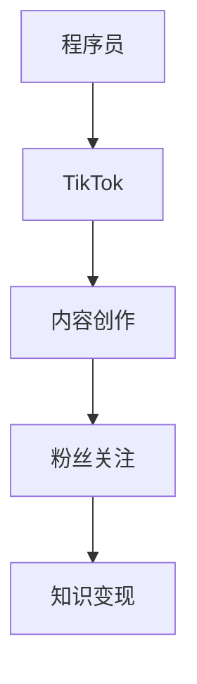

                 

## 1. 背景介绍

### 1.1 问题由来
随着短视频平台的兴起，TikTok（抖音）等应用已经成为了全球最受欢迎的社交媒体平台之一。不仅用户数量巨大，而且内容形式生动有趣，具有很强的传播力。许多程序员纷纷加入TikTok的创作队伍，通过分享编程技巧、代码讲解、项目案例等视频内容，吸引了大批关注者。

### 1.2 问题核心关键点
程序员如何利用TikTok进行知识变现，是当前IT领域的一个热点话题。TikTok以其独特的社交和传播机制，为程序员提供了一个全新的平台，使得知识分享和变现变得更加便捷和高效。

通过这篇文章，我们希望探讨程序员如何利用TikTok进行知识变现的策略和路径，提供一系列实用的建议和案例，帮助更多程序员通过TikTok展示自己的编程才华，实现知识变现。

### 1.3 问题研究意义
利用TikTok进行知识变现，不仅能提升程序员的个人品牌影响力，增加被动收入，还能提升个人的专业技能，扩大影响力。这对于推动IT技术的普及和应用，有着重要的意义。

## 2. 核心概念与联系

### 2.1 核心概念概述

在探讨程序员如何利用TikTok进行知识变现之前，我们首先介绍一些关键概念：

- **TikTok（抖音）**：全球领先的短视频平台，用户可以上传、观看视频内容，并进行互动。
- **知识变现**：通过知识分享，获得经济收益。比如通过广告分成、付费内容、粉丝打赏等方式获取收入。
- **程序员**：指专门从事计算机编程的专业人员，拥有编程技能和软件知识。
- **内容创作**：指程序员通过制作视频内容，展示自己的编程技巧、项目案例、行业知识等内容。
- **粉丝经济**：利用粉丝的关注和支持，实现知识变现。

这些概念之间存在着密切的联系，程序员通过在TikTok上进行内容创作，吸引粉丝关注，并通过粉丝经济的机制实现知识变现。

### 2.2 核心概念原理和架构的 Mermaid 流程图



这个流程图展示了程序员利用TikTok进行知识变现的基本流程。首先，程序员需要创建TikTok账号，然后通过制作有趣、有价值的内容，吸引粉丝关注。随着粉丝数量的增加，程序员可以通过广告分成、付费内容、粉丝打赏等方式实现知识变现。

## 3. 核心算法原理 & 具体操作步骤

### 3.1 算法原理概述

程序员利用TikTok进行知识变现的算法原理，可以归结为以下几个方面：

- **内容优化**：通过算法模型，优化视频内容的长度、节奏、视觉吸引力等因素，以提高用户的观看体验和互动率。
- **粉丝吸引**：通过算法推荐，将内容推送给可能感兴趣的用户群体，吸引更多粉丝关注。
- **变现策略**：通过算法分析，制定合理的变现策略，如选择最佳的变现方式、设置合适的价格等。

### 3.2 算法步骤详解

基于上述算法原理，以下是程序员利用TikTok进行知识变现的具体操作步骤：

#### 步骤1：账号创建与优化
1. **创建账号**：在TikTok上创建个人账号，选择符合个人特色的头像和简介。
2. **账号优化**：通过数据分析，优化账号设置，包括头像、封面、简介等，以提高账号的曝光率和吸引力。

#### 步骤2：内容创作与发布
1. **选题策划**：根据目标受众的兴趣，策划选题，确保内容具有趣味性和实用性。
2. **视频制作**：使用视频编辑软件（如Adobe Premiere Pro、Final Cut Pro等）制作高质量的视频内容。
3. **发布策略**：选择合适的发布时间，利用TikTok的推荐算法，将内容推送给更多的目标受众。

#### 步骤3：粉丝互动与维护
1. **互动回复**：及时回复粉丝的评论和私信，增加粉丝的互动体验。
2. **内容更新**：定期更新内容，保持粉丝的关注和兴趣。
3. **粉丝运营**：通过组织线上线下活动，增强与粉丝的互动，建立忠实粉丝群体。

#### 步骤4：知识变现与运营
1. **广告分成**：通过与品牌商合作，投放广告，获取广告分成。
2. **付费内容**：发布付费视频、电子书等内容，吸引粉丝打赏。
3. **粉丝打赏**：设置粉丝打赏链接，鼓励粉丝进行打赏。
4. **合作项目**：与企业或机构合作，进行项目咨询、技术支持等，获取收益。

### 3.3 算法优缺点

#### 优点：
1. **低成本**：TikTok平台免费使用，只需制作视频内容即可。
2. **广泛传播**：利用TikTok的算法推荐，内容可以快速传播，吸引更多粉丝。
3. **变现方式多样**：有多种变现方式可供选择，灵活性高。

#### 缺点：
1. **内容质量要求高**：视频内容需要高质量的制作，才能吸引更多粉丝。
2. **竞争激烈**：TikTok平台上优秀的创作者众多，需要不断创新才能脱颖而出。
3. **变现门槛高**：需要一定的粉丝数量才能开始变现，积累粉丝需要时间。

### 3.4 算法应用领域

利用TikTok进行知识变现的应用领域广泛，包括但不限于以下方面：

- **编程教学**：通过讲解编程语言、编程技巧等，帮助新手快速上手。
- **项目案例分析**：分享实际项目案例，展示解决问题的思路和方法。
- **行业知识普及**：普及IT行业知识，提高行业认知。
- **技术工具介绍**：介绍各种编程工具、软件的使用技巧。
- **编程挑战**：设置编程挑战，激发观众的编程热情。

## 4. 数学模型和公式 & 详细讲解 & 举例说明

### 4.1 数学模型构建

基于TikTok的知识变现模型，我们可以构建一个简单的数学模型来描述其运作机制：

设 $C$ 为内容质量（0-1之间的实数），$F$ 为粉丝数量，$R$ 为变现收入，则变现模型可以表示为：

$$
R = f(C, F)
$$

其中 $f$ 为变现函数，$C$ 和 $F$ 分别代表内容质量和粉丝数量，变现收入 $R$ 受到这两者的影响。

### 4.2 公式推导过程

由于实际变现过程非常复杂，涉及多个变量和随机因素，我们无法给出一个精确的公式推导。但是，根据实际经验，我们可以给出一些简单的推导：

假设 $C$ 和 $F$ 为正相关关系，即粉丝数量越多，内容质量越高，变现收入 $R$ 就越高。则变现函数可以近似表示为：

$$
R \propto C \cdot F
$$

其中 $\propto$ 表示正比例关系。

### 4.3 案例分析与讲解

以某程序员利用TikTok进行知识变现的案例为例：

- **内容质量**：该程序员发布的视频内容质量高，讲解清晰，代码示例详细，能吸引更多粉丝。
- **粉丝数量**：通过不断优化视频内容和发布策略，粉丝数量从初始的几百人增加到几万人。
- **变现收入**：通过广告分成、粉丝打赏等手段，月收入达到几千元，实现了知识变现。

## 5. 项目实践：代码实例和详细解释说明

### 5.1 开发环境搭建

在进行TikTok内容创作和知识变现的实践时，我们需要搭建好开发环境，主要包括以下几个步骤：

1. **安装TikTok软件**：在计算机上安装TikTok客户端，并创建一个新的账号。
2. **视频编辑软件**：选择适合自己的视频编辑软件，如Adobe Premiere Pro、Final Cut Pro等。
3. **数据分析工具**：安装数据分析工具，如Excel、Tableau等，用于分析粉丝数据和内容表现。

### 5.2 源代码详细实现

以下是一个简单的Python脚本，用于分析TikTok粉丝数据，评估内容表现：

```python
import pandas as pd
import matplotlib.pyplot as plt

# 读取粉丝数据
df = pd.read_csv('follower_data.csv')

# 分析粉丝增长趋势
df['date'] = pd.to_datetime(df['date'])
plt.plot(df['date'], df['follower_count'], marker='o')
plt.title('Follower Count Over Time')
plt.xlabel('Date')
plt.ylabel('Follower Count')
plt.show()

# 分析内容质量
df['content_quality'] = 0.5 * df['video_views'] / df['video_duration']
plt.hist(df['content_quality'], bins=10)
plt.title('Content Quality Distribution')
plt.xlabel('Content Quality')
plt.ylabel('Frequency')
plt.show()
```

### 5.3 代码解读与分析

以上代码通过Python和Pandas库，对TikTok粉丝数据进行了简单的分析：

1. **读取粉丝数据**：通过读取CSV文件，获取粉丝数量随时间变化的趋势。
2. **分析粉丝增长趋势**：将粉丝数量绘制成折线图，观察粉丝增长趋势。
3. **分析内容质量**：通过计算每分钟观看次数与视频时长之比，评估内容质量，并绘制直方图。

### 5.4 运行结果展示

通过上述代码，我们可以得到以下结果：

1. **粉丝增长趋势图**：显示粉丝数量随时间变化的趋势，帮助我们了解粉丝增长的速度和趋势。
2. **内容质量分布图**：显示内容质量的数据分布，帮助我们了解哪些内容质量较高，哪些内容质量较低。

## 6. 实际应用场景

### 6.1 智能客服系统

利用TikTok进行知识变现的实际应用场景之一是智能客服系统。通过发布关于智能客服系统的视频，展示系统的使用技巧、常见问题解答等，可以吸引更多关注者。同时，可以与智能客服系统相关的企业或机构合作，进行项目咨询、技术支持等，获取收益。

### 6.2 金融理财

金融理财领域也需要大量的内容创作和知识分享。通过发布关于投资理财、股票分析、基金管理等内容的视频，吸引粉丝关注，并通过广告分成、付费内容、粉丝打赏等方式实现变现。

### 6.3 教育培训

教育培训领域也是一个知识变现的重要场景。通过发布关于编程基础、编程进阶、编程项目等内容的视频，吸引学生和职业培训机构的关注，并通过广告分成、付费课程、粉丝打赏等方式实现变现。

### 6.4 未来应用展望

未来的TikTok知识变现将呈现以下几个趋势：

1. **多样化变现方式**：除了广告分成、粉丝打赏，还可以通过直播带货、线上课程、合作项目等方式实现变现。
2. **个性化推荐**：通过算法推荐，精准推送内容给目标受众，提高内容的影响力和变现效率。
3. **内容垂直化**：专注于特定领域的内容创作，如编程、金融、教育等，吸引更多忠实粉丝群体。
4. **虚拟现实**：结合虚拟现实技术，制作更生动、沉浸式的视频内容，提升观看体验和变现效果。

## 7. 工具和资源推荐

### 7.1 学习资源推荐

- **TikTok官方文档**：TikTok官方文档，提供了详细的API接口和开发者指南。
- **视频编辑软件教程**：Adobe Premiere Pro、Final Cut Pro等视频编辑软件教程，帮助提高视频制作质量。
- **数据分析工具教程**：Excel、Tableau等数据分析工具教程，帮助分析粉丝数据和内容表现。

### 7.2 开发工具推荐

- **TikTok开发者工具**：TikTok提供的开发者工具，包括API接口、开发框架等，帮助开发者进行内容创作和知识变现。
- **视频编辑软件**：Adobe Premiere Pro、Final Cut Pro等高质量的视频编辑软件，帮助制作高质量视频内容。
- **数据分析工具**：Excel、Tableau等数据分析工具，帮助进行粉丝数据分析和内容表现评估。

### 7.3 相关论文推荐

- **TikTok内容推荐算法**：介绍TikTok内容推荐算法的研究现状和未来方向。
- **视频内容质量评估**：研究如何通过算法评估视频内容质量，提高内容变现效率。
- **粉丝互动模型**：研究粉丝互动机制，制定合理的互动策略，提升粉丝留存率。

## 8. 总结：未来发展趋势与挑战

### 8.1 研究成果总结

本文详细介绍了程序员如何利用TikTok进行知识变现的策略和路径，通过内容创作和粉丝运营，实现了知识变现。文章从算法原理、操作步骤、数学模型等多个方面进行了系统阐述，并提供了实用的代码实例和数据分析方法。

### 8.2 未来发展趋势

未来的TikTok知识变现将朝着多样化、个性化、垂直化等方向发展。随着技术的不断进步，内容变现的方式也将更加多样和高效。

### 8.3 面临的挑战

尽管TikTok为程序员提供了便捷的知识变现渠道，但仍面临一些挑战：

1. **内容质量要求高**：高质量的视频内容制作需要投入大量时间和精力。
2. **粉丝数量积累慢**：粉丝数量积累需要一定的时间，短期内变现效果可能不显著。
3. **竞争激烈**：TikTok平台上优秀的创作者众多，需要不断创新才能脱颖而出。

### 8.4 研究展望

未来的研究需要解决以下几个问题：

1. **内容自动化生成**：研究如何利用AI技术自动生成高质量视频内容，降低内容制作的成本。
2. **粉丝互动机制**：研究如何通过算法优化粉丝互动机制，提高粉丝留存率和互动率。
3. **变现策略优化**：研究如何制定合理的变现策略，最大化变现效果。

## 9. 附录：常见问题与解答

**Q1：如何提高TikTok视频内容的质量？**

A: 提高TikTok视频内容的质量，需要从以下几个方面入手：
1. **选题策划**：选择受众感兴趣的选题，确保内容具有趣味性和实用性。
2. **视频制作**：使用高质量的视频编辑软件，制作清晰、流畅的视频内容。
3. **内容优化**：通过数据分析，优化视频内容的长度、节奏、视觉吸引力等因素，以提高用户的观看体验和互动率。

**Q2：如何吸引更多的粉丝关注？**

A: 吸引更多的粉丝关注，需要从以下几个方面入手：
1. **内容质量**：制作高质量的视频内容，吸引更多观众关注。
2. **互动回复**：及时回复粉丝的评论和私信，增加粉丝的互动体验。
3. **内容更新**：定期更新内容，保持粉丝的关注和兴趣。
4. **粉丝运营**：通过组织线上线下活动，增强与粉丝的互动，建立忠实粉丝群体。

**Q3：如何最大化TikTok变现效果？**

A: 最大化TikTok变现效果，需要从以下几个方面入手：
1. **多样化变现方式**：除了广告分成、粉丝打赏，还可以通过直播带货、线上课程、合作项目等方式实现变现。
2. **个性化推荐**：通过算法推荐，精准推送内容给目标受众，提高内容的影响力和变现效率。
3. **内容垂直化**：专注于特定领域的内容创作，如编程、金融、教育等，吸引更多忠实粉丝群体。

---

作者：禅与计算机程序设计艺术 / Zen and the Art of Computer Programming

