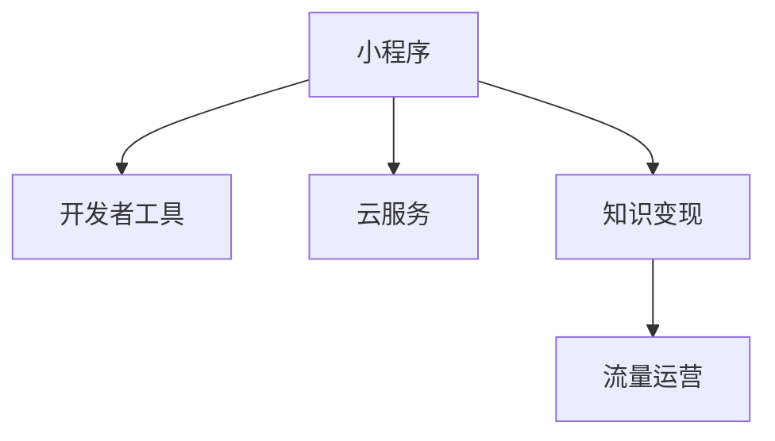

                 

# 程序员如何利用小程序进行知识变现

在互联网的浪潮中，程序员的生存状态发生了巨大的变化。从传统的代码编写，到如今的编码、测试、部署、运维等全栈流程，程序员的工作内容更加丰富多样。随着移动互联网和云服务的发展，小程序成为越来越多程序员变现知识、获取收入的新方式。本文将系统介绍如何利用小程序进行知识变现，包括开发环境搭建、项目实践、应用场景分析等内容。

## 1. 背景介绍

### 1.1 问题由来
随着移动互联网的迅猛发展，小程序成为连接用户和服务的桥梁。小程序以其轻量、便捷、快速响应等优势，受到用户和企业的广泛青睐。小程序不仅能够提高用户体验，还能为企业带来新的增长点。因此，小程序开发成为程序员获取收入的新途径。

### 1.2 问题核心关键点
对于程序员而言，如何利用小程序进行知识变现，是一个重要的问题。小程序的变现方式主要包括开发和运营两部分：开发高效、界面美观、功能强大的小程序；通过运营，吸引用户使用，通过广告、订阅、付费等形式实现变现。这需要程序员具备全面的技术能力和市场敏感性。

### 1.3 问题研究意义
本文旨在探讨程序员如何利用小程序进行知识变现，为程序员提供一套全面的实践指导。通过对小程序变现模式和开发运营策略的分析，帮助程序员快速掌握小程序变现的方法，提升其收入水平。

## 2. 核心概念与联系

### 2.1 核心概念概述

为更好地理解利用小程序进行知识变现的方法，本节将介绍几个密切相关的核心概念：

- 小程序：基于微信、支付宝、QQ等平台，通过代码编写实现的应用程序，具有便捷性、快速性、轻量性等特点。
- 开发者工具：如微信开发者工具、支付宝开发者平台等，提供小程序的开发、调试、测试等支持。
- 云服务：如腾讯云、阿里云等，提供小程序所需的计算、存储、网络等资源支持。
- 知识变现：通过小程序提供知识服务，如在线课程、技术咨询、知识分享等，获取收入。
- 流量运营：通过社交媒体、搜索引擎、广告投放等方式，吸引用户使用小程序，实现流量变现。

这些核心概念之间的逻辑关系可以通过以下Mermaid流程图来展示：



这个流程图展示了几大核心概念及其之间的关系：

1. 小程序是基础，提供服务能力。
2. 开发者工具辅助开发，提高开发效率。
3. 云服务提供资源支持，保障小程序的运行稳定性。
4. 知识变现通过小程序实现，获取经济收入。
5. 流量运营吸引用户使用，提高变现效率。

## 3. 核心算法原理 & 具体操作步骤

### 3.1 算法原理概述

利用小程序进行知识变现，本质上是一个服务提供与用户获取的互动过程。其核心思想是：通过小程序提供高质量的知识服务，吸引用户付费或订阅，从而实现变现。

形式化地，假设小程序的知识服务为 $S_{\theta}$，其中 $\theta$ 为小程序知识库的参数。设目标用户群为 $U$，则知识变现的目标是找到最优的 $\theta$，使得：

$$
\theta^* = \mathop{\arg\max}_{\theta} \mathcal{R}(S_{\theta},U)
$$

其中 $\mathcal{R}$ 为知识服务的收益函数，用于衡量服务与用户需求的匹配程度，例如用户订阅量、付费金额等。

通过最大化收益函数，找到最适合目标用户群的知识服务模型。

### 3.2 算法步骤详解

利用小程序进行知识变现的一般步骤包括：

**Step 1: 确定知识服务类型**
- 根据自身技术能力和市场调查，确定要提供的服务类型，如在线课程、技术咨询、知识分享等。
- 分析目标用户群体的需求，确定服务的价值点和卖点。

**Step 2: 选择开发平台和工具**
- 选择适合的小程序开发平台（如微信、支付宝）和开发工具（如微信开发者工具、小程序框架）。
- 选择合适的云服务提供商（如腾讯云、阿里云），获取所需计算、存储等资源。

**Step 3: 设计知识库**
- 梳理知识库的结构，确定各部分的知识点、逻辑关系。
- 设计知识库的交互界面，如菜单、搜索结果、查询框等。
- 实现知识库的搜索、过滤、推荐等功能。

**Step 4: 开发小程序**
- 使用选择好的开发工具和框架，实现知识库的功能逻辑。
- 进行界面设计，确保界面美观、简洁、易用。
- 实现用户登录、注册、订阅、付费等功能。

**Step 5: 测试和发布**
- 对小程序进行功能测试、性能测试、安全测试等。
- 发布小程序到应用商店，如微信小程序、支付宝小程序等。
- 进行小程序的优化和迭代，根据用户反馈不断改进。

**Step 6: 运营推广**
- 通过社交媒体、搜索引擎、广告投放等方式，吸引用户使用小程序。
- 与行业媒体、专家学者等合作，扩大知名度。
- 根据用户行为数据，进行精准营销和用户维护。

### 3.3 算法优缺点

利用小程序进行知识变现，具有以下优点：
1. 便捷高效：小程序开发门槛较低，开发周期短，可以快速上线服务。
2. 用户粘性强：小程序具有便捷性、快速性、轻量性等特点，用户使用粘性高。
3. 用户精准：小程序可以通过用户行为数据分析，实现精准营销。
4. 变现方式多样：可采用订阅、付费、广告等多样化的变现方式。

同时，该方法也存在一定的局限性：
1. 技术门槛高：小程序开发需要具备一定的编程和设计能力。
2. 运营难度大：小程序运营需要持续投入人力物力，运营难度较大。
3. 流量获取难：小程序作为新兴平台，流量获取需要时间和努力。
4. 变现能力不足：小程序变现方式单一，用户需求多样化，单一变现方式难以满足。

尽管存在这些局限性，但就目前而言，小程序变现仍是一种较为可行的方式，特别是在技术社区和知识分享领域，小程序已展现出显著的优势。未来相关研究重点在于如何进一步降低开发和运营的难度，提高变现能力，同时兼顾用户体验和数据安全等因素。

### 3.4 算法应用领域

小程序变现方法已经广泛应用于技术社区、知识分享、在线教育等领域，以下是几个具体应用场景：

- 技术博客：通过小程序发布原创技术文章，提供代码示例、项目教程等，吸引用户订阅和付费。
- 在线教育：将课程内容封装成小程序，提供视频讲解、作业练习、测试评估等，收取学费。
- 知识分享：制作小工具、计算器、测试题等小程序，提供知识分享和互动，获得用户支持。
- 技术咨询：提供技术问答、代码调试、项目建议等服务，通过付费问答和付费咨询获得收入。
- 项目分享：通过小程序分享个人项目和成果，接受用户打赏和广告合作，实现变现。

## 4. 数学模型和公式 & 详细讲解 & 举例说明

### 4.1 数学模型构建

在知识变现的场景中，我们通常关注以下两个指标：
- 知识服务的订阅量 $N$：用户订阅知识服务的数量。
- 用户付费金额 $P$：用户为获取知识服务支付的金额。

设知识服务的收益函数为 $\mathcal{R}(N, P)$，则收益最大化问题可以表示为：

$$
\theta^* = \mathop{\arg\max}_{\theta} \mathcal{R}(N, P)
$$

假设知识服务的订阅价格为 $p$，用户订阅一个服务需要支付 $p$ 元。则订阅量的期望为 $N=\frac{1}{p}P$，收益函数可以表示为：

$$
\mathcal{R}(N, P) = N \cdot p
$$

因此，最大化收益函数可以转化为最大化订阅量 $N$。

### 4.2 公式推导过程

通过订阅量 $N$ 的最大化，可以推导出知识服务的定价策略。假设用户订阅一个服务的时间间隔为 $T$，则一年内的订阅量为：

$$
N = \frac{T}{p}
$$

为了最大化订阅量 $N$，可以推导出最优的订阅价格 $p$：

$$
p = \frac{1}{T}
$$

即订阅价格应该等于用户一年内获取知识服务的次数。

### 4.3 案例分析与讲解

假设一个在线编程课程的小程序，订阅价格为每月100元，用户一年内订阅次数为12次，则：

$$
N = \frac{12}{100} = 0.12
$$

最大化收益为：

$$
\mathcal{R}(N, P) = N \cdot p = 0.12 \cdot 100 = 12
$$

因此，通过合理定价，可以最大化订阅量 $N$，从而最大化收益 $\mathcal{R}$。

## 5. 项目实践：代码实例和详细解释说明

### 5.1 开发环境搭建

在进行小程序变现实践前，我们需要准备好开发环境。以下是使用微信开发者工具进行小程序开发的环境配置流程：

1. 安装微信开发者工具：从官网下载并安装微信开发者工具，用于小程序的开发、调试和发布。
2. 创建小程序项目：在开发者工具中创建一个新的项目，填写项目信息、配置开发环境等。
3. 选择云服务提供商：选择适合的云服务提供商，如腾讯云、阿里云等，进行资源配置。
4. 配置云函数：在云服务提供商的控制台中，配置云函数和数据存储等资源，实现知识服务的计算和存储。
5. 安装开发依赖：安装小程序开发所需的依赖包和库，如小程序框架、数据处理库等。

完成上述步骤后，即可在项目环境中开始小程序变现实践。

### 5.2 源代码详细实现

这里以一个简单的技术博客小程序为例，实现用户订阅和付费功能。

**index.js**

```javascript
Page({
    data: {
        // 用户信息
        userInfo: {},
        // 订阅状态
        isPaid: false,
        // 订阅价格
        price: 100,
        // 订阅次数
        times: 0
    },
    onLoad: function () {
        // 获取用户信息
        wx.getUserInfo({
            success: function (res) {
                this.setData({
                    userInfo: res.userInfo
                })
            }
        })
    },
    // 订阅按钮点击事件
    handleSubscribe: function () {
        if (this.isPaid) {
            wx.showToast({
                title: '您已订阅'
            })
            return
        }
        wx.showModal({
            title: '确认订阅',
            content: '您确认订阅该技术博客吗？',
            success: function (res) {
                if (res.confirm) {
                    // 订阅成功，更新订阅状态和订阅次数
                    this.setData({
                        isPaid: true,
                        times: this.times + 1
                    })
                    wx.showToast({
                        title: '订阅成功'
                    })
                }
            }
        })
    },
    // 支付按钮点击事件
    handlePay: function () {
        // 获取订单信息
        var orderInfo = {
            orderId: '12345678',
            total: 100,
            userId: 'user123'
        }
        // 发起支付请求
        wx.requestPayment({
            success: function (res) {
                wx.showToast({
                    title: '支付成功'
                })
                // 更新订阅状态和订阅次数
                this.setData({
                    isPaid: true,
                    times: this.times + 1
                })
            }
        })
    }
})
```

**app.js**

```javascript
App({
    onLaunch: function () {
        // 初始化订阅次数
        this.setData({
            times: 0
        })
    }
})
```

在这个示例中，我们通过小程序实现了用户的订阅和付费功能。具体实现步骤如下：

1. 在小程序的 `index.js` 中，定义用户信息、订阅状态、订阅价格和订阅次数等变量。
2. 在小程序的 `index.js` 中，实现订阅按钮和支付按钮的点击事件，更新订阅状态和订阅次数。
3. 在小程序的 `app.js` 中，初始化订阅次数，供小程序页面调用。

### 5.3 代码解读与分析

这里我们详细解读一下关键代码的实现细节：

**index.js**

- `onLoad` 方法：在小程序页面加载时，获取用户信息并初始化订阅状态。
- `handleSubscribe` 方法：在订阅按钮点击时，提示用户确认订阅，并更新订阅状态和订阅次数。
- `handlePay` 方法：在支付按钮点击时，发起支付请求，并更新订阅状态和订阅次数。

**app.js**

- `onLaunch` 方法：在小程序启动时，初始化订阅次数，供小程序页面调用。

这些代码实现了小程序的基本订阅和付费功能。在实际开发中，还需要根据具体需求，增加用户登录、注册、数据存储等功能，才能完成小程序的开发和运营。

## 6. 实际应用场景

### 6.1 智能家居小程序

智能家居小程序可以通过小程序接入家庭智能设备，提供远程控制、场景模式等功能。用户通过订阅小程序，获取家居管理知识和互动服务，从而实现知识变现。

在技术实现上，可以开发一个小程序，接入家庭智能设备，提供远程控制、场景模式等功能。用户通过订阅小程序，获取家居管理知识和互动服务，从而实现知识变现。

### 6.2 旅游攻略小程序

旅游攻略小程序可以通过小程序提供旅游信息、景点介绍、路线规划等功能。用户通过订阅小程序，获取旅游知识和经验分享，从而实现知识变现。

在技术实现上，可以开发一个小程序，提供旅游信息、景点介绍、路线规划等功能。用户通过订阅小程序，获取旅游知识和经验分享，从而实现知识变现。

### 6.3 在线教育小程序

在线教育小程序可以通过小程序提供在线课程、作业练习、测试评估等功能。用户通过订阅小程序，获取教育知识和互动服务，从而实现知识变现。

在技术实现上，可以开发一个小程序，提供在线课程、作业练习、测试评估等功能。用户通过订阅小程序，获取教育知识和互动服务，从而实现知识变现。

## 7. 工具和资源推荐

### 7.1 学习资源推荐

为了帮助程序员掌握小程序变现的开发和运营技巧，这里推荐一些优质的学习资源：

1. 《微信小程序开发实战》：由微信官方出版的实战手册，详细介绍小程序开发、测试、发布等全流程。
2. 《小程序编程基础》：微信开发者社区的入门教程，涵盖小程序开发的基础知识和常用技术。
3. 《小程序设计模式》：介绍小程序设计模式和开发策略，提升开发效率和代码质量。
4. 《小程序营销指南》：微信官方营销指南，提供小程序的运营和推广策略。
5. 《小程序云函数开发》：腾讯云开发者社区的教程，详细介绍云函数开发和部署。

通过对这些资源的学习实践，相信你一定能够快速掌握小程序变现的方法，并用于解决实际的业务问题。

### 7.2 开发工具推荐

高效的开发离不开优秀的工具支持。以下是几款用于小程序变现开发的常用工具：

1. 微信开发者工具：微信官方提供的开发工具，提供小程序的开发、调试、测试等支持。
2. 腾讯云函数：腾讯云提供的云函数服务，支持小程序的计算和存储需求。
3. 阿里云函数：阿里云提供的云函数服务，支持小程序的计算和存储需求。
4. WeChat Work：企业级的微信服务，支持企业内的小程序管理和服务集成。
5. AppCheck：腾讯提供的云安全服务，支持小程序的恶意行为检测。

合理利用这些工具，可以显著提升小程序变现的开发效率，加快创新迭代的步伐。

### 7.3 相关论文推荐

小程序变现技术的发展源于学界的持续研究。以下是几篇奠基性的相关论文，推荐阅读：

1. "Leveraging WeChat Mini Programs for Knowledge Monetization"（微信小程序在知识变现中的应用）：介绍微信小程序在知识变现中的实现方法和策略。
2. "Towards Universal Programming Through Multi-Platform Applications"（多平台应用与通用编程）：探讨多平台应用在通用编程中的作用和价值。
3. "Monetizing Knowledge Through Online Courses"（通过在线课程变现知识）：研究在线课程在知识变现中的策略和方法。
4. "Using Mini Programs for Real-time Content Sharing"（通过小程序实时内容分享）：介绍小程序在内容分享中的实现和变现方式。
5. "Monitoring and Evaluating the Performance of Mini Program Monetization"（小程序变现的监测与评估）：研究小程序变现的监测与评估方法。

这些论文代表小程序变现技术的发展脉络。通过学习这些前沿成果，可以帮助研究者把握学科前进方向，激发更多的创新灵感。

## 8. 总结：未来发展趋势与挑战

### 8.1 研究成果总结

本文对利用小程序进行知识变现的方法进行了全面系统的介绍。首先阐述了小程序变现的研究背景和意义，明确了小程序变现的商业模式。其次，从原理到实践，详细讲解了小程序变现的数学模型和关键步骤，给出了小程序变现任务开发的完整代码实例。同时，本文还广泛探讨了小程序变现方法在智能家居、旅游攻略、在线教育等多个行业领域的应用前景，展示了小程序变现范式的巨大潜力。此外，本文精选了小程序变现技术的各类学习资源，力求为程序员提供全方位的技术指引。

通过本文的系统梳理，可以看到，小程序变现技术正在成为程序员获取收入的新途径，极大地拓展了程序员的收入渠道。小程序变现需要程序员具备全面的技术能力和市场敏感性，通过不断优化和迭代，提升用户体验和变现效率，方能得到理想的效果。

### 8.2 未来发展趋势

展望未来，小程序变现技术将呈现以下几个发展趋势：

1. 技术迭代加速：小程序开发工具和云服务不断更新，开发效率和性能将进一步提升。
2. 场景应用丰富：小程序变现将在更多领域得到应用，如智能家居、旅游攻略、在线教育等。
3. 用户粘性增强：小程序具有便捷性、快速性、轻量性等特点，用户使用粘性将进一步提高。
4. 流量变现多样化：除了订阅、付费等传统的变现方式，还将涌现更多新的变现形式。
5. 数据驱动决策：通过用户行为数据分析，实现精准营销和用户维护。

这些趋势凸显了小程序变现技术的广阔前景。小程序变现将成为程序员获取收入的重要手段，在各行业得到广泛应用。

### 8.3 面临的挑战

尽管小程序变现技术已经取得了瞩目成就，但在迈向更加智能化、普适化应用的过程中，它仍面临诸多挑战：

1. 技术门槛高：小程序开发需要具备一定的编程和设计能力，技术门槛较高。
2. 运营难度大：小程序运营需要持续投入人力物力，运营难度较大。
3. 流量获取难：小程序作为新兴平台，流量获取需要时间和努力。
4. 变现能力不足：小程序变现方式单一，用户需求多样化，单一变现方式难以满足。
5. 数据安全问题：小程序获取用户数据，需要加强数据安全保护。

正视小程序变现面临的这些挑战，积极应对并寻求突破，将是小程序变现走向成熟的必由之路。相信随着学界和产业界的共同努力，这些挑战终将一一被克服，小程序变现必将在构建人机协同的智能时代中扮演越来越重要的角色。

### 8.4 研究展望

面向未来，小程序变现技术需要在以下几个方面寻求新的突破：

1. 探索无监督和半监督变现方法：摆脱对大量标注数据的依赖，利用自监督学习、主动学习等无监督和半监督范式，最大限度利用非结构化数据，实现更加灵活高效的变现。
2. 研究参数高效和计算高效的变现范式：开发更加参数高效的变现方法，在固定大部分预训练参数的同时，只更新极少量的任务相关参数。同时优化小程序的计算图，减少前向传播和反向传播的资源消耗，实现更加轻量级、实时性的部署。
3. 融合因果和对比学习范式：通过引入因果推断和对比学习思想，增强小程序建立稳定因果关系的能力，学习更加普适、鲁棒的语言表征，从而提升小程序泛化性和抗干扰能力。
4. 引入更多先验知识：将符号化的先验知识，如知识图谱、逻辑规则等，与小程序模型进行巧妙融合，引导小程序学习更准确、合理的知识服务。同时加强不同模态数据的整合，实现视觉、语音等多模态信息与文本信息的协同建模。
5. 结合因果分析和博弈论工具：将因果分析方法引入小程序模型，识别出小程序决策的关键特征，增强输出解释的因果性和逻辑性。借助博弈论工具刻画人机交互过程，主动探索并规避小程序的脆弱点，提高系统稳定性。
6. 纳入伦理道德约束：在小程序训练目标中引入伦理导向的评估指标，过滤和惩罚有偏见、有害的输出倾向。同时加强人工干预和审核，建立小程序行为的监管机制，确保输出符合人类价值观和伦理道德。

这些研究方向的探索，必将引领小程序变现技术迈向更高的台阶，为构建安全、可靠、可解释、可控的智能系统铺平道路。面向未来，小程序变现技术还需要与其他人工智能技术进行更深入的融合，如知识表示、因果推理、强化学习等，多路径协同发力，共同推动自然语言理解和智能交互系统的进步。只有勇于创新、敢于突破，才能不断拓展小程序变现的边界，让智能技术更好地造福人类社会。

## 9. 附录：常见问题与解答

**Q1：小程序变现是否适用于所有业务？**

A: 小程序变现适用于大多数业务，特别是技术社区、知识分享、在线教育等场景。但对于一些传统行业，如制造业、农业等，小程序变现的效果可能较为有限。需要根据具体业务特点，选择合适的小程序变现方案。

**Q2：如何选择合适的云服务提供商？**

A: 选择合适的云服务提供商，需要考虑以下几个因素：
1. 云服务的价格：不同云服务提供商的价格差异较大，需要根据实际需求选择合适的价格方案。
2. 云服务的稳定性：云服务的稳定性和可靠性是关键，需要选择稳定运行时间长的云服务提供商。
3. 云服务的性能：云服务的计算和存储性能对小程序的性能有直接影响，需要选择性能优越的云服务提供商。
4. 云服务的扩展性：云服务的扩展性对小程序的运营和维护有重要影响，需要选择易于扩展的云服务提供商。

**Q3：小程序变现的流量获取难度大，如何解决？**

A: 小程序变现的流量获取难度大，可以通过以下几种方式解决：
1. 社交媒体推广：通过社交媒体平台进行小程序的推广，吸引更多用户使用。
2. 搜索引擎优化：通过优化小程序的SEO，提高小程序在搜索引擎中的排名。
3. 广告投放：通过在广告平台进行投放，吸引更多用户访问和使用小程序。
4. 联合营销：与其他小程序或平台进行联合营销，互相引流。

**Q4：小程序变现的变现能力不足，如何解决？**

A: 小程序变现的变现能力不足，可以通过以下几种方式解决：
1. 增加新功能：通过增加新功能，丰富小程序的变现方式。
2. 多样化变现：通过多种变现方式，如订阅、付费、广告等，提高变现能力。
3. 提升用户体验：通过提升用户体验，吸引更多用户订阅和使用，从而提高变现能力。

**Q5：小程序变现的变现能力不足，如何解决？**

A: 小程序变现的变现能力不足，可以通过以下几种方式解决：
1. 增加新功能：通过增加新功能，丰富小程序的变现方式。
2. 多样化变现：通过多种变现方式，如订阅、付费、广告等，提高变现能力。
3. 提升用户体验：通过提升用户体验，吸引更多用户订阅和使用，从而提高变现能力。

这些问题的解答，为小程序变现的开发和运营提供了有价值的指导，帮助程序员更好地掌握小程序变现的方法，提升其收入水平。

---

作者：禅与计算机程序设计艺术 / Zen and the Art of Computer Programming

