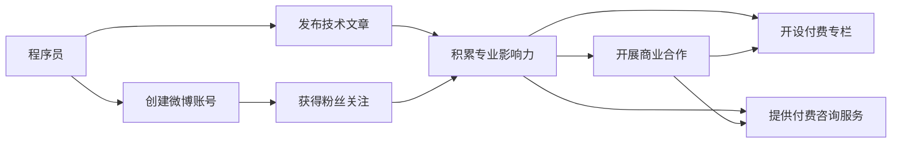

                 

# 程序员如何利用微博进行知识变现

## 1. 背景介绍

在数字经济的浪潮中，知识变现已成为程序员和IT专业人士的重要收入来源之一。利用微博进行知识变现，不仅能让个人专业知识获得更广泛的传播，也能为从业者带来可观的经济收益。本文将从微博的知识变现模式、优势、策略及案例等几个方面进行深入探讨。

## 2. 核心概念与联系

### 2.1 核心概念概述

- **微博**：一种快速传播信息的社会化媒体平台，拥有庞大的用户基础，涵盖了包括程序员在内的各行各业的专业人士。
- **知识变现**：将专业知识、经验、技能等通过多种形式变现，例如写作、咨询、培训、讲座、软文推广、付费问答、会员制等内容付费服务。
- **社交媒体营销**：通过社交平台发布内容，建立个人品牌，利用影响力吸引粉丝和客户，实现商业变现。

### 2.2 核心概念联系

微博作为一种社交媒体平台，为程序员提供了一个展示技术、分享经验、建立个人品牌、获取认可与收益的空间。通过内容创作、互动交流、商业合作等形式，程序员能够将自身专业知识转化为商业价值。这种变现模式不仅能让个人技能得到经济回报，还能增强行业影响力，进一步提升自我价值。

通过以下Mermaid流程图展示了微博与知识变现的核心联系：



## 3. 核心算法原理 & 具体操作步骤

### 3.1 算法原理概述

微博知识变现的原理主要是通过以下步骤：
1. **内容创作**：撰写关于编程、技术、行业趋势、软件工具等领域的原创文章，不断丰富微博内容。
2. **粉丝积累**：利用技术优势、个人魅力以及专业知识，吸引粉丝的关注和互动。
3. **商业合作**：与品牌方、企业合作，推广产品、服务或合作开设付费专栏。
4. **收益变现**：通过文章赞赏、付费问答、会员费、广告分成等多种方式获取收益。

### 3.2 算法步骤详解

#### 步骤一：创建微博账号
创建微博账号并完成个人信息填写，设置专业的头像和个性签名，以展现个人品牌和专业技能。

#### 步骤二：发布高质量内容
定期发布与专业领域相关的高质量文章，如图像、视频、技术博客等，增加粉丝的阅读兴趣和互动频率。

#### 步骤三：互动与社区建设
积极回复粉丝评论、私信，参加微博上的相关话题讨论，建立与粉丝之间的互动与信任关系。

#### 步骤四：商业合作与变现
1. **合作推广**：与品牌方或企业合作，推广其产品或服务，例如软件工具、在线课程等。
2. **付费专栏**：开设付费专栏，为粉丝提供独家内容，例如深度技术文章、在线课程等。
3. **付费问答**：开设付费问答服务，回答粉丝的专业问题，收取费用。
4. **会员制服务**：提供会员服务，提供专属内容、在线咨询、独家资源等。

#### 步骤五：数据分析与优化
定期分析微博数据，如阅读量、点赞量、转发量、粉丝增长速度等，优化内容策略和互动方式。

### 3.3 算法优缺点

**优点**：
1. **低门槛**：微博平台的低入门门槛，使得任何人都能快速开始知识变现。
2. **高传播**：利用微博的传播力，内容可以快速传播，获取更多关注。
3. **多样化变现**：通过多种方式变现，增加收入来源。

**缺点**：
1. **内容质量要求高**：需要持续发布高质量内容，才能维持粉丝关注。
2. **时间成本高**：内容创作、互动回复、数据分析等环节，需要大量时间和精力投入。
3. **竞争激烈**：微博用户众多，竞争激烈，需要不断创新和优化。

### 3.4 算法应用领域

微博知识变现适用于程序员、IT专业人士、软件开发者等各类技术人才，可以应用于以下领域：
1. **技术写作**：撰写关于编程语言、框架、工具、行业趋势等领域的文章。
2. **技术教育**：通过视频、课程等方式，进行编程教育和技术培训。
3. **软件推广**：推广自己开发的软件或开源项目，提高知名度。
4. **技术咨询**：提供技术咨询服务，帮助企业解决技术难题。
5. **社区运营**：建立技术社区，组织技术讨论、活动，增强影响力。

## 4. 数学模型和公式 & 详细讲解 & 举例说明

### 4.1 数学模型构建

微博知识变现的数学模型可以表述为：
\[收益 = 内容价值 \times 阅读量 \times 转化率 \]

其中：
- 内容价值：指内容的专业性、实用性、创新性等。
- 阅读量：指内容被阅读的次数。
- 转化率：指内容被转化为付费机会的比例，例如付费文章、课程订阅等。

### 4.2 公式推导过程

1. **内容价值**：
   - 设内容价值为 \( C_v \)，内容价值与内容质量成正比，即 \( C_v \propto Q \)，其中 \( Q \) 为内容质量。
   - 内容质量包括文字表达、图片/视频质量、知识深度等。

2. **阅读量**：
   - 设阅读量为 \( R \)，阅读量与内容的吸引力成正比，即 \( R \propto A \)，其中 \( A \) 为内容的吸引力。
   - 内容的吸引力由标题、图片、摘要、互动频率等因素决定。

3. **转化率**：
   - 设转化率为 \( C_r \)，转化率与内容互动方式、付费机制设计等因素有关，即 \( C_r = f(\text{互动方式}, \text{付费机制}) \)。

### 4.3 案例分析与讲解

假设某程序员开设付费专栏，每月发布5篇高质量技术文章，每篇文章平均阅读量达10万次，每篇文章的转化率为5%，每篇付费文章的定价为199元。则该程序员每月收入为：
\[ \text{月收入} = 5 \times 10万 \times 5\% \times 199 = 497500 \]

## 5. 项目实践：代码实例和详细解释说明

### 5.1 开发环境搭建

- **微博账户创建**：通过浏览器访问微博官网，注册并完善个人资料。
- **账号管理工具**：使用微博API的第三方管理工具，如简道云、微博API Helper等，方便管理和分析账号数据。

### 5.2 源代码详细实现

以下是一个简单的Python脚本，用于统计微博账户的粉丝增长速度：

```python
import tweepy
import time

# 创建API认证
consumer_key = 'your_consumer_key'
consumer_secret = 'your_consumer_secret'
access_token = 'your_access_token'
access_token_secret = 'your_access_token_secret'

auth = tweepy.OAuthHandler(consumer_key, consumer_secret)
auth.set_access_token(access_token, access_token_secret)

api = tweepy.API(auth)

# 初始化关注者和粉丝数
followers_count = 0
followers_growth = 0

while True:
    try:
        # 获取粉丝数
        followers = api.me().friends_count
        if followers_count == 0:
            followers_count = followers
            continue

        # 计算粉丝增长数
        followers_growth = followers - followers_count
        followers_count = followers

        # 发布微博内容
        tweet_text = "微博粉丝增长了，感谢大家的支持！"
        api.update_status(status=tweet_text)

        # 等待30秒，避免API调用过于频繁
        time.sleep(30)

    except tweepy.TweepError as e:
        print(e.reason)
```

### 5.3 代码解读与分析

上述代码实现了对微博粉丝数的定时统计，并通过微博API进行更新。代码的核心逻辑如下：
1. **API认证**：使用微博API进行认证，获取访问和更新权限。
2. **粉丝数统计**：每30秒获取一次粉丝数，计算粉丝增长速度。
3. **发布微博**：在粉丝增长时，自动发布微博，感谢支持。
4. **API调用频率控制**：避免频繁调用API，避免被封禁。

### 5.4 运行结果展示

运行上述代码后，可以在微博账户的动态更新中看到每30秒发布的感谢微博，并通过分析工具获取粉丝增长数据。

## 6. 实际应用场景

### 6.1 技术写作
某知名程序员开设技术博客，定期发布关于Python、Java、区块链等领域的深度文章。通过微博的传播力，每篇文章阅读量达数十万次，每月通过赞赏和广告分成获得稳定收入。

### 6.2 技术教育
某IT培训机构的讲师，利用微博开设付费在线课程，学员付费订阅后，获得专家指导和技术培训。课程深受学员喜爱，每月收入超万元。

### 6.3 软件推广
某软件开发者通过微博推广自己开发的小程序，每日发布关于小程序功能和应用场景的文章，吸引了大量关注和下载。

### 6.4 技术咨询
某企业IT总监，利用微博提供技术咨询服务，客户可以付费提出技术问题，并获得专业解答，每月通过咨询费获得可观收入。

### 6.5 社区运营
某开源社区维护者，利用微博推广开源项目，定期发布项目进展、新特性，组织社区活动和技术讨论，提升了社区影响力。

## 7. 工具和资源推荐

### 7.1 学习资源推荐

- **微博官方文档**：详细介绍了微博API的使用方法，推荐学习。
- **Python微博API库**：tweepy库，提供了丰富的API接口，方便微博账户管理。
- **数据分析工具**：Excel、Tableau等，用于数据分析和可视化。

### 7.2 开发工具推荐

- **IDE**：PyCharm、Visual Studio Code等。
- **API管理工具**：简道云、微博API Helper等。

### 7.3 相关论文推荐

- **《社交媒体中的知识传播与变现》**：研究社交媒体对知识传播的影响和变现潜力。
- **《微博营销的理论与实践》**：介绍微博营销的理论基础和具体实践方法。
- **《技术博客与知识变现》**：分析技术博客的内容创作、粉丝互动与变现效果。

## 8. 总结：未来发展趋势与挑战

### 8.1 研究成果总结

微博知识变现已成为程序员和IT专业人士重要的收入来源之一。通过内容创作、互动交流、商业合作等形式，程序员能够实现自我价值的提升和经济收益的增加。

### 8.2 未来发展趋势

1. **内容多样化**：除了技术文章外，视频、直播、播客等形式将进一步丰富微博变现内容。
2. **平台多元化**：微博之外，微信、抖音等平台也将成为程序员知识变现的重要渠道。
3. **社区化运营**：技术社区的建设将成为知识变现的重要方向，进一步增强社区粘性和商业变现能力。

### 8.3 面临的挑战

1. **竞争激烈**：微博用户众多，内容竞争激烈，需要不断创新和优化。
2. **内容质量要求高**：持续发布高质量内容，才能维持粉丝关注。
3. **时间成本高**：内容创作、互动回复、数据分析等环节，需要大量时间和精力投入。

### 8.4 研究展望

未来，微博知识变现将进一步向垂直领域深化，如人工智能、大数据、区块链等，成为程序员和IT专业人士的重要收入来源之一。同时，结合其他平台，如微信、抖音等，将进一步拓展知识变现的渠道和形式，为从业者提供更多元化的变现机会。

## 9. 附录：常见问题与解答

**Q1: 如何提升微博内容的互动率？**

A: 提升微博内容的互动率，可以从以下几个方面入手：
1. **优质内容**：发布高质量、有价值的内容，吸引粉丝关注和互动。
2. **互动策略**：在内容发布后，积极回复粉丝评论和私信，增加互动频率。
3. **话题营销**：参与热门话题讨论，吸引更多关注和互动。
4. **定期发布**：定期发布内容，保持粉丝活跃度。

**Q2: 如何扩大微博粉丝数？**

A: 扩大微博粉丝数，可以从以下几个方面入手：
1. **优质内容**：发布高质量、有价值的内容，吸引更多关注。
2. **互动策略**：积极回复粉丝评论和私信，增加粉丝粘性。
3. **品牌合作**：与品牌方或企业合作，进行联合推广。
4. **活动推广**：定期举办微博活动，如赠书、抽奖等，吸引新粉丝关注。

**Q3: 微博变现有哪些常见方式？**

A: 微博变现的常见方式包括：
1. **文章赞赏**：通过发布高质量技术文章，获取粉丝的赞赏。
2. **付费问答**：开设付费问答服务，回答粉丝的专业问题，收取费用。
3. **付费课程**：开设付费在线课程，提供技术培训和指导。
4. **广告分成**：与品牌方合作，推广产品或服务，获取广告分成。

**Q4: 如何利用微博数据分析优化内容策略？**

A: 利用微博数据分析优化内容策略，可以从以下几个方面入手：
1. **阅读量分析**：分析内容的阅读量，了解哪些内容受欢迎。
2. **互动率分析**：分析内容的互动率，了解粉丝对内容的反馈。
3. **粉丝分析**：分析粉丝的地理位置、兴趣标签等信息，了解粉丝群体特征。
4. **优化策略**：根据数据分析结果，优化内容创作和互动策略，提高粉丝互动率和变现效果。

**Q5: 微博变现需要注意哪些风险？**

A: 微博变现需要注意以下风险：
1. **版权风险**：发布的内容可能涉及版权问题，需要避免侵权。
2. **商业风险**：与品牌方合作时，需要注意避免商业风险，如虚假宣传、质量问题等。
3. **粉丝流失**：粉丝流失可能影响变现效果，需要注意维护粉丝关系。

---

作者：禅与计算机程序设计艺术 / Zen and the Art of Computer Programming

