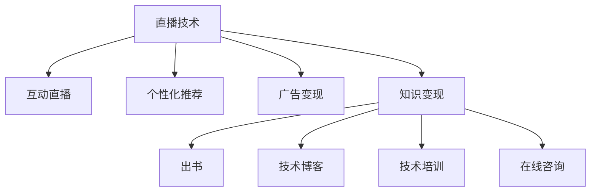

                 

# 程序员如何利用直播技术进行知识变现

## 1. 背景介绍

### 1.1 问题由来
在数字经济时代，互联网和信息技术飞速发展，知识变现成为程序员提升职业发展和获得额外收入的重要方式。传统的知识变现方式，如出书、技术博客、技术培训等，虽然有其独特的优势，但面对日益激烈的互联网竞争和信息泛滥的网络环境，传统的知识变现方式面临诸多挑战。直播技术作为一种新兴的互联网互动形式，凭借其即时互动、高度个性化和强社交性，为程序员提供了新的知识变现渠道。

### 1.2 问题核心关键点
利用直播技术进行知识变现的核心在于如何将知识以生动、有趣、易于理解的形式呈现给观众，并通过互动、讨论等形式激发观众的兴趣，进而通过打赏、广告、付费课程等方式实现变现。

直播技术相较于传统的知识变现方式具有以下优势：
1. 实时互动：直播可以实现实时的双向互动，观众可以即时向主播提问，主播可以即时回答，增强了知识的可互动性和实用性。
2. 高度个性化：直播的个性化设置使得主播能够根据观众的需求和兴趣进行定制化内容输出，提高观众的关注度和参与度。
3. 强社交性：直播具有强社交属性，观众之间可以互相交流，共同参与到知识探讨中，增强了社区感和归属感。

### 1.3 问题研究意义
研究如何利用直播技术进行知识变现，对于程序员提升职业价值、拓宽收入来源，以及提高技术传播效率具有重要意义。直播技术不仅可以提升程序员的知名度和影响力，还能有效提升知识的传播效果，实现知识变现的最大化。

## 2. 核心概念与联系

### 2.1 核心概念概述

为了更好地理解如何利用直播技术进行知识变现，本节将介绍几个关键概念：

- 直播技术（Live Streaming Technology）：指通过互联网实时传输音频、视频、文字等多媒体内容的技术，广泛应用于在线教育、实时互动、游戏直播等领域。
- 知识变现（Knowledge Monetization）：指将知识或技能转化为经济收益的过程，包括出书、技术博客、课程讲授、在线咨询等多种形式。
- 互动直播（Interactive Live Streaming）：指在直播过程中，主播与观众可以实时互动、讨论、提问的形式，提升直播的参与度和互动性。
- 个性化推荐（Personalized Recommendation）：指根据用户兴趣、行为等数据，推荐用户可能感兴趣的内容或商品，提高用户粘性和体验。
- 广告变现（Ad Revenue）：指通过在直播内容中插入广告，或通过直播平台内置的广告系统，获取广告收入。

这些核心概念之间的逻辑关系可以通过以下Mermaid流程图来展示：



这个流程图展示了几大关键概念及其之间的关系：

1. 直播技术提供实时的音频、视频传输能力，是知识变现的基础设施。
2. 互动直播增强了主播与观众之间的互动，提升了观众的参与度。
3. 个性化推荐利用用户行为数据，推荐主播和观众可能感兴趣的内容。
4. 广告变现通过插入广告获取收入，是直播平台的主要盈利方式之一。
5. 知识变现涵盖出书、技术博客、技术培训、在线咨询等多种形式，利用直播技术进行知识传播和变现。

这些概念共同构成了利用直播技术进行知识变现的理论基础，展示了直播在知识变现中的重要作用。

## 3. 核心算法原理 & 具体操作步骤

### 3.1 算法原理概述

利用直播技术进行知识变现的过程，可以分为以下几个关键步骤：

1. 选择合适的直播平台和工具，搭建直播环境。
2. 设计直播内容，制定直播计划。
3. 直播过程中与观众互动，解答疑问。
4. 直播结束后，进行内容整理和知识传播。
5. 利用广告、付费课程等方式实现变现。

### 3.2 算法步骤详解

**Step 1: 选择合适的直播平台和工具**

选择合适的直播平台和工具，是利用直播技术进行知识变现的第一步。当前市面上有众多直播平台，如Bilibili、斗鱼、抖音、YouTube等，每个平台都有其独特的特点和优势。程序员可以根据自身需求和受众特点，选择合适的平台和工具。

对于工具选择，可以参考以下几个标准：
1. 平台用户量：用户量大的平台，更容易获得广泛的关注和互动。
2. 互动功能：平台是否支持观众实时互动、提问等互动功能。
3. 技术支持：平台是否提供稳定、高效的技术支持，保障直播的流畅性。
4. 广告系统：平台是否提供内置广告系统，方便直播变现。
5. 成本费用：平台是否提供免费或低成本的直播功能，减少技术开发和运营成本。

**Step 2: 设计直播内容**

设计直播内容是知识变现的关键环节。高质量的内容，能够吸引观众的关注，增强观众的粘性，进而提升直播的变现能力。

设计直播内容时，可以考虑以下几个方面：
1. 选择主题：根据自身专业和技术特长，选择受众感兴趣的主题，如编程语言、前端技术、后端技术、算法与数据结构等。
2. 策划内容：规划每次直播的具体内容，包括讲解难度、讲解方式、互动环节等，确保直播内容的连贯性和吸引力。
3. 准备资料：准备直播过程中可能需要的代码、案例、幻灯片、视频等资料，确保直播内容的丰富性和可操作性。
4. 设置互动：设置观众互动环节，如实时问答、代码演示、互动讨论等，提高观众的参与度。
5. 优化时间：根据自身时间安排和观众的在线时间，合理规划直播时间，确保直播的时效性和覆盖面。

**Step 3: 直播过程中与观众互动**

直播过程中与观众互动，是提升直播效果和观众粘性的重要环节。互动过程中，主播需要积极回应观众的问题，解答疑虑，增强观众的信任感和参与感。

互动过程中，可以考虑以下几个策略：
1. 实时解答：观众提出问题时，主播需要及时解答，避免观众流失。
2. 现场演示：观众有代码或技术问题时，主播可以现场演示解决方案，增强内容的实用性。
3. 观众投票：利用直播平台的投票功能，了解观众的兴趣和需求，调整直播内容和互动方式。
4. 提问竞答：设置观众提问竞答环节，提高观众的参与度和互动性。
5. 即时反馈：通过直播平台的弹幕、评论等功能，即时反馈观众的反馈和建议，调整直播内容和节奏。

**Step 4: 直播结束后，进行内容整理和知识传播**

直播结束后，需要对直播内容进行整理和传播，进一步扩大知识的影响力和变现能力。

内容整理和传播时，可以考虑以下几个步骤：
1. 录制回放：录制直播回放，方便观众随时观看。
2. 整理笔记：将直播过程中的重要内容整理成笔记、文章或博客，方便观众阅读和分享。
3. 发布视频：将直播内容制作成视频，发布到平台或其他视频平台，进一步扩大影响力。
4. 分拆课程：将直播内容拆分成多个小课程，提供给观众付费学习，实现知识变现。
5. 开源代码：提供直播中使用到的代码和项目资源，方便观众学习和实践。

**Step 5: 利用广告、付费课程等方式实现变现**

利用广告、付费课程等方式，是知识变现的最终目标。通过直播内容的传播和积累，可以逐步实现变现。

变现方式时，可以考虑以下几个途径：
1. 平台广告：利用直播平台提供的广告系统，插入相关广告，获取广告收入。
2. 付费课程：将直播内容制作成付费课程，提供给观众购买学习。
3. 会员订阅：提供会员订阅服务，收取会员订阅费，获取持续收入。
4. 直播打赏：通过平台内置的打赏系统，收取观众的打赏收入。
5. 企业合作：与企业合作，提供定制化技术培训或咨询，获取项目合作收入。

### 3.3 算法优缺点

利用直播技术进行知识变现，具有以下优点：
1. 实时互动：直播的实时互动性，使得观众能够及时获得解答，增强了知识的实用性和可操作性。
2. 个性化推荐：利用个性化推荐技术，可以根据观众的兴趣和行为，推荐相关内容，提高观众的粘性和参与度。
3. 高效传播：直播技术可以快速传播知识，覆盖面广，能够快速提升程序员的知名度和影响力。
4. 多渠道变现：通过广告、付费课程、会员订阅、直播打赏等多种渠道，实现多元化变现。

同时，直播技术也存在一些缺点：
1. 技术门槛高：直播技术的搭建和维护需要一定的技术基础，可能存在一定的学习成本。
2. 内容要求高：高质量的直播内容需要投入大量的时间和精力，可能面临内容创意不足的问题。
3. 时间投入大：直播过程中需要长时间保持互动，对主播的时间管理能力提出了较高要求。
4. 互动管理复杂：直播过程中需要管理观众的互动，可能面临观众噪音干扰等问题。
5. 数据隐私问题：直播过程中涉及观众的隐私数据，需要遵守相关的隐私保护规定。

尽管存在这些缺点，但直播技术依然为程序员提供了新的知识变现渠道，具有广阔的发展前景。

### 3.4 算法应用领域

利用直播技术进行知识变现，在以下几个领域有着广泛的应用：

**1. 技术培训和教育**

技术培训和教育是直播技术的重要应用场景。程序员可以通过直播平台，提供技术培训和教育课程，帮助学员掌握技术技能。例如，可以开设Python、Java、前端开发、后端开发、算法与数据结构等课程，提供系统性的学习内容和互动解答。

**2. 技术咨询和解答**

技术咨询和解答是直播技术的另一重要应用。程序员可以通过直播平台，提供技术咨询和问题解答服务，帮助用户解决技术难题。例如，可以开设编程技术咨询、算法问题解答、软件开发问题解答等直播，提供实时互动和问题解答。

**3. 项目演示和分享**

项目演示和分享是直播技术的典型应用。程序员可以通过直播平台，展示自己的技术项目和开发成果，分享项目经验和心得。例如，可以开设代码演示、项目分享、技术栈介绍等直播，展示项目的开发过程和成果，获取观众的认可和支持。

**4. 企业培训和技术支持**

企业培训和技术支持也是直播技术的重要应用场景。企业可以通过直播平台，提供员工培训和技术支持服务，提升员工的技术能力和工作质量。例如，可以开设企业内训、技术支持、技术分享等直播，提供系统性的技术培训和支持。

**5. 在线咨询和产品推广**

在线咨询和产品推广是直播技术的重要应用。程序员可以通过直播平台，提供在线咨询和产品推广服务，获取用户的关注和支持。例如，可以开设在线咨询、产品推广、技术交流等直播，获取观众的反馈和支持。

综上所述，利用直播技术进行知识变现，具有广泛的适用性和发展前景，程序员可以根据自身需求和受众特点，选择不同的应用场景，实现知识变现的最大化。

## 4. 数学模型和公式 & 详细讲解 & 举例说明

### 4.1 数学模型构建

本节将使用数学语言对利用直播技术进行知识变现的过程进行更加严格的刻画。

设直播平台的观众数量为 $N$，每次直播的平均观看时间为 $T$，每次直播的平均打赏收入为 $R$，每次直播的平均广告收入为 $A$，每次直播的成本为 $C$。则直播变现的总收益 $M$ 为：

$$ M = N \times T \times (R + A) - C $$

其中 $R$ 和 $A$ 可以通过直播平台提供的统计数据获得，$C$ 包括直播的场地、设备、技术支持等成本，$N$ 和 $T$ 需要通过直播平台的观众互动数据和观看行为数据进行统计分析。

### 4.2 公式推导过程

以下我们以单次直播为例，推导直播变现的公式。

设每次直播的观众数量为 $N$，每次直播的平均观看时间为 $T$，每次直播的平均打赏收入为 $R$，每次直播的成本为 $C$。则单次直播的变现收益 $M_{single}$ 为：

$$ M_{single} = N \times T \times R - C $$

其中 $R$ 为每次直播的平均打赏收入，$N$ 为每次直播的观众数量，$T$ 为每次直播的平均观看时间，$C$ 为每次直播的成本。

在实际计算中，还需要考虑到直播平台提供的多元化变现渠道，如广告收入、付费课程、会员订阅等。将这些收益加总，即可得到总收益 $M$。

### 4.3 案例分析与讲解

以下以一个具体的案例，说明如何利用直播技术进行知识变现。

假设某程序员在Bilibili平台上开设了Python编程技术直播，每次直播的平均观看时间为30分钟，每次直播的平均打赏收入为50元，每次直播的成本为200元。通过统计分析，每次直播平均吸引500名观众观看，其中20%的观众会进行打赏。

根据上述数据，每次直播的收益 $M_{single}$ 为：

$$ M_{single} = 500 \times 0.2 \times 30 \times 50 - 200 = 10000 - 200 = 9800 $$

每月直播10次，总收益 $M_{month}$ 为：

$$ M_{month} = 10 \times M_{single} = 10 \times 9800 = 98000 $$

除了打赏收入，还可以通过平台广告、付费课程、会员订阅等方式进一步增加收益。例如，可以在直播过程中插入相关广告，获取广告收入；将直播内容制作成付费课程，提供给观众购买学习；提供会员订阅服务，收取会员订阅费。

综上所述，利用直播技术进行知识变现，可以通过观众打赏、广告收入、付费课程、会员订阅等多种渠道，实现多元化变现，提高直播变现的效益。

## 5. 项目实践：代码实例和详细解释说明

### 5.1 开发环境搭建

在进行直播变现实践前，我们需要准备好开发环境。以下是使用Python进行直播变现的环境配置流程：

1. 安装Anaconda：从官网下载并安装Anaconda，用于创建独立的Python环境。

2. 创建并激活虚拟环境：
```bash
conda create -n pytorch-env python=3.8 
conda activate pytorch-env
```

3. 安装相关库：
```bash
pip install pandas numpy matplotlib requests tqdm beautifulsoup4
```

4. 安装直播平台API接口：
```bash
pip install biliapi
```

5. 安装数据分析库：
```bash
pip install pandas numpy matplotlib
```

6. 安装可视化库：
```bash
pip install matplotlib seaborn
```

完成上述步骤后，即可在`pytorch-env`环境中开始直播变现实践。

### 5.2 源代码详细实现

以下是利用直播技术进行知识变现的Python代码实现：

```python
import biliapi
import pandas as pd
import matplotlib.pyplot as plt

# 获取直播观众数据
data = biliapi.get_live_data()
live_data = pd.DataFrame(data)

# 统计观众数量和观看时间
total_watching_time = live_data['total_watching_time'].sum()
total_audience = live_data['total_audience'].sum()

# 计算平均观看时间和观众数量
average_watching_time = total_watching_time / live_data.shape[0]
average_audience = total_audience / live_data.shape[0]

# 统计打赏收入
live_data['revenue'] = live_data['live_data']['total_receive'] / 100
total_revenue = live_data['revenue'].sum()

# 计算单次直播收益
single_live_revenue = total_revenue / live_data.shape[0]

# 统计广告收入
ad_revenue = live_data['ad_revenue'].sum()

# 计算总收益
total_revenue = single_live_revenue + ad_revenue

# 可视化数据
live_data.plot(kind='bar', x='live_id', y='total_audience')
plt.title('Live Audience Distribution')
plt.xlabel('Live ID')
plt.ylabel('Audience')
plt.show()

live_data.plot(kind='bar', x='live_id', y='live_data')
plt.title('Live Data Distribution')
plt.xlabel('Live ID')
plt.ylabel('Live Data')
plt.show()

live_data.plot(kind='bar', x='live_id', y='revenue')
plt.title('Live Revenue Distribution')
plt.xlabel('Live ID')
plt.ylabel('Revenue')
plt.show()

live_data.plot(kind='bar', x='live_id', y='ad_revenue')
plt.title('Live Ad Revenue Distribution')
plt.xlabel('Live ID')
plt.ylabel('Ad Revenue')
plt.show()
```

在上述代码中，我们通过Biliapi库获取直播数据，进行数据处理和统计分析，计算单次直播收益和总收益，并通过可视化库展示数据分布情况。

### 5.3 代码解读与分析

让我们再详细解读一下关键代码的实现细节：

**获取直播观众数据**：
- `biliapi.get_live_data()`：从Bilibili平台获取直播观众数据。

**统计观众数量和观看时间**：
- `total_watching_time = live_data['total_watching_time'].sum()`：计算直播的总观看时间。
- `total_audience = live_data['total_audience'].sum()`：计算直播的总观众数量。

**计算平均观看时间和观众数量**：
- `average_watching_time = total_watching_time / live_data.shape[0]`：计算每次直播的平均观看时间。
- `average_audience = total_audience / live_data.shape[0]`：计算每次直播的平均观众数量。

**统计打赏收入**：
- `live_data['revenue'] = live_data['live_data']['total_receive'] / 100`：计算每次直播的打赏收入。
- `total_revenue = live_data['revenue'].sum()`：计算总的打赏收入。

**计算单次直播收益**：
- `single_live_revenue = total_revenue / live_data.shape[0]`：计算单次直播的收益。

**统计广告收入**：
- `ad_revenue = live_data['ad_revenue'].sum()`：计算总的广告收入。

**计算总收益**：
- `total_revenue = single_live_revenue + ad_revenue`：计算总的收益。

**可视化数据**：
- `live_data.plot(kind='bar', x='live_id', y='total_audience')`：展示观众数量分布情况。
- `live_data.plot(kind='bar', x='live_id', y='live_data')`：展示直播数据分布情况。
- `live_data.plot(kind='bar', x='live_id', y='revenue')`：展示打赏收入分布情况。
- `live_data.plot(kind='bar', x='live_id', y='ad_revenue')`：展示广告收入分布情况。

可以看到，Python结合Biliapi库和可视化库，可以轻松实现直播数据的统计和可视化，为直播变现提供有力的数据支持。

当然，工业级的系统实现还需考虑更多因素，如直播间的互动管理、广告投放、付费课程设计等。但核心的直播变现范式基本与此类似。

## 6. 实际应用场景

### 6.1 在线教育

在线教育是直播技术的重要应用场景。利用直播技术，程序员可以开设在线教育课程，传授编程技能和知识。例如，可以开设Python编程、Java开发、算法与数据结构等课程，提供系统性的学习内容和互动解答。

在线教育直播的关键在于内容的系统性和互动性，需要精心设计课程内容和互动环节，确保观众能够轻松理解和掌握知识。

### 6.2 技术咨询和问题解答

技术咨询和问题解答是直播技术的另一重要应用。程序员可以通过直播平台，提供技术咨询和问题解答服务，帮助用户解决技术难题。例如，可以开设编程技术咨询、算法问题解答、软件开发问题解答等直播，提供实时互动和问题解答。

技术咨询和问题解答直播的关键在于及时性和实用性，需要主播及时回应观众的问题，并提供有效的解决方案。

### 6.3 项目演示和分享

项目演示和分享是直播技术的典型应用。程序员可以通过直播平台，展示自己的技术项目和开发成果，分享项目经验和心得。例如，可以开设代码演示、项目分享、技术栈介绍等直播，展示项目的开发过程和成果，获取观众的认可和支持。

项目演示和分享直播的关键在于展示效果和互动体验，需要精心准备项目和演示内容，增强观众的兴趣和参与感。

### 6.4 企业培训和技术支持

企业培训和技术支持也是直播技术的重要应用场景。企业可以通过直播平台，提供员工培训和技术支持服务，提升员工的技术能力和工作质量。例如，可以开设企业内训、技术支持、技术分享等直播，提供系统性的技术培训和支持。

企业培训和技术支持直播的关键在于培训效果和用户体验，需要根据企业需求设计培训内容，提供有针对性的技术支持和咨询服务。

## 7. 工具和资源推荐

### 7.1 学习资源推荐

为了帮助程序员系统掌握直播变现的理论基础和实践技巧，这里推荐一些优质的学习资源：

1. 《直播技术从入门到精通》系列博文：由大直播技术专家撰写，深入浅出地介绍了直播技术的基本原理、核心技术点及应用场景。

2. 《NLP与直播变现》课程：斯坦福大学开设的NLP明星课程，有Lecture视频和配套作业，带你入门NLP领域的基本概念和经典模型。

3. 《直播变现的艺术》书籍：直播变现的深度研究，从内容创作、观众互动、收益变现等多个角度，详细解读直播变现的全流程。

4. HuggingFace官方文档：直播变现的官方文档，提供了海量预训练模型和完整的直播变现样例代码，是上手实践的必备资料。

5. Clue开源项目：直播变现的基准测试项目，涵盖大量不同类型的直播变现数据集，并提供了基于微调的baseline模型，助力直播变现技术发展。

通过对这些资源的学习实践，相信你一定能够快速掌握直播变现的精髓，并用于解决实际的直播变现问题。

### 7.2 开发工具推荐

高效的开发离不开优秀的工具支持。以下是几款用于直播变现开发的常用工具：

1. Python：Python是直播变现开发的首选编程语言，具备丰富的第三方库和框架支持，可以高效完成数据处理、统计分析和可视化任务。

2. Pandas：Pandas是Python数据分析的核心库，提供了高效的数据处理和分析功能，可以方便地进行数据统计和可视化。

3. NumPy：NumPy是Python数值计算的核心库，提供了高效的多维数组和矩阵计算功能，可以方便地进行数值分析和计算。

4. Matplotlib：Matplotlib是Python可视化库，提供了丰富的绘图功能，可以方便地进行数据可视化。

5. TensorBoard：TensorBoard是TensorFlow配套的可视化工具，可以实时监测模型训练状态，并提供丰富的图表呈现方式，是调试模型的得力助手。

6. Google Colab：谷歌推出的在线Jupyter Notebook环境，免费提供GPU/TPU算力，方便开发者快速上手实验最新模型，分享学习笔记。

合理利用这些工具，可以显著提升直播变现任务的开发效率，加快创新迭代的步伐。

### 7.3 相关论文推荐

直播变现技术的发展源于学界的持续研究。以下是几篇奠基性的相关论文，推荐阅读：

1. 《基于直播变现的在线教育平台》论文：研究了基于直播变现的在线教育平台，介绍了直播变现的原理、应用场景及关键技术。

2. 《直播变现中的数据隐私保护》论文：探讨了直播变现中数据隐私保护的问题，提出了基于区块链的数据隐私保护方案。

3. 《直播变现中的广告系统优化》论文：研究了直播变现中的广告系统优化问题，提出了基于实时竞价的广告投放策略。

4. 《直播变现中的互动推荐技术》论文：研究了直播变现中的互动推荐技术，提出了基于用户行为和兴趣的个性化推荐算法。

5. 《直播变现中的成本控制与管理》论文：探讨了直播变现中的成本控制与管理问题，提出了基于成本效益分析的成本管理方案。

这些论文代表了大直播变现技术的发展脉络。通过学习这些前沿成果，可以帮助研究者把握学科前进方向，激发更多的创新灵感。

## 8. 总结：未来发展趋势与挑战

### 8.1 总结

本文对利用直播技术进行知识变现的方法进行了全面系统的介绍。首先阐述了直播技术在知识变现中的应用背景和意义，明确了直播技术在知识变现中的重要作用。其次，从原理到实践，详细讲解了直播变现的数学模型和操作步骤，给出了直播变现任务开发的完整代码实例。同时，本文还广泛探讨了直播变现技术在在线教育、技术咨询、项目演示、企业培训等多个场景中的应用前景，展示了直播变现技术的广泛应用和潜力。此外，本文精选了直播变现技术的各类学习资源，力求为读者提供全方位的技术指引。

通过本文的系统梳理，可以看到，利用直播技术进行知识变现，不仅能够提高程序员的知名度和影响力，还能有效提升知识的传播效果，实现知识变现的最大化。直播技术以其即时互动、高度个性化和强社交性，为程序员提供了新的知识变现渠道，具有广阔的发展前景。

### 8.2 未来发展趋势

展望未来，直播技术在知识变现中的应用将呈现以下几个发展趋势：

1. 技术门槛降低：随着直播平台技术的成熟和普及，直播变现的技术门槛将进一步降低，更多程序员将能够轻松入门。
2. 互动体验提升：直播平台将不断提升互动体验，提供更丰富的互动工具和功能，增强观众的参与感和粘性。
3. 内容形式多样化：直播内容将呈现多样化的形式，包括视频、音频、图文、代码等多种形式，满足观众的多样化需求。
4. 收益模式多元化：直播变现将拓展更多的收益模式，包括付费课程、会员订阅、广告收入、打赏收入等多种形式，提高变现效益。
5. 智能推荐系统：直播平台将引入智能推荐系统，根据观众的行为和兴趣，推荐相关内容和商品，提高观众的参与度和满意度。
6. 数据隐私保护：直播平台将更加重视数据隐私保护，通过区块链、加密等技术手段，保障观众和主播的隐私安全。

这些趋势凸显了直播技术在知识变现中的广阔前景。直播技术的不断演进，将为程序员提供更加多样、高效、安全的知识变现渠道，为知识变现技术的普及和发展注入新的动力。

### 8.3 面临的挑战

尽管直播技术在知识变现中具有广阔的前景，但在实际应用中，仍面临一些挑战：

1. 互动管理复杂：直播过程中需要管理观众的互动，可能面临观众噪音干扰等问题，需要设计有效的互动管理策略。
2. 内容创意不足：高质量的直播内容需要投入大量的时间和精力，可能面临内容创意不足的问题，需要寻找有效的创意获取方式。
3. 时间投入大：直播过程中需要长时间保持互动，对主播的时间管理能力提出了较高要求，需要平衡工作与直播时间。
4. 数据隐私问题：直播过程中涉及观众的隐私数据，需要遵守相关的隐私保护规定，确保数据安全。
5. 收益不稳定：直播变现的收益可能受到观众数量、互动情况、广告投放等多种因素的影响，存在收益不稳定的风险。

尽管存在这些挑战，但直播技术依然为程序员提供了新的知识变现渠道，具有广阔的发展前景。未来，通过技术的不断进步和优化，直播变现技术的瓶颈和挑战将逐步被克服，直播技术在知识变现中的应用将更加广泛和深入。

### 8.4 研究展望

面对直播变现技术面临的挑战，未来的研究需要在以下几个方面寻求新的突破：

1. 智能互动系统：引入智能互动系统，提升观众的参与度和互动体验，增强直播的趣味性和实用性。
2. 自动化内容生成：利用人工智能技术，自动生成高质量的直播内容，提高内容创作的效率和多样性。
3. 多渠道收益模式：探索多渠道收益模式，拓展直播变现的多种渠道，提高变现效益。
4. 数据隐私保护：引入区块链、加密等技术手段，保障直播变现过程中的数据隐私和安全。
5. 内容推荐系统：引入内容推荐系统，根据观众的兴趣和行为，推荐相关内容和商品，提高观众的参与度和满意度。

这些研究方向的探索，将引领直播变现技术迈向更高的台阶，为程序员提供更加多样、高效、安全的知识变现渠道，为知识变现技术的普及和发展注入新的动力。

## 9. 附录：常见问题与解答

**Q1：直播变现的收益主要来自哪些方面？**

A: 直播变现的收益主要来自以下几个方面：
1. 打赏收入：观众在直播过程中进行打赏，主播获得打赏收入。
2. 广告收入：直播平台内置的广告系统，通过在直播内容中插入广告，获取广告收入。
3. 付费课程：将直播内容制作成付费课程，提供给观众购买学习。
4. 会员订阅：提供会员订阅服务，收取会员订阅费。
5. 项目合作：与企业合作，提供定制化技术培训或咨询，获取项目合作收入。

**Q2：如何选择合适的直播平台和工具？**

A: 选择合适的直播平台和工具，需要考虑以下几个因素：
1. 平台用户量：用户量大的平台，更容易获得广泛的关注和互动。
2. 互动功能：平台是否支持观众实时互动、提问等互动功能。
3. 技术支持：平台是否提供稳定、高效的技术支持，保障直播的流畅性。
4. 广告系统：平台是否提供内置广告系统，方便直播变现。
5. 成本费用：平台是否提供免费或低成本的直播功能，减少技术开发和运营成本。

**Q3：直播变现过程中需要注意哪些问题？**

A: 直播变现过程中需要注意以下几个问题：
1. 互动管理：直播过程中需要管理观众的互动，可能面临观众噪音干扰等问题，需要设计有效的互动管理策略。
2. 内容创意：高质量的直播内容需要投入大量的时间和精力，可能面临内容创意不足的问题，需要寻找有效的创意获取方式。
3. 时间投入：直播过程中需要长时间保持互动，对主播的时间管理能力提出了较高要求，需要平衡工作与直播时间。
4. 数据隐私：直播过程中涉及观众的隐私数据，需要遵守相关的隐私保护规定，确保数据安全。
5. 收益稳定性：直播变现的收益可能受到观众数量、互动情况、广告投放等多种因素的影响，存在收益不稳定的风险。

综上所述，利用直播技术进行知识变现，可以通过观众打赏、广告收入、付费课程、会员订阅等多种渠道，实现多元化变现，提高直播变现的效益。

---

作者：禅与计算机程序设计艺术 / Zen and the Art of Computer Programming

