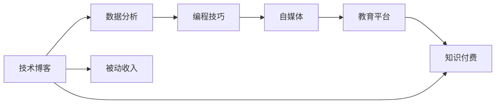

                 

# 程序员如何利用知识付费实现被动收入

> 关键词：知识付费, 技术博客, 数据分析, 编程技巧, 被动收入, 自媒体, 教育平台

## 1. 背景介绍

在现代科技日益发展的今天，程序员作为信息时代的重要力量，其价值已经不仅仅局限于软件开发本身。随着互联网的普及，人们获取知识的方式也变得更加多元，知识付费便成为了一种新兴的商业模式。技术类知识付费产品正在逐渐从边缘走向主流，程序员利用自身技术优势，通过知识付费实现被动收入，已经成为一种可行的职业发展道路。

本文将详细介绍程序员如何利用知识付费实现被动收入的多种方法，并结合实际案例，分析其中的核心原理和实施细节。

## 2. 核心概念与联系

### 2.1 核心概念概述

- **知识付费**：指用户为获取特定的知识或服务而支付费用的行为，通常通过订阅、按需购买等方式实现。
- **技术博客**：专注于技术问题的解决，提供编程技巧、技术分析、问题诊断等内容的专业博客。
- **数据分析**：通过收集和分析数据，提供有价值的见解和建议，常应用于市场预测、产品优化等领域。
- **编程技巧**：程序员在工作中积累的编程经验、技巧和方法，以高效、快捷地解决实际问题。
- **被动收入**：指通过投资、投资收益或资产增值等方式获得的收入，无需主动工作即可实现。
- **自媒体**：指个人或机构通过互联网平台发布内容，进行信息传播和价值变现的渠道。
- **教育平台**：提供在线课程、知识讲座等教育服务的平台，如Coursera、Udemy等。

以上概念之间的联系主要体现在，程序员通过构建技术博客、分析数据、编写编程技巧等内容，利用自媒体和教育平台，最终实现知识付费和被动收入的目标。

### 2.2 核心概念原理和架构的 Mermaid 流程图(Mermaid 流程节点中不要有括号、逗号等特殊字符)



这个流程图展示了程序员知识付费的整个链条：

1. 技术博客和技术分析提供有价值的知识内容。
2. 编程技巧和数据分析作为补充，使内容更加完整和实用。
3. 自媒体平台作为内容传播渠道，扩大受众群体。
4. 教育平台作为知识变现的媒介，实现知识付费和被动收入。

## 3. 核心算法原理 & 具体操作步骤

### 3.1 算法原理概述

知识付费的本质是通过向特定人群提供有价值的信息和服务，获取相应的经济回报。技术类知识付费产品主要依赖以下算法原理：

- **内容推荐算法**：通过分析用户的浏览行为、阅读偏好，推荐符合用户需求的技术博客和内容。
- **搜索排序算法**：根据搜索结果的相关度和质量，对搜索结果进行排序，提高用户找到有价值信息的概率。
- **用户行为分析**：通过收集用户的行为数据，分析其兴趣和偏好，为个性化的内容推荐提供依据。
- **课程定价策略**：基于市场调研和成本分析，确定课程的定价策略，以实现经济利益最大化。

### 3.2 算法步骤详解

#### 3.2.1 内容构建

1. **技术博客和分析文章**：
   - 选择技术热点或难点，如最新技术、工具使用、算法优化等。
   - 收集相关资料，包括官方文档、社区讨论、实践经验等。
   - 撰写文章，深入浅出地分析问题，并提供可行的解决方案。

2. **编程技巧和解决方案**：
   - 从日常工作中积累编程经验和技巧，形成系统性文档。
   - 记录具体问题的处理过程和最终结果，形成可复用的代码示例。
   - 整理常见问题及解决方案，形成FAQ或索引。

#### 3.2.2 自媒体和教育平台内容发布

1. **自媒体平台**：
   - 选择合适自媒体平台，如知乎、GitHub、CSDN等。
   - 发布技术博客和编程技巧，建立专业品牌。
   - 活跃在评论区，与读者互动，建立社群。

2. **教育平台**：
   - 注册教育平台账户，上传技术博客、编程技巧等内容。
   - 制作课程，结合文字、视频、代码等多媒体内容。
   - 设置课程价格和优惠策略，吸引用户购买。

#### 3.2.3 内容传播和互动

1. **内容推广**：
   - 利用自媒体平台和社交网络，进行内容推广。
   - 参与相关话题讨论，吸引更多关注和互动。

2. **用户互动**：
   - 通过评论区、私信等方式，与用户互动，解答问题。
   - 收集用户反馈，优化内容质量。

#### 3.2.4 收入变现

1. **广告收入**：
   - 在自媒体平台或博客中植入广告，获取广告收入。

2. **课程销售**：
   - 在教育平台发布付费课程，用户付费购买。
   - 根据用户数量和课程价格计算总收入。

3. **会员订阅**：
   - 提供会员订阅服务，定期推送高质量内容。
   - 通过会员费实现收入。

### 3.3 算法优缺点

#### 3.3.1 优点

- **成本低**：相比于传统的商业模式，知识付费的运营成本较低，主要集中在内容制作和平台推广。
- **市场广阔**：技术类知识受众广泛，市场需求大，收益潜力高。
- **变现灵活**：通过自媒体和教育平台，可以实现多种变现方式，如广告、课程销售、会员订阅等。

#### 3.3.2 缺点

- **内容质量要求高**：为了吸引用户，内容必须具备高质量和实用性，需要程序员持续投入时间和精力。
- **竞争激烈**：技术领域知识付费产品众多，如何脱颖而出需要精心策划和营销。
- **用户流失风险**：如果内容更新不及时或质量下降，可能导致用户流失。

### 3.4 算法应用领域

技术类知识付费产品主要应用于以下几个领域：

- **软件开发**：包括前端开发、后端开发、移动端开发等。
- **数据科学**：如数据分析、机器学习、数据可视化等。
- **云计算和大数据**：包括云服务、大数据技术、DevOps等。
- **人工智能**：如自然语言处理、计算机视觉、深度学习等。
- **网络安全**：如渗透测试、安全开发、安全运维等。

## 4. 数学模型和公式 & 详细讲解 & 举例说明

### 4.1 数学模型构建

知识付费平台的收入模型通常基于以下数学模型：

1. **用户增长模型**：
   - 用户增长模型通常采用指数增长模型或双曲线增长模型，公式如下：
     \[
     P(t) = P_0e^{rt} \quad \text{(指数增长模型)}
     \]
     \[
     P(t) = \frac{P_0}{1-r^t} \quad \text{(双曲线增长模型)}
     \]
   - 其中 \( P(t) \) 表示时间 \( t \) 时刻的用户数量，\( P_0 \) 表示初始用户数量，\( r \) 表示用户增长率。

2. **广告收入模型**：
   - 广告收入模型通常基于点击率(CTR)和转化率(CVR)，公式如下：
     \[
     \text{收入} = \text{广告曝光量} \times \text{CTR} \times \text{CVR} \times \text{广告单价}
     \]
   - 其中 CTR 表示广告被点击的概率，CVR 表示广告点击后产生购买行为的概率。

3. **课程销售模型**：
   - 课程销售模型通常基于销售量、单价和折扣，公式如下：
     \[
     \text{收入} = \text{课程销售量} \times \text{单价} \times \text{折扣率}
     \]
   - 其中折扣率通常根据销售量进行调整，以最大化收入。

### 4.2 公式推导过程

#### 4.2.1 指数增长模型

指数增长模型假设用户数量随时间呈指数增长，公式如下：
\[
P(t) = P_0e^{rt}
\]
其中 \( r \) 表示用户增长率，\( P_0 \) 表示初始用户数量。

根据指数增长模型，用户数量 \( P(t) \) 与时间 \( t \) 的关系如图：


#### 4.2.2 双曲线增长模型

双曲线增长模型假设用户数量随时间呈双曲线增长，公式如下：
\[
P(t) = \frac{P_0}{1-r^t}
\]
其中 \( r \) 表示用户增长率，\( P_0 \) 表示初始用户数量。

根据双曲线增长模型，用户数量 \( P(t) \) 与时间 \( t \) 的关系如图：


#### 4.2.3 广告收入模型

广告收入模型基于点击率和转化率，公式如下：
\[
\text{收入} = \text{广告曝光量} \times \text{CTR} \times \text{CVR} \times \text{广告单价}
\]
其中 CTR 表示广告被点击的概率，CVR 表示广告点击后产生购买行为的概率。

#### 4.2.4 课程销售模型

课程销售模型基于销售量、单价和折扣，公式如下：
\[
\text{收入} = \text{课程销售量} \times \text{单价} \times \text{折扣率}
\]
其中折扣率通常根据销售量进行调整，以最大化收入。

### 4.3 案例分析与讲解

#### 4.3.1 案例背景

某程序员在GitHub上创建了一个技术博客，专注于云计算技术的分享和分析。他通过自媒体平台和教育平台进行推广，逐步建立了自己的品牌，吸引了大量关注和订阅。

#### 4.3.2 案例分析

1. **内容构建**：
   - 撰写关于云计算平台架构、容器化技术、自动化运维等内容的博客文章。
   - 发布代码示例和实践案例，增加内容实用性。

2. **自媒体和教育平台内容发布**：
   - 在GitHub、CSDN、知乎等自媒体平台上发布技术博客。
   - 制作并上传教育平台课程，如“云计算基础”、“Kubernetes实战”等。

3. **内容传播和互动**：
   - 在自媒体平台积极互动，回答读者问题。
   - 定期发布高质量内容，保持活跃度。

4. **收入变现**：
   - 在自媒体平台上植入广告，获得广告收入。
   - 在教育平台上销售付费课程，获取课程销售收入。
   - 设置会员订阅服务，提供专属内容。

## 5. 项目实践：代码实例和详细解释说明

### 5.1 开发环境搭建

#### 5.1.1 环境需求

- **操作系统**：Windows 10、macOS 或 Linux。
- **编程语言**：Python 3.7 及以上。
- **开发工具**：Visual Studio Code、PyCharm、GitHub Desktop 等。
- **依赖库**：Flask、Jupyter Notebook、Matplotlib、Pandas 等。

#### 5.1.2 环境搭建步骤

1. **安装Python**：
   - 在官网下载并安装最新版本的Python。
   - 确认安装成功，打开Python解释器验证。

2. **安装Flask**：
   - 使用pip安装Flask：
     \[
     pip install Flask
     \]
   - 在终端运行：
     \[
     python -m flask --version
     \]
   - 确认安装成功。

3. **安装Jupyter Notebook**：
   - 使用pip安装Jupyter Notebook：
     \[
     pip install jupyter
     \]
   - 在终端运行：
     \[
     jupyter notebook
     \]
   - 启动Jupyter Notebook，创建新的Notebook。

### 5.2 源代码详细实现

#### 5.2.1 Flask服务器

**代码实现**：

```python
from flask import Flask, render_template, request

app = Flask(__name__)

@app.route('/', methods=['GET', 'POST'])
def index():
    if request.method == 'POST':
        # 处理表单提交逻辑
        pass
    return render_template('index.html')

if __name__ == '__main__':
    app.run(debug=True)
```

**代码解释**：
- 创建Flask应用程序实例。
- 定义路由函数，处理GET和POST请求。
- 在路由函数中，处理表单提交，渲染页面。
- 运行Flask服务器。

#### 5.2.2 Jupyter Notebook

**代码实现**：

```python
import pandas as pd
import numpy as np

# 读取数据
data = pd.read_csv('data.csv')

# 数据处理
data = data.dropna()
data = data.drop_duplicates()

# 分析结果
mean_age = data['age'].mean()
max_age = data['age'].max()

print('平均年龄:', mean_age)
print('最大年龄:', max_age)
```

**代码解释**：
- 导入Pandas库，用于数据处理。
- 读取数据集，并进行初步处理。
- 计算并打印平均年龄和最大年龄。

### 5.3 代码解读与分析

#### 5.3.1 Flask服务器

Flask是一种轻量级的Python Web框架，用于开发Web应用程序。通过Flask，我们可以轻松创建Web服务，并与用户进行交互。

在代码实现中，我们创建了一个简单的Flask应用程序，定义了首页路由，并处理了POST请求。实际上，我们可以根据需求，添加更多路由和功能，实现完整的Web应用。

#### 5.3.2 Jupyter Notebook

Jupyter Notebook是一种交互式计算环境，支持Python、R等多种编程语言。通过Jupyter Notebook，我们可以编写和运行代码，查看分析结果，并与他人共享。

在代码实现中，我们使用了Pandas库，用于数据读取和处理。Pandas提供了丰富的数据处理工具，如数据清洗、统计分析、数据可视化等。通过Jupyter Notebook，我们可以方便地进行数据分析和可视化，输出结果。

## 6. 实际应用场景

### 6.1 技术博客和自媒体平台

技术博客和自媒体平台是程序员知识付费的主要渠道之一。通过在自媒体平台上发布技术文章和解决方案，程序员可以获得粉丝和订阅用户，并从中获得广告收入和会员订阅收入。

### 6.2 教育平台

教育平台提供了课程和培训服务，程序员可以通过编写课程、制作视频等方式，获取课程销售收入。许多教育平台如Coursera、Udemy等，都为知识付费提供了良好的平台和工具。

### 6.3 个性化课程定制

程序员还可以提供个性化的课程定制服务，根据客户的需求，提供定制化的培训方案和技术支持。这种方式通常需要更高的专业知识和技能，但能提供更个性化、更高效的服务。

### 6.4 未来应用展望

随着知识付费市场的发展，程序员利用知识付费实现被动收入的方式将不断创新和多样化。未来，我们可以预见以下趋势：

1. **多渠道收入**：除了自媒体和教育平台，程序员还可以探索更多渠道，如视频平台、音频平台等，实现多渠道收入。
2. **内容多样性**：除了技术文章和课程，程序员可以探索更多的内容形式，如技术访谈、技术播客、技术讲座等。
3. **社交电商**：程序员可以利用自媒体和教育平台，开展社交电商活动，推广技术产品和技术服务。
4. **知识付费社区**：程序员可以创建自己的知识付费社区，提供更多互动和交流的机会，增加用户粘性。

## 7. 工具和资源推荐

### 7.1 学习资源推荐

#### 7.1.1 在线课程

- **Coursera**：提供大量在线课程，涵盖计算机科学、数据科学等多个领域。
- **Udemy**：提供各种编程、技术开发、数据分析等课程。
- **edX**：提供全球顶尖大学和机构的在线课程，涵盖多个学科。

#### 7.1.2 编程社区

- **Stack Overflow**：程序员交流技术问题、分享经验的重要平台。
- **GitHub**：全球最大的开源社区，程序员可以发布代码、参与项目。
- **CSDN**：国内知名的IT技术社区，提供技术文章、编程教程、社区讨论等。

#### 7.1.3 技术博客

- **Medium**：技术类博客平台，涵盖计算机科学、人工智能、数据科学等多个领域。
- **Towards Data Science**：数据科学类博客平台，提供大量数据分析、机器学习等内容。
- **Dev.to**：程序员社区，提供技术文章、编程经验分享等。

### 7.2 开发工具推荐

#### 7.2.1 Web框架

- **Flask**：轻量级Python Web框架，适合快速开发Web应用。
- **Django**：全栈Web框架，适合大型Web应用开发。
- **FastAPI**：高性能Web框架，适合构建高性能的API服务。

#### 7.2.2 数据分析工具

- **Jupyter Notebook**：交互式计算环境，支持Python、R等多种编程语言。
- **Pandas**：数据处理库，提供了丰富的数据清洗、分析工具。
- **NumPy**：科学计算库，提供了高性能的数组计算能力。

#### 7.2.3 版本控制工具

- **Git**：版本控制系统，适合团队协作开发。
- **GitHub Desktop**：GitHub的桌面客户端，方便进行代码管理和协作。
- **GitHub**：全球最大的代码托管平台，适合存储和分享代码。

### 7.3 相关论文推荐

#### 7.3.1 知识付费研究

- **Knowledge Is Powerful: Knowledge Sharing in Online Social Media**：分析知识共享在社交媒体中的趋势和影响。
- **A Survey on Knowledge Sharing in Online Social Media**：综述在线社交媒体中知识共享的研究现状和未来趋势。
- **Monetizing Knowledge Sharing in Online Social Media**：分析知识共享在在线社交媒体中的商业化路径。

## 8. 总结：未来发展趋势与挑战

### 8.1 研究成果总结

本文系统介绍了程序员如何利用知识付费实现被动收入的方法，详细讲解了内容构建、平台推广、收入变现等关键环节。通过案例分析，展示了知识付费的实际应用效果。

### 8.2 未来发展趋势

未来，知识付费市场将持续发展，程序员利用知识付费实现被动收入的方式将更加多样化。随着技术的进步和市场的成熟，知识付费将逐步成为程序员的重要收入来源。

### 8.3 面临的挑战

尽管知识付费市场前景广阔，但程序员在利用知识付费实现被动收入的过程中，仍面临诸多挑战：

1. **内容质量要求高**：高质量内容需要程序员持续投入时间和精力。
2. **竞争激烈**：技术领域知识付费产品众多，如何脱颖而出需要精心策划和营销。
3. **用户流失风险**：内容更新不及时或质量下降可能导致用户流失。

### 8.4 研究展望

未来的研究可以从以下几个方面进行探索：

1. **个性化内容推荐**：通过算法优化，实现更精准的内容推荐，提高用户粘性和留存率。
2. **多渠道变现**：探索更多渠道，如视频平台、音频平台等，实现多渠道收入。
3. **内容多样性**：提供更多形式的内容，如技术访谈、技术播客、技术讲座等。
4. **社交电商**：开展社交电商活动，推广技术产品和技术服务。

通过不断创新和优化，知识付费将为程序员带来更多的发展机会，推动技术创新和产业发展。

## 9. 附录：常见问题与解答

### 9.1 Q1：知识付费适合所有程序员吗？

A: 知识付费适合有一定技术基础和经验的程序员。对于初学者而言，知识付费可能需要一定的时间和精力进行内容制作，短期内难以实现盈利。

### 9.2 Q2：如何提升内容质量？

A: 提升内容质量需要程序员不断学习和实践。关注最新的技术趋势，定期更新和优化内容。同时，多与读者互动，了解其需求和反馈，不断改进内容质量。

### 9.3 Q3：如何获取更多的用户关注？

A: 获取用户关注需要持续的内容输出和积极的平台推广。利用自媒体平台和社交网络，积极互动，发布高质量内容。同时，参加行业会议和活动，扩大影响力和知名度。

### 9.4 Q4：如何应对竞争激烈的市场？

A: 应对竞争需要不断创新和优化。关注市场趋势，及时调整内容方向和营销策略。同时，提供更加个性化和实用性的内容，提高用户粘性和满意度。

### 9.5 Q5：如何实现持续的被动收入？

A: 实现持续的被动收入需要不断优化内容，提高用户留存率。定期发布高质量内容，保持平台活跃度。同时，积极拓展新渠道，实现多渠道变现。

作者：禅与计算机程序设计艺术 / Zen and the Art of Computer Programming

