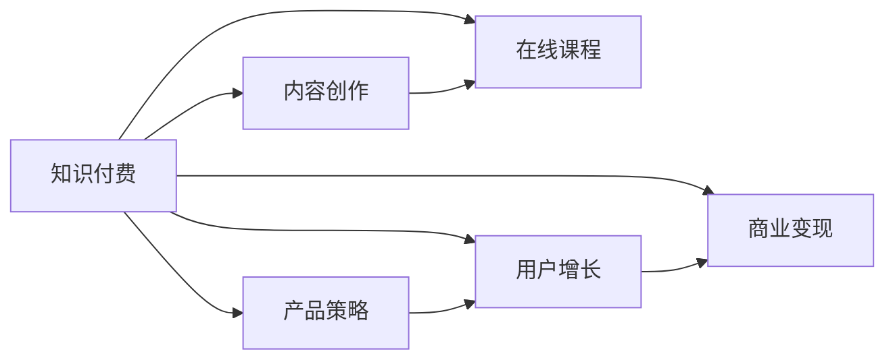

                 

# 程序员如何利用知识付费实现被动收入的策略与方法

> 关键词：知识付费, 在线课程, 内容创作, 产品策略, 用户增长, 商业变现

## 1. 背景介绍

在数字经济的浪潮下，互联网知识和内容变现的方式日益多样化，知识付费成为一种新兴的商业模式。对于程序员而言，如何利用自身优势，通过知识付费实现被动收入，是一个值得深入探讨的话题。本文将从背景介绍、核心概念、算法原理与操作步骤、实际应用、工具与资源推荐、总结与展望等多个方面，系统地探讨程序员如何构建自己的知识付费平台，并实现稳定的被动收入。

## 2. 核心概念与联系

### 2.1 核心概念概述

- **知识付费**：指用户为获取知识而支付费用的行为。在线课程、订阅专栏、付费咨询、技术博客等都是常见的知识付费形式。
- **在线课程**：通过互联网平台，提供结构化、系统化的知识传递。可以是视频、文字、音频等多种形式。
- **内容创作**：指通过文字、视频、音频等多种形式创作专业内容的过程。内容创作是知识付费的核心，需具备一定的技术深度和广度。
- **产品策略**：指在知识付费平台上，如何设计、优化产品功能，提升用户体验，增加用户粘性。
- **用户增长**：指通过各种策略，吸引更多用户注册、使用、付费，实现平台的可持续增长。
- **商业变现**：指通过广告、会员订阅、付费课程等方式，实现知识付费平台的盈利。

这些概念之间存在紧密的联系，共同构成了一个完整的知识付费生态系统。以下是这些概念的 Mermaid 流程图：



## 3. 核心算法原理 & 具体操作步骤

### 3.1 算法原理概述

知识付费平台的算法原理基于以下两个核心模型：

1. **内容推荐系统**：根据用户的历史行为数据，推荐其可能感兴趣的内容。常见算法包括协同过滤、基于内容的推荐、深度学习推荐等。
2. **付费转化模型**：预测用户在特定内容上付费的可能性，并据此优化内容定价和营销策略。常见算法包括逻辑回归、随机森林、神经网络等。

### 3.2 算法步骤详解

1. **数据收集**：
   - 收集用户行为数据，如浏览记录、课程完成率、购买历史等。
   - 收集课程评价数据，分析用户反馈，改进课程质量。

2. **模型训练**：
   - 使用协同过滤、基于内容的推荐算法训练推荐模型。
   - 使用逻辑回归、随机森林、神经网络等训练付费转化模型。

3. **模型评估与优化**：
   - 使用准确率、召回率、A/B测试等方法评估模型效果。
   - 根据评估结果，调整算法参数和模型结构，持续优化推荐效果和付费转化率。

4. **系统部署与迭代**：
   - 将训练好的模型部署到生产环境。
   - 监控模型表现，实时调整算法参数和策略，保证系统稳定性和效果。

### 3.3 算法优缺点

**优点**：
- 提升用户体验，增加用户粘性。通过个性化推荐，用户能够快速找到感兴趣的内容，提高课程完成率和购买率。
- 优化商业变现策略。通过付费转化模型，优化课程定价和营销策略，最大化收入。

**缺点**：
- 数据隐私问题。用户行为数据的收集和使用，需要严格遵守数据隐私法规，保护用户隐私。
- 算法复杂性。推荐和付费转化模型往往复杂，需要强大的计算能力和专业知识。
- 模型过拟合风险。模型需要持续优化和迭代，避免过拟合和性能下降。

### 3.4 算法应用领域

知识付费的算法模型广泛应用于各种在线学习平台，如Coursera、Udemy、网易云课堂等。通过算法优化，这些平台能够实现高质量的内容推荐和付费转化，满足用户的学习需求，提升商业价值。

## 4. 数学模型和公式 & 详细讲解 & 举例说明

### 4.1 数学模型构建

本节将详细介绍内容推荐和付费转化模型的数学建模过程。

假设推荐系统有 $M$ 个课程和 $U$ 个用户，每个用户对每个课程的评分 $r_{iu}$ 为 $0$ 或 $1$，表示用户是否对课程感兴趣。

内容推荐模型的目标是最小化预测误差 $E$：

$$
E = \sum_{iu}(\hat{r}_{iu} - r_{iu})^2
$$

其中 $\hat{r}_{iu}$ 为模型的预测评分，可以通过协同过滤、基于内容的推荐等多种算法得到。

付费转化模型旨在预测用户是否会为某课程付费，常见模型为逻辑回归（Logistic Regression）：

$$
\hat{p}_{iu} = \text{sigmoid}(\sum_{j=1}^{n} \theta_j x_{iu}^{(j)} + \theta_0)
$$

其中 $x_{iu}^{(j)}$ 为课程特征，$\theta_j$ 为模型参数，$\text{sigmoid}$ 函数为逻辑回归的输出函数。

### 4.2 公式推导过程

内容推荐模型常用的协同过滤算法为基于用户的协同过滤（User-based Collaborative Filtering）：

$$
\hat{r}_{iu} = \sum_{j \in N(u)}\frac{r_{ju}}{k_u} \cdot r_{iu} + \epsilon_{iu}
$$

其中 $N(u)$ 为与用户 $u$ 兴趣相近的邻居用户集合，$k_u$ 为用户 $u$ 的兴趣维度，$\epsilon_{iu}$ 为误差项。

付费转化模型采用逻辑回归，其目标函数为：

$$
\mathcal{L} = -\frac{1}{N}\sum_{iu}[y_{iu}\log \hat{p}_{iu} + (1-y_{iu})\log (1-\hat{p}_{iu})]
$$

其中 $y_{iu}$ 为实际标签（付费或未付费），$\hat{p}_{iu}$ 为模型预测概率。

### 4.3 案例分析与讲解

以某在线课程平台为例，介绍如何通过推荐和付费转化模型优化用户体验和商业变现。

1. **数据收集与预处理**：
   - 收集用户浏览、点击、评价、购买行为数据。
   - 对数据进行清洗和标准化处理，去除噪声和异常值。

2. **模型训练**：
   - 使用协同过滤算法训练内容推荐模型，通过余弦相似度计算用户之间的相似度。
   - 使用逻辑回归训练付费转化模型，预测用户是否会为某课程付费。

3. **模型评估与优化**：
   - 使用交叉验证、A/B测试等方法评估推荐效果和付费转化率。
   - 根据评估结果，调整模型参数和特征选择策略，优化模型性能。

4. **系统部署与迭代**：
   - 将训练好的推荐和付费转化模型部署到生产环境。
   - 实时监控模型表现，根据用户反馈和市场变化，持续优化算法和策略。

## 5. 项目实践：代码实例和详细解释说明

### 5.1 开发环境搭建

1. 安装Python和相关依赖包：
```bash
pip install numpy pandas scikit-learn sklearn
```

2. 安装推荐系统相关库：
```bash
pip install lightfm tensorboard
```

3. 搭建推荐系统开发环境：
```bash
python -m lightfm.gen_data -outdata data -task user_based
```

### 5.2 源代码详细实现

以下是一个简单的推荐系统代码示例，用于演示推荐模型的实现过程。

```python
import lightfm
import pandas as pd

# 加载数据
data = pd.read_csv('data.csv', sep='\t')

# 构建数据
item = data['item_id'].astype('category')
user = data['user_id'].astype('category')
rating = data['rating'].astype('float32')

# 构建推荐模型
model = lightfm.LightFM()

# 训练模型
model.fit(item, user, rating, epochs=10)

# 测试模型
test_data = pd.read_csv('test_data.csv', sep='\t')
test_item = test_data['item_id'].astype('category')
test_user = test_data['user_id'].astype('category')

predictions = model.predict(test_item, test_user)
```

### 5.3 代码解读与分析

**推荐系统代码**：
- `lightfm`库提供了轻量级的推荐系统实现，支持多种算法。
- 数据预处理：将用户和物品ID转化为category类型，对评分进行归一化处理。
- 模型构建：通过`LightFM()`函数创建协同过滤模型。
- 模型训练：调用`fit()`方法，指定训练数据和迭代次数。
- 模型测试：使用`predict()`方法，预测新用户的推荐结果。

## 6. 实际应用场景

### 6.1 在线教育平台

知识付费在在线教育平台的应用尤为广泛。平台通过推荐系统，为用户推荐感兴趣的课程和讲师，提升课程完成率和购买率。例如，Coursera和edX等平台利用推荐系统，帮助用户快速找到符合自己兴趣和需求的课程，提高了用户体验和学习效果。

### 6.2 技术博客与社区

技术博客和社区可以通过知识付费，实现内容变现和社区管理。博客作者通过撰写高质量的技术文章，吸引读者付费订阅和打赏，实现商业变现。同时，通过用户付费阅读文章和参与讨论，可以优化内容推荐策略，提高用户粘性和社区活跃度。

### 6.3 在线课程和资料销售

知识付费平台可以销售各种在线课程和资料，如编程视频教程、算法书籍、实战案例等。平台利用推荐系统，为用户推荐感兴趣的课程和资料，提升购买转化率。例如，慕课网和腾讯课堂等平台，通过推荐系统实现了高效的内容分发和销售。

### 6.4 未来应用展望

随着人工智能技术的不断进步，知识付费平台将进一步向智能化、个性化、互动化方向发展。未来的知识付费系统将具备以下特点：

1. **个性化推荐**：通过深度学习算法，提供更加精准的内容推荐，满足用户的个性化需求。
2. **动态定价**：根据用户行为和市场数据，动态调整课程定价，实现最优的商业变现。
3. **互动学习**：结合虚拟现实（VR）、增强现实（AR）等技术，实现沉浸式学习体验。
4. **内容创制**：利用生成对抗网络（GAN）等技术，自动生成高质量的学习内容，提升内容创作效率。

## 7. 工具和资源推荐

### 7.1 学习资源推荐

1. **《推荐系统实战》**：该书系统介绍了推荐系统原理和应用，适合初学者和进阶者阅读。
2. **Coursera《推荐系统》课程**：由斯坦福大学教授授课，深入浅出地讲解推荐系统理论和技术。
3. **Kaggle推荐系统竞赛**：参与实际推荐系统竞赛，积累实战经验，提升算法优化能力。

### 7.2 开发工具推荐

1. **PyTorch**：用于深度学习模型的训练和推理，适合推荐系统算法实现。
2. **TensorFlow**：强大的深度学习框架，支持推荐系统的多种算法实现。
3. **LightFM**：轻量级的推荐系统实现，适合快速搭建推荐系统原型。

### 7.3 相关论文推荐

1. **《推荐系统基础》**：该书系统介绍了推荐系统理论、算法和应用，适合深入了解推荐系统。
2. **《深度学习与推荐系统》**：该书介绍了深度学习在推荐系统中的应用，适合进阶学习。
3. **《协同过滤推荐系统》**：该书详细讲解了协同过滤算法，适合算法优化和实践。

## 8. 总结：未来发展趋势与挑战

### 8.1 研究成果总结

本文系统介绍了知识付费平台的推荐系统原理和操作步骤，通过算法优化和模型训练，提升用户体验和商业变现。文章详细讨论了推荐系统在在线教育、技术博客、在线课程等多个领域的应用，展示了大规模推荐系统的优势和潜力。

### 8.2 未来发展趋势

1. **推荐系统智能化**：未来的推荐系统将结合深度学习算法，提供更加精准和个性化的推荐服务。
2. **跨领域推荐**：推荐系统将拓展到更多领域，如音乐、视频、社交网络等，提供多样化推荐内容。
3. **实时推荐**：推荐系统将具备实时推荐能力，根据用户即时行为调整推荐策略，提升用户体验。
4. **用户行为分析**：利用大数据分析技术，深入挖掘用户行为，优化推荐策略和产品设计。

### 8.3 面临的挑战

1. **数据隐私**：推荐系统需要大量用户行为数据，如何保护用户隐私，避免数据泄露风险。
2. **算法复杂性**：推荐系统算法复杂，需要大量计算资源和专业知识，难以快速迭代和优化。
3. **用户信任**：如何建立用户信任，提升用户对推荐内容的接受度和使用率。
4. **内容质量**：推荐系统依赖高质量的内容，如何提升内容创作效率和质量，实现可持续增长。

### 8.4 研究展望

未来的推荐系统将结合人工智能、大数据分析、用户行为分析等多种技术手段，提升推荐效果和用户体验。同时，通过不断优化算法和模型，提高推荐系统的性能和可解释性，实现更加智能化、个性化和可信化的推荐服务。

## 9. 附录：常见问题与解答

**Q1：推荐系统如何提升用户满意度？**

A: 推荐系统通过个性化推荐，能够快速匹配用户兴趣和需求，提升用户满意度。具体措施包括：
1. 收集用户行为数据，分析用户兴趣偏好。
2. 优化推荐算法，提升推荐精准度。
3. 实时更新推荐策略，动态调整推荐内容。

**Q2：推荐系统如何保护用户隐私？**

A: 推荐系统需要严格遵守数据隐私法规，保护用户隐私。具体措施包括：
1. 匿名化处理用户数据，去除敏感信息。
2. 加密存储和传输数据，防止数据泄露。
3. 提供用户数据控制权，让用户自行管理隐私数据。

**Q3：推荐系统如何提升用户粘性？**

A: 推荐系统通过以下措施提升用户粘性：
1. 提供个性化推荐，满足用户个性化需求。
2. 引入用户反馈机制，优化推荐效果。
3. 结合社区互动功能，提升用户参与度。

**Q4：推荐系统如何实现商业变现？**

A: 推荐系统通过以下措施实现商业变现：
1. 销售高质量课程和资料，提升用户购买率。
2. 提供付费订阅服务，增加用户粘性。
3. 引入广告业务，提升平台广告收入。

**Q5：推荐系统如何应对算法过拟合风险？**

A: 推荐系统通过以下措施应对算法过拟合风险：
1. 数据增强，扩充训练集，避免过拟合。
2. 模型正则化，控制模型复杂度。
3. 持续迭代优化，提升模型泛化能力。

本文详细探讨了程序员如何利用知识付费平台实现被动收入的策略与方法。通过推荐系统、内容创作、产品策略、用户增长、商业变现等综合措施，程序员可以构建高效的知识付费平台，实现稳定的被动收入。未来，随着人工智能技术的不断进步和普及，知识付费将迎来更多发展机遇，为程序员提供更多元化的职业选择和发展空间。

---

作者：禅与计算机程序设计艺术 / Zen and the Art of Computer Programming

