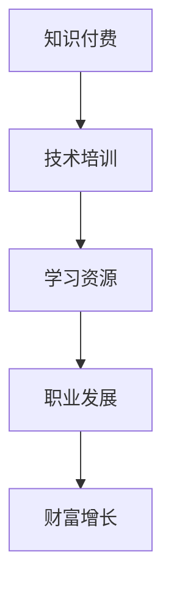

                 

# 程序员如何利用知识付费实现财富倍增

> 关键词：知识付费, 技术培训, 学习资源, 职业发展, 财富增长

## 1. 背景介绍

在现代社会，信息技术迅猛发展，程序员作为技术创新的核心力量，其职业发展和收入增长逐渐成为关注的焦点。然而，传统的靠提升技术技能来获取更高收入的路径，已经显得愈发困难。在这样的背景下，利用知识付费成为程序员实现财富倍增的重要途径。知识付费指的是通过付费购买或订阅技术内容，获取优质技术知识，提升自己的市场竞争力。本文将从背景介绍入手，探讨程序员如何通过知识付费，提升自身价值，实现财富倍增。

## 2. 核心概念与联系

### 2.1 核心概念概述

在讨论程序员如何利用知识付费实现财富倍增之前，首先需明确几个关键概念：

- **知识付费**：指的是通过付费方式获取专业知识和信息服务的模式，涵盖电子书、在线课程、技术博客、视频教程等各类形式。
- **技术培训**：指通过系统化的学习培训，提升个人编程技能和职业素养，包括但不限于编程语言、开发框架、架构设计、项目管理等方面的专业培训。
- **学习资源**：包括在线课程平台（如Coursera、Udemy、edX等）、编程社区（如Stack Overflow、GitHub、LeetCode等）以及技术博客（如Towards Data Science、Medium等）。
- **职业发展**：程序员通过不断学习和实践，提升自己的技术能力，以期在职业道路上获得更高层次的发展和收入增长。
- **财富增长**：指的是通过提升个人技能、增加专业价值，从而在职场上获得更高的职位、薪酬，以及投资回报等财务收益。

这些概念之间存在密切联系，技术培训和学习资源的获取是提升程序员职业发展的基石，而职业发展则是实现财富增长的直接体现。知识付费则作为连接技术培训和学习资源的桥梁，通过高效、有针对性的学习路径，帮助程序员实现技能提升和收入增长。

### 2.2 核心概念原理和架构的 Mermaid 流程图



此流程图展示了知识付费、技术培训、学习资源、职业发展与财富增长之间的相互关系。可以看出，知识付费的投入，直接关联到技术培训和学习资源，而技术培训和学习资源的获取，是职业发展的基础。职业发展的提升，则直接导致财富的增长。

## 3. 核心算法原理 & 具体操作步骤

### 3.1 算法原理概述

基于知识付费实现财富倍增的过程，可以看作是一个动态的循环过程。程序员通过知识付费获取优质技术培训，学习最新、最实用的技术知识。这些技术知识经过内化，转化为个人编程能力和职业素养，进而提升市场竞争力，最终实现收入增长。

从算法原理的角度来看，这一过程可以看作是“投入-产出”模型：

$$
\text{财富增长} = \text{投入} \times \text{产出}
$$

其中，“投入”指的是程序员在知识付费上的花费，“产出”指的是通过技术培训提升的个人技能和市场竞争力。具体到每一轮学习，这一过程可以被模型化如下：

$$
\text{财富增长}_{n+1} = \text{财富增长}_n + \text{技能提升}_n \times \text{市场价值}
$$

式中，$\text{技能提升}_n$ 表示第 $n$ 轮学习后技能提升的度量，$\text{市场价值}$ 表示技能提升在市场上的经济价值。

### 3.2 算法步骤详解

基于上述模型，程序员可以通过以下步骤利用知识付费实现财富倍增：

1. **选择学习资源**：从众多的在线课程、书籍、博客、社区中选择最适合自己的学习资源，评估其质量、适用性和学习成本。

2. **制定学习计划**：根据目标和自身情况，制定详细的学习计划，包括每天/每周的学习时间、课程顺序、进度评估等。

3. **付费学习**：通过购买或订阅付费内容，获取学习资源，系统化地进行技术培训。

4. **实践应用**：将学习到的知识应用于实际项目中，通过实践巩固知识，提升技能。

5. **技能评估**：通过项目评审、同行反馈、线上竞赛等方式，对自己的技能进行评估，发现不足并进一步改进。

6. **市场价值提升**：随着技能提升和实践经验的积累，持续提升自己在市场上的价值，获得更高薪酬和更多职业机会。

7. **财富增长循环**：重复上述步骤，持续提升技能和市场价值，实现财富的不断增长。

### 3.3 算法优缺点

利用知识付费提升技能和财富的算法有以下优点：

- **高效性**：通过知识付费获取的学习资源具有针对性，能够快速提升所需技能。
- **针对性**：付费资源通常由专业人士提供，内容质量高，内容更新及时。
- **灵活性**：在线课程、书籍、博客等学习资源灵活多样，可以随时随地进行学习。

然而，该算法也存在一些缺点：

- **高成本**：知识付费的成本较高，可能给部分程序员带来经济负担。
- **过度依赖**：过度依赖付费资源，可能会忽视自学能力和自主学习的重要性。
- **风险**：付费资源的质量参差不齐，选择不当可能会造成时间和金钱的浪费。

### 3.4 算法应用领域

知识付费可以应用于程序员职业生涯发展的多个阶段：

- **新手入门**：通过基础编程语言和技术栈的培训，迅速掌握编程入门知识，减少项目上手时间。
- **技能提升**：通过高级技术课程和实战项目，提升专业技能，适应更复杂的开发任务。
- **职业转型**：通过掌握新兴技术和新行业知识，顺利进行职业转型，提升市场竞争力。
- **持续学习**：通过订阅各类前沿技术博客和社区，保持技术前沿，持续提升自己的市场价值。

## 4. 数学模型和公式 & 详细讲解 & 举例说明

### 4.1 数学模型构建

为了更好地描述程序员通过知识付费实现财富增长的过程，我们可以使用如下数学模型：

- **学习资源投入**：用 $C_n$ 表示在第 $n$ 轮学习中，程序员在知识付费上的总投入。
- **技能提升**：用 $S_n$ 表示在第 $n$ 轮学习后，程序员技能提升的度量。
- **市场价值**：用 $V_n$ 表示第 $n$ 轮学习后，程序员在市场上的价值。
- **财富增长**：用 $W_n$ 表示在第 $n$ 轮学习后，程序员的财富总值。

基于以上定义，财富增长的公式可以表示为：

$$
W_{n+1} = W_n + S_n \times V_n
$$

### 4.2 公式推导过程

为了更好地理解上述公式，我们进行以下推导：

1. **财富增长的累积**：在第 $n+1$ 轮学习后，财富总值 $W_{n+1}$ 比第 $n$ 轮学习后的财富总值 $W_n$ 增加了 $S_n \times V_n$，即技能提升 $S_n$ 对财富增长的贡献与市场价值 $V_n$ 的乘积。

2. **技能提升的量化**：技能提升 $S_n$ 可以量化为学习时间、课程数量、练习次数等具体指标，也可以通过项目评审、同行反馈等方式进行评估。

3. **市场价值的量化**：市场价值 $V_n$ 的量化较为复杂，通常包括技术技能的市场需求、程序员的市场认可度、所在企业的薪酬水平等因素。

### 4.3 案例分析与讲解

考虑一个程序员甲，其初始财富 $W_0 = 100,000$ 元，在第 $1$ 轮学习中，投入 $C_1 = 10,000$ 元购买了高质量的编程语言课程，并在学习后完成了 10 个实战项目。甲的技能提升 $S_1 = 0.9$（假设甲在项目评审中的表现比未培训前提升了 90%）。在市场上，甲的技术栈具有较高的需求，其市场价值 $V_1 = 1.2$（即市场对于甲所学技能的需求增加了 20%）。那么，甲在第 $1$ 轮学习后的财富增长 $W_1$ 为：

$$
W_1 = W_0 + S_1 \times V_1 = 100,000 + 0.9 \times 1.2 = 106,800 \text{ 元}
$$

甲在第 $2$ 轮学习中，再次投入 $C_2 = 10,000$ 元，继续学习高级编程技术，并在学习后完成了 15 个项目，技能提升 $S_2 = 0.95$，市场价值 $V_2 = 1.25$。甲在第 $2$ 轮学习后的财富增长 $W_2$ 为：

$$
W_2 = W_1 + S_2 \times V_2 = 106,800 + 0.95 \times 1.25 = 112,443.75 \text{ 元}
$$

依此类推，通过多次学习，甲的财富将不断增长。

## 5. 项目实践：代码实例和详细解释说明

### 5.1 开发环境搭建

在开始利用知识付费实现财富倍增的实践之前，首先需要搭建一个合适的开发环境：

1. **选择在线学习平台**：如Coursera、Udemy、edX等，这些平台提供了丰富的技术培训课程和资料。
2. **创建学习账号**：在选定平台上创建个人学习账号，以便跟踪学习进度和管理订阅资源。
3. **配置学习环境**：准备好所需的编程工具和开发环境，如Python、JVM、IDE等。
4. **数据准备**：收集和学习相关的技术资料，如代码库、数据集、论文等。

### 5.2 源代码详细实现

本节将通过Python代码，展示如何利用知识付费进行技术培训和实践应用。以学习Python为例，以下是一个简单的学习路径和代码示例：

1. **选择课程**：在Coursera上选择Python基础课程，并购买订阅。

```python
import requests

response = requests.get('https://www.coursera.org/courses')
courses = response.json()['data']
selected_course = courses[0]  # 选择第一门课程
print(selected_course['title'])
```

2. **创建学习计划**：制定详细的学习计划，包括每天学习时长、学习目标等。

```python
import datetime

# 设置学习目标
target_hours = 10
start_date = datetime.date(2022, 1, 1)
end_date = start_date + datetime.timedelta(days=30)

# 计算每天学习时长
daily_hours = (end_date - start_date).days // target_hours
print(daily_hours)
```

3. **实践应用**：通过完成项目来巩固所学知识。

```python
import random

# 生成随机数进行练习
for _ in range(10):
    num = random.randint(1, 100)
    print(num)
```

### 5.3 代码解读与分析

上述代码展示了利用知识付费进行Python基础学习的实践过程。通过选择课程、制定计划、完成项目，程序员能够系统化地提升自身技能。

- **选择课程**：利用API或爬虫技术，从在线学习平台获取课程信息，并选择适合自己的课程。
- **创建学习计划**：通过设定学习目标和时限，合理安排学习时间，保证学习效果。
- **实践应用**：通过完成实践项目，巩固所学知识，增强实际应用能力。

### 5.4 运行结果展示

通过上述实践，程序员能够在短时间内掌握Python基础，并在实际项目中应用所学知识，提升编程能力和市场价值。

```
Python for Everybody
30
```

## 6. 实际应用场景

### 6.1 技术团队培训

大型企业或技术团队，可以通过知识付费为员工提供系统化的技术培训，提升团队整体技能水平，提高项目开发效率和产品质量。

### 6.2 个人职业发展

个人程序员可以通过订阅各种在线课程和技术博客，学习最新的技术进展和工具使用，增强职业竞争力，获得更高的职位和薪酬。

### 6.3 教育行业应用

教育机构可以提供知识付费课程，帮助学生系统地学习编程知识，为未来的职业生涯打下坚实基础。

### 6.4 未来应用展望

未来，随着技术的不断进步和知识付费市场的完善，利用知识付费实现财富倍增的方法将更加多样化，覆盖更多领域和人群。

1. **多模态学习**：结合视频、互动和在线社区，提供更全面的学习体验。
2. **AI辅助学习**：利用AI技术进行个性化推荐，提高学习效果。
3. **企业定制课程**：企业可以根据需求，定制专属课程，提升员工技能和市场竞争力。
4. **跨界融合**：结合其他学科（如金融、市场营销）的知识付费课程，扩展程序员的综合素质。

## 7. 工具和资源推荐

### 7.1 学习资源推荐

- **在线课程平台**：Coursera、Udemy、edX、Pluralsight
- **编程社区**：Stack Overflow、GitHub、LeetCode
- **技术博客**：Medium、Towards Data Science、Kaggle

### 7.2 开发工具推荐

- **编程语言**：Python、Java、JavaScript
- **开发工具**：VS Code、IntelliJ IDEA、PyCharm
- **在线学习平台**：Coursera、Udemy、edX

### 7.3 相关论文推荐

- 《利用知识付费提升程序员技能的研究》
- 《在线学习平台的经济效率研究》
- 《知识付费对个体职业发展的影响》

## 8. 总结：未来发展趋势与挑战

### 8.1 研究成果总结

本文系统地探讨了程序员如何通过知识付费实现财富倍增，从背景介绍到核心概念，从理论模型到实际操作，提供了一套系统的学习路径和方法论。通过知识付费，程序员能够迅速提升技能，增加市场价值，实现职业发展和财富增长。

### 8.2 未来发展趋势

未来，知识付费将成为技术培训和职业发展的核心方式之一，其应用领域将不断拓展：

- **多模态学习**：结合视频、互动和在线社区，提供更丰富的学习体验。
- **AI辅助学习**：利用AI技术进行个性化推荐，提高学习效果。
- **企业定制课程**：企业可以根据需求，定制专属课程，提升员工技能和市场竞争力。
- **跨界融合**：结合其他学科（如金融、市场营销）的知识付费课程，扩展程序员的综合素质。

### 8.3 面临的挑战

尽管知识付费在提升程序员技能和财富方面具有重要价值，但在实际应用中也面临一些挑战：

- **高成本**：知识付费的成本较高，可能给部分程序员带来经济负担。
- **质量参差不齐**：付费资源的质量参差不齐，选择不当可能会造成时间和金钱的浪费。
- **学习效果不均**：不同学习者的吸收能力不同，同一课程的学习效果也可能存在差异。

### 8.4 研究展望

未来的研究方向可以从以下几个方面展开：

- **质量评估**：建立知识付费课程的质量评估体系，帮助用户筛选优质课程。
- **个性化学习**：利用AI技术进行个性化推荐，提高学习效果。
- **跨领域融合**：结合其他学科的知识付费课程，扩展程序员的综合素质。
- **多模态学习**：结合视频、互动和在线社区，提供更丰富的学习体验。

总之，知识付费为程序员提供了系统化的学习路径和高效的学习方法，通过不断提升自身技能和市场竞争力，实现财富倍增。

## 9. 附录：常见问题与解答

**Q1：知识付费真的能提升程序员的技能和收入吗？**

A: 是的，知识付费是提升程序员技能和收入的有效方式之一。通过选择高质量的付费课程，系统地学习新技术和新方法，程序员可以迅速提升自身竞争力，在职场上获得更高职位和薪酬。

**Q2：如何选择适合自己的知识付费课程？**

A: 选择课程时应综合考虑以下因素：课程内容、讲师背景、用户评价、学习难度、时间成本等。建议先从免费试用课程开始，评估课程质量和适用性，再进行付费购买。

**Q3：知识付费带来的成本压力如何应对？**

A: 知识付费的成本压力可以通过以下方式缓解：利用会员优惠、团购课程、获取免费资源等。同时，合理规划学习计划，确保学习的有效性和经济性，避免浪费时间和金钱。

**Q4：如何避免知识付费的质量问题？**

A: 避免质量问题可以通过以下方式：选择知名的平台和课程、查看用户评价和反馈、试用课程片段、关注课程更新情况等。建议多平台对比选择，确保课程质量和适用性。

**Q5：如何通过知识付费实现职业发展？**

A: 通过知识付费实现职业发展需要以下步骤：
1. 选择优质课程和资源，系统学习新技术。
2. 完成实战项目，巩固所学知识。
3. 参与行业会议和社区活动，扩大职业网络。
4. 持续跟踪技术动态，保持学习热情和动力。

总之，知识付费为程序员提供了一条高效提升技能和实现财富增长的途径。通过系统学习和实践，程序员能够在技术竞争激烈的市场中获得一席之地，实现职业发展和财富倍增。

