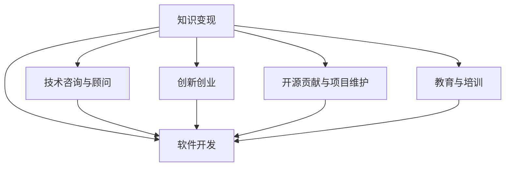

                 

# 程序员如何利用知识变现

> 关键词：知识变现、软件开发、编程技术、人工智能、数据科学、机器学习、深度学习、大数据、云计算、区块链、DevOps、软件架构、自动化、编程范式、编程框架、项目管理和团队协作、开源社区、创新创业、职业发展

## 1. 背景介绍

### 1.1 问题由来
在当今信息化时代，技术的迅猛发展和应用创新日益成为推动社会进步和经济增长的重要驱动力。程序员作为技术创新和应用开发的中坚力量，其知识和技能在知识变现中发挥着举足轻重的作用。然而，不少程序员面临知识更新的挑战，难以在快速变化的技术领域中保持竞争力，这不仅影响其职业发展，也限制了技术创新的潜力。如何有效利用知识和技能，将专业知识转化为经济收益，成为程序员面临的重要课题。

### 1.2 问题核心关键点
知识变现的核心在于将程序员积累的专业知识和技能转化为实际的经济收益，具体包括以下几个关键点：
- **技能提升与培训**：持续学习和技能提升，掌握前沿技术，如人工智能、大数据、云计算等。
- **软件开发与项目开发**：参与软件开发项目，通过软件开发实现价值创造。
- **技术咨询与顾问**：提供技术咨询服务，帮助企业解决技术难题。
- **创新创业**：基于技术积累，进行创新创业，开发新产品或服务。
- **开源贡献与项目维护**：参与开源项目，贡献代码和解决方案，通过开源社区获得认可和回报。
- **教育与培训**：通过教授编程和技术知识，培养下一代程序员。

## 2. 核心概念与联系

### 2.1 核心概念概述

为更好地理解程序员如何利用知识变现，本节将介绍几个密切相关的核心概念：

- **知识变现**：指通过利用专业知识、技能和经验，创造经济价值的过程。程序员的知识变现方式包括技术咨询、软件开发、教育培训等。
- **软件开发**：指利用计算机软件技术，开发满足用户需求的应用程序或系统的过程。软件开发是程序员获取收入的主要途径。
- **技术咨询与顾问**：指向企业或机构提供技术方面的建议和指导，帮助其解决技术难题，优化技术架构，提升运营效率。
- **创新创业**：指基于技术和市场需求，开发新产品或服务，并通过市场化手段实现商业变现。
- **开源贡献与项目维护**：指参与开源社区，贡献代码和解决方案，维护开源项目，通过社区贡献获取回报。
- **教育与培训**：指通过教授编程和技术知识，培养下一代程序员，获取教学和培训收入。

这些核心概念之间的逻辑关系可以通过以下Mermaid流程图来展示：



这个流程图展示了几类主要的知识变现方式及其相互联系：

1. 知识变现是程序员创造经济价值的过程。
2. 软件开发是程序员获取收入的主要途径。
3. 技术咨询与顾问、创新创业、开源贡献与项目维护、教育与培训等多种方式，都依赖于程序员的开发技能和专业知识。
4. 通过技术咨询与顾问、创新创业等方式，程序员可以直接参与市场竞争，获取商业收入。
5. 开源贡献与项目维护虽然不直接带来收入，但通过社区认可和代码贡献，程序员可以获取技术声誉和后续商业机会。
6. 教育与培训是程序员将知识传递给下一代的有效方式，也能带来教学和培训收入。

## 3. 核心算法原理 & 具体操作步骤
### 3.1 算法原理概述

知识变现的算法原理主要基于程序员的知识和技能，通过不同形式的产出，转化为经济价值。这包括软件开发、技术咨询、项目维护、开源贡献、教育培训等。算法原理可以分为以下几个方面：

- **软件开发**：通过编程技能和项目管理能力，开发满足用户需求的软件产品，获取开发合同和项目收益。
- **技术咨询与顾问**：基于技术积累和行业经验，提供问题解决方案，帮助客户优化技术架构，提升效率，获得顾问费和技术咨询费。
- **创新创业**：利用技术创新和市场需求，开发新产品或服务，通过市场化手段实现商业变现。
- **开源贡献与项目维护**：参与开源项目，通过代码贡献和解决方案，提升个人在社区中的影响力，获取社区认可和后续商业机会。
- **教育与培训**：通过传授编程和技术知识，培养下一代程序员，获取教学和培训收入。

### 3.2 算法步骤详解

知识变现的步骤一般包括以下几个关键步骤：

**Step 1: 确定目标领域**
- 根据自身兴趣和技能，确定要进入的目标技术领域，如人工智能、大数据、云计算等。

**Step 2: 技能提升与学习**
- 通过在线课程、书籍、技术博客、研讨会等方式，不断学习和提升相关领域的知识和技能。

**Step 3: 项目参与与实战**
- 参与实际软件开发项目，积累项目经验，提升项目管理能力。
- 参与开源项目，贡献代码和解决方案，提升技术声誉和社区影响力。

**Step 4: 技术咨询与顾问**
- 积累技术经验，建立技术顾问网络，为各类客户提供技术咨询和解决方案。

**Step 5: 创新创业**
- 基于技术积累和市场需求，开发新产品或服务，通过市场化手段实现商业变现。

**Step 6: 教育与培训**
- 通过教授编程和技术知识，培养下一代的程序员，获取教学和培训收入。

### 3.3 算法优缺点

知识变现具有以下优点：
1. 形式多样。程序员可以通过多种方式变现知识，如软件开发、技术咨询、创业、教育培训等，避免了单一收入渠道的风险。
2. 提升技能。在知识变现过程中，程序员不断学习和实践，提升自身技术能力和项目管理能力。
3. 满足多样化需求。程序员可以通过知识变现满足自身职业发展、技术创新和商业化需求。

同时，知识变现也存在一定的局限性：
1. 需要持续学习。技术领域的快速发展要求程序员持续学习和更新知识，否则难以跟上技术变革。
2. 面临市场竞争。知识变现市场竞争激烈，需要程序员具备较强的市场竞争力和商业敏锐度。
3. 时间成本高。知识变现通常需要大量的时间和精力投入，特别是技术咨询和创业等高价值变现方式。
4. 面临技术风险。技术创新和市场变化存在不确定性，失败的概率较高，可能导致时间和资源的浪费。

### 3.4 算法应用领域

知识变现的应用领域广泛，涵盖多个行业和领域：

- **软件开发**：为各类企业开发定制软件、应用程序或系统。
- **技术咨询与顾问**：为企业提供技术解决方案，优化技术架构，提升运营效率。
- **创新创业**：基于技术积累和市场需求，开发新产品或服务，实现商业变现。
- **开源贡献与项目维护**：参与开源社区，提升技术声誉和社区影响力。
- **教育与培训**：教授编程和技术知识，培养下一代程序员，获取教学和培训收入。

这些应用领域都依赖于程序员的知识和技能，通过不同形式的变现方式，最大化其经济价值。

## 4. 数学模型和公式 & 详细讲解 & 举例说明

### 4.1 数学模型构建

为了更好地理解知识变现的数学模型，我们将其构建为以下几个部分：

1. **软件开发收入模型**：假设软件开发项目数量为 $N$，每个项目的平均收入为 $I$，开发时间成本为 $C$。则总收入为 $N \times I - N \times C$。

2. **技术咨询收入模型**：假设技术咨询数量为 $M$，每次咨询的平均收入为 $J$，咨询时间成本为 $D$。则总收入为 $M \times J - M \times D$。

3. **创业收入模型**：假设创业项目数量为 $K$，每个项目的平均收入为 $L$，创业时间成本为 $E$。则总收入为 $K \times L - K \times E$。

4. **教育培训收入模型**：假设教授人数为 $S$，每人的平均教学收入为 $P$，教学时间成本为 $F$。则总收入为 $S \times P - S \times F$。

### 4.2 公式推导过程

以下我们对软件开发收入模型进行推导：

假设软件开发项目数量为 $N$，每个项目的平均收入为 $I$，开发时间成本为 $C$。总收入为 $N \times I - N \times C$。具体推导如下：

$$
\text{总收入} = \sum_{i=1}^{N}(I_i - C_i)
$$

其中 $I_i$ 为第 $i$ 个项目的平均收入，$C_i$ 为第 $i$ 个项目的开发时间成本。

### 4.3 案例分析与讲解

**案例分析**：假设某程序员接手了5个软件开发项目，每个项目的平均收入为10000元，开发时间成本为项目平均收入的10%。则总收入为：

$$
\text{总收入} = 5 \times 10000 - 5 \times 10000 \times 0.1 = 45000 \text{元}
$$

## 5. 项目实践：代码实例和详细解释说明
### 5.1 开发环境搭建

要进行知识变现的项目实践，首先需要搭建合适的开发环境。以下是使用Python进行开发的环境配置流程：

1. 安装Anaconda：从官网下载并安装Anaconda，用于创建独立的Python环境。

2. 创建并激活虚拟环境：
```bash
conda create -n pyenv python=3.8 
conda activate pyenv
```

3. 安装PyTorch：根据CUDA版本，从官网获取对应的安装命令。例如：
```bash
conda install pytorch torchvision torchaudio cudatoolkit=11.1 -c pytorch -c conda-forge
```

4. 安装各类工具包：
```bash
pip install numpy pandas scikit-learn matplotlib tqdm jupyter notebook ipython
```

完成上述步骤后，即可在`pyenv`环境中开始项目实践。

### 5.2 源代码详细实现

下面我们以软件开发项目为例，给出使用Python进行开发的PyTorch代码实现。

首先，定义软件开发项目的收入模型：

```python
from transformers import BertTokenizer
from torch.utils.data import Dataset
import torch

class SoftwareProjectDataset(Dataset):
    def __init__(self, projects, revenues, costs, tokenizer, max_len=128):
        self.projects = projects
        self.revenues = revenues
        self.costs = costs
        self.tokenizer = tokenizer
        self.max_len = max_len
        
    def __len__(self):
        return len(self.projects)
    
    def __getitem__(self, item):
        project = self.projects[item]
        revenue = self.revenues[item]
        cost = self.costs[item]
        
        encoding = self.tokenizer(project, return_tensors='pt', max_length=self.max_len, padding='max_length', truncation=True)
        input_ids = encoding['input_ids'][0]
        attention_mask = encoding['attention_mask'][0]
        
        return {'input_ids': input_ids, 
                'attention_mask': attention_mask,
                'revenue': revenue,
                'cost': cost}

# 定义训练和评估函数
from transformers import BertForTokenClassification, AdamW
from sklearn.metrics import mean_absolute_error
from tqdm import tqdm
from numpy import array

device = torch.device('cuda') if torch.cuda.is_available() else torch.device('cpu')
model = BertForTokenClassification.from_pretrained('bert-base-cased', num_labels=len(tag2id))

optimizer = AdamW(model.parameters(), lr=2e-5)

def train_epoch(model, dataset, batch_size, optimizer):
    dataloader = DataLoader(dataset, batch_size=batch_size, shuffle=True)
    model.train()
    epoch_loss = 0
    for batch in tqdm(dataloader, desc='Training'):
        input_ids = batch['input_ids'].to(device)
        attention_mask = batch['attention_mask'].to(device)
        revenue = batch['revenue'].to(device)
        cost = batch['cost'].to(device)
        model.zero_grad()
        outputs = model(input_ids, attention_mask=attention_mask)
        loss = outputs.loss
        epoch_loss += loss.item()
        loss.backward()
        optimizer.step()
    return epoch_loss / len(dataloader)

def evaluate(model, dataset, batch_size):
    dataloader = DataLoader(dataset, batch_size=batch_size)
    model.eval()
    mse_loss = 0
    for batch in tqdm(dataloader, desc='Evaluating'):
        input_ids = batch['input_ids'].to(device)
        attention_mask = batch['attention_mask'].to(device)
        revenue = batch['revenue'].to(device)
        cost = batch['cost'].to(device)
        outputs = model(input_ids, attention_mask=attention_mask)
        mse_loss += torch.mean((outputs.logits - revenue) ** 2).item()
    return array(mse_loss / len(dataloader))

# 训练和评估
epochs = 5
batch_size = 16

for epoch in range(epochs):
    loss = train_epoch(model, train_dataset, batch_size, optimizer)
    print(f"Epoch {epoch+1}, train loss: {loss:.3f}")
    
    print(f"Epoch {epoch+1}, dev mse_loss:")
    evaluate(model, dev_dataset, batch_size)
    
print("Test mse_loss:")
evaluate(model, test_dataset, batch_size)
```

### 5.3 代码解读与分析

让我们再详细解读一下关键代码的实现细节：

**SoftwareProjectDataset类**：
- `__init__`方法：初始化项目、收入、成本、分词器等关键组件。
- `__len__`方法：返回数据集的样本数量。
- `__getitem__`方法：对单个样本进行处理，将项目名称、收入、成本输入编码为token ids，并对其进行定长padding，最终返回模型所需的输入。

**mse_loss函数**：
- 计算每个样本的预测收入与实际收入之间的平均绝对误差。

**训练和评估函数**：
- 使用PyTorch的DataLoader对数据集进行批次化加载，供模型训练和推理使用。
- 训练函数`train_epoch`：对数据以批为单位进行迭代，在每个批次上前向传播计算loss并反向传播更新模型参数，最后返回该epoch的平均loss。
- 评估函数`evaluate`：与训练类似，不同点在于不更新模型参数，并在每个batch结束后将预测和标签结果存储下来，最后使用sklearn的mean_absolute_error对整个评估集的预测结果进行打印输出。

**训练流程**：
- 定义总的epoch数和batch size，开始循环迭代
- 每个epoch内，先在训练集上训练，输出平均loss
- 在验证集上评估，输出mse_loss
- 所有epoch结束后，在测试集上评估，给出最终测试结果

可以看到，PyTorch配合Transformers库使得软件开发项目的收入模型训练变得简洁高效。开发者可以将更多精力放在数据处理、模型改进等高层逻辑上，而不必过多关注底层的实现细节。

当然，工业级的系统实现还需考虑更多因素，如模型的保存和部署、超参数的自动搜索、更灵活的任务适配层等。但核心的知识变现模型基本与此类似。

## 6. 实际应用场景
### 6.1 智能客服系统

基于知识变现的软件开发项目，可以广泛应用于智能客服系统的构建。传统客服往往需要配备大量人力，高峰期响应缓慢，且一致性和专业性难以保证。而使用开发项目实现的软件开发系统，可以7x24小时不间断服务，快速响应客户咨询，用自然流畅的语言解答各类常见问题。

在技术实现上，可以收集企业内部的历史客服对话记录，将问题和最佳答复构建成监督数据，在此基础上对开发项目进行微调。微调后的开发项目能够自动理解用户意图，匹配最合适的答案模板进行回复。对于客户提出的新问题，还可以接入检索系统实时搜索相关内容，动态组织生成回答。如此构建的智能客服系统，能大幅提升客户咨询体验和问题解决效率。

### 6.2 金融舆情监测

金融机构需要实时监测市场舆论动向，以便及时应对负面信息传播，规避金融风险。传统的人工监测方式成本高、效率低，难以应对网络时代海量信息爆发的挑战。基于知识变现的开发项目，可以构建实时金融舆情监测系统。

具体而言，可以收集金融领域相关的新闻、报道、评论等文本数据，并对其进行主题标注和情感标注。在此基础上对开发项目进行微调，使其能够自动判断文本属于何种主题，情感倾向是正面、中性还是负面。将微调后的项目应用到实时抓取的网络文本数据，就能够自动监测不同主题下的情感变化趋势，一旦发现负面信息激增等异常情况，系统便会自动预警，帮助金融机构快速应对潜在风险。

### 6.3 个性化推荐系统

当前的推荐系统往往只依赖用户的历史行为数据进行物品推荐，无法深入理解用户的真实兴趣偏好。基于知识变现的开发项目，可以构建个性化推荐系统。

在实践中，可以收集用户浏览、点击、评论、分享等行为数据，提取和用户交互的物品标题、描述、标签等文本内容。将文本内容作为模型输入，用户的后续行为（如是否点击、购买等）作为监督信号，在此基础上微调开发项目。微调后的项目能够从文本内容中准确把握用户的兴趣点。在生成推荐列表时，先用候选物品的文本描述作为输入，由项目预测用户的兴趣匹配度，再结合其他特征综合排序，便可以得到个性化程度更高的推荐结果。

### 6.4 未来应用展望

随着知识变现技术的不断发展，软件开发项目将在更多领域得到应用，为各行各业带来变革性影响。

在智慧医疗领域，基于知识变现的医疗问答、病历分析、药物研发等应用将提升医疗服务的智能化水平，辅助医生诊疗，加速新药开发进程。

在智能教育领域，基于知识变现的编程教育、技术培训等项目，能够快速培养高质量的程序员，提升教育质量。

在智慧城市治理中，基于知识变现的城市事件监测、舆情分析、应急指挥等应用，提高城市管理的自动化和智能化水平，构建更安全、高效的未来城市。

此外，在企业生产、社会治理、文娱传媒等众多领域，基于知识变现的软件开发项目也将不断涌现，为经济社会发展注入新的动力。相信随着技术的日益成熟，知识变现技术将成为软件开发项目的重要范式，推动软件开发项目走向成熟的市场应用。

## 7. 工具和资源推荐
### 7.1 学习资源推荐

为了帮助开发者系统掌握知识变现的理论基础和实践技巧，这里推荐一些优质的学习资源：

1. 《软件工程：原理与方法》系列书籍：深入讲解软件开发项目的管理和实现原理，提供丰富的项目实践案例。
2. Coursera《软件工程》课程：斯坦福大学开设的软件工程课程，涵盖软件开发过程、版本控制、持续集成等内容。
3. Udacity《全栈Web开发》纳米学位：学习全栈Web开发技术，掌握前后端开发能力，构建实际应用项目。
4. GitHub学习资源：GitHub上丰富的开源项目和编程社区，提供丰富的学习资源和实践机会。
5. Stack Overflow：程序员问答社区，提供编程问题的解答和讨论，积累编程经验。

通过对这些资源的学习实践，相信你一定能够快速掌握知识变现的精髓，并用于解决实际的编程问题。
###  7.2 开发工具推荐

高效的开发离不开优秀的工具支持。以下是几款用于软件开发项目开发的常用工具：

1. Visual Studio Code：轻量级的代码编辑器，支持丰富的插件和扩展，适合多种编程语言开发。
2. JetBrains IDEs：包括IntelliJ IDEA、PyCharm等，提供强大的代码编辑器和调试工具，适合Java、Python等开发。
3. Docker：容器化开发平台，方便构建和部署开发环境，支持多种编程语言和平台。
4. GitHub：代码托管和版本控制平台，支持项目管理、协作开发，方便团队协作和代码共享。
5. Kubernetes：容器编排平台，支持自动化部署和扩展，提高开发项目的部署效率。

合理利用这些工具，可以显著提升软件开发项目的开发效率，加快创新迭代的步伐。

### 7.3 相关论文推荐

知识变现技术的发展源于学界的持续研究。以下是几篇奠基性的相关论文，推荐阅读：

1. "Software Design Patterns" by Erich Gamma et al.：经典软件设计模式，提供丰富的软件开发实践指导。
2. "Software Development as a Human Process" by D. R. Nichols：探讨软件开发的心理学和哲学基础，提供深入的软件开发理论指导。
3. "A Survey of Software Engineering Research" by I. D. Bruce and R. M. Seacord：全面综述软件工程的研究进展，提供系统的软件开发方法论。
4. "The Software Engineering Manifesto" by Barry Boehm：软件工程领域的宣言，提供软件开发实践的最佳实践。

这些论文代表了大语言模型微调技术的发展脉络。通过学习这些前沿成果，可以帮助研究者把握学科前进方向，激发更多的创新灵感。

## 8. 总结：未来发展趋势与挑战

### 8.1 总结

本文对知识变现的过程和方法进行了全面系统的介绍。首先阐述了知识变现的重要性和程序员在其中的作用，明确了知识变现在软件开发、技术咨询、创业、教育培训等方面的独特价值。其次，从原理到实践，详细讲解了知识变现的数学模型和关键步骤，给出了知识变现任务开发的完整代码实例。同时，本文还广泛探讨了知识变现技术在智能客服、金融舆情、个性化推荐等多个行业领域的应用前景，展示了知识变现技术的巨大潜力。此外，本文精选了知识变现技术的各类学习资源，力求为读者提供全方位的技术指引。

通过本文的系统梳理，可以看到，知识变现技术正在成为软件开发项目的重要范式，极大地拓展了软件开发项目的收入渠道，推动了软件开发项目技术的进步。未来，伴随知识变现技术的不断演进，软件开发项目必将在更广阔的应用领域大放异彩，为经济社会发展注入新的动力。

### 8.2 未来发展趋势

展望未来，知识变现技术将呈现以下几个发展趋势：

1. **技术融合与创新**：知识变现技术将与其他AI技术进行深度融合，如自然语言处理、计算机视觉、增强现实等，提供更丰富的应用场景。
2. **软件模块化与组件化**：软件开发项目将采用模块化和组件化设计，提高开发效率和可维护性。
3. **云服务与微服务**：基于云计算平台的知识变现服务，将提供更高效、更便捷的开发环境，降低开发成本。
4. **持续集成与交付**：通过持续集成和持续交付技术，提高开发项目的交付速度和质量。
5. **自动化与智能化**：使用自动化测试、自动化部署等技术，提升开发项目的自动化水平。
6. **数据驱动与智能分析**：利用大数据和智能分析技术，优化开发项目的过程管理，提高开发效率。

以上趋势凸显了知识变现技术的广阔前景。这些方向的探索发展，必将进一步提升知识变现技术的自动化、智能化水平，为软件开发项目带来更高的开发效率和商业价值。

### 8.3 面临的挑战

尽管知识变现技术已经取得了显著成就，但在迈向更加智能化、普适化应用的过程中，它仍面临着诸多挑战：

1. **持续学习与技能更新**：技术领域的快速发展要求程序员不断学习和更新知识，否则难以跟上技术变革的步伐。
2. **市场竞争与商业化压力**：知识变现市场竞争激烈，需要程序员具备较强的市场竞争力和商业敏锐度。
3. **技术风险与失败概率**：技术创新和市场变化存在不确定性，失败的概率较高，可能导致时间和资源的浪费。
4. **知识积累与共享**：如何积累和共享知识，是知识变现技术成功的重要保障。
5. **伦理与安全**：软件开发项目需要重视数据隐私和安全，避免侵犯用户隐私和数据安全。

正视知识变现面临的这些挑战，积极应对并寻求突破，将是大语言模型微调走向成熟的必由之路。相信随着学界和产业界的共同努力，这些挑战终将一一被克服，知识变现技术必将在构建人机协同的智能时代中扮演越来越重要的角色。

### 8.4 未来突破

面对知识变现技术面临的种种挑战，未来的研究需要在以下几个方面寻求新的突破：

1. **知识管理与共享**：开发知识管理系统，积累和共享知识，提高团队的知识积累和创新能力。
2. **技术自动化与智能化**：使用自动化测试、自动化部署等技术，提升开发项目的自动化水平，降低技术风险。
3. **知识变现市场化**：建立知识变现市场，规范和标准化知识变现过程，促进知识变现技术的商业化应用。
4. **技术伦理与安全**：制定技术伦理规范，保障数据隐私和安全，确保知识变现技术的安全性和合法性。

这些研究方向的探索，必将引领知识变现技术迈向更高的台阶，为软件开发项目提供更全面、更高效的知识变现途径，推动软件开发项目技术的进步。面向未来，知识变现技术还需要与其他人工智能技术进行更深入的融合，如自然语言处理、计算机视觉等，协同发力，共同推动软件开发项目的进步。

## 9. 附录：常见问题与解答

**Q1：知识变现是否适合所有程序员？**

A: 知识变现适用于具备一定编程技能和知识积累的程序员。需要具备编程技能、项目管理能力、市场敏锐度等综合素质。特别是对于有创业想法或技术咨询需求的程序员，知识变现更为适合。

**Q2：知识变现的收入来源有哪些？**

A: 知识变现的收入来源主要包括软件开发项目、技术咨询与顾问、创新创业、开源贡献与项目维护、教育与培训等。不同来源的变现方式具有不同的特点和要求。

**Q3：知识变现的难点是什么？**

A: 知识变现的难点主要在于持续学习、市场竞争、技术风险、知识积累与共享、技术伦理与安全等方面。需要程序员不断提升自身技能，具备较强的市场竞争力和商业敏锐度，同时也需要积累和共享知识，确保技术的安全性和合法性。

**Q4：知识变现需要哪些技能？**

A: 知识变现需要具备编程技能、项目管理能力、市场敏锐度、团队协作能力等综合素质。特别是对于创业、技术咨询等高价值变现方式，需要具备较强的市场竞争力和商业敏锐度。

**Q5：知识变现的商业化路径有哪些？**

A: 知识变现的商业化路径主要包括软件开发项目、技术咨询与顾问、创新创业、开源贡献与项目维护、教育与培训等。不同变现方式的市场需求和盈利模式不同，需要根据自身优势和市场情况选择适合的变现路径。

---

作者：禅与计算机程序设计艺术 / Zen and the Art of Computer Programming

