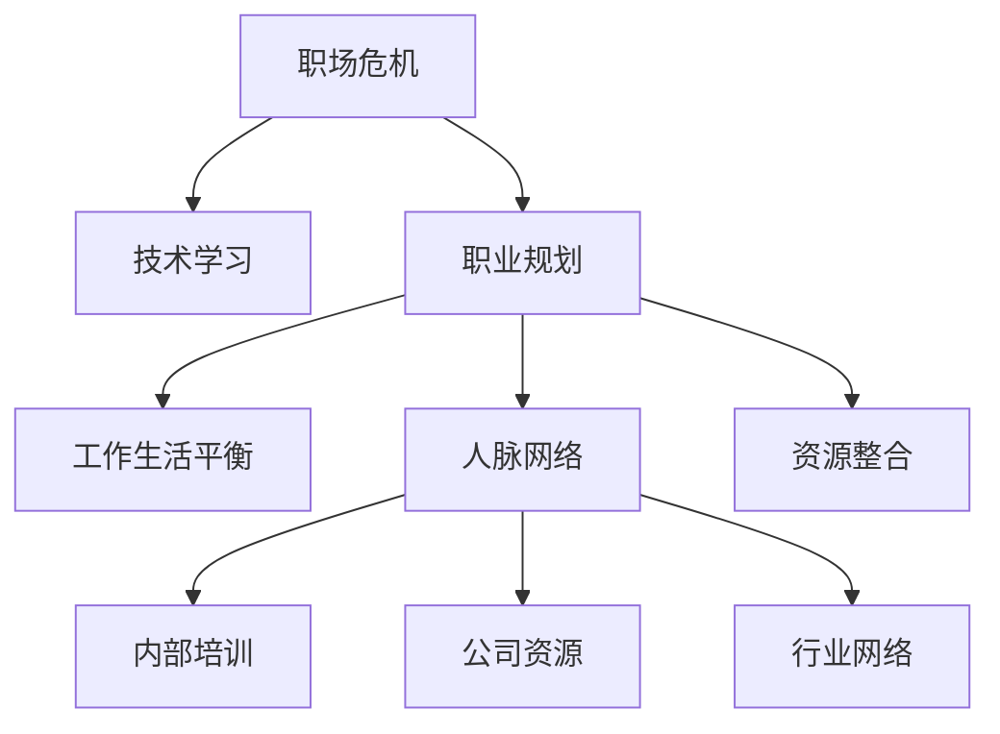

                 

# 程序员如何应对中年职场危机

## 1. 背景介绍

在快速变化的技术行业，每个程序员都面临着职场危机的挑战。尤其是中年程序员，既要应对技术日新月异的变化，又要面临家庭和职业的双重压力。本文将深入探讨中年程序员如何应对职场危机，提出一系列行之有效的策略。

### 1.1 问题由来
随着科技行业的不断发展，新工具、新平台、新框架层出不穷。中年程序员由于长期从事特定领域的工作，可能对新技术的接受能力较弱，容易被年轻新手赶上甚至超越。此外，中年程序员往往需要承担家庭责任，工作压力更大，职业晋升机会相对较少，容易产生职业倦怠和危机感。

### 1.2 问题核心关键点
中年程序员应对职场危机的关键在于：
- 技术能力的持续更新：不断学习新技术，保持与行业发展同步。
- 职业发展的战略规划：制定清晰的发展路径，稳步提升职业竞争力。
- 工作与生活的平衡：合理安排工作与家庭时间，保持身心健康。
- 人际网络与资源整合：建立广泛的人脉关系，整合利用可用资源。

## 2. 核心概念与联系

### 2.1 核心概念概述

为更好地理解中年程序员应对职场危机的策略，本节将介绍几个密切相关的核心概念：

- 职场危机：指职业生涯中由于技术更新、职业转型、工作压力等因素导致的潜在职业风险。
- 技术学习：通过在线课程、书籍、技术社区等渠道，不断提升技术能力和知识水平。
- 职业规划：根据自身兴趣、能力、市场需求，制定长期和短期的职业目标。
- 工作生活平衡：合理安排工作时间与家庭生活，保持身心健康和家庭和谐。
- 人脉网络：通过参加技术会议、加入专业社团、参与开源项目等，建立广泛的人脉关系。
- 资源整合：利用内部培训、公司资源、行业网络等，整合提升自身竞争力。

这些核心概念之间的逻辑关系可以通过以下Mermaid流程图来展示：



这个流程图展示了一系列策略之间的相互关联：

1. 职场危机引出了技术学习、职业规划等必要措施。
2. 职业规划中的短期和长期目标，需要结合技术学习来实现。
3. 工作生活平衡是确保技术学习、职业规划可持续进行的重要保障。
4. 人脉网络是职业发展的有力支撑，资源整合则是将人脉网络转化为实际竞争力的关键。

## 3. 核心算法原理 & 具体操作步骤

### 3.1 算法原理概述

应对中年职场危机的策略，本质上是一种组合优化问题。通过不断学习和提升技术能力，制定合理的职业发展路径，实现工作与生活的平衡，建立广泛的人脉网络，整合利用可用资源，最大化提升职业竞争力。

### 3.2 算法步骤详解

以下是应对中年职场危机的详细步骤：

**Step 1: 自我评估**
- 评估当前技术水平、职业发展现状、生活状态。
- 明确自己的优势、劣势、兴趣、需求。

**Step 2: 制定学习计划**
- 根据自我评估结果，列出需要学习的新技术、新工具。
- 规划学习时间，设定具体的学习目标。

**Step 3: 学习与实践**
- 选择在线课程、书籍、视频等学习资源，系统学习新知识。
- 通过项目实践，将理论知识转化为实战经验。

**Step 4: 职业规划**
- 根据学习成果，制定职业发展路径，包括职位晋升、技术栈扩展等。
- 确定长期和短期目标，定期评估进展。

**Step 5: 工作生活平衡**
- 合理安排工作时间，保证充足休息和锻炼时间。
- 加强与家人的沟通，关注家庭生活。

**Step 6: 人脉网络建设**
- 参加行业会议、技术沙龙、开源社区等活动，扩大社交圈。
- 积极加入专业社团，建立稳固的行业关系网。

**Step 7: 资源整合**
- 利用公司内部培训、外部课程、书籍、文章等，提升专业技能。
- 整合行业资源，如专业指导、项目机会、合作伙伴等。

### 3.3 算法优缺点

应对中年职场危机的策略具有以下优点：
- 系统性：通过全面规划和执行，能够系统性地提升技术能力和职业竞争力。
- 灵活性：结合个人实际情况，灵活调整学习计划和职业路径。
- 持续性：通过定期评估和调整，确保职业发展始终保持前进方向。

同时，该策略也存在一定的局限性：
- 时间成本：需要大量的时间和精力投入。
- 资源需求：需要具备较强的学习能力和资源整合能力。
- 短期成效：短期内可能面临技术提升速度慢、职业路径不明显等问题。

尽管存在这些局限性，但就目前而言，系统性的职业发展策略仍是最为有效的方法。随着个人成长和企业发展的推进，策略的效果也将逐步显现。

### 3.4 算法应用领域

中年程序员应对职场危机的策略，不仅适用于技术领域的职业发展，同样适用于其他行业的中年人，如金融、医疗、教育等。通过系统的学习和职业规划，中年人可以更好地应对职业生涯中的各种挑战，实现持续的职业发展和个人成长。

## 4. 数学模型和公式 & 详细讲解 & 举例说明

### 4.1 数学模型构建

假设中年程序员有 $N$ 项技能，每项技能的学习成本为 $c_i$，学习效果为 $e_i$，职业晋升的机会为 $p_i$。设当前技能集合为 $S$，目标技能集合为 $T$，学习时间为 $t$，职业发展目标为 $G$。构建优化模型：

$$
\maximize \sum_{i \in T} p_i
$$

$$
subject \ to \sum_{i \in T} c_i \leq t, \quad \sum_{i \in T} e_i \geq G
$$

其中，约束条件表示学习时间和技能效果必须满足目标要求。

### 4.2 公式推导过程

对于上述优化模型，可以采用线性规划等方法求解最优解。

设 $x_i$ 为第 $i$ 项技能的权重，即学习时间分配，则目标函数和约束条件可以表示为：

$$
\maximize \sum_{i \in T} p_i x_i
$$

$$
subject \ to \sum_{i \in T} c_i x_i \leq t, \quad \sum_{i \in T} e_i x_i \geq G
$$

将 $x_i$ 转换为 $y_i$，即技能等级，则有：

$$
y_i = c_i x_i, \quad e_i = e_i x_i
$$

代入目标函数和约束条件，得到：

$$
\maximize \sum_{i \in T} p_i y_i / c_i
$$

$$
subject \ to \sum_{i \in T} y_i \leq t, \quad \sum_{i \in T} e_i y_i \geq G
$$

通过求解上述线性规划问题，可以得到最优的技能学习时间分配 $y_i$。

### 4.3 案例分析与讲解

假设一位中年程序员有 $N=3$ 项技能：编程、数据科学、项目管理。每项技能的学习成本分别为 $c_1=100$，$c_2=150$，$c_3=200$；学习效果分别为 $e_1=0.8$，$e_2=0.9$，$e_3=0.7$；职业晋升的机会分别为 $p_1=0.2$，$p_2=0.3$，$p_3=0.1$。当前技能集合为 $S=\{1,2\}$，目标技能集合为 $T=\{1,3\}$，学习时间为 $t=1000$，职业发展目标为 $G=1.0$。

构建上述优化模型，求解得到最优技能学习时间分配 $y_1=800$，$y_3=200$。这意味着该程序员应该重点学习编程和项目管理技能，而放弃数据科学技能。

## 5. 项目实践：代码实例和详细解释说明

### 5.1 开发环境搭建

在进行职业发展策略的编程实现前，我们需要准备好开发环境。以下是使用Python进行项目实践的环境配置流程：

1. 安装Anaconda：从官网下载并安装Anaconda，用于创建独立的Python环境。

2. 创建并激活虚拟环境：
```bash
conda create -n career-env python=3.8 
conda activate career-env
```

3. 安装必要的Python库：
```bash
pip install numpy pandas matplotlib requests
```

4. 安装可视化工具：
```bash
pip install matplotlib seaborn
```

5. 安装数据分析工具：
```bash
pip install pandas-profiling
```

完成上述步骤后，即可在`career-env`环境中开始项目实践。

### 5.2 源代码详细实现

接下来，我们将使用Python实现一个简单的职业规划工具，用于帮助程序员制定学习计划。

```python
import numpy as np
import pandas as pd

# 技能和数据
skills = ['编程', '数据科学', '项目管理']
costs = [100, 150, 200]
effects = [0.8, 0.9, 0.7]
promotions = [0.2, 0.3, 0.1]
target = 1.0
total_cost = sum(costs)

# 构建目标函数和约束条件
objective = np.array([promotions[i] / costs[i] for i in range(len(skills))])
constraints = {
    'sum': (np.array([costs[i] for i in range(len(skills))]), total_cost),
    'effect': (np.array([effects[i] for i in range(len(skills))]), target)
}

# 求解最优解
x = np.optimize.minimize(lambda x: -objective.dot(x), x0=np.ones(len(skills)), constraints=constraints)
print('最优学习时间分配:', x.x)
```

在这个代码中，我们使用了NumPy库中的`optimize.minimize`函数求解线性规划问题。通过设定目标函数和约束条件，计算出最优的技能学习时间分配。

### 5.3 代码解读与分析

让我们再详细解读一下关键代码的实现细节：

**技能和数据定义**：
- `skills`：定义技能列表。
- `costs`、`effects`、`promotions`：定义每项技能的学习成本、学习效果、职业晋升机会。
- `target`：定义职业发展目标。
- `total_cost`：计算技能集合的总学习成本。

**目标函数和约束条件**：
- `objective`：根据职业晋升机会和技能成本，构建目标函数。
- `constraints`：定义学习时间和技能效果的约束条件。

**求解最优解**：
- `x`：使用`minimize`函数求解线性规划问题，得到最优的技能学习时间分配。

## 6. 实际应用场景

### 6.1 软件开发项目管理

在软件开发项目中，一位中年程序员面对新项目的挑战，需要快速提升项目管理能力，以满足项目需求。

通过上述职业规划工具，该程序员可以明确当前需要提升的项目管理技能，制定详细的学习计划，并在项目实践中逐步提升能力。例如，学习敏捷开发方法、项目管理工具、团队沟通技巧等，确保项目按时完成，提升职业竞争力。

### 6.2 金融数据分析

一位金融分析师中年转型为数据科学家，需要提升数据分析能力，以适应新岗位的要求。

通过职业规划工具，该分析师可以评估当前数据分析技能和需求，制定学习计划，如学习Python、R语言、数据挖掘算法等。同时，利用公司内部的数据集和案例，通过实际项目进行技能提升，逐步成为一名优秀的数据科学家。

### 6.3 教育培训

一位教育培训师希望转型为软件开发工程师，需要提升编程技能。

通过职业规划工具，该培训师可以明确当前需要学习的编程技能，如Python、Java、数据库管理等。制定详细的学习计划，通过在线课程、实战项目等方式提升技能。同时，整合利用教育培训机构、公司内部培训等资源，确保学习效果最大化。

### 6.4 未来应用展望

随着技术的不断进步，职业规划工具也将更加智能化和个性化。结合大数据、AI技术，可以实现自动化的职业路径规划、技能推荐等功能，更好地帮助程序员应对职场危机。

未来的职业规划工具还可能引入智能导师、职业顾问等角色，提供一对一的职业发展指导，提升职业规划的科学性和实效性。此外，通过多领域合作，职业规划工具还可以与其他行业的人才发展工具进行整合，提供更全面的职业发展建议。

## 7. 工具和资源推荐

### 7.1 学习资源推荐

为帮助程序员系统掌握职业规划和技能提升的理论基础，这里推荐一些优质的学习资源：

1. 《深入浅出职业规划》系列博文：由职业规划专家撰写，介绍职业发展的各个阶段和关键策略。

2. Coursera《职业发展规划与转型》课程：由知名高校开设的职业发展课程，涵盖职业规划、技能提升、面试技巧等内容。

3. 《程序员的职业发展和转型之路》书籍：详细介绍了程序员在不同职业阶段需要掌握的技能和资源。

4. LinkedIn Learning：提供丰富多样的职业发展课程，涵盖技术、管理、人际网络等多个领域。

5. Stack Overflow Career Advice：Stack Overflow官方提供的职业建议和资源，包括面试准备、简历优化等。

通过这些资源的学习实践，相信你一定能够系统掌握职业规划和技能提升的精髓，为未来的职业生涯打下坚实的基础。

### 7.2 开发工具推荐

高效的开发离不开优秀的工具支持。以下是几款用于职业规划和技能提升开发的常用工具：

1. Jupyter Notebook：用于编写和执行Python代码，支持动态可视化，方便调试和记录。

2. GitHub：提供代码版本控制、协作开发功能，适合团队合作和开源项目。

3. Trello：项目管理工具，可以帮助团队高效协作，追踪任务进度。

4. Slack：实时沟通工具，适合远程团队沟通和协作。

5. Zoom：视频会议工具，方便远程面试和项目讨论。

合理利用这些工具，可以显著提升职业规划和技能提升的效率，加快创新迭代的步伐。

### 7.3 相关论文推荐

职业规划和技能提升的研究源于学界的持续研究。以下是几篇奠基性的相关论文，推荐阅读：

1. 《技能矩阵与职业发展路径》：提出技能矩阵模型，帮助职业发展者系统评估和规划技能提升路径。

2. 《终身学习与职业发展》：探讨终身学习在职业发展中的重要性，提出多样化的学习策略。

3. 《基于数据驱动的职业规划模型》：利用大数据和AI技术，实现自动化的职业路径规划和技能推荐。

4. 《程序员的职业转型与技能提升》：介绍程序员在不同职业阶段需要掌握的技能和资源，提出系统化的职业发展策略。

5. 《职场危机与应对策略》：探讨职场危机的原因和应对策略，提出全面提升职业竞争力的措施。

这些论文代表了大语言模型微调技术的发展脉络。通过学习这些前沿成果，可以帮助研究者把握学科前进方向，激发更多的创新灵感。

## 8. 总结：未来发展趋势与挑战

### 8.1 总结

本文对中年程序员应对职场危机的策略进行了全面系统的介绍。首先阐述了职场危机的背景和核心关键点，明确了技术学习、职业规划、工作生活平衡、人脉网络与资源整合的重要性。其次，从原理到实践，详细讲解了职业规划的数学模型和具体操作步骤，给出了职业规划工具的代码实现。同时，本文还广泛探讨了职业规划在软件开发、金融数据分析、教育培训等多个领域的应用前景，展示了职业规划的广泛适用性。最后，本文精选了职业规划的工具和资源，力求为读者提供全方位的技术指引。

通过本文的系统梳理，可以看到，职业规划和技能提升策略为程序员应对中年职场危机提供了系统化的解决方案。这些策略不仅适用于技术领域的职业发展，也适用于其他行业的中年人，帮助他们在职业生涯中实现持续成长。

### 8.2 未来发展趋势

展望未来，职业规划和技能提升技术将呈现以下几个发展趋势：

1. 智能化与个性化：借助AI和大数据技术，实现智能化的职业规划和技能推荐，个性化满足不同人群的职业需求。
2. 全面性与多样性：覆盖更多职业领域，提供全面化的职业发展指导和技能提升方案，帮助不同背景的职场人士实现全面成长。
3. 动态性与适应性：能够动态调整职业规划和学习计划，根据外部环境变化和个体需求进行灵活调整。
4. 社会化与合作化：促进职业人士之间的交流和合作，形成广泛的社会网络和资源共享机制，推动职业发展共同进步。
5. 技术化与集成化：与其他技术工具和平台进行深度集成，提供一体化的职业发展解决方案，提升工作效率和效果。

以上趋势凸显了职业规划和技能提升技术的广阔前景。这些方向的探索发展，必将进一步提升职业规划的精准性和实效性，帮助更多职场人士实现职业发展目标。

### 8.3 面临的挑战

尽管职业规划和技能提升技术已经取得了显著成果，但在迈向更加智能化、全面化的应用过程中，仍面临诸多挑战：

1. 数据隐私与安全：在职业规划中，需要收集和分析大量的个人信息，如何保护用户隐私，确保数据安全，是一大难题。
2. 技术适应性：不同行业和岗位的需求差异较大，如何开发适应性强、灵活性高的职业规划工具，是一大挑战。
3. 用户参与度：用户是否愿意积极参与职业规划，并持续更新个人信息，直接影响职业规划工具的成效。
4. 技术接受度：部分中年职场人士可能对新技术持保守态度，如何提升技术接受度，引导其积极应用，是另一大挑战。
5. 数据质量与完整性：职业规划工具需要依赖高质量、完整的数据，如何确保数据源的可靠性，是一大难题。

这些挑战需要职业规划技术在数据隐私、技术适应性、用户参与度等方面不断优化，才能更好地服务于职场人士。

### 8.4 研究展望

面对职业规划和技能提升所面临的挑战，未来的研究需要在以下几个方面寻求新的突破：

1. 数据隐私与安全：采用数据加密、匿名化等技术，保护用户隐私，确保数据安全。

2. 技术适应性：开发适应性强、灵活性高的职业规划工具，覆盖更多职业领域，满足不同岗位的需求。

3. 用户参与度：采用智能推送、个性化推荐等机制，提高用户参与度和粘性。

4. 技术接受度：通过技术普及教育、用户反馈机制等方式，提升技术接受度，引导用户积极应用。

5. 数据质量与完整性：建立高质量的数据收集和整合机制，确保数据源的可靠性。

这些研究方向的探索，必将引领职业规划和技能提升技术迈向更高的台阶，为职场人士提供更加智能、全面、高效的职业发展指导。面向未来，职业规划和技能提升技术还需要与其他人工智能技术进行更深入的融合，共同推动自然语言理解和智能交互系统的进步。只有勇于创新、敢于突破，才能不断拓展职业规划的边界，让职业发展技术更好地造福职场人士。

## 9. 附录：常见问题与解答

**Q1：职业规划工具如何确保数据隐私与安全？**

A: 职业规划工具应采用数据加密、匿名化等技术，确保用户数据的隐私和安全。例如，使用AES加密算法对用户数据进行加密，使用数据匿名化技术对敏感信息进行处理，避免数据泄露。

**Q2：如何选择适合自己的职业规划工具？**

A: 选择适合自己的职业规划工具，需要考虑以下几个因素：
1. 功能与适用性：选择功能全面、适用性强的工具，覆盖自身职业发展的各个方面。
2. 用户体验：选择界面友好、操作简单的工具，提升使用体验。
3. 技术支持：选择技术成熟、更新频繁的工具，确保其可靠性和实用性。
4. 社区与资源：选择有活跃社区和丰富资源的工具，方便获取帮助和资源。

**Q3：如何在短时间内提升技术技能？**

A: 在短时间内提升技术技能，可以采取以下方法：
1. 系统学习：选择与目标技能相关的课程，系统学习理论知识。
2. 项目实践：通过实际项目进行实践，提升技能水平。
3. 高效学习：利用在线课程、书籍、博客等资源，快速学习新知识。
4. 社区交流：参加技术社区、论坛等，与其他技术人员交流经验。

**Q4：如何平衡工作与生活？**

A: 平衡工作与生活，需要合理安排时间，并关注身心健康。具体方法包括：
1. 制定工作计划：合理规划每天的工作任务和时间，避免加班和过度劳累。
2. 定期休息：定期休息和锻炼，保持身体健康。
3. 家庭优先：安排充足的家庭时间，关注家人的需求和感受。
4. 培养兴趣爱好：培养和维护兴趣爱好，提升生活幸福感。

---

作者：禅与计算机程序设计艺术 / Zen and the Art of Computer Programming

