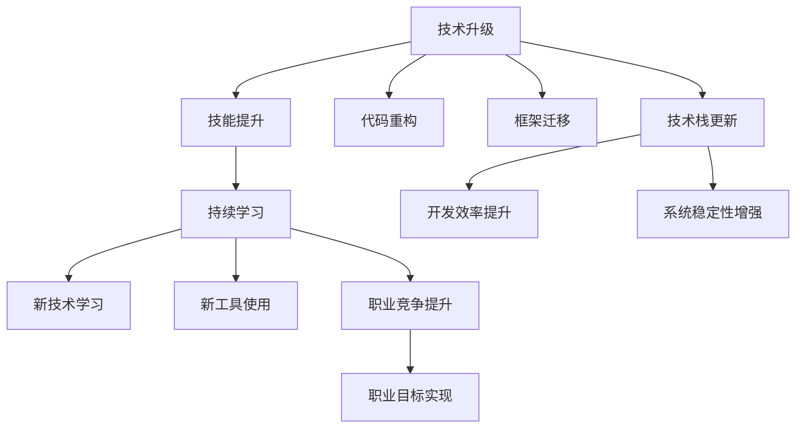

                 

# 程序员如何应对技术升级与变更

> 关键词：技术升级, 技术变更, 技能提升, 持续学习, 适应性, 职业发展, 技术栈, 代码重构

## 1. 背景介绍

随着信息技术的高速发展，程序员所面临的技术环境不断变化，新技术层出不穷，老旧技术逐渐被淘汰。在这样的背景下，程序员必须不断学习新知识，更新旧知识，以适应行业的发展趋势。然而，技术升级与变更的过程往往充满挑战，包括学习成本高、技术栈复杂、工作量增大等问题。本文将探讨如何有效应对技术升级与变更，帮助程序员在不断变化的技术环境中保持竞争力。

## 2. 核心概念与联系

### 2.1 核心概念概述

为更好地理解如何应对技术升级与变更，本节将介绍几个关键概念：

- **技术升级**：指将旧有的技术或工具更新为更高效、更稳定的新版本。这可能涉及代码重构、框架迁移等。
- **技术变更**：指引入全新的技术或工具，以实现更先进的功能或性能。这可能包括学习新的编程语言、使用新型的数据库、引入新的开发工具等。
- **技能提升**：通过学习和实践，掌握新技能或加深对已有技能的理解，以应对技术升级和变更。
- **持续学习**：在职业生涯中不断学习新技术、新知识，以适应技术和市场变化。
- **适应性**：在面对技术变化时，快速调整自己的知识和技能，以适应新的技术环境。
- **职业发展**：在技术升级和变更的驱动下，通过不断学习和实践，提升个人职业竞争力，实现职业目标。

### 2.2 核心概念原理和架构的 Mermaid 流程图



这个流程图展示了技术升级、技术变更与技能提升、持续学习、职业发展之间的逻辑关系：

1. **技术升级**可能涉及代码重构、框架迁移、技术栈更新等。
2. **技术变更**可能通过学习新技术、引入新工具来实现。
3. **技能提升**是技术升级和变更的直接结果，也是持续学习和职业发展的驱动力。
4. **持续学习**帮助程序员适应新技术，学习新工具，提升职业竞争力。
5. **职业发展**是技能提升和持续学习的最终目标，实现职业目标需要不断适应技术和市场的变化。

## 3. 核心算法原理 & 具体操作步骤

### 3.1 算法原理概述

应对技术升级与变更的核心在于适应性和学习性。程序员需要具备快速适应新环境的能力，并且不断学习新知识，以保持自己的竞争力。在实际工作中，这通常涉及以下几个步骤：

1. **评估技术变化**：识别出需要升级或变更的技术，评估其对当前项目和团队的影响。
2. **制定学习计划**：根据技术变化，制定学习新技能、新工具的计划，确保时间和资源投入。
3. **实践技能提升**：通过实际项目或练习，将新技能应用到实际工作中。
4. **评估学习效果**：评估新技能的应用效果，确保其能够带来实际价值。
5. **持续跟进技术发展**：保持对技术趋势的关注，不断更新自己的知识库。

### 3.2 算法步骤详解

#### 3.2.1 评估技术变化

1. **识别影响**：分析技术变化对当前项目的影响，包括代码、系统架构、团队协作等方面。
2. **了解新特性**：研究新技术的特性、优势和劣势，评估其适用性。
3. **制定评估标准**：确定技术变更的评估标准，如性能提升、成本节约、安全性增强等。

#### 3.2.2 制定学习计划

1. **确定学习目标**：明确需要掌握的新技能和新工具，设置学习目标和时间表。
2. **选择学习资源**：根据学习目标，选择合适的学习资源，如官方文档、在线课程、书籍等。
3. **安排学习时间**：合理分配时间，确保不影响日常工作。

#### 3.2.3 实践技能提升

1. **小范围试点**：在项目中引入新技术或工具，进行小范围试点，验证其可行性和效果。
2. **全员培训**：对团队进行培训，确保所有成员都能掌握新技术或工具。
3. **逐步推广**：根据试点结果，逐步推广新技术或工具，确保平稳过渡。

#### 3.2.4 评估学习效果

1. **性能对比**：比较新技术或工具使用前后的性能指标，如代码运行速度、内存占用等。
2. **用户体验**：收集用户反馈，了解新技术或工具对用户体验的影响。
3. **成本效益**：评估新技术或工具带来的成本节约和收益。

#### 3.2.5 持续跟进技术发展

1. **关注技术社区**：加入技术社区，了解最新的技术趋势和研究成果。
2. **参加技术会议**：参加行业会议，与同行交流，学习最新技术。
3. **持续学习**：定期更新自己的知识库，保持技术敏感度。

### 3.3 算法优缺点

#### 3.3.1 优点

1. **提高生产力**：新技术和新工具往往能带来更高的生产力和效率。
2. **提升竞争力**：持续学习和技能提升能增强个人的职业竞争力。
3. **应对变化**：通过评估和适应技术变化，降低项目风险。

#### 3.3.2 缺点

1. **学习成本高**：新技术和新工具的引入可能涉及大量的学习成本。
2. **技术栈复杂**：新旧技术混合使用可能增加技术栈的复杂度。
3. **工作量增大**：技术升级和变更可能带来额外的工作量。

### 3.4 算法应用领域

#### 3.4.1 软件开发

在软件开发领域，技术升级和变更无处不在。程序员需要不断学习新的编程语言、框架和工具，以提升开发效率和代码质量。例如，从Java迁移到Kotlin、从Node.js迁移到Deno等。

#### 3.4.2 数据分析

数据分析领域的技术升级和变更也非常频繁。程序员需要掌握新的数据处理工具，如Apache Spark、Dask等，以及新的数据可视化工具，如Tableau、Power BI等。

#### 3.4.3 云计算

云计算技术的快速发展，使得云计算平台和工具层出不穷。程序员需要掌握AWS、Azure、Google Cloud等平台的最新功能和最佳实践。

#### 3.4.4 人工智能与机器学习

AI和ML领域的技术更新更是日新月异。程序员需要学习新的算法和模型，如Transformer、BERT、GPT等，以及新的框架和库，如TensorFlow、PyTorch等。

## 4. 数学模型和公式 & 详细讲解 & 举例说明

### 4.1 数学模型构建

#### 4.1.1 数学模型构建

在技术升级和变更的背景下，我们可以构建一个简单的数学模型来评估新技术的引入对系统性能的影响。假设有一个旧系统，其性能为 $P_0$，引入新技术后，系统的性能提升为 $P_1$。设新技术引入的成本为 $C$，则总效益 $E$ 可以表示为：

$$
E = P_1 - P_0 - C
$$

#### 4.1.2 公式推导过程

根据上述模型，我们可以通过简单的计算，评估引入新技术的效益：

1. **计算性能提升**：
$$
\Delta P = P_1 - P_0
$$
2. **计算总效益**：
$$
E = \Delta P - C
$$

#### 4.1.3 案例分析与讲解

以Node.js迁移到Deno为例：

- **旧系统性能**：假设旧系统的性能为 $P_0 = 0.8$。
- **新技术性能**：假设引入Deno后，系统的性能提升为 $P_1 = 0.95$。
- **引入成本**：假设引入Deno的成本为 $C = 1000$。

根据上述模型，计算总效益：

$$
E = (0.95 - 0.8) - 1000 = 0.15 - 1000 = -998.85
$$

该案例中，由于性能提升带来的效益不足以覆盖引入新技术的成本，因此需要综合考虑其他因素，如开发难度、学习成本、稳定性等，进行全面的评估。

### 4.2 公式推导过程

$$
\Delta P = 0.95 - 0.8 = 0.15
$$

$$
E = 0.15 - 1000 = -998.85
$$

## 5. 项目实践：代码实例和详细解释说明

### 5.1 开发环境搭建

#### 5.1.1 开发环境搭建

1. **安装开发环境**：
```bash
conda create -n py3k python=3.8
conda activate py3k
```

2. **安装开发工具**：
```bash
pip install flake8 black pre-commit
```

3. **安装版本控制工具**：
```bash
git clone https://github.com/example/project.git
cd project
git checkout main
git pull
```

### 5.2 源代码详细实现

#### 5.2.1 源代码详细实现

```python
import flask
from flask import Flask, request

app = Flask(__name__)

@app.route('/hello')
def hello():
    name = request.args.get('name')
    return f'Hello, {name}!'

if __name__ == '__main__':
    app.run(debug=True)
```

#### 5.2.2 代码解读与分析

1. **Flask框架**：使用Flask框架，快速搭建一个简单的HTTP服务。
2. **路由**：定义一个路由，处理HTTP请求。
3. **参数处理**：从HTTP请求中获取参数，进行简单的字符串处理。

### 5.3 运行结果展示

#### 5.3.1 运行结果展示

启动应用后，在浏览器中访问 `http://localhost:5000/hello?name=world`，返回结果为：

```
Hello, world!
```

## 6. 实际应用场景

### 6.1 软件开发

在软件开发领域，技术升级和变更经常发生。例如，从Java迁移到Kotlin：

1. **评估影响**：评估迁移对当前项目的影响，包括代码结构、库依赖、工具链等。
2. **制定计划**：制定迁移计划，包括逐步替换、分阶段迁移等。
3. **实践应用**：逐步替换Java代码，引入Kotlin代码，进行小范围试点。
4. **评估效果**：评估迁移后的性能、稳定性和兼容性。

### 6.2 数据分析

数据分析领域的技术升级和变更也很常见。例如，从Python 3迁移到Python 3.8：

1. **评估影响**：评估迁移到Python 3.8对数据处理流程的影响。
2. **制定计划**：制定迁移计划，包括更新依赖、工具链等。
3. **实践应用**：逐步更新代码，进行小范围试点。
4. **评估效果**：评估迁移后的性能、稳定性和兼容性。

### 6.3 云计算

云计算平台和工具的升级和变更也非常频繁。例如，从AWS迁移到Azure：

1. **评估影响**：评估迁移到Azure对云资源、应用架构的影响。
2. **制定计划**：制定迁移计划，包括云资源配置、应用迁移等。
3. **实践应用**：逐步迁移应用到Azure，进行小范围试点。
4. **评估效果**：评估迁移后的性能、稳定性和成本效益。

### 6.4 人工智能与机器学习

AI和ML领域的技术更新更是日新月异。例如，从TensorFlow迁移到PyTorch：

1. **评估影响**：评估迁移到PyTorch对模型性能、开发效率的影响。
2. **制定计划**：制定迁移计划，包括模型重构、工具链更新等。
3. **实践应用**：逐步迁移模型到PyTorch，进行小范围试点。
4. **评估效果**：评估迁移后的性能、稳定性和兼容性。

## 7. 工具和资源推荐

### 7.1 学习资源推荐

1. **Flask官方文档**：官方文档提供了详细的API文档和开发指南，是学习和实践Flask框架的重要资源。
2. **Python官方文档**：官方文档提供了Python语言的全面介绍和示例代码，是学习Python的重要资源。
3. **Deno官方文档**：官方文档提供了Deno语言的全面介绍和示例代码，是学习和实践Deno的重要资源。
4. **AWS官方文档**：官方文档提供了AWS云服务的全面介绍和操作指南，是学习和实践AWS的重要资源。
5. **Azure官方文档**：官方文档提供了Azure云服务的全面介绍和操作指南，是学习和实践Azure的重要资源。
6. **TensorFlow官方文档**：官方文档提供了TensorFlow框架的全面介绍和操作指南，是学习和实践TensorFlow的重要资源。
7. **PyTorch官方文档**：官方文档提供了PyTorch框架的全面介绍和操作指南，是学习和实践PyTorch的重要资源。

### 7.2 开发工具推荐

1. **Visual Studio Code**：一个轻量级、高效、功能强大的代码编辑器，支持多种编程语言和开发框架。
2. **Git**：版本控制工具，支持分布式版本控制，是开发协作的重要工具。
3. **Docker**：容器化工具，支持跨平台部署和运维，是软件开发的重要工具。
4. **JIRA**：项目管理工具，支持敏捷开发和团队协作，是软件开发的重要工具。
5. **Slack**：团队协作工具，支持即时通信和任务管理，是软件开发的重要工具。

### 7.3 相关论文推荐

1. **《软件升级：理论与实践》**：深入探讨了软件升级的理论与实践，提供了大量案例和最佳实践。
2. **《云计算技术发展趋势》**：分析了云计算技术的发展趋势，探讨了云计算平台和工具的未来方向。
3. **《人工智能技术发展现状》**：分析了人工智能技术的发展现状，探讨了AI和ML的未来方向。

## 8. 总结：未来发展趋势与挑战

### 8.1 研究成果总结

本文详细探讨了技术升级与变更的应对策略，帮助程序员在不断变化的技术环境中保持竞争力。通过评估技术变化、制定学习计划、实践技能提升、评估学习效果和持续跟进技术发展等步骤，程序员可以更好地应对技术升级与变更的挑战。

### 8.2 未来发展趋势

未来，技术升级和变更的频率将进一步增加，技术栈将更加复杂。程序员需要不断学习新知识，掌握新技能，以保持竞争力。同时，技术社区和学术界也将不断推出新技术和工具，推动技术进步。

### 8.3 面临的挑战

技术升级和变更的过程中，程序员将面临学习成本高、技术栈复杂、工作量增大等问题。如何在保持生产力的同时，进行有效学习和技能提升，将是一大挑战。

### 8.4 研究展望

未来的研究将集中在以下几个方面：

1. **自动化学习工具**：开发自动化学习工具，帮助程序员更高效地掌握新技术。
2. **持续学习平台**：构建持续学习平台，提供高质量的学习资源和课程，支持程序员不断学习新知识。
3. **技能评估系统**：开发技能评估系统，帮助程序员评估和提升自身技能，以适应技术升级和变更。
4. **技术迁移工具**：开发技术迁移工具，帮助程序员更平滑地进行技术升级和变更。

总之，技术升级和变更是程序员职业生涯中不可避免的挑战，但也是提升职业竞争力和技术水平的重要机遇。通过不断学习和实践，程序员可以更好地应对技术变化，保持自身的竞争力。

## 9. 附录：常见问题与解答

**Q1：如何评估新技术的引入对系统的影响？**

A: 评估新技术的引入对系统的影响，可以从以下几个方面考虑：
1. **性能影响**：评估新技术对系统性能的影响，包括响应时间、吞吐量、资源占用等。
2. **稳定性影响**：评估新技术对系统稳定性的影响，包括崩溃率、错误率、故障率等。
3. **成本影响**：评估新技术引入的成本，包括迁移成本、学习成本、部署成本等。

**Q2：技术升级和变更如何影响团队协作？**

A: 技术升级和变更可能会对团队协作带来影响，主要体现在以下几个方面：
1. **学习曲线**：新技术的引入可能增加团队成员的学习成本，需要更多时间和精力进行培训。
2. **协作效率**：新技术的引入可能会改变协作方式和工具链，影响团队的协作效率。
3. **沟通成本**：新技术的引入可能增加沟通成本，需要更多的沟通和协调。

**Q3：技术升级和变更如何影响项目进度？**

A: 技术升级和变更可能会影响项目进度，主要体现在以下几个方面：
1. **项目延期**：新技术的引入和迁移可能需要额外的时间和资源，导致项目延期。
2. **风险增加**：新技术的引入和迁移可能增加项目风险，需要更多的风险评估和控制。
3. **需求变更**：新技术的引入和迁移可能导致项目需求变更，需要重新评估和调整项目计划。

**Q4：如何应对技术升级和变更带来的挑战？**

A: 应对技术升级和变更带来的挑战，可以从以下几个方面考虑：
1. **评估和规划**：评估技术变化对项目的影响，制定详细的迁移和升级计划。
2. **团队协作**：加强团队协作，提高团队成员的学习能力和沟通能力。
3. **持续学习**：不断学习和实践新技术，保持自身的竞争力。
4. **风险控制**：评估和控制技术升级和变更带来的风险，确保项目顺利推进。

总之，技术升级和变更是不可避免的，但通过有效的评估和规划、团队协作、持续学习和风险控制，程序员可以更好地应对这些挑战，保持自身的竞争力。

---

作者：禅与计算机程序设计艺术 / Zen and the Art of Computer Programming

