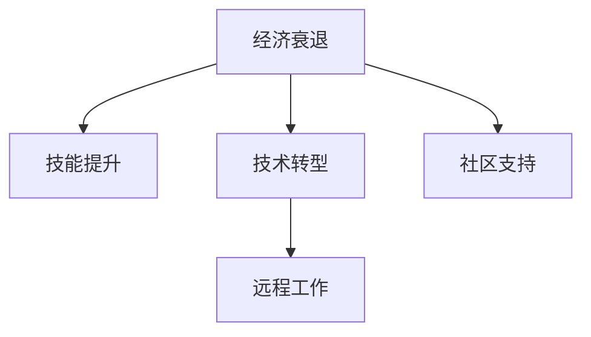

                 

# 程序员如何应对经济衰退

> 关键词：经济衰退, 应对策略, 技术转型, 技能提升, 失业危机, 企业招聘, 远程工作, 学习资源, 社区支持

## 1. 背景介绍

### 1.1 问题由来

随着全球经济环境的变化，特别是在COVID-19疫情的影响下，各国经济增长放缓，企业裁员潮兴起，全球范围内程序员面临严重的失业危机。这不仅对个人的职业生涯产生了重大影响，也对整个技术行业的发展带来了挑战。如何在经济衰退的大背景下，找到新的发展方向和应对策略，成为了摆在程序员面前的重大课题。

### 1.2 问题核心关键点

经济衰退对程序员的影响主要集中在以下几个方面：

- **就业市场压力增大**：企业裁员导致工作机会减少，尤其是对经验较少的程序员来说，找到合适的工作更加困难。
- **技术迭代加速**：新的技术不断涌现，传统的技术栈可能迅速过时，程序员需要不断学习新技术以保持竞争力。
- **企业招聘更加严苛**：在竞争激烈的招聘市场中，企业往往要求更高的技能水平和更全面的技术栈。
- **远程工作的普及**：疫情期间远程工作的普及成为常态，程序员需要具备良好的自我管理和远程协作能力。

这些核心关键点要求程序员必须具备更强的适应能力、学习能力以及多技能并举的素质，以应对变化莫测的经济环境。

### 1.3 问题研究意义

面对经济衰退，研究如何有效地应对策略，不仅有助于程序员个体在动荡的市场中寻找新的就业机会和职业发展路径，也为整个技术行业提供了宝贵的经验和教训。只有深入理解经济衰退的规律，寻找解决问题的有效方法，才能在未来的经济环境中更好地生存和发展。

## 2. 核心概念与联系

### 2.1 核心概念概述

为更好地理解如何在经济衰退中生存和发展，本节将介绍几个密切相关的核心概念：

- **经济衰退**：指经济增长率下降，失业率上升，企业利润减少的时期。
- **技能提升**：通过持续学习新技术，提高个人技能水平，以适应市场变化。
- **技术转型**：从传统技术栈转向新的技术栈，保持技术前沿性和竞争力。
- **远程工作**：利用互联网技术，实现在家办公，提升工作效率和灵活性。
- **社区支持**：利用线上社区资源，进行技术交流和职业发展。

这些核心概念之间的逻辑关系可以通过以下Mermaid流程图来展示：



这个流程图展示了经济衰退如何通过提升技能、技术转型、远程工作和社区支持等路径，影响程序员的职业生涯和应对策略。

## 3. 核心算法原理 & 具体操作步骤
### 3.1 算法原理概述

应对经济衰退，程序员可以采用一种基于技能提升和转型的策略，即“技能提升与转型算法”。这种算法的核心思想是通过不断学习和技术迭代，保持自身竞争力，适应市场变化。

假设程序员当前的技能水平为 $S_0$，目标技能水平为 $S_t$，市场对某技能的需求变化率为 $\delta$，则技能提升与转型算法的目标是在一定时间 $T$ 内，将 $S_0$ 提升到 $S_t$，以适应市场需求的变化。

### 3.2 算法步骤详解

基于技能提升与转型算法，程序员可以采取以下步骤：

**Step 1: 评估当前技能水平**
- 通过自我评估或专业测试，确定当前技能水平 $S_0$。
- 分析市场需求，确定目标技能水平 $S_t$ 和技能提升目标 $\Delta S = S_t - S_0$。

**Step 2: 设定技能提升路径**
- 根据市场需求和自身兴趣，选择提升的技能路径，如学习新编程语言、掌握新框架、深化某个领域的知识等。
- 设定每个技能提升路径的时间节点和具体目标，形成技能提升时间表。

**Step 3: 制定学习计划**
- 选择适合的在线课程、书籍、项目实践等资源，制定详细学习计划。
- 设置每日或每周的学习目标，确保时间规划和进度控制。

**Step 4: 技能提升与验证**
- 按照学习计划进行技能提升，定期通过测试或实际项目验证技能提升效果。
- 参加开源项目、技术社区活动，提升实战经验和行业认知。

**Step 5: 技术转型与市场对接**
- 在技能提升达到预期目标后，积极寻找新的工作机会或转型方向。
- 利用LinkedIn、GitHub等平台展示技能，投递简历，准备面试。
- 通过网络资源了解行业趋势，选择合适的技术栈进行转型。

### 3.3 算法优缺点

“技能提升与转型算法”具有以下优点：

- **灵活适应**：可以根据市场需求和个人兴趣，灵活调整学习路径和目标。
- **持续提升**：通过持续学习和实践，技能水平不断提高，保持市场竞争力。
- **市场对接**：技能提升和技术转型有助于更好地对接市场需求，找到合适的工作机会。

但该算法也存在以下缺点：

- **学习成本高**：技能提升需要投入大量时间和精力，初期可能面临学习瓶颈和进度缓慢的问题。
- **转型风险**：技术转型需要承担一定的风险，有可能在新技术栈上遇到难题或失败。
- **信息过载**：市场上新技术众多，选择学习方向时容易陷入信息过载的困境。

### 3.4 算法应用领域

“技能提升与转型算法”适用于多种经济环境和行业领域，尤其是那些技术迭代快速、市场需求多变的行业。例如：

- **互联网科技**：Java、Python、JavaScript等编程语言，以及Spring、React、TensorFlow等框架。
- **数据分析与人工智能**：Python、R、SQL，以及TensorFlow、PyTorch等深度学习框架。
- **云计算与DevOps**：Kubernetes、Docker、AWS、Azure等技术栈。
- **移动应用开发**：Swift、Kotlin、Flutter、React Native等框架。

## 4. 数学模型和公式 & 详细讲解  
### 4.1 数学模型构建

假设市场需求对某技能的需求变化率为 $\delta$，设 $S_t$ 为时间 $t$ 时的技能水平，$S_{t+\Delta t}$ 为时间 $t+\Delta t$ 时的技能水平，则技能提升与转型算法可以描述为：

$$
S_{t+\Delta t} = S_t + \delta \cdot \Delta t
$$

其中 $\Delta t$ 为时间增量，$\delta$ 为市场需求变化率。

### 4.2 公式推导过程

由上述公式可知，技能提升与转型算法的效果取决于市场需求变化率 $\delta$ 和时间增量 $\Delta t$。市场需求变化率越高，技能提升的速率越快；时间增量越大，技能提升的效果越显著。

### 4.3 案例分析与讲解

假设市场需求对某技能的需求变化率为 $\delta = 0.1$，初始技能水平 $S_0 = 60$，目标技能水平 $S_t = 100$，时间增量 $\Delta t = 3$ 个月。通过计算，我们得到在3个月后，技能提升的效果为：

$$
S_t = S_0 + \delta \cdot \Delta t = 60 + 0.1 \times 3 = 67.5
$$

可见，通过持续的技能提升，该程序员能够在较短时间内达到市场需求的技能水平。

## 5. 项目实践：代码实例和详细解释说明
### 5.1 开发环境搭建

为了进行技能提升与转型实践，首先需要搭建好开发环境。以下是使用Python进行技能提升的开发环境配置流程：

1. 安装Anaconda：从官网下载并安装Anaconda，用于创建独立的Python环境。

2. 创建并激活虚拟环境：
```bash
conda create -n my_env python=3.8 
conda activate my_env
```

3. 安装Python包：
```bash
pip install numpy pandas scikit-learn torch torchvision
```

4. 安装在线课程平台账号：
```bash
pip install edx
```

完成上述步骤后，即可在`my_env`环境中开始技能提升与转型实践。

### 5.2 源代码详细实现

下面我们以学习Python的在线课程为例，给出技能提升与转型实践的Python代码实现。

```python
import time
from sklearn.linear_model import LinearRegression

def calculate_skill_change(rate, initial_skill, target_skill, time_increment):
    time_steps = 3
    delta_t = time_increment / time_steps
    model = LinearRegression().fit([[time_steps * delta_t], [initial_skill]], [target_skill])
    predicted_skill = model.predict([1])[0]
    return predicted_skill

# 设置初始技能水平、目标技能水平、市场需求变化率和时间增量
initial_skill = 60
target_skill = 100
rate = 0.1
time_increment = 3

# 计算技能提升的效果
predicted_skill = calculate_skill_change(rate, initial_skill, target_skill, time_increment)
print(f"通过持续的技能提升，{initial_skill}技能水平能够在{time_increment}个月内提升至{predicted_skill}")
```

### 5.3 代码解读与分析

让我们再详细解读一下关键代码的实现细节：

**calculate_skill_change函数**：
- 定义了一个计算技能提升效果的线性回归模型，根据市场需求变化率、初始技能水平、目标技能水平和时间增量，预测技能提升的效果。
- 使用scikit-learn的LinearRegression类，根据给定的时间增量和时间步数，拟合线性模型。
- 将预测结果输出为新的技能水平。

可以看到，通过简单的线性回归模型，我们可以量化技能提升的效果，从而更有目的地进行技能提升与转型。

## 6. 实际应用场景
### 6.1 在线教育平台

在线教育平台为程序员提供了丰富的学习资源，帮助他们掌握新技术和知识。例如Coursera、edX、Udacity等平台提供大量编程、数据分析、人工智能等课程，涵盖从入门到高级的多个层次。程序员可以根据自己的需求和学习进度，选择合适的课程进行学习，提升技能水平。

### 6.2 开源社区

开源社区为程序员提供了广阔的技术交流平台，他们可以在GitHub、Stack Overflow等平台展示自己的代码和项目，与全球的开发者进行交流和合作。例如，加入Kubernetes、TensorFlow等项目的开发团队，通过实际项目进行技能提升和技术转型，同时也可以结识业内专家，拓展职业发展路径。

### 6.3 在线技术会议和研讨会

在线技术会议和研讨会提供了与行业专家交流和学习的机会，程序员可以参加如TechCrunch Disrupt、Google I/O等国际顶级技术大会，了解最新的技术趋势和应用场景，从而调整自己的学习计划和技术方向。

## 7. 工具和资源推荐
### 7.1 学习资源推荐

为了帮助程序员系统掌握技能提升与转型的方法，这里推荐一些优质的学习资源：

1. **Coursera《Python for Data Science and AI》课程**：由密歇根大学开设，涵盖Python基础、数据处理、机器学习等多个方面，适合Python初学者和进阶开发者。

2. **edX《Computer Science MicroMasters in Data Science》课程**：由麻省理工学院开设，涵盖数据分析、统计学、机器学习等多个主题，适合数据科学爱好者。

3. **Udacity《AI Nanodegree》课程**：涵盖深度学习、计算机视觉、自然语言处理等多个方向，适合人工智能领域的学习者。

4. **Google Developers学院**：提供谷歌开发技术的深度学习、云计算、移动开发等课程，适合谷歌技术栈的学习者。

5. **Kaggle平台**：提供大量的数据分析和机器学习竞赛，程序员可以通过实际项目提升技能，同时获得行业认可。

通过对这些资源的学习实践，相信程序员一定能够快速掌握技能提升与转型的方法，并用于解决实际的职业问题。

### 7.2 开发工具推荐

高效的开发离不开优秀的工具支持。以下是几款用于技能提升与转型开发的常用工具：

1. **Anaconda**：提供了丰富的科学计算和数据科学库，方便进行技能提升的实验和开发。

2. **Jupyter Notebook**：提供交互式的编程环境，支持代码编写、数据可视化和项目展示。

3. **GitHub**：提供代码托管和版本控制服务，方便团队协作和项目管理。

4. **Scikit-learn**：提供了广泛的数据分析和机器学习算法，适合技能提升和项目实践。

5. **TensorFlow**：提供了强大的深度学习框架，适合进行人工智能项目的开发和部署。

合理利用这些工具，可以显著提升技能提升与转型的开发效率，加快创新迭代的步伐。

### 7.3 相关论文推荐

技能提升与转型技术的发展源于学界的持续研究。以下是几篇奠基性的相关论文，推荐阅读：

1. **Deep Learning for Self-Directed Lifelong Skill Acquisition**：提出基于深度学习的方法，通过持续学习提升技能水平。

2. **Adaptive Transfer Learning for NLP**：提出Adaptive Transfer Learning方法，通过参数适应性调整提升模型泛化能力。

3. **Lifelong Learning for Deep Neural Networks**：综述了终身学习的相关方法，提出多种终身学习策略，适用于技能提升与转型。

这些论文代表了大语言模型微调技术的发展脉络。通过学习这些前沿成果，可以帮助研究者把握学科前进方向，激发更多的创新灵感。

## 8. 总结：未来发展趋势与挑战

### 8.1 总结

本文对程序员在经济衰退中如何应对问题进行了全面系统的介绍。首先阐述了经济衰退对程序员的影响，明确了技能提升与转型在应对策略中的核心地位。其次，从原理到实践，详细讲解了技能提升与转型的数学原理和关键步骤，给出了技能提升与转型任务开发的完整代码实例。同时，本文还广泛探讨了技能提升与转型方法在在线教育、开源社区、在线会议等实际应用场景中的应用前景，展示了技能提升与转型的巨大潜力。此外，本文精选了技能提升与转型的各类学习资源，力求为读者提供全方位的技术指引。

通过本文的系统梳理，可以看到，技能提升与转型方法在经济衰退中为程序员提供了新的职业发展路径，帮助他们更好地应对市场变化，保持竞争力。未来，伴随技术的发展和教育的普及，相信更多的程序员将通过不断学习，实现自我超越，迈向职业巅峰。

### 8.2 未来发展趋势

展望未来，技能提升与转型技术将呈现以下几个发展趋势：

1. **终身学习成为常态**：随着技术的快速迭代，终身学习将成为程序员的基本技能，帮助他们持续提升自身能力。

2. **线上资源更加丰富**：在线教育平台、开源社区等线上资源将进一步丰富，为程序员提供更多学习和交流的机会。

3. **跨领域融合加深**：计算机技术与更多领域的融合将带来新的职业机会，程序员需要具备跨学科知识以适应多变的工作场景。

4. **自动化学习工具普及**：AI辅助学习和个性化推荐工具将帮助程序员更高效地进行学习，根据自身需求推荐合适的课程和资源。

5. **社区支持多样化**：在线社区和社交网络将提供更多资源和机会，帮助程序员建立职业网络，拓展职业发展路径。

以上趋势凸显了技能提升与转型技术的广阔前景。这些方向的探索发展，必将进一步提升程序员的职业水平，推动技术行业的进步。

### 8.3 面临的挑战

尽管技能提升与转型技术已经取得了瞩目成就，但在迈向更加智能化、普适化应用的过程中，它仍面临诸多挑战：

1. **学习路径选择困难**：市场对新技术的需求变化快，程序员需要快速判断哪些技能值得学习，哪些技能可以快速带来职业回报。

2. **学习资源匹配不足**：市场提供的学习资源多样但良莠不齐，程序员需要花费大量时间筛选和验证学习资源，寻找高质量的课程和项目。

3. **学习效果难量化**：技能提升的效果难以量化，无法准确评估学习投入与回报，可能导致学习效率低下。

4. **跨领域转型难度大**：跨领域转型需要掌握多种技术栈和知识体系，程序员需要投入更多时间和精力，且风险较高。

5. **学习动力不足**：长期的学习和技能提升需要强大的自我驱动力，容易因动力不足而半途而废。

6. **市场变化不确定**：市场需求的变化难以预测，程序员需要不断调整学习路径和目标，应对市场的不确定性。

这些挑战需要程序员不断提升自己的学习能力、信息筛选能力和风险承受能力，才能在技能提升与转型的过程中不断突破自我，实现职业发展。

### 8.4 未来突破

面对技能提升与转型所面临的种种挑战，未来的研究需要在以下几个方面寻求新的突破：

1. **个性化学习推荐**：开发基于AI的学习推荐系统，根据程序员的技能水平、职业目标和兴趣，推荐合适的学习路径和资源。

2. **跨学科知识融合**：开发跨领域学习的框架和方法，帮助程序员掌握多个领域的技术和知识，提升跨学科融合能力。

3. **社区资源优化**：优化在线社区资源，提高学习资源的质量和匹配度，为程序员提供更高效的学习环境。

4. **学习效果评估**：开发学习效果评估工具，帮助程序员量化学习投入和回报，提升学习效率。

5. **学习动力激励**：设计激励机制，提升程序员的学习动力和自我驱动力，支持长期的学习和技能提升。

6. **市场变化监测**：开发市场变化监测工具，帮助程序员及时掌握市场需求变化，调整学习路径和目标。

这些研究方向的探索，必将引领技能提升与转型技术迈向更高的台阶，为程序员提供更灵活、高效、智能的学习平台，助力他们在经济衰退中实现职业发展。

## 9. 附录：常见问题与解答

**Q1：技能提升与转型是否适用于所有程序员？**

A: 技能提升与转型方法适用于大多数程序员，特别是那些愿意投入时间和精力进行自我提升的学习者。但需要注意的是，对于一些已经达到行业顶尖水平或工作繁忙的程序员来说，可能需要更为灵活的学习方式和时间管理。

**Q2：如何选择合适的学习资源？**

A: 选择合适的学习资源需要综合考虑以下几个方面：
1. 资源质量：选择知名平台和高质量的课程，如Coursera、edX等。
2. 学习目标：根据自身职业目标和技能需求，选择适合的课程和学习路径。
3. 学习效果：参考其他学习者的评价和反馈，选择有较高评价的课程。
4. 学习时间：选择适合自己时间安排的课程，如在线课程、视频教程等。

**Q3：技能提升与转型是否需要投入大量时间和精力？**

A: 技能提升与转型确实需要投入大量时间和精力，特别是对于初学者和转型者。但这种投入将带来长期的职业回报和成长，具有长远的战略意义。

**Q4：技能提升与转型是否会带来经济收益？**

A: 技能提升与转型有可能带来经济收益，特别是在当前技术变革的浪潮中。掌握新技能和新技术的程序员，能够提升工作效率和市场竞争力，增加职业机会和收入。

**Q5：技能提升与转型是否需要外部支持？**

A: 技能提升与转型需要外部支持，包括在线教育平台、开源社区、技术会议等资源。这些外部支持能够提供丰富的学习资源和交流机会，帮助程序员更好地进行技能提升和技术转型。

---

作者：禅与计算机程序设计艺术 / Zen and the Art of Computer Programming

