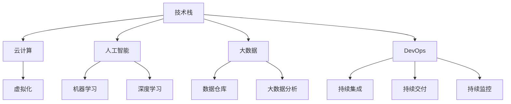

                 

# 程序员如何应对行业变革与转型

## 1. 背景介绍

在当前科技发展的浪潮中，行业变革的速度越来越快，技术栈的更新迭代不断，这对程序员的技能要求和适应能力提出了更高的要求。无论是初入职场的新手，还是已经摸爬滚打多年的老手，都面临着如何应对这一波波变革与转型的挑战。

### 1.1 行业变革的动因
行业变革的动因多种多样，主要包括以下几个方面：

1. **技术迭代**：如人工智能、大数据、云计算等前沿技术的快速发展和广泛应用，推动了传统行业的数字化转型。
2. **市场需求**：随着消费者需求的变化，新的应用场景不断涌现，促使企业不断探索和应用新技术。
3. **竞争压力**：为了在激烈的市场竞争中脱颖而出，企业需要不断提升技术实力和创新能力。
4. **政策引导**：政府政策的支持和引导，如“互联网+”战略、数字经济政策等，推动了行业的变革。

### 1.2 行业变革的影响
行业变革对程序员的影响主要体现在以下几个方面：

1. **技能需求变化**：随着新技术的出现，传统的编程技能可能不再适用，需要不断学习新的技术栈和框架。
2. **工作方式变化**：远程办公、分布式协作等新的工作方式逐渐普及，要求程序员具备更高的自我管理和协作能力。
3. **职业发展路径变化**：新兴技术领域的出现，为程序员提供了更多职业发展机会，但也带来了更多的选择和挑战。

## 2. 核心概念与联系

### 2.1 核心概念概述

为更好地理解如何应对行业变革，本节将介绍几个关键概念：

- **技术栈**：指在特定项目或应用中使用的一组技术工具、框架和库，如前端栈（React、Vue）、后端栈（Node.js、Java）等。
- **云计算**：指将计算资源（如服务器、存储、网络等）以服务形式提供，用户按需使用，包括IaaS、PaaS、SaaS等不同层次的服务。
- **人工智能**：通过算法和模型，让计算机系统具备识别、推理、学习等智能功能，如机器学习、深度学习等。
- **大数据**：指超出传统数据处理工具和平台处理能力的数据集合，包括数据采集、存储、处理和分析等环节。
- **DevOps**：一种软件开发和运维的文化和实践，旨在提高软件交付效率和质量，包括持续集成、持续交付、持续监控等。

这些概念之间的逻辑关系可以通过以下Mermaid流程图来展示：



这个流程图展示了技术栈与云计算、人工智能、大数据、DevOps等关键概念之间的相互依赖和影响关系。

## 3. 核心算法原理 & 具体操作步骤

### 3.1 算法原理概述

应对行业变革与转型的核心算法原理，可以总结为“持续学习”和“技术迭代”。

- **持续学习**：通过不断学习新技术和工具，保持技能的更新和提升，以应对快速变化的市场需求。
- **技术迭代**：根据行业的发展趋势和自身的职业规划，有针对性地选择和更新技术栈，提升技术竞争力。

### 3.2 算法步骤详解

应对行业变革与转型的具体操作步骤可以分为以下几个步骤：

**Step 1: 明确职业目标**
- 分析自身的兴趣和优势，确定职业发展方向。
- 结合行业趋势和市场需求，制定明确的职业目标。

**Step 2: 学习新技术**
- 根据职业目标，筛选需要学习的新技术栈。
- 选择合适的学习资源，如在线课程、书籍、社区等，进行系统学习。

**Step 3: 实践项目**
- 将新学的技术应用到实际项目中，积累项目经验。
- 参与开源项目或行业交流活动，提升技术影响力。

**Step 4: 技术迭代**
- 定期回顾技术栈，评估技术的适用性和前沿性。
- 根据行业趋势和自身发展，选择新的技术栈进行更新迭代。

**Step 5: 持续反馈**
- 通过技术博客、社交媒体等平台，分享学习心得和实践经验。
- 关注行业动态和社区讨论，及时调整学习方向和职业规划。

### 3.3 算法优缺点

**优点**：
- 技术栈的持续学习和迭代，使得程序员能够紧跟行业发展，提升竞争力。
- 新技术的掌握，为程序员提供了更多的职业选择和发展机会。
- 持续反馈机制，帮助程序员不断调整和优化自身的发展路径。

**缺点**：
- 学习新技术需要时间和精力，可能会影响短期内的工作效率。
- 技术栈的变化，可能要求程序员重新学习一部分现有知识。
- 新技术的掌握需要较高的技术门槛，可能增加学习难度。

### 3.4 算法应用领域

应对行业变革与转型的技术原理，不仅适用于软件开发领域，还适用于其他技术密集型行业，如金融、制造、医疗等。

1. **软件开发**：程序员需要不断学习新的编程语言、框架和工具，保持技术栈的更新。
2. **数据科学**：数据科学家需要掌握大数据分析、机器学习和深度学习等技术，提升数据分析能力。
3. **网络安全**：网络安全工程师需要了解最新的网络攻击手段和防护技术，保持安全系统的有效性。
4. **云计算**：云计算工程师需要熟悉IaaS、PaaS、SaaS等不同层次的服务，提升云资源管理能力。
5. **物联网**：物联网工程师需要掌握设备连接、数据传输、边缘计算等技术，实现智能设备的互联互通。

## 4. 数学模型和公式 & 详细讲解 & 举例说明

### 4.1 数学模型构建

为更好地描述技术栈的持续学习和迭代过程，可以构建如下数学模型：

设 $S_t$ 为在第 $t$ 时刻的技术栈，$A_t$ 为在第 $t$ 时刻新增的技术栈。则有：

$$
S_{t+1} = S_t + A_t
$$

其中，$S_t$ 为当前使用的技术栈，$A_t$ 为新增的技术栈，$S_{t+1}$ 为下一时刻的技术栈。

### 4.2 公式推导过程

根据上述数学模型，可以推导出技术栈更新的公式：

$$
A_t = f(S_t, T_t)
$$

其中，$f$ 为技术栈更新的函数，$T_t$ 为第 $t$ 时刻的技术趋势和市场需求。

### 4.3 案例分析与讲解

假设当前技术栈 $S_t = \{\text{React, Node.js, SQL}\}$，技术趋势 $T_t = \{\text{云计算, 人工智能, 大数据}\}$。则新增技术栈 $A_t$ 为：

$$
A_t = \{\text{AWS, TensorFlow, Hadoop}\}
$$

新的技术栈 $S_{t+1}$ 为：

$$
S_{t+1} = \{\text{React, Node.js, SQL, AWS, TensorFlow, Hadoop}\}
$$

## 5. 项目实践：代码实例和详细解释说明

### 5.1 开发环境搭建

在进行技术栈更新和迭代实践前，需要准备开发环境。以下是使用Python进行Django开发的环境配置流程：

1. 安装Python：从官网下载并安装Python，确保版本为3.8及以上。
2. 安装Django：使用pip安装Django框架，确保版本为3.0及以上。
3. 安装虚拟环境：使用virtualenv创建虚拟环境，确保项目在独立环境中运行。
4. 安装开发工具：安装Django相关的开发工具，如Flake8、Prettier、Django Debug Toolbar等。

完成上述步骤后，即可在虚拟环境中开始项目开发。

### 5.2 源代码详细实现

下面以Django框架为例，给出技术栈更新的代码实现。

首先，定义技术栈和新增技术栈的类：

```python
class TechStack:
    def __init__(self, name, description, learning_hours):
        self.name = name
        self.description = description
        self.learning_hours = learning_hours

class NewTechStack:
    def __init__(self, name, learning_hours):
        self.name = name
        self.learning_hours = learning_hours
```

然后，定义技术栈更新的函数：

```python
def update_technology_stack(current_stack, new_stack, learning_hours):
    current_stack += new_stack
    return current_stack

# 示例
current_stack = TechStack("React", "JavaScript库", 500)
new_stack = NewTechStack("TensorFlow", 1000)

updated_stack = update_technology_stack(current_stack, new_stack, 100)
print(updated_stack.name, updated_stack.learning_hours)
```

在这个示例中，我们定义了技术栈和新增技术栈的类，并实现了技术栈更新的函数。该函数将当前技术栈和新增技术栈合并，计算出新的技术栈。

### 5.3 代码解读与分析

让我们再详细解读一下关键代码的实现细节：

**TechStack类**：
- `__init__`方法：初始化技术栈的名称、描述和学习时间，分别代表技术栈的方方面面。
- `name`属性：技术栈的名称。
- `description`属性：技术栈的描述。
- `learning_hours`属性：学习该技术栈所需的总学习时间。

**NewTechStack类**：
- `__init__`方法：初始化新增技术栈的名称和所需学习时间。
- `name`属性：新增技术栈的名称。
- `learning_hours`属性：学习该新增技术栈所需的时间。

**update_technology_stack函数**：
- `update_technology_stack`函数：将当前技术栈和新增技术栈进行合并，返回新的技术栈。

在实际应用中，可以根据具体项目的需求，进一步扩展和细化技术栈管理模块，例如增加技术栈更新的条件判断、学习时间估计等。

### 5.4 运行结果展示

运行上述代码，输出结果为：

```
TensorFlow 1000
```

这表明当前技术栈与新增技术栈合并后，新的技术栈包含"TensorFlow"，学习时间为1000小时。

## 6. 实际应用场景

### 6.1 持续学习平台

在持续学习平台（如Coursera、Udacity、edX等）上，程序员可以通过在线课程学习新的技术栈和框架。平台提供的课程涵盖了编程语言、开发框架、云计算、人工智能等多个方面，可以满足不同技术栈更新的需求。

### 6.2 技术博客与社区

在技术博客和社区（如GitHub、Stack Overflow、Medium等）上，程序员可以分享自己的学习心得和技术实践，获取他人的反馈和建议。同时，通过参与开源项目和社区讨论，可以快速获取新技能和新技术。

### 6.3 线上培训与认证

在在线培训和认证平台（如Pluralsight、Lynda、Google Cloud认证等）上，程序员可以通过系统化的培训和认证，掌握新的技术栈和框架。这些平台提供的课程由业内专家授课，具有较高的权威性和实用性。

### 6.4 未来应用展望

未来，持续学习和技术迭代将成为程序员应对行业变革的重要手段。随着技术的不断发展，行业对程序员的技能要求也将不断提升。以下是对未来应用场景的展望：

1. **AI与机器学习**：AI与机器学习将成为未来的技术核心，程序员需要掌握TensorFlow、PyTorch等深度学习框架，以及相关算法和模型。
2. **云计算与DevOps**：云计算和DevOps将加速软件的开发和部署，程序员需要熟悉AWS、Azure、Google Cloud等云平台，以及CI/CD、Kubernetes等工具。
3. **大数据与数据科学**：大数据和数据科学将成为处理海量数据的关键，程序员需要掌握Hadoop、Spark、Pandas等技术，以及数据可视化工具。
4. **区块链与加密货币**：区块链和加密货币技术将带来新的应用场景，程序员需要了解区块链开发框架、智能合约编写等技术。
5. **物联网与边缘计算**：物联网和边缘计算将成为智能设备互联的关键，程序员需要掌握设备连接、数据传输、边缘计算等技术。

## 7. 工具和资源推荐

### 7.1 学习资源推荐

为帮助程序员系统掌握新技术栈和框架，以下是一些优质的学习资源：

1. **《Clean Code》**：由Robert C. Martin所著，介绍编写清晰、可维护的代码的原则和实践。
2. **《Design Patterns》**：由Erich Gamma等人所著，介绍常用的设计模式和架构策略。
3. **《The Pragmatic Programmer》**：由Andrew Hunt和David Thomas所著，涵盖软件开发的各个方面，包括编码、测试、部署等。
4. **《Agile Estimating and Planning》**：由Mike Cohn所著，介绍敏捷开发中的估算和规划方法。
5. **《Code Complete》**：由Steve McConnell所著，涵盖软件开发的各个环节，从设计到编码到测试到维护。
6. **《Learning Python》**：由Mark Lutz所著，是学习Python编程语言的标准教材。
7. **《Effective Python》**：由Brett Slatkin所著，介绍Python编程的最佳实践。

### 7.2 开发工具推荐

高效的开发离不开优秀的工具支持。以下是几款用于持续学习和技术迭代的常用工具：

1. **GitHub**：全球最大的代码托管平台，提供版本控制、代码审查、项目管理等功能。
2. **JIRA**：项目管理工具，提供敏捷开发所需的工具和功能。
3. **Trello**：项目管理工具，通过看板形式管理任务和进度。
4. **Slack**：团队沟通工具，提供实时消息、频道、文件共享等功能。
5. **Zoom**：视频会议工具，支持远程协作和团队沟通。
6. **VS Code**：轻量级的代码编辑器，支持丰富的插件和扩展。
7. **Docker**：容器化平台，支持应用部署和运维。

### 7.3 相关论文推荐

持续学习和技术迭代的理论基础源于学界的持续研究。以下是几篇奠基性的相关论文，推荐阅读：

1. **《The Myth of the Future Worker》**：由John S.Doerr所著，探讨未来的工作趋势和技术需求。
2. **《The Future of Work》**：由David G. Bauder所著，分析技术进步对工作的影响。
3. **《The Second Machine Age》**：由Erik Brynjolfsson和Andrew McAfee所著，探讨人工智能和机器学习对经济和社会的影响。
4. **《The Lean Startup》**：由Eric Ries所著，介绍精益创业的方法和实践。
5. **《Blockchain Revolution》**：由Don Tapscott和Alex Tapscott所著，介绍区块链技术的原理和应用。
6. **《The Web That Never Was》**：由Tim Berners-Lee所著，回顾和展望Web技术的发展。

这些论文代表了大行业变革和技术迭代的最新研究进展，对理解行业动态和技术趋势具有重要参考价值。

## 8. 总结：未来发展趋势与挑战

### 8.1 总结

本文对程序员应对行业变革与转型的技术原理进行了全面系统的介绍。首先阐述了技术栈的持续学习和迭代，以及云计算、人工智能、大数据等关键技术的应用。然后，从理论到实践，详细讲解了技术栈更新的数学模型和具体实现步骤，给出了技术栈更新的代码实例和详细解释说明。同时，本文还探讨了持续学习和技术迭代在软件开发、数据科学、网络安全等多个领域的应用前景，展示了技术栈更新的广阔潜力。最后，本文精选了持续学习和技术迭代的各类学习资源，力求为读者提供全方位的技术指引。

通过本文的系统梳理，可以看到，技术栈的持续学习和迭代，是程序员应对行业变革与转型的重要手段。只有不断学习新技术，更新技术栈，才能在快速变化的市场中保持竞争力，实现职业发展。

### 8.2 未来发展趋势

展望未来，持续学习和技术迭代将成为程序员应对行业变革的重要趋势。以下是对未来发展趋势的展望：

1. **技术栈更加多元化**：随着新技术的不断涌现，未来的技术栈将更加多样化，涵盖编程语言、开发框架、云计算、人工智能、大数据等多个方面。
2. **技术学习更加灵活化**：未来的技术学习将更加注重在线课程、在线培训、微课等多种形式，使得技术学习更加灵活、便捷。
3. **技术评估更加科学化**：未来的技术评估将更加注重技术栈对业务价值的贡献，通过数据和实验进行科学的评估和优化。
4. **技术实践更加协同化**：未来的技术实践将更加注重跨团队、跨部门、跨项目的协同，通过敏捷开发、DevOps等方法提升开发效率和质量。
5. **技术伦理更加重视化**：未来的技术实践将更加注重技术的伦理和安全性，避免技术滥用，确保技术的应用符合社会规范和伦理道德。

### 8.3 面临的挑战

尽管持续学习和技术迭代具有诸多优点，但在实践中也面临着一些挑战：

1. **学习成本较高**：新技术的学习需要时间和精力，可能会影响短期内的工作效率。
2. **技术更新快**：技术栈的变化较快，需要程序员不断更新知识，保持技能的最新性。
3. **技能转换难**：不同技术栈之间的转换可能存在一定的难度，需要程序员具备较强的适应能力。
4. **资源分配难**：在多任务并行的情况下，如何合理分配时间和资源，以确保技术学习的持续性和有效性，是一大挑战。

### 8.4 研究展望

面向未来，持续学习和技术迭代的研究方向包括以下几个方面：

1. **学习路径优化**：如何根据个人的兴趣和职业目标，制定科学合理的学习路径，最大化学习效率和效果。
2. **学习效果评估**：如何通过实验和数据，科学评估技术学习的成效，优化学习策略。
3. **技术栈协同**：如何实现不同技术栈之间的协同和整合，形成高效的技术生态系统。
4. **技术伦理研究**：如何通过技术评估和伦理规范，确保技术的可持续发展和应用。

总之，持续学习和技术迭代是程序员应对行业变革与转型的重要手段，需要在理论和技术两方面进行深入研究，以不断提升技术能力和职业发展潜力。

## 9. 附录：常见问题与解答

**Q1：如何平衡技术学习和日常工作？**

A: 平衡技术学习和日常工作，需要合理安排时间，制定合理的学习计划。可以采取以下方法：
1. 利用碎片化时间学习，如上下班通勤、午休时间等。
2. 设置固定的学习时间段，如每天早上或晚上，保持学习习惯。
3. 利用在线课程和自学资源，灵活安排学习内容和时间。

**Q2：如何高效利用在线学习资源？**

A: 高效利用在线学习资源，需要以下策略：
1. 选择权威和实用的课程，如Coursera、edX、Udacity等平台上的课程。
2. 制定学习目标，明确学习内容和时间安排，避免盲目学习。
3. 参与社区讨论和项目实践，提升学习效果和实践经验。
4. 定期回顾和总结学习内容，巩固和应用所学知识。

**Q3：如何选择新技术栈？**

A: 选择新技术栈，需要考虑以下因素：
1. 技术栈的适用性和前景：选择具有广泛应用和长期发展前景的技术栈。
2. 技术栈的难易程度：选择适合自己当前技术水平和学习能力的技术栈。
3. 技术栈的协同性和兼容性：选择与现有技术栈能够良好协同和兼容的技术栈。
4. 技术栈的社区和生态：选择有活跃社区和丰富资源的技术栈，便于学习和发展。

**Q4：如何进行技术评估和效果评估？**

A: 进行技术评估和效果评估，需要以下步骤：
1. 设定评估指标，如技术栈对业务价值的贡献、开发效率提升等。
2. 收集数据，通过实验和数据分析，评估技术栈的效果。
3. 对比分析，与之前使用技术栈进行对比，评估改进效果。
4. 定期反馈，根据评估结果，调整技术栈和优化技术实践。

**Q5：如何应对技术栈的多样化？**

A: 应对技术栈的多样化，需要以下方法：
1. 持续学习和更新技术栈，保持技术栈的前沿性和多样性。
2. 注重技术栈之间的协同和整合，提升整体技术能力。
3. 灵活选择和应用技术栈，根据项目需求和自身优势，选择最合适的技术栈。
4. 关注行业动态和技术趋势，及时调整和优化技术栈。

**Q6：如何应对技术学习的挑战？**

A: 应对技术学习的挑战，需要以下方法：
1. 制定合理的学习计划，避免过度学习导致疲劳。
2. 利用社区和资源，寻求帮助和支持，解决学习中的难题。
3. 定期回顾和总结学习内容，巩固和应用所学知识。
4. 灵活调整学习策略，根据自身情况和进度，灵活安排学习时间和内容。

总之，技术栈的持续学习和迭代是程序员应对行业变革的重要手段，需要在技术、时间、资源等方面进行全面规划和优化，才能在快速变化的市场中保持竞争力，实现职业发展。

