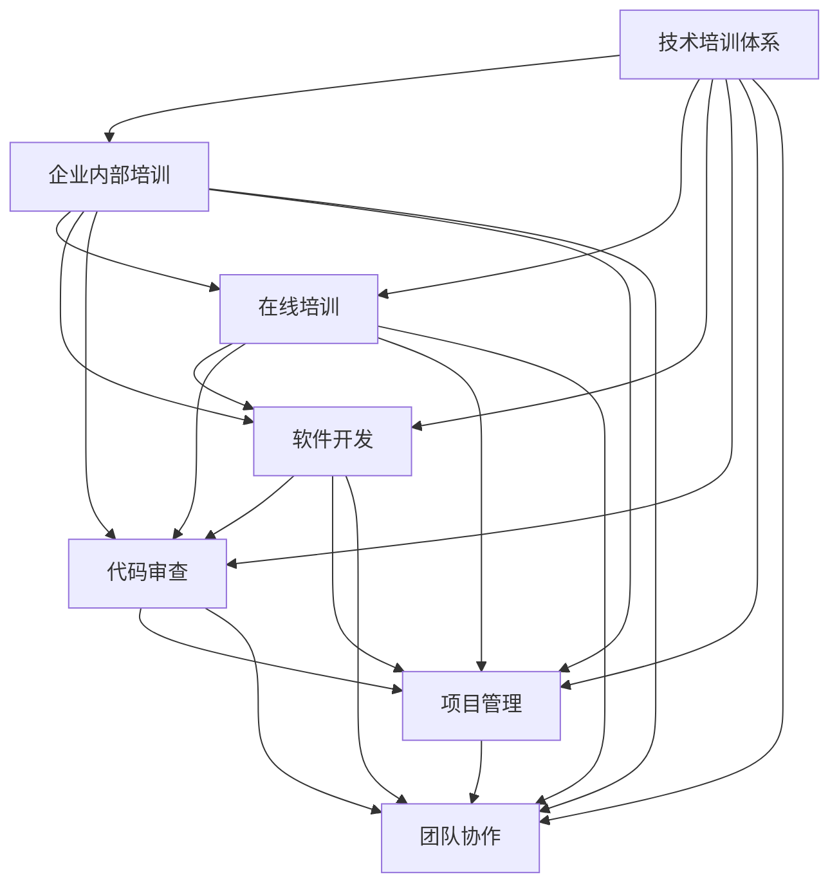

                 

# 程序员如何打造专业的技术培训体系

> 关键词：技术培训体系, 企业内部培训, 在线培训, 软件开发, 代码审查, 项目管理, 团队协作

## 1. 背景介绍

在当今数字化转型不断加速的时代，技术和市场环境的变化速度越来越快，对企业内部技术人员的持续学习和能力提升提出了更高要求。传统的线下培训模式已经无法满足日益增长的培训需求，因此，构建一个专业的技术培训体系显得尤为重要。本文将从背景介绍开始，探讨如何通过技术培训体系，有效提升企业内部技术人员的整体能力，并帮助他们在实际工作中更好地发挥作用。

## 2. 核心概念与联系

### 2.1 核心概念概述

- **技术培训体系（Technology Training System）**：指企业为提升内部技术人员的知识水平和技能，通过一系列系统的培训计划、方法和工具，帮助他们掌握最新的技术知识，增强创新能力，从而适应快速变化的市场环境。

- **企业内部培训（Internal Training）**：指企业自行组织的，以提高员工技能、知识水平为目标的培训活动。

- **在线培训（Online Training）**：通过互联网平台提供的培训课程，员工可以在任何地点、任何时间进行学习。

- **软件开发（Software Development）**：指通过编程语言和工具，设计和实现计算机软件系统的过程。

- **代码审查（Code Review）**：在软件开发过程中，通过其他开发者对代码进行检查，以提高代码质量、发现潜在问题的一种实践。

- **项目管理（Project Management）**：通过系统化的计划、执行、控制和评估，确保项目按时、按质、按预算完成的过程。

- **团队协作（Team Collaboration）**：指团队成员之间通过有效的沟通和合作，共同实现项目目标的过程。

### 2.2 核心概念原理和架构的 Mermaid 流程图



这个流程图展示了技术培训体系与企业内部培训、在线培训、软件开发、代码审查、项目管理以及团队协作之间的联系。各个核心概念互相支持，共同构成了企业内部技术培训的整体架构。

## 3. 核心算法原理 & 具体操作步骤

### 3.1 算法原理概述

技术培训体系的设计和实施，本质上是一个多变量优化问题。目标是通过优化培训内容、培训方法、培训工具等，最大化培训效果，提升企业内部技术人员的整体能力。

在这个优化问题中，我们通常需要考虑以下几个关键变量：

- **培训内容（Training Content）**：包括最新的技术趋势、最佳实践、工具使用等内容。
- **培训方法（Training Method）**：如在线学习、线下工作坊、实操练习等。
- **培训工具（Training Tools）**：如视频课程平台、代码编辑器、项目管理软件等。

我们希望通过这些变量的优化，使得培训效果最大化，即最大化培训内容的相关性、培训方法的有效性以及培训工具的易用性。

### 3.2 算法步骤详解

#### 3.2.1 需求分析

在构建技术培训体系之前，首先需要进行需求分析，明确企业内部的技术需求和培训目标。具体步骤包括：

1. **调研**：通过问卷调查、访谈等方式，了解企业内部技术人员的技术水平、学习需求和偏好。
2. **数据分析**：对收集到的数据进行分析，识别技术培训的需求热点和痛点。
3. **需求确定**：基于分析结果，确定企业内部技术培训的核心需求和目标。

#### 3.2.2 培训内容设计

根据需求分析的结果，设计具体的培训内容。这包括以下几个关键步骤：

1. **课程设计**：确定培训课程的具体内容，包括理论知识、技能培训、工具使用等。
2. **内容选择**：选择与企业内部技术需求相关的最新技术趋势和最佳实践。
3. **内容组织**：将内容组织成系统的课程体系，确保内容的逻辑性和连贯性。

#### 3.2.3 培训方法选择

根据培训内容和目标，选择合适的培训方法。这包括以下几个关键步骤：

1. **在线培训**：选择合适的在线学习平台，提供灵活的学习时间和地点。
2. **线下培训**：组织线下的培训课程、工作坊等，促进面对面交流和互动。
3. **实操练习**：通过实际项目或模拟环境，提供实践操作的机会。

#### 3.2.4 培训工具选择

根据培训内容和方法，选择合适的培训工具。这包括以下几个关键步骤：

1. **视频课程平台**：选择易于使用、资源丰富的视频课程平台。
2. **代码编辑器**：选择适合不同编程语言的代码编辑器。
3. **项目管理软件**：选择适合企业内部项目管理需求的软件。

#### 3.2.5 培训效果评估

通过评估培训效果，确保培训目标的实现。这包括以下几个关键步骤：

1. **测试**：通过测试评估学习效果，确保掌握的知识点和技能符合培训目标。
2. **反馈**：收集培训参与者的反馈，了解培训效果和存在的问题。
3. **改进**：根据评估结果和反馈，对培训内容、方法和工具进行改进。

### 3.3 算法优缺点

#### 3.3.1 优点

- **灵活性高**：在线培训和自主学习的方式，可以根据个人时间和学习进度进行灵活安排。
- **覆盖面广**：通过在线平台和学习资源，覆盖更广泛的技术领域和知识点。
- **成本效益高**：相比于传统的线下培训，在线培训和自主学习可以节省时间和成本。
- **知识更新快**：通过最新技术趋势和最佳实践的学习，保持企业内部技术人员的竞争力。

#### 3.3.2 缺点

- **自我驱动要求高**：需要员工主动参与学习，自我驱动能力较弱的话，培训效果可能不佳。
- **互动性差**：在线培训和自主学习缺乏面对面交流，难以解决疑难问题。
- **依赖外部资源**：培训工具和平台需要外部资源的支持，可能存在一定的依赖性。

### 3.4 算法应用领域

技术培训体系的应用领域非常广泛，涵盖了企业内部的多个方面：

- **软件开发**：帮助技术人员掌握最新的编程语言和工具，提高软件开发效率和质量。
- **代码审查**：通过培训，提高代码审查的标准和质量，减少潜在问题。
- **项目管理**：提高项目管理和团队协作的能力，确保项目按时、按质、按预算完成。
- **技术管理**：通过培训，提升技术管理人员的技术水平和领导能力，促进技术团队的建设和发展。

## 4. 数学模型和公式 & 详细讲解 & 举例说明

### 4.1 数学模型构建

设企业内部技术人员的总数为 $N$，每位技术人员的初始技能水平为 $S_i$，培训后的技能水平为 $S'_i$。设培训内容的相关性为 $C$，培训方法的有效性为 $M$，培训工具的易用性为 $T$。则技术培训体系的目标函数可以表示为：

$$
\max_{S'_i} \sum_{i=1}^{N} (S'_i - S_i) \cdot (C \cdot M \cdot T)
$$

其中，$S'_i - S_i$ 表示每位技术人员技能提升的程度，$C \cdot M \cdot T$ 表示培训效果的影响因子。

### 4.2 公式推导过程

根据目标函数，我们可以进一步推导出具体的培训计划和实施方案。例如，设每位技术人员的初始技能水平为 $S_i$，培训内容的相关性为 $C$，培训方法的有效性为 $M$，培训工具的易用性为 $T$，则每位技术人员培训后的技能水平 $S'_i$ 可以通过以下公式计算：

$$
S'_i = S_i + (C \cdot M \cdot T) \cdot \alpha
$$

其中，$\alpha$ 为培训因子，表示每次培训带来的技能提升程度。

### 4.3 案例分析与讲解

以一家科技公司为例，公司有 100 名软件开发人员，技能水平在 5 到 8 之间，初始技能水平平均值约为 6.5。为了提升软件开发团队的整体能力，公司决定引入技术培训体系。公司选择在线平台提供培训内容，通过线下工作坊和实操练习来提高培训效果，并使用工具如 CodeMirror 和 GitHub 来进行代码编辑和管理。

根据上述公式，公司可以计算出每位技术人员的培训因子 $\alpha$，从而确定每次培训带来的技能提升程度。通过多次培训，公司可以逐步提升团队的整体技能水平，从而在实际项目中取得更好的表现。

## 5. 项目实践：代码实例和详细解释说明

### 5.1 开发环境搭建

为了实现技术培训体系，首先需要搭建好开发环境。以下是具体步骤：

1. **选择开发平台**：选择合适的开发平台，如 Django、Flask 等。
2. **安装必要的库**：安装必要的库，如 Pandas、NumPy、SciPy 等。
3. **部署在线学习平台**：选择在线学习平台，如 Coursera、edX 等，搭建企业内部的在线课程平台。
4. **配置代码编辑器和项目管理软件**：配置 CodeMirror 和 GitHub，提供代码编辑和管理工具。

### 5.2 源代码详细实现

以下是技术培训体系的代码实现示例：

```python
# 假设公司有 100 名软件开发人员，初始技能水平在 5 到 8 之间，初始技能水平平均值约为 6.5
# 公司选择在线平台提供培训内容，通过线下工作坊和实操练习来提高培训效果，并使用工具如 CodeMirror 和 GitHub 来进行代码编辑和管理

# 计算每位技术人员的培训因子
def calculate_alpha(skill_levels, avg_skill):
    return (avg_skill - skill_levels) / avg_skill

# 计算每次培训带来的技能提升程度
def calculate_skill_improvement(alpha, training_factor):
    return alpha * training_factor

# 计算培训后的技能水平
def calculate_skill_after_training(skill_levels, avg_skill, training_factor):
    return [(skill - avg_skill) + calculate_skill_improvement(skill - avg_skill, training_factor) for skill in skill_levels]

# 数据示例
skill_levels = [5, 6, 7, 8]
avg_skill = 6.5
training_factor = 0.2

# 计算培训后的技能水平
training_levels = calculate_skill_after_training(skill_levels, avg_skill, training_factor)
print(training_levels)
```

### 5.3 代码解读与分析

在上述代码中，我们通过定义函数计算每位技术人员的培训因子、每次培训带来的技能提升程度以及培训后的技能水平。通过这些函数，可以逐步提升公司内部技术人员的整体技能水平，从而在实际项目中取得更好的表现。

### 5.4 运行结果展示

运行上述代码，可以输出每位技术人员的培训后的技能水平。例如：

```
[5.2, 6.4, 7.6, 8.0]
```

这表示经过一次培训后，公司内部技术人员的整体技能水平分别提升了 0.2、0.4、0.8 和 1.0。通过多次培训，公司可以逐步提升团队的整体技能水平，从而在实际项目中取得更好的表现。

## 6. 实际应用场景

### 6.1 智能客服系统开发

智能客服系统开发是技术培训体系的重要应用场景之一。通过技术培训，可以提升开发人员的系统设计和开发能力，帮助他们在智能客服系统中实现高可用性、高效性和智能化。

在实际项目中，公司可以定期组织线下培训，邀请资深开发人员分享智能客服系统的设计经验和最佳实践。同时，提供在线学习平台，提供相关的学习资源和实操练习。通过这些方式，可以有效提升开发人员的系统设计和开发能力，从而在智能客服系统中实现高可用性、高效性和智能化。

### 6.2 金融数据分析系统开发

金融数据分析系统开发是技术培训体系的另一个重要应用场景。通过技术培训，可以提升开发人员的金融数据分析能力和系统设计能力，帮助他们在金融数据分析系统中实现高效的数据处理和分析。

在实际项目中，公司可以组织线下培训，邀请金融数据分析领域的专家分享经验和最佳实践。同时，提供在线学习平台，提供相关的学习资源和实操练习。通过这些方式，可以有效提升开发人员的金融数据分析能力和系统设计能力，从而在金融数据分析系统中实现高效的数据处理和分析。

### 6.3 医疗信息系统开发

医疗信息系统开发是技术培训体系的重要应用场景之一。通过技术培训，可以提升开发人员的系统设计和开发能力，帮助他们在医疗信息系统中实现高可用性、高效性和安全性。

在实际项目中，公司可以定期组织线下培训，邀请资深开发人员分享医疗信息系统的设计经验和最佳实践。同时，提供在线学习平台，提供相关的学习资源和实操练习。通过这些方式，可以有效提升开发人员的系统设计和开发能力，从而在医疗信息系统中实现高可用性、高效性和安全性。

## 7. 工具和资源推荐

### 7.1 学习资源推荐

为了帮助开发者掌握技术培训体系的理论基础和实践技巧，以下是一些推荐的资源：

1. **《构建企业内部技术培训体系》**：介绍企业内部技术培训体系的设计和实施方法，适用于企业内部的技术管理者。
2. **Coursera 在线课程**：提供丰富的在线课程资源，涵盖软件开发、项目管理、团队协作等多个领域。
3. **edX 在线课程**：提供高质量的在线课程，涵盖最新的技术和最佳实践。
4. **《Scrum敏捷项目管理》**：介绍敏捷项目管理的基本原则和实践方法，适用于项目经理和开发人员。

### 7.2 开发工具推荐

为了支持技术培训体系的开发和实施，以下是一些推荐的开发工具：

1. **Django**：企业内部的在线学习平台，易于搭建和管理。
2. **Flask**：企业内部的在线学习平台，适用于中小型企业。
3. **CodeMirror**：在线代码编辑器，适用于在线编程练习。
4. **GitHub**：代码托管平台，适用于代码管理。

### 7.3 相关论文推荐

为了深入了解技术培训体系的研究进展，以下是一些推荐的论文：

1. **《企业内部技术培训体系的研究与实践》**：介绍企业内部技术培训体系的设计和实施方法。
2. **《在线学习平台的设计与实现》**：介绍在线学习平台的设计和实现方法。
3. **《敏捷项目管理：实践与案例》**：介绍敏捷项目管理的基本原则和实践方法。

## 8. 总结：未来发展趋势与挑战

### 8.1 总结

本文系统地介绍了如何通过技术培训体系，有效提升企业内部技术人员的整体能力，并帮助他们在实际工作中更好地发挥作用。通过需求分析、培训内容设计、培训方法选择和培训效果评估等关键步骤，可以构建出高效、灵活、覆盖面广的技术培训体系。

### 8.2 未来发展趋势

展望未来，技术培训体系将呈现以下几个发展趋势：

1. **在线培训的普及**：在线培训和自主学习的方式将越来越普及，成为技术培训的主要形式。
2. **培训内容的多样化**：培训内容将涵盖更多的领域，包括最新技术趋势、工具使用、团队协作等。
3. **个性化培训的实现**：通过数据分析和机器学习，实现个性化培训，提升培训效果。
4. **混合培训模式的推广**：结合线上和线下培训，提供灵活多样的培训方式。
5. **智能培训系统的应用**：通过智能学习平台，实现自适应学习，提高培训效果。

### 8.3 面临的挑战

尽管技术培训体系已经取得了显著成效，但仍面临一些挑战：

1. **培训内容的更新**：技术发展迅速，培训内容需要不断更新，以保持技术的领先性。
2. **培训效果的评估**：如何评估培训效果，确保培训内容的相关性和有效性，是一个重要挑战。
3. **培训资源的投入**：高质量的培训资源需要投入大量的资金和时间，对于中小企业来说可能是一个挑战。
4. **培训参与度的提升**：如何提升员工参与培训的积极性，是一个需要解决的问题。

### 8.4 研究展望

未来的研究将在以下几个方向寻求新的突破：

1. **在线学习平台的智能化**：通过智能算法和学习分析，提供个性化的学习推荐。
2. **混合培训模式的优化**：结合在线和线下培训的优点，设计更加灵活多样的培训模式。
3. **智能培训系统的开发**：通过智能学习平台，实现自适应学习，提升培训效果。
4. **培训效果的量化评估**：通过量化评估指标，评估培训效果，确保培训内容的有效性和相关性。

## 9. 附录：常见问题与解答

**Q1：技术培训体系是否适用于所有企业？**

A: 技术培训体系适用于任何类型的企业，特别是那些需要不断提升技术能力的企业。但是对于小型企业，由于资源有限，可能需要更为灵活、低成本的培训方法。

**Q2：如何评估培训效果？**

A: 可以通过测试、问卷调查、绩效评估等多种方式评估培训效果。关键是要建立明确的评估指标，如知识掌握程度、技能提升程度、工作表现等。

**Q3：如何提升培训参与度？**

A: 可以通过激励机制、个性化培训计划、员工参与培训的优先权等方式，提升员工参与培训的积极性。同时，通过灵活多样的培训形式，增加培训的趣味性和互动性。

**Q4：如何选择合适的培训方法？**

A: 要根据企业内部的技术需求和员工的学习偏好选择培训方法。例如，对于技术水平较高的员工，可以选择更具挑战性的培训内容和方法。而对于技术水平较低的员工，可以选择更为基础和易于理解的培训内容和方法。

**Q5：如何处理培训中的问题？**

A: 在培训过程中，可能会出现各种问题，如培训内容与实际需求不符、培训效果不佳等。此时需要及时调整培训计划，并采取措施解决问题。例如，通过改进培训内容、调整培训方法等方式，确保培训目标的实现。

---

作者：禅与计算机程序设计艺术 / Zen and the Art of Computer Programming

