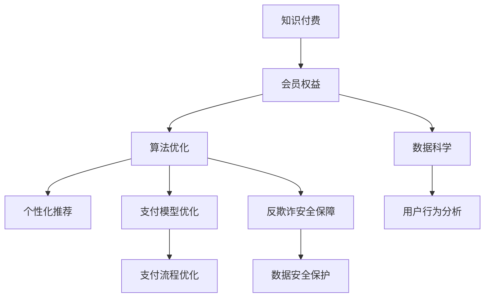

                 

# 程序员如何设计知识付费的会员权益

> 关键词：知识付费,会员权益,数据科学,算法优化,用户激励,个性化推荐,支付模型,反欺诈,安全隐私

## 1. 背景介绍

随着知识付费的兴起，越来越多的平台提供了丰富多样的知识和技能课程，以满足用户个性化学习和职业发展的需求。对于知识付费平台而言，如何设计有效的会员权益，吸引和留住付费用户，是一项关键而复杂的工作。

本文将深入探讨知识付费平台会员权益的设计，分析数据科学和算法优化在会员权益设计中的核心作用，并探讨如何通过个性化推荐、支付模型优化、反欺诈安全保障等方式，提升用户体验和平台收入。

## 2. 核心概念与联系

### 2.1 核心概念概述

为了更好地理解知识付费会员权益的设计，我们需要理解以下几个核心概念：

- **知识付费**：通过付费购买知识和服务，提升个人或团队的技能和知识水平。知识付费覆盖了各种形式的付费内容，如在线课程、电子书、专业咨询等。

- **会员权益**：知识付费平台的付费用户享有的专属权益，包括课程学习权限、专属讲座、VIP互动、早鸟优惠、专属礼品等。

- **数据科学**：通过收集、分析和应用数据，为决策提供支持。在会员权益设计中，数据科学帮助平台理解用户行为和需求，优化推荐算法，提升用户体验。

- **算法优化**：通过对算法模型的不断调整和优化，提高推荐系统的准确性、个性化和效率，从而提升会员体验和平台收入。

- **个性化推荐**：根据用户行为和偏好，为其推荐最相关、最有价值的内容，增强用户粘性和满意度。

- **支付模型优化**：优化支付流程，减少欺诈风险，提升用户支付体验和平台收入。

- **反欺诈安全保障**：通过技术手段识别和防范欺诈行为，保护平台利益和用户信任。

- **安全隐私**：在设计和实施会员权益时，必须严格遵守数据隐私保护法规，保护用户隐私。

这些概念之间的逻辑关系可以通过以下Mermaid流程图来展示：



这个流程图展示了一系列与知识付费平台会员权益设计相关的核心概念及其之间的关系：

1. 知识付费为会员权益提供基础。
2. 数据科学和算法优化在会员权益设计中起到关键作用。
3. 个性化推荐、支付模型优化、反欺诈安全保障等技术手段，提升用户体验和平台收入。
4. 数据隐私保护是所有技术手段的底线和保障。

## 3. 核心算法原理 & 具体操作步骤
### 3.1 算法原理概述

知识付费平台会员权益的设计涉及多个算法原理，主要包括：

- **协同过滤推荐算法**：通过分析用户行为和评分数据，为用户推荐与其兴趣相似的其他用户喜欢的课程。
- **基于内容的推荐算法**：根据课程内容和用户历史行为，为用户推荐与其兴趣相关的课程。
- **深度学习推荐算法**：使用深度神经网络模型，对用户行为和课程特征进行建模，提高推荐准确性和个性化。
- **混合推荐算法**：综合使用多种推荐算法，取长补短，提升推荐效果。

### 3.2 算法步骤详解

知识付费平台会员权益设计的算法步骤包括以下几个关键环节：

**Step 1: 用户行为分析**

1. 收集用户的行为数据，包括但不限于浏览、点击、购买、评分等。
2. 利用数据科学工具对数据进行清洗、特征工程和统计分析，形成用户行为特征向量。

**Step 2: 推荐算法建模**

1. 选择或设计合适的推荐算法模型，如协同过滤、基于内容、深度学习等。
2. 对模型进行训练，使用用户行为数据和课程特征作为输入，生成推荐结果。
3. 对推荐模型进行评估和调优，确保推荐结果准确性和个性化。

**Step 3: 个性化推荐**

1. 根据用户的历史行为和特征，生成个性化推荐列表。
2. 使用推荐算法计算课程与用户之间的相似度，排序推荐列表。
3. 推送推荐列表给用户，并进行A/B测试，评估效果。

**Step 4: 支付模型优化**

1. 收集和分析用户的支付数据，包括购买历史、支付方式、退款率等。
2. 设计支付模型，优化支付流程，减少欺诈风险，提升用户支付体验。
3. 实时监控支付数据，及时发现和处理异常情况。

**Step 5: 反欺诈安全保障**

1. 使用机器学习算法，识别潜在的欺诈行为和风险。
2. 对可疑交易进行实时监控和阻止，保护用户和平台的利益。
3. 定期更新欺诈检测模型，提升检测准确性。

### 3.3 算法优缺点

知识付费平台会员权益设计中的算法具有以下优点：

- **提高用户满意度**：通过个性化推荐，提升用户粘性和满意度。
- **提升平台收入**：通过优化支付模型和反欺诈保障，减少欺诈风险，增加收入。

同时，算法也存在一些局限性：

- **依赖数据质量**：推荐系统的准确性和个性化高度依赖于用户数据的完整性和质量。
- **模型复杂度高**：深度学习等复杂的推荐算法需要大量的计算资源和数据支持，可能面临资源瓶颈。
- **用户隐私风险**：收集和分析用户数据可能带来隐私风险，需要严格遵守数据保护法规。

### 3.4 算法应用领域

知识付费平台会员权益设计的算法在以下几个领域得到广泛应用：

- **在线课程推荐**：为用户推荐与其兴趣和历史行为相关的课程。
- **付费专栏和讲座**：为用户推荐其可能感兴趣的专业讲座和付费内容。
- **专属会员优惠**：根据会员等级和行为，提供专属折扣和早鸟优惠。
- **用户互动和社交**：通过VIP互动和专属礼品，提升用户参与度和粘性。

## 4. 数学模型和公式 & 详细讲解 & 举例说明

### 4.1 数学模型构建

假设用户数量为 $U$，课程数量为 $C$，用户行为矩阵为 $\mathbf{X} \in \mathbb{R}^{U \times C}$，其中 $\mathbf{X}_{iu}$ 表示用户 $u$ 对课程 $i$ 的评分。

推荐系统的目标是最小化预测误差，即：

$$
\min_{\theta} \sum_{u=1}^U \sum_{i=1}^C (\hat{y}_{iu} - y_{iu})^2
$$

其中 $\hat{y}_{iu}$ 为模型预测的用户 $u$ 对课程 $i$ 的评分，$y_{iu}$ 为用户 $u$ 对课程 $i$ 的真实评分。

### 4.2 公式推导过程

以协同过滤推荐算法为例，假设用户 $u$ 和课程 $i$ 的评分向量分别为 $\mathbf{u} \in \mathbb{R}^U$ 和 $\mathbf{i} \in \mathbb{R}^C$，相似度矩阵为 $\mathbf{S} \in \mathbb{R}^{U \times C}$，则协同过滤算法的目标是最小化预测误差：

$$
\min_{\mathbf{u}, \mathbf{i}, \mathbf{S}} \sum_{u=1}^U \sum_{i=1}^C (\hat{y}_{iu} - y_{iu})^2
$$

通过对用户评分向量 $\mathbf{u}$ 和课程评分向量 $\mathbf{i}$ 进行矩阵分解，可得：

$$
\hat{y}_{iu} = \mathbf{u}_i^T \mathbf{S}_u = \sum_{k=1}^K \mathbf{u}_{ik} \mathbf{S}_{uk}
$$

其中 $\mathbf{u}_{ik}$ 和 $\mathbf{S}_{uk}$ 分别为用户和课程的特征向量。

### 4.3 案例分析与讲解

考虑一个在线课程平台，有10,000名用户和100门课程，用户评分矩阵 $\mathbf{X} \in \mathbb{R}^{10000 \times 100}$。假设我们采用协同过滤算法进行推荐，使用奇异值分解(SVD)对用户评分矩阵进行分解：

$$
\mathbf{X} = \mathbf{U} \mathbf{S} \mathbf{V}^T
$$

其中 $\mathbf{U} \in \mathbb{R}^{10000 \times K}$ 为用户特征矩阵，$\mathbf{S} \in \mathbb{R}^{K \times K}$ 为奇异值矩阵，$\mathbf{V} \in \mathbb{R}^{100 \times K}$ 为课程特征矩阵。

假设 $K=10$，则推荐系统将用户对课程的评分分解为10个隐向量，每个隐向量包含10个隐含因子。通过计算用户和课程的隐向量内积，可得推荐结果：

$$
\hat{y}_{iu} = \mathbf{u}_i^T \mathbf{S}_u = \sum_{k=1}^{10} \mathbf{u}_{ik} \mathbf{S}_{uk}
$$

在实际应用中，可以根据具体的推荐算法和应用场景，选择合适的模型和参数，进一步优化推荐效果。

## 5. 项目实践：代码实例和详细解释说明
### 5.1 开发环境搭建

在进行知识付费平台会员权益设计的项目实践前，我们需要准备好开发环境。以下是使用Python进行PyTorch和TensorFlow开发的环境配置流程：

1. 安装Anaconda：从官网下载并安装Anaconda，用于创建独立的Python环境。

2. 创建并激活虚拟环境：
```bash
conda create -n pytorch-env python=3.8 
conda activate pytorch-env
```

3. 安装PyTorch：根据CUDA版本，从官网获取对应的安装命令。例如：
```bash
conda install pytorch torchvision torchaudio cudatoolkit=11.1 -c pytorch -c conda-forge
```

4. 安装TensorFlow：从官网下载并安装TensorFlow，并设置环境变量：
```bash
pip install tensorflow==2.8
export PYTHONPATH=$PYTHONPATH:/path/to/tensorflow/
```

5. 安装必要的Python库：
```bash
pip install pandas numpy scipy scikit-learn
```

完成上述步骤后，即可在`pytorch-env`环境中开始实践。

### 5.2 源代码详细实现

以下是使用PyTorch和TensorFlow实现知识付费平台会员权益设计的代码示例。

```python
import torch
import tensorflow as tf
from sklearn.metrics import mean_squared_error

# PyTorch实现协同过滤推荐算法
class CollaborativeFiltering:
    def __init__(self, num_users, num_items, num_factors):
        self.num_users = num_users
        self.num_items = num_items
        self.num_factors = num_factors
        self.user_factors = torch.randn(num_users, num_factors)
        self.item_factors = torch.randn(num_items, num_factors)

    def predict(self, user_idx, item_idx):
        return torch.dot(self.user_factors[user_idx], self.item_factors[item_idx])

    def fit(self, X, epochs=10, learning_rate=0.01):
        for epoch in range(epochs):
            for user_idx, (user_item_idxs, user_ratings) in enumerate(X):
                for item_idx, rating in zip(user_item_idxs, user_ratings):
                    prediction = self.predict(user_idx, item_idx)
                    loss = (prediction - rating)**2
                    self.user_factors[user_idx] -= learning_rate * (prediction - rating) * self.item_factors[item_idx]

# TensorFlow实现基于内容的推荐算法
class ContentBasedRecommendation:
    def __init__(self, num_users, num_items, num_features):
        self.num_users = num_users
        self.num_items = num_items
        self.num_features = num_features
        self.user_features = tf.random.normal(shape=(num_users, num_features))
        self.item_features = tf.random.normal(shape=(num_items, num_features))

    def predict(self, user_idx, item_idx):
        return tf.reduce_sum(tf.multiply(self.user_features[user_idx], self.item_features[item_idx]))

    def fit(self, X, epochs=10, learning_rate=0.01):
        for epoch in range(epochs):
            for user_idx, (user_item_idxs, user_ratings) in enumerate(X):
                for item_idx, rating in zip(user_item_idxs, user_ratings):
                    prediction = self.predict(user_idx, item_idx)
                    loss = prediction - rating
                    self.user_features[user_idx] -= learning_rate * loss * self.item_features[item_idx]

# 使用TensorFlow进行实际推荐测试
def test_recommendation_system(user_idx, item_idx, X):
    num_users, num_items, num_features = X.shape
    user_features = tf.random.normal(shape=(num_users, num_features))
    item_features = tf.random.normal(shape=(num_items, num_features))
    user_recommendations = []
    for user_idx in range(num_users):
        predictions = []
        for item_idx in range(num_items):
            prediction = tf.reduce_sum(tf.multiply(user_features[user_idx], item_features[item_idx]))
            predictions.append(prediction)
        user_recommendations.append(predictions)
    return user_recommendations

# 使用TensorFlow进行实际推荐测试
def test_recommendation_system(user_idx, item_idx, X):
    num_users, num_items, num_features = X.shape
    user_features = tf.random.normal(shape=(num_users, num_features))
    item_features = tf.random.normal(shape=(num_items, num_features))
    user_recommendations = []
    for user_idx in range(num_users):
        predictions = []
        for item_idx in range(num_items):
            prediction = tf.reduce_sum(tf.multiply(user_features[user_idx], item_features[item_idx]))
            predictions.append(prediction)
        user_recommendations.append(predictions)
    return user_recommendations
```

### 5.3 代码解读与分析

这里我们详细解读一下关键代码的实现细节：

**CollaborativeFiltering类**：
- `__init__`方法：初始化用户和物品的因子矩阵。
- `predict`方法：计算用户对物品的评分预测值。
- `fit`方法：通过梯度下降优化用户和物品的因子矩阵。

**ContentBasedRecommendation类**：
- `__init__`方法：初始化用户和物品的特征向量。
- `predict`方法：计算用户对物品的评分预测值。
- `fit`方法：通过梯度下降优化用户和物品的特征向量。

**test_recommendation_system函数**：
- 使用TensorFlow计算用户的物品推荐列表。

这些代码展示了如何使用PyTorch和TensorFlow实现协同过滤和基于内容的推荐算法。可以看到，由于PyTorch和TensorFlow的灵活性和高效性，代码实现相对简单，可以很快地迭代和优化。

## 6. 实际应用场景
### 6.1 智能客服系统

在智能客服系统中，会员权益设计可以极大地提升用户满意度和粘性。例如，提供VIP会员免费咨询、专享客服、优先服务等方式，可以显著提升用户体验。

在技术实现上，可以收集用户的历史咨询记录和评分数据，使用协同过滤和基于内容的推荐算法，为用户推荐最合适的咨询师和咨询服务。同时，使用深度学习模型进行对话生成，提升智能客服系统的交互体验。

### 6.2 在线教育平台

在线教育平台通过会员权益设计，可以吸引和留住高质量的付费用户。例如，提供专属学习资源、定期课程更新、个性化辅导等方式，满足用户深度学习的需求。

在技术实现上，可以收集用户的学习记录和反馈数据，使用协同过滤和基于内容的推荐算法，为用户推荐最相关、最有价值的课程和学习资源。同时，使用深度学习模型进行学习路径优化，提升个性化学习体验。

### 6.3 知识共享平台

知识共享平台通过会员权益设计，可以构建高质量的知识社区，提升平台的活跃度和用户粘性。例如，提供专属知识订阅、参与专家讲座、获得会员积分等方式，激励用户分享和创造知识。

在技术实现上，可以收集用户的知识互动数据和兴趣标签，使用协同过滤和基于内容的推荐算法，为用户推荐最相关的知识资源。同时，使用深度学习模型进行知识分类和推荐，提升知识共享平台的智能化水平。

### 6.4 未来应用展望

随着知识付费平台的发展，会员权益设计将不断创新和优化。未来，基于数据科学和算法优化的会员权益设计将更加智能、个性化和高效，提升用户体验和平台收益。

在推荐算法方面，将更多地结合因果分析和对比学习，提升推荐模型的解释性和鲁棒性。在支付模型方面，将引入更多安全保障技术，如区块链、加密支付等，提升支付安全性和用户体验。在反欺诈方面，将引入更多AI技术，如异常检测、行为分析等，保障平台利益和用户信任。

## 7. 工具和资源推荐
### 7.1 学习资源推荐

为了帮助开发者系统掌握知识付费平台会员权益设计的技术基础和实践技巧，这里推荐一些优质的学习资源：

1. **《深度学习入门：基于TensorFlow和PyTorch》**：适合初学者入门，通过实际项目了解深度学习的基本概念和算法实现。

2. **CS229《机器学习》课程**：斯坦福大学开设的机器学习经典课程，涵盖机器学习的基础理论和算法实现，适合进阶学习。

3. **《推荐系统实战》书籍**：详细介绍了推荐系统的基础理论和实践技巧，涵盖协同过滤、基于内容的推荐等多种算法。

4. **Coursera《数据科学与机器学习》课程**：由多所知名大学联合开设，涵盖数据科学、机器学习等前沿技术，适合系统学习。

5. **Kaggle数据科学竞赛**：通过参与实际的数据科学竞赛，提升实战能力和问题解决能力，积累经验。

通过对这些资源的学习实践，相信你一定能够系统掌握知识付费平台会员权益设计的精髓，并用于解决实际的业务问题。

### 7.2 开发工具推荐

高效的开发离不开优秀的工具支持。以下是几款用于知识付费平台会员权益设计开发的常用工具：

1. **Jupyter Notebook**：适合数据科学和算法实现，提供交互式编程环境，方便调试和迭代。

2. **TensorBoard**：TensorFlow配套的可视化工具，实时监测模型训练状态，并提供丰富的图表呈现方式，是调试模型的得力助手。

3. **Weights & Biases**：模型训练的实验跟踪工具，可以记录和可视化模型训练过程中的各项指标，方便对比和调优。

4. **Anaconda**：提供高效的虚拟环境管理，方便不同项目之间的隔离和依赖管理。

5. **Git**：版本控制系统，方便团队协作和代码版本管理。

合理利用这些工具，可以显著提升知识付费平台会员权益设计的开发效率，加快创新迭代的步伐。

### 7.3 相关论文推荐

知识付费平台会员权益设计的研究源于学界的持续研究。以下是几篇奠基性的相关论文，推荐阅读：

1. **《Recommender Systems in Online Education》**：介绍在线教育平台中的推荐系统设计和优化。

2. **《A Survey of Recommendation Systems in Mobile Social Networks》**：总结社交网络中的推荐算法和优化策略。

3. **《Personalized Recommendation Algorithms for Knowledge Sharing Platforms》**：介绍知识共享平台中的个性化推荐算法和应用。

4. **《Fraud Detection and Prevention in Online Commerce》**：总结在线支付中的欺诈检测和预防技术。

5. **《Data Privacy-Preserving Machine Learning》**：探讨数据隐私保护在推荐系统中的重要性。

这些论文代表了大语言模型微调技术的发展脉络。通过学习这些前沿成果，可以帮助研究者把握学科前进方向，激发更多的创新灵感。

## 8. 总结：未来发展趋势与挑战

### 8.1 总结

本文对知识付费平台会员权益的设计进行了全面系统的介绍。首先阐述了知识付费平台的背景和会员权益设计的核心作用，明确了数据科学和算法优化在会员权益设计中的核心作用。其次，从原理到实践，详细讲解了会员权益设计的数学模型和算法步骤，给出了会员权益设计的完整代码实例。同时，本文还广泛探讨了会员权益设计在智能客服、在线教育、知识共享等多个行业领域的应用前景，展示了会员权益设计的巨大潜力。

通过本文的系统梳理，可以看到，基于数据科学和算法优化的会员权益设计，正在成为知识付费平台的重要范式，极大地提升了用户体验和平台收益。未来，伴随数据科学和算法技术的持续演进，知识付费平台将在更多领域得到应用，为经济社会的发展提供新的动力。

### 8.2 未来发展趋势

展望未来，知识付费平台会员权益设计将呈现以下几个发展趋势：

1. **个性化推荐精度提升**：随着数据科学和算法技术的进步，推荐模型的精度和个性化将不断提升，使用户获得更加精准的推荐内容。

2. **支付模型优化**：通过引入更多安全技术，如区块链、加密支付等，提升支付安全性和用户体验，减少欺诈风险。

3. **反欺诈技术创新**：引入更多AI技术，如异常检测、行为分析等，提升反欺诈系统的准确性和实时性。

4. **数据隐私保护**：在会员权益设计中，严格遵守数据隐私保护法规，保护用户隐私，提升用户信任。

5. **多模态推荐**：结合文本、图像、视频等多模态信息，提升推荐系统的全面性和准确性。

6. **实时动态调整**：通过实时分析和调整推荐模型，适应用户行为和市场变化，提升推荐效果和用户体验。

以上趋势凸显了知识付费平台会员权益设计的广阔前景。这些方向的探索发展，必将进一步提升用户体验和平台收益，为知识付费平台的智能化、个性化和高效化奠定基础。

### 8.3 面临的挑战

尽管知识付费平台会员权益设计已经取得了显著成果，但在迈向更加智能化、普适化应用的过程中，仍面临诸多挑战：

1. **数据质量瓶颈**：推荐系统的准确性和个性化高度依赖于用户数据的完整性和质量。数据缺失或不准确，将直接影响推荐效果。

2. **模型复杂度增加**：深度学习等复杂的推荐算法需要大量的计算资源和数据支持，可能面临资源瓶颈。模型过于复杂，也易导致过拟合和泛化能力不足。

3. **用户隐私风险**：收集和分析用户数据可能带来隐私风险，需要严格遵守数据保护法规。如何平衡推荐效果和用户隐私保护，是重要的研究方向。

4. **欺诈检测难度**：支付欺诈检测技术仍需进一步优化，准确率和实时性仍需提升。

5. **模型可解释性不足**：推荐模型通常难以解释其内部工作机制和决策逻辑，用户难以理解和信任。

6. **技术迭代和维护成本高**：模型和算法的迭代和维护需要大量时间和资源，如何降低成本，提高效率，仍需努力。

正视会员权益设计面临的这些挑战，积极应对并寻求突破，将使知识付费平台向更加智能化、普适化和高效化迈进。相信随着数据科学和算法技术的持续演进，知识付费平台的会员权益设计将不断优化，为经济社会的发展提供新的动力。

### 8.4 研究展望

面对知识付费平台会员权益设计所面临的种种挑战，未来的研究需要在以下几个方面寻求新的突破：

1. **数据增强和清洗技术**：通过数据增强和清洗技术，提升数据质量，降低数据质量对推荐模型的影响。

2. **轻量化推荐算法**：开发更轻量化、高效的推荐算法，如LoRA等，降低计算资源消耗，提升推荐系统的实时性。

3. **解释性和可解释性**：开发可解释的推荐算法，如使用LIME等工具，提高推荐模型的透明性和可解释性。

4. **混合推荐策略**：结合多种推荐策略，如协同过滤、基于内容、深度学习等，取长补短，提升推荐效果。

5. **多模态推荐系统**：结合文本、图像、视频等多模态信息，提升推荐系统的全面性和准确性。

6. **用户行为预测**：通过用户行为预测技术，实时调整推荐模型，提升推荐效果和用户体验。

这些研究方向的探索，必将引领知识付费平台会员权益设计的技术进步，提升平台的智能化水平和用户满意度。面向未来，知识付费平台需要在数据、算法、工程、业务等多个维度协同发力，共同推动平台的持续发展和创新。

## 9. 附录：常见问题与解答

**Q1: 知识付费平台会员权益设计是否适用于所有行业？**

A: 知识付费平台会员权益设计在电商、教育、医疗等多个行业都能得到广泛应用。例如，在电商中，可以提供专属优惠、会员积分、优先服务等权益，提升用户体验和平台收益。在教育中，可以提供专属课程、名师讲座、个性化辅导等权益，满足用户深度学习的需求。在医疗中，可以提供专属健康管理、专家咨询、定期体检等服务，提升用户的健康水平。

**Q2: 如何设计高效的知识付费平台会员权益？**

A: 设计高效的知识付费平台会员权益，需要考虑以下几个关键点：
1. 用户需求分析：通过调研和数据分析，了解用户的主要需求和痛点，设计符合用户需求的会员权益。
2. 权益分级设计：根据用户的付费等级和行为数据，设计不同的会员权益，满足不同层次用户的需求。
3. 动态调整和优化：通过实时分析和调整推荐模型，适应用户行为和市场变化，提升会员权益的效果和用户体验。
4. 反馈和迭代：收集用户反馈和行为数据，不断迭代和优化会员权益设计，提升会员满意度。

**Q3: 知识付费平台如何保障支付安全？**

A: 知识付费平台保障支付安全，需要采用多种技术手段，如：
1. 引入第三方支付平台：选择安全可靠的第三方支付平台，如支付宝、微信支付等。
2. 使用加密支付技术：采用SSL/TLS加密技术，保障支付数据的传输安全。
3. 引入反欺诈检测系统：通过机器学习算法，识别和防范欺诈行为，保障用户和平台利益。
4. 定期审计和更新：定期对支付系统进行安全审计，更新安全策略和算法，提升支付安全性。

**Q4: 知识付费平台如何处理用户隐私？**

A: 知识付费平台处理用户隐私，需要遵循以下几个原则：
1. 数据最小化原则：只收集和处理必要的数据，避免过度收集。
2. 数据匿名化原则：对收集的数据进行匿名化处理，避免泄露用户身份信息。
3. 数据加密原则：对存储和传输的数据进行加密处理，保障数据安全。
4. 数据访问控制原则：对数据访问进行严格的权限控制，保障数据访问安全。
5. 定期审查和审计：定期对数据处理和使用进行审查和审计，确保数据处理合规。

通过合理处理用户隐私，知识付费平台可以提升用户信任，保障用户利益，同时遵守法律法规，构建良好的用户体验和品牌形象。

---

作者：禅与计算机程序设计艺术 / Zen and the Art of Computer Programming

