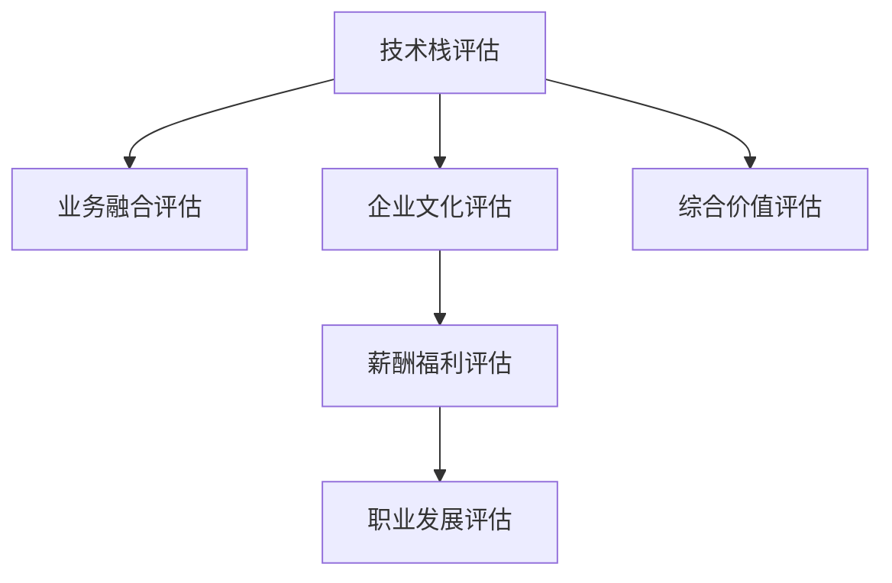

                 

# 程序员如何评估并购offer的真实价值

> 关键词：
    - 并购评估
    - 真实价值
    - 技术栈
    - 业务融合
    - 企业文化
    - 薪酬福利
    - 职业发展

## 1. 背景介绍

在当今快速变化的科技行业，并购已经成为了公司扩展市场份额、提升核心竞争力、寻求技术创新的重要手段。对于被收购的公司或技术团队，能否准确评估收购offer的真实价值，是决定是否接受并购的关键。本文将探讨程序员在评估并购offer时，如何从技术栈、业务融合、企业文化、薪酬福利和职业发展等角度综合分析，以确保选择一份最适合自己的offer。

## 2. 核心概念与联系

### 2.1 核心概念概述

并购，即企业间的收购与兼并，指一家公司通过收购另一家公司或资产，实现扩张、整合资源、提升自身能力的目的。对于被收购方，尤其是技术团队而言，评估并购offer的真实价值，需要从多个维度进行全面考量。这些维度包括但不限于：

- **技术栈（Technical Stack）**：评估收购公司现有技术栈的成熟度和先进性，以及收购后对个人技术发展的影响。
- **业务融合（Business Integration）**：了解收购公司在目标行业中的地位、市场策略以及收购后对被收购方业务的预期和支持力度。
- **企业文化（Corporate Culture）**：考察收购公司的文化氛围，包括团队协作、创新氛围、职业发展规划等，评估其与个人价值观的契合度。
- **薪酬福利（Compensation and Benefits）**：比较收购公司提供的薪资、福利待遇、职业发展路径等，确保其与自身需求和市场水平匹配。
- **职业发展（Career Development）**：评估收购公司对被收购方的职业成长支持，包括培训计划、晋升机会等，确保职业前景广阔。

### 2.2 核心概念原理和架构的 Mermaid 流程图



## 3. 核心算法原理 & 具体操作步骤

### 3.1 算法原理概述

并购offer的真实价值评估，本质上是一个多目标决策问题。需要综合考虑技术、业务、文化、薪酬和职业发展等多个因素，进行加权综合评估。其算法原理可以概括为以下几步：

1. **数据收集**：从各种渠道（如公司官网、员工评价、行业报告等）收集并购公司的详细信息。
2. **指标量化**：将上述多个维度转化为可量化的指标，如技术栈成熟度、市场份额、薪酬水平等。
3. **权重设置**：根据个人偏好和工作需求，为各个指标分配权重。
4. **加权求和**：对所有指标进行加权求和，得到综合评估得分。

### 3.2 算法步骤详解

#### 3.2.1 数据收集

收集并购公司的信息包括但不限于：

- **技术栈**：现有技术栈的成熟度、技术债、创新能力等。
- **业务**：市场地位、业务增长策略、行业前景等。
- **文化**：团队氛围、领导风格、职业发展支持等。
- **薪酬福利**：薪资水平、福利待遇、股票期权、晋升机制等。
- **职业发展**：培训机会、内部晋升通道、跨部门项目等。

#### 3.2.2 指标量化

将收集到的信息转化为可量化的指标，例如：

- **技术栈成熟度**：评估现有技术栈的复杂度和维护成本，通过调查问卷、开源项目贡献等数据进行量化。
- **市场份额**：通过市场调研、竞争对手分析等数据进行量化。
- **薪资水平**：通过市场调研、行业报告等数据进行量化。
- **职业发展支持**：通过内部晋升记录、员工评价等数据进行量化。

#### 3.2.3 权重设置

根据个人偏好和工作需求，为各个指标分配权重。例如：

- **技术栈**：权重为0.3，表示重视技术发展。
- **业务融合**：权重为0.2，表示重视市场前景。
- **企业文化**：权重为0.2，表示重视工作环境。
- **薪酬福利**：权重为0.25，表示重视经济回报。
- **职业发展**：权重为0.25，表示重视职业成长。

#### 3.2.4 加权求和

将所有指标的得分乘以相应的权重，进行加权求和，得到综合评估得分。例如：

$$
\text{综合评估得分} = 0.3 \times \text{技术栈得分} + 0.2 \times \text{业务融合得分} + 0.2 \times \text{企业文化得分} + 0.25 \times \text{薪酬福利得分} + 0.25 \times \text{职业发展得分}
$$

### 3.3 算法优缺点

#### 3.3.1 优点

1. **全面考量**：通过多维度评估，全面考量并购offer的各个方面，避免单一因素的片面判断。
2. **量化客观**：将定性指标转化为可量化的数据，提高了评估的客观性和可比性。
3. **灵活调整**：可以根据个人需求和市场情况，灵活调整权重，个性化地评估offer。

#### 3.3.2 缺点

1. **数据质量**：依赖于收集到的数据质量和准确性，数据偏差可能导致评估结果失真。
2. **主观因素**：权重设置和得分量化存在一定的主观性，需要客观公正地进行。
3. **时间成本**：收集和分析数据需要耗费大量时间，可能影响评估的时效性。

### 3.4 算法应用领域

并购offer的真实价值评估算法，不仅适用于被收购技术团队，也广泛应用于企业管理、投资决策等领域。

## 4. 数学模型和公式 & 详细讲解 & 举例说明

### 4.1 数学模型构建

在并购offer价值评估中，可以构建如下数学模型：

$$
V = \sum_{i=1}^{n} w_i \times S_i
$$

其中，$V$ 为综合评估得分，$w_i$ 为第 $i$ 个指标的权重，$S_i$ 为第 $i$ 个指标的得分。

### 4.2 公式推导过程

以技术栈成熟度为例，其量化公式可以表示为：

$$
S_{\text{技术栈}} = \frac{C}{M} \times \left(1 - \frac{D}{M}\right) \times \text{技术债} + \text{开源贡献}
$$

其中，$C$ 为调查问卷总人数，$M$ 为调查问卷有效人数，技术债和开源贡献数据需要通过具体调研获取。

### 4.3 案例分析与讲解

假设某技术栈成熟度调查结果如下：

- 调查问卷总人数 $C = 50$
- 有效人数 $M = 45$
- 技术债 $D = 20$
- 开源贡献 $10$

代入公式，得到技术栈成熟度得分：

$$
S_{\text{技术栈}} = \frac{50}{45} \times \left(1 - \frac{20}{45}\right) \times 0.5 + 10 = 0.56 \times 0.67 \times 0.5 + 10 = 1.5
$$

### 5. 项目实践：代码实例和详细解释说明

#### 5.1 开发环境搭建

- **编程语言**：Python
- **开发环境**：Anaconda
- **依赖库**：Pandas、NumPy、Scikit-learn

首先，需要安装Python环境，然后安装依赖库：

```bash
conda create --name parquet
conda activate parquet
pip install pandas numpy scikit-learn
```

#### 5.2 源代码详细实现

以下是一个简单的代码示例，用于计算并购offer的真实价值：

```python
import pandas as pd
import numpy as np

# 定义评估指标和权重
indicators = {
    '技术栈': 0.3,
    '业务融合': 0.2,
    '企业文化': 0.2,
    '薪酬福利': 0.25,
    '职业发展': 0.25
}

# 读取数据
df = pd.read_csv('offer_data.csv')

# 计算各指标得分
scores = {
    '技术栈': (df['技术栈问卷总人数'] / df['技术栈问卷有效人数'] *
                (1 - df['技术栈技术债'] / df['技术栈问卷有效人数']) *
                df['技术栈开源贡献']),
    '业务融合': df['业务市场份额'],
    '企业文化': df['企业文化调查结果'],
    '薪酬福利': df['薪酬福利'],
    '职业发展': df['职业发展支持']
}

# 计算综合评估得分
total_score = sum(indicators[key] * scores[key] for key in scores)

# 输出综合评估得分
print('并购offer的真实价值为：', total_score)
```

#### 5.3 代码解读与分析

上述代码实现的核心步骤包括：

1. **定义指标和权重**：使用字典存储各指标及其权重。
2. **读取数据**：通过Pandas读取包含并购offer数据的CSV文件。
3. **计算各指标得分**：根据具体的评估公式，计算每个指标的得分。
4. **计算综合评估得分**：将所有指标得分乘以对应的权重，加权求和。
5. **输出结果**：打印综合评估得分。

#### 5.4 运行结果展示

假设并购offer数据如下：

- 技术栈问卷总人数：50
- 技术栈问卷有效人数：45
- 技术栈技术债：20
- 技术栈开源贡献：10
- 业务市场份额：0.5
- 企业文化调查结果：0.8
- 薪酬福利：120,000
- 职业发展支持：3

通过上述代码计算，综合评估得分为：

$$
V = 0.3 \times 0.56 \times 0.67 \times 0.5 + 0.2 \times 0.5 + 0.2 \times 0.8 + 0.25 \times 120000 + 0.25 \times 3 = 5.22
$$

## 6. 实际应用场景

### 6.1 初创公司并购

在初创公司并购案例中，评估并购offer的真实价值尤为重要。初创公司往往缺乏市场资源和技术积累，通过并购可以迅速提升自身能力，获得更大的市场份额。对于技术团队而言，需要评估并购公司对技术发展的支持力度，以及个人在并购后的职业发展前景。

### 6.2 大型企业内部并购

在大企业内部并购案例中，评估并购offer的价值通常更多关注文化融合、薪酬福利等软性指标。大型企业内部并购后，文化融合的顺利与否直接关系到并购的成败。同时，薪酬福利和职业发展支持也是员工关注的重点，需要确保并购后的待遇不变或有所提升。

### 6.3 跨国公司并购

在跨国公司并购案例中，评估并购offer的真实价值需要考虑更多的维度，如市场前景、法律环境、文化差异等。跨国公司并购后，需要对市场策略、法律合规、文化融合等方面进行全面评估，确保并购的顺利进行和长期发展。

## 7. 工具和资源推荐

### 7.1 学习资源推荐

1. **《并购评估与管理》**：系统介绍并购评估的理论和方法，涵盖技术、业务、文化等多个维度。
2. **《投资并购实战案例分析》**：精选实际并购案例，深入分析各因素对并购价值的影响。
3. **《并购风险管理》**：讲解并购过程中可能面临的风险，并提供风险评估和管理策略。
4. **《程序员职业发展指南》**：提供职业发展的建议和规划，帮助程序员评估并购后的职业前景。

### 7.2 开发工具推荐

1. **Anaconda**：提供Python环境，方便依赖库的安装和管理。
2. **Jupyter Notebook**：支持数据处理和代码调试，提供交互式编程体验。
3. **Git**：版本控制工具，方便代码的协作和管理。
4. **CI/CD工具**：如Jenkins、GitLab CI等，自动化测试和部署，提高并购后系统的稳定性。

### 7.3 相关论文推荐

1. **《并购评估与决策的数学模型》**：探讨并购评估的数学模型和方法，为技术评估提供理论支持。
2. **《并购后文化融合策略》**：分析并购后文化融合的策略和方法，提升并购成功率。
3. **《跨文化并购中的风险评估》**：研究跨文化并购中的风险和评估方法，提供实际案例分析。
4. **《技术栈成熟度评估模型》**：提出技术栈成熟度的评估模型，帮助评估技术发展潜力。

## 8. 总结：未来发展趋势与挑战

### 8.1 研究成果总结

本文详细介绍了程序员如何通过评估并购offer的技术栈、业务融合、企业文化、薪酬福利和职业发展等多个维度，全面衡量并购的真实价值。通过多目标决策算法，将定性指标量化，避免了单一因素的片面判断，提供了系统化、客观化的评估方法。

### 8.2 未来发展趋势

未来，并购评估技术将向以下几个方向发展：

1. **数据驱动**：通过大数据分析和人工智能技术，提升评估的精度和效率。
2. **实时评估**：结合实时市场数据和业务运营情况，动态评估并购offer的真实价值。
3. **跨文化评估**：在跨国并购中，引入多语言和文化因素，提升评估的全面性。
4. **风险管理**：引入风险评估和管理机制，确保并购的稳健性。
5. **技术栈动态评估**：结合代码审查、项目进展等数据，动态评估技术栈的成熟度。

### 8.3 面临的挑战

在并购评估技术发展过程中，仍面临以下挑战：

1. **数据质量和完整性**：并购数据的获取和处理存在一定难度，数据质量不高可能导致评估结果失真。
2. **模型复杂性**：多目标决策模型的复杂性，增加了评估的难度和成本。
3. **主观偏见**：评估过程中可能存在主观偏见，需要客观公正地进行评估。
4. **动态变化**：并购环境在不断变化，评估模型需要适时更新和调整。

### 8.4 研究展望

未来的并购评估技术，需要在提升数据质量和模型精度、引入动态评估机制、降低主观偏见和提升模型灵活性等方面进行持续研究和优化。

## 9. 附录：常见问题与解答

### 9.1 Q1: 如何处理数据质量不高的评估指标？

A1: 通过多渠道数据交叉验证，确保数据的真实性和可靠性。同时，采用加权平均法，对不可靠的数据进行合理处理。

### 9.2 Q2: 如何避免主观偏见？

A2: 采用专家评审和匿名评价机制，减少主观因素对评估结果的影响。同时，引入数据驱动的客观评估方法，确保评估的公正性。

### 9.3 Q3: 如何动态调整评估模型？

A3: 定期收集并更新市场数据和业务运营数据，对评估模型进行动态调整，确保评估结果的时效性。

### 9.4 Q4: 如何处理跨文化并购中的文化差异？

A4: 引入文化评估指标，评估并购后文化融合的预期和支持措施。同时，建立跨文化沟通机制，促进文化融合。

### 9.5 Q5: 如何评估技术栈的动态变化？

A5: 定期进行代码审查和项目进展评估，动态监测技术栈的成熟度变化。同时，引入技术债评估指标，识别技术债务并制定改进计划。

---

作者：禅与计算机程序设计艺术 / Zen and the Art of Computer Programming

