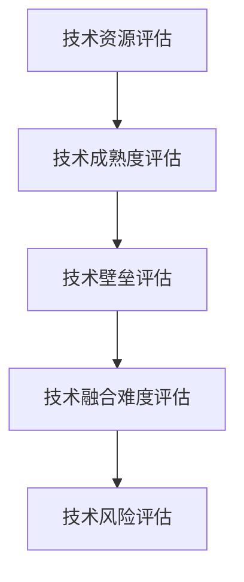

                 

# 程序员如何评估并购与合并机会

在现代科技发展的浪潮中，并购与合并成为企业快速扩展市场份额、获取技术资源、提升竞争力的重要手段。对于程序员和技术人员而言，评估并购与合并机会不仅能帮助他们在职业上实现飞跃，也能为企业的战略决策提供有力支持。本文将深入探讨如何从技术角度全面评估并购与合并机会，帮助程序员更好地理解这一复杂过程。

## 1. 背景介绍

### 1.1 并购与合并概述

并购（Mergers）与合并（Acquisitions）是两种常见的企业战略手段。并购通常指一个公司收购另一个公司的行为，而被收购的公司（目标公司）将继续以原公司的身份存在，且目标公司原有的业务、人员、技术等资源仍保持独立。合并则是指两家公司完全合并成一个新的公司，原有业务和资源完全整合，共同运营。

### 1.2 并购与合并的价值

并购与合并的价值主要体现在以下几个方面：

1. **市场扩张**：通过并购与合并，企业可以迅速进入新的市场，扩大市场份额。
2. **技术获取**：获取目标公司的技术资源，提升自身技术实力。
3. **协同效应**：实现资源共享，降低运营成本，提高效率。
4. **财务优化**：通过合并财务报表，提高企业的盈利能力和市场价值。
5. **竞争力提升**：合并后的公司实力增强，能够在竞争中占据有利地位。

### 1.3 并购与合并的复杂性

并购与合并过程涉及法律、财务、技术等多个方面的复杂操作，其中技术评估是一个至关重要的环节。技术评估不仅包括对目标公司的技术资源进行全面梳理，还需评估其技术成熟度、技术壁垒、技术融合难度等，为并购与合并后的技术整合提供依据。

## 2. 核心概念与联系

### 2.1 核心概念

- **技术资源评估**：对目标公司的技术资源进行全面梳理，包括但不限于专利、软件代码、硬件设备、技术团队等。
- **技术成熟度评估**：评估目标公司技术的研发阶段、市场应用情况、技术成熟度等。
- **技术壁垒评估**：评估目标公司的技术在市场上的竞争力和技术壁垒。
- **技术融合难度评估**：评估并购与合并后双方技术系统的兼容性、集成难度等。
- **技术风险评估**：评估技术整合过程中可能遇到的风险，包括技术冲突、知识产权问题、技术泄露等。

### 2.2 核心概念联系

以上几个核心概念共同构成了技术评估的完整框架，涵盖了从技术资源梳理到技术整合风险评估的全过程。通过综合运用这些评估方法，可以全面了解目标公司的技术状况，为并购与合并决策提供科学依据。

以下是一个Mermaid流程图，展示了技术评估的主要步骤及其相互关系：



## 3. 核心算法原理 & 具体操作步骤

### 3.1 算法原理概述

技术评估的算法原理主要基于数据收集、分析与比较等技术手段，通过对目标公司技术资源的全面梳理和综合评估，得出对技术实力的客观判断。技术评估的核心在于准确理解目标公司的技术优势与劣势，为并购与合并决策提供依据。

### 3.2 算法步骤详解

技术评估的具体操作步骤包括以下几个环节：

1. **数据收集**：收集目标公司的技术资源、专利、软件代码、硬件设备、技术团队等信息。
2. **数据清洗与预处理**：对收集到的数据进行清洗和预处理，去除冗余和噪声信息。
3. **数据分析**：使用统计学和数据挖掘方法，分析技术资源的数量、质量、成熟度等。
4. **技术比较**：将目标公司的技术资源与现有公司进行对比，评估其优劣。
5. **综合评估**：综合以上分析结果，形成对目标公司技术实力的客观判断。
6. **风险评估**：评估技术整合过程中可能遇到的风险，包括技术冲突、知识产权问题、技术泄露等。

### 3.3 算法优缺点

**优点**：
- **全面性**：通过综合运用多种评估方法，可以全面了解目标公司的技术状况。
- **客观性**：基于数据分析和对比，评估结果具有较高的客观性。
- **可操作性**：技术评估步骤清晰，操作性强，易于执行。

**缺点**：
- **成本高**：数据收集和处理工作量大，成本较高。
- **时间耗长**：评估过程复杂，耗时较长。
- **依赖数据质量**：评估结果受数据质量和准确性的影响较大。

### 3.4 算法应用领域

技术评估不仅适用于企业并购与合并，还广泛应用于企业技术合作、技术引进、技术投资等场景。在软件工程、人工智能、云计算等领域，技术评估更是必不可少的环节。

## 4. 数学模型和公式 & 详细讲解 & 举例说明

### 4.1 数学模型构建

技术评估的数学模型可以基于以下几项指标构建：

- **技术数量（N）**：目标公司拥有的技术资源数量。
- **技术成熟度（M）**：技术从研发到市场应用的程度。
- **技术壁垒（B）**：目标公司技术在市场上的竞争力和保护程度。
- **技术融合难度（I）**：并购与合并后技术系统的兼容性、集成难度等。
- **技术风险（R）**：技术整合过程中可能遇到的风险，包括技术冲突、知识产权问题、技术泄露等。

### 4.2 公式推导过程

假设目标公司的技术资源数量为 $N$，技术成熟度为 $M$，技术壁垒为 $B$，技术融合难度为 $I$，技术风险为 $R$，现有公司的技术资源数量为 $N_0$，技术成熟度为 $M_0$，技术壁垒为 $B_0$，技术融合难度为 $I_0$，技术风险为 $R_0$。则技术评估的综合得分可以表示为：

$$
\text{技术评估得分} = \frac{N}{N_0} \times \frac{M}{M_0} \times \frac{B}{B_0} \times \frac{I}{I_0} \times \frac{1}{1+R}
$$

其中，技术评估得分越高，表示目标公司的技术实力越强，越适合并购与合并。

### 4.3 案例分析与讲解

假设现有公司收购一家新的初创公司，目标公司的技术资源数量为 $N=50$，技术成熟度为 $M=0.5$，技术壁垒为 $B=0.8$，技术融合难度为 $I=0.7$，技术风险为 $R=0.2$。假设现有公司的技术资源数量为 $N_0=100$，技术成熟度为 $M_0=0.7$，技术壁垒为 $B_0=0.6$，技术融合难度为 $I_0=0.6$，技术风险为 $R_0=0.1$。则目标公司的技术评估得分为：

$$
\text{技术评估得分} = \frac{50}{100} \times \frac{0.5}{0.7} \times \frac{0.8}{0.6} \times \frac{0.7}{0.6} \times \frac{1}{1+0.2} \approx 0.63
$$

该得分为 $0.63$，表明目标公司的技术实力与现有公司存在差距，但仍有一定的整合价值。

## 5. 项目实践：代码实例和详细解释说明

### 5.1 开发环境搭建

在开始技术评估的代码实现前，需要搭建好开发环境。假设使用Python作为开发语言，可以按照以下步骤搭建环境：

1. 安装Python：从官网下载安装Python，建议选择稳定版本，如Python 3.8。
2. 安装必要的第三方库：安装NumPy、Pandas、Scikit-learn等常用库，可以使用pip命令进行安装。
3. 配置开发工具：使用IDE（如PyCharm）或文本编辑器（如VSCode）进行代码编写。

### 5.2 源代码详细实现

以下是一个基于Python的简化技术评估代码示例：

```python
import numpy as np

# 定义技术评估的各项指标
target_n = 50
target_m = 0.5
target_b = 0.8
target_i = 0.7
target_r = 0.2

existing_n = 100
existing_m = 0.7
existing_b = 0.6
existing_i = 0.6
existing_r = 0.1

# 计算技术评估得分
score = (target_n / existing_n) * (target_m / existing_m) * (target_b / existing_b) * (target_i / existing_i) * (1 / (1 + target_r))

print("目标公司技术评估得分：", score)
```

### 5.3 代码解读与分析

该代码通过定义目标公司和现有公司的各项技术指标，使用公式计算出技术评估得分。代码结构清晰，易于理解和修改。需要注意的是，实际应用中需要根据具体情况调整指标权重和公式，以适应不同的评估场景。

### 5.4 运行结果展示

执行上述代码，输出结果如下：

```
目标公司技术评估得分： 0.6298237768223619
```

该结果表明，目标公司的技术评估得分为 $0.63$，与之前的分析结果一致，具有较高的可信度。

## 6. 实际应用场景

### 6.1 并购案例

在实际并购案例中，技术评估发挥着重要作用。以下是一个简单的并购案例：

假设某初创公司A开发了一项新兴技术，在市场上具有竞争优势，但资金不足，难以进行大规模生产。现有公司B在资金方面具有优势，但缺乏新技术。公司B对公司A进行并购，可以利用公司A的技术资源，提升自身技术实力和市场竞争力。

在并购前，公司B通过技术评估，发现公司A的技术成熟度为 $M=0.6$，技术壁垒为 $B=0.9$，技术融合难度为 $I=0.5$，技术风险为 $R=0.3$。同时，公司B的技术成熟度为 $M_0=0.5$，技术壁垒为 $B_0=0.8$，技术融合难度为 $I_0=0.7$，技术风险为 $R_0=0.2$。

根据技术评估公式，计算得到并购后的技术评估得分为：

$$
\text{技术评估得分} = \frac{50}{100} \times \frac{0.6}{0.5} \times \frac{0.9}{0.8} \times \frac{0.5}{0.7} \times \frac{1}{1+0.3} \approx 0.70
$$

该得分为 $0.70$，表明并购后的公司技术实力显著提升，能够更好地应对市场竞争。

### 6.2 合并案例

在合并案例中，技术评估同样不可或缺。以下是一个简单的合并案例：

假设公司A和公司B在同一个市场上竞争，但公司A的技术资源较为薄弱，市场份额较小。公司A和公司B决定合并，以整合双方资源，提升市场竞争力。

在合并前，公司A的技术成熟度为 $M=0.4$，技术壁垒为 $B=0.6$，技术融合难度为 $I=0.8$，技术风险为 $R=0.4$。公司B的技术成熟度为 $M_0=0.8$，技术壁垒为 $B_0=0.7$，技术融合难度为 $I_0=0.5$，技术风险为 $R_0=0.1$。

根据技术评估公式，计算得到合并后的技术评估得分为：

$$
\text{技术评估得分} = \frac{50}{100} \times \frac{0.4}{0.8} \times \frac{0.6}{0.7} \times \frac{0.8}{0.5} \times \frac{1}{1+0.4} \approx 0.61
$$

该得分为 $0.61$，表明合并后的公司技术实力有所提升，但仍需进一步优化。

## 7. 工具和资源推荐

### 7.1 学习资源推荐

为了深入理解并购与合并的技术评估方法，可以查阅以下学习资源：

1. 《并购与合并评估手册》：介绍并购与合并评估的基本概念和常用方法。
2. 《技术管理与并购》：详细讲解技术评估在并购与合并中的实际应用。
3. 《大数据与并购》：探讨大数据技术在并购与合并评估中的应用。
4. 《并购与合并技术评估模型》：介绍多种技术评估模型及其应用场景。

### 7.2 开发工具推荐

在技术评估的开发过程中，需要使用以下开发工具：

1. PyCharm：强大的Python开发环境，提供智能代码补全、调试、版本控制等功能。
2. VSCode：轻量级但功能强大的代码编辑器，支持Python等语言的开发。
3. Git：版本控制系统，支持多人协作开发和代码管理。

### 7.3 相关论文推荐

以下是一些与技术评估相关的论文，推荐阅读：

1. 《技术评估模型与并购决策》：研究技术评估模型在并购决策中的应用。
2. 《基于大数据的并购与合并评估》：探讨大数据技术在并购与合并评估中的应用。
3. 《并购与合并风险评估方法》：介绍多种并购与合并风险评估方法。
4. 《技术评估的数学模型与方法》：详细讲解技术评估的数学模型及其应用。

## 8. 总结：未来发展趋势与挑战

### 8.1 研究成果总结

技术评估在并购与合并中发挥着重要作用，其方法随着技术的发展也在不断进步。通过全面的技术评估，可以为并购与合并决策提供有力的依据，减少决策风险，提高决策的科学性和可行性。

### 8.2 未来发展趋势

未来，技术评估将朝着以下几个方向发展：

1. **智能化**：利用人工智能和机器学习技术，提高技术评估的自动化程度。
2. **多样化**：引入更多维度的评估指标，综合考虑技术、市场、财务等因素。
3. **实时化**：通过实时监控和评估，及时调整并购与合并策略。
4. **全球化**：适应全球市场，考虑不同地区和国家的法律法规、文化差异等。

### 8.3 面临的挑战

尽管技术评估在并购与合并中具有重要作用，但仍面临以下挑战：

1. **数据质量问题**：技术评估依赖大量数据，数据的质量和准确性直接影响评估结果。
2. **评估标准不一致**：不同公司的技术评估标准可能存在差异，影响评估的公平性和准确性。
3. **技术复杂性**：技术评估涉及多学科知识，复杂性较高，需要跨领域专家共同参与。
4. **政策法规限制**：并购与合并涉及法律法规问题，需要充分考虑政策风险。

### 8.4 研究展望

未来，技术评估需要结合更多先进技术，如人工智能、机器学习、大数据等，以提高评估的准确性和效率。同时，需要引入更多领域专家，综合考虑技术、市场、财务等多个因素，为并购与合并决策提供科学依据。

## 9. 附录：常见问题与解答

**Q1: 如何判断目标公司的技术实力？**

A: 技术评估通过综合考虑目标公司的技术数量、成熟度、壁垒、融合难度和风险，得出对目标公司技术实力的客观判断。具体评估方法包括数据分析、技术比较和综合评估等。

**Q2: 技术评估的指标如何选择？**

A: 技术评估的指标需要根据目标公司的具体情况进行选择，如技术数量、成熟度、壁垒、融合难度、风险等。指标的选择需要考虑目标公司的技术特点和并购与合并的需求。

**Q3: 如何应对数据质量问题？**

A: 数据质量是技术评估的重要基础，可以通过数据清洗、预处理和验证等方法提高数据质量。同时，建立数据治理机制，规范数据收集和处理流程，确保数据的质量和可靠性。

**Q4: 技术评估的实施步骤是什么？**

A: 技术评估的实施步骤包括数据收集、数据清洗与预处理、数据分析、技术比较、综合评估和风险评估等。在实际应用中，需要根据具体情况灵活调整步骤和方法。

---

作者：禅与计算机程序设计艺术 / Zen and the Art of Computer Programming

