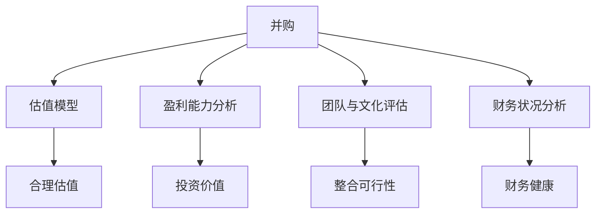

                 

# 程序员如何评估并购机会与公司出售时机

## 1. 背景介绍

### 1.1 问题由来

近年来，全球科技行业并购频发，众多科技公司通过并购快速扩张市场份额，提升核心竞争力。然而，并购过程复杂，涉及的财务和法律问题众多，这给程序员和公司管理层带来了巨大的挑战。同时，公司出售时机选择不当，也可能导致巨大的损失。

本节将探讨如何评估并购机会，如何判断公司出售时机，从而为程序员和公司管理层提供决策参考。

### 1.2 问题核心关键点

评估并购机会和公司出售时机，涉及多方面的因素。以下列出了几个关键点：

- **市场机遇与技术优势**：评估并购目标公司的市场潜力，以及自身的技术优势是否能够与之互补。
- **财务状况与估值合理性**：分析目标公司的财务报表，判断其估值是否合理。
- **团队文化与业务协同**：评估双方的团队文化和业务模式是否匹配，能否有效整合。
- **法律与合规风险**：了解并购过程中涉及的法律条款和合规要求，避免法律风险。
- **出售时机选择**：判断公司股价、市场趋势等因素，选择最佳出售时机。

了解这些关键点，可以帮助程序员和管理层从多个维度全面评估并购机会和公司出售时机。

## 2. 核心概念与联系

### 2.1 核心概念概述

为更好地理解并购和公司出售时机评估，本节将介绍几个核心概念：

- **并购（Mergers and Acquisitions, M&A）**：企业通过购买目标公司的股份或资产，实现对目标公司的控制。

- **公司出售（Spin-off, Carve-out, Divestment）**：公司将部分业务或资产出售给第三方，从而分离出新的独立公司。

- **估值模型（Valuation Model）**：根据目标公司的财务数据，通过模型计算其合理估值。

- **盈利能力分析（Profitability Analysis）**：评估目标公司的盈利能力和增长潜力，判断其投资价值。

- **团队与文化评估（Team & Culture Assessment）**：分析双方的团队结构和公司文化，判断整合的可行性和风险。

- **财务状况分析（Financial Analysis）**：分析目标公司的财务报表，包括收入、利润、负债等方面，判断其财务健康状况。

这些核心概念之间的逻辑关系可以通过以下Mermaid流程图来展示：



这个流程图展示并购和公司出售时机评估的核心概念及其之间的关系：

1. 并购过程涉及多方面的评估，包括估值、盈利能力、团队文化、财务状况等。
2. 估值模型和盈利能力分析，用于计算目标公司的合理估值和投资价值。
3. 团队与文化评估，判断双方的匹配度和整合的可行性。
4. 财务状况分析，评估目标公司的财务健康状况。

这些概念共同构成了并购和公司出售时机评估的框架，帮助程序员和管理层系统性地进行决策。

## 3. 核心算法原理 & 具体操作步骤

### 3.1 算法原理概述

并购和公司出售时机评估，本质上是一个多目标优化问题。目标是最大化交易价值，同时最小化整合风险和法律风险。

形式化地，假设目标公司为 $T$，目标公司的市场价值为 $V_T$，自身的市场价值为 $V_S$，并购后的市场价值为 $V_{M}$。则并购的目标是最大化 $V_{M}$。同时，需要考虑整合风险 $R$ 和法律风险 $L$，最小化它们的和。因此，并购优化的目标函数为：

$$
\max_{T,S} V_M - R - L
$$

其中，$V_M$ 为目标公司并购后的市场价值，$R$ 为并购整合风险，$L$ 为法律风险。

### 3.2 算法步骤详解

基于上述优化问题，并购和公司出售时机评估的算法步骤如下：

**Step 1: 数据收集与整理**

- 收集目标公司 $T$ 的财务报表、市场数据、团队信息等。
- 整理目标公司 $T$ 的市场价值 $V_T$，自身的市场价值 $V_S$，以及并购后的预期市场价值 $V_{M}$。
- 分析并购整合风险 $R$ 和法律风险 $L$。

**Step 2: 估值模型选择**

- 选择合适的估值模型，如DCF（贴现现金流）模型、相对估值模型等。
- 根据目标公司 $T$ 的财务数据，计算其合理估值 $V_F$。

**Step 3: 盈利能力分析**

- 分析目标公司 $T$ 的盈利能力，计算其EPS（每股收益）、ROE（净资产收益率）等指标。
- 评估目标公司 $T$ 的增长潜力，判断其长期投资价值。

**Step 4: 团队与文化评估**

- 分析目标公司 $T$ 的管理层和团队结构，评估其专业能力和团队文化。
- 判断目标公司 $T$ 的业务模式是否与自身匹配，评估整合的可行性。

**Step 5: 财务状况分析**

- 分析目标公司 $T$ 的财务报表，评估其收入、利润、负债等指标。
- 判断目标公司 $T$ 的财务健康状况，是否存在财务风险。

**Step 6: 风险评估**

- 评估并购整合风险 $R$，包括技术、管理、市场等方面的风险。
- 评估法律风险 $L$，包括反垄断、环保、劳动法等方面的法律风险。

**Step 7: 决策分析**

- 综合考虑市场价值、盈利能力、团队文化、财务状况和风险评估结果，判断并购是否可行。
- 确定最佳并购时机和出售时机，制定详细的并购和出售方案。

### 3.3 算法优缺点

并购和公司出售时机评估方法具有以下优点：

- **综合考虑多个因素**：通过多个维度的评估，可以全面了解并购和出售时机，降低决策风险。
- **计算模型成熟**：目前已有多种成熟的估值模型可供选择，能够较为准确地计算目标公司的市场价值。
- **风险管理**：通过风险评估，可以有效识别并管理整合风险和法律风险，保障交易顺利进行。

然而，该方法也存在一些局限性：

- **数据获取难度大**：目标公司的财务报表、市场数据等数据获取难度较大，需要花费大量时间和资源。
- **模型依赖性**：估值模型对数据的准确性和可靠性要求较高，模型假设和参数选择不当可能导致评估结果偏差。
- **风险评估复杂**：并购整合风险和法律风险评估复杂，涉及多方面的专业知识。

尽管存在这些局限性，但并购和公司出售时机评估方法仍然是并购和出售决策的重要工具。

### 3.4 算法应用领域

并购和公司出售时机评估方法，在科技行业的应用非常广泛，包括但不限于：

- **并购战略制定**：科技公司通过并购获取新的市场份额、技术优势，从而提升竞争力。
- **业务扩展**：通过并购或出售，拓展公司的业务范围，优化资源配置。
- **资本运作**：利用并购或出售进行资本运作，提升公司的市值和股东收益。
- **风险管理**：通过并购或出售，转移和分散风险，实现公司的可持续发展。

## 4. 数学模型和公式 & 详细讲解 & 举例说明

### 4.1 数学模型构建

本节将使用数学语言对并购和公司出售时机评估的数学模型进行更加严格的刻画。

记目标公司 $T$ 的市值为 $V_T$，自身的市值为 $V_S$，并购后的市值为 $V_M$，整合风险为 $R$，法律风险为 $L$，则并购优化的目标函数为：

$$
\max_{T,S} V_M - R - L
$$

其中 $V_M$ 为目标公司并购后的市场价值，$R$ 为并购整合风险，$L$ 为法律风险。

### 4.2 公式推导过程

以下我们以DCF模型为例，推导目标公司 $T$ 的合理估值 $V_F$。

假设目标公司 $T$ 的未来自由现金流为 $\{F_t\}_{t=1}^{\infty}$，折现率为 $r$，则其自由现金流的现值为：

$$
V_F = \sum_{t=1}^{\infty} \frac{F_t}{(1+r)^t}
$$

其中 $r$ 为折现率，通常根据市场利率和公司风险进行调整。

将目标公司 $T$ 的未来自由现金流折现，可以得到其合理估值 $V_F$。通过比较 $V_F$ 与 $V_T$，判断并购后市场价值的增加情况，从而决定是否进行并购。

### 4.3 案例分析与讲解

假设某科技公司 $S$ 对目标公司 $T$ 进行并购，已知目标公司 $T$ 的当前市值为 $V_T=10$ 亿美元，未来自由现金流为 $F_t=1.1^{t-1} \times 100$ 万美元（第1年为100万美元，第2年为110万美元，以此类推），折现率为5%。则目标公司 $T$ 的合理估值 $V_F$ 为：

$$
V_F = \frac{100}{1+5\%} + \frac{110}{(1+5\%)^2} + \frac{121}{(1+5\%)^3} + \cdots
$$

计算得到 $V_F \approx 14.24$ 亿美元。

比较 $V_F$ 与 $V_T$，可以看出并购后市场价值增加了约4.24亿美元，因此并购是可行的。

## 5. 项目实践：代码实例和详细解释说明

### 5.1 开发环境搭建

在进行并购和公司出售时机评估的项目实践前，我们需要准备好开发环境。以下是使用Python进行财务分析的开发环境配置流程：

1. 安装Anaconda：从官网下载并安装Anaconda，用于创建独立的Python环境。

2. 创建并激活虚拟环境：
```bash
conda create -n finance-env python=3.8 
conda activate finance-env
```

3. 安装必要的库：
```bash
conda install numpy pandas scipy matplotlib seaborn sympy
```

完成上述步骤后，即可在`finance-env`环境中开始项目实践。

### 5.2 源代码详细实现

这里我们以DCF模型为例，展示如何计算目标公司的合理估值。

```python
import numpy as np
from scipy.optimize import fsolve

def dcf_model(future_cf, r, discount_factor=1.05):
    """
    DCF模型，计算目标公司的合理估值
    """
    n = len(future_cf)
    present_value = 0
    for t in range(n):
        present_value += future_cf[t] / (discount_factor ** t)
    return present_value

# 假设未来自由现金流
future_cf = [1.1**(t-1) * 100 for t in range(1, 11)]

# 计算目标公司的合理估值
discount_rate = 0.05
valuation = dcf_model(future_cf, discount_rate)
print(f"目标公司的合理估值为: {valuation}")
```

### 5.3 代码解读与分析

让我们再详细解读一下关键代码的实现细节：

**dcf_model函数**：
- 定义DCF模型，计算目标公司的合理估值。
- 使用for循环，按时间顺序计算未来自由现金流的现值。
- 最终返回目标公司的合理估值。

**future_cf列表**：
- 定义目标公司未来11年的自由现金流，即第1年为100万美元，第2年为110万美元，以此类推。

**discount_rate变量**：
- 定义折现率，通常根据市场利率和公司风险进行调整。

通过DCF模型计算，可以较为准确地评估目标公司的合理估值，判断并购和出售时机。当然，实际应用中还需要综合考虑其他多方面的因素。

## 6. 实际应用场景

### 6.1 智能硬件并购

智能硬件行业竞争激烈，通过并购可以快速获取新的技术和市场渠道。例如，某手机公司 $S$ 对智能穿戴设备公司 $T$ 进行并购，获取 $T$ 的先进技术和市场份额。

在评估并购时机时，可以收集 $T$ 的财务报表、市场数据、团队信息等数据，计算其合理估值 $V_F$。通过比较 $V_F$ 与 $V_T$，判断并购后的市场价值增加情况。同时，评估 $T$ 的技术优势、团队文化和财务状况，确保并购后的整合风险和法律风险可控。

### 6.2 云计算业务扩展

云计算是科技行业的重要赛道，通过并购可以迅速扩展市场份额。例如，某云计算公司 $S$ 对另一家云计算公司 $T$ 进行并购，获取 $T$ 的客户和资源。

在评估并购时机时，可以收集 $T$ 的财务报表、市场数据、团队信息等数据，计算其合理估值 $V_F$。通过比较 $V_F$ 与 $V_T$，判断并购后的市场价值增加情况。同时，评估 $T$ 的云计算技术和市场策略，确保并购后的业务协同和市场扩展。

### 6.3 人工智能技术收购

人工智能是科技行业的热门领域，通过收购可以获取最新的技术和人才。例如，某科技公司 $S$ 对人工智能初创公司 $T$ 进行收购，获取 $T$ 的AI技术和研发团队。

在评估收购时机时，可以收集 $T$ 的财务报表、技术专利、团队信息等数据，计算其合理估值 $V_F$。通过比较 $V_F$ 与 $V_T$，判断收购后的技术提升和市场价值增加情况。同时，评估 $T$ 的AI技术和团队能力，确保收购后的技术整合和人才利用。

## 7. 工具和资源推荐

### 7.1 学习资源推荐

为了帮助程序员系统掌握并购和公司出售时机评估的理论基础和实践技巧，这里推荐一些优质的学习资源：

1. 《公司并购与重组》系列书籍：系统介绍并购的理论基础和实务操作，涵盖估值、法律、财务等多个方面。

2. Coursera《金融工程与风险管理》课程：由耶鲁大学提供，涵盖金融市场、风险管理、估值模型等内容，适合理解并购的基础知识。

3. Investopedia网站：提供大量财务分析、估值模型的基础知识和实操技巧，适合快速入门。

4. Bloomberg Terminal：实时获取全球金融市场数据，包括股票、债券、衍生品等，适合进行详细的财务分析。

通过对这些资源的学习实践，相信你一定能够快速掌握并购和公司出售时机评估的精髓，并用于解决实际的并购问题。

### 7.2 开发工具推荐

高效的开发离不开优秀的工具支持。以下是几款用于财务分析和并购评估开发的常用工具：

1. Microsoft Excel：功能强大的电子表格软件，适合进行财务数据的整理和分析。

2. Python：开源编程语言，支持多种金融分析库，如Pandas、NumPy、SciPy等。

3. Tableau：数据可视化工具，支持复杂的财务报表和图表展示。

4. Power BI：微软的商业智能工具，支持实时数据可视化和报表生成。

5. MATLAB：数学计算软件，支持金融分析、优化算法等。

合理利用这些工具，可以显著提升财务分析和并购评估的开发效率，加快创新迭代的步伐。

### 7.3 相关论文推荐

并购和公司出售时机评估涉及多方面的金融理论，以下是几篇奠基性的相关论文，推荐阅读：

1. Miller, Merton H. (1963). "The Theory of Investment Value: Analysis of Fixed Income Securities"（米勒-莫顿模型）。
2. Black, Fischer; Scholes, Myron S. (1974). "The Pricing of Options and Corporate Liabilities"（Black-Scholes期权定价模型）。
3. Jarrow, Robert A.; Lando, David (1997). "Option Pricing When Underlying Stocks Pay Dividends"（股息分红期权定价模型）。

这些论文代表了大规模并购和公司出售时机评估的理论基础，通过学习这些前沿成果，可以帮助研究者把握学科前进方向，激发更多的创新灵感。

## 8. 总结：未来发展趋势与挑战

### 8.1 总结

本文对并购和公司出售时机评估方法进行了全面系统的介绍。首先阐述了并购和出售时机评估的研究背景和意义，明确了评估在并购和出售决策中的重要价值。其次，从原理到实践，详细讲解了并购和出售时机评估的数学模型和关键步骤，给出了具体的应用场景和案例分析。同时，本文还精选了相关的学习资源和开发工具，力求为读者提供全方位的技术指引。

通过本文的系统梳理，可以看到，并购和公司出售时机评估方法在大规模并购和公司出售决策中起着重要的作用，帮助程序员和管理层全面评估各种风险，做出明智的决策。未来，伴随并购和出售时机评估方法的发展，必将进一步提升科技公司的投资决策和战略规划水平。

### 8.2 未来发展趋势

展望未来，并购和公司出售时机评估方法将呈现以下几个发展趋势：

1. **数字化转型**：随着大数据和AI技术的普及，财务数据的处理和分析将更加高效精准，评估结果也将更加可靠。
2. **国际化和跨文化并购**：跨国并购将变得更加普遍，评估过程中需要考虑更多文化、法律等因素。
3. **可持续发展**：并购和出售时机评估将更多地关注企业的社会责任和可持续发展，评估指标将更加全面。
4. **技术驱动型并购**：技术驱动型并购将成为主流，评估过程中需要更加关注技术整合和创新能力。
5. **智能化和自动化**：借助AI和机器学习技术，自动化并购评估工具将逐步普及，提高评估效率和精度。

这些趋势展示了并购和公司出售时机评估方法的广阔前景，为科技公司提供了更多创新和优化的可能性。

### 8.3 面临的挑战

尽管并购和公司出售时机评估方法已经取得了显著进展，但在迈向更加智能化、普适化应用的过程中，仍面临以下挑战：

1. **数据质量问题**：财务数据的准确性和可靠性仍是评估的瓶颈，需要进一步提升数据采集和处理的质量。
2. **复杂性增加**：并购和出售时机评估涉及多方面的因素，模型和算法复杂度将进一步增加。
3. **技术门槛提高**：评估方法需要融合大数据、AI等技术，对技术人才的需求将更加迫切。
4. **合规和法律风险**：并购过程中涉及的法律条款和合规要求复杂，风险难以完全规避。
5. **市场不确定性**：经济、政策、技术等外部因素的不确定性将影响并购和出售时机评估的准确性。

这些挑战需要学界和产业界共同努力，通过理论创新和工程实践，不断提升并购和公司出售时机评估方法的水平。

### 8.4 研究展望

面对并购和公司出售时机评估所面临的挑战，未来的研究需要在以下几个方面寻求新的突破：

1. **自动化和智能化**：开发自动化并购评估工具，提升评估效率和精度。
2. **大数据和AI结合**：利用大数据和AI技术，提升财务数据的处理和分析能力。
3. **跨文化研究**：研究跨国并购中的文化差异和法律风险，提出更具普适性的评估方法。
4. **可持续发展评估**：引入ESG（环境、社会、治理）指标，评估企业的可持续发展能力。
5. **模型和算法优化**：开发更加高效、准确的估值模型和风险评估算法，提高评估结果的可靠性。

这些研究方向将引领并购和公司出售时机评估方法迈向更高的台阶，为科技公司提供更加全面、精准的评估服务，推动并购和出售决策的科学化、智能化。

## 9. 附录：常见问题与解答

**Q1：如何进行跨文化并购评估？**

A: 跨文化并购评估需要考虑多方面的因素，包括文化差异、语言障碍、法律制度等。具体步骤包括：

1. 收集目标公司的文化和语言数据，进行文化适配性分析。
2. 评估目标公司的法律环境，了解不同国家或地区的法律法规差异。
3. 建立跨文化团队，确保并购后的文化融合。
4. 制定跨文化沟通策略，解决文化冲突。

**Q2：如何评估并购中的法律风险？**

A: 评估并购中的法律风险，需要了解并购涉及的法律条款和合规要求，具体步骤如下：

1. 进行法律尽职调查，了解目标公司的法律状况。
2. 评估并购过程中涉及的法律条款，如反垄断、环保、劳动法等。
3. 制定风险管理计划，确保并购过程中的法律合规性。
4. 聘请法律顾问，提供专业的法律建议。

**Q3：如何选择最佳的并购时机？**

A: 选择最佳的并购时机，需要考虑市场趋势、公司股价、财务状况等多个因素，具体步骤如下：

1. 分析市场趋势，判断是否存在并购机会。
2. 评估公司股价，寻找最佳收购时机。
3. 考虑财务状况，确保公司有足够的资本进行并购。
4. 综合考虑各种因素，制定并购计划。

**Q4：如何进行公司出售时机选择？**

A: 公司出售时机选择需要考虑市场趋势、公司股价、业务发展等多个因素，具体步骤如下：

1. 分析市场趋势，判断是否存在出售机会。
2. 评估公司股价，寻找最佳出售时机。
3. 考虑业务发展，确保公司有足够的业务价值。
4. 综合考虑各种因素，制定出售计划。

通过这些问题的解答，希望读者能够更加全面地理解并购和公司出售时机评估的方法和技巧，从而在实际应用中做出明智的决策。

---

作者：禅与计算机程序设计艺术 / Zen and the Art of Computer Programming

