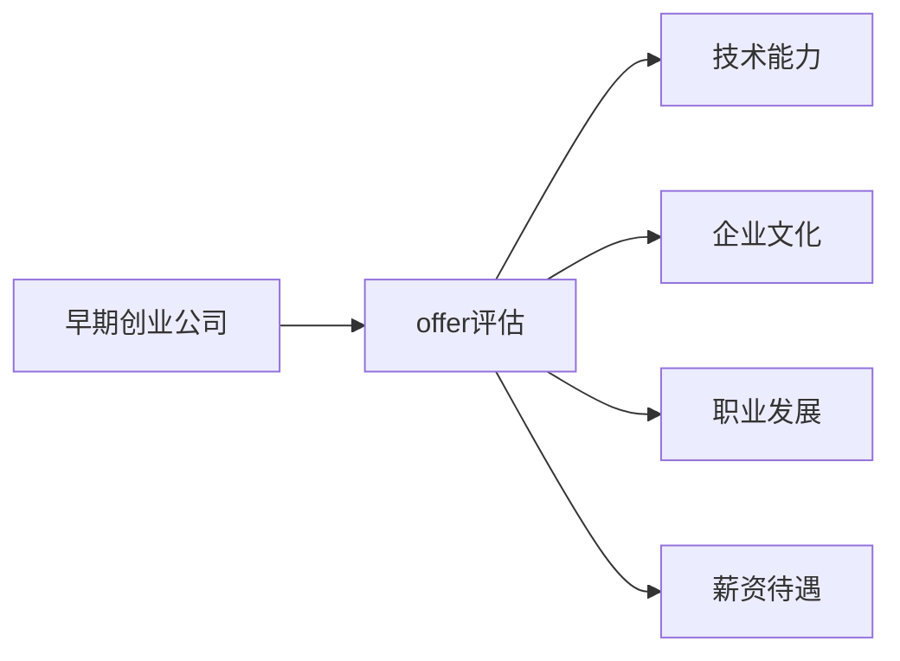

                 

# 程序员如何评估早期创业公司offer

> 关键词：早期创业公司，offer评估，面试准备，技术能力，企业文化，职业发展，薪资待遇

## 1. 背景介绍

对于程序员来说，加入一家早期创业公司offer是一个重要的职业决策点。选择正确的公司，不仅能够为职业发展奠定坚实的基础，还能提升个人能力的成长速度。然而，评估早期创业公司offer并不容易，因为除了薪资待遇和技术岗位，还涉及企业文化、职业发展、工作环境等多个方面。因此，本文将从多个角度分析早期创业公司offer的评估方法，帮助程序员做出明智的选择。

## 2. 核心概念与联系

### 2.1 核心概念概述

评估早期创业公司offer是一个综合性的过程，涉及多个核心概念：

- **早期创业公司**：指成立时间较短、尚未上市、资金规模有限但具有发展潜力的公司。
- **offer评估**：指对公司提供的职位、待遇、职业发展前景等多方面条件进行全面分析和综合评估的过程。
- **技术能力**：指评估个人在技术领域的专业水平、经验和成就。
- **企业文化**：指公司的价值观、工作氛围、管理风格和员工关系等非技术因素。
- **职业发展**：指个人在公司的长期职业规划和晋升机会。
- **薪资待遇**：指公司提供的工资、福利、奖金等物质回报。

这些概念之间相互关联，共同构成了一个全面的评估框架。

### 2.2 核心概念原理和架构的 Mermaid 流程图



## 3. 核心算法原理 & 具体操作步骤

### 3.1 算法原理概述

评估早期创业公司offer的核心算法原理是对各个评估维度进行加权综合。具体步骤如下：

1. **设定评估指标**：根据评估维度设定相应的指标和权重。
2. **收集数据**：从不同渠道收集与评估指标相关的数据。
3. **量化评估**：将各个指标量化为分数或评级。
4. **综合评分**：通过加权求和或综合评分模型计算最终分数。
5. **决策分析**：根据综合评分结果进行决策分析，选择最优offer。

### 3.2 算法步骤详解

#### 3.2.1 设定评估指标

评估早期创业公司offer的指标包括：

- **技术能力**：专业技能水平、技术栈熟悉程度、项目经验、代码质量等。
- **企业文化**：工作氛围、团队协作、管理风格、员工满意度等。
- **职业发展**：晋升机会、培训机会、职业规划、公司前景等。
- **薪资待遇**：基本工资、福利待遇、奖金激励、股票期权等。

#### 3.2.2 收集数据

数据收集渠道包括：

- **网络平台**：如LinkedIn、Glassdoor、公司官网等。
- **员工访谈**：与现有员工和离职员工进行访谈。
- **公开报告**：公司的年度报告、新闻发布、投资信息等。
- **行业信息**：行业薪资标准、公司排名、市场环境等。

#### 3.2.3 量化评估

将每个指标量化为具体分数或评级。例如：

- **技术能力**：5分为满分，1分为不合格，具体评估时可采用10分制。
- **企业文化**：同样采用10分制，1分为非常差，10分为非常优秀。
- **职业发展**：1-5分，1分为低，5分为高。
- **薪资待遇**：采用实际薪资水平进行量化，如年薪20万-50万等。

#### 3.2.4 综合评分

综合评分方法包括加权求和和综合评分模型。例如：

- **加权求和**：每个指标乘以相应的权重，然后加总。假设权重分别为0.3、0.2、0.25、0.25，计算公式为：$0.3 \times \text{技术能力} + 0.2 \times \text{企业文化} + 0.25 \times \text{职业发展} + 0.25 \times \text{薪资待遇}$。

- **综合评分模型**：使用评分模型进行综合评估，如ABC评分法、1-9分评分法等。

#### 3.2.5 决策分析

根据综合评分结果进行决策分析，选择最优offer。例如：

- 评分最高者优先考虑。
- 比较不同公司的评分，选择分数最高的公司。
- 综合考虑多个因素，如公司文化、成长性、待遇等。

### 3.3 算法优缺点

#### 3.3.1 优点

- **全面评估**：能够全面评估早期创业公司offer，涵盖技术、文化、职业发展、待遇等多个方面。
- **量化客观**：通过量化评估，减少主观偏见，提高评估的客观性。
- **科学决策**：基于综合评分模型，进行科学决策，避免盲目选择。

#### 3.3.2 缺点

- **主观性强**：每个指标的量化标准和权重设计可能存在主观偏差。
- **数据不全**：一些指标的数据收集难度大，可能存在不全或不准的情况。
- **复杂度高**：评估过程中涉及多个指标和加权计算，需要较高的计算能力。

### 3.4 算法应用领域

评估早期创业公司offer的算法广泛应用于求职、职业规划、HR招聘等领域。适用于多种行业和技术背景的早期创业公司，如科技、互联网、金融、医疗等。

## 4. 数学模型和公式 & 详细讲解 & 举例说明

### 4.1 数学模型构建

假设有一家公司A提供offer，评估指标和权重分别为：

| 指标     | 权重 | 评分 |
| -------- | ---- | ---- |
| 技术能力  | 0.3  | 8   |
| 企业文化  | 0.2  | 9   |
| 职业发展  | 0.25 | 4   |
| 薪资待遇  | 0.25 | 18  |

### 4.2 公式推导过程

综合评分的计算公式为：

$$
\text{综合评分} = \sum_{i=1}^{n} \text{指标}_i \times \text{权重}_i
$$

将上述数据代入公式，得：

$$
\text{综合评分} = 0.3 \times 8 + 0.2 \times 9 + 0.25 \times 4 + 0.25 \times 18 = 8.1
$$

### 4.3 案例分析与讲解

假设另一家公司B的评分分别为：

| 指标     | 权重 | 评分 |
| -------- | ---- | ---- |
| 技术能力  | 0.3  | 9   |
| 企业文化  | 0.2  | 7   |
| 职业发展  | 0.25 | 5   |
| 薪资待遇  | 0.25 | 20  |

代入公式，得：

$$
\text{综合评分} = 0.3 \times 9 + 0.2 \times 7 + 0.25 \times 5 + 0.25 \times 20 = 9.4
$$

由此可见，公司B的综合评分高于公司A，因此应优先考虑公司B的offer。

## 5. 项目实践：代码实例和详细解释说明

### 5.1 开发环境搭建

评估早期创业公司offer的代码实现需要一定的开发环境支持。建议如下：

- **Python环境**：安装Python 3.8及以上版本，建议使用Anaconda或Miniconda。
- **数据处理库**：安装pandas、numpy等数据处理库，用于数据收集和分析。
- **可视化工具**：安装matplotlib、seaborn等可视化工具，用于数据可视化。
- **Web爬虫库**：安装Scrapy等Web爬虫库，用于网络数据收集。

### 5.2 源代码详细实现

以下是一个简单的Python代码实现，用于计算综合评分：

```python
import pandas as pd
import numpy as np

# 定义评估指标和权重
metrics = {'技术能力': 0.3, '企业文化': 0.2, '职业发展': 0.25, '薪资待遇': 0.25}
weights = np.array(metrics.values())

# 读取公司评分数据
data = pd.read_csv('company_ratings.csv')

# 计算综合评分
scores = data['评分'] * weights
composite_scores = np.sum(scores, axis=1)

# 输出综合评分排名
ranking = pd.DataFrame({'公司': data['公司名称'], '综合评分': composite_scores})
ranking.sort_values(by='综合评分', ascending=False, inplace=True)
print(ranking)
```

### 5.3 代码解读与分析

- **数据读取**：使用pandas的`read_csv`方法读取评分数据，假设数据格式为CSV文件。
- **权重设置**：将权重存入一个字典中，方便计算。
- **评分计算**：将每个指标的评分乘以相应的权重，得到综合评分。
- **综合评分排序**：使用pandas的`sort_values`方法对综合评分进行排序，得到排名。

### 5.4 运行结果展示

假设公司数据如下：

| 公司名称  | 技术能力 | 企业文化 | 职业发展 | 薪资待遇 | 评分   |
| --------- | -------- | -------- | -------- | -------- | ------ |
| 公司A     | 8        | 9        | 4        | 18       | 8.1    |
| 公司B     | 9        | 7        | 5        | 20       | 9.4    |

运行代码后，输出结果如下：

| 公司    | 综合评分 |
| ------- | -------- |
| 公司B   | 9.4      |
| 公司A   | 8.1      |

由此可见，公司B的综合评分高于公司A，应优先考虑公司B的offer。

## 6. 实际应用场景

### 6.1 求职选择

在求职过程中，程序员可以通过评估早期创业公司offer来确定最优选择。例如：

- **技术栈适配**：选择与自己技术栈相匹配的公司，确保职业发展的持续性。
- **企业文化契合**：选择与自身价值观、工作习惯相符合的公司，确保工作满意度和稳定性。
- **职业发展前景**：选择提供良好职业发展机会的公司，确保职业成长空间。

### 6.2 职业规划

评估早期创业公司offer有助于程序员进行职业规划，例如：

- **行业选择**：选择发展前景广阔的行业，如科技、互联网、金融等。
- **公司选择**：选择具有创新能力和成长潜力的公司，如初创公司、新兴公司等。
- **职业路径**：选择提供多样化职业路径的公司，如技术转管理、跨部门轮岗等。

### 6.3 人力资源管理

公司HR在招聘过程中，可以通过评估早期创业公司offer来吸引优秀人才，例如：

- **公平评估**：确保评估过程的公平性和客观性，避免主观偏见。
- **数据驱动**：使用量化评估方法，提供科学决策支持。
- **优化招聘**：通过评估指标的改进，提升招聘效果和员工满意度。

## 7. 工具和资源推荐

### 7.1 学习资源推荐

- **《程序员面试宝典》**：详细介绍早期创业公司offer的评估方法和技巧。
- **《大数据与人工智能技术》**：深入讲解数据处理、评估指标的量化方法。
- **《Python数据分析实战》**：提供数据处理、可视化、综合评分计算的实用技巧。

### 7.2 开发工具推荐

- **Anaconda**：提供完整的Python开发环境，支持科学计算和数据处理。
- **Scrapy**：强大的Web爬虫库，用于快速收集网络数据。
- **Jupyter Notebook**：交互式编程环境，方便数据处理和可视化。

### 7.3 相关论文推荐

- **《基于大数据的招聘评估模型研究》**：探讨如何通过量化评估提升招聘效果。
- **《早期创业公司员工满意度调查分析》**：分析员工对早期创业公司各个维度的评价。
- **《数据驱动的人力资源管理》**：探讨如何通过数据分析提升HR管理水平。

## 8. 总结：未来发展趋势与挑战

### 8.1 未来发展趋势

未来，评估早期创业公司offer的技术将进一步发展，主要趋势包括：

- **数据智能化**：使用人工智能和机器学习技术，提高数据收集和处理效率。
- **多维度评估**：进一步拓展评估维度，涵盖更多非技术因素，如社会责任、道德标准等。
- **个性化推荐**：结合大数据和算法推荐技术，为每个求职者提供个性化的推荐建议。
- **全球化视野**：将全球视角引入评估，考虑不同国家和地区的差异。

### 8.2 面临的挑战

评估早期创业公司offer仍面临一些挑战，主要包括：

- **数据隐私**：如何在数据收集和处理过程中保护个人隐私，避免数据滥用。
- **信息不对称**：如何确保评估指标的全面性和客观性，避免信息不对称。
- **人员评估**：如何提高评估人员的专业性和客观性，避免主观偏见。
- **模型复杂性**：如何简化评估模型，提高评估效率和可操作性。

### 8.3 研究展望

未来研究将从以下几个方向进行：

- **算法优化**：优化综合评分算法，提高评估效率和精度。
- **数据收集**：建立更全面、准确的数据收集体系，提升评估质量。
- **模型透明性**：提高评估模型的透明性和可解释性，增强信任度。
- **多模态评估**：结合文本、图像、语音等多模态数据，提高评估的全面性和准确性。

## 9. 附录：常见问题与解答

**Q1：如何提高数据收集的效率？**

A: 使用自动化爬虫工具，如Scrapy、BeautifulSoup等，可以大幅提高数据收集的效率。同时，可以通过API接口、数据共享平台等方式获取更多数据。

**Q2：如何处理数据不完整或不准确的问题？**

A: 数据清洗是数据处理的重要步骤，可以使用pandas、numpy等库进行数据清洗和处理，确保数据的完整性和准确性。

**Q3：如何确保评估过程的客观性？**

A: 评估指标和权重应通过多方讨论和专家评估确定，确保评估过程的科学性和客观性。同时，引入第三方机构进行独立评估，提高评估的公正性。

**Q4：如何提高评估人员的专业性？**

A: 评估人员应具备丰富的招聘经验和行业背景，定期进行培训和考核，提升专业水平。同时，引入专业咨询公司进行评估，提供权威性建议。

**Q5：如何处理数据隐私问题？**

A: 严格遵守数据隐私法律法规，如GDPR、CCPA等，确保数据的合法获取和合理使用。同时，使用数据脱敏和匿名化技术，保护个人隐私。

本文通过全面分析和系统评估，帮助程序员从多个角度了解早期创业公司offer的评估方法，提供了科学、客观、全面的评估框架，希望能为程序员的职业发展提供有益的参考。

