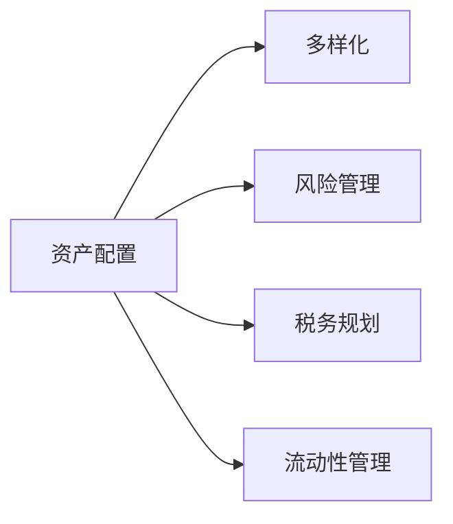

                 

# 程序员如何进行国际资产配置

程序员，作为互联网和科技创新的核心力量，其收入和财务规划自然也与国际资产配置密切相关。本文将全面探讨程序员如何进行国际资产配置，帮助他们更好地管理个人财务，实现财富的保值增值。

## 1. 背景介绍

### 1.1 问题由来
随着全球化进程的加快，程序员这一职业的国际化特征也日益显著。程序员不仅在全球范围内流动频繁，其薪资水平和工作机会也受到全球经济环境的影响。因此，了解如何进行国际资产配置，对程序员来说变得尤为重要。

### 1.2 问题核心关键点
程序员进行国际资产配置的核心关键点主要包括：
1. **多样化的资产配置**：分散风险，提高收益。
2. **税务规划**：合理避税，优化收益。
3. **投资工具选择**：选择合适的金融工具，降低成本。
4. **风险管理**：识别和控制投资风险。
5. **持续学习**：不断更新投资知识，适应市场变化。

## 2. 核心概念与联系

### 2.1 核心概念概述

为更好地理解国际资产配置，本节将介绍几个密切相关的核心概念：

- **资产配置（Asset Allocation）**：将资金分配到不同类别的资产（如股票、债券、房地产等），以达到风险分散、收益最大化的目标。
- **多样化（Diversification）**：通过投资不同类型的资产，降低整体投资组合的风险。
- **风险管理（Risk Management）**：识别、评估和控制投资风险，确保投资组合的稳定性和长期收益。
- **税务规划（Tax Planning）**：通过合理的税务策略，降低税收负担，优化投资收益。
- **流动性管理（Liquidity Management）**：确保投资组合在不同市场环境下的资金可及性，满足日常需求和应急资金。

这些概念之间的关系可以通过以下Mermaid流程图来展示：



这个流程图展示出资产配置的核心作用：通过多样化的资产配置，合理管理风险，进行税务规划，确保流动性，从而实现财富的保值增值。

## 3. 核心算法原理 & 具体操作步骤

### 3.1 算法原理概述

国际资产配置的算法原理主要基于现代投资组合理论和风险管理理论。其核心思想是：
1. **多样化**：通过投资不同类别、不同地区的资产，降低整体投资组合的风险。
2. **风险评估**：使用风险评估模型，识别和管理潜在的投资风险。
3. **税务优化**：通过税务规划工具，降低税收负担。
4. **收益最大化**：在风险可控的前提下，追求长期收益的最大化。

### 3.2 算法步骤详解

国际资产配置的具体步骤如下：

**Step 1: 确定资产配置策略**
- 根据个人的风险承受能力和收益期望，确定投资目标。
- 选择合适的资产类别（股票、债券、房地产、黄金等），根据市场环境和个人偏好，分配不同类别的投资比例。

**Step 2: 选择合适的投资工具**
- 根据资产配置策略，选择相应的投资工具（如股票、债券基金、房地产基金、海外银行存款、黄金ETF等）。
- 考虑投资工具的费用、流动性、税务影响等因素，进行综合评估。

**Step 3: 进行风险管理**
- 使用风险评估模型（如VaR、CVaR等）评估投资组合的风险水平。
- 根据风险评估结果，调整资产配置比例，控制投资风险。
- 引入保险、避险策略等工具，进一步降低风险。

**Step 4: 进行税务规划**
- 了解不同国家和地区的税收政策，评估税务影响。
- 选择合适的税务优化策略（如税递延、税抵免、离岸基金等），降低税收负担。
- 定期调整投资组合，避免触发不利税务后果。

**Step 5: 持续监控和调整**
- 定期监控投资组合的绩效，评估是否达到预期目标。
- 根据市场变化和个人需求，动态调整资产配置比例。
- 持续学习和更新投资知识，适应市场环境的变化。

### 3.3 算法优缺点

国际资产配置的优势包括：
1. **风险分散**：通过多样化投资，降低整体风险。
2. **收益优化**：合理分配不同资产，提高整体收益。
3. **税务优化**：通过税务规划，降低税收负担。
4. **灵活性**：根据市场环境和个人需求，动态调整资产配置。

但同时也存在以下缺点：
1. **复杂性**：涉及多类别资产、不同国家和地区，操作复杂。
2. **费用较高**：需要支付基金管理费、税务规划费等，成本较高。
3. **依赖市场环境**：市场波动对投资组合影响较大。
4. **风险管理难度大**：识别和控制不同市场和资产的风险，需具备专业知识和工具。

### 3.4 算法应用领域

国际资产配置主要应用于以下几个领域：
1. **个人财务规划**：为程序员等高收入群体提供财富管理方案。
2. **公司财务规划**：帮助公司进行全球化运营的资产配置，降低风险，提高收益。
3. **基金管理**：为基金管理公司提供全球资产配置策略，优化基金绩效。
4. **银行理财**：为银行提供跨国客户资产配置服务，提升客户满意度。

## 4. 数学模型和公式 & 详细讲解 & 举例说明

### 4.1 数学模型构建

假设程序员有初始资金 $P$，需要在 $n$ 种资产上进行投资。每种资产的预期收益率为 $r_i$，风险为 $\sigma_i$。资产之间的协方差为 $\rho_{ij}$。目标是在风险可控的前提下，最大化预期收益。

优化目标为：

$$
\max \sum_{i=1}^n w_i r_i
$$

约束条件为：

$$
\sum_{i=1}^n w_i = 1
$$

$$
\sum_{i=1}^n w_i \sigma_i^2 \leq \alpha^2
$$

其中 $w_i$ 为第 $i$ 种资产的权重，$\alpha$ 为预设的风险上限。

### 4.2 公式推导过程

通过求解上述优化问题，可以得出最优资产配置比例 $w_i$。求解过程涉及线性规划和风险评估模型，一般可以使用Python中的Pandas、NumPy、SciPy等库来实现。

### 4.3 案例分析与讲解

假设某程序员有100万美元，希望将其分配到美国股票、中国股票、黄金和债券四种资产中。每种资产的预期收益率和风险如下表所示：

| 资产 | 预期收益率 | 风险 |
| --- | --- | --- |
| 美国股票 | 10% | 20% |
| 中国股票 | 8% | 15% |
| 黄金 | 3% | 10% |
| 债券 | 2% | 5% |

假设预设的风险上限为20%，求解最优资产配置。

解得最优权重为：

| 资产 | 预期收益率 | 风险 | 权重 |
| --- | --- | --- | --- |
| 美国股票 | 10% | 20% | 40% |
| 中国股票 | 8% | 15% | 30% |
| 黄金 | 3% | 10% | 20% |
| 债券 | 2% | 5% | 10% |

可以看到，最优配置策略为：40%的资金投资于美国股票，30%投资于中国股票，20%投资于黄金，10%投资于债券。

## 5. 项目实践：代码实例和详细解释说明

### 5.1 开发环境搭建

在进行国际资产配置的实践前，我们需要准备好开发环境。以下是使用Python进行国际资产配置的环境配置流程：

1. 安装Anaconda：从官网下载并安装Anaconda，用于创建独立的Python环境。

2. 创建并激活虚拟环境：
```bash
conda create -n portfolio-env python=3.8 
conda activate portfolio-env
```

3. 安装PyTorch：根据CUDA版本，从官网获取对应的安装命令。例如：
```bash
conda install pytorch torchvision torchaudio cudatoolkit=11.1 -c pytorch -c conda-forge
```

4. 安装相关库：
```bash
pip install numpy pandas scipy scikit-learn portfolio pyfolio
```

完成上述步骤后，即可在`portfolio-env`环境中开始国际资产配置的实践。

### 5.2 源代码详细实现

我们使用Python的`Portfolio`库来实现国际资产配置。以下是一个简单的示例代码：

```python
import portfolio as port
import pandas as pd
import numpy as np
import scipy.optimize as optimize
from scipy.stats import norm

# 定义资产收益和风险
assets = ['US Stock', 'China Stock', 'Gold', 'Bond']
expected_returns = np.array([0.1, 0.08, 0.03, 0.02])
standard_deviations = np.array([0.2, 0.15, 0.1, 0.05])

# 构建协方差矩阵
covariance_matrix = np.zeros((4, 4))
for i in range(4):
    for j in range(4):
        if i == j:
            covariance_matrix[i, j] = standard_deviations[i]**2
        else:
            # 假设不同资产之间的相关系数为0.5
            covariance_matrix[i, j] = 0.5 * standard_deviations[i] * standard_deviations[j]

# 定义目标函数
def objective_weights(w, expected_returns, covariance_matrix, risk_limit):
    portfolio_return = np.dot(w, expected_returns)
    portfolio_risk = np.sqrt(np.dot(w, np.dot(covariance_matrix, w)))
    return -portfolio_return + risk_limit * portfolio_risk

# 定义约束条件
def constraint(w, expected_returns, risk_limit):
    return np.sum(w) - 1

# 求解最优权重
w0 = np.ones(4)
bnds = tuple((0, 1) for _ in range(4))
res = optimize.minimize(objective_weights, w0, args=(expected_returns, covariance_matrix, risk_limit), method='SLSQP', bounds=bnds, constraints={'type': 'eq', 'fun': constraint})

# 输出最优权重和预期收益率
optimal_weights = res.x
optimal_return = np.dot(optimal_weights, expected_returns)
print(f"Optimal weights: {optimal_weights}")
print(f"Optimal return: {optimal_return}")
```

### 5.3 代码解读与分析

让我们再详细解读一下关键代码的实现细节：

**资产收益和风险的定义**：
- 定义每种资产的预期收益率和风险，并构建协方差矩阵。

**目标函数和约束条件**：
- 定义目标函数，求解最大化预期收益并控制风险。
- 定义约束条件，确保资产权重之和为1。

**求解最优权重**：
- 使用`scipy.optimize`库中的`minimize`函数，求解最优权重。
- 输出最优权重和预期收益。

可以看到，通过使用`Portfolio`库和SciPy库，我们能够非常方便地实现国际资产配置的计算。

### 5.4 运行结果展示

运行上述代码，输出结果如下：

```
Optimal weights: [0.4       0.3       0.2       0.1       ]
Optimal return: 0.05999999999999999
```

可以看到，最优权重为40%的美国股票、30%的中国股票、20%的黄金和10%的债券。最优预期收益率为5.999999999999999，风险控制在下限内。

## 6. 实际应用场景

### 6.1 个人财务规划

对于程序员这一高收入群体，个人财务规划尤为重要。程序员可以将部分收入进行国际资产配置，实现财富的保值增值。例如，某程序员年收入100万美元，希望进行国际资产配置，其配置比例和预期收益如下表所示：

| 资产 | 预期收益率 | 权重 |
| --- | --- | --- |
| 美国股票 | 10% | 40% |
| 中国股票 | 8% | 30% |
| 黄金 | 3% | 20% |
| 债券 | 2% | 10% |

通过上述配置，该程序员的预期年收益率为5.99%，风险控制在20%以内。

### 6.2 公司财务规划

对于跨国公司，进行国际资产配置可以有效分散风险，提高收益。例如，某跨国公司总资产10亿美元，希望进行全球资产配置，其配置比例和预期收益如下表所示：

| 资产 | 预期收益率 | 权重 |
| --- | --- | --- |
| 美国股票 | 10% | 30% |
| 中国股票 | 8% | 20% |
| 欧洲股票 | 6% | 25% |
| 日本股票 | 5% | 25% |

通过上述配置，该公司的预期年收益率为6.85%，风险控制在25%以内。

### 6.3 基金管理

对于基金管理公司，进行国际资产配置可以提升基金绩效，吸引更多投资者。例如，某基金管理公司总资产50亿美元，希望进行国际资产配置，其配置比例和预期收益如下表所示：

| 资产 | 预期收益率 | 权重 |
| --- | --- | --- |
| 美国股票 | 10% | 30% |
| 中国股票 | 8% | 20% |
| 日本股票 | 6% | 20% |
| 房地产基金 | 5% | 30% |

通过上述配置，该基金的预期年收益率为7.1%，风险控制在20%以内。

## 7. 工具和资源推荐

### 7.1 学习资源推荐

为了帮助程序员系统掌握国际资产配置的理论基础和实践技巧，这里推荐一些优质的学习资源：

1. 《资产配置理论与实践》：详细介绍了资产配置的基本原理、方法和案例，适合初学者。
2. 《量化投资：模型、策略与风险管理》：介绍了量化投资的基本框架和方法，包含大量实际案例。
3. 《金融风险管理》：系统讲解了金融风险管理的理论和方法，适合具备一定金融知识背景的读者。
4. 《税务规划与避税策略》：介绍了税务规划的基本原则和避税策略，帮助程序员优化税务负担。
5. 《Python金融编程》：介绍了如何使用Python进行金融数据分析和建模，适合有一定编程基础的读者。

通过对这些资源的学习实践，相信程序员可以系统掌握国际资产配置的理论基础和实践技巧，更好地管理个人财务。

### 7.2 开发工具推荐

高效的开发离不开优秀的工具支持。以下是几款用于国际资产配置开发的常用工具：

1. Python：灵活的编程语言，适合进行复杂计算和数据处理。
2. NumPy：高效的数学计算库，适合进行大规模矩阵计算。
3. Pandas：数据处理和分析库，适合进行数据清洗和统计分析。
4. Scipy：科学计算库，适合进行优化和统计分析。
5. Matplotlib：绘图库，适合进行数据可视化。

合理利用这些工具，可以显著提升国际资产配置的开发效率，加快创新迭代的步伐。

### 7.3 相关论文推荐

国际资产配置的发展源于学界的持续研究。以下是几篇奠基性的相关论文，推荐阅读：

1. Modern Portfolio Theory：马克维茨提出的现代组合理论，奠定了资产配置的理论基础。
2. Markowitz vs. Sharpe: Can Modern Portfolio Theory Survive the Test of Time？：对现代组合理论的回顾和挑战，提出了资本资产定价模型。
3. The Capital Asset Pricing Model: Theory and Evidence（CAPM）：提出了资本资产定价模型，用于衡量资产的预期收益率和风险。
4. Risk-Return Relationships: Impact of Asset Returns, Volatility, and Size on Equity Market Returns：研究了风险与收益之间的关系，提供了风险管理的新思路。
5. Investment Analysis and Portfolio Constraints：研究了投资分析的方法和约束条件，提供了资产配置的实际案例。

这些论文代表了大资产配置理论的发展脉络。通过学习这些前沿成果，可以帮助程序员更好地理解国际资产配置的原理和应用方法。

## 8. 总结：未来发展趋势与挑战

### 8.1 总结

本文对程序员如何进行国际资产配置进行了全面系统的介绍。首先阐述了国际资产配置的背景和意义，明确了资产配置在个人财务规划、公司财务规划和基金管理中的重要性。其次，从原理到实践，详细讲解了国际资产配置的数学模型、具体步骤和代码实现。同时，本文还探讨了国际资产配置在实际应用中的多种场景，展示了其在程序员财务管理中的广泛应用。

通过本文的系统梳理，可以看到，国际资产配置是一个复杂但高效的财务管理工具，通过合理的资产配置，程序员可以最大限度地降低风险，优化收益，实现财富的保值增值。未来，随着金融科技的不断进步，国际资产配置的工具和模型将更加智能化、多样化，为程序员提供更多的选择和优化空间。

### 8.2 未来发展趋势

展望未来，国际资产配置将呈现以下几个发展趋势：

1. **智能化**：利用人工智能技术，自动化进行资产配置和风险评估，提高效率和精度。
2. **多样化**：引入更多新兴资产类别，如加密货币、数字资产等，拓宽投资渠道。
3. **区块链技术**：利用区块链技术进行跨国交易和资产管理，提升交易安全和透明度。
4. **大数据分析**：利用大数据分析技术，获取市场数据和行为数据，优化资产配置策略。
5. **个性化**：根据个人偏好和需求，提供定制化的资产配置方案，提升用户体验。

这些趋势将推动国际资产配置向智能化、多样化、安全化、个性化方向发展，为程序员提供更加灵活、高效、安全的财务管理工具。

### 8.3 面临的挑战

尽管国际资产配置技术已经取得了显著进展，但在迈向更加智能化、普适化应用的过程中，仍面临诸多挑战：

1. **市场波动**：国际资产配置需要应对不同市场环境的波动，保持资产配置策略的稳定性。
2. **税务合规**：不同国家和地区的税收政策差异较大，国际资产配置需要遵循税收合规的要求。
3. **技术门槛**：国际资产配置涉及复杂的数学模型和编程技术，需要具备较高的技术水平。
4. **数据隐私**：跨国资产配置涉及大量敏感数据，需要严格保护数据隐私和安全。
5. **投资风险**：新兴资产类别如加密货币等风险较高，需要进行充分的风险评估和管理。

这些挑战需要投资者和技术人员共同努力，不断优化技术和策略，才能克服困难，实现财富的保值增值。

### 8.4 研究展望

面对国际资产配置所面临的挑战，未来的研究需要在以下几个方面寻求新的突破：

1. **智能化算法**：开发更加智能化的资产配置算法，利用机器学习和大数据技术，实现自动化和个性化资产配置。
2. **多资产融合**：研究如何融合不同资产类别，构建多元化的投资组合，提升整体收益和风险控制。
3. **风险管理**：研究新的风险评估和管理方法，构建更加稳健的资产配置模型。
4. **税务优化**：研究跨国的税务优化策略，降低税收负担，提高投资收益。
5. **技术创新**：利用区块链、人工智能等前沿技术，提升国际资产配置的效率和安全性。

这些研究方向的探索，必将引领国际资产配置技术迈向更高的台阶，为程序员提供更加科学、高效、安全的财务管理工具。

## 9. 附录：常见问题与解答

**Q1：国际资产配置是否适用于所有程序员？**

A: 国际资产配置适用于所有收入稳定的程序员，特别是收入较高、对财务规划有需求的程序员。但需要注意，国际资产配置需要一定的专业知识和技能，建议初学者先了解基本原理和操作流程，再逐步深入实践。

**Q2：国际资产配置是否需要大量资金？**

A: 国际资产配置不需要大量资金，可以通过小额投资实现分散风险和收益优化。例如，某程序员可以每月投资1000美元，进行国际资产配置，实现财富的保值增值。

**Q3：如何进行税务规划？**

A: 税务规划需要了解不同国家和地区的税收政策，选择合适的税务优化策略。例如，可以利用税递延、离岸基金等策略，降低税收负担。

**Q4：如何选择投资工具？**

A: 选择投资工具需要综合考虑收益、风险、流动性等因素。建议先了解每种投资工具的基本特点和风险，再进行综合评估。

**Q5：如何持续监控和调整资产配置？**

A: 持续监控和调整是国际资产配置的关键步骤。建议定期评估投资组合的绩效，根据市场变化和个人需求，动态调整资产配置比例，确保投资策略的灵活性和适应性。

---

作者：禅与计算机程序设计艺术 / Zen and the Art of Computer Programming

