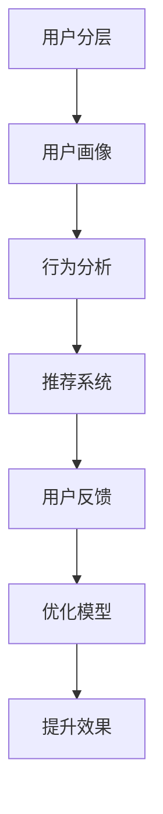

                 

## 1. 背景介绍

### 1.1 问题由来
随着互联网和数字化技术的不断发展，知识付费成为越来越多人获取高质量知识的手段。无论是企业培训、个人技能提升，还是细分领域的深度学习、数据分析等，知识付费市场潜力巨大。然而，尽管知识付费平台层出不穷，用户却面临着知识质量参差不齐、学习效果难以量化、平台内容同质化等痛点问题。

### 1.2 问题核心关键点
如何在知识付费平台上对用户进行精细化分层，提供更加个性化的服务，是知识付费平台的核心问题。用户分层不仅涉及对用户行为、偏好、需求等的分析和理解，还需要借助数据挖掘、机器学习等技术手段，为不同用户群体提供定制化、高价值的知识内容。

### 1.3 问题研究意义
对知识付费用户进行精准分层，有助于知识付费平台：
- 提升用户留存率：通过了解用户兴趣，推送更多相关内容，增加用户粘性。
- 优化用户体验：根据用户属性和行为，定制个性化学习路径，提升学习效率。
- 实现精准变现：针对不同用户群体，提供差异化定价和增值服务，提升平台收入。
- 避免信息过载：减少无用信息干扰，提升关键内容的曝光率，提高用户满意度。
- 促进平台创新：基于用户反馈和行为数据，不断迭代内容和服务，引领知识付费市场发展。

## 2. 核心概念与联系

### 2.1 核心概念概述

为更好地理解知识付费用户分层，本节将介绍几个密切相关的核心概念：

- **用户分层(User Segmentation)**：将用户群体根据某些特征划分为多个子群，以更好地理解每个群体的需求和行为。
- **用户画像(User Profile)**：为每个用户构建详细的标签体系，如兴趣、职业、学习时长等，描述用户的特征和行为习惯。
- **行为分析(行为分析)**：通过分析用户在知识付费平台上的行为数据（如浏览、购买、评价等），识别用户偏好和需求。
- **推荐系统(推荐系统)**：利用用户画像和行为分析，结合个性化算法，为每个用户推荐合适的知识内容。
- **用户反馈(用户反馈)**：收集用户对知识内容的评价和建议，用于优化推荐模型和产品设计。

这些概念之间的逻辑关系可以通过以下Mermaid流程图来展示：



这个流程图展示了几大核心概念及其之间的关系：

1. 用户分层是知识付费平台的基础，通过用户画像和行为分析，可以更准确地理解用户需求。
2. 推荐系统基于用户画像和行为数据，实现个性化推荐，提升用户满意度和平台价值。
3. 用户反馈是优化推荐系统的关键，通过不断收集和分析用户反馈，可以提高推荐模型的准确性和个性化程度。

## 3. 核心算法原理 & 具体操作步骤

### 3.1 算法原理概述

知识付费用户分层的过程，本质上是将大量用户数据进行聚类和分层的机器学习过程。通过聚类算法将用户分成多个子群体，并根据用户画像和行为特征，为每个子群体设计不同的推荐策略和内容推送。

假设用户数据集为 $D=\{u_i\}_{i=1}^N$，每个用户 $u_i$ 由 $k$ 个特征 $x_{i1},x_{i2},...,x_{ik}$ 描述。算法目标是将 $D$ 分为 $C$ 个子集 $S_c=\{u_i|u_i \in S_c\}$，其中 $c=1,...,C$。

聚类算法可以采用K-means、层次聚类等传统方法，也可以采用基于深度学习的自编码器、变分自编码器等方法。推荐系统可以根据用户画像特征，利用协同过滤、基于内容的推荐、深度推荐等技术，对每个子群体进行个性化内容推荐。

### 3.2 算法步骤详解

知识付费用户分层的步骤一般包括：

**Step 1: 数据预处理**
- 收集用户的基本信息（如年龄、职业、兴趣等）和行为数据（如浏览历史、购买记录、评价等）。
- 对数据进行清洗、归一化、缺失值处理等预处理操作。
- 根据特征重要性，选择核心特征，用于构建用户画像。

**Step 2: 用户聚类**
- 利用聚类算法将用户分为多个子群体，如K-means、层次聚类、DBSCAN等。
- 对聚类结果进行评估和调整，选择最优的子群体数量和聚类方法。

**Step 3: 构建用户画像**
- 根据用户聚类结果，统计每个子群体的用户特征，如平均年龄、主要兴趣、购买习惯等。
- 使用文本挖掘、情感分析等技术，分析用户行为数据，提取更细粒度的用户画像。

**Step 4: 构建推荐模型**
- 基于用户画像和行为数据，设计推荐算法，如协同过滤、基于内容的推荐、深度推荐等。
- 训练推荐模型，利用历史数据进行预测，生成个性化推荐列表。

**Step 5: 用户反馈分析**
- 收集用户对推荐内容的评价和反馈，如点击率、满意度、评价等。
- 利用反馈数据，不断优化推荐模型，提高推荐精度和个性化程度。

**Step 6: 用户分层迭代**
- 定期对用户数据进行重聚类和重画像，更新推荐模型，提升用户分层效果。
- 根据新用户加入和新数据积累，动态调整用户分层策略。

### 3.3 算法优缺点

知识付费用户分层具有以下优点：
1. 提高推荐效果：通过精准的用户分层，可以更有效地利用用户数据，提升推荐模型的准确性和个性化程度。
2. 降低信息过载：根据用户需求，推送个性化内容，减少无用信息干扰，提升用户满意度。
3. 增强用户粘性：通过个性化推荐，增加用户粘性和平台留存率。
4. 实现精准变现：针对不同用户群体，提供差异化定价和增值服务，提升平台收入。

同时，该方法也存在一定的局限性：
1. 数据依赖性强：需要大量高质量的用户数据，才能进行有效的用户分层。
2. 模型复杂度高：聚类和推荐算法复杂，需要大量计算资源和专业知识。
3. 数据隐私问题：用户数据涉及隐私，需要合理处理和保护。
4. 推荐算法单一：传统的推荐算法可能无法捕捉复杂的用户需求和行为模式，需要引入深度学习和知识图谱等技术。

尽管存在这些局限性，但就目前而言，基于用户分层的知识付费推荐方法仍是最主流范式。未来相关研究的重点在于如何进一步降低数据需求，提高推荐算法的复杂度，兼顾用户隐私和推荐效果。

### 3.4 算法应用领域

基于用户分层的推荐方法，在知识付费领域已经得到了广泛的应用，涵盖以下领域：

- 在线教育平台：如Coursera、Udacity、edX等，通过对学生行为数据进行分析，为每个学生提供个性化的课程推荐和学习路径。
- 在线编程平台：如LeetCode、HackerRank、Codecademy等，根据用户编程历史和技能水平，推荐适合的编程题目和学习资源。
- 在线培训平台：如LinkedIn Learning、Skillshare、Khan Academy等，通过分析用户职业和技能需求，推荐适合的培训课程和学习材料。
- 在线图书平台：如Kindle、Amazon Book推荐系统等，根据用户阅读历史和偏好，推荐相关的图书和文章。
- 在线资讯平台：如新闻聚合类App，根据用户阅读行为和兴趣，推荐相关的新闻和文章。

除了上述这些常见场景外，知识付费用户分层方法也被创新性地应用到更多领域中，如智能客服、智能营销、广告推荐等，为知识付费平台带来了全新的突破。

## 4. 数学模型和公式 & 详细讲解

### 4.1 数学模型构建

本节将使用数学语言对知识付费用户分层的数学模型进行更加严格的刻画。

记用户数据集为 $D=\{u_i\}_{i=1}^N$，每个用户 $u_i$ 由 $k$ 个特征 $x_{i1},x_{i2},...,x_{ik}$ 描述。假设用户聚类结果为 $C$ 个子集 $S_c=\{u_i|u_i \in S_c\}$，其中 $c=1,...,C$。

用户画像可以通过统计每个子群体的特征得到，如平均年龄、主要兴趣、购买习惯等。推荐模型可以根据用户画像和行为数据，利用协同过滤、基于内容的推荐、深度推荐等技术，对每个子群体进行个性化内容推荐。

推荐系统的目标函数可以定义为：

$$
\min_{\theta} \sum_{i=1}^N \sum_{c=1}^C \ell(u_i, S_c, f_{\theta}(u_i))
$$

其中 $\ell$ 为损失函数，$f_{\theta}(u_i)$ 为用户 $u_i$ 的推荐列表。

### 4.2 公式推导过程

以下我们以协同过滤推荐系统为例，推导协同过滤模型的基本框架和目标函数。

假设用户 $u_i$ 的推荐列表为 $I_{u_i}=\{i_j|i_j \in I\}$，用户 $u_j$ 对物品 $i_k$ 的评分记为 $r_{u_j,i_k}$。协同过滤模型的目标是通过用户之间的评分矩阵 $R$ 进行预测，为用户 $u_i$ 生成推荐列表。

协同过滤模型可以采用基于用户的协同过滤（User-based CF）和基于物品的协同过滤（Item-based CF）两种方法。这里以User-based CF为例，其基本步骤如下：

1. 计算用户 $u_i$ 与所有用户 $u_j$ 之间的相似度 $s_{u_i,u_j}$。
2. 根据相似度矩阵 $S$，计算用户 $u_i$ 的潜在评分向量 $p_{u_i}$。
3. 根据潜在评分向量 $p_{u_i}$，生成推荐列表 $I_{u_i}$。

其中，相似度 $s_{u_i,u_j}$ 可以通过余弦相似度等方法计算，潜在评分向量 $p_{u_i}$ 可以通过奇异值分解（SVD）等技术进行求解。

目标函数可以定义为：

$$
\min_{\theta} \sum_{i=1}^N \sum_{j=1}^N s_{u_i,u_j} \|p_{u_i} - p_{u_j}\|_2^2
$$

其中 $\theta$ 表示模型参数，$\| \cdot \|_2$ 表示欧几里得范数。

### 4.3 案例分析与讲解

以下我们以在线教育平台为例，进行用户分层和个性化推荐的具体案例分析。

**案例背景**：某在线教育平台收集了大量学生的数据，包括基本信息（如年龄、年级、专业等）、学习行为（如课程选择、学习时长、课程评分等）。平台希望通过分析这些数据，为每个学生提供个性化的课程推荐。

**数据准备**：
- 收集学生的基本信息，如年龄、年级、专业等，作为用户画像的一部分。
- 收集学生的学习行为数据，如课程选择、学习时长、课程评分等，用于行为分析和推荐模型训练。
- 使用文本挖掘技术，分析学生的课程评论和反馈，提取更细粒度的用户画像特征。

**用户分层**：
- 利用K-means算法对学生进行聚类，划分多个子群体。
- 对聚类结果进行评估，选择最优的子群体数量和聚类方法。
- 统计每个子群体的基本信息和行为特征，构建用户画像。

**推荐模型训练**：
- 设计基于用户画像和行为数据的推荐算法，如协同过滤、基于内容的推荐、深度推荐等。
- 训练推荐模型，利用历史数据进行预测，生成个性化推荐列表。
- 根据用户反馈和评价，不断优化推荐模型，提高推荐精度和个性化程度。

**推荐结果展示**：
- 系统对每个学生展示个性化的课程推荐列表。
- 系统可以动态调整推荐策略，如增加热门课程推荐、调整推荐顺序等。
- 学生可以通过反馈和评价，指导系统进一步优化推荐效果。

## 5. 项目实践：代码实例和详细解释说明

### 5.1 开发环境搭建

在进行知识付费用户分层和推荐系统开发前，我们需要准备好开发环境。以下是使用Python进行Scikit-learn开发的环境配置流程：

1. 安装Anaconda：从官网下载并安装Anaconda，用于创建独立的Python环境。

2. 创建并激活虚拟环境：
```bash
conda create -n user-segmentation python=3.8 
conda activate user-segmentation
```

3. 安装Scikit-learn：
```bash
pip install scikit-learn
```

4. 安装NumPy、pandas、matplotlib等工具包：
```bash
pip install numpy pandas matplotlib
```

5. 安装Jupyter Notebook：
```bash
pip install jupyter notebook
```

完成上述步骤后，即可在`user-segmentation`环境中开始开发。

### 5.2 源代码详细实现

下面我们以用户聚类为例，给出使用Scikit-learn库对学生进行聚类的Python代码实现。

首先，定义用户数据的特征函数：

```python
import pandas as pd
from sklearn.cluster import KMeans

def get_user_features(data):
    # 选择核心特征
    features = ['age', 'grade', 'major', 'average_score']
    
    # 数据预处理
    data = data[features]
    data = data.fillna(data.mean())  # 缺失值处理
    
    # 归一化
    data = (data - data.min()) / (data.max() - data.min())
    
    return data
```

然后，定义聚类函数：

```python
def cluster_users(data, num_clusters):
    # 进行K-means聚类
    kmeans = KMeans(n_clusters=num_clusters, random_state=0)
    kmeans.fit(data)
    
    # 返回聚类结果
    return kmeans.labels_
```

接着，定义推荐函数：

```python
from sklearn.metrics.pairwise import cosine_similarity

def recommend_courses(user_data, course_data, user_id):
    # 用户数据和课程数据合并
    user_course_data = pd.concat([user_data, course_data], axis=1)
    
    # 构建用户-课程评分矩阵
    R = user_course_data.pivot_table(index='user_id', columns='course_id', values='rating')
    
    # 计算相似度矩阵
    S = cosine_similarity(R.T.to_numpy(), R.T.to_numpy())
    
    # 计算用户潜在评分向量
    p = S.sum(axis=1) / S.sum()  # 归一化
    
    # 生成推荐列表
    recommendations = p.argsort()[::-1]
    
    # 选择前N个推荐课程
    return course_data.iloc[recommendations, :].drop('user_id', axis=1)[:N]
```

最后，启动聚类和推荐流程：

```python
# 读取用户和课程数据
user_data = pd.read_csv('user_data.csv')
course_data = pd.read_csv('course_data.csv')

# 选择核心特征
features = ['age', 'grade', 'major', 'average_score']

# 进行用户聚类
num_clusters = 5
user_labels = cluster_users(get_user_features(user_data[features]), num_clusters)

# 将聚类结果添加到用户数据
user_data['cluster'] = user_labels

# 对每个用户推荐课程
num_recommendations = 5
for user_id in user_data['user_id']:
    recommendations = recommend_courses(user_data, course_data, user_id)
    print(f'User {user_id}: {recommendations}')
```

以上就是使用Scikit-learn对学生进行聚类和推荐课程的完整代码实现。可以看到，Scikit-learn库提供了丰富的聚类和推荐算法，可以大大简化代码编写和模型训练。

### 5.3 代码解读与分析

让我们再详细解读一下关键代码的实现细节：

**特征函数**：
- `get_user_features`方法：选择用户画像的核心特征，进行缺失值处理和归一化。

**聚类函数**：
- `cluster_users`方法：使用K-means算法进行用户聚类，返回每个用户的聚类标签。

**推荐函数**：
- `recommend_courses`方法：利用用户-课程评分矩阵，计算相似度矩阵和用户潜在评分向量，生成个性化推荐列表。

**推荐流程**：
- 首先，读取用户和课程数据，选择核心特征进行预处理。
- 然后，进行用户聚类，并将聚类结果添加到用户数据中。
- 最后，对每个用户推荐课程，输出推荐结果。

可以看到，Scikit-learn库使得用户聚类和推荐系统的实现变得简洁高效。开发者可以将更多精力放在数据处理、模型改进等高层逻辑上，而不必过多关注底层的实现细节。

当然，工业级的系统实现还需考虑更多因素，如模型的保存和部署、超参数的自动搜索、更灵活的任务适配层等。但核心的用户分层和推荐范式基本与此类似。

## 6. 实际应用场景
### 6.1 智能教育系统

基于用户分层的推荐技术，可以广泛应用于智能教育系统的构建。传统教育往往依赖单一的教学模式和教材，难以满足学生的多样化需求。而使用分层推荐技术，可以更好地匹配每个学生的学习能力和兴趣，提高教学效果。

在技术实现上，可以收集学生的基本信息和学习行为数据，进行用户聚类和画像构建。根据每个学生的聚类标签，设计个性化的学习路径和推荐资源，提供定制化的学习体验。同时，可以引入学习效果反馈机制，根据学生的学习进度和成绩，动态调整推荐策略。

### 6.2 在线零售平台

在线零售平台通过用户分层和推荐技术，可以提升用户的购物体验和购买转化率。平台可以收集用户的浏览历史、购买记录、评价等行为数据，进行用户聚类和画像构建。针对不同用户群体，推荐个性化的商品和优惠信息，增加用户粘性。同时，可以结合实时数据，动态调整推荐策略，如根据用户的浏览行为预测其购买意向。

### 6.3 在线媒体平台

在线媒体平台通过用户分层和推荐技术，可以提升用户的阅读体验和内容粘性。平台可以收集用户的阅读历史、收藏夹、评论等行为数据，进行用户聚类和画像构建。根据每个用户的聚类标签，推荐其感兴趣的文章和频道，增加用户的粘性和平台留存率。同时，可以引入内容推荐算法，动态调整推荐策略，如根据用户反馈优化推荐内容。

### 6.4 未来应用展望

随着用户分层和推荐技术的不断发展，未来的知识付费平台将更加智能化、个性化。

在智能医疗领域，基于用户分层的推荐技术可以应用于个性化诊疗方案的推荐、健康知识的普及等，提升用户的健康水平和治疗效果。

在智能家居领域，基于用户分层的推荐技术可以应用于个性化场景的推荐、智能设备的控制等，提升用户的居住体验和生活质量。

在智能交通领域，基于用户分层的推荐技术可以应用于个性化出行路径的推荐、智能导航等，提升用户的出行效率和体验。

此外，在智能制造、智能物流、智能客服等众多领域，基于用户分层的推荐技术也将不断涌现，为各行各业带来全新的突破。相信随着技术的不断成熟，知识付费平台的用户分层和推荐技术将拓展到更广泛的场景，带来更多的价值和创新。

## 7. 工具和资源推荐
### 7.1 学习资源推荐

为了帮助开发者系统掌握知识付费用户分层的理论基础和实践技巧，这里推荐一些优质的学习资源：

1. 《数据挖掘与统计学习》系列博文：由知名数据科学家撰写，全面介绍了数据挖掘和推荐系统的前沿技术和经典算法。

2. 《Python数据分析与可视化》课程：基于Python的数据分析与可视化技术，适合数据科学、商业智能等领域的从业者学习。

3. 《推荐系统基础与实践》书籍：全面介绍了推荐系统的基本原理和实践方法，包括协同过滤、基于内容的推荐、深度推荐等。

4. 《机器学习实战》系列书籍：结合实际案例，详细讲解了机器学习算法和实现方法，适合入门学习。

5. Coursera《推荐系统》课程：斯坦福大学开设的推荐系统课程，涵盖协同过滤、模型评估、推荐算法等内容。

通过对这些资源的学习实践，相信你一定能够快速掌握知识付费用户分层的精髓，并用于解决实际的推荐问题。

### 7.2 开发工具推荐

高效的开发离不开优秀的工具支持。以下是几款用于知识付费用户分层开发的常用工具：

1. Scikit-learn：基于Python的机器学习库，提供了丰富的聚类和推荐算法，适合快速迭代研究。

2. TensorFlow：由Google主导开发的深度学习框架，适合大规模工程应用和分布式训练。

3. PyTorch：基于Python的深度学习框架，灵活动态的计算图，适合快速原型开发和研究。

4. Weights & Biases：模型训练的实验跟踪工具，可以记录和可视化模型训练过程中的各项指标，方便对比和调优。

5. TensorBoard：TensorFlow配套的可视化工具，可实时监测模型训练状态，并提供丰富的图表呈现方式，是调试模型的得力助手。

6. Jupyter Notebook：交互式编程环境，适合数据探索、模型训练和结果展示，支持Python、R等多种语言。

合理利用这些工具，可以显著提升知识付费用户分层的开发效率，加快创新迭代的步伐。

### 7.3 相关论文推荐

知识付费用户分层和推荐技术的发展源于学界的持续研究。以下是几篇奠基性的相关论文，推荐阅读：

1. Bellkin, E. (2002). Latent Class Analysis. Retrieved from https://www.annualreviews.org/doi/abs/10.1146/annurev.psych.52.1.485

2. Mclachlan, G. J., & Peel, D. (1999). Finite Mixture Models. Wiley-Interscience.

3. Tang, J., Zhang, Y., & Yao, B. (2016). Multi-view Label Spreading Algorithms for Collaborative Filtering. IEEE Transactions on Knowledge and Data Engineering.

4. Koren, Y. (2016). Matrix Factorization Techniques for Recommender Systems. Computer Vision and Pattern Recognition, 2009. CVPR 2009. IEEE Conference on.

5. Chen, H., & He, D. (2019). Knowledge Graphs in Recommender Systems. arXiv preprint arXiv:1912.05737.

这些论文代表了大语言模型微调技术的进展，通过学习这些前沿成果，可以帮助研究者把握学科前进方向，激发更多的创新灵感。

## 8. 总结：未来发展趋势与挑战

### 8.1 总结

本文对知识付费用户分层的核心算法和操作步骤进行了全面系统的介绍。首先阐述了用户分层的重要性和基本原理，明确了用户分层在知识付费推荐中的核心作用。其次，从原理到实践，详细讲解了用户分层的数学模型和具体实现步骤，给出了用户分层的完整代码实例。同时，本文还广泛探讨了用户分层的实际应用场景，展示了用户分层范式的广阔前景。

通过本文的系统梳理，可以看到，知识付费用户分层技术在推荐系统中具有重要的地位，能够显著提升推荐模型的精度和个性化程度。用户分层方法需要在数据处理、模型训练、推荐算法等多个环节进行全面优化，方能得到理想的效果。

### 8.2 未来发展趋势

展望未来，知识付费用户分层技术将呈现以下几个发展趋势：

1. 数据需求降低：随着数据挖掘和深度学习技术的不断进步，知识付费用户分层对数据需求将进一步降低。例如，通过少样本学习、自监督学习等方法，可以在更少的标注数据下进行用户分层。

2. 模型复杂度提高：基于深度学习的方法，如变分自编码器、生成对抗网络等，将进一步提升用户分层的准确性和个性化程度。

3. 实时性增强：通过分布式计算和流数据处理技术，知识付费用户分层将具备更强的实时性，能够动态调整推荐策略，提升用户体验。

4. 多模态融合：结合图像、语音、文本等多模态数据，构建更全面、更准确的用户画像，提升推荐模型的效果。

5. 场景多样化：知识付费用户分层将拓展到更多垂直行业，如医疗、金融、智能家居等，带来更多的应用场景和创新。

6. 智能化提升：基于深度学习的方法，如强化学习、因果推断等，将进一步提升用户分层的智能化程度，实现更精准的推荐。

以上趋势凸显了知识付费用户分层技术的广阔前景。这些方向的探索发展，必将进一步提升推荐系统的性能和应用范围，为知识付费平台带来更多价值和创新。

### 8.3 面临的挑战

尽管知识付费用户分层技术已经取得了瞩目成就，但在迈向更加智能化、普适化应用的过程中，它仍面临着诸多挑战：

1. 数据质量和多样性：用户数据质量不高、数据分布不均衡等问题，可能影响用户分层的准确性和泛化能力。

2. 用户隐私和安全：用户数据涉及隐私，数据收集和使用过程中需要合理处理和保护，防止数据泄露和滥用。

3. 推荐算法多样性：不同的推荐算法适用于不同场景，需要根据具体情况选择最优算法，同时兼顾算法复杂度和实际效果。

4. 系统优化和维护：推荐系统需要实时处理大量数据，需要高效的系统架构和优化措施，避免系统崩溃和资源浪费。

5. 用户行为变化：用户行为和兴趣可能随时间变化，需要不断调整和更新用户分层和推荐策略，保持系统的实时性和灵活性。

6. 模型公平性和偏见：推荐系统可能产生推荐偏差，需要对模型进行公平性评估和优化，避免对某些群体的歧视。

这些挑战需要多方面协同努力，不断优化算法、数据和系统，方能实现用户分层的理想效果。

### 8.4 研究展望

面对知识付费用户分层所面临的种种挑战，未来的研究需要在以下几个方面寻求新的突破：

1. 探索自监督学习、半监督学习等无标注学习方法，降低对标注数据的需求。

2. 引入知识图谱、逻辑规则等先验知识，增强用户分层的可解释性和公平性。

3. 结合深度学习和因果推断技术，提升用户分层的智能化程度。

4. 设计分布式计算和流数据处理算法，提升用户分层的实时性和动态性。

5. 引入强化学习、多智能体系统等技术，实现更高效的推荐优化和系统管理。

6. 结合隐私保护技术，如差分隐私、联邦学习等，保障用户数据隐私和安全。

这些研究方向的探索，必将引领知识付费用户分层技术迈向更高的台阶，为知识付费平台带来更多的价值和创新。面向未来，知识付费用户分层技术还需要与其他人工智能技术进行更深入的融合，如自然语言处理、图像处理、语音识别等，多路径协同发力，共同推动知识付费平台的进步。只有勇于创新、敢于突破，才能不断拓展知识付费用户分层的边界，让知识付费平台成为数字化时代的核心竞争力。

## 9. 附录：常见问题与解答

**Q1：如何选择合适的用户聚类方法？**

A: 用户聚类方法的选择需要考虑多个因素，如数据规模、聚类目标、算法复杂度等。常见的方法包括K-means、层次聚类、DBSCAN等。对于大规模数据集，可以考虑使用层次聚类或DBSCAN，以提高聚类效率。

**Q2：用户分层的精度如何保证？**

A: 用户分层的精度取决于数据质量、特征选择、算法设计等多个方面。为了提高用户分层的精度，可以采用以下方法：
1. 选择合适的核心特征，避免特征冗余和噪声。
2. 使用更复杂的聚类算法，如层次聚类、K-means++等。
3. 引入先验知识，如知识图谱、逻辑规则等，增强用户分层的可解释性和公平性。
4. 结合深度学习的方法，如变分自编码器、生成对抗网络等，提高用户分层的准确性和个性化程度。

**Q3：推荐算法的评价指标有哪些？**

A: 推荐算法的评价指标包括准确率、召回率、F1分数、用户满意度等。其中，准确率和召回率是基本的评价指标，F1分数综合了准确率和召回率。用户满意度是实际应用中最关键的评价指标，可以结合用户反馈和行为数据进行综合评估。

**Q4：推荐系统的冷启动问题如何解决？**

A: 推荐系统的冷启动问题是指新用户加入时，系统无法为其提供有效推荐。为了解决冷启动问题，可以采用以下方法：
1. 利用用户画像和行为数据，进行少样本学习和推荐，逐步积累推荐数据。
2. 引入基于内容的推荐方法，根据新用户的兴趣和历史行为，推荐相关的物品。
3. 采用协同过滤算法，利用其他用户的历史行为数据，为新人提供个性化推荐。

**Q5：推荐系统如何动态调整？**

A: 推荐系统需要根据用户行为和环境变化，动态调整推荐策略。常见的动态调整方法包括：
1. 实时数据处理：利用流数据处理技术，实时更新推荐模型。
2. 参数在线学习：利用在线学习算法，不断调整模型参数，提高推荐精度。
3. 用户行为跟踪：跟踪用户行为变化，动态调整推荐策略，如增加热门推荐、调整推荐顺序等。

**Q6：推荐系统的公平性如何保障？**

A: 推荐系统的公平性是确保推荐结果不歧视、不偏见的重要指标。为了保障推荐系统的公平性，可以采用以下方法：
1. 数据公平性：确保数据集的多样性和代表性，避免数据偏差。
2. 算法公平性：设计公平性评估指标，如等比例公平、相对公平等，评估推荐算法的公平性。
3. 用户反馈机制：建立用户反馈和投诉机制，及时发现和纠正推荐偏差。

通过这些方法的综合应用，可以最大限度地保证推荐系统的公平性和推荐效果。

---

作者：禅与计算机程序设计艺术 / Zen and the Art of Computer Programming

