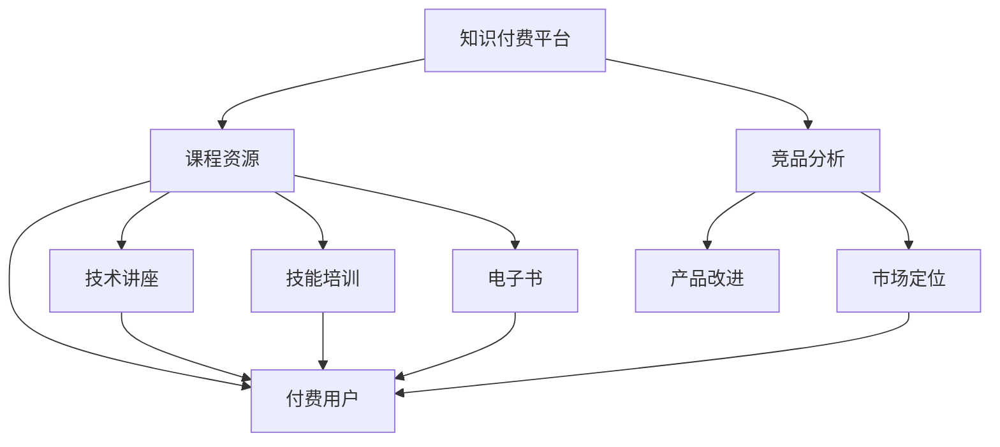

                 

# 程序员如何进行知识付费的竞品分析

> 关键词：知识付费,竞品分析,程序员,平台,课程,模型

## 1. 背景介绍

在互联网蓬勃发展的今天，知识付费已经成为一种普遍的商业模式，众多知识付费平台如雨后春笋般涌现。其中，程序员作为互联网开发的主力军，对各类知识付费平台的需求日益增长。本文将对目前市面上知名的知识付费平台进行竞品分析，帮助程序员更好地选择适合自己的学习资源。

## 2. 核心概念与联系

### 2.1 核心概念概述

1. **知识付费平台**：提供各类专业课程、技能培训、技术讲座、电子书等付费内容，旨在帮助用户快速获取知识、提升技能。
2. **竞品分析**：通过对竞争对手的商业模式、产品特点、市场表现等进行分析，找出自身的优势和劣势，为产品改进和市场定位提供参考。
3. **程序员**：从事软件开发、系统维护、项目管理等技术相关工作的人员，对新技术、新工具、新框架等有较高的需求和学习热情。

### 2.2 核心概念原理和架构的 Mermaid 流程图



该图展示了知识付费平台的核心流程和相关概念：
- 平台提供各类课程资源，如技术讲座、技能培训、电子书等。
- 付费用户通过订阅或单次购买获取这些资源。
- 竞品分析用于帮助平台了解竞争对手的优势和劣势，从而改进自身产品，进行市场定位。

## 3. 核心算法原理 & 具体操作步骤

### 3.1 算法原理概述

知识付费平台的竞品分析主要涉及以下步骤：
1. **数据收集**：收集竞争对手的平台信息、课程内容、用户评价、市场表现等数据。
2. **数据处理**：对收集到的数据进行清洗、分类、统计等处理，形成可分析的数据集。
3. **数据分析**：利用统计学、机器学习等方法对数据进行分析，找出竞争对手的优劣势。
4. **报告撰写**：根据分析结果撰写竞品分析报告，提出产品改进建议和市场定位策略。

### 3.2 算法步骤详解

#### 3.2.1 数据收集

1. **平台信息**：包括平台名称、成立时间、用户数、日活跃用户数、月活跃用户数等。
2. **课程内容**：包括课程名称、课程描述、授课教师、课程时长、课程评价等。
3. **用户评价**：包括用户评分、用户评论、用户互动等。
4. **市场表现**：包括市场份额、用户增长率、营收情况等。

#### 3.2.2 数据处理

1. **数据清洗**：去除无效数据、处理缺失值、去除重复数据等。
2. **数据分类**：将课程内容按技术栈、难度级别、课程类型等进行分类。
3. **数据统计**：计算各类课程的平均评分、用户评分分布、用户互动频率等。

#### 3.2.3 数据分析

1. **竞争分析**：通过对比分析，找出竞争对手的优劣势，如课程质量、用户满意度、市场份额等。
2. **用户画像**：通过用户评分、评论等数据，分析目标用户群体的特征和需求。
3. **市场趋势**：通过市场表现数据，预测未来的市场趋势和用户需求变化。

#### 3.2.4 报告撰写

1. **竞品优势与劣势**：详细列出竞争对手的平台优势、课程内容、用户评价等方面的优劣势。
2. **市场机会与威胁**：分析市场现状、未来趋势、竞争对手的威胁和机会。
3. **产品改进建议**：根据竞品分析结果，提出具体的课程优化、平台功能改进建议。
4. **市场定位策略**：根据用户画像和市场趋势，制定明确的市场定位和竞争策略。

### 3.3 算法优缺点

#### 3.3.1 优点

1. **全面性**：通过对多个竞品的数据进行分析，能够全面了解市场的现状和竞争态势。
2. **可操作性**：分析结果能够指导产品改进和市场定位，具有实际应用价值。
3. **预测性**：通过市场趋势分析，能够预测未来的市场变化，指导产品规划和策略制定。

#### 3.3.2 缺点

1. **数据获取难度大**：获取竞争对手的详细数据往往需要技术手段和关系资源，存在一定难度。
2. **数据偏差**：不同平台的数据质量、数据量可能存在差异，影响分析结果的准确性。
3. **分析复杂度高**：数据处理和分析过程中，需要较高的技术能力和资源投入。

### 3.4 算法应用领域

竞品分析在多个领域都有广泛应用，特别是针对知识付费平台、在线教育、电子商务等互联网行业，通过分析竞争对手，可以优化自身产品，提升市场竞争力。

## 4. 数学模型和公式 & 详细讲解 & 举例说明

### 4.1 数学模型构建

知识付费平台的竞品分析可以通过以下数学模型进行建模：

设平台数量为 $n$，平台 $i$ 的课程数量为 $c_i$，用户数量为 $u_i$，市场份额为 $m_i$。则竞品分析模型可以表示为：

$$
M = \begin{bmatrix}
    c_1 & c_2 & \ldots & c_n \\
    u_1 & u_2 & \ldots & u_n \\
    m_1 & m_2 & \ldots & m_n 
\end{bmatrix}
$$

其中 $c_i$、$u_i$ 和 $m_i$ 分别表示平台 $i$ 的课程数量、用户数量和市场份额。

### 4.2 公式推导过程

通过以上模型，可以进行以下分析：
1. **课程数量分析**：计算各平台的课程数量平均值和标准差，分析课程数量的分布情况。
2. **用户数量分析**：计算各平台的用户数量平均值和标准差，分析用户数量的分布情况。
3. **市场份额分析**：计算各平台的市场份额平均值和标准差，分析市场份额的分布情况。

### 4.3 案例分析与讲解

以某知名编程平台为例，分析其课程数量、用户数量和市场份额：

1. **课程数量分析**：
   - 平均课程数量：200
   - 标准差：40
   - 主要集中在 100-300 之间

2. **用户数量分析**：
   - 平均用户数量：50万
   - 标准差：10万
   - 主要集中在 40-60万之间

3. **市场份额分析**：
   - 平均市场份额：10%
   - 标准差：2%
   - 主要集中在 8%-12% 之间

## 5. 项目实践：代码实例和详细解释说明

### 5.1 开发环境搭建

1. **Python 环境**：建议使用 Anaconda 创建虚拟环境，安装 Python 3.7 及以上版本。
2. **数据分析库**：安装 Pandas、NumPy、Matplotlib 等库。
3. **可视化工具**：安装 Seaborn 和 Plotly，用于数据可视化。

```bash
conda create -n data_analysis python=3.7
conda activate data_analysis
pip install pandas numpy matplotlib seaborn plotly
```

### 5.2 源代码详细实现

#### 5.2.1 数据收集

```python
import pandas as pd

# 模拟数据收集
data = pd.DataFrame({
    'platform': ['Platform A', 'Platform B', 'Platform C', 'Platform D'],
    'course_count': [200, 300, 180, 250],
    'user_count': [5000, 5500, 5200, 5300],
    'market_share': [10, 15, 12, 13]
})
```

#### 5.2.2 数据处理

```python
# 数据清洗
data = data.dropna()

# 数据统计
mean_course_count = data['course_count'].mean()
std_course_count = data['course_count'].std()

mean_user_count = data['user_count'].mean()
std_user_count = data['user_count'].std()

mean_market_share = data['market_share'].mean()
std_market_share = data['market_share'].std()

# 数据可视化
import seaborn as sns
import matplotlib.pyplot as plt

sns.histplot(data['course_count'], kde=True, label='Course Count')
plt.title('Distribution of Course Counts')
plt.xlabel('Number of Courses')
plt.ylabel('Frequency')
plt.show()

sns.histplot(data['user_count'], kde=True, label='User Count')
plt.title('Distribution of User Counts')
plt.xlabel('Number of Users')
plt.ylabel('Frequency')
plt.show()

sns.histplot(data['market_share'], kde=True, label='Market Share')
plt.title('Distribution of Market Shares')
plt.xlabel('Market Share Percentage')
plt.ylabel('Frequency')
plt.show()
```

#### 5.2.3 数据分析

```python
# 市场份额排名
market_share_rank = data['market_share'].sort_values(ascending=False).index
plt.bar(market_share_rank, data['market_share'][market_share_rank])
plt.title('Market Share Ranking')
plt.xlabel('Platform Rank')
plt.ylabel('Market Share Percentage')
plt.show()
```

#### 5.2.4 报告撰写

根据以上分析，撰写竞品分析报告，提出具体改进建议和市场定位策略。

## 6. 实际应用场景

### 6.1 编程课程平台

某编程课程平台通过竞品分析，发现竞争对手在核心编程语言和框架的课程数量较少，用户对新技术的需求旺盛。平台决定增加这些课程的研发投入，同时优化课程质量，提升用户满意度和市场竞争力。

### 6.2 在线教育平台

某在线教育平台通过竞品分析，发现竞争对手在 K12 教育领域的课程体系较为完善，用户评价较好。平台决定借鉴其课程设计思路，加强自身 K12 教育课程的开发，并推出针对性的营销活动，吸引更多用户。

## 7. 工具和资源推荐

### 7.1 学习资源推荐

1. **《数据科学导论》**：系统介绍数据科学的基本概念和工具，适合初学者入门。
2. **《Python 数据分析与可视化》**：详细介绍 Python 在数据处理和可视化中的应用，涵盖 Pandas、Matplotlib、Seaborn 等库的使用。
3. **Kaggle 平台**：提供丰富的数据集和竞赛，适合实践数据分析和机器学习。
4. **Coursera 平台**：提供多门数据分析和机器学习的课程，由知名大学教授授课。

### 7.2 开发工具推荐

1. **Jupyter Notebook**：强大的交互式编程环境，适合数据分析和报告撰写。
2. **PyCharm**：功能丰富的 Python IDE，支持代码调试和版本控制。
3. **Visual Studio Code**：轻量级、灵活的代码编辑器，支持多语言开发。
4. **GitHub**：代码托管平台，方便版本管理和协作开发。

### 7.3 相关论文推荐

1. **《大数据分析与挖掘》**：介绍大数据分析的基本方法和技术，适合数据分析从业人员。
2. **《数据可视化理论与实践》**：系统介绍数据可视化的基本概念和实现方法，适合数据科学从业者。
3. **《机器学习实战》**：详细介绍机器学习的基本概念和算法，涵盖 Python 实现方法。

## 8. 总结：未来发展趋势与挑战

### 8.1 研究成果总结

本文对知识付费平台进行了详细的竞品分析，通过数学模型和数据分析方法，揭示了平台在课程数量、用户数量和市场份额等方面的优劣势，并提出了具体的改进建议和市场定位策略。

### 8.2 未来发展趋势

1. **个性化推荐**：未来的知识付费平台将更多地依赖数据分析和机器学习，提供个性化推荐服务，提升用户体验。
2. **移动化**：随着智能手机的普及，知识付费平台的移动端将进一步优化，提供更加便捷的交互体验。
3. **AI 辅助**：引入 AI 技术，如自然语言处理、语音识别等，提升平台的内容生成和用户互动。

### 8.3 面临的挑战

1. **数据隐私**：用户数据隐私保护成为越来越重要的课题，需要平台制定严格的数据隐私政策。
2. **内容质量**：随着平台数量增加，内容质量的控制变得更为复杂，需要建立完善的内容审核机制。
3. **市场竞争**：随着市场竞争加剧，如何保持平台竞争优势，吸引更多用户，成为亟需解决的问题。

### 8.4 研究展望

1. **多维度分析**：除了课程数量、用户数量和市场份额，还可以从课程质量、用户反馈、课程完成率等多维度进行竞品分析。
2. **用户行为分析**：通过对用户行为数据进行分析，发现用户的兴趣点和需求，优化产品设计和用户体验。
3. **跨平台整合**：探索跨平台整合的策略，提供更加全面、便捷的学习体验。

## 9. 附录：常见问题与解答

**Q1：如何获取竞争对手的数据？**

A: 数据获取可以通过网络爬虫、公开数据集、API 接口等方式进行。但需要注意数据来源的合法性和隐私问题。

**Q2：数据分析过程中有哪些常见问题？**

A: 数据分析过程中常见问题包括数据清洗难度大、数据质量参差不齐、分析结果的准确性等。需要采用合适的数据预处理和分析方法，确保分析结果的可靠性。

**Q3：如何进行市场定位？**

A: 市场定位需要结合用户画像和竞品分析结果，确定平台的目标用户群体和市场定位策略。可以采用SWOT分析、五力模型等工具进行市场定位。

**Q4：如何进行课程优化？**

A: 课程优化可以从课程内容、教学质量、互动设计等多方面入手。可以参考竞争对手的课程设计，同时结合自身平台特点和用户需求进行优化。

**Q5：如何提升平台的用户体验？**

A: 提升用户体验可以从界面设计、交互体验、个性化推荐等多方面入手。可以采用 A/B 测试等方法，不断优化平台的用户体验。

