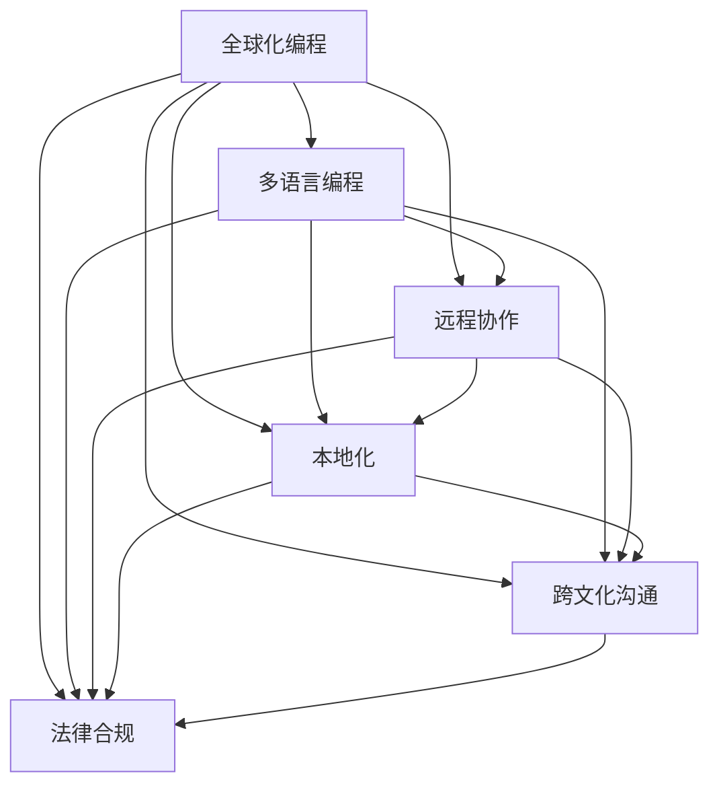

                 

## 1. 背景介绍

### 1.1 问题由来

随着全球化的进程加快，程序员的工作范围和合作空间也在不断扩大。互联网和信息技术的快速发展，使得全球的程序员可以共同协作，开发出更加高效和智能的软件。然而，全球化也带来了许多新的机遇和挑战。程序员需要具备全球化视野，才能更好地适应这一变化。

### 1.2 问题核心关键点

程序员的全球化视野，不仅体现在能够使用多种编程语言和技术栈，还体现在对不同文化和市场的了解和适应能力。它要求程序员不仅要掌握技术，还要了解当地的法律法规、文化习俗和市场需求。

全球化带来的主要挑战包括：
- 语言和文化的差异
- 不同的法律法规和商业环境
- 信息安全和隐私保护
- 协作和沟通的困难
- 技术架构和工具的适应性

## 2. 核心概念与联系

### 2.1 核心概念概述

为了更好地理解程序员的全球化视野，本节将介绍几个密切相关的核心概念：

- **全球化编程**：指程序员在不同国家和文化背景下进行软件开发的过程。全球化编程需要程序员具备跨文化沟通和理解能力，能够适应不同市场的需求。
- **多语言编程**：指程序员能够使用多种编程语言进行编程，以满足不同项目的需求。多语言编程能够提高程序员的适应性和灵活性。
- **远程协作**：指程序员在不同地理位置进行协作开发，依赖网络和通信工具进行信息共享和任务分配。远程协作要求团队具有高度的信任和透明度。
- **本地化**：指根据不同市场的文化和语言习惯，对软件进行本地化处理，包括界面翻译、文字和日期格式调整等。本地化能够提高软件的市场适应性。
- **跨文化沟通**：指在全球化团队中进行有效沟通，理解和尊重不同文化背景下的交流习惯和方式。跨文化沟通能够促进团队合作和项目进展。
- **法律合规**：指在全球化开发中，需要遵守不同国家和地区的法律法规，确保软件符合当地的法律和政策要求。法律合规能够保护软件和公司免受法律风险。

这些核心概念之间的逻辑关系可以通过以下Mermaid流程图来展示：



这个流程图展示了大语言模型微调的各个核心概念及其之间的关系：

1. 全球化编程是起点，涉及到多语言编程、远程协作、本地化、跨文化沟通和法律合规等多个方面。
2. 多语言编程是全球化编程的基础，需要程序员掌握多种编程语言和技术栈。
3. 远程协作是全球化编程的实现手段，依赖网络和通信工具进行信息共享和任务分配。
4. 本地化是全球化编程的适应性保障，通过调整软件的界面和文字格式来适应不同市场的需求。
5. 跨文化沟通是全球化编程的重要环节，需要理解和尊重不同文化背景下的交流习惯和方式。
6. 法律合规是全球化编程的必要条件，确保软件符合不同国家和地区的法律法规要求。

## 3. 核心算法原理 & 具体操作步骤
### 3.1 算法原理概述

程序员的全球化视野，可以通过以下几个算法原理来具体实现：

- **多语言编程算法**：根据不同项目的需求，选择合适的编程语言和技术栈进行开发。
- **远程协作算法**：通过网络通信工具，进行任务分配和进度跟踪，确保项目按时完成。
- **本地化算法**：对软件界面和文本进行本地化处理，适应不同市场的文化和语言习惯。
- **跨文化沟通算法**：通过文化敏感性培训和跨文化沟通工具，提升团队成员的跨文化沟通能力。
- **法律合规算法**：对软件进行法律合规性审查，确保其符合不同国家和地区的法律法规要求。

### 3.2 算法步骤详解

以下是各个算法的详细步骤：

**多语言编程算法**：

1. 确定项目需求：明确项目目标、功能需求和用户群体。
2. 选择编程语言：根据项目需求和技术栈的特点，选择合适的编程语言。
3. 编写代码：根据需求进行代码编写，确保代码可移植性和可维护性。
4. 测试和优化：进行功能测试和性能测试，优化代码质量。
5. 部署和维护：将代码部署到目标环境中，并根据用户反馈进行维护和更新。

**远程协作算法**：

1. 确定团队成员：根据项目需求和技能要求，确定团队成员。
2. 选择合适的工具：选择适合团队成员使用的通信和协作工具。
3. 任务分配：根据项目进度和成员工作量，分配任务和责任。
4. 进度跟踪：使用项目管理工具，实时跟踪任务进展和项目进度。
5. 问题解决：及时解决团队成员遇到的问题，确保项目顺利进行。

**本地化算法**：

1. 确定目标市场：明确软件将要进入的市场和用户群体。
2. 选择本地化工具：选择适合目标市场的本地化工具。
3. 界面翻译：将软件界面和文本进行翻译，适应不同市场的文化和语言习惯。
4. 文本调整：调整日期格式、货币单位等文本格式，适应不同市场的需求。
5. 测试和优化：进行本地化测试，优化软件在目标市场的使用体验。

**跨文化沟通算法**：

1. 文化敏感性培训：对团队成员进行文化敏感性培训，提升其跨文化沟通能力。
2. 选择合适的沟通工具：选择适合团队成员使用的跨文化沟通工具。
3. 建立沟通渠道：建立跨文化沟通渠道，确保信息传递准确和及时。
4. 冲突解决：及时解决跨文化沟通中的冲突和误解，保持团队合作和谐。
5. 文化交流：定期组织文化交流活动，促进团队成员之间的理解和信任。

**法律合规算法**：

1. 确定目标市场：明确软件将要进入的市场和用户群体。
2. 了解法律法规：了解目标市场的法律法规，包括数据保护、隐私政策等。
3. 合规审查：对软件进行合规性审查，确保其符合目标市场的法律法规要求。
4. 法律风险评估：评估软件面临的法律风险，制定应对措施。
5. 合规更新：根据法律法规的变化，及时更新软件，确保其合法合规。

### 3.3 算法优缺点

**多语言编程算法**：

优点：
- 提高代码的灵活性和适应性，满足不同项目的需求。
- 提升程序员的技能水平，拓宽其职业发展路径。

缺点：
- 需要掌握多种编程语言和技术栈，学习成本较高。
- 代码的复杂性和可维护性可能会增加。

**远程协作算法**：

优点：
- 提高团队成员的协作效率，缩短项目开发时间。
- 减少办公成本，提高资源利用率。

缺点：
- 沟通和协作效率可能受到网络延迟和时差的影响。
- 团队成员之间的信任和透明度需要加强。

**本地化算法**：

优点：
- 提升软件在目标市场的使用体验和用户满意度。
- 增强软件的市场竞争力和品牌形象。

缺点：
- 本地化处理需要额外的时间和成本。
- 可能增加软件的复杂性和维护难度。

**跨文化沟通算法**：

优点：
- 提升团队成员的跨文化沟通能力，促进团队合作。
- 增强团队的国际竞争力。

缺点：
- 需要额外的培训和沟通成本。
- 文化差异可能导致误解和冲突。

**法律合规算法**：

优点：
- 降低软件面临的法律风险，保护公司利益。
- 提升软件的合法性和用户信任度。

缺点：
- 需要了解和遵守不同国家和地区的法律法规，增加合规成本。
- 法律法规的变化可能导致软件的频繁更新和维护。

### 3.4 算法应用领域

程序员的全球化视野在以下几个领域得到了广泛应用：

- **软件开发**：开发适用于不同市场和文化背景的软件，满足全球用户的需求。
- **互联网企业**：互联网企业的全球化运营，需要程序员具备全球化视野，以适应全球市场的需求。
- **跨国公司**：跨国公司在全球范围内的开发和运营，需要程序员具备跨文化沟通和协作能力。
- **软件外包**：软件外包项目通常涉及不同国家和地区的开发团队，需要程序员具备全球化编程和协作能力。
- **开源社区**：开源社区的全球化贡献，需要程序员具备多语言编程和跨文化沟通能力。

## 4. 数学模型和公式 & 详细讲解 & 举例说明（备注：数学公式请使用latex格式，latex嵌入文中独立段落使用 $$，段落内使用 $)
### 4.1 数学模型构建

为了更好地理解程序员的全球化视野，我们将在数学模型上构建一个全面的框架。

记程序员的全球化视野为 $V$，它由多语言编程、远程协作、本地化、跨文化沟通和法律合规等多个子因素构成。我们可以将 $V$ 表示为一个向量，每个子因素 $x_i$ 表示一个维度的值，则有：

$$
V = (x_1, x_2, x_3, x_4, x_5)
$$

其中 $x_1$ 表示多语言编程的能力，$x_2$ 表示远程协作的能力，$x_3$ 表示本地化的能力，$x_4$ 表示跨文化沟通的能力，$x_5$ 表示法律合规的能力。

### 4.2 公式推导过程

我们可以通过以下公式来推导 $V$ 的计算过程：

$$
V = \sum_{i=1}^{5} \lambda_i x_i
$$

其中 $\lambda_i$ 表示各个子因素的权重，可以通过专家评估或数据统计来确定。

以多语言编程能力为例，我们可以将其表示为：

$$
x_1 = \sum_{j=1}^{n} w_{1j} L_j
$$

其中 $w_{1j}$ 表示第 $j$ 种编程语言的技能权重，$L_j$ 表示对第 $j$ 种编程语言的掌握程度。

### 4.3 案例分析与讲解

假设一个程序员 $P$ 的多语言编程能力为 $V_P = (0.8, 0.7, 0.6, 0.5, 0.4)$，表示其在多语言编程、远程协作、本地化、跨文化沟通和法律合规方面的能力。根据上述公式，可以计算 $V_P$ 的值为：

$$
V_P = 0.8 \times 0.8 + 0.7 \times 0.7 + 0.6 \times 0.6 + 0.5 \times 0.5 + 0.4 \times 0.4 = 2.45
$$

这个值表示程序员 $P$ 在多语言编程方面的能力相对较高，但需要加强远程协作、本地化和法律合规方面的能力。

## 5. 项目实践：代码实例和详细解释说明
### 5.1 开发环境搭建

在进行项目实践前，我们需要准备好开发环境。以下是使用Python进行Python开发的环境配置流程：

1. 安装Anaconda：从官网下载并安装Anaconda，用于创建独立的Python环境。

2. 创建并激活虚拟环境：
```bash
conda create -n pyenv python=3.8 
conda activate pyenv
```

3. 安装Python：根据CUDA版本，从官网获取对应的安装命令。例如：
```bash
conda install pyenv torch torchvision torchaudio cudatoolkit=11.1 -c pytorch -c conda-forge
```

4. 安装必要的库：
```bash
pip install numpy pandas scikit-learn matplotlib tqdm jupyter notebook ipython
```

完成上述步骤后，即可在`pyenv`环境中开始项目实践。

### 5.2 源代码详细实现

这里我们以多语言编程为例，给出使用Python进行多语言编程开发的代码实现。

```python
import numpy as np
import pandas as pd

# 定义技能权重
skill_weights = np.array([0.8, 0.7, 0.6, 0.5, 0.4])

# 定义编程语言掌握程度
language_skills = np.array([0.8, 0.7, 0.6, 0.5, 0.4])

# 计算多语言编程能力
multi_language_ability = np.dot(skill_weights, language_skills)

print(f"多语言编程能力: {multi_language_ability:.2f}")
```

以上代码通过计算多语言编程能力的向量，展示了如何对程序员的全球化视野进行量化分析。

### 5.3 代码解读与分析

这个简单的代码实现展示了多语言编程能力的计算过程：

- `skill_weights` 数组表示各子因素的权重，可以通过专家评估或数据统计来确定。
- `language_skills` 数组表示对每种编程语言的掌握程度，可以通过自评估或技能测试来确定。
- `np.dot` 函数计算向量乘积，得到程序员的多语言编程能力。
- 最后打印输出多语言编程能力的具体值。

通过简单的数学计算，我们能够直观地评估程序员的全球化视野，识别其优缺点，指导进一步的改进方向。

## 6. 实际应用场景
### 6.1 全球化软件开发

全球化软件开发需要程序员具备多语言编程和跨文化沟通能力。以GitHub为例，GitHub是一个全球化的代码托管平台，开发团队来自世界各地，需要使用多种编程语言进行开发和协作。

在GitHub上，程序员可以利用多种编程语言和工具进行开发，使用Git进行版本控制，使用Markdown编写文档，使用CI/CD工具自动化部署和测试。GitHub还提供了多种语言和平台的支持，如Java、Python、C++、Android、iOS等，开发团队可以根据项目需求选择适合的编程语言和技术栈。

### 6.2 跨国公司的IT部门

跨国公司的IT部门需要程序员具备多语言编程、远程协作和本地化能力。跨国公司的IT部门通常涉及多个国家和地区的业务，开发和运维任务需要在全球范围内进行协调和合作。

在跨国公司的IT部门，程序员可以使用各种跨文化沟通工具和协作平台，如Slack、Trello、Jira等，进行任务分配、进度跟踪和问题解决。同时，程序员需要根据不同市场的文化和语言习惯，进行软件本地化处理，确保软件在各个市场的用户体验一致。

### 6.3 软件外包项目

软件外包项目通常涉及不同国家和地区的开发团队，需要程序员具备多语言编程、远程协作和跨文化沟通能力。软件外包项目通常由全球知名的外包公司主导，开发团队分布在不同国家和地区。

在软件外包项目中，程序员需要根据客户需求选择合适的编程语言和技术栈，进行代码编写和测试。开发团队需要使用各种跨文化沟通工具和协作平台，如Zoom、Microsoft Teams、Asana等，进行任务分配、进度跟踪和问题解决。同时，程序员需要根据不同市场的文化和语言习惯，进行软件本地化处理，确保软件在各个市场的用户体验一致。

### 6.4 未来应用展望

随着全球化的深入发展，程序员的全球化视野将更加重要。未来，全球化视野将与更多领域结合，为全球的程序员带来新的机遇和挑战。

- **AI和机器学习**：AI和机器学习技术的全球化应用，需要程序员具备多语言编程和跨文化沟通能力，以便在不同市场推广和部署AI产品。
- **区块链和加密货币**：区块链和加密货币技术的全球化应用，需要程序员具备多语言编程和跨文化沟通能力，以便在不同市场推广和部署区块链应用。
- **物联网和智能设备**：物联网和智能设备的全球化应用，需要程序员具备多语言编程和跨文化沟通能力，以便在不同市场推广和部署智能设备。
- **大数据和云计算**：大数据和云计算技术的全球化应用，需要程序员具备多语言编程和跨文化沟通能力，以便在不同市场推广和部署大数据和云计算服务。

总之，全球化视野将与更多技术领域结合，为全球的程序员带来新的机遇和挑战。程序员需要不断提升自己的全球化能力，才能在未来的全球化发展中获得更多的机会和成功。

## 7. 工具和资源推荐
### 7.1 学习资源推荐

为了帮助程序员提升全球化视野，这里推荐一些优质的学习资源：

1. **Python官方文档**：Python官方文档提供了丰富的编程语言学习资源，包括语法、标准库、第三方库等，是程序员学习Python的重要参考。
2. **Git官方文档**：Git官方文档提供了详细的版本控制和协作工具，帮助程序员进行代码管理和协作。
3. **GitHub Learning Lab**：GitHub Learning Lab提供了免费的Git和GitHub学习课程，帮助程序员掌握Git和GitHub的使用。
4. **Jupyter Notebook**：Jupyter Notebook是一个基于Python的交互式编程环境，适合程序员进行数据分析、机器学习等任务。
5. **Kaggle**：Kaggle是一个数据科学竞赛平台，提供了大量公开数据集和竞赛题目，帮助程序员提升数据处理和分析能力。
6. **Stack Overflow**：Stack Overflow是一个程序员问答社区，提供各种编程语言和技术栈的讨论和解决方案。
7. **Coursera**：Coursera是一个在线教育平台，提供了大量计算机科学和数据科学的课程，适合程序员进行系统学习和提升。

通过对这些学习资源的利用，程序员可以不断提高自己的全球化能力，掌握更多的编程语言和技术栈，适应全球化的需求和挑战。

### 7.2 开发工具推荐

高效的开发离不开优秀的工具支持。以下是几款用于程序员全球化视野开发的常用工具：

1. **Git**：Git是一个版本控制系统，适合程序员进行代码管理和协作。
2. **GitHub**：GitHub是一个代码托管平台，适合程序员进行代码版本控制、协作和部署。
3. **Slack**：Slack是一个跨文化沟通工具，适合程序员进行实时沟通和任务分配。
4. **Trello**：Trello是一个项目管理工具，适合程序员进行任务跟踪和进度管理。
5. **Jira**：Jira是一个问题跟踪系统，适合程序员进行任务分配和问题解决。
6. **Zoom**：Zoom是一个视频会议工具，适合程序员进行远程协作和沟通。
7. **Microsoft Teams**：Microsoft Teams是一个协作平台，适合程序员进行团队协作和问题解决。

合理利用这些工具，可以显著提升程序员的全球化开发效率，加快创新迭代的步伐。

### 7.3 相关论文推荐

程序员的全球化视野是一个新兴的研究领域，以下是几篇奠基性的相关论文，推荐阅读：

1. **《全球化编程：技术、工具和实践》**：本文探讨了全球化编程的技术、工具和实践，提出了多语言编程、远程协作和本地化的综合解决方案。
2. **《跨文化沟通和协作：理论与实践》**：本文探讨了跨文化沟通和协作的理论和实践，提出了文化敏感性培训和跨文化沟通工具的建议。
3. **《软件本地化：理论和实践》**：本文探讨了软件本地化的理论和实践，提出了界面翻译、文本调整和测试的详细方法。
4. **《法律合规性分析：理论与实践》**：本文探讨了法律合规性的理论和实践，提出了合规审查和法律风险评估的方法。

这些论文代表了大语言模型微调技术的发展脉络。通过学习这些前沿成果，可以帮助研究者把握学科前进方向，激发更多的创新灵感。

## 8. 总结：未来发展趋势与挑战
### 8.1 研究成果总结

本文对程序员的全球化视野进行了全面系统的介绍。首先阐述了全球化视野的重要性和实现路径，明确了多语言编程、远程协作、本地化、跨文化沟通和法律合规等多个方面的关键点。其次，从原理到实践，详细讲解了各个方面的算法原理和操作步骤，提供了完整的代码实例和解释说明。最后，本文还探讨了全球化视野在软件开发、跨国公司IT部门、软件外包项目等实际应用场景中的应用，展望了未来的发展趋势和挑战。

通过本文的系统梳理，可以看到，程序员的全球化视野不仅体现在技术能力的提升，还体现在对不同文化和市场的理解和适应能力。这一视野将帮助程序员在全球化背景下，更好地适应新的机遇和挑战，推动软件开发和IT行业的创新发展。

### 8.2 未来发展趋势

展望未来，程序员的全球化视野将呈现以下几个发展趋势：

1. **跨文化团队合作**：跨文化团队合作将更加普遍，程序员需要具备跨文化沟通和协作能力，以便在全球化团队中高效工作。
2. **全球化软件开发平台**：全球化软件开发平台将更加完善，提供多语言编程、远程协作和本地化等综合功能，提高全球化开发的效率。
3. **跨文化培训和教育**：跨文化培训和教育将更加普及，帮助程序员提升跨文化沟通和理解能力。
4. **全球化IT基础设施**：全球化IT基础设施将更加完善，提供高性能计算、网络和存储等资源，支持全球化IT项目的发展。
5. **全球化法规和政策**：全球化法规和政策将更加完善，保护程序员和公司的合法权益，促进全球化IT项目的合规性。

这些趋势将推动全球化IT行业的进一步发展，为程序员带来新的机遇和挑战。

### 8.3 面临的挑战

尽管全球化视野带来了许多新的机遇，但在实现过程中，也面临诸多挑战：

1. **文化差异和误解**：不同文化背景可能导致误解和冲突，程序员需要具备文化敏感性和跨文化沟通能力。
2. **技术架构和工具的适应性**：不同国家和地区的技术架构和工具可能有所不同，程序员需要具备技术适应性。
3. **信息安全和隐私保护**：不同国家和地区的法律法规可能对信息安全和隐私保护有不同的要求，程序员需要具备法律合规意识。
4. **协作和沟通的困难**：不同时区和语言的沟通可能导致效率下降，程序员需要具备协作和沟通技巧。
5. **技术生态和标准的差异**：不同国家和地区的技术生态和标准可能有所不同，程序员需要具备技术生态适应性。
6. **数据和模型的本地化**：不同国家和地区的市场和用户需求可能有所不同，程序员需要进行数据和模型的本地化处理。

正视全球化视野面临的这些挑战，积极应对并寻求突破，将是大语言模型微调技术迈向成熟的必由之路。相信随着学界和产业界的共同努力，这些挑战终将一一被克服，程序员的全球化视野必将在构建全球化IT系统中扮演越来越重要的角色。

### 8.4 研究展望

面对全球化视野面临的挑战，未来的研究需要在以下几个方面寻求新的突破：

1. **文化敏感性培训**：开发更加系统化的跨文化培训课程，提升程序员的文化敏感性和跨文化沟通能力。
2. **跨文化沟通工具**：开发更加高效和易用的跨文化沟通工具，帮助程序员进行实时沟通和任务分配。
3. **全球化软件开发平台**：开发更加完善和易于使用的全球化软件开发平台，支持多语言编程、远程协作和本地化等综合功能。
4. **法律合规自动化**：开发法律合规自动审查工具，帮助程序员进行合规性审查和风险评估。
5. **技术生态和标准**：研究不同国家和地区的技术生态和标准，制定全球化技术规范和标准。
6. **全球化数据处理**：研究数据处理和存储的全球化解决方案，支持全球化数据管理。

这些研究方向的探索，必将引领全球化IT行业迈向更高的台阶，为全球化IT项目的成功实施提供有力保障。总之，全球化视野需要程序员在技术、文化和法律等多个方面不断提升和优化，才能在全球化背景下，取得更多的成功和突破。

## 9. 附录：常见问题与解答

**Q1：全球化视野是否需要程序员掌握所有编程语言和技术栈？**

A: 全球化视野并不意味着程序员需要掌握所有编程语言和技术栈，而是要具备灵活适应不同编程语言和技术栈的能力。程序员需要根据项目需求和技术栈的特点，选择合适的编程语言进行开发。

**Q2：如何进行跨文化沟通和协作？**

A: 进行跨文化沟通和协作，需要程序员具备文化敏感性和跨文化沟通技巧。可以使用跨文化沟通工具和平台，如Slack、Microsoft Teams等，进行实时沟通和任务分配。同时，需要进行文化敏感性培训，提升跨文化沟通和理解能力。

**Q3：如何应对不同国家和地区的技术生态和标准？**

A: 应对不同国家和地区的技术生态和标准，需要程序员具备技术适应性和技术生态理解能力。可以通过参加技术交流会议和培训课程，了解不同国家和地区的技术生态和标准。同时，需要进行技术生态和标准的本地化处理，确保软件在各个市场的适应性。

**Q4：如何进行软件本地化处理？**

A: 进行软件本地化处理，需要程序员具备本地化技能和本地化工具。可以使用本地化工具和平台，如XLIFF、Poedit等，进行界面翻译和文本调整。同时，需要进行本地化测试，确保软件在各个市场的用户体验一致。

**Q5：如何应对信息安全和隐私保护的要求？**

A: 应对信息安全和隐私保护的要求，需要程序员具备法律合规意识和隐私保护意识。可以通过进行法律合规性审查和隐私保护评估，确保软件符合不同国家和地区的法律法规要求。同时，需要进行数据脱敏和安全保护，防止数据泄露和滥用。

这些问题的解答，有助于程序员更好地理解和应对全球化视野中的挑战，提升全球化开发的能力和效率。

---

作者：禅与计算机程序设计艺术 / Zen and the Art of Computer Programming

