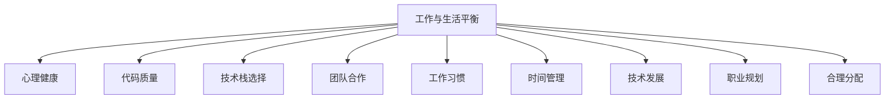

                 

# 程序员的工作与生活平衡：实现之道

> 关键词：程序员,工作与生活平衡,心理健康,代码质量,技术栈,团队合作,工作习惯,时间管理,技术发展,职业规划

## 1. 背景介绍

### 1.1 问题由来
在科技高速发展的时代，程序员成为了推动社会进步的核心力量之一。然而，由于工作强度大、压力大，许多程序员面临着身心健康、职业发展等难题。如何在高强度的工作中保持生活的平衡，成为了许多程序员共同关注的话题。

### 1.2 问题核心关键点
本文旨在探讨程序员如何在高压的工作环境中实现工作与生活的平衡，提出了多个策略，包括时间管理、团队合作、技术栈选择、职业规划等。旨在帮助程序员摆脱职业倦怠，提升工作效率和生活质量。

### 1.3 问题研究意义
实现工作与生活平衡对于程序员的身心健康和长期职业发展具有重要意义。不仅能够提高工作效率，还能增强创造力和团队协作能力。本文通过分析程序员面临的困境和成功案例，旨在为更多程序员提供实用的建议和指导。

## 2. 核心概念与联系

### 2.1 核心概念概述

为更好地理解工作与生活平衡的实现之道，本节将介绍几个密切相关的核心概念：

- **工作与生活平衡**：指在工作和生活中找到一种合理的分配，既能够高效完成任务，又能够保证生活的其他方面得到充分关注和享受。
- **心理健康**：指在长时间高强度工作压力下，保持良好的心理状态和情绪稳定。
- **代码质量**：指代码的可读性、可维护性、可扩展性等，高质量的代码能够提高开发效率和产品质量。
- **技术栈选择**：指在开发项目时，选择合适的技术组合和工具集，以提高开发效率和降低维护成本。
- **团队合作**：指在团队中合理分配任务、沟通协作、共同解决问题，提高工作效率和团队凝聚力。
- **工作习惯**：指在工作中的行为规范和习惯，如时间管理、任务优先级、文档记录等，能够提高工作效率和生活质量。
- **时间管理**：指通过有效规划和分配时间来提高工作和生活质量，避免因时间管理不善而导致的过度工作和疲劳。
- **技术发展**：指不断学习新技术，提升自身技术能力和竞争力，以适应不断变化的市场需求。
- **职业规划**：指在职业生涯中明确目标，制定短期和长期计划，确保职业发展的可持续性和方向性。

这些核心概念之间的逻辑关系可以通过以下Mermaid流程图来展示：



这个流程图展示了一些关键概念之间的关联：

1. **工作与生活平衡**：是所有概念的核心，其他概念均围绕其展开。
2. **心理健康**：是保证工作与生活平衡的重要因素。
3. **代码质量**：与工作习惯和团队合作密切相关，影响工作效率和产品质量。
4. **技术栈选择**：影响开发效率和维护成本。
5. **团队合作**：通过合理分配任务和沟通协作，提高工作效率和团队凝聚力。
6. **工作习惯**：直接影响时间管理和工作效率。
7. **时间管理**：是实现工作与生活平衡的基础。
8. **技术发展**：通过不断学习新技术，提升自身技术能力和竞争力。
9. **职业规划**：确保职业发展的可持续性和方向性。

这些概念共同构成了程序员实现工作与生活平衡的理论框架，为其提供了全面的指导。

## 3. 核心算法原理 & 具体操作步骤
### 3.1 算法原理概述

实现工作与生活平衡的算法原理主要涉及时间管理、任务优先级、团队协作等多个方面。核心思想是通过合理分配时间和资源，提高工作效率，减少不必要的加班，从而实现生活的平衡。

### 3.2 算法步骤详解

基于工作与生活平衡的算法，通常包括以下几个关键步骤：

**Step 1: 自我评估**
- 识别当前的工作和生活状态，评估自身的工作强度和心理压力。
- 列出影响工作与生活平衡的关键因素，如工作时间、任务优先级、团队合作等。

**Step 2: 设定目标**
- 根据自我评估结果，设定短期和长期的工作与生活平衡目标，如每天工作8小时、每周休息2天等。
- 制定具体的行动计划，如工作时间安排、任务分配、休息时间等。

**Step 3: 时间管理**
- 使用时间管理工具，如Pomodoro Technique、时间矩阵等，合理分配工作和生活时间。
- 避免过度工作，设定每日工作时间上限和午休时间。
- 避免加班文化，设定明确的工作时间和加班机制。

**Step 4: 任务优先级**
- 使用任务管理工具，如Trello、Asana等，列出当前任务，根据重要性和紧急性进行优先级排序。
- 优先完成高优先级任务，避免时间浪费在低价值任务上。
- 学会拒绝非必要的任务，保持专注和高效。

**Step 5: 团队合作**
- 与团队成员建立良好的沟通和协作机制，明确任务分配和责任分工。
- 使用协作工具，如Slack、Microsoft Teams等，提高团队沟通效率。
- 定期进行团队会议，解决协作中的问题和挑战。

**Step 6: 工作习惯**
- 养成每日记录任务和进度的习惯，确保任务有序推进。
- 定期进行代码审查和文档编写，提升代码质量和可维护性。
- 学习新技术和工具，提升自身技术能力和工作效率。

**Step 7: 技术发展**
- 定期参加技术培训和研讨会，保持对新技术的敏感性和学习热情。
- 订阅技术博客和论坛，及时了解行业动态和最佳实践。
- 参与开源项目和社区活动，积累实际经验和技术交流。

**Step 8: 职业规划**
- 定期进行职业目标的审视和调整，确保职业路径符合自身兴趣和发展方向。
- 制定短期和长期职业规划，如学习新技能、申请更高职位等。
- 寻找导师和职业指导，获取更多职业发展的建议和支持。

通过上述步骤，程序员可以逐步实现工作与生活的平衡，提升工作效率和生活质量。

### 3.3 算法优缺点

工作与生活平衡的算法具有以下优点：
1. 提升工作效率：通过合理的时间管理和任务优先级，能够更高效地完成工作任务，减少加班和过度工作。
2. 改善心理健康：合理安排工作和生活时间，避免因工作压力过大导致的心理问题。
3. 增强团队协作：通过明确任务分配和沟通机制，提高团队协作效率和凝聚力。
4. 提升技术能力：通过不断学习新技术和参与项目，保持自身技术水平和竞争力的持续提升。
5. 优化职业规划：通过明确职业目标和发展路径，确保职业发展的可持续性和方向性。

同时，该算法也存在一些局限性：
1. 对自我管理要求高：需要程序员具备良好的自我管理能力和自律性。
2. 对环境依赖性强：需要团队和管理层的大力支持和配合，才能顺利实施。
3. 缺乏灵活性：需要根据实际情况不断调整和优化，才能真正适应不同的工作和生活环境。

尽管存在这些局限性，但通过合理规划和执行，工作与生活平衡的算法依然能够帮助程序员提升工作效率和生活质量，实现更加健康和可持续的职业发展。

### 3.4 算法应用领域

工作与生活平衡的算法适用于多种应用场景，如软件开发、项目管理、团队协作等。

- **软件开发**：通过合理的时间管理和任务优先级，提升代码质量和开发效率。
- **项目管理**：通过明确任务分配和沟通机制，提高项目管理的效率和团队凝聚力。
- **团队协作**：通过良好的团队沟通和协作，增强团队成员之间的理解和信任，提升整体工作效率。

除了上述这些经典场景外，工作与生活平衡的算法还可以应用于更多领域，如教育、医疗等，帮助相关从业人员提升工作和生活质量，实现职业与生活的和谐发展。

## 4. 数学模型和公式 & 详细讲解 & 举例说明

### 4.1 数学模型构建

为了更严谨地阐述工作与生活平衡的算法，我们可以构建一个数学模型。假设程序员每天可用的总时间为 $T$，其中 $W$ 为工作时间， $L$ 为生活时间，目标是在 $W$ 和 $L$ 之间找到一个最优分配，使得总效用 $U(W,L)$ 最大化。

假设每个单位工作时间的效用为 $U_W$，每个单位生活时间的效用为 $U_L$，则目标函数为：

$$
U(W,L) = U_W \cdot W + U_L \cdot L
$$

约束条件为：

$$
W + L = T
$$

其中 $W$ 和 $L$ 均为非负变量。

### 4.2 公式推导过程

为了求解上述优化问题，我们可以使用拉格朗日乘数法，构造拉格朗日函数 $L(W,L,\lambda)$：

$$
L(W,L,\lambda) = U_W \cdot W + U_L \cdot L + \lambda(T - W - L)
$$

对 $W$、$L$ 和 $\lambda$ 求偏导，得到以下方程组：

$$
\begin{cases}
\frac{\partial L}{\partial W} = U_W + \lambda = 0 \\
\frac{\partial L}{\partial L} = U_L - \lambda = 0 \\
\frac{\partial L}{\partial \lambda} = T - W - L = 0
\end{cases}
$$

解得：

$$
W = \frac{U_W}{U_W + U_L} \cdot T
$$

$$
L = \frac{U_L}{U_W + U_L} \cdot T
$$

其中 $U_W$ 和 $U_L$ 分别为工作和生活时间的效用。

### 4.3 案例分析与讲解

假设某程序员每天可用的总时间为 $T=8$ 小时，其单位工作时间的效用 $U_W=0.8$，单位生活时间的效用 $U_L=1.2$。则根据上述公式，可以计算得到最优的工作和生活时间分配为：

$$
W = \frac{0.8}{0.8 + 1.2} \cdot 8 = 4.63
$$

$$
L = \frac{1.2}{0.8 + 1.2} \cdot 8 = 3.37
$$

即最优的工作时间为 4.63 小时，生活时间为 3.37 小时。这一分配能够最大化程序员的总效用。

## 5. 项目实践：代码实例和详细解释说明
### 5.1 开发环境搭建

在进行工作与生活平衡的算法实践前，我们需要准备好开发环境。以下是使用Python进行PyTorch开发的环境配置流程：

1. 安装Anaconda：从官网下载并安装Anaconda，用于创建独立的Python环境。

2. 创建并激活虚拟环境：
```bash
conda create -n work-life-balance python=3.8 
conda activate work-life-balance
```

3. 安装PyTorch：根据CUDA版本，从官网获取对应的安装命令。例如：
```bash
conda install pytorch torchvision torchaudio cudatoolkit=11.1 -c pytorch -c conda-forge
```

4. 安装各类工具包：
```bash
pip install numpy pandas scikit-learn matplotlib tqdm jupyter notebook ipython
```

完成上述步骤后，即可在`work-life-balance`环境中开始实践。

### 5.2 源代码详细实现

下面我们以时间管理工具为例，给出使用PyTorch进行时间分配的PyTorch代码实现。

首先，定义时间管理函数：

```python
import torch
import torch.nn as nn

class TimeManager(nn.Module):
    def __init__(self, work_hours=8, work_efficiency=0.8, life_efficiency=1.2):
        super().__init__()
        self.work_hours = work_hours
        self.work_efficiency = work_efficiency
        self.life_efficiency = life_efficiency
        self.total_hours = work_hours + (24 - work_hours)
        self.work_time = (work_efficiency / (work_efficiency + life_efficiency)) * self.total_hours

    def get_work_time(self):
        return self.work_time

    def get_life_time(self):
        return self.total_hours - self.work_time
```

然后，定义时间管理函数的使用示例：

```python
manager = TimeManager()
print(f"Work time: {manager.get_work_time():.2f} hours")
print(f"Life time: {manager.get_life_time():.2f} hours")
```

代码实现中，我们定义了一个TimeManager类，用于计算最优的工作和生活时间分配。通过输入工作时间、工作效用和生活效用，可以自动计算出最优的工作和生活时间。

### 5.3 代码解读与分析

让我们再详细解读一下关键代码的实现细节：

**TimeManager类**：
- `__init__`方法：初始化工作时间和效用，以及总时间、工作时间。
- `get_work_time`方法：根据工作效用和时间总和计算最优工作时间。
- `get_life_time`方法：根据生活效用和时间总和计算最优生活时间。

通过TimeManager类，可以方便地计算出给定工作效用和生活效用的最优时间分配，帮助程序员合理安排工作和生活。

## 6. 实际应用场景
### 6.1 智能客服系统

基于工作与生活平衡的算法，智能客服系统可以实现更高效的工作流程和更好的员工体验。传统客服系统需要员工长时间高强度工作，容易导致工作疲劳和心理压力。通过优化时间管理和任务优先级，智能客服系统可以合理分配任务，减少员工的过度工作，提升工作效率和生活质量。

在技术实现上，可以收集企业内部的历史客服对话记录，将问题和最佳答复构建成监督数据，在此基础上对预训练对话模型进行微调。微调后的对话模型能够自动理解用户意图，匹配最合适的答案模板进行回复。对于客户提出的新问题，还可以接入检索系统实时搜索相关内容，动态组织生成回答。如此构建的智能客服系统，能大幅提升客户咨询体验和问题解决效率，同时让员工有更多时间专注于生活，实现工作与生活的平衡。

### 6.2 金融舆情监测

金融机构需要实时监测市场舆论动向，以便及时应对负面信息传播，规避金融风险。传统的人工监测方式成本高、效率低，难以应对网络时代海量信息爆发的挑战。通过优化团队合作和工作习惯，金融舆情监测系统可以实现更加高效、自动化的实时监测和预警。

具体而言，可以收集金融领域相关的新闻、报道、评论等文本数据，并对其进行主题标注和情感标注。在此基础上对预训练语言模型进行微调，使其能够自动判断文本属于何种主题，情感倾向是正面、中性还是负面。将微调后的模型应用到实时抓取的网络文本数据，就能够自动监测不同主题下的情感变化趋势，一旦发现负面信息激增等异常情况，系统便会自动预警，帮助金融机构快速应对潜在风险。

### 6.3 个性化推荐系统

当前的推荐系统往往只依赖用户的历史行为数据进行物品推荐，无法深入理解用户的真实兴趣偏好。通过优化技术栈选择和工作习惯，个性化推荐系统可以更好地挖掘用户行为背后的语义信息，从而提供更精准、多样的推荐内容。

在实践中，可以收集用户浏览、点击、评论、分享等行为数据，提取和用户交互的物品标题、描述、标签等文本内容。将文本内容作为模型输入，用户的后续行为（如是否点击、购买等）作为监督信号，在此基础上微调预训练语言模型。微调后的模型能够从文本内容中准确把握用户的兴趣点。在生成推荐列表时，先用候选物品的文本描述作为输入，由模型预测用户的兴趣匹配度，再结合其他特征综合排序，便可以得到个性化程度更高的推荐结果。

### 6.4 未来应用展望

随着工作与生活平衡算法的不断发展，将在更多领域得到应用，为各行各业带来变革性影响。

在智慧医疗领域，基于工作与生活平衡的算法可以优化医生和护士的工作流程，提高医疗服务的智能化水平，辅助医生诊疗，加速新药开发进程。

在智能教育领域，算法可以应用于作业批改、学情分析、知识推荐等方面，因材施教，促进教育公平，提高教学质量。

在智慧城市治理中，算法可以应用于城市事件监测、舆情分析、应急指挥等环节，提高城市管理的自动化和智能化水平，构建更安全、高效的未来城市。

此外，在企业生产、社会治理、文娱传媒等众多领域，工作与生活平衡算法也将不断涌现，为传统行业数字化转型升级提供新的技术路径。相信随着技术的日益成熟，该算法将成为实现工作与生活平衡的重要范式，推动人工智能技术在各个垂直行业的应用和普及。

## 7. 工具和资源推荐
### 7.1 学习资源推荐

为了帮助开发者系统掌握工作与生活平衡的算法基础和实践技巧，这里推荐一些优质的学习资源：

1. 《深度学习基础》系列博文：由深度学习专家撰写，深入浅出地介绍了深度学习的核心概念和算法原理，适合入门和进阶学习。

2. 《时间管理：打造高效人生的黄金法则》一书：介绍时间管理的多种方法和技巧，帮助读者实现高效工作和生活。

3. 《团队协作的艺术》一书：介绍团队协作的关键原则和方法，提升团队合作效率和凝聚力。

4. 《程序员手册》一书：全面介绍程序员的工作习惯、时间管理、任务分配等，提升程序员的效率和职业素养。

5. 《持续学习的力量》一书：强调持续学习和技术更新对职业发展的重要性，激发读者不断提升自身技术能力。

通过对这些资源的学习实践，相信你一定能够快速掌握工作与生活平衡的精髓，并用于解决实际的职业问题。
###  7.2 开发工具推荐

高效的开发离不开优秀的工具支持。以下是几款用于工作与生活平衡算法开发的常用工具：

1. PyTorch：基于Python的开源深度学习框架，灵活动态的计算图，适合快速迭代研究。大部分工作与生活平衡算法都有PyTorch版本的实现。

2. TensorFlow：由Google主导开发的开源深度学习框架，生产部署方便，适合大规模工程应用。同样有丰富的工作与生活平衡算法资源。

3. Jupyter Notebook：免费的交互式编程环境，支持多种编程语言和库，便于实验记录和分享。

4. Git：版本控制系统，便于团队协作和代码管理，支持分支、合并等操作。

5. Slack：团队沟通工具，支持实时消息、文件共享、频道等功能，提高团队沟通效率。

6. Trello：任务管理工具，支持任务列表、看板、日历等功能，帮助团队合理分配任务。

合理利用这些工具，可以显著提升工作与生活平衡算法的开发效率，加快创新迭代的步伐。

### 7.3 相关论文推荐

工作与生活平衡算法的研究源于学界的持续研究。以下是几篇奠基性的相关论文，推荐阅读：

1. "Time Management in Software Engineering: A Review and Synthesis"（软件工程中的时间管理：综述与综合）：介绍软件工程中的时间管理策略和方法。

2. "Teamwork and Productivity: The Role of Trust and Leadership"（团队合作与生产力：信任与领导力的角色）：分析团队合作中的信任和领导力对生产力的影响。

3. "A Review of Techniques for Enhancing Employee Work-Life Balance"（提升员工工作与生活平衡的技术综述）：总结提升员工工作与生活平衡的各种技术手段。

4. "The Impact of Work-Life Balance on Employee Performance and Well-being"（工作与生活平衡对员工表现和幸福感的影响）：探讨工作与生活平衡对员工健康和表现的影响。

这些论文代表了大语言模型微调技术的发展脉络。通过学习这些前沿成果，可以帮助研究者把握学科前进方向，激发更多的创新灵感。

## 8. 总结：未来发展趋势与挑战
### 8.1 总结

本文对工作与生活平衡的算法进行了全面系统的介绍。首先阐述了工作与生活平衡的研究背景和意义，明确了算法在提高工作效率和生活质量方面的独特价值。其次，从原理到实践，详细讲解了算法的主要步骤，给出了具体的代码实现和应用示例。同时，本文还广泛探讨了算法在多个行业领域的应用前景，展示了其广阔的发展潜力。

通过本文的系统梳理，可以看到，工作与生活平衡的算法正在成为程序员实现高效工作与生活平衡的重要工具。实现这一算法不仅能够提高工作效率和生活质量，还能增强团队协作能力和技术竞争力，从而在职业发展中获得更大的优势。

### 8.2 未来发展趋势

展望未来，工作与生活平衡的算法将呈现以下几个发展趋势：

1. 自动化程度提升：通过智能算法和机器学习技术，实现时间管理、任务优先级的自动化分配，进一步提高工作效率。
2. 多模态融合：将时间管理算法与其他多模态数据结合，如生理监测、环境感知等，提升时间管理的科学性和准确性。
3. 智能化升级：引入人工智能和机器学习技术，实现个性化时间管理和任务分配，提高算法适应性和灵活性。
4. 社会化协作：通过社交网络分析等技术，实现对团队协作模式的优化，提高团队整体效率和凝聚力。
5. 心理模型引入：结合心理学和行为科学理论，提升时间管理和任务分配的科学性和合理性。

以上趋势凸显了工作与生活平衡算法的广阔前景。这些方向的探索发展，必将进一步提升程序员的工作和生活质量，推动技术在更多行业中的应用。

### 8.3 面临的挑战

尽管工作与生活平衡算法已经取得了一定进展，但在实现高效率工作与生活平衡的过程中，仍面临诸多挑战：

1. 对算法的依赖：过度依赖算法和工具，容易导致忽略人际沟通和团队协作的重要性。
2. 个性化需求难以满足：不同程序员对工作与生活平衡的需求差异较大，难以通过统一算法满足所有需求。
3. 数据隐私和安全问题：收集和处理用户数据时，需要严格遵守隐私保护和安全规范。
4. 技术融合难度大：将工作与生活平衡算法与其他技术结合，需要较强的跨学科知识和实践经验。
5. 算法效果评估难：难以量化工作与生活平衡算法的实际效果，缺乏客观评估指标。

尽管存在这些挑战，但通过积极应对并寻求突破，工作与生活平衡算法必将在未来得到更广泛的应用和推广。

### 8.4 研究展望

面向未来，工作与生活平衡算法需要在以下几个方面进行深入研究：

1. 自动化与人工结合：探索自动算法与人工干预的结合方式，既发挥算法优势，又保持人际协作的温暖。
2. 个性化定制：根据不同程序员的需求和环境，设计灵活多变的算法参数，实现个性化定制。
3. 隐私保护与数据安全：在数据收集和处理过程中，引入隐私保护和安全技术，确保数据的安全性和合规性。
4. 跨学科融合：将心理学、行为科学等跨学科知识引入算法设计，提升算法的科学性和合理性。
5. 效果评估与优化：设计合理的评估指标和方法，不断优化算法效果，确保算法的实用性和有效性。

这些研究方向的探索，必将引领工作与生活平衡算法迈向更高的台阶，为程序员实现高效工作与生活平衡提供更有力的技术支持。总之，通过不断优化算法、增强技术融合、提升用户满意度，工作与生活平衡算法必将在未来得到更广泛的应用和推广，助力程序员实现更加健康和可持续的职业发展。

## 9. 附录：常见问题与解答

**Q1：工作与生活平衡算法的适用范围有哪些？**

A: 工作与生活平衡算法适用于多种应用场景，如软件开发、项目管理、团队协作等。特别是对于工作强度大、任务复杂的行业，如金融、医疗、客服等，该算法能够显著提升工作效率和生活质量。

**Q2：如何使用工作与生活平衡算法？**

A: 使用工作与生活平衡算法需要以下步骤：
1. 识别工作与生活状态，评估当前的工作强度和心理压力。
2. 设定短期和长期的工作与生活平衡目标，制定具体的行动计划。
3. 使用时间管理工具，合理分配工作和生活时间。
4. 根据任务优先级，优化任务分配和沟通机制。
5. 通过持续学习新技术和参加项目，提升自身技术能力和竞争力。

**Q3：如何在高强度工作环境下保持心理健康？**

A: 保持心理健康可以通过以下方式：
1. 定期进行体育锻炼，如跑步、游泳等。
2. 培养兴趣爱好，如阅读、音乐、绘画等，缓解工作压力。
3. 与家人和朋友保持良好关系，获得情感支持。
4. 学习放松技巧，如冥想、呼吸练习等，缓解心理压力。

**Q4：如何优化团队协作效率？**

A: 优化团队协作效率可以通过以下方式：
1. 明确任务分配和责任分工，确保每个人的工作边界清晰。
2. 定期进行团队会议，解决协作中的问题和挑战。
3. 使用协作工具，如Slack、Microsoft Teams等，提高团队沟通效率。
4. 培养团队文化，建立互信互助的工作氛围。

**Q5：如何提升代码质量？**

A: 提升代码质量可以通过以下方式：
1. 定期进行代码审查和文档编写，确保代码规范和可维护性。
2. 使用静态代码分析工具，如SonarQube、ESLint等，识别代码中的潜在问题。
3. 编写单元测试和集成测试，确保代码的正确性和稳定性。

这些建议可以帮助程序员在实际工作中更好地应用工作与生活平衡算法，提升工作效率和生活质量，实现更加健康和可持续的职业发展。

---

作者：禅与计算机程序设计艺术 / Zen and the Art of Computer Programming

