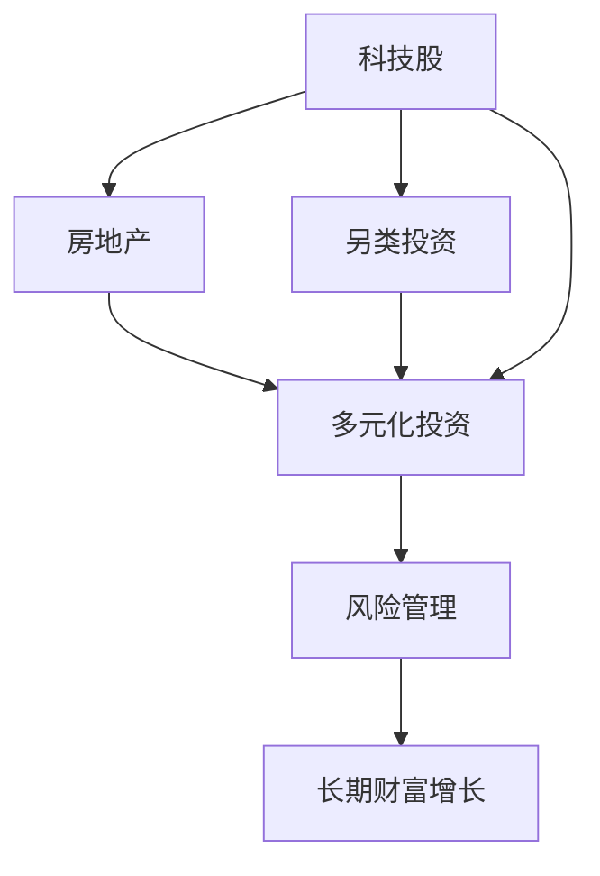

                 

# 程序员的投资多元化：科技股、房地产与另类投资

> 关键词：科技股,房地产,另类投资,多元化投资,风险管理,长期财富增长

## 1. 背景介绍

### 1.1 问题由来

在程序员群体中，长期以来普遍存在一种思维定式，即“技术宅”或“编码党”，过分依赖编程技能，缺乏对金融、投资等领域的认知。这导致许多优秀程序员在财务上陷入困境，甚至出现“黑客-工程师-贫困”这一典型的“IT泡沫”现象。

近年来，随着全球金融市场的波动，以及技术的不断进步，程序员群体的财富观念开始发生变革。为了更好地实现财富自由和长期增长，程序员开始关注多元化的投资策略，包括科技股、房地产和另类投资。

### 1.2 问题核心关键点

本文旨在探讨程序员如何通过多元化投资，实现财富增长和风险分散。我们重点关注以下几个核心问题：
- 如何构建适合程序员的资产配置模型？
- 科技股、房地产、另类投资的优劣及应用场景？
- 如何在投资过程中实现风险管理？
- 如何规划长期财富增长目标并实现？

### 1.3 问题研究意义

掌握多元化的投资策略，对于程序员群体的财务安全具有重要意义：
1. **风险分散**：避免单一资产的风险集中，增强财务稳定性。
2. **收益最大化**：通过合理的资产配置，追求长期财富的稳定增长。
3. **财务自主**：掌握多元化投资方法，实现财务自主和自由。

## 2. 核心概念与联系

### 2.1 核心概念概述

1. **科技股**：指科技公司的股票，包括互联网、软件、硬件、半导体等行业。科技股通常具有高增长性和高波动性。

2. **房地产**：指各类物业，包括住宅、商业、工业物业等。房地产投资通常具有保值增值的特征，但流动性较差。

3. **另类投资**：指传统股票和债券之外的资产类别，如大宗商品、私募股权、对冲基金、艺术品等。另类投资风险高、收益不稳定。

4. **多元化投资**：通过配置不同类别的资产，分散风险，实现收益的稳健增长。

5. **风险管理**：通过合理的投资策略和工具，控制投资风险，保护资本安全。

6. **长期财富增长**：通过科学的投资规划和执行，实现财务目标的持续增长。

这些核心概念通过以下Mermaid流程图展示了它们之间的联系：



这个流程图说明了科技股、房地产和另类投资如何通过多元化投资策略，融入风险管理和长期财富增长规划，形成一套完整的投资体系。

## 3. 核心算法原理 & 具体操作步骤
### 3.1 算法原理概述

程序员多元化的投资策略，本质上是一种资产配置和风险管理的优化问题。核心目标是构建一个多元化的投资组合，以在风险可控的前提下，实现最大化的长期收益。

### 3.2 算法步骤详解

1. **风险评估**：评估不同资产类别的风险特征，包括科技股、房地产和另类投资。
2. **目标设定**：确定投资目标，如财富增值、风险控制、财务自由等。
3. **资产配置**：根据风险和收益特征，合理配置各类资产比例。
4. **风险管理**：使用对冲、分散投资等手段，控制投资风险。
5. **收益评估**：定期评估投资组合的收益情况，及时调整策略。
6. **持续优化**：根据市场变化和个人情况，不断优化资产配置和投资策略。

### 3.3 算法优缺点

**优点**：
- **风险分散**：多元化投资可以有效降低单一资产风险，实现资产组合的稳定增长。
- **收益多样化**：通过配置不同风险特征的资产，追求长期财富的稳健增长。

**缺点**：
- **管理复杂**：多元化投资需要掌握多种资产的特征和投资技巧，管理复杂。
- **波动性**：科技股和另类投资的高波动性，可能导致短期的较大波动。

### 3.4 算法应用领域

多元化投资策略广泛应用于：
- **科技创业公司**：利用科技股的快速增值潜力，实现早期资本增值。
- **中高收入家庭**：通过多元化配置，保障财务自由和稳定增长。
- **财富管理**：专业机构帮助高净值客户，制定和执行多元化投资方案。

## 4. 数学模型和公式 & 详细讲解 & 举例说明

### 4.1 数学模型构建

设投资组合 $P$ 由 $N$ 个资产组成，每个资产的收益率 $r_i$ 服从正态分布 $N(\mu_i, \sigma_i^2)$，其中 $\mu_i$ 为期望收益率，$\sigma_i$ 为标准差。投资组合的总收益率为 $R$，期望收益率为 $\mu_P$，标准差为 $\sigma_P$。

**模型构建**：
$$
R = \sum_{i=1}^N r_i
$$
$$
\mu_P = \sum_{i=1}^N \mu_i \times w_i
$$
$$
\sigma_P^2 = \sum_{i=1}^N \sigma_i^2 \times w_i^2 + 2 \sum_{1 \leq i < j \leq N} \sigma_{ij} w_i w_j
$$
其中 $w_i$ 为资产 $i$ 的权重。

### 4.2 公式推导过程

**期望收益率推导**：
$$
\mu_P = \sum_{i=1}^N \mu_i \times w_i
$$

**方差推导**：
$$
\sigma_P^2 = \sum_{i=1}^N \sigma_i^2 \times w_i^2 + 2 \sum_{1 \leq i < j \leq N} \sigma_{ij} w_i w_j
$$

**风险管理**：
引入协方差矩阵 $\Sigma$ 和权重向量 $w$，可以使用马科维茨模型计算投资组合的风险：
$$
\sigma_P = \sqrt{w^T \Sigma w}
$$

**案例分析**：
假设投资组合 $P$ 由 $N=3$ 个资产组成，资产的期望收益率和标准差如下：
- 科技股：$\mu_1 = 0.1, \sigma_1 = 0.3$
- 房地产：$\mu_2 = 0.05, \sigma_2 = 0.2$
- 另类投资：$\mu_3 = 0.08, \sigma_3 = 0.4$

设投资组合的权重分别为 $w_1, w_2, w_3$，则：
$$
\mu_P = w_1 \times 0.1 + w_2 \times 0.05 + w_3 \times 0.08
$$
$$
\sigma_P^2 = w_1^2 \times 0.3^2 + w_2^2 \times 0.2^2 + w_3^2 \times 0.4^2 + 2w_1w_2(0.3 \times 0.2) + 2w_1w_3(0.3 \times 0.4) + 2w_2w_3(0.2 \times 0.4)
$$

通过求解上述优化问题，可以找到最优的资产配置比例。

### 4.3 案例分析与讲解

以某程序员为例，假设其目标是财富增长，风险承受能力较低。根据上述模型，可以构建一个风险分散的投资组合：
- 科技股权重 $w_1 = 0.3$，房地产权重 $w_2 = 0.5$，另类投资权重 $w_3 = 0.2$。
- 投资组合的期望收益率 $R$ 为 $0.075$，标准差 $\sigma_P$ 为 $0.31$。

通过调整各资产的权重，可以在风险可控的前提下，实现财富的稳健增长。

## 5. 项目实践：代码实例和详细解释说明

### 5.1 开发环境搭建

以下是在Python环境中搭建投资组合分析工具的开发环境：

1. **安装Python**：确保Python版本为3.6及以上。
2. **安装相关库**：安装NumPy、Pandas、SciPy、Matplotlib等科学计算库。
3. **搭建环境**：使用虚拟环境（如conda）搭建独立的环境，确保各个库的版本和依赖关系稳定。

### 5.2 源代码详细实现

以下是一个简单的Python代码示例，用于计算投资组合的期望收益率和标准差：

```python
import numpy as np
from scipy.optimize import minimize

def calculate_return_std(weights, means, covars):
    returns = np.dot(weights, means)
    std = np.sqrt(np.dot(weights.T, np.dot(covars, weights)))
    return returns, std

def optimize_weights(means, covars, constraints, bounds, obj):
    n = len(means)
    weights = np.ones(n) / n
    con = {'type': 'eq', 'fun': lambda x: np.sum(x) - 1}
    result = minimize(lambda x: -obj(x), weights, method='SLSQP', constraints=con, bounds=bounds)
    return result.x

# 示例数据
means = np.array([0.1, 0.05, 0.08])
covars = np.array([[0.3**2, 0.2*0.3, 0.4*0.3],
                  [0.2*0.3, 0.2**2, 0.2*0.4],
                  [0.4*0.3, 0.4*0.2, 0.4**2]])
constraints = [{'type': 'eq', 'fun': lambda x: np.sum(x) - 1}]
bounds = [(0, 1)] * n

# 优化权重
weights = optimize_weights(means, covars, constraints, bounds, np.dot)

# 计算期望收益率和标准差
expected_return, std_dev = calculate_return_std(weights, means, covars)
print('Expected return:', expected_return)
print('Standard deviation:', std_dev)
```

### 5.3 代码解读与分析

**代码解析**：
1. **calculate_return_std函数**：计算投资组合的期望收益率和标准差。
2. **optimize_weights函数**：使用优化算法求解最优资产配置比例。
3. **示例数据**：设置资产的期望收益率和协方差矩阵。
4. **约束和边界**：设置总权重为1，权重区间为[0, 1]。

**运行结果**：
通过运行上述代码，可以得到最优的资产配置比例和对应的期望收益率和标准差。

## 6. 实际应用场景

### 6.1 智能投顾系统

智能投顾系统基于算法和数据，为程序员提供个性化的投资建议。系统可以自动分析其风险承受能力、财务目标和投资偏好，生成适合的资产配置策略，并进行实时调整。

### 6.2 企业员工福利计划

科技公司可以为其员工提供多元化投资计划，包括科技股、房地产、另类投资等。通过自动化工具，员工可以根据自己的财务状况和投资目标，灵活选择投资组合，享受增值收益。

### 6.3 财务自由规划

程序员可以根据多元化投资策略，规划长期财务自由目标。通过设定合理的预期收益率和风险容忍度，逐步实现资产积累和财富增长。

### 6.4 未来应用展望

随着人工智能和大数据技术的发展，多元化投资策略将更加智能化和个性化。智能投顾、区块链投资等新兴技术，将进一步拓展程序员的投资选择和应用场景。

## 7. 工具和资源推荐

### 7.1 学习资源推荐

1. **《量化投资策略》**：深入介绍量化投资的原理和实现方法，涵盖科技股、房地产等资产。
2. **《Python投资分析》**：使用Python进行金融数据分析和投资决策的实战指南。
3. **Coursera投资课程**：Coursera提供的投资学相关课程，涵盖基础理论和应用案例。

### 7.2 开发工具推荐

1. **Jupyter Notebook**：Python数据科学和机器学习的首选开发环境，支持实时数据交互和可视化。
2. **Google Colab**：免费的GPU/TPU资源，方便进行高性能计算。
3. **Charles River Analytics**：专业的数学软件工具，支持多元统计分析和金融建模。

### 7.3 相关论文推荐

1. **《风险与回报：资产配置理论》**：现代投资组合理论的奠基之作，介绍了资产配置的基本原理和方法。
2. **《多元统计分析：理论与应用》**：统计学领域的经典著作，涵盖多元回归、因子分析等方法。

## 8. 总结：未来发展趋势与挑战

### 8.1 研究成果总结

本文通过系统介绍科技股、房地产和另类投资的多元化策略，展示了程序员如何通过科学的资产配置和风险管理，实现财务自由和长期增长。通过公式推导和实际案例分析，深入探讨了投资组合的风险和收益特性。

### 8.2 未来发展趋势

未来多元化投资策略将呈现以下几个趋势：
1. **智能投顾普及**：人工智能和大数据技术的应用，将使智能投顾系统更加普及和精准。
2. **技术创新**：区块链、人工智能等新兴技术的应用，将为多元化投资带来新的机会和挑战。
3. **全球化配置**：全球资产配置能力提升，使程序员可以更灵活地分散投资风险。

### 8.3 面临的挑战

尽管多元化投资策略具有显著优势，但也面临以下挑战：
1. **市场波动**：科技股和另类投资的高波动性，可能导致短期内的较大波动。
2. **管理复杂**：多元化投资需要掌握多种资产的特征和投资技巧，管理复杂。
3. **数据隐私**：智能投顾系统需要大量数据支持，涉及隐私和安全问题。

### 8.4 研究展望

未来研究需要关注以下几个方向：
1. **智能投顾算法优化**：提升智能投顾系统的准确性和稳定性。
2. **风险管理新方法**：引入人工智能和大数据技术，优化风险管理手段。
3. **跨领域应用**：探索多元化投资与其他领域的结合，如区块链、金融科技等。

## 9. 附录：常见问题与解答

**Q1：科技股的优劣是什么？**

A: 科技股具有高增长性和高波动性。优点在于快速增值潜力，缺点在于市场波动性大，风险较高。

**Q2：如何选择房地产投资？**

A: 房地产投资需要考虑地理位置、市场供需、物业类型等因素。建议选择稳定增值的地区和高质量物业，合理控制贷款比例。

**Q3：如何配置多元化的投资组合？**

A: 根据风险偏好和财务目标，合理配置科技股、房地产、另类投资等资产比例。使用优化算法求解最优资产配置。

**Q4：如何进行风险管理？**

A: 使用分散投资、对冲、保险等手段，控制投资组合的整体风险。定期评估和调整投资策略。

**Q5：如何实现长期财富增长？**

A: 设定合理的财务目标和投资策略，定期评估投资组合的收益情况，及时调整投资组合。保持长期投资心态，避免短期波动影响。

---

作者：禅与计算机程序设计艺术 / Zen and the Art of Computer Programming

