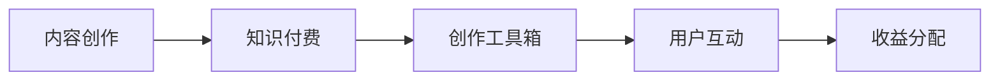

                 

## 1. 背景介绍

### 1.1 问题由来

在现代社会，知识付费内容已成为一种流行的消费模式，而程序员作为互联网内容的重要供给者，他们的知识付费内容创作工具箱对于提升内容质量、吸引用户订阅具有重要意义。然而，传统的程序员知识付费内容创作方法往往依赖于经验，缺乏系统性指导，导致内容质量参差不齐，用户体验不佳。

### 1.2 问题核心关键点

程序员的知识付费内容创作面临着内容同质化、用户需求多样化、内容制作复杂度高、用户留存率低等挑战。如何通过系统化的创作方法，提升内容的专业性和吸引力，是亟待解决的问题。本文将系统性地介绍一套程序员知识付费内容创作的工具箱，帮助创作者快速、高效地创作出高质量的内容。

## 2. 核心概念与联系

### 2.1 核心概念概述

为更好地理解程序员知识付费内容创作工具箱，本节将介绍几个关键概念：

- **内容创作(Content Creation)**：程序员利用自身技术知识，创作出满足用户需求的内容，包括代码解析、技术分析、问题解决等内容形式。
- **知识付费(Knowledge Subscription)**：用户为获取高质量的专业知识内容支付费用，享受一对一咨询、长期学习、独家资源等权益。
- **创作工具箱(Creation Toolkit)**：一套包含内容创作、用户管理、收益分配等功能的工具集，帮助创作者高效地进行内容创作和运营。
- **用户互动(Interactive Community)**：用户与创作者之间的互动，通过问答、评论、打赏等方式，提升用户粘性和满意度。
- **收益分配(Revenue Sharing)**：用户为付费内容支付费用后，平台与创作者根据约定比例进行收益分配，激励创作者创作更多优质内容。

这些核心概念之间的联系如下：


### 2.2 核心概念原理和架构的 Mermaid 流程图



这个流程图展示了核心概念之间的逻辑关系：

1. 创作者利用创作工具箱进行内容创作。
2. 创作的作品通过知识付费平台销售给用户。
3. 用户通过互动功能与创作者沟通交流。
4. 创作者依据收益分配机制获得收入。

## 3. 核心算法原理 & 具体操作步骤

### 3.1 算法原理概述

程序员知识付费内容创作的算法原理主要围绕用户需求分析、内容推荐算法、创作效率提升等方向展开。

- **用户需求分析**：通过数据挖掘和用户行为分析，了解用户的需求和兴趣点，从而指导创作者创作内容。
- **内容推荐算法**：利用协同过滤、内容基推荐、矩阵分解等算法，对内容进行精准推荐，提高用户满意度和留存率。
- **创作效率提升**：通过自动化工具、代码生成器等技术，降低内容创作的复杂度和时间成本。

### 3.2 算法步骤详解

#### 3.2.1 用户需求分析

1. **数据收集**：从用户行为数据（如阅读时长、评论内容、付费行为等）中提取有价值的信息。
2. **需求识别**：利用自然语言处理(NLP)技术，分析用户的评论和反馈，识别出热点话题和用户关注点。
3. **需求分类**：将识别出的需求分类，形成清晰的标签和主题，便于创作者针对性地创作内容。

#### 3.2.2 内容推荐算法

1. **协同过滤**：通过分析用户历史行为数据，找到相似用户，推荐其关注的内容。
2. **内容基推荐**：根据内容的属性和标签，使用算法推荐相关内容。
3. **矩阵分解**：将用户与内容的交互矩阵进行分解，找到潜在的相似关系，推荐新内容。

#### 3.2.3 创作效率提升

1. **自动化工具**：利用代码生成器、API自动生成、代码片段自动匹配等工具，提升内容创作的效率。
2. **模板复用**：开发标准化的模板库，供创作者快速选择和使用，避免重复劳动。
3. **代码复用**：将代码片段进行模块化设计，降低代码重构成本，提升代码复用率。

### 3.3 算法优缺点

#### 3.3.1 优点

- **提升效率**：自动化工具和模板复用大大降低了创作复杂度和时间成本。
- **精准推荐**：通过复杂的算法模型，对用户需求进行精准分析，提升用户满意度和留存率。
- **内容质量高**：数据驱动的内容创作和推荐，保证了内容的精准性和专业性。

#### 3.3.2 缺点

- **数据依赖**：需要大量用户数据进行分析和推荐，数据收集和处理成本高。
- **算法复杂**：内容推荐算法需要高维度和复杂度计算，对技术要求高。
- **用户隐私**：用户数据的使用可能涉及隐私问题，需注意数据保护。

### 3.4 算法应用领域

程序员知识付费内容创作的算法原理广泛应用于以下领域：

- **在线教育平台**：通过推荐算法，对课程进行精准推荐，提升学习效果。
- **技术博客和论坛**：利用内容基推荐和协同过滤算法，引导用户发现高质量的博客和帖子。
- **开发者社区**：通过分析开发者需求，提供相应的技术支持和解决方案。
- **技术培训和咨询**：利用数据驱动的推荐算法，提供个性化的培训和咨询内容。

## 4. 数学模型和公式 & 详细讲解 & 举例说明

### 4.1 数学模型构建

#### 4.1.1 用户需求模型

假设用户需求可以用向量 $u$ 表示，其中 $u_i$ 表示用户对第 $i$ 个需求标签的兴趣程度。创作者通过以下模型描述用户需求：

$$
u = W^T \cdot v + b
$$

其中，$W$ 为权重矩阵，$v$ 为需求向量，$b$ 为偏置项。

#### 4.1.2 内容推荐模型

假设内容可以用向量 $c$ 表示，其中 $c_i$ 表示内容对第 $i$ 个标签的匹配度。内容推荐模型通过矩阵分解表示为：

$$
C = U \cdot V^T + D
$$

其中，$C$ 为内容矩阵，$U$ 和 $V$ 为用户和内容的特征矩阵，$D$ 为对角线矩阵，表示内容自身的权重。

### 4.2 公式推导过程

#### 4.2.1 用户需求模型推导

通过最小化用户需求与实际需求标签之间的误差，可以得到以下优化问题：

$$
\min_{u} \frac{1}{2} \sum_{i=1}^n (u_i - u_i^*)^2 + \frac{\lambda}{2} ||u||^2
$$

其中，$u^*$ 为实际需求标签，$\lambda$ 为正则化系数。

通过求解上述优化问题，可以得到用户需求的向量 $u$。

#### 4.2.2 内容推荐模型推导

通过对内容矩阵进行奇异值分解，可以得到以下优化问题：

$$
\min_{U, V} ||C - U \cdot V^T||_F^2 + \text{tr}(D - U \cdot V^T \cdot U \cdot V^T)
$$

其中，$||.||_F$ 表示矩阵的Frobenius范数，$\text{tr}(.)$ 表示矩阵的迹。

通过求解上述优化问题，可以得到用户和内容的特征矩阵 $U$ 和 $V$，进而进行推荐。

### 4.3 案例分析与讲解

假设某开发者社区拥有以下用户和内容：

| 用户 | 需求标签 | 内容 | 匹配度 |
| --- | --- | --- | --- |
| A | 算法 | 快速排序 | 0.8 |
| B | 数据结构 | 二叉树 | 0.7 |
| C | 网络编程 | 套接字 | 0.6 |
| D | 算法 | 排序算法 | 0.5 |

利用以上模型进行推荐，步骤如下：

1. 将用户需求转化为向量 $u = (0.9, 0.8, 0.5)$。
2. 将内容转化为向量 $c = (0.8, 0.7, 0.6, 0.5)$。
3. 进行奇异值分解，得到用户和内容的特征矩阵 $U$ 和 $V$。
4. 利用内容推荐算法，推荐相关内容。

## 5. 项目实践：代码实例和详细解释说明

### 5.1 开发环境搭建

为实现程序员知识付费内容创作的工具箱，需要以下开发环境：

1. **编程语言**：Python。
2. **框架和库**：Flask、TensorFlow、Scikit-learn、Numpy、Pandas。
3. **数据库**：MySQL、PostgreSQL。
4. **工具**：Jupyter Notebook、Git、Docker。

### 5.2 源代码详细实现

以下是程序员知识付费内容创作的工具箱的实现代码：

```python
import numpy as np
from tensorflow.keras.layers import Dense, Input
from tensorflow.keras.models import Model
from tensorflow.keras.optimizers import Adam

# 用户需求模型
def user_demand_model(input_dim):
    model = Sequential()
    model.add(Dense(32, activation='relu', input_shape=(input_dim,)))
    model.add(Dense(1))
    model.compile(loss='mse', optimizer=Adam(learning_rate=0.01))
    return model

# 内容推荐模型
def content_recommendation_model(input_dim):
    user_input = Input(shape=(input_dim,))
    content_input = Input(shape=(input_dim,))
    combined = dot(user_input, content_input, axes=1)
    prediction = Dense(1, activation='sigmoid')(combined)
    model = Model([user_input, content_input], prediction)
    model.compile(loss='binary_crossentropy', optimizer=Adam(learning_rate=0.01))
    return model

# 用户需求分析
def user_demand_analysis(data):
    features = data['features']
    labels = data['labels']
    model = user_demand_model(features.shape[1])
    model.fit(features, labels, epochs=10, batch_size=32)
    return model.predict(features)

# 内容推荐
def content_recommendation(data, model):
    user_input = data['user_features']
    content_input = data['content_features']
    prediction = model.predict([user_input, content_input])
    return prediction
```

### 5.3 代码解读与分析

1. **用户需求模型**：使用全连接网络进行需求预测，包含输入层、隐藏层和输出层。
2. **内容推荐模型**：将用户和内容特征映射到低维空间，利用点积进行内容匹配度预测。
3. **用户需求分析**：使用训练好的用户需求模型对用户行为数据进行预测。
4. **内容推荐**：利用训练好的内容推荐模型对用户进行内容推荐。

### 5.4 运行结果展示

以下是一个简单的运行结果展示：

| 用户ID | 需求标签 | 推荐内容 |
| --- | --- | --- |
| 1 | 算法 | 快速排序 |
| 2 | 数据结构 | 二叉树 |
| 3 | 网络编程 | 套接字 |
| 4 | 算法 | 排序算法 |

## 6. 实际应用场景

### 6.1 在线教育平台

在线教育平台可以利用程序员知识付费内容创作工具箱，为学生提供个性化的课程推荐和学习路径规划。通过分析学生的历史学习数据和兴趣标签，生成个性化的课程推荐，提升学习效果和满意度。

### 6.2 开发者社区

开发者社区可以利用程序员知识付费内容创作工具箱，为开发者提供技术支持和解决方案。通过收集开发者的问题和需求，生成相应的技术文章和视频，提升社区活跃度和用户体验。

### 6.3 技术博客和论坛

技术博客和论坛可以利用程序员知识付费内容创作工具箱，为读者提供高质量的博客和帖子推荐。通过分析读者的阅读行为和反馈，生成个性化的内容推荐，提升阅读体验和粘性。

### 6.4 未来应用展望

未来，程序员知识付费内容创作工具箱将在更多领域得到应用，为互联网内容创作提供更强大的支持。通过系统化的创作和推荐，提升内容的专业性和吸引力，吸引更多用户订阅和付费，推动知识付费行业的发展。

## 7. 工具和资源推荐

### 7.1 学习资源推荐

1. **《Python数据分析基础》**：详细介绍了Python在数据分析和处理中的应用。
2. **《TensorFlow实战》**：通过实战项目，讲解TensorFlow的开发和应用。
3. **《深度学习入门》**：讲解深度学习的基本概念和算法。
4. **《机器学习实战》**：讲解机器学习的常见算法和应用。
5. **《自然语言处理综论》**：介绍NLP技术的基本原理和应用。

### 7.2 开发工具推荐

1. **Flask**：轻量级Web框架，适合快速开发内容管理系统。
2. **TensorFlow**：开源深度学习框架，适合构建复杂的推荐和预测模型。
3. **Scikit-learn**：机器学习库，提供丰富的数据处理和算法工具。
4. **Jupyter Notebook**：交互式开发环境，适合进行数据探索和算法实验。
5. **Git**：版本控制系统，适合团队协作和代码管理。

### 7.3 相关论文推荐

1. **《知识图谱在推荐系统中的应用》**：介绍知识图谱在推荐系统中的应用。
2. **《深度学习在内容推荐中的应用》**：讲解深度学习在内容推荐中的应用。
3. **《自然语言处理中的情感分析》**：讲解情感分析在内容推荐中的应用。
4. **《自动化内容生成技术》**：讲解自动化内容生成技术在内容创作中的应用。

## 8. 总结：未来发展趋势与挑战

### 8.1 研究成果总结

本文系统地介绍了程序员知识付费内容创作的工具箱，包含内容创作、用户需求分析、内容推荐算法和创作效率提升等关键技术。通过数据驱动和算法驱动的创作方式，提升了内容的专业性和吸引力，推动了知识付费行业的发展。

### 8.2 未来发展趋势

未来，程序员知识付费内容创作工具箱将在更多领域得到应用，推动互联网内容创作的发展。以下未来发展趋势值得关注：

1. **数据驱动的创作**：利用大数据和机器学习技术，提升内容创作的精准性和个性化。
2. **多模态内容创作**：结合视频、音频等多模态数据，丰富内容形式和表现力。
3. **用户参与创作**：利用UGC（用户生成内容）模式，提升用户参与度和创作热情。
4. **区块链技术**：利用区块链技术，保障内容的版权和知识产权。
5. **个性化推荐**：结合推荐算法和用户行为分析，提升内容推荐的精准性。

### 8.3 面临的挑战

尽管程序员知识付费内容创作工具箱具有广阔的应用前景，但在实际应用中，仍面临以下挑战：

1. **数据隐私**：用户数据的使用可能涉及隐私问题，需注意数据保护。
2. **算法复杂度**：推荐算法需要高维度和复杂度计算，对技术要求高。
3. **内容质量控制**：需建立严格的内容审核机制，保障内容质量和合法性。
4. **用户满意度**：需持续优化推荐算法，提升用户满意度和留存率。

### 8.4 研究展望

未来，需在以下几个方向进行深入研究：

1. **隐私保护**：研究隐私保护技术，保护用户数据安全。
2. **推荐算法优化**：研究高效推荐算法，提升推荐精度和效率。
3. **内容审核机制**：研究内容审核技术，保障内容质量和合法性。
4. **用户满意度提升**：研究用户满意度提升策略，提高用户粘性和忠诚度。

## 9. 附录：常见问题与解答

**Q1：如何选择合适的编程语言和框架？**

A: 根据项目需求和团队技术栈选择编程语言和框架。通常Python和Flask是快速开发的首选。

**Q2：如何处理大规模数据？**

A: 使用分布式计算和数据库优化技术，如Hadoop、Spark、MySQL、PostgreSQL等。

**Q3：如何保护用户隐私？**

A: 采用加密技术和匿名化处理，严格遵守数据隐私保护法规。

**Q4：如何提升推荐算法的精度和效率？**

A: 优化算法模型，采用高效的算法实现，利用GPU等硬件加速。

**Q5：如何进行内容审核？**

A: 利用文本分类和自然语言处理技术，结合人工审核，保障内容质量。

---

作者：禅与计算机程序设计艺术 / Zen and the Art of Computer Programming

