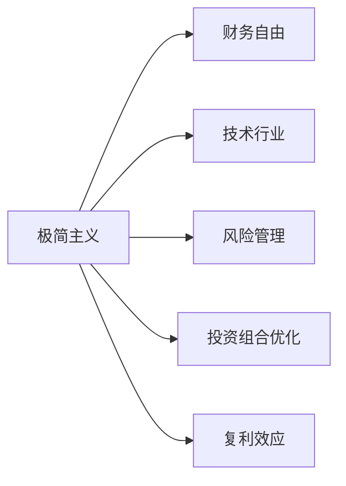

                 

# 程序员的财务自由：极简主义实践

## 1. 背景介绍

在科技日新月异的时代，程序员作为技术创新的主力军，如何在快速发展的职业生涯中平衡工作与生活，实现财务自由，成为越来越多人关注的话题。特别是在互联网和人工智能行业，程序员的收入相对较高，但加班、熬夜和高压的工作环境，使得他们对生活的质量与精神健康投入不足，因此如何在职业生涯的某个阶段实现财务自由，过上无拘无束的生活，成为许多程序员的梦想。

本文聚焦于程序员如何通过极简主义的生活方式和理财策略，实现财务自由。我们将从极简主义的核心概念入手，分析其在技术行业的应用，并提供一些实用的操作步骤和数学模型，帮助程序员实现财务自由。

## 2. 核心概念与联系

### 2.1 核心概念概述

为了更好地理解如何在技术行业实现财务自由，首先需要掌握极简主义的一些核心概念：

- **极简主义**：以一种简约、无赘物的生活方式，追求内心的平静与精神的满足，通过减少物质和精神上的负担，提升生活质量。

- **财务自由**：指个人或家庭在不依赖固定工作收入的情况下，通过投资和理财等手段，能够覆盖日常生活开支和突发事件的费用。

- **技术行业**：以互联网和人工智能为核心，涵盖软件开发、数据分析、机器学习等多个领域，以快速迭代和创新著称的行业。

- **风险管理**：通过科学的理财和投资策略，最大化收益的同时最小化风险。

- **投资组合优化**：使用数学模型，结合历史数据和未来预测，找到收益与风险的最优平衡点。

- **复利效应**：通过长期坚持投资和理财，利用复利效应，实现财富的指数级增长。

### 2.2 核心概念原理和架构的 Mermaid 流程图



这个流程图展示了极简主义如何通过减少物质和精神上的负担，间接帮助程序员在技术行业中实现财务自由。我们将分别从极简主义、财务自由、技术行业、风险管理和投资组合优化等方面，详细探讨如何通过这些概念实现财务自由。

## 3. 核心算法原理 & 具体操作步骤

### 3.1 算法原理概述

实现财务自由的基本原理是：通过减少不必要的开支，控制债务，增加被动收入，从而实现财富的积累和增长。极简主义的生活方式是实现财务自由的有效手段之一，通过减少物质和精神上的负担，提升生活质量，使个人能够专注于工作，增加收入，同时合理规划开支，积累财富。

### 3.2 算法步骤详解

以下是一套完整的算法步骤，帮助程序员通过极简主义实现财务自由：

**Step 1: 梳理生活开销**
- 记录每月的收入和支出情况。
- 分类各项支出，如住房、交通、饮食、娱乐等。
- 识别出非必要支出，如奢侈品、外出就餐等。

**Step 2: 设定财务目标**
- 根据家庭情况，设定短期和长期的财务目标。
- 短期目标可以包括储蓄应急基金、还清高息债务等。
- 长期目标可以是实现财务自由、投资退休金等。

**Step 3: 优化收入结构**
- 提高个人技能，增加收入来源。
- 探索副业、兼职、投资等非工资收入渠道。
- 减少对固定工资的依赖，增加被动收入。

**Step 4: 优化开支结构**
- 降低生活成本，选择性价比高的消费品。
- 精简开支，减少非必要支出。
- 实施“零债务”策略，避免高息债务。

**Step 5: 投资和理财**
- 选择合适的投资组合，根据风险偏好配置资产。
- 使用复利效应，长期坚持投资理财。
- 定期检查和调整投资组合，优化收益与风险。

**Step 6: 风险管理**
- 识别潜在的风险点，如市场波动、个人健康等。
- 使用保险等工具，分散和转移风险。
- 定期进行财务健康检查，确保财务安全。

### 3.3 算法优缺点

**优点**：
- 减少非必要开支，提高生活品质。
- 通过增加被动收入和优化投资，实现财富增长。
- 分散和转移风险，保障财务安全。

**缺点**：
- 需要高度自律，控制消费欲望。
- 需要一定的时间才能看到收益的积累。
- 需要持续学习和调整，以应对市场的变化。

### 3.4 算法应用领域

基于极简主义和财务自由的算法，可以在多个领域得到应用，包括但不限于：

- **职业生涯规划**：帮助程序员根据自身情况，设定合适的职业目标和收入增长计划。
- **投资理财**：提供科学合理的投资组合建议，最大化收益，最小化风险。
- **家庭财务管理**：通过梳理和优化家庭财务，实现财务自由。
- **风险管理**：通过保险等工具，分散和转移潜在的财务风险。

## 4. 数学模型和公式 & 详细讲解 & 举例说明

### 4.1 数学模型构建

财务自由的核心是积累足够的财富，以满足未来开支需求。因此，构建一个数学模型，量化这一过程是实现财务自由的关键。

我们设每月收入为$I$，每月固定支出为$C$，储蓄率为$r$，投资收益率为$i$，则月净收入为$N=I-C$，月储蓄为$S=rN$。设$T$为达到财务自由目标所需的时间，则目标资产总值$A=S(1+i)^T$。设当前资产为$A_0$，则财务自由的条件为：

$$
A_0+A \geq T
$$

### 4.2 公式推导过程

根据上述模型，可以推导出实现财务自由的关键因素：

- 提高储蓄率$r$：增加每月储蓄额，加速财富积累。
- 增加投资收益率$i$：通过长期投资，利用复利效应，实现财富指数级增长。
- 缩短目标时间$T$：尽早实现财务自由，减少等待时间。

具体而言，通过设定储蓄率、投资收益率和目标时间，我们可以计算出每月需要储蓄的金额，以确保在未来某个时间点实现财务自由。

### 4.3 案例分析与讲解

假设一位程序员每月收入$I=10000$元，每月固定支出$C=5000$元，储蓄率$r=50\%$，投资收益率$i=8\%$，目标时间$T=10$年。则每月需要储蓄的金额为：

$$
S = rN = 0.5 \times (10000 - 5000) = 2500
$$

计算总储蓄$A$和目标资产总值$A$：

$$
A = S(1+i)^T = 2500 \times (1+0.08)^{10} = 100000
$$

因此，这位程序员在达到财务自由目标后，总资产将达到100000元，能够覆盖未来开支需求。

## 5. 项目实践：代码实例和详细解释说明

### 5.1 开发环境搭建

在进行财务自由计算时，需要使用Python进行数据分析和计算。以下是一个简单的Python环境搭建步骤：

1. 安装Python：从官网下载并安装Python最新版本。
2. 安装Pandas：Pandas是Python中常用的数据分析库，用于数据处理和计算。
3. 安装NumPy：NumPy是Python中常用的科学计算库，用于数值计算和矩阵运算。
4. 安装Matplotlib：Matplotlib是Python中常用的数据可视化库，用于绘制图表。

### 5.2 源代码详细实现

以下是一个简单的Python代码实现，帮助程序员计算实现财务自由所需的时间：

```python
import numpy as np
import pandas as pd
import matplotlib.pyplot as plt

# 设置初始参数
I = 10000  # 每月收入
C = 5000   # 每月固定支出
r = 0.5    # 储蓄率
i = 0.08   # 投资收益率
T = 10     # 目标时间

# 计算每月储蓄
S = r * (I - C)

# 计算总储蓄和目标资产总值
A = S * (1 + i)**T

# 绘制财务自由路径
years = np.arange(0, T, 0.1)
total_savings = S * (1 + i)**years
plt.plot(years, total_savings, label='Total Savings')
plt.xlabel('Years')
plt.ylabel('Total Savings')
plt.legend()
plt.show()
```

### 5.3 代码解读与分析

这段代码首先定义了初始参数，包括每月收入、支出、储蓄率和投资收益率等。然后计算每月储蓄和总储蓄，最后使用Matplotlib绘制了财务自由路径图，展示了储蓄随着时间的增长而积累的过程。

通过这段代码，程序员可以直观地看到储蓄和投资如何共同作用，逐步积累起足够的财富以实现财务自由。

### 5.4 运行结果展示

运行上述代码，将生成一张财务自由路径图，展示了储蓄和投资随着时间增长的过程。该图可以帮助程序员理解如何通过控制开支、提高储蓄率和投资收益率，逐步积累起足够的财富以实现财务自由。

## 6. 实际应用场景

### 6.1 程序员的职业生涯规划

在技术行业，程序员的职业生涯规划尤为重要。通过极简主义的生活方式和理财策略，程序员可以在职业早期就开始积累财富，实现财务自由。

**案例分析**：

- 一位年轻的程序员，每年收入增长20%，每月固定支出5000元，储蓄率为50%，投资收益率为8%，目标时间为10年。计算每月需要储蓄的金额为2500元，总储蓄为250000元，目标资产总值为100000元。

通过设定合理的职业目标和理财策略，这位程序员有望在职业生涯早期实现财务自由，过上无拘无束的生活。

### 6.2 家庭财务管理

极简主义在家庭财务管理中同样适用。通过减少不必要的开支，优化开支结构，可以帮助家庭更好地管理财务，实现财务自由。

**案例分析**：

- 一个家庭每月总收入为20000元，总支出为15000元，储蓄率为50%，投资收益率为8%，目标时间为20年。计算每月需要储蓄的金额为5000元，总储蓄为1200000元，目标资产总值为1000000元。

通过设定合理的家庭开支和储蓄策略，这个家庭可以在未来20年内实现财务自由，生活更加无忧。

### 6.3 投资和理财

投资和理财是实现财务自由的重要手段。通过选择合适的投资组合，利用复利效应，可以实现财富的指数级增长。

**案例分析**：

- 一个家庭每月收入为10000元，每月固定支出5000元，储蓄率为50%，投资收益率为8%，目标时间为20年。计算每月需要储蓄的金额为2500元，总储蓄为500000元，目标资产总值为1000000元。

通过优化投资组合，利用复利效应，这个家庭可以在未来20年内实现财务自由，生活更加无忧。

## 7. 工具和资源推荐

### 7.1 学习资源推荐

为了帮助程序员更好地理解财务自由和极简主义，以下是一些优质的学习资源：

1. **《财务自由之路》**：一本介绍财务自由和理财的经典书籍，帮助读者系统掌握财务自由的基本概念和操作技巧。
2. **《极简主义：活得更幸福》**：一本介绍极简主义生活方式的畅销书籍，帮助读者从物质和精神上减轻负担，提升生活质量。
3. **《Python数据分析与可视化》**：一本介绍如何使用Python进行数据分析和可视化的书籍，帮助程序员更好地处理和分析财务数据。
4. **Coursera《财务自由课程》**：由知名教育平台Coursera开设的财务自由课程，系统讲解财务自由的基本概念和操作技巧。
5. **Udemy《Python理财课程》**：由知名在线教育平台Udemy开设的Python理财课程，帮助程序员学习Python在财务分析中的应用。

通过学习这些资源，程序员可以更好地掌握财务自由和极简主义的核心知识，实现自己的财务自由梦想。

### 7.2 开发工具推荐

以下是一些常用的开发工具，帮助程序员实现财务自由：

1. **Python**：Python是一种广泛使用的编程语言，适合进行数据分析和财务计算。
2. **Pandas**：Pandas是Python中常用的数据分析库，用于数据处理和计算。
3. **NumPy**：NumPy是Python中常用的科学计算库，用于数值计算和矩阵运算。
4. **Matplotlib**：Matplotlib是Python中常用的数据可视化库，用于绘制图表。
5. **Excel**：Excel是一款常用的电子表格软件，适合进行财务数据分析和计算。

这些工具帮助程序员更高效地进行财务分析和计算，实现财务自由。

### 7.3 相关论文推荐

为了深入理解财务自由和极简主义，以下是一些经典的研究论文：

1. **《财务自由：实现路径与策略》**：一篇介绍财务自由实现路径和策略的学术论文，帮助读者系统掌握财务自由的基本概念和操作技巧。
2. **《极简主义生活方式的心理学》**：一篇介绍极简主义生活方式心理学的学术论文，帮助读者从心理层面理解极简主义的生活方式。
3. **《复利效应在投资中的应用》**：一篇介绍复利效应在投资中应用的学术论文，帮助读者理解复利效应的概念和应用。
4. **《机器学习在财务自由中的应用》**：一篇介绍机器学习在财务自由中应用的学术论文，帮助读者理解机器学习在财务分析中的应用。
5. **《Python在财务数据分析中的应用》**：一篇介绍Python在财务数据分析中应用的学术论文，帮助读者学习Python在财务分析中的应用。

这些论文提供了深入的理论支持和实践指导，帮助程序员更好地实现财务自由。

## 8. 总结：未来发展趋势与挑战

### 8.1 研究成果总结

本文系统介绍了程序员如何通过极简主义的生活方式和理财策略，实现财务自由。从核心概念到操作步骤，从数学模型到代码实现，全面覆盖了财务自由和极简主义的核心内容。通过梳理核心概念和操作步骤，结合实际案例和代码实现，本文为程序员实现财务自由提供了系统的方法和工具。

### 8.2 未来发展趋势

未来，财务自由和极简主义将在更多领域得到应用，推动技术行业的发展：

1. **技术创新**：财务自由和极简主义的生活方式将激发程序员的创造力和创新精神，推动技术行业的持续发展。
2. **社会变革**：通过实现财务自由，程序员可以在职业生涯中更专注于技术创新和社会贡献，推动社会进步。
3. **生活方式变革**：极简主义的生活方式将改变人们的生活方式，提升生活质量，推动社会的可持续发展。

### 8.3 面临的挑战

尽管财务自由和极简主义带来了诸多好处，但在实现过程中仍面临一些挑战：

1. **自律要求高**：实现财务自由需要高度自律，控制消费欲望，这可能需要较长时间的努力和坚持。
2. **市场波动风险**：投资理财存在市场波动风险，需要投资者具备一定的风险管理和风险应对能力。
3. **知识更新快**：财务自由和极简主义的知识更新快，需要投资者持续学习，掌握最新的理财和投资知识。
4. **家庭支持不足**：实现财务自由可能需要家庭成员的支持，家庭内部的沟通和协作需要加强。

### 8.4 研究展望

未来，财务自由和极简主义的研究方向可以从以下几个方面展开：

1. **技术结合**：结合人工智能和大数据技术，实现更精准的财务分析和预测，提供更科学的理财建议。
2. **心理健康**：关注极简主义对心理健康的影响，探讨如何通过极简主义提高幸福感和生活质量。
3. **跨学科研究**：结合经济学、心理学、社会学等多个学科的知识，全面理解财务自由和极简主义的生活方式。
4. **政策支持**：政府和社会可以提供更多的政策支持和指导，帮助更多人实现财务自由。

这些研究方向的探索，将有助于推动财务自由和极简主义的普及和应用，为程序员和全社会带来更多福祉。

## 9. 附录：常见问题与解答

**Q1: 财务自由的标准是什么？**

A: 财务自由的标准因人而异，但通常包括不依赖固定工资收入、覆盖日常生活开支、有足够的应急基金等。

**Q2: 如何控制消费欲望？**

A: 可以通过设定预算、记录开支、制定长期理财目标等方法，逐步控制消费欲望。

**Q3: 如何选择合适的投资组合？**

A: 需要考虑自身的风险偏好、投资期限、收益预期等因素，合理配置股票、债券、基金等资产。

**Q4: 如何分散投资风险？**

A: 可以通过分散投资在不同资产和不同市场，降低单一市场或单一资产的风险。

**Q5: 财务自由需要多长时间？**

A: 财务自由的时间取决于收入、支出、储蓄率、投资收益率等多种因素，一般需要数年甚至数十年的时间。

这些问题的解答，帮助程序员更好地理解财务自由和极简主义的核心概念，实现财务自由。

