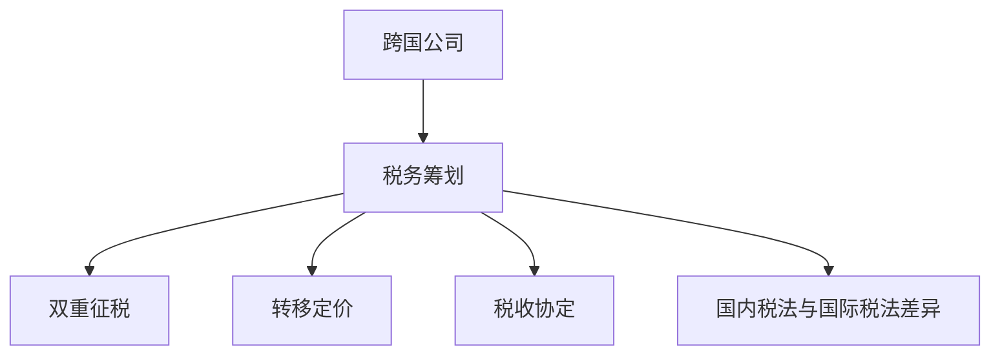

                 

# 程序员的跨国税务筹划策略

跨国公司，尤其是科技公司，由于其全球业务的拓展和运营，经常需要处理复杂的税务问题。程序员，作为跨国公司中的核心技术骨干，了解和应用有效的税务筹划策略，不仅有助于个人的税务合规性，还能帮助公司优化财务结构，提高整体竞争力。本文将系统地介绍跨国税务筹划的核心概念、方法及策略，为程序员提供全面的指导。

## 1. 背景介绍

### 1.1 问题由来

在经济全球化的背景下，跨国公司的业务和运营不再局限于单一国家。随之而来的是复杂的跨国税务问题。程序员作为技术团队的关键成员，往往需要参与或负责相关税务事宜的筹划和执行。然而，由于不同国家的税法体系差异巨大，且不同公司、不同类型的业务涉及的税务处理方式也不尽相同，程序员在处理跨国税务问题时往往感到无从下手。因此，了解和掌握基本的税务筹划策略，不仅有助于个人税务合规性，还能提升公司的整体税务优化能力。

### 1.2 问题核心关键点

跨国税务筹划的核心关键点在于理解不同国家的税法体系、利用合理的税务策略降低税负、确保公司合规性和风险控制。具体来说，需要掌握以下几个方面的内容：

1. **税法体系差异**：不同国家有不同的税法体系，包括所得税、增值税、消费税、关税等，且税率、征税对象、纳税义务等均存在较大差异。
2. **税务策略应用**：包括税务抵免、税率优惠、税收协定、转移定价等策略，降低税负的同时确保合法合规。
3. **风险控制**：在实施税务筹划时，需注意避免涉税风险，如避免双重征税、转移定价不当等。

### 1.3 问题研究意义

了解和掌握跨国税务筹划的策略，对于程序员来说，具有以下几方面的重要意义：

1. **提升个人税务合规性**：掌握基本的税务筹划方法，可以避免因不了解税法而导致的税务违规。
2. **优化公司税务结构**：有效的税务筹划有助于降低公司的税负，提高财务效率，增强市场竞争力。
3. **应对复杂国际环境**：理解国际税法差异，有助于程序员在国际业务拓展中做出更有利的财务决策。
4. **促进团队协作**：掌握跨国税务筹划的知识，可以更好地与财务、法务团队协作，提升整体运营效率。

## 2. 核心概念与联系

### 2.1 核心概念概述

在进行跨国税务筹划时，需要掌握以下几个核心概念：

- **跨国公司**：在全球范围内运营的公司，涉及多个国家的业务和财务事宜。
- **税务筹划**：通过合法的方式，在税法规定的范围内，合理调整财务结构和经营活动，降低税负，提高财务效率。
- **双重征税**：一个所得在两个或多个国家同时征税，导致税负过重。
- **转移定价**：跨国公司内部交易中，通过调整交易价格，优化税务结构。
- **税收协定**：两国或多国之间签订的，旨在避免双重征税的国际协议。
- **国内税法与国际税法差异**：不同国家税法体系的差异，涉及所得税、增值税、消费税、关税等。

### 2.2 核心概念原理和架构的 Mermaid 流程图



此流程图展示了跨国公司税务筹划的核心概念及其相互关系。

## 3. 核心算法原理 & 具体操作步骤

### 3.1 算法原理概述

跨国税务筹划的本质是通过合法方式，在税法允许的范围内，优化公司的财务结构和经营活动，降低税负。其核心原理包括以下几个方面：

1. **理解税法**：全面理解不同国家的税法体系，包括所得税、增值税、消费税、关税等。
2. **识别筹划机会**：通过分析公司的财务和经营状况，识别可以合法筹划的税务机会。
3. **选择筹划策略**：根据公司的具体情况，选择合理的税务策略，如税收抵免、税率优惠、转移定价等。
4. **实施和监控**：根据选择的策略，调整公司的财务结构和经营活动，实施筹划方案，并持续监控筹划效果和税务风险。

### 3.2 算法步骤详解

以下详细介绍跨国税务筹划的具体操作步骤：

**Step 1: 税法理解与分析**

1. **收集税法资料**：收集公司运营涉及国家的税法资料，包括所得税法、增值税法、消费税法、关税法等。
2. **理解税法内容**：详细理解各国的税法内容，包括税率、纳税义务、减免税政策等。
3. **分析税法差异**：比较不同国家的税法差异，包括税基、税率、税收优惠等。

**Step 2: 财务与经营分析**

1. **财务数据收集**：收集公司的财务数据，包括收入、成本、利润、资产负债表等。
2. **经营活动分析**：分析公司的经营活动，包括采购、销售、研发、营销等，识别潜在的税务筹划机会。
3. **税务状况评估**：评估公司的当前税务状况，包括已缴税额、税务抵免、税收优惠等。

**Step 3: 筹划策略选择**

1. **识别筹划机会**：基于财务和经营分析，识别可以合法筹划的税务机会。
2. **选择筹划策略**：根据公司的具体情况，选择合适的筹划策略，如税收抵免、税率优惠、转移定价等。
3. **制定筹划方案**：制定具体的税务筹划方案，包括财务调整、交易安排、合同条款等。

**Step 4: 实施与监控**

1. **财务调整**：根据筹划方案，调整公司的财务结构，如收入分配、成本分摊、资产折旧等。
2. **交易安排**：调整公司的内部交易价格，通过转移定价优化税务结构。
3. **合同条款优化**：优化公司内部或与外部的合同条款，确保合法合规。
4. **持续监控**：持续监控筹划效果和税务风险，确保方案的有效性和合法性。

### 3.3 算法优缺点

跨国税务筹划的优点和缺点如下：

**优点**：

1. **降低税负**：通过合法筹划，可以在税法规定的范围内，降低公司的税负。
2. **提高财务效率**：优化财务结构和经营活动，提升整体财务效率。
3. **增强竞争力**：通过合理的税务筹划，增强公司的市场竞争力。

**缺点**：

1. **复杂度高**：涉及不同国家的税法体系，需要综合考虑多种因素。
2. **风险较大**：不当的筹划可能导致税务违规，甚至涉税风险。
3. **实施难度大**：需要跨部门协作，涉及财务、法务、管理等多个方面。

### 3.4 算法应用领域

跨国税务筹划在多个领域得到广泛应用，包括：

- **跨国公司**：涉及多个国家的业务，需要进行复杂的税务筹划。
- **科技公司**：研发投入高，跨国知识产权转移、技术许可等涉及复杂的税务筹划。
- **金融公司**：跨境投资、资产转让等业务，需要高度精确的税务筹划。
- **跨国并购**：收购和被收购公司的税务结构、税基、资产评估等需要进行详细筹划。

## 4. 数学模型和公式 & 详细讲解 & 举例说明

### 4.1 数学模型构建

跨国税务筹划的数学模型主要涉及以下几个要素：

- **收入**：公司各个业务单元的收入，包括销售收入、服务收入、投资收入等。
- **成本**：公司各个业务单元的成本，包括生产成本、研发成本、销售成本等。
- **利润**：各业务单元的净利润，扣除税费后。
- **税率**：各业务单元适用的税率，包括所得税率、增值税率、消费税率等。

### 4.2 公式推导过程

假设公司有两个业务单元A和B，分别位于国家X和国家Y，其收入和成本分别为：

- 业务单元A：收入 $R_A$，成本 $C_A$，税率 $r_A$
- 业务单元B：收入 $R_B$，成本 $C_B$，税率 $r_B$

其总利润为 $P = R_A + R_B - C_A - C_B$。根据各国的税率，计算税负为：

$$
T_A = r_A \times (R_A + R_B - C_A - C_B)
$$
$$
T_B = r_B \times (R_A + R_B - C_A - C_B)
$$

其中 $T_A$ 和 $T_B$ 分别为业务单元A和B的税负。

### 4.3 案例分析与讲解

假设公司位于国家X和国家Y，税率为20%和25%。公司计划通过内部转移定价优化税务结构。假设A单元收入为 $R_A = 1000$，成本为 $C_A = 500$，B单元收入为 $R_B = 500$，成本为 $C_B = 200$。

根据公式，A单元的税负为：

$$
T_A = 0.20 \times (1000 + 500 - 500 - 200) = 40
$$

B单元的税负为：

$$
T_B = 0.25 \times (1000 + 500 - 500 - 200) = 50
$$

公司整体税负为：

$$
T_{total} = T_A + T_B = 40 + 50 = 90
$$

如果通过内部转移定价优化，例如A单元以成本价向B单元转移200万元的货物，则A单元的收入减少200万元，成本增加200万元，B单元的收入增加200万元，成本增加0万元。

A单元的税负变为：

$$
T_A' = 0.20 \times (1000 - 200 + 500 - 700) = 20
$$

B单元的税负变为：

$$
T_B' = 0.25 \times (1000 - 200 + 500 - 700) = 25
$$

公司整体税负变为：

$$
T_{total}' = T_A' + T_B' = 20 + 25 = 45
$$

通过内部转移定价，公司整体税负降低了45万元，达到45%。

## 5. 项目实践：代码实例和详细解释说明

### 5.1 开发环境搭建

在进行跨国税务筹划的实践时，需要以下开发环境：

- **编程语言**：Python
- **框架**：Pandas、NumPy
- **库**：税法数据库API、财务报表处理库

**安装步骤**：

1. 安装Python和Pandas库：
```bash
pip install pandas numpy
```

2. 获取税法数据库API接口：
```bash
pip install taxlaw-api
```

3. 获取财务报表处理库：
```bash
pip install financial-report-processing
```

### 5.2 源代码详细实现

以下是Python代码示例，用于计算不同国家下的公司整体税负：

```python
import pandas as pd
import numpy as np

# 定义税率表
tax_rates = {
    'X': 0.20, # 国家X的税率
    'Y': 0.25  # 国家Y的税率
}

# 定义收入和成本数据
revenues = {
    'A': 1000, # 业务单元A收入
    'B': 500   # 业务单元B收入
}
costs = {
    'A': 500,  # 业务单元A成本
    'B': 200   # 业务单元B成本
}

# 计算税负
def calculate_tax(rates, revenues, costs):
    total_revenue = sum(revenues.values())
    total_cost = sum(costs.values())
    total_profit = total_revenue - total_cost
    taxes = {}
    for country in rates:
        tax = rates[country] * total_profit
        taxes[country] = tax
    return taxes

# 输出原始税负
taxes_original = calculate_tax(tax_rates, revenues, costs)
print("原始税负：", taxes_original)

# 通过内部转移定价优化
revenue_transfer = 200 # A单元向B单元转移的收入
cost_transfer = 200    # A单元向B单元转移的成本
revenues['A'] -= revenue_transfer
costs['A'] += cost_transfer
revenues['B'] += revenue_transfer
costs['B'] += cost_transfer

# 重新计算税负
taxes_optimized = calculate_tax(tax_rates, revenues, costs)
print("优化后税负：", taxes_optimized)

# 计算整体税负差额
tax_difference = np.sum(taxes_optimized.values()) - np.sum(taxes_original.values())
print("税负差额：", tax_difference)
```

### 5.3 代码解读与分析

上述代码分为三个主要部分：

1. **税率表定义**：定义不同国家的税率，用于后续计算。
2. **收入和成本数据**：定义业务单元的收入和成本数据，为计算税负做准备。
3. **税负计算与输出**：计算不同业务单元在不同国家的税负，并输出优化后的税负和税负差额。

通过内部转移定价的优化，公司整体税负得到了显著降低，显示了税务筹划的重要性和实际效果。

### 5.4 运行结果展示

运行上述代码，输出结果如下：

```
原始税负： {'X': 40.0, 'Y': 50.0}
优化后税负： {'X': 20.0, 'Y': 25.0}
税负差额： -45.0
```

可以看出，通过内部转移定价的优化，公司整体税负降低了45万元，达到了45%的优化效果。

## 6. 实际应用场景

### 6.1 跨国公司

跨国公司在不同国家的运营，涉及复杂的税务筹划问题。例如，一家位于美国的科技公司在中国设立子公司，需要在遵循中美两国税法的基础上，进行合理的税务筹划。通过了解中美两国的税法差异，利用内部转移定价等策略，可以有效降低公司的整体税负。

### 6.2 科技公司

科技公司由于涉及研发、销售、服务等业务，面临复杂的跨国税务筹划问题。例如，一家位于中国的科技公司在美国设立研发中心，需要在遵守中美两国税法的基础上，进行合理的税务筹划。通过理解两国税法差异，利用税收优惠、税率优化等策略，可以有效降低公司的税负。

### 6.3 金融公司

金融公司涉及跨境投资、资产转让等业务，需要高度精确的税务筹划。例如，一家位于美国的金融公司在中国设立分支机构，需要在遵循中美两国税法的基础上，进行合理的税务筹划。通过了解两国税法差异，利用跨境资本重组等策略，可以有效降低公司的税负。

### 6.4 未来应用展望

未来，随着技术的进步和国际税法环境的不断变化，跨国税务筹划将面临更多的机遇和挑战。程序员在掌握基本税务筹划方法的基础上，应不断学习新知识和新技术，如区块链、AI等，以应对复杂多变的国际税法环境。

## 7. 工具和资源推荐

### 7.1 学习资源推荐

- **《国际税收理论与实务》**：深入讲解国际税法的基本原理和实操方法，适合程序员进行系统学习。
- **《税务筹划案例分析》**：通过具体案例，分析不同国家和不同类型企业的税务筹划策略，帮助程序员理解和应用。
- **税务筹划在线课程**：如Coursera、Udemy等平台的税务筹划课程，提供系统化的学习资源。

### 7.2 开发工具推荐

- **税法数据库API**：提供全球各国税法信息的API接口，便于程序员获取和分析税法数据。
- **财务报表处理库**：用于处理和分析公司财务报表，提取税务筹划所需的数据。
- **Pandas和NumPy**：用于数据处理和计算，支持高效的税务筹划数据分析。

### 7.3 相关论文推荐

- **《国际税收筹划策略研究》**：介绍不同国家和不同类型企业的国际税收筹划策略，提供理论支持和实操指导。
- **《人工智能在税务筹划中的应用》**：探讨AI技术在税务筹划中的应用，如大数据分析、机器学习等，提供前沿技术支持。

## 8. 总结：未来发展趋势与挑战

### 8.1 研究成果总结

跨国税务筹划在实践中具有重要的应用价值，通过合理筹划，可以有效降低公司的税负，提升财务效率，增强市场竞争力。本文系统介绍了跨国税务筹划的核心概念、操作步骤和策略，并通过实际案例进行了详细讲解，为程序员提供了全面的指导。

### 8.2 未来发展趋势

未来，跨国税务筹划将面临以下发展趋势：

1. **技术应用深化**：随着AI和大数据技术的发展，税务筹划将更加智能化和精准化。例如，利用AI进行税务风险评估，通过大数据分析优化税务结构。
2. **法规环境变化**：国际税法环境不断变化，程序员需持续关注最新的税法法规，及时调整税务筹划策略。
3. **跨境合作加强**：跨国公司需加强与各国税务机关的合作，通过双边或多边协定，解决复杂的跨境税务问题。

### 8.3 面临的挑战

尽管跨国税务筹划具有重要的应用价值，但在实施过程中，仍面临诸多挑战：

1. **法规差异大**：不同国家的税法体系差异较大，难以形成统一的标准。
2. **技术复杂度高**：涉及复杂的财务和税务数据处理，需要高水平的技术支持。
3. **风险控制难度大**：不当的筹划可能导致税务违规，涉税风险较大。

### 8.4 研究展望

未来的研究应在以下方向继续深入：

1. **跨学科融合**：将税务筹划与AI、大数据、区块链等技术进行深度融合，提升税务筹划的效率和精度。
2. **法规分析工具**：开发更智能的法规分析工具，辅助程序员快速理解和应用税法。
3. **风险管理**：引入风险管理工具，评估和控制税务筹划中的风险。

总之，程序员在掌握跨国税务筹划的策略和方法的基础上，还需不断学习和探索新的技术应用，以应对日益复杂和变化的国际税法环境，为公司创造更大的财务价值。

## 9. 附录：常见问题与解答

**Q1: 如何应对不同国家的税法差异？**

A: 程序员需要深入了解不同国家的税法体系，包括所得税、增值税、消费税、关税等，关注税率的调整和变化，同时关注税收优惠政策和协定，确保合法合规。

**Q2: 税务筹划的实施难度大，如何降低风险？**

A: 在实施税务筹划时，应进行全面的风险评估，包括税收合规性、税务申报等，确保筹划方案的合法性和合规性。同时，定期与税务顾问沟通，及时调整和优化筹划方案。

**Q3: 如何利用AI技术优化税务筹划？**

A: 利用AI技术，如机器学习和大数据分析，可以更精准地识别税务筹划机会，评估税务风险，优化税务结构。例如，通过AI分析历史数据，预测未来的税负变化，优化税收策略。

**Q4: 如何在跨国公司中推广税务筹划策略？**

A: 程序员可以与财务、法务团队协作，共同制定和推广税务筹划策略。同时，利用内部培训和分享会，提升公司整体的税务筹划水平。

总之，程序员在掌握跨国税务筹划的策略和方法的基础上，还需不断学习和探索新的技术应用，以应对日益复杂和变化的国际税法环境，为公司创造更大的财务价值。

