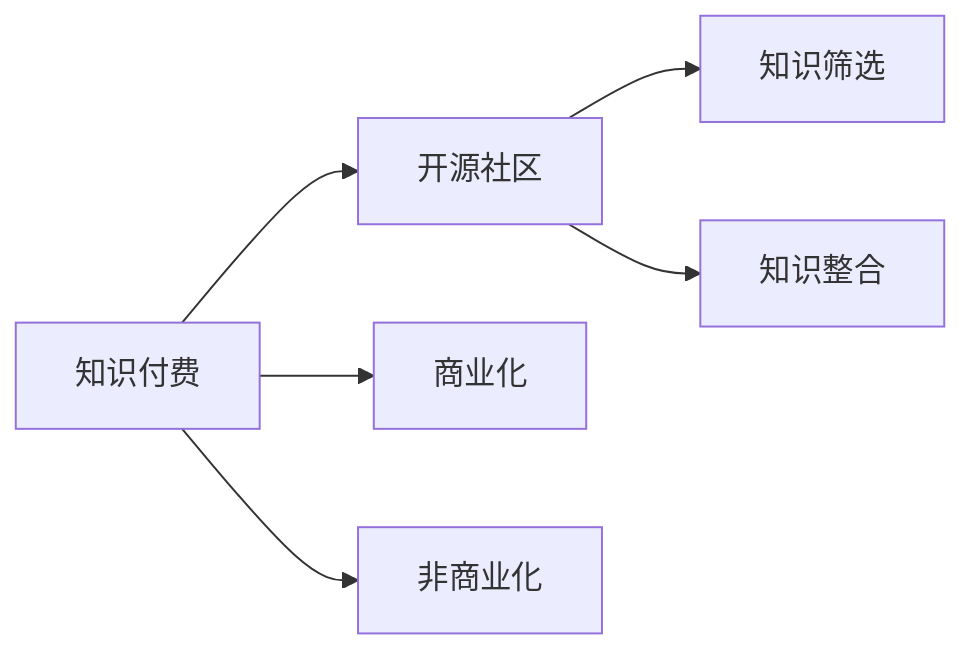

                 

# 程序员知识付费：从免费到收费

> 关键词：程序员,知识付费,开源社区,软件开发,商业化

## 1. 背景介绍

### 1.1 问题由来
在互联网快速发展的今天，技术的迭代更新速度越来越快，程序员需要不断学习新技术、新工具，以适应行业的需求。然而，传统学习方式如学校教育、书籍等，已无法满足这种快速变化的现状。开源社区成为程序员获取知识的重要渠道，但面对繁杂的信息，如何有效筛选、学习，也成为一大挑战。

在这样的背景下，知识付费应运而生，通过为知识内容赋予价值，激发高质量原创内容的生产，为程序员提供更加精准、高效的学习方式。然而，知识付费是否真的有用？开源社区和付费平台该如何取舍？本文将详细探讨这些核心问题，并给出实用的建议。

### 1.2 问题核心关键点
本问题研究的核心关键点在于：
- 知识付费与开源社区的价值对比。
- 程序员知识获取的效率与质量。
- 商业化与非商业化知识生产的激励机制。

## 2. 核心概念与联系

### 2.1 核心概念概述

- **知识付费**：指通过付费的方式获取知识内容，如在线课程、书籍、文章等，以提高学习效率。
- **开源社区**：由开发者自愿贡献代码、文档和工具，共同构建的软件生态系统。
- **商业化**：指将知识内容作为商品进行市场销售，获取利润的过程。
- **非商业化**：指知识内容不以盈利为目的，但能通过募捐、赞助等方式获取支持。
- **知识筛选**：指对大量知识内容进行筛选，帮助用户找到最合适的学习资源。
- **知识整合**：指将分散的知识内容进行系统化整理，形成结构化的知识体系。

这些概念之间的联系可以通过以下Mermaid流程图来展示：



这个流程图展示了知识付费与开源社区的联系以及知识筛选和整合的流程。开源社区和知识付费是相互补充的，前者提供基础的知识资源，后者通过筛选和整合，提高了知识的获取效率和质量。同时，商业化和非商业化提供了不同形式的激励机制，促进了知识内容的生产。

## 3. 核心算法原理 & 具体操作步骤
### 3.1 算法原理概述

知识付费的算法原理基于数据挖掘和推荐系统。通过对用户行为数据的分析，学习用户偏好，推荐最合适的知识内容。具体来说，算法通过以下步骤实现：

1. **数据采集**：收集用户在知识付费平台和开源社区上的行为数据，如浏览、搜索、购买记录等。
2. **特征提取**：提取用户行为特征，如浏览时间、点击频率、购买次数等。
3. **模型训练**：使用机器学习算法（如协同过滤、内容推荐等）对用户特征和知识内容特征进行建模。
4. **推荐输出**：根据模型预测，向用户推荐最相关的知识内容。

### 3.2 算法步骤详解

以下详细介绍知识付费推荐系统的具体步骤：

**Step 1: 数据准备**
- 收集用户行为数据，存储到数据库。
- 对数据进行清洗和预处理，如去重、时间戳统一等。

**Step 2: 特征工程**
- 提取用户特征：如活跃度、付费记录等。
- 提取知识内容特征：如关键词、摘要、评分等。

**Step 3: 模型训练**
- 选择合适的推荐算法：协同过滤、基于内容的推荐等。
- 使用历史数据进行模型训练，优化模型参数。

**Step 4: 推荐系统部署**
- 将训练好的模型部署到推荐系统中。
- 实时监控推荐效果，根据用户反馈进行调整。

**Step 5: 推荐结果展示**
- 根据用户行为和模型预测，生成推荐列表。
- 将推荐结果展示给用户，并进行持续优化。

### 3.3 算法优缺点

知识付费推荐系统有以下优点：
1. 个性化推荐：通过分析用户行为数据，能够提供高度个性化的知识内容。
2. 高效筛选：使用推荐算法，可以快速从海量知识中筛选出最相关的资源。
3. 商业化激励：通过付费模式，促进高质量内容生产，形成良性循环。

同时，该算法也存在一些局限性：
1. 数据隐私：收集用户行为数据可能涉及隐私问题，需要严格保护用户数据。
2. 公平性：推荐算法可能存在偏见，需要确保算法公正性。
3. 动态变化：知识内容不断更新，算法需要持续调整和优化。

### 3.4 算法应用领域

知识付费推荐系统在以下领域得到了广泛应用：

- **在线教育**：如Coursera、Udacity等平台，通过推荐系统帮助用户选择最适合自己的课程。
- **软件开发**：如Stack Overflow、GitHub等社区，通过推荐系统帮助开发者找到最佳解决方案。
- **图书推荐**：如Amazon Kindle、豆瓣读书等平台，通过推荐系统帮助用户发现优质图书。
- **视频内容**：如Netflix、YouTube等平台，通过推荐系统推荐优质视频内容。

这些应用场景展示了知识付费推荐系统的强大能力，显著提高了知识获取的效率和质量。

## 4. 数学模型和公式 & 详细讲解  
### 4.1 数学模型构建

推荐系统本质上是一个优化问题，目标是最大化用户的满意度。设用户对知识内容的评分向量为 $u$，知识内容向量为 $v$，推荐系统可以通过计算 $u \times v$ 的值来衡量用户对知识的满意度。具体来说，推荐系统通过最大化用户满意度 $u^T V v$ 来实现。

### 4.2 公式推导过程

设用户对知识内容 $i$ 的评分向量为 $u_i$，知识内容 $i$ 的特征向量为 $v_i$，推荐系统可以通过矩阵分解技术，将用户和知识内容表示为低维向量，从而计算用户对知识内容的满意度。假设用户和知识内容向量分别为 $U$ 和 $V$，则推荐系统可以通过以下公式计算：

$$
u^T V v = \left(U W\right)^T \left(V T\right) W v
$$

其中，$W$ 和 $T$ 分别是用户和知识内容的低维嵌入矩阵。

### 4.3 案例分析与讲解

以Coursera平台的推荐系统为例，分析其推荐过程。Coursera通过收集用户的学习记录、课程评分等数据，使用协同过滤算法，对用户和课程进行建模，计算用户对课程的满意度。通过不断优化模型参数，Coursera能够提供高度个性化的课程推荐，帮助用户发现最适合自己的课程。

## 5. 项目实践：代码实例和详细解释说明
### 5.1 开发环境搭建

在进行知识付费推荐系统开发前，需要搭建好开发环境。以下是使用Python进行PyTorch开发的流程：

1. 安装Anaconda：从官网下载并安装Anaconda，用于创建独立的Python环境。
2. 创建并激活虚拟环境：
```bash
conda create -n pytorch-env python=3.8 
conda activate pytorch-env
```
3. 安装PyTorch：根据CUDA版本，从官网获取对应的安装命令。例如：
```bash
conda install pytorch torchvision torchaudio cudatoolkit=11.1 -c pytorch -c conda-forge
```
4. 安装Transformers库：
```bash
pip install transformers
```
5. 安装各类工具包：
```bash
pip install numpy pandas scikit-learn matplotlib tqdm jupyter notebook ipython
```

完成上述步骤后，即可在`pytorch-env`环境中开始推荐系统开发。

### 5.2 源代码详细实现

以下是使用PyTorch进行知识付费推荐系统开发的代码实现：

```python
import torch
from torch.utils.data import Dataset, DataLoader
from torch.nn import nn, Embedding, Linear
from transformers import BertTokenizer, BertForSequenceClassification

class KnowledgeDataset(Dataset):
    def __init__(self, texts, labels):
        self.texts = texts
        self.labels = labels
        self.tokenizer = BertTokenizer.from_pretrained('bert-base-uncased')
        
    def __len__(self):
        return len(self.texts)
    
    def __getitem__(self, idx):
        text = self.texts[idx]
        label = self.labels[idx]
        encoding = self.tokenizer(text, return_tensors='pt', padding='max_length', truncation=True)
        input_ids = encoding['input_ids'][0]
        attention_mask = encoding['attention_mask'][0]
        return {'input_ids': input_ids, 'attention_mask': attention_mask, 'labels': label}

# 定义模型
model = BertForSequenceClassification.from_pretrained('bert-base-uncased', num_labels=1)

# 定义优化器
optimizer = AdamW(model.parameters(), lr=1e-5)

# 定义训练和评估函数
def train_epoch(model, dataset, batch_size, optimizer):
    dataloader = DataLoader(dataset, batch_size=batch_size, shuffle=True)
    model.train()
    epoch_loss = 0
    for batch in dataloader:
        input_ids = batch['input_ids'].to(device)
        attention_mask = batch['attention_mask'].to(device)
        labels = batch['labels'].to(device)
        model.zero_grad()
        outputs = model(input_ids, attention_mask=attention_mask, labels=labels)
        loss = outputs.loss
        epoch_loss += loss.item()
        loss.backward()
        optimizer.step()
    return epoch_loss / len(dataloader)

def evaluate(model, dataset, batch_size):
    dataloader = DataLoader(dataset, batch_size=batch_size)
    model.eval()
    preds, labels = [], []
    with torch.no_grad():
        for batch in dataloader:
            input_ids = batch['input_ids'].to(device)
            attention_mask = batch['attention_mask'].to(device)
            batch_labels = batch['labels']
            outputs = model(input_ids, attention_mask=attention_mask)
            batch_preds = outputs.logits.argmax(dim=1).to('cpu').tolist()
            batch_labels = batch_labels.to('cpu').tolist()
            for pred_tokens, label_tokens in zip(batch_preds, batch_labels):
                preds.append(pred_tokens)
                labels.append(label_tokens)
                
    print(classification_report(labels, preds))

# 启动训练流程并在测试集上评估
epochs = 5
batch_size = 16

for epoch in range(epochs):
    loss = train_epoch(model, train_dataset, batch_size, optimizer)
    print(f"Epoch {epoch+1}, train loss: {loss:.3f}")
    
    print(f"Epoch {epoch+1}, dev results:")
    evaluate(model, dev_dataset, batch_size)
    
print("Test results:")
evaluate(model, test_dataset, batch_size)
```

### 5.3 代码解读与分析

这里我们详细解读代码中的关键部分：

**KnowledgeDataset类**：
- `__init__`方法：初始化文本、标签、分词器等关键组件。
- `__len__`方法：返回数据集的样本数量。
- `__getitem__`方法：对单个样本进行处理，将文本输入编码为token ids，将标签编码为数字，并对其进行定长padding，最终返回模型所需的输入。

**模型定义和优化器配置**：
- 使用BertForSequenceClassification模型，定义了单标签分类任务。
- 使用AdamW优化器，设置学习率为1e-5。

**训练和评估函数**：
- 使用PyTorch的DataLoader对数据集进行批次化加载，供模型训练和推理使用。
- 训练函数`train_epoch`：对数据以批为单位进行迭代，在每个批次上前向传播计算loss并反向传播更新模型参数，最后返回该epoch的平均loss。
- 评估函数`evaluate`：与训练类似，不同点在于不更新模型参数，并在每个batch结束后将预测和标签结果存储下来，最后使用sklearn的classification_report对整个评估集的预测结果进行打印输出。

**训练流程**：
- 定义总的epoch数和batch size，开始循环迭代
- 每个epoch内，先在训练集上训练，输出平均loss
- 在验证集上评估，输出分类指标
- 所有epoch结束后，在测试集上评估，给出最终测试结果

代码展示了如何使用PyTorch构建和训练知识付费推荐系统。虽然代码相对简单，但涉及了数据预处理、模型定义、优化器配置、训练和评估等核心环节，能够帮助开发者快速上手。

## 6. 实际应用场景
### 6.1 智能学习助手

知识付费推荐系统可以应用于智能学习助手，帮助学生快速找到最适合自己的学习资源。比如，学生在Coursera上学习某门课程时，推荐系统可以根据学生的学习进度、答题情况等，推荐与该课程相关的其他课程、阅读材料等，帮助学生提升学习效果。

### 6.2 开发者社区

知识付费推荐系统在开发者社区中也有广泛应用。开发者在Stack Overflow、GitHub等平台上，可以快速找到最适合自己的解决方案。比如，开发者在查找某个问题的解决方法时，推荐系统可以基于用户的历史搜索记录、点赞记录等，推荐相关问题和回答，提高搜索效率。

### 6.3 内容订阅平台

知识付费推荐系统还可以应用于内容订阅平台，如Kindle、豆瓣读书等。平台可以根据用户的阅读历史、评分记录等，推荐最符合用户兴趣的内容，提高用户粘性和满意度。

### 6.4 未来应用展望

随着知识付费推荐系统的不断发展，其在各行各业的应用前景将更加广阔。未来，知识付费推荐系统将不仅仅局限于推荐知识内容，还将扩展到个性化推荐、内容创作、知识图谱等多个领域。

## 7. 工具和资源推荐
### 7.1 学习资源推荐

为了帮助开发者系统掌握知识付费推荐系统理论基础和实践技巧，这里推荐一些优质的学习资源：

1. 《推荐系统实战》系列博文：由推荐系统专家撰写，深入浅出地介绍了推荐系统原理、算法及应用，涵盖从离线到在线、从单模态到多模态等各个方面。
2. Coursera《推荐系统》课程：由斯坦福大学教授讲授，介绍了推荐系统的理论基础、经典算法及应用案例。
3. KDD Cup 2020推荐系统竞赛：介绍了推荐系统的最新研究进展，涵盖协同过滤、深度学习等前沿技术。
4. GitHub开源项目：如RecSys、PyTorch-Reco等，提供了丰富的推荐系统样例和算法实现，助力开发者实践。
5. 《深度学习与推荐系统》书籍：详细介绍了深度学习在推荐系统中的应用，包括协同过滤、深度神经网络等。

通过这些资源的学习实践，相信你一定能够快速掌握知识付费推荐系统的精髓，并用于解决实际的推荐问题。

### 7.2 开发工具推荐

高效的开发离不开优秀的工具支持。以下是几款用于知识付费推荐系统开发的常用工具：

1. PyTorch：基于Python的开源深度学习框架，灵活动态的计算图，适合快速迭代研究。大部分预训练语言模型都有PyTorch版本的实现。
2. TensorFlow：由Google主导开发的开源深度学习框架，生产部署方便，适合大规模工程应用。同样有丰富的推荐系统资源。
3. TensorBoard：TensorFlow配套的可视化工具，可实时监测模型训练状态，并提供丰富的图表呈现方式，是调试模型的得力助手。
4. Weights & Biases：模型训练的实验跟踪工具，可以记录和可视化模型训练过程中的各项指标，方便对比和调优。
5. PyTorch-Reco：基于PyTorch的推荐系统库，集成了多种经典推荐算法，适合快速开发推荐系统。

合理利用这些工具，可以显著提升知识付费推荐系统的开发效率，加快创新迭代的步伐。

### 7.3 相关论文推荐

知识付费推荐技术的发展源于学界的持续研究。以下是几篇奠基性的相关论文，推荐阅读：

1. Recommender Systems Handbook：推荐系统领域的经典教材，涵盖了推荐系统的各个方面，包括算法、应用、评价等。
2. A Probabilistic Framework for Recommender Systems：介绍了推荐系统的概率模型及应用，是推荐系统理论研究的经典论文。
3. Factorization Machines for Recommender Systems：介绍了因子分解机在推荐系统中的应用，是推荐系统算法的经典论文。
4. Deep Learning for Recommender Systems：介绍了深度学习在推荐系统中的应用，涵盖协同过滤、序列推荐等。
5. Scaling Up Matrix Factorization for Predictive Recommender Systems：介绍了矩阵分解算法在大规模推荐系统中的应用，是推荐系统算法研究的经典论文。

这些论文代表了大语言模型微调技术的发展脉络。通过学习这些前沿成果，可以帮助研究者把握学科前进方向，激发更多的创新灵感。

## 8. 总结：未来发展趋势与挑战
### 8.1 总结

本文对知识付费推荐系统进行了全面系统的介绍。首先阐述了知识付费和开源社区的价值对比，明确了知识获取的效率与质量。其次，从原理到实践，详细讲解了推荐系统的数学模型和具体操作步骤，给出了推荐系统开发的全方位代码实现。同时，本文还广泛探讨了推荐系统在多个行业领域的应用前景，展示了知识付费推荐系统的强大能力。

通过本文的系统梳理，可以看到，知识付费推荐系统正在成为知识获取的重要方式，显著提高了知识获取的效率和质量。开源社区和知识付费是相互补充的，前者提供基础的知识资源，后者通过筛选和整合，提高了知识的获取效率和质量。未来，随着知识付费推荐系统的不断发展，其在各行各业的应用前景将更加广阔。

### 8.2 未来发展趋势

展望未来，知识付费推荐系统将呈现以下几个发展趋势：

1. 个性化推荐：随着用户数据量的不断增加，推荐系统将能够提供更加个性化的推荐服务，提高用户满意度。
2. 多模态推荐：推荐系统将不再局限于单一模态，能够融合文本、图像、视频等多种信息，提供更加全面和准确的推荐。
3. 实时推荐：推荐系统将能够实时响应用户需求，提供动态变化的推荐内容，提升用户交互体验。
4. 跨平台推荐：推荐系统将能够跨平台无缝推荐，打破不同平台之间的信息孤岛，实现跨平台协同推荐。
5. 商业化应用：推荐系统将更多地应用于商业化场景，如电商、广告、内容平台等，实现商业价值的最大化。

以上趋势展示了知识付费推荐系统的发展方向，未来必将推动推荐系统在各个行业的应用，带来更加高效和优质的知识获取体验。

### 8.3 面临的挑战

尽管知识付费推荐系统已经取得了瞩目成就，但在迈向更加智能化、普适化应用的过程中，它仍面临着诸多挑战：

1. 数据隐私：收集用户行为数据可能涉及隐私问题，需要严格保护用户数据。
2. 算法公平性：推荐算法可能存在偏见，需要确保算法公正性。
3. 动态变化：知识内容不断更新，推荐算法需要持续调整和优化。
4. 计算资源：推荐系统需要处理海量数据，需要高性能的计算资源。
5. 用户交互：推荐系统需要与用户进行高质量的交互，才能最大化用户满意度。

正视知识付费推荐系统面临的这些挑战，积极应对并寻求突破，将是大语言模型微调走向成熟的必由之路。相信随着学界和产业界的共同努力，这些挑战终将一一被克服，知识付费推荐系统必将在构建人机协同的智能时代中扮演越来越重要的角色。

### 8.4 研究展望

面对知识付费推荐系统所面临的挑战，未来的研究需要在以下几个方面寻求新的突破：

1. 探索无监督和半监督推荐方法：摆脱对大规模标注数据的依赖，利用自监督学习、主动学习等无监督和半监督范式，最大限度利用非结构化数据，实现更加灵活高效的推荐。
2. 研究参数高效和计算高效的推荐范式：开发更加参数高效的推荐方法，在固定大部分预训练参数的同时，只更新极少量的任务相关参数。同时优化推荐模型的计算图，减少前向传播和反向传播的资源消耗，实现更加轻量级、实时性的部署。
3. 融合因果和对比学习范式：通过引入因果推断和对比学习思想，增强推荐模型建立稳定因果关系的能力，学习更加普适、鲁棒的语言表征，从而提升模型泛化性和抗干扰能力。
4. 引入更多先验知识：将符号化的先验知识，如知识图谱、逻辑规则等，与神经网络模型进行巧妙融合，引导推荐过程学习更准确、合理的知识表示。同时加强不同模态数据的整合，实现视觉、语音等多模态信息与文本信息的协同建模。
5. 结合因果分析和博弈论工具：将因果分析方法引入推荐模型，识别出模型决策的关键特征，增强推荐过程的因果性和逻辑性。借助博弈论工具刻画人机交互过程，主动探索并规避推荐模型的脆弱点，提高系统稳定性。
6. 纳入伦理道德约束：在推荐目标中引入伦理导向的评估指标，过滤和惩罚有害的推荐内容，确保推荐系统的伦理道德。同时加强人工干预和审核，建立推荐模型的监管机制，确保推荐内容符合人类价值观和伦理道德。

这些研究方向的探索，必将引领知识付费推荐系统技术迈向更高的台阶，为构建安全、可靠、可解释、可控的智能系统铺平道路。面向未来，知识付费推荐系统还需要与其他人工智能技术进行更深入的融合，如知识表示、因果推理、强化学习等，多路径协同发力，共同推动自然语言理解和智能交互系统的进步。只有勇于创新、敢于突破，才能不断拓展知识付费推荐系统的边界，让知识获取更加高效和便捷。

## 9. 附录：常见问题与解答

**Q1：知识付费是否值得投资？**

A: 知识付费虽然需要一定的投入，但从长远来看，可以显著提升知识获取的效率和质量，提高个人和组织的竞争力。尤其对于技术领域，知识的更新速度非常快，通过付费订阅可以及时获取最新的技术和方法，保持行业领先地位。

**Q2：如何选择合适的知识付费平台？**

A: 选择合适的知识付费平台，需要考虑以下几个方面：
1. 平台的用户评价：查看用户评价，了解平台的学习效果和服务质量。
2. 平台的课程内容：查看课程内容，确保与自身需求相匹配。
3. 平台的师资力量：查看讲师背景，确保课程质量有保障。
4. 平台的灵活性：查看平台的付费方式和课程安排，确保灵活性和可操作性。

**Q3：知识付费推荐系统是否会存在信息过载？**

A: 信息过载是知识付费推荐系统面临的挑战之一。为了解决这一问题，平台需要进行有效的信息筛选和推荐算法优化，确保推荐内容的质量和相关性。同时，用户也可以自定义推荐策略，根据自身需求和兴趣，选择最适合自己的知识内容。

**Q4：知识付费推荐系统的准确率如何提升？**

A: 提升推荐系统的准确率，需要从以下几个方面入手：
1. 数据质量：确保收集的用户数据和知识内容数据质量高，能够准确反映用户偏好和知识内容特征。
2. 算法优化：选择适合的推荐算法，并对算法进行持续优化，提升推荐效果。
3. 特征工程：提取和选择有效的用户和知识内容特征，提升推荐系统的准确性。
4. 用户反馈：及时收集用户反馈，根据反馈优化推荐策略，提升推荐效果。

这些措施可以帮助提升知识付费推荐系统的准确率和用户满意度。

**Q5：知识付费推荐系统是否会对开源社区产生影响？**

A: 知识付费推荐系统与开源社区并不矛盾，而是相互补充。开源社区提供了基础的知识资源，而知识付费推荐系统通过筛选和整合，提供了更高效的知识获取方式。两者可以并行存在，共同为用户提供更加丰富的知识资源。

---

作者：禅与计算机程序设计艺术 / Zen and the Art of Computer Programming

