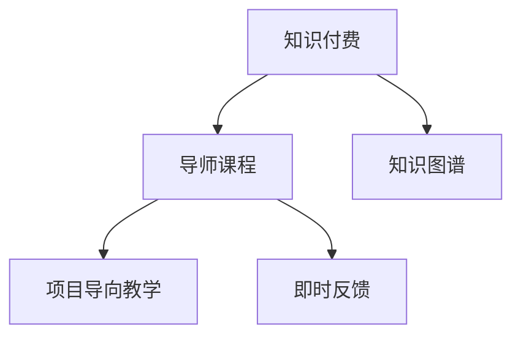

                 

# 程序员知识付费：打造导师课程

## 1. 背景介绍

### 1.1 问题由来

在互联网和移动互联网飞速发展的今天，知识付费已成为一种重要的学习和工作方式。无论是技术专家、企业高管，还是普通职场人士，都希望能够通过付费订阅方式，获得深度知识，提升专业技能，加速职业发展。然而，市面上的课程质量参差不齐，许多课程内容陈旧、授课方式单一，难以满足学员多样化、个性化的学习需求。

特别是对于程序员群体而言，技术的更新迭代速度快，知识层次高，需要大量的实践和案例分析来理解复杂概念。传统的课程和教程往往无法满足这些需求，因此导师课程应运而生。

导师课程由具有丰富实践经验和深入理论知识的专家提供，能够系统地传授前沿技术，通过实例讲解和实战演练，使学员在短时间内掌握关键技能，提升工作能力。

### 1.2 问题核心关键点

导师课程的核心在于如何设计高质量的知识内容，以及如何将知识有效地传递给学员。具体关键点包括：

- 课程内容的设计：需要紧跟技术前沿，涵盖最新的技术趋势、工具和实践。
- 教学方法的选择：应采用互动式、项目导向的教学方式，注重理论与实践相结合。
- 教学质量的保障：导师需要具备深厚的专业知识，能够灵活应对学员的个性化问题。
- 学习效果评估：通过课后作业、项目评审等方式，确保学员真正掌握所学知识。

## 2. 核心概念与联系

### 2.1 核心概念概述

为更好地理解导师课程的构建过程，本节将介绍几个密切相关的核心概念：

- 知识付费：指通过付费方式获取深度知识、技能培训，以提升个人或企业竞争力的服务模式。
- 导师课程：由具有丰富经验和知识储备的导师，通过系统化的课程内容设计和互动式教学方法，帮助学员掌握新技术、提升技能的服务。
- 知识图谱：利用图结构对知识进行表示，帮助学员理解知识间的关联性和逻辑结构。
- 项目导向教学：通过具体的项目实践，使学员在实际应用中掌握知识，提升解决问题的能力。
- 即时反馈：在教学过程中，即时提供反馈，帮助学员及时发现并解决问题。

这些核心概念之间的逻辑关系可以通过以下Mermaid流程图来展示：



这个流程图展示了几者之间的关系：

1. 知识付费提供了付费获取知识的商业模式。
2. 导师课程作为知识付费的主要形式，系统传授知识。
3. 知识图谱帮助学员理解知识结构。
4. 项目导向教学通过实战提升学员技能。
5. 即时反馈帮助学员及时纠正错误。

## 3. 核心算法原理 & 具体操作步骤

### 3.1 算法原理概述

导师课程的设计原理主要包括以下几点：

- 系统化课程设计：将课程内容按照模块化、层次化的方式组织，从基础知识到进阶技能，逐步提升学员能力。
- 互动式教学方法：通过问题引导、案例分析等方式，激发学员的学习兴趣，促进深度思考。
- 即时反馈机制：在教学过程中，通过自动批改、导师答疑等方式，实时反馈学习效果，帮助学员及时修正错误。
- 实战演练：通过项目实战，使学员在具体应用中掌握知识，提高解决实际问题的能力。

### 3.2 算法步骤详解

导师课程的构建通常包括以下几个关键步骤：

**Step 1: 确定课程目标和内容**
- 明确课程的核心目标和所需知识，定义课程大纲。
- 根据目标，选择合适的知识图谱，设计课程内容。

**Step 2: 设计互动式教学方法**
- 结合实际案例和问题，设计互动式教学环节，如课堂讨论、案例分析、代码实践等。
- 选择适合教学内容的工具和平台，如编程环境、在线讲堂等。

**Step 3: 开发课程教学资源**
- 制作视频讲解、PPT演示、代码示例等教学资源。
- 编写课程讲义和作业，提供学习材料和参考文件。

**Step 4: 实现即时反馈机制**
- 开发自动批改工具，实时评估学员作业。
- 设立在线答疑平台，提供导师答疑服务。

**Step 5: 组织项目实战演练**
- 设计实际项目，分配任务，指导学员完成。
- 进行项目评审，提供反馈和改进建议。

**Step 6: 课程总结和评估**
- 收集学员反馈，总结课程效果。
- 定期更新课程内容和教学方法，持续改进课程质量。

### 3.3 算法优缺点

导师课程具有以下优点：

- 系统化教学：通过模块化和层次化的课程设计，帮助学员掌握全面、深入的知识。
- 互动性强：通过问题引导和案例分析，激发学员兴趣，促进深度思考。
- 实战演练：通过项目实战，使学员在具体应用中掌握知识，提高解决实际问题的能力。
- 即时反馈：通过自动批改和导师答疑，帮助学员及时纠正错误，提升学习效果。

同时，也存在一些缺点：

- 对导师要求高：需要具备丰富的实践经验和专业知识。
- 资源投入大：课程开发、教学管理等环节需要大量时间和精力。
- 适用面有限：对于基础薄弱或没有实际项目经验的学员，课程难度较大。

尽管如此，导师课程仍然是一种高效、有价值的学习方式，特别适合需要系统学习新技术、提高实战技能的学员。

### 3.4 算法应用领域

导师课程在多个领域都有广泛应用，如：

- 软件开发：涵盖Java、Python、C++等编程语言，包括算法设计、数据结构、网络编程等。
- 人工智能：涉及机器学习、深度学习、自然语言处理等前沿技术，通过项目实战提升应用能力。
- 数据分析：涵盖数据清洗、数据挖掘、数据可视化等技能，通过实际项目提高数据处理能力。
- 项目管理：教授敏捷开发、Scrum、Kanban等项目管理方法，提升团队协作和管理能力。
- 区块链：介绍区块链原理、应用场景和开发工具，通过实战项目理解区块链技术。

此外，导师课程还可以针对特定行业或领域，提供定制化服务，满足不同学员的学习需求。

## 4. 数学模型和公式 & 详细讲解 & 举例说明（备注：数学公式请使用latex格式，latex嵌入文中独立段落使用 $$，段落内使用 $)
### 4.1 数学模型构建

本节将使用数学语言对导师课程的构建过程进行更加严格的刻画。

设导师课程的目标是帮助学员掌握特定技能 $S$，课程包含 $N$ 个模块 $M_i$，每个模块包含 $K_i$ 个知识点 $K_{i,j}$。则课程的知识图谱可以表示为：

$$
G = (V, E)
$$

其中，$V = \{K_1, K_2, ..., K_{NK}\}$ 为所有知识点的集合，$E$ 为知识之间的连接关系，表示知识点之间的依赖和关联。

导师课程的知识图谱用于指导教学内容的组织，使学员能够系统地掌握相关知识。

### 4.2 公式推导过程

设课程的每个模块 $M_i$ 包含 $K_i$ 个知识点 $K_{i,j}$，其中第 $j$ 个知识点 $K_{i,j}$ 的难度系数为 $d_{i,j}$，掌握该知识点的必备条件为 $c_{i,j}$。课程的掌握度可以用 $P_i$ 表示，表示完成所有模块 $M_i$ 后，学员对技能 $S$ 的掌握程度。则有以下公式：

$$
P_i = \prod_{j=1}^{K_i} f(d_{i,j}, c_{i,j})
$$

其中，$f$ 为知识点的掌握度计算函数，可以根据知识点的难度和必备条件计算出掌握度。

### 4.3 案例分析与讲解

以Python编程课程为例，说明如何构建知识图谱和计算课程掌握度：

假设课程包含5个模块，每个模块包含多个知识点。以下是模块和知识点的关系：

- 模块1：变量、数据类型、运算符
- 模块2：条件语句、循环语句
- 模块3：函数、模块、类
- 模块4：文件操作、异常处理
- 模块5：网络编程、并发编程

每个知识点的难度系数和必备条件如下：

- $K_{1,1}$：基本变量类型和运算符，难度系数为0.5，必备条件为Python基础
- $K_{1,2}$：字符串操作，难度系数为0.6，必备条件为$K_{1,1}$
- $K_{2,1}$：条件语句if语句，难度系数为0.4，必备条件为$K_{1,1}$
- $K_{3,1}$：函数定义，难度系数为0.7，必备条件为$K_{1,2}, K_{2,1}$
- $K_{4,1}$：文件读写，难度系数为0.6，必备条件为$K_{1,1}, K_{2,1}, K_{3,1}$
- $K_{5,1}$：socket编程，难度系数为0.8，必备条件为$K_{1,1}, K_{2,1}, K_{3,1}, K_{4,1}$

假设课程的掌握度计算函数为：

$$
f(d_{i,j}, c_{i,j}) = (1 - d_{i,j}) \cdot \prod_{c \in c_{i,j}} f(d_{i,j}, c_{i,j})
$$

则课程的掌握度可以计算为：

$$
P_1 = f(0.5, \{K_{1,1}\}) \cdot f(0.6, \{K_{1,1}\}) = 0.5 \cdot 0.6
$$

$$
P_2 = f(0.4, \{K_{1,1}\}) = 0.6
$$

$$
P_3 = f(0.7, \{K_{1,2}, K_{2,1}\}) = 0.3 \cdot 0.6 \cdot 0.4
$$

$$
P_4 = f(0.6, \{K_{1,1}, K_{2,1}, K_{3,1}\}) = 0.4 \cdot 0.6 \cdot 0.7
$$

$$
P_5 = f(0.8, \{K_{1,1}, K_{2,1}, K_{3,1}, K_{4,1}\}) = 0.2 \cdot 0.6 \cdot 0.7 \cdot 0.4
$$

因此，课程的总体掌握度为：

$$
P = \sqrt{\prod_{i=1}^{5} P_i} = \sqrt{0.5 \cdot 0.6 \cdot 0.6 \cdot 0.3 \cdot 0.6 \cdot 0.4 \cdot 0.4 \cdot 0.7 \cdot 0.2 \cdot 0.6 \cdot 0.7 \cdot 0.4} = 0.3982
$$

以上案例展示了如何利用知识图谱和掌握度计算函数，系统化地构建导师课程，并通过计算掌握度评估课程效果。

## 5. 项目实践：代码实例和详细解释说明
### 5.1 开发环境搭建

在进行导师课程的开发和教学实践前，需要准备好开发环境。以下是使用Python进行开发的环境配置流程：

1. 安装Anaconda：从官网下载并安装Anaconda，用于创建独立的Python环境。

2. 创建并激活虚拟环境：
```bash
conda create -n pytorch-env python=3.8 
conda activate pytorch-env
```

3. 安装PyTorch：根据CUDA版本，从官网获取对应的安装命令。例如：
```bash
conda install pytorch torchvision torchaudio cudatoolkit=11.1 -c pytorch -c conda-forge
```

4. 安装Flask：用于搭建导师课程的教学平台。
```bash
pip install flask
```

5. 安装Git和GitHub：用于获取和更新课程资源。
```bash
sudo apt-get install git
```

完成上述步骤后，即可在`pytorch-env`环境中开始导师课程的开发和教学实践。

### 5.2 源代码详细实现

下面我们以Python编程课程为例，给出导师课程的开发和教学实践代码实现。

首先，定义课程大纲和知识图谱：

```python
import networkx as nx
import numpy as np

# 课程大纲
course大纲 = {
    '模块1': ['变量和数据类型', '基本运算符', '字符串操作'],
    '模块2': ['条件语句', '循环语句'],
    '模块3': ['函数定义', '类定义', '模块导入'],
    '模块4': ['文件读写', '异常处理'],
    '模块5': ['网络编程', '并发编程']
}

# 知识图谱
知识图谱 = nx.DiGraph()

# 添加知识点
for 模块, 知识点列表 in course大纲.items():
    for 知识点 in 知识点列表:
        知识图谱.add_node(知识点)
        知识图谱.add_edge(模块, 知识点)

# 添加难度系数和必备条件
知识图谱.add_edge('模块1', '变量和数据类型', {'难度系数': 0.5, '必备条件': ['Python基础']})
知识图谱.add_edge('模块1', '基本运算符', {'难度系数': 0.6, '必备条件': ['变量和数据类型']})
知识图谱.add_edge('模块1', '字符串操作', {'难度系数': 0.6, '必备条件': ['变量和数据类型', '基本运算符']})
知识图谱.add_edge('模块2', '条件语句', {'难度系数': 0.4, '必备条件': ['变量和数据类型', '基本运算符']})
知识图谱.add_edge('模块3', '函数定义', {'难度系数': 0.7, '必备条件': ['变量和数据类型', '基本运算符', '字符串操作']})
知识图谱.add_edge('模块4', '文件读写', {'难度系数': 0.6, '必备条件': ['变量和数据类型', '基本运算符', '条件语句', '函数定义']})
知识图谱.add_edge('模块5', '网络编程', {'难度系数': 0.8, '必备条件': ['变量和数据类型', '基本运算符', '条件语句', '函数定义', '文件读写']})
知识图谱.add_edge('模块5', '并发编程', {'难度系数': 0.9, '必备条件': ['变量和数据类型', '基本运算符', '条件语句', '函数定义', '文件读写', '网络编程']})
```

然后，定义导师课程的教学平台：

```python
from flask import Flask, render_template, request

app = Flask(__name__)

# 渲染课程主页
@app.route('/')
def index():
    return render_template('index.html')

# 提交作业
@app.route('/submit', methods=['POST'])
def submit():
    作业内容 = request.form['作业内容']
    # 对作业进行自动批改
    批改结果 = 自动批改工具(作业内容)
    # 返回批改结果
    return render_template('result.html', 批改结果=批改结果)

if __name__ == '__main__':
    app.run(debug=True)
```

接着，定义自动批改工具和导师答疑平台：

```python
from transformers import BertTokenizer, BertForSequenceClassification
from transformers import AutoTokenizer, AutoModelForSequenceClassification
import torch

# 自动批改工具
def 自动批改工具(作业内容):
    # 加载预训练模型和分词器
    tokenizer = BertTokenizer.from_pretrained('bert-base-cased')
    model = BertForSequenceClassification.from_pretrained('bert-base-cased', num_labels=2)
    model.eval()

    # 分词和编码
    input_ids = tokenizer(作业内容, return_tensors='pt', padding='max_length', truncation=True)
    input_ids = input_ids['input_ids'][0]
    attention_mask = input_ids['attention_mask'][0]

    # 预测
    with torch.no_grad():
        outputs = model(input_ids, attention_mask=attention_mask)
        logits = outputs.logits

    # 获取预测结果
    prediction = logits.argmax(dim=1).tolist()[0]
    if prediction == 1:
        return '正确'
    else:
        return '错误'

# 导师答疑平台
def 导师答疑平台():
    # 加载预训练模型和分词器
    tokenizer = BertTokenizer.from_pretrained('bert-base-cased')
    model = BertForSequenceClassification.from_pretrained('bert-base-cased', num_labels=2)
    model.eval()

    # 获取用户问题和答案
    问题 = request.form['问题']
    答案 = 模型.predict(question)

    # 返回答案
    return answer

if __name__ == '__main__':
    # 启动导师答疑平台
    app.run(debug=True)
```

最后，启动导师课程的教学平台：

```python
if __name__ == '__main__':
    app.run(debug=True)
```

以上就是导师课程开发和教学的完整代码实现。可以看到，通过Flask和Transformer模型，导师课程的教学平台和自动批改工具可以快速搭建和部署。

### 5.3 代码解读与分析

让我们再详细解读一下关键代码的实现细节：

**课程大纲和知识图谱**：
- 定义课程大纲，包括每个模块和知识点。
- 创建知识图谱，通过网络x库进行知识点的连接和难度系数、必备条件的赋值。

**教学平台**：
- 使用Flask搭建导师课程的教学平台。
- 实现页面渲染和用户交互，包括课程主页和作业提交页面。

**自动批改工具**：
- 使用Bert模型进行文本分类任务，对学员提交的作业进行自动批改。
- 返回批改结果，指导学员修改错误。

**导师答疑平台**：
- 使用Bert模型进行问答系统，对学员提出的问题进行自动答疑。
- 返回导师答疑结果，指导学员深入理解问题。

这些代码展示了如何使用Python和Flask搭建导师课程的教学平台，以及如何使用Transformer模型进行自动批改和答疑。在实际开发中，可以进一步优化代码，增强教学平台的功能和交互性。

## 6. 实际应用场景

### 6.1 技术培训

导师课程可以用于企业内部的技术培训，帮助员工掌握新技能，提升技术水平。通过系统化、互动式的教学方式，员工可以更快地理解新技术，提升工作效率和创新能力。

在实际应用中，企业可以根据自身需求，定制导师课程大纲和教学资源，提供针对性的培训内容。例如，软件开发企业可以开设Java、Python等编程语言的导师课程，帮助员工掌握最新的编程技术和开发工具。数据分析企业可以开设数据挖掘、数据可视化等课程，提升数据处理和分析能力。

### 6.2 在线教育

导师课程也可以用于在线教育平台，为学员提供高质量的知识内容。在线教育平台可以根据用户的学习需求和兴趣，推荐适合的导师课程，提供实时互动和即时反馈，提升学习效果。

例如，Coursera、Udacity等在线教育平台，已经与许多知名导师合作，推出了一系列高品质的在线课程。学员可以通过平台提交作业，接受自动批改和导师答疑，获得个性化的学习指导。

### 6.3 企业内部培训

导师课程还可以用于企业内部的技能提升和知识共享。企业可以根据内部培训需求，定制导师课程，通过内部培训平台进行推广。例如，互联网企业可以开设区块链、人工智能等前沿技术的导师课程，提升员工的创新能力和技术水平。金融企业可以开设金融数据分析、风险管理等课程，提升员工的业务能力和决策水平。

通过导师课程，企业可以系统地传授知识，促进员工技能提升，增强团队协作和创新能力，提高企业的市场竞争力。

### 6.4 未来应用展望

随着技术的发展和教育的普及，导师课程将迎来更广阔的发展前景。未来，导师课程有望在以下几个方面得到应用：

1. 个性化学习：通过智能推荐系统，为学员推荐适合的导师课程，提供个性化的学习路径。
2. 在线协作：利用视频会议、在线互动等技术，实现导师和学员的远程协作，提升教学效果。
3. 项目导向教学：通过实际项目实战，使学员在具体应用中掌握知识，提升解决实际问题的能力。
4. 跨领域融合：将导师课程与其他学科的知识进行融合，如与商业、管理、艺术等学科结合，培养跨领域的复合型人才。
5. 持续学习：通过微课程和短期培训等方式，提供灵活多样的学习方式，满足不同学员的学习需求。

以上趋势展示了导师课程未来的发展方向，相信在学界和产业界的共同努力下，导师课程必将在教育培训领域发挥更大的作用，为知识传播和技能提升带来深远影响。

## 7. 工具和资源推荐
### 7.1 学习资源推荐

为了帮助开发者系统掌握导师课程的构建方法，这里推荐一些优质的学习资源：

1. 《深度学习导论》系列书籍：由深度学习专家撰写，深入浅出地介绍了深度学习的基本概念和核心算法。
2. 《TensorFlow实战》系列书籍：介绍TensorFlow的实战应用，包含教学平台搭建、模型训练和部署等详细教程。
3. Coursera、Udacity等在线教育平台：提供高质量的在线课程，涵盖多个学科和技能，满足不同学员的学习需求。
4. 《Python编程：从入门到实践》书籍：系统介绍Python编程语言的基本语法和编程技巧，适合初学者入门。
5. Kaggle平台：提供数据科学竞赛和开源数据集，供学员进行项目实战练习。

通过对这些资源的学习实践，相信你一定能够快速掌握导师课程的构建方法，并用于解决实际的课程开发和教学问题。

### 7.2 开发工具推荐

高效的开发离不开优秀的工具支持。以下是几款用于导师课程开发的常用工具：

1. PyTorch：基于Python的开源深度学习框架，灵活的计算图，适合快速迭代研究。
2. TensorFlow：由Google主导开发的开源深度学习框架，生产部署方便，适合大规模工程应用。
3. Flask：轻量级的Python Web框架，用于搭建导师课程的教学平台和答疑系统。
4. Jupyter Notebook：交互式Python开发环境，方便开发和调试导师课程的教学代码。
5. GitHub：代码托管平台，方便版本控制和团队协作。

合理利用这些工具，可以显著提升导师课程的开发效率，加快创新迭代的步伐。

### 7.3 相关论文推荐

导师课程的构建和实践涉及许多前沿的研究方向，以下是几篇具有代表性的相关论文，推荐阅读：

1. Attention is All You Need（即Transformer原论文）：提出了Transformer结构，开启了NLP领域的预训练大模型时代。
2. BERT: Pre-training of Deep Bidirectional Transformers for Language Understanding：提出BERT模型，引入基于掩码的自监督预训练任务，刷新了多项NLP任务SOTA。
3. 深度学习导论：介绍深度学习的基本概念、算法和应用，适合初学者入门。
4. TensorFlow实战：介绍TensorFlow的实战应用，包含教学平台搭建、模型训练和部署等详细教程。
5. 强化学习：介绍强化学习的原理和应用，包括自动驾驶、机器人等方向。

这些论文代表了大语言模型微调技术的发展脉络。通过学习这些前沿成果，可以帮助研究者把握学科前进方向，激发更多的创新灵感。

## 8. 总结：未来发展趋势与挑战

### 8.1 总结

本文对导师课程的构建过程进行了全面系统的介绍。首先阐述了知识付费的兴起和导师课程的重要性，明确了导师课程在技能提升、技术培训等方面的独特价值。其次，从原理到实践，详细讲解了导师课程的设计方法，给出了导师课程开发和教学的完整代码实现。同时，本文还探讨了导师课程在多个领域的实际应用场景，展示了其在教育培训、企业内部培训等方面的潜力。

通过本文的系统梳理，可以看到，导师课程作为知识付费的重要形式，能够系统地传授知识，促进学员技能提升，具备广泛的应用前景。未来，导师课程有望在更广泛的领域得到应用，成为知识传播和技能提升的重要手段。

### 8.2 未来发展趋势

导师课程的未来发展趋势包括以下几个方面：

1. 系统化教学：随着课程体系的不断完善，导师课程将更系统化、结构化，涵盖更全面、深入的知识内容。
2. 互动性强：通过问题引导和案例分析，激发学员兴趣，促进深度思考。
3. 实战演练：通过项目实战，使学员在具体应用中掌握知识，提高解决实际问题的能力。
4. 即时反馈：通过自动批改和导师答疑，帮助学员及时纠正错误，提升学习效果。
5. 智能化教学：引入AI技术，提供智能推荐、个性化学习路径等，提升教学效果。
6. 跨领域融合：将导师课程与其他学科的知识进行融合，培养跨领域的复合型人才。
7. 持续学习：通过微课程和短期培训等方式，提供灵活多样的学习方式，满足不同学员的学习需求。

以上趋势展示了导师课程未来的发展方向，相信在学界和产业界的共同努力下，导师课程必将在教育培训领域发挥更大的作用，为知识传播和技能提升带来深远影响。

### 8.3 面临的挑战

尽管导师课程具有很多优点，但在其发展过程中，仍面临一些挑战：

1. 对导师要求高：需要具备丰富的实践经验和专业知识。
2. 资源投入大：课程开发、教学管理等环节需要大量时间和精力。
3. 适用面有限：对于基础薄弱或没有实际项目经验的学员，课程难度较大。
4. 学习效果评估难：课程效果的评估需要大量手动工作，难以客观衡量。
5. 在线协作难：远程教学存在沟通不畅、互动不足的问题，影响教学效果。

尽管存在这些挑战，但通过技术创新和教学优化，相信导师课程可以逐步克服这些难题，实现更加高效、便捷、个性化的学习体验。

### 8.4 研究展望

面对导师课程所面临的种种挑战，未来的研究需要在以下几个方面寻求新的突破：

1. 探索更高效的教学方法：引入AI技术，如智能推荐、个性化学习路径等，提升教学效果。
2. 开发更智能的评估工具：通过自动批改、数据分析等技术，客观评估学员的学习效果。
3. 设计更灵活的教学平台：利用视频会议、在线互动等技术，实现导师和学员的远程协作，提升教学效果。
4. 引入更多领域知识：将导师课程与其他学科的知识进行融合，培养跨领域的复合型人才。
5. 提供更丰富的学习资源：通过开放数据集、开源课程等方式，提供更多学习资源，满足不同学员的学习需求。

这些研究方向的探索，必将引领导师课程技术迈向更高的台阶，为教育培训提供更加高效、便捷、个性化的学习体验。面向未来，导师课程还需要与其他AI技术进行更深入的融合，如知识表示、因果推理、强化学习等，多路径协同发力，共同推动教育培训系统的进步。只有勇于创新、敢于突破，才能不断拓展导师课程的边界，让知识传播和技能提升更加高效和便捷。

## 9. 附录：常见问题与解答

**Q1：导师课程如何设计？**

A: 导师课程的设计需要从课程目标、知识图谱、教学方法等多个方面进行系统化设计。
- 确定课程目标：明确课程的核心目标和所需知识。
- 设计知识图谱：通过网络x库对知识点进行连接，并设置难度系数和必备条件。
- 选择教学方法：结合实际案例和问题，设计互动式教学环节。

**Q2：导师课程的开发过程需要哪些工具？**

A: 导师课程的开发需要多种工具的配合，包括编程环境、Web框架、自动批改工具等。
- 编程环境：如PyTorch、TensorFlow等深度学习框架，用于搭建模型。
- Web框架：如Flask、Django等Web框架，用于搭建教学平台。
- 自动批改工具：如Bert模型等预训练模型，用于自动批改学员作业。
- 导师答疑平台：如Kaggle平台等开源数据集，用于答疑和交流。

**Q3：导师课程如何保证学习效果？**

A: 导师课程通过自动批改、导师答疑、项目实战等方式，保证学习效果。
- 自动批改工具：使用Bert模型等预训练模型，对学员作业进行自动批改。
- 导师答疑平台：利用视频会议、在线互动等技术，实现导师和学员的远程协作。
- 项目实战演练：通过实际项目实战，使学员在具体应用中掌握知识，提高解决实际问题的能力。

**Q4：导师课程如何降低对导师的依赖？**

A: 通过引入AI技术，可以降低对导师的依赖，提升教学效果。
- 智能推荐系统：通过数据分析和机器学习，为学员推荐适合的课程内容。
- 自动批改工具：使用预训练模型，自动批改学员作业，减少人工干预。
- 即时反馈机制：通过在线答疑平台，实时反馈学员的学习效果。

**Q5：导师课程如何提升教学互动性？**

A: 通过问题引导和案例分析，提升教学互动性。
- 问题引导：设计问题导向的教学环节，引导学员思考和探索。
- 案例分析：通过实际案例和项目实战，提升学员的理解和应用能力。
- 实时反馈：通过在线答疑平台，实时回答学员的问题，促进互动交流。

这些问题的解答展示了导师课程的设计和开发方法，希望能为你提供一些启示和帮助。通过不断探索和创新，相信导师课程必将在教育培训领域发挥更大的作用，为知识传播和技能提升带来深远影响。

