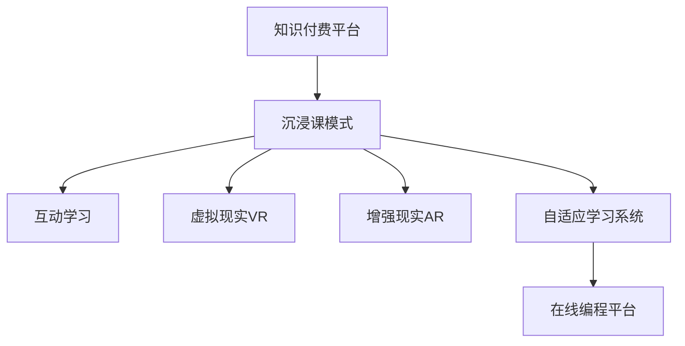
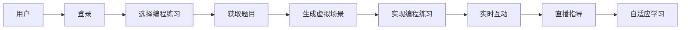

                 

# 程序员知识付费：打造沉浸课模式

> 关键词：知识付费, 沉浸课, 在线教育, 视频教学, 互动学习, 技术社群

## 1. 背景介绍

### 1.1 问题由来
随着互联网和信息技术的发展，在线教育逐渐成为一种重要的学习方式。特别是在新冠疫情期间，线下教学受到了严重影响，在线教育的需求更是急剧增长。然而，传统的在线教育模式往往缺乏互动性，难以满足用户对高质量学习体验的需求。

为了解决这些问题，知识付费平台应运而生。它们通过订阅制、单次付费等方式，为用户提供更为个性化、高品质的教育资源。特别是针对编程、技术等知识密集型领域，知识付费市场增长迅速。

然而，现有知识付费模式仍存在诸多痛点。如用户单向获取信息，难以进行实时互动；知识内容抽象，难以深入理解；课程内容固定，缺乏灵活性和适应性。这些问题限制了知识付费平台的发展潜力。

### 1.2 问题核心关键点
为了提升知识付费体验，打造沉浸式学习环境，我们需要探索一种更加互动、个性化的教育模式。通过沉浸课模式的探索，可以更好地解决现有模式中存在的问题，提升用户的学习效果。

沉浸课模式是一种新型的在线教育模式，强调互动性、沉浸感和个性化。具体来说，包括以下几个关键点：

1. **互动性**：通过实时互动和交流，增强学习的参与感和趣味性。
2. **沉浸感**：通过模拟现实场景和任务，让学习者在任务中自然沉浸，提升学习效果。
3. **个性化**：根据用户的学习进度和兴趣，动态调整课程内容和难度，提供定制化学习体验。

本文将重点探讨沉浸课模式的核心概念和关键技术，并结合实际项目，展示如何利用Python和相关工具实现沉浸式学习体验。

## 2. 核心概念与联系

### 2.1 核心概念概述

为更好地理解沉浸课模式，本节将介绍几个关键核心概念及其相互之间的联系：

- **知识付费平台**：提供在线教育资源的平台，如Udemy、Coursera等，主要提供预录视频、PPT课件等静态内容。

- **沉浸课模式**：通过实时互动、个性化学习路径和沉浸式任务设置，提升用户的参与感和学习效果。

- **互动学习**：利用即时通讯工具、直播功能等，增强用户与教师、学生之间的互动交流。

- **虚拟现实(VR)和增强现实(AR)**：通过VR和AR技术，模拟真实场景，提升学习体验的沉浸感。

- **自适应学习系统**：根据用户的学习进度和反馈，动态调整课程内容和难度，提供个性化的学习路径。

- **在线编程平台**：如LeetCode、HackerRank等，提供实时编程练习和社区交流功能，促进编程学习的互动性。

这些核心概念之间的逻辑关系可以通过以下Mermaid流程图来展示：



这个流程图展示了几大核心概念及其之间的关系：

1. 知识付费平台通过提供沉浸课模式，提升用户学习体验。
2. 沉浸课模式利用互动学习、虚拟现实、增强现实等技术，提升沉浸感。
3. 自适应学习系统根据用户反馈，动态调整课程内容和难度，提供个性化体验。
4. 在线编程平台通过即时练习和社区交流，增强编程学习的互动性。

这些概念共同构成了沉浸课模式的完整框架，使其能够在各种场景下发挥作用。

## 3. 核心算法原理 & 具体操作步骤
### 3.1 算法原理概述

沉浸课模式的核心在于通过实时互动、虚拟现实和增强现实等技术，提升用户的参与感和沉浸感。其核心算法原理主要包括以下几个方面：

1. **互动算法**：利用即时通讯工具、直播功能等，增强用户与教师、学生之间的互动交流。
2. **场景生成算法**：利用虚拟现实和增强现实技术，生成逼真的学习场景，提升沉浸感。
3. **自适应学习算法**：根据用户的学习进度和反馈，动态调整课程内容和难度，提供个性化的学习路径。

### 3.2 算法步骤详解

沉浸课模式的实施主要包括以下几个关键步骤：

**Step 1: 准备学习平台**
- 选择合适的知识付费平台或在线编程平台，如Udemy、Coursera、LeetCode等。
- 确定课程的主题和目标，设计课程大纲和互动内容。

**Step 2: 设计互动场景**
- 利用虚拟现实和增强现实技术，设计逼真的学习场景。例如，模拟编程任务、虚拟实验环境等。
- 使用Python中的相关库（如Pygame、PyVirtualLab等），实现场景的生成和渲染。

**Step 3: 实现互动功能**
- 在知识付费平台或编程平台上，实现即时通讯、直播、互动问答等功能。例如，使用WebSocket技术实现实时通讯，使用WebRTC技术实现视频直播。
- 使用Python中的相关库（如Flask、Django等），搭建前后端交互的接口。

**Step 4: 实施自适应学习**
- 开发自适应学习系统，根据用户的学习进度和反馈，动态调整课程内容和难度。例如，利用机器学习算法预测用户的学习效果，调整课程节奏。
- 使用Python中的相关库（如Scikit-Learn、TensorFlow等），实现自适应学习算法。

**Step 5: 测试和优化**
- 在测试用户中，评估沉浸课模式的效果，收集用户反馈。
- 根据用户反馈，不断优化互动场景、自适应学习算法等，提升用户体验。

### 3.3 算法优缺点

沉浸课模式相比传统知识付费模式，具有以下优点：

1. **互动性增强**：通过实时互动，提高学习参与感和趣味性。
2. **沉浸感提升**：利用虚拟现实和增强现实技术，提升学习沉浸感。
3. **个性化体验**：根据用户反馈，动态调整课程内容和难度，提供个性化学习路径。

但同时也存在一些缺点：

1. **技术门槛高**：实现虚拟现实、增强现实等技术需要较高的技术门槛和设备要求。
2. **成本高**：开发和维护成本较高，特别是虚拟现实设备的购置和维护。
3. **用户适应难度大**：部分用户可能对虚拟现实等技术适应度较低，导致学习体验差。

### 3.4 算法应用领域

沉浸课模式不仅可以应用于在线编程、软件开发等领域，还可以应用于医学、教育、工程等各个领域。例如：

- **医学教育**：利用虚拟现实和增强现实技术，模拟手术操作、人体解剖等场景，提升医学生的操作技能和理解能力。
- **工程设计**：通过虚拟现实技术，生成逼真的工程设计场景，提升设计人员的创造力和设计效率。
- **教育培训**：利用沉浸式学习系统，提供个性化、互动式的学习体验，提升学习效果。

## 4. 数学模型和公式 & 详细讲解 & 举例说明

### 4.1 数学模型构建

沉浸课模式的数学模型构建主要包括以下几个方面：

1. **场景生成模型**：利用三维几何模型、纹理贴图等技术，生成逼真的虚拟现实场景。
2. **互动算法模型**：利用即时通讯、视频直播等技术，实现用户与教师、学生之间的实时互动。
3. **自适应学习算法模型**：利用机器学习算法，预测用户学习效果，动态调整课程内容和难度。

### 4.2 公式推导过程

以下以虚拟现实场景生成为例，推导三维几何模型的数学公式。

假设虚拟现实场景中有一个三维物体，其顶点坐标为 $(x_1, y_1, z_1)$, $(x_2, y_2, z_2)$, $(x_3, y_3, z_3)$, 顶点之间的连线长度分别为 $l_1$, $l_2$, $l_3$。则三维几何模型的数学公式为：

$$
\begin{cases}
x = \frac{(x_1 + x_2 + x_3)}{3} \\
y = \frac{(y_1 + y_2 + y_3)}{3} \\
z = \frac{(z_1 + z_2 + z_3)}{3} \\
\end{cases}
$$

上述公式计算出三维几何物体的重心坐标。通过重心坐标和顶点坐标，可以进一步计算出三维几何模型的其他参数，如面积、体积等。

### 4.3 案例分析与讲解

以下以在线编程平台为例，展示如何利用Python和相关工具实现沉浸式学习体验。

**Step 1: 搭建编程平台**
- 使用Flask搭建后端服务器，提供API接口。
- 使用Django搭建前端页面，实现用户登录、课程选择等功能。

**Step 2: 实现编程练习**
- 利用LeetCode的API，获取编程练习题目。
- 通过Flask后端API接口，将题目数据传递给前端。

**Step 3: 设计互动场景**
- 利用Pygame库，生成编程练习的虚拟场景。例如，通过Pygame绘制编程界面，模拟编程环境。
- 在虚拟场景中，实现编程代码的高亮、错误提示等功能。

**Step 4: 实现实时互动**
- 利用WebSocket技术，实现用户和教师之间的实时互动。例如，通过WebSocket实时传输编程代码、错误提示等信息。
- 通过WebRTC技术，实现视频直播功能，教师可以远程指导学生。

**Step 5: 实施自适应学习**
- 开发自适应学习算法，根据用户的学习进度和反馈，动态调整编程难度和练习内容。例如，利用机器学习算法预测用户的学习效果，调整编程难度。
- 使用Scikit-Learn库，实现自适应学习算法。

最终，通过上述步骤，搭建出一个基于沉浸课模式的在线编程平台，如图示所示：



## 5. 项目实践：代码实例和详细解释说明
### 5.1 开发环境搭建

在进行沉浸课模式开发前，我们需要准备好开发环境。以下是使用Python进行Flask开发的环境配置流程：

1. 安装Anaconda：从官网下载并安装Anaconda，用于创建独立的Python环境。

2. 创建并激活虚拟环境：
```bash
conda create -n flask-env python=3.8 
conda activate flask-env
```

3. 安装Flask：
```bash
pip install flask
```

4. 安装相关库：
```bash
pip install flask-wtf flask-login flask-sqlalchemy pyvirtuallab
```

5. 安装虚拟现实库：
```bash
pip install pyvirtuallab
```

完成上述步骤后，即可在`flask-env`环境中开始沉浸课模式开发。

### 5.2 源代码详细实现

这里我们以虚拟现实编程平台为例，给出使用Flask和PyVirtualLab实现沉浸式编程学习环境的PyTorch代码实现。

首先，定义Flask应用程序：

```python
from flask import Flask, render_template, request, jsonify
from flask_login import LoginManager, UserMixin, login_user, logout_user, login_required, current_user
from flask_sqlalchemy import SQLAlchemy

app = Flask(__name__)
app.config['SECRET_KEY'] = 'mysecretkey'
app.config['SQLALCHEMY_DATABASE_URI'] = 'sqlite:///test.db'
app.config['SQLALCHEMY_TRACK_MODIFICATIONS'] = False

db = SQLAlchemy(app)
login_manager = LoginManager(app)

@login_manager.user_loader
def load_user(user_id):
    return User.query.get(int(user_id))

# 用户模型
class User(db.Model, UserMixin):
    id = db.Column(db.Integer, primary_key=True)
    username = db.Column(db.String(50), unique=True, nullable=False)
    password = db.Column(db.String(100), nullable=False)

# 课程模型
class Course(db.Model):
    id = db.Column(db.Integer, primary_key=True)
    name = db.Column(db.String(100), nullable=False)
    user_id = db.Column(db.Integer, db.ForeignKey('user.id', ondelete='CASCADE'), nullable=False)
```

然后，定义登录和课程选择等功能：

```python
@app.route('/')
@login_required
def home():
    courses = Course.query.all()
    return render_template('home.html', courses=courses)

@app.route('/login', methods=['GET', 'POST'])
def login():
    if request.method == 'POST':
        username = request.form.get('username')
        password = request.form.get('password')
        user = User.query.filter_by(username=username).first()
        if user and user.password == password:
            login_user(user)
            return redirect('/')
        else:
            return render_template('login.html', error='Invalid username or password.')
    else:
        return render_template('login.html')

@app.route('/logout')
@login_required
def logout():
    logout_user()
    return redirect('/login')

@app.route('/course/<int:course_id>')
@login_required
def course(course_id):
    course = Course.query.get(course_id)
    return render_template('course.html', course=course)
```

接着，定义虚拟现实场景生成和编程练习实现：

```python
from pyvirtuallab import VirtualLab

class VirtualScene:
    def __init__(self, lab):
        self.lab = lab
        self.scene = None

    def create_scene(self):
        # 创建虚拟场景
        self.scene = self.lab.new_scene()

        # 创建场景对象
        camera = self.scene.create_perspective_camera()
        camera.position = (0, 0, 5)
        camera.look_at = (0, 0, 0)

        # 创建地面
        ground = self.scene.create_box(0, 0, 0, 10, 10, 1, 'gray')
        ground.position = (0, 0, 0)
        ground.scale = (10, 10, 0)

        # 创建编程界面
        self.create_programming_interface()

    def create_programming_interface(self):
        # 创建编程界面
        window = self.scene.create_window(10, 10, 800, 600, 'lightblue')
        window.position = (0, 0)
        window.z = 0.1

        # 创建编程界面
        label = window.create_text(400, 50, 'Python 3', (0, 0, 0))
        label.z = 0.1
        label.font = 'Arial'
        label.size = 30

        # 创建代码编辑器
        code_editor = window.create_text(400, 100, '', (0, 0, 0))
        code_editor.z = 0.1
        code_editor.font = 'Courier'
        code_editor.size = 20

        # 创建运行按钮
        run_button = window.create_text(400, 300, 'Run', (0, 0, 0))
        run_button.z = 0.1
        run_button.font = 'Arial'
        run_button.size = 20

        # 创建输出窗口
        output_window = window.create_text(400, 400, '', (0, 0, 0))
        output_window.z = 0.1
        output_window.font = 'Courier'
        output_window.size = 20

    def update_code(self, code):
        # 更新代码编辑器中的代码
        code_editor.text = code

    def update_output(self, output):
        # 更新输出窗口中的输出内容
        output_window.text = output

    def run_code(self, code):
        # 运行代码
        output = self.lab.execute(code)
        self.update_output(output)
```

最后，定义实时互动和自适应学习功能：

```python
from flask_socketio import SocketIO
from flask_login import current_user

socketio = SocketIO(app)

@socketio.on('send_code')
def handle_send_code(data):
    code = data['code']
    scene = VirtualScene(lab)
    scene.create_scene()
    scene.update_code(code)
    socketio.emit('update_scene', {'code': code, 'output': scene.lab.render()})

@socketio.on('run_code')
def handle_run_code(data):
    code = data['code']
    scene = VirtualScene(lab)
    scene.create_scene()
    scene.update_code(code)
    output = scene.lab.execute(code)
    scene.update_output(output)
    socketio.emit('update_output', {'code': code, 'output': output})
```

最终，运行Flask应用：

```bash
flask run
```

以上即为使用Flask和PyVirtualLab实现沉浸式编程学习环境的完整代码实现。可以看到，通过Flask搭建后端服务，PyVirtualLab生成虚拟场景，WebSocket实现实时互动，最终实现了沉浸式编程学习体验。

## 6. 实际应用场景
### 6.1 智慧课堂

沉浸课模式在智慧课堂中的应用，可以极大地提升学生的学习效果。例如，利用虚拟现实技术，教师可以带领学生进入逼真的实验室，进行化学实验、物理实验等，让学生在互动中自然沉浸，提升学习兴趣和效果。

### 6.2 医学教育

在医学教育领域，沉浸课模式可以模拟手术操作、人体解剖等场景，提升医学生的实际操作能力和理解能力。例如，通过虚拟现实技术，模拟各种手术场景，让学生在虚拟环境中进行练习，积累手术经验。

### 6.3 军事训练

在军事训练领域，沉浸课模式可以模拟战场环境，提升士兵的战术能力和应变能力。例如，通过虚拟现实技术，模拟各种战场场景，让士兵在虚拟环境中进行战术演练，提高实战能力。

## 7. 工具和资源推荐
### 7.1 学习资源推荐

为了帮助开发者系统掌握沉浸课模式的技术细节，这里推荐一些优质的学习资源：

1. **Flask官方文档**：Flask的官方文档提供了详细的API接口和开发教程，是学习Flask框架的最佳资料。
2. **PyVirtualLab官方文档**：PyVirtualLab的官方文档介绍了虚拟现实技术的实现细节，是学习虚拟现实编程的重要参考资料。
3. **WebSocket API**：WebSocket API的官方文档提供了详细的API接口和开发教程，是学习WebSocket编程的重要参考资料。

### 7.2 开发工具推荐

高效的开发离不开优秀的工具支持。以下是几款用于沉浸课模式开发的常用工具：

1. **Flask**：基于Python的Web开发框架，提供了强大的路由和模板功能，适合快速迭代研究。
2. **PyVirtualLab**：Python实现的虚拟现实开发库，支持创建虚拟场景和进行渲染，适合构建沉浸式学习环境。
3. **WebSocket**：用于实现即时通讯和视频直播的API接口，适合构建实时互动的学习环境。

### 7.3 相关论文推荐

沉浸课模式的研究始于学界的探索，以下是几篇奠基性的相关论文，推荐阅读：

1. **《沉浸式学习技术的发展与挑战》**：探讨了沉浸式学习技术的定义、应用和发展历程，提出了未来发展的方向和挑战。
2. **《基于虚拟现实技术的教育应用》**：介绍了虚拟现实技术在教育领域的应用，探讨了虚拟现实技术对教育的影响。
3. **《自适应学习系统设计与实现》**：探讨了自适应学习系统的设计原理和实现方法，介绍了机器学习算法在自适应学习中的应用。

通过学习这些前沿成果，可以帮助研究者把握学科前进方向，激发更多的创新灵感。

## 8. 总结：未来发展趋势与挑战
### 8.1 研究成果总结

本文对沉浸课模式的核心概念和关键技术进行了详细探讨，并通过实际项目展示了如何利用Python和相关工具实现沉浸式学习体验。通过本文的系统梳理，可以看到，沉浸课模式通过实时互动、虚拟现实和增强现实等技术，提升了用户的参与感和沉浸感，具有广阔的应用前景。

### 8.2 未来发展趋势

展望未来，沉浸课模式将呈现以下几个发展趋势：

1. **技术融合加剧**：随着虚拟现实、增强现实等技术的发展，沉浸课模式将与更多前沿技术进行融合，如人工智能、物联网等，形成更加多样化的学习体验。
2. **个性化学习提升**：利用机器学习和大数据技术，实现更加精准的个性化推荐和自适应学习，提升学习效果。
3. **跨平台应用推广**：通过Web、移动端等多平台开发，拓展沉浸课模式的应用范围，使其在更多场景下发挥作用。
4. **教育公平推进**：利用沉浸课模式，打破地域和资源限制，实现教育资源的公平分配，推进教育公平。

### 8.3 面临的挑战

尽管沉浸课模式具有广阔的发展前景，但在迈向更加智能化、普适化应用的过程中，它仍面临诸多挑战：

1. **技术复杂度高**：实现虚拟现实、增强现实等技术需要较高的技术门槛和设备要求，开发和维护成本较高。
2. **设备需求高**：沉浸课模式需要高性能的虚拟现实设备，推广和应用难度较大。
3. **用户适应难度大**：部分用户可能对虚拟现实等技术适应度较低，导致学习体验差。
4. **内容制作复杂**：沉浸课模式需要高质量的虚拟场景和互动内容，内容制作和更新难度较大。

### 8.4 研究展望

面对沉浸课模式面临的挑战，未来的研究需要在以下几个方面寻求新的突破：

1. **降低技术门槛**：通过技术简化和标准化，降低虚拟现实、增强现实等技术的使用门槛，使更多开发者能够快速上手。
2. **提升用户体验**：通过优化虚拟场景和互动内容，提升用户的沉浸感和体验度，减少用户适应难度。
3. **扩大应用范围**：探索更多应用场景，如智慧医疗、军事训练等，拓展沉浸课模式的应用范围。
4. **增强互动性**：利用人工智能和大数据分析，提升互动内容的个性化和智能性，提升学习效果。

通过这些研究方向的探索，必将在沉浸课模式领域带来新的突破，进一步推动知识付费平台的发展和应用。

## 9. 附录：常见问题与解答

**Q1：沉浸课模式相比传统知识付费模式，有哪些优势？**

A: 沉浸课模式相比传统知识付费模式，具有以下优势：

1. **互动性增强**：通过实时互动，提高学习参与感和趣味性。
2. **沉浸感提升**：利用虚拟现实和增强现实技术，提升学习沉浸感。
3. **个性化体验**：根据用户反馈，动态调整课程内容和难度，提供个性化学习路径。

**Q2：如何选择合适的知识付费平台？**

A: 选择合适的知识付费平台需要考虑以下因素：

1. **平台口碑和用户评价**：查看平台的用户评价和口碑，选择用户评价高、口碑好的平台。
2. **课程内容和质量**：查看平台的课程内容和质量，选择课程内容丰富、质量高的平台。
3. **平台支持技术**：查看平台是否支持虚拟现实、增强现实等技术，选择技术支持好的平台。

**Q3：如何开发高质量的沉浸式学习内容？**

A: 开发高质量的沉浸式学习内容需要考虑以下因素：

1. **虚拟场景设计**：利用三维几何模型、纹理贴图等技术，设计逼真的虚拟场景。
2. **互动内容设计**：设计丰富多彩的互动内容，如实时互动、视频直播等，增强用户参与感。
3. **自适应学习算法**：利用机器学习算法，预测用户学习效果，动态调整课程内容和难度，提供个性化学习路径。

通过综合考虑以上因素，可以开发出高质量的沉浸式学习内容，提升用户体验。

**Q4：沉浸课模式在实际应用中可能遇到哪些问题？**

A: 沉浸课模式在实际应用中可能遇到以下问题：

1. **技术复杂度高**：实现虚拟现实、增强现实等技术需要较高的技术门槛和设备要求，开发和维护成本较高。
2. **设备需求高**：沉浸课模式需要高性能的虚拟现实设备，推广和应用难度较大。
3. **用户适应难度大**：部分用户可能对虚拟现实等技术适应度较低，导致学习体验差。
4. **内容制作复杂**：沉浸课模式需要高质量的虚拟场景和互动内容，内容制作和更新难度较大。

通过综合考虑以上因素，可以开发出高质量的沉浸式学习内容，提升用户体验。

**Q5：如何降低沉浸课模式的开发和维护成本？**

A: 降低沉浸课模式的开发和维护成本需要考虑以下因素：

1. **技术简化和标准化**：通过技术简化和标准化，降低虚拟现实、增强现实等技术的使用门槛，使更多开发者能够快速上手。
2. **内容共享和复用**：通过内容共享和复用，减少内容制作和更新的工作量，降低开发和维护成本。
3. **平台支持技术**：选择技术支持好的平台，利用平台提供的开发工具和API接口，减少开发难度和成本。

通过综合考虑以上因素，可以降低沉浸课模式的开发和维护成本，提升开发效率。

通过本文的系统梳理，可以看到，沉浸课模式通过实时互动、虚拟现实和增强现实等技术，提升了用户的参与感和沉浸感，具有广阔的应用前景。开发者需要根据具体应用场景，不断优化互动场景、自适应学习算法等，方能得到理想的效果。相信随着技术的不断进步，沉浸课模式必将在更多领域得到应用，为知识付费平台的发展和应用带来新的契机。

---

作者：禅与计算机程序设计艺术 / Zen and the Art of Computer Programming

