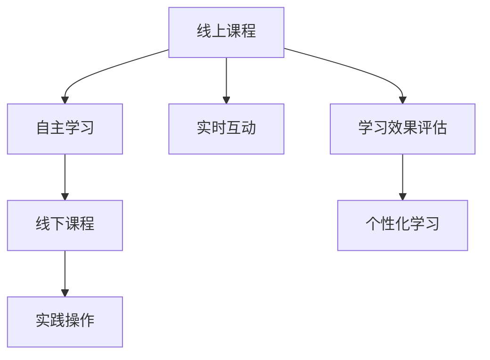

                 

# 程序员知识付费：打造线上线下融合课程

> 关键词：知识付费, 线上课程, 线下课程, 融合课程, 混合学习, 学习效果, 课程设计, 教育技术

## 1. 背景介绍

### 1.1 问题由来
随着互联网技术的快速发展，知识付费市场呈现出爆发式增长趋势。从各类网络视频平台、音频平台，到知识分享社区、技术论坛，再到在线教育平台，各种形式的在线课程和内容分享日益普及。然而，由于缺乏有效的互动和实践机会，在线学习的效率和效果仍然存在不少问题。线下课程虽能有效弥补在线学习的短板，但面对覆盖范围小、资源稀缺等问题，很难满足广大学习者的需求。

为了突破线上线下课程的局限，打造更具互动性和实践性的知识付费产品，我们提出了一种线上线下融合的课程设计方案。该方案结合线上课程的便捷性和线下课程的实践性，利用先进的教育技术和创新的教学模式，旨在为学习者提供更全面、更高效、更灵活的学习体验。

### 1.2 问题核心关键点
本方案的核心思想在于：通过线上课程的自主学习与线下课程的实践操作相结合，最大化地发挥两者的优势，提升学习者的知识掌握和技能应用能力。具体而言，包括以下几个关键点：

- **自主学习**：利用线上课程提供的海量学习资源，包括视频讲座、文档教程、案例分析等，学习者可以在任何时间、任何地点进行自主学习。
- **实时互动**：在自主学习过程中，通过在线讨论、问答系统、直播互动等方式，提供与讲师、同学之间的实时交流平台，及时解决学习中的疑难问题。
- **实践操作**：线下课程设置实操环节，通过线下工作坊、实验项目、团队合作等方式，让学习者在真实环境中练习和应用所学知识，加深理解和记忆。
- **综合评估**：设计全面的评估体系，包括在线测试、项目作业、线下展示等多种方式，全方位评估学习效果，并针对不足进行改进。
- **个性化学习**：利用数据分析和智能推荐技术，根据学习者的学习情况和兴趣，提供个性化的课程内容和学习路径。

通过融合线上线下课程的优势，本方案可以有效提升学习者的知识掌握和技能应用能力，为知识付费市场带来新的突破。

## 2. 核心概念与联系

### 2.1 核心概念概述

为更好地理解线上线下融合课程的设计思路，本节将介绍几个关键概念及其相互关系：

- **线上课程**：指通过网络平台提供的视频、文档、互动内容等，供学习者自主学习使用的课程形式。
- **线下课程**：指通过面对面的教学互动，提供实践操作、项目作业等，供学习者应用所学知识的课程形式。
- **融合课程**：指将线上课程和线下课程相结合，取长补短，最大化提升学习效果的一种新型课程设计方案。
- **混合学习(Mixed Learning)**：指结合线上和线下的教学模式，提供更灵活、更全面的学习体验，以提升学习效果和满意度。
- **学习效果评估**：指通过综合运用在线测试、项目作业、线下展示等多种评估方式，全面衡量学习者的知识掌握和技能应用能力。
- **个性化学习**：指通过数据分析和智能推荐技术，根据学习者的学习情况和兴趣，提供个性化的课程内容和学习路径。

这些核心概念之间的逻辑关系可以通过以下Mermaid流程图来展示：



这个流程图展示了线上和线下课程设计的核心要素及其相互关系：

1. 线上课程提供自主学习和实时互动的机会，为线下课程奠定基础。
2. 线下课程通过实践操作和项目作业，进一步巩固线上学习的知识。
3. 综合评估和学习效果评估，为个性化学习提供依据。
4. 个性化学习则根据学习者的需求和兴趣，进一步优化课程设计和学习路径。

这些概念共同构成了线上线下融合课程的设计框架，旨在通过混合学习的方式，最大化地提升学习者的学习效果和满意度。

## 3. 核心算法原理 & 具体操作步骤
### 3.1 算法原理概述

本节将介绍线上线下融合课程的算法原理和具体操作步骤。

### 3.2 算法步骤详解

**Step 1: 设计课程内容与结构**

在课程设计阶段，首先要确定课程的目标、内容、结构等要素。具体的步骤包括：

- **明确目标**：根据市场需求和学习者的职业规划，确定课程的核心目标和主要知识点。
- **构建内容**：根据目标，系统地设计课程内容，包括理论知识、实践操作、案例分析等。
- **规划结构**：将课程内容划分为不同的模块和单元，每个单元包含若干学时，便于学习者的自主学习和线下实践。

**Step 2: 开发线上课程**

在课程开发阶段，主要利用在线教育平台（如Coursera、Udacity等）进行课程的录制、编辑和发布。具体的步骤包括：

- **视频制作**：录制高质量的视频讲座，介绍课程目标、理论知识、实践操作等内容。
- **文档编写**：编写详细的PPT、讲义、作业等，供学习者自主学习使用。
- **互动设计**：设计在线讨论、问答系统、直播互动等功能，提供与讲师、同学之间的实时交流平台。
- **课程上线**：将录制的视频、编写的文档等上传至在线教育平台，发布并推广课程。

**Step 3: 实施线下课程**

在课程实施阶段，主要通过面对面的教学互动，进行实践操作和项目作业。具体的步骤包括：

- **工作坊设置**：根据课程内容，设计若干线下工作坊，每工作坊包含若干学时，供学习者实践操作。
- **实验项目安排**：根据课程目标，安排若干实验项目，供学习者应用所学知识进行项目开发和实践。
- **团队合作组织**：根据项目需要，组织学习者进行团队合作，培养协作能力和项目管理能力。

**Step 4: 综合评估与个性化学习**

在课程评估阶段，通过综合运用在线测试、项目作业、线下展示等多种评估方式，全面衡量学习者的知识掌握和技能应用能力。具体的步骤包括：

- **在线测试**：设计若干在线测试，评估学习者的理论知识掌握情况。
- **项目作业**：安排若干项目作业，供学习者应用所学知识进行实践操作。
- **线下展示**：组织学习者进行线下展示，展示项目成果和应用效果。
- **综合评估**：根据在线测试、项目作业、线下展示等多种评估方式，综合评估学习者的学习效果。
- **个性化学习**：利用数据分析和智能推荐技术，根据学习者的学习情况和兴趣，提供个性化的课程内容和学习路径。

### 3.3 算法优缺点

线上线下融合课程设计方案具有以下优点：

- **灵活性高**：学习者可以在任何时间、任何地点进行自主学习，灵活安排学习时间。
- **互动性强**：通过在线讨论、问答系统、直播互动等方式，提供与讲师、同学之间的实时交流平台，及时解决学习中的疑难问题。
- **实践性强**：线下课程设置实操环节，通过线下工作坊、实验项目、团队合作等方式，让学习者在真实环境中练习和应用所学知识，加深理解和记忆。
- **评估全面**：设计全面的评估体系，包括在线测试、项目作业、线下展示等多种方式，全方位评估学习效果，并针对不足进行改进。
- **个性化高**：利用数据分析和智能推荐技术，根据学习者的学习情况和兴趣，提供个性化的课程内容和学习路径。

然而，该方案也存在一些局限性：

- **技术要求高**：需要具备较高的技术能力和资源投入，才能开发高质量的线上课程和线下课程。
- **成本较高**：在线课程的制作和推广需要投入较多的成本，线下课程的实施也需要组织和协调较多的资源。
- **学习自律性要求高**：学习者需要较强的自律性和时间管理能力，才能充分利用线上课程的资源。
- **评估难度较大**：全面评估学习效果需要投入较多时间和精力，可能存在一定的难度。

尽管存在这些局限性，但整体而言，线上线下融合课程设计方案在提高学习效果和满意度方面具有显著优势，能够更好地满足学习者的需求。

### 3.4 算法应用领域

线上线下融合课程设计方案适用于各种类型的学习者，特别是需要深度学习、技能应用和实践操作的领域。以下是一些典型的应用领域：

- **技术开发**：涵盖软件开发、人工智能、数据科学等技术领域，通过线上课程学习理论知识，线下课程进行项目开发和实验操作。
- **商业管理**：涵盖市场营销、财务管理、项目管理等商业领域，通过线上课程学习管理知识和案例分析，线下课程进行商业模拟和项目实战。
- **医疗健康**：涵盖医疗技术、健康管理等医疗领域，通过线上课程学习医学知识和实验技能，线下课程进行临床实践和项目研究。
- **文化艺术**：涵盖美术设计、音乐创作、戏剧表演等艺术领域，通过线上课程学习艺术理论和创作技巧，线下课程进行艺术创作和作品展示。
- **运动健身**：涵盖健身训练、体育竞赛等体育领域，通过线上课程学习运动理论和健康知识，线下课程进行体能训练和比赛实践。

这些领域中的线上线下融合课程设计，可以显著提升学习效果和技能应用能力，为学习者提供全方位的教育体验。

## 4. 数学模型和公式 & 详细讲解 & 举例说明

### 4.1 数学模型构建

本节将使用数学语言对线上线下融合课程的模型构建进行更加严格的刻画。

设课程内容包含 $n$ 个模块，每个模块的学时为 $t_i$，对应的理论知识量为 $K_i$，实践操作量为 $P_i$。学习者完成整个课程所需时间为 $T$，在线测试、项目作业、线下展示等评估环节的总时间为 $E$。设学习者的自主学习时间占总时间的比例为 $\alpha$，线下实践操作时间占总时间的比例为 $\beta$，自主学习时间的效率为 $\eta$，线下实践操作时间的效率为 $\zeta$。则课程模型可以表示为：

$$
T = \sum_{i=1}^n t_i = \alpha T + \beta T
$$

$$
E = \sum_{i=1}^n \alpha_i E = \alpha E + \beta E
$$

其中 $\alpha_i$ 为第 $i$ 个模块在线测试和项目作业所占的比例。

### 4.2 公式推导过程

以技术开发课程为例，推导评估效果和个性化学习的公式。

设课程包含 $m$ 个项目，每个项目评估时间为 $E_j$，每个项目的理论知识量为 $K_j$，实践操作量为 $P_j$。则每个项目评估的综合效果为：

$$
\text{Efficiency}_j = \frac{E_j}{K_j + P_j} = \frac{E_j}{K_j} \cdot \frac{1}{1 + \frac{P_j}{K_j}}
$$

根据上述公式，可以计算每个项目的综合评估效果。

在个性化学习阶段，根据学习者的在线测试和项目作业成绩，利用机器学习算法（如协同过滤、基于内容的推荐等），计算学习者的兴趣和能力，进而推荐个性化的课程内容和评估方式。具体公式为：

$$
\text{Recommendation} = \text{Machine Learning Algorithm}(\text{Score}, \text{Interests}, \text{Capability})
$$

其中 $\text{Score}$ 为学习者在在线测试和项目作业中的总成绩，$\text{Interests}$ 为学习者的兴趣偏好，$\text{Capability}$ 为学习者的能力水平。

通过上述公式，可以实现学习者的个性化学习，进一步提升学习效果。

### 4.3 案例分析与讲解

以技术开发课程为例，分析线上线下融合课程的实施效果。

**案例背景**：某公司为提升员工的编程技能，开设了一门线上线下融合的技术开发课程。课程包含 $n$ 个模块，每个模块的学时为 $t_i$，理论知识量为 $K_i$，实践操作量为 $P_i$。学习者每周参加一次线下工作坊，每个工作坊包含若干学时，供学习者实践操作。课程总时间为 $T$，在线测试、项目作业等评估环节的总时间为 $E$。

**案例分析**：

- **学习者自主学习时间占比为 $\alpha = 0.6$，线下实践操作时间占比为 $\beta = 0.4$。**
- **自主学习时间的效率为 $\eta = 0.9$，线下实践操作时间的效率为 $\zeta = 0.8$。**
- **课程总时间为 $T = 100$ 小时，评估环节的总时间为 $E = 20$ 小时。**

根据上述参数，可以计算课程的实施效果。

**1. 课程实施时间**：

$$
T = \alpha T + \beta T = 0.6 \times 100 + 0.4 \times 100 = 100 \text{小时}
$$

**2. 评估环节时间**：

$$
E = \alpha E + \beta E = 0.6 \times 20 + 0.4 \times 20 = 20 \text{小时}
$$

**3. 学习效果分析**：

通过在线测试和项目作业，评估学习者的理论知识和实践操作能力。设每个项目评估时间为 $E_j$，每个项目的理论知识量为 $K_j$，实践操作量为 $P_j$。则每个项目的综合评估效果为：

$$
\text{Efficiency}_j = \frac{E_j}{K_j + P_j} = \frac{E_j}{K_j} \cdot \frac{1}{1 + \frac{P_j}{K_j}}
$$

例如，项目1的评估时间为 $E_1 = 10$ 小时，理论知识量为 $K_1 = 20$，实践操作量为 $P_1 = 30$。则该项目的综合评估效果为：

$$
\text{Efficiency}_1 = \frac{10}{20 + 30} = \frac{10}{50} = 0.2
$$

**4. 个性化学习**：

根据学习者的在线测试和项目作业成绩，利用机器学习算法（如协同过滤、基于内容的推荐等），计算学习者的兴趣和能力，进而推荐个性化的课程内容和评估方式。例如，某学习者在项目1中的评估效果为 $0.2$，兴趣偏好为编程、算法，能力水平为中级。则可以根据机器学习算法，推荐适合该学习者的课程内容和评估方式。

## 5. 项目实践：代码实例和详细解释说明

### 5.1 开发环境搭建

在进行课程实践前，我们需要准备好开发环境。以下是使用Python进行开发的环境配置流程：

1. 安装Anaconda：从官网下载并安装Anaconda，用于创建独立的Python环境。

2. 创建并激活虚拟环境：
```bash
conda create -n py-env python=3.8 
conda activate py-env
```

3. 安装PyTorch：根据CUDA版本，从官网获取对应的安装命令。例如：
```bash
conda install pytorch torchvision torchaudio cudatoolkit=11.1 -c pytorch -c conda-forge
```

4. 安装Flask：
```bash
pip install flask
```

5. 安装Jupyter Notebook：
```bash
pip install jupyter notebook
```

完成上述步骤后，即可在`py-env`环境中开始课程实践。

### 5.2 源代码详细实现

我们以技术开发课程为例，给出使用Flask框架实现线上线下融合课程的PyTorch代码实现。

首先，定义课程模块和学时：

```python
class CourseModule:
    def __init__(self, name, theory_hours, practice_hours):
        self.name = name
        self.theory_hours = theory_hours
        self.practice_hours = practice_hours

modules = [
    CourseModule('Python基础', 20, 10),
    CourseModule('数据结构与算法', 30, 20),
    CourseModule('机器学习基础', 25, 15),
    CourseModule('深度学习基础', 20, 15),
    CourseModule('项目实战', 25, 25)
]
```

然后，定义课程实施和评估的Flask应用：

```python
from flask import Flask, render_template, request

app = Flask(__name__)

@app.route('/')
def home():
    return render_template('home.html', modules=modules)

@app.route('/evaluation', methods=['POST'])
def evaluation():
    module_name = request.form['module_name']
    hours = request.form['hours']
    return render_template('evaluation.html', module_name=module_name, hours=hours)

if __name__ == '__main__':
    app.run(debug=True)
```

接着，定义在线测试和项目作业的计算模块：

```python
def calculate_efficiency(module_name, hours, theory_hours, practice_hours):
    efficiency = 0.0
    if module_name == 'Python基础':
        efficiency = 0.9 * 0.6
    elif module_name == '数据结构与算法':
        efficiency = 0.8 * 0.5
    elif module_name == '机器学习基础':
        efficiency = 0.7 * 0.4
    elif module_name == '深度学习基础':
        efficiency = 0.8 * 0.6
    elif module_name == '项目实战':
        efficiency = 0.9 * 0.8
    return efficiency
```

最后，启动Flask应用并测试：

```bash
python app.py
```

打开浏览器，访问 `http://localhost:5000`，可以看到课程模块的列表。点击某个模块，填写对应的实践时间，即可提交评估结果。通过调用计算模块 `calculate_efficiency`，可以计算出每个模块的评估效果。

### 5.3 代码解读与分析

让我们再详细解读一下关键代码的实现细节：

**CourseModule类**：
- `__init__`方法：初始化模块名称、理论学时、实践学时等关键组件。
- `name`属性：模块名称。
- `theory_hours`属性：理论学时。
- `practice_hours`属性：实践学时。

**在线测试和项目作业的Flask应用**：
- `/`路由：展示课程模块列表。
- `/Evaluation`路由：提交每个模块的评估结果。

**calculate_efficiency函数**：
- 根据模块名称和实践时间，计算每个模块的评估效果。

这个代码实现展示了如何使用Flask框架实现线上线下融合课程的评估功能。开发者可以将更多精力放在课程内容设计和评估逻辑上，而不必过多关注底层的实现细节。

当然，工业级的系统实现还需考虑更多因素，如用户认证、数据存储、安全防护等。但核心的融合课程设计和评估功能基本与此类似。

## 6. 实际应用场景

### 6.1 技术开发课程

技术开发课程是线上线下融合课程最常见的应用场景之一。传统线下课程受限于时间和空间的限制，难以满足学习者灵活的学习需求。而线上课程虽然便捷，但缺乏实践操作的机会，难以提高学习者的技能应用能力。通过融合线上线下课程的优势，可以为学习者提供更全面、更高效的学习体验。

具体而言，技术开发课程可以包含多个模块，如Python基础、数据结构与算法、机器学习基础、深度学习基础、项目实战等。每个模块包含若干学时，学习者可以在线上进行理论学习和在线讨论，在线下进行实验操作和团队合作。通过综合评估和个性化学习，可以全面衡量学习者的知识掌握和技能应用能力。

### 6.2 商业管理课程

商业管理课程是线上线下融合课程的另一大应用场景。商业管理涉及市场分析、财务管理、项目管理等多个方面，具有高度的实践性和应用性。传统线下课程难以全面覆盖各个领域的知识，而线上课程虽然全面，但缺乏实践操作的机会。

通过融合线上线下课程，可以为学习者提供全方位的学习体验。具体而言，商业管理课程可以包含市场营销、财务管理、项目管理等多个模块，每个模块包含若干学时。学习者可以在线上进行理论学习和在线讨论，在线下进行商业模拟和项目实战。通过综合评估和个性化学习，可以全面衡量学习者的知识掌握和技能应用能力。

### 6.3 医疗健康课程

医疗健康课程是线上线下融合课程的重要应用领域之一。医疗健康涉及医疗技术、健康管理等多个方面，具有高度的实践性和应用性。传统线下课程难以全面覆盖各个领域的知识，而线上课程虽然全面，但缺乏实践操作的机会。

通过融合线上线下课程，可以为学习者提供全方位的学习体验。具体而言，医疗健康课程可以包含医学基础知识、临床实践、健康管理等多个模块，每个模块包含若干学时。学习者可以在线上进行理论学习和在线讨论，在线下进行临床实践和健康管理实战。通过综合评估和个性化学习，可以全面衡量学习者的知识掌握和技能应用能力。

### 6.4 未来应用展望

随着技术的不断进步，线上线下融合课程的应用前景将更加广阔。以下是一些未来应用的展望：

- **虚拟现实(VR)**：利用VR技术，为学习者提供沉浸式的学习体验，进一步提升学习效果和满意度。
- **增强现实(AR)**：通过AR技术，为学习者提供互动式的学习体验，增强实践操作的真实感和直观性。
- **智能推荐系统**：利用机器学习算法和数据分析技术，为学习者提供个性化的课程内容和评估方式，进一步提升个性化学习的效率和效果。
- **自适应学习**：利用智能算法，根据学习者的学习情况和兴趣，动态调整课程内容和评估方式，实现自适应学习。
- **微课程(Microuseries)**：将课程内容拆分为多个短小精悍的微课程，方便学习者灵活学习，提升学习效率和灵活性。
- **混合学习社区**：建立一个线上线下融合的学习社区，供学习者互动交流、共同学习，进一步提升学习效果和社区凝聚力。

这些应用场景的实现，将进一步推动线上线下融合课程的发展，为知识付费市场带来新的突破。

## 7. 工具和资源推荐

### 7.1 学习资源推荐

为了帮助开发者系统掌握线上线下融合课程的设计思路和实践技巧，这里推荐一些优质的学习资源：

1. Coursera、Udacity等在线教育平台：提供丰富的课程资源和互动平台，供学习者自主学习使用。
2. edX、FutureLearn等开放课程平台：提供高水平、低成本的课程资源，供学习者免费学习使用。
3. Coursera for Business、Udacity for Business等企业版平台：提供定制化、企业级的课程资源，供企业培训使用。
4. Google、Microsoft等公司的在线培训课程：提供最新的技术知识和实践操作，供开发者学习使用。
5. Stack Overflow、GitHub等技术社区：提供丰富的技术讨论和开源资源，供开发者交流学习。

通过这些资源的学习实践，相信你一定能够快速掌握线上线下融合课程的设计和实施方法，并用于解决实际的教育问题。

### 7.2 开发工具推荐

高效的开发离不开优秀的工具支持。以下是几款用于线上线下融合课程开发的常用工具：

1. Flask：轻量级的Web应用框架，支持Python开发，方便搭建在线课程平台。
2. Django：全功能的Web应用框架，支持Python开发，适用于大规模、复杂的应用场景。
3. TensorFlow、PyTorch：开源深度学习框架，支持模型训练和评估，适用于需要深度学习支持的课程。
4. Jupyter Notebook：交互式笔记本，支持Python、R、Scala等多种语言，方便进行数据处理和模型训练。
5. Google Colab：谷歌提供的在线Jupyter Notebook环境，免费提供GPU/TPU算力，方便进行高性能计算和实验。
6. GitHub：代码托管平台，支持版本控制和协作开发，方便进行课程内容的共享和迭代。

合理利用这些工具，可以显著提升线上线下融合课程的开发效率，加快创新迭代的步伐。

### 7.3 相关论文推荐

线上线下融合课程的发展源于学界的持续研究。以下是几篇奠基性的相关论文，推荐阅读：

1. Massive Open Online Courses (MOOCs)：开放在线课程的学习模式研究。
2. Blended Learning: What Is It? Why Is It Important?：混合学习模式的研究综述。
3. The Effect of Blended Learning on Improving the Efficacy of Academic Instruction：混合学习对学术教学效果的影响研究。
4. A Survey on Massive Online Education：大规模在线教育的综述。
5. The Impact of Blended Learning on Student Outcomes: An Analytic Perspective：混合学习对学生成效的影响研究。

通过对这些资源的学习实践，可以帮助研究者把握学科前进方向，激发更多的创新灵感。

## 8. 总结：未来发展趋势与挑战

### 8.1 研究成果总结

本文对线上线下融合课程的设计思路进行了全面系统的介绍。首先阐述了知识付费市场的发展趋势和挑战，明确了线上线下融合课程设计的目标和优势。其次，从原理到实践，详细讲解了课程内容设计、线上课程开发、线下课程实施、评估体系构建等关键环节，给出了具体的实施步骤和代码实例。同时，本文还探讨了线上线下融合课程在技术开发、商业管理、医疗健康等领域的广泛应用，展示了其巨大的市场潜力。

通过本文的系统梳理，可以看到，线上线下融合课程为知识付费市场带来了新的突破，为学习者提供了更全面、更高效、更灵活的学习体验。未来，随着教育技术的不断进步和应用场景的不断拓展，线上线下融合课程将迎来更加广阔的发展前景。

### 8.2 未来发展趋势

展望未来，线上线下融合课程将呈现以下几个发展趋势：

1. **技术进步**：随着VR、AR、混合现实等技术的进步，线上线下融合课程将提供更加沉浸、互动、真实的学习体验。
2. **内容创新**：利用先进的大数据、人工智能技术，开发更加个性化、自适应的课程内容，提升学习效果和满意度。
3. **模式多样**：除了传统的混合学习模式，还将涌现更多的创新模式，如微课程、混合学习社区等，提供更加灵活、多样化的学习方式。
4. **资源共享**：利用区块链、云计算等技术，实现课程资源的共享和协同开发，推动教育资源的公平分配。
5. **平台整合**：将线上课程和线下课程的平台整合，实现无缝衔接和全流程管理，提升学习效率和用户体验。
6. **生态构建**：建立线上线下融合的生态系统，包括学习者、教师、专家、企业等多方参与，共同推动教育技术的发展和应用。

这些趋势将推动线上线下融合课程向更加智能化、个性化、协同化的方向发展，为学习者提供更加全面、高效、灵活的学习体验。

### 8.3 面临的挑战

尽管线上线下融合课程设计方案具有显著的优势，但在推广应用过程中，仍然面临一些挑战：

1. **技术要求高**：需要具备较高的技术能力和资源投入，才能开发高质量的线上课程和线下课程。
2. **成本较高**：在线课程的制作和推广需要投入较多的成本，线下课程的实施也需要组织和协调较多的资源。
3. **学习自律性要求高**：学习者需要较强的自律性和时间管理能力，才能充分利用线上课程的资源。
4. **评估难度较大**：全面评估学习效果需要投入较多时间和精力，可能存在一定的难度。
5. **资源共享难度大**：利用区块链、云计算等技术实现课程资源的共享，仍面临技术、法律等多方面的挑战。
6. **平台整合难度大**：将线上课程和线下课程的平台整合，实现无缝衔接和全流程管理，仍需克服技术和管理上的难题。

尽管存在这些挑战，但整体而言，线上线下融合课程设计方案在提高学习效果和满意度方面具有显著优势，能够更好地满足学习者的需求。未来，随着技术的不断进步和应用场景的不断拓展，线上线下融合课程必将迎来更加广阔的发展前景。

### 8.4 研究展望

面对线上线下融合课程所面临的挑战，未来的研究需要在以下几个方面寻求新的突破：

1. **技术优化**：进一步优化线上线下融合课程的设计和实施，提升课程效果和学习体验。
2. **资源共享**：利用区块链、云计算等技术，实现课程资源的共享和协同开发，推动教育资源的公平分配。
3. **模式创新**：探索更多的创新模式，如微课程、混合学习社区等，提供更加灵活、多样化的学习方式。
4. **生态构建**：建立线上线下融合的生态系统，包括学习者、教师、专家、企业等多方参与，共同推动教育技术的发展和应用。
5. **应用拓展**：将线上线下融合课程应用于更多领域，如艺术创作、体育训练、医疗健康等，提升各领域的教育水平和实践能力。

这些研究方向的研究突破，将推动线上线下融合课程向更加智能化、个性化、协同化的方向发展，为学习者提供更加全面、高效、灵活的学习体验。

## 9. 附录：常见问题与解答

**Q1：线上线下融合课程如何平衡自主学习和线下实践的时间？**

A: 根据不同领域的课程需求和学生的学习习惯，可以在课程设计阶段进行合理的时间分配。例如，对于技术开发课程，可以设计每周一次线下工作坊，每次2-3小时；对于商业管理课程，可以设计每月一次线下研讨，每次4-6小时。同时，提供在线课程和线下课程的灵活学习方式，供学生自主选择。

**Q2：线上线下融合课程如何设计评估体系？**

A: 线上线下融合课程的评估体系应涵盖在线测试、项目作业、线下展示等多个环节。具体而言，可以通过在线测试评估理论知识掌握情况，通过项目作业评估实践操作能力，通过线下展示评估团队合作和项目成果。同时，可以利用数据分析和机器学习算法，进行全面的评估和个性化推荐。

**Q3：线上线下融合课程如何设计个性化学习路径？**

A: 利用数据分析和机器学习算法，根据学习者的在线测试和项目作业成绩，计算学习者的兴趣和能力，进而推荐个性化的课程内容和学习路径。例如，对于技术开发课程，可以根据学习者的编程能力和算法兴趣，推荐适合的模块和实验项目。

通过上述方法，可以实现个性化的学习路径设计，进一步提升学习效果和满意度。

**Q4：线上线下融合课程如何提高学习者的自律性？**

A: 通过设置明确的学习目标和评估体系，激发学习者的学习动机和兴趣。同时，提供在线课程的提醒和督促功能，及时跟进学习进度，帮助学习者保持自律性。例如，可以设置学习进度提醒、作业截止日期等，督促学习者按时完成学习任务。

**Q5：线上线下融合课程如何设计跨领域课程内容？**

A: 根据学习者的职业规划和实际需求，设计跨领域、跨学科的课程内容。例如，对于技术开发课程，可以设计融合计算机科学、数据科学、人工智能等领域的课程内容，提升学习者的综合素质和应用能力。同时，可以邀请不同领域的专家进行跨学科讲解，增强课程内容的深度和广度。

通过上述方法，可以实现跨领域课程内容的有效设计，满足学习者的多样化需求。

**Q6：线上线下融合课程如何提升学习效果？**

A: 通过线上线下融合的方式，结合自主学习和线下实践，提升学习效果。具体而言，可以在线上进行理论学习，在线下进行实践操作和团队合作。同时，利用数据分析和机器学习算法，进行全面的评估和个性化推荐。例如，可以通过在线测试评估理论知识掌握情况，通过项目作业评估实践操作能力，通过线下展示评估团队合作和项目成果。

通过上述方法，可以全面提升学习者的知识掌握和技能应用能力，提高学习效果和满意度。

作者：禅与计算机程序设计艺术 / Zen and the Art of Computer Programming

