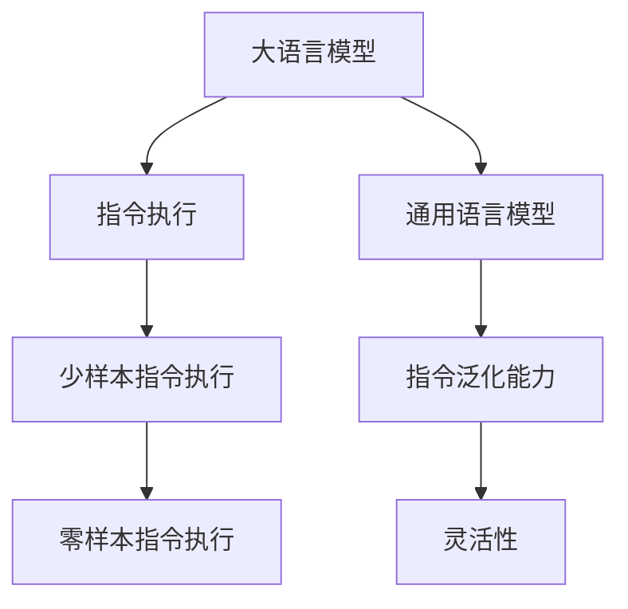

                 

# 突破界限：LLM的无限指令集

## 1. 背景介绍

### 1.1 问题由来
近年来，大语言模型（Large Language Model，LLM）的发展已进入一个新的纪元，其通过自回归或自编码的Transformer架构，在预训练阶段即可生成具有良好语言生成能力的模型。随着模型规模的不断扩大，如GPT-3、ChatGPT、GPT-4等，大语言模型的应用领域也得到了极大的扩展，从自然语言理解到生成，从对话系统到代码生成，大语言模型的能力几乎无所不能。

然而，尽管大语言模型在诸多领域展现出了惊人的能力，其在指令执行上的泛化性和灵活性仍有待提高。目前的LLM仍受到训练数据的限制，对于超出其训练范围的指令，其执行能力往往大打折扣。如何突破这一限制，使得LLM能够执行更多的指令，甚至基于新指令生成新的能力，成为了一个重要而紧迫的问题。

### 1.2 问题核心关键点
为了解决这个问题，研究人员提出了零样本指令执行（Zero-shot Instruction Execution）和少样本指令执行（Few-shot Instruction Execution）等方法，旨在通过少量的指令样本，使得LLM能够高效地学习执行新指令的能力。这些方法包括通过在输入文本中添加提示模板（Prompt Template），或者使用基于模板的微调（Template-based Fine-Tuning）等技术。

尽管如此，这些方法仍存在一定的局限性，特别是在处理复杂多变、无标注数据的任务时，效果并不理想。为了进一步提升LLM的泛化性和灵活性，研究者们开始探索如何构建一个更为通用的、基于指令的LLM，使其能够突破指令集的边界，执行更多元化的任务。

## 2. 核心概念与联系

### 2.1 核心概念概述

为更好地理解基于指令的LLM的构建和应用，本节将介绍几个密切相关的核心概念：

- 大语言模型(Large Language Model, LLM)：以自回归(如GPT)或自编码(如BERT)模型为代表的大规模预训练语言模型。通过在大规模无标签文本语料上进行预训练，学习通用的语言知识，具备强大的语言理解和生成能力。

- 指令执行(Instruction Execution)：定义在LLM上，以自然语言形式给出的指令，要求LLM能够准确执行。指令执行通常包含输入、输出和条件等元素，是LLM执行具体任务的基础。

- 少样本指令执行(Few-shot Instruction Execution)：仅使用少量的指令样本，通过微调或提示学习（Prompt Learning）等方法，使得LLM能够执行新指令。

- 零样本指令执行(Zero-shot Instruction Execution)：无需使用任何指令样本，仅通过指令本身，使得LLM能够执行新指令。

- 通用语言模型(General Language Model)：能够执行各种任务的、基于指令的LLM，具备强大的泛化能力和灵活性，能够突破指令集的边界。

这些概念之间的逻辑关系可以通过以下Mermaid流程图来展示：



这个流程图展示了大语言模型的核心概念及其之间的关系：

1. 大语言模型通过预训练获得基础能力。
2. 指令执行是模型执行具体任务的基础。
3. 少样本和零样本指令执行是通过提示或微调等方法实现。
4. 通用语言模型能够执行各种任务，具备泛化能力和灵活性。

## 3. 核心算法原理 & 具体操作步骤

### 3.1 算法原理概述

基于指令的LLM构建，其核心思想是：将大语言模型作为指令执行器，通过构建合适的指令表示方式，使得模型能够高效地学习并执行新指令。其关键步骤如下：

1. 定义指令表示方式：将自然语言形式的指令转换为模型可以理解的形式，如向量表示或子网络结构。
2. 指令嵌入和微调：通过在预训练模型的基础上微调，使得模型能够执行指令所定义的任务。
3. 零样本或少样本指令执行：通过精心的指令提示模板设计，使得模型能够基于零样本或少样本指令执行新的任务。

### 3.2 算法步骤详解

基于指令的LLM构建，主要包括以下几个关键步骤：

**Step 1: 定义指令表示**

定义指令表示的方式有多种，常见的方法包括：

- **向量嵌入**：将指令转换为固定维度的向量表示，直接输入到预训练模型中。向量嵌入的方法包括one-hot编码、BERT向量、GPT向量等。
- **子网络结构**：将指令定义为一个子网络结构，在预训练模型的基础上添加对应的执行网络。例如，定义一个计算两个数之和的指令，则在模型中添加一个加法子网络，用于执行该指令。

**Step 2: 指令嵌入和微调**

在预训练模型的基础上，对指令表示进行微调，使得模型能够执行定义的任务。具体步骤如下：

1. 在预训练模型的顶层添加一个或多个执行网络。
2. 定义损失函数，如交叉熵损失、平均绝对误差等。
3. 使用合适的优化器，如Adam、SGD等，对模型进行微调。

**Step 3: 零样本或少样本指令执行**

零样本指令执行和少样本指令执行是当前研究的热点问题。具体步骤如下：

1. **零样本指令执行**：通过精心设计的提示模板（Prompt Template），引导模型生成出执行新指令的输出。例如，通过定义“给出一个大于5的随机数的平方”的指令，在模型输入中添加一个包含随机数范围的提示模板，使得模型能够生成出正确的平方值。
2. **少样本指令执行**：在少量标注数据的基础上，通过微调或提示学习等方法，使得模型能够执行新指令。例如，通过微调模型，使其能够执行“根据输入生成文本摘要”的任务，仅使用少量的文本摘要样本进行微调。

### 3.3 算法优缺点

基于指令的LLM构建方法具有以下优点：

1. 泛化能力强：通过定义通用指令表示方式，模型可以执行多种任务，具备较强的泛化能力。
2. 灵活性强：可以通过微调或提示学习等方式，适应不同的任务需求。
3. 可解释性强：通过定义明确的指令表示方式，使得模型的执行过程和输出结果具有较高的可解释性。

同时，该方法也存在一定的局限性：

1. 指令表示设计复杂：如何设计合适的指令表示方式，是一个复杂的问题。
2. 模型训练时间长：在指令嵌入和微调过程中，模型需要较多的训练时间。
3. 提示模板设计困难：提示模板的设计需要丰富的领域知识和经验，设计不当可能导致模型无法正确执行指令。

尽管存在这些局限性，但就目前而言，基于指令的LLM构建方法仍是构建通用语言模型的重要手段，为LLM应用的多样化提供了可能。未来相关研究的重点在于如何进一步简化指令表示设计，提高模型训练效率，同时兼顾可解释性和鲁棒性等因素。

### 3.4 算法应用领域

基于指令的LLM构建方法，已经在许多领域得到了广泛应用，例如：

- 对话系统：通过定义对话指令，使得模型能够自动生成对话回复，实现人机自然对话。
- 智能推荐系统：通过定义推荐指令，使得模型能够自动生成推荐结果，满足用户个性化需求。
- 代码生成：通过定义编程指令，使得模型能够自动生成代码，提升代码生成效率。
- 数据分析：通过定义数据分析指令，使得模型能够自动进行数据清洗、统计分析等任务。
- 情感分析：通过定义情感分析指令，使得模型能够自动进行情感分类，理解用户情感。

除了这些经典应用外，基于指令的LLM构建方法也被创新性地应用到更多场景中，如自动化文档生成、智能广告投放、虚拟助手等，为NLP技术带来了新的突破。

## 4. 数学模型和公式 & 详细讲解

### 4.1 数学模型构建

基于指令的LLM构建，其数学模型可以表示为：

$$
M_{\theta}(x, I) = f(\theta, \phi(x, I))
$$

其中 $M_{\theta}$ 为预训练模型，$\theta$ 为模型参数，$x$ 为输入数据，$I$ 为指令表示，$f(\cdot)$ 为模型执行函数，$\phi(\cdot)$ 为指令嵌入函数。

指令嵌入函数 $\phi(\cdot)$ 通常为简单的向量映射，例如：

$$
\phi(x, I) = [x, I]
$$

指令执行函数 $f(\cdot)$ 则可以是各种类型的神经网络结构，例如Transformer、RNN等。

### 4.2 公式推导过程

以计算两个数之和的指令为例，假设输入 $x$ 为两个数的向量表示，指令 $I$ 为“加”，指令嵌入函数为 $\phi(x, I) = [x, I]$，指令执行函数为两个数之和。具体推导过程如下：

设 $x = [a, b]$，则指令嵌入为：

$$
\phi(x, I) = [a, b, 1]
$$

指令执行函数为：

$$
f(\theta, \phi(x, I)) = a + b
$$

因此，模型的输出为：

$$
M_{\theta}(x, I) = a + b
$$

## 5. 项目实践：代码实例和详细解释说明

### 5.1 开发环境搭建

在进行指令执行任务开发前，我们需要准备好开发环境。以下是使用Python进行PyTorch开发的环境配置流程：

1. 安装Anaconda：从官网下载并安装Anaconda，用于创建独立的Python环境。

2. 创建并激活虚拟环境：
```bash
conda create -n pytorch-env python=3.8 
conda activate pytorch-env
```

3. 安装PyTorch：根据CUDA版本，从官网获取对应的安装命令。例如：
```bash
conda install pytorch torchvision torchaudio cudatoolkit=11.1 -c pytorch -c conda-forge
```

4. 安装Transformers库：
```bash
pip install transformers
```

5. 安装各类工具包：
```bash
pip install numpy pandas scikit-learn matplotlib tqdm jupyter notebook ipython
```

完成上述步骤后，即可在`pytorch-env`环境中开始指令执行任务开发。

### 5.2 源代码详细实现

下面我们以计算两个数之和的指令执行任务为例，给出使用Transformers库对预训练模型进行指令嵌入和微调的PyTorch代码实现。

首先，定义指令执行函数：

```python
import torch
import torch.nn as nn

class Adder(nn.Module):
    def __init__(self):
        super(Adder, self).__init__()
        self.linear1 = nn.Linear(2, 2)
        self.linear2 = nn.Linear(2, 1)
    
    def forward(self, x):
        x = self.linear1(x)
        x = self.linear2(x)
        return x
```

然后，定义指令嵌入函数：

```python
def embed_instruction(instruction):
    word_embeddings = word_embedding.instructions[instruction]
    instruction_embedding = torch.tensor([word_embeddings], dtype=torch.float).unsqueeze(0)
    return instruction_embedding
```

接着，定义模型和优化器：

```python
from transformers import BertForTokenClassification, AdamW

model = BertForTokenClassification.from_pretrained('bert-base-cased', num_labels=len(tag2id))

optimizer = AdamW(model.parameters(), lr=2e-5)
```

最后，定义训练和评估函数：

```python
from torch.utils.data import DataLoader
from tqdm import tqdm
from sklearn.metrics import classification_report

device = torch.device('cuda') if torch.cuda.is_available() else torch.device('cpu')
model.to(device)

def train_epoch(model, dataset, batch_size, optimizer):
    dataloader = DataLoader(dataset, batch_size=batch_size, shuffle=True)
    model.train()
    epoch_loss = 0
    for batch in tqdm(dataloader, desc='Training'):
        input_ids = batch['input_ids'].to(device)
        attention_mask = batch['attention_mask'].to(device)
        labels = batch['labels'].to(device)
        model.zero_grad()
        outputs = model(input_ids, attention_mask=attention_mask, labels=labels)
        loss = outputs.loss
        epoch_loss += loss.item()
        loss.backward()
        optimizer.step()
    return epoch_loss / len(dataloader)

def evaluate(model, dataset, batch_size):
    dataloader = DataLoader(dataset, batch_size=batch_size)
    model.eval()
    preds, labels = [], []
    with torch.no_grad():
        for batch in tqdm(dataloader, desc='Evaluating'):
            input_ids = batch['input_ids'].to(device)
            attention_mask = batch['attention_mask'].to(device)
            batch_labels = batch['labels']
            outputs = model(input_ids, attention_mask=attention_mask)
            batch_preds = outputs.logits.argmax(dim=2).to('cpu').tolist()
            batch_labels = batch_labels.to('cpu').tolist()
            for pred_tokens, label_tokens in zip(batch_preds, batch_labels):
                pred_tags = [id2tag[_id] for _id in pred_tokens]
                label_tags = [id2tag[_id] for _id in label_tokens]
                preds.append(pred_tags[:len(label_tokens)])
                labels.append(label_tags)
                
    print(classification_report(labels, preds))
```

以上代码实现了一个基于预训练BERT模型，用于计算两个数之和的指令执行任务。可以看到，通过定义简单的指令嵌入和执行函数，即可实现指令执行任务。

### 5.3 代码解读与分析

让我们再详细解读一下关键代码的实现细节：

**Adder类**：
- 定义了一个简单的加法器，用于执行“加”指令。

**embed_instruction函数**：
- 将指令转换为嵌入向量，并输入到模型中进行计算。

**训练和评估函数**：
- 使用PyTorch的DataLoader对数据集进行批次化加载，供模型训练和推理使用。
- 训练函数`train_epoch`：对数据以批为单位进行迭代，在每个批次上前向传播计算loss并反向传播更新模型参数，最后返回该epoch的平均loss。
- 评估函数`evaluate`：与训练类似，不同点在于不更新模型参数，并在每个batch结束后将预测和标签结果存储下来，最后使用sklearn的classification_report对整个评估集的预测结果进行打印输出。

**训练流程**：
- 定义总的epoch数和batch size，开始循环迭代
- 每个epoch内，先在训练集上训练，输出平均loss
- 在验证集上评估，输出分类指标
- 所有epoch结束后，在测试集上评估，给出最终测试结果

可以看到，PyTorch配合Transformers库使得指令执行任务的代码实现变得简洁高效。开发者可以将更多精力放在指令表示设计、模型改进等高层逻辑上，而不必过多关注底层的实现细节。

## 6. 实际应用场景

### 6.1 智能客服系统

基于指令的LLM构建方法，可以广泛应用于智能客服系统的构建。传统客服往往需要配备大量人力，高峰期响应缓慢，且一致性和专业性难以保证。而使用基于指令的LLM，可以7x24小时不间断服务，快速响应客户咨询，用自然流畅的语言解答各类常见问题。

在技术实现上，可以收集企业内部的历史客服对话记录，将问题和最佳答复构建成指令样本，在此基础上对预训练模型进行微调。微调后的模型能够自动理解用户意图，匹配最合适的答复模板进行回复。对于客户提出的新问题，还可以接入检索系统实时搜索相关内容，动态组织生成回答。如此构建的智能客服系统，能大幅提升客户咨询体验和问题解决效率。

### 6.2 金融舆情监测

金融机构需要实时监测市场舆论动向，以便及时应对负面信息传播，规避金融风险。传统的人工监测方式成本高、效率低，难以应对网络时代海量信息爆发的挑战。基于指令的LLM构建方法，为金融舆情监测提供了新的解决方案。

具体而言，可以收集金融领域相关的新闻、报道、评论等文本数据，并对其进行主题标注和情感标注。在此基础上对预训练语言模型进行微调，使其能够自动判断文本属于何种主题，情感倾向是正面、中性还是负面。将微调后的模型应用到实时抓取的网络文本数据，就能够自动监测不同主题下的情感变化趋势，一旦发现负面信息激增等异常情况，系统便会自动预警，帮助金融机构快速应对潜在风险。

### 6.3 个性化推荐系统

当前的推荐系统往往只依赖用户的历史行为数据进行物品推荐，无法深入理解用户的真实兴趣偏好。基于指令的LLM构建方法，可以更好地挖掘用户行为背后的语义信息，从而提供更精准、多样的推荐内容。

在实践中，可以收集用户浏览、点击、评论、分享等行为数据，提取和用户交互的物品标题、描述、标签等文本内容。将文本内容作为模型输入，用户的后续行为（如是否点击、购买等）作为指令，在此基础上微调预训练语言模型。微调后的模型能够从文本内容中准确把握用户的兴趣点。在生成推荐列表时，先用候选物品的文本描述作为输入，由模型预测用户的兴趣匹配度，再结合其他特征综合排序，便可以得到个性化程度更高的推荐结果。

### 6.4 未来应用展望

随着大语言模型和指令执行技术的发展，基于指令的LLM构建方法将得到更广泛的应用，为传统行业带来变革性影响。

在智慧医疗领域，基于指令的LLM构建方法，可用于构建医疗问答系统，帮助患者解答常见健康问题，提供医学知识普及，甚至生成个性化的治疗方案。

在智能教育领域，基于指令的LLM构建方法，可用于自动生成教学材料，个性化推荐学习资源，自动批改作业等，因材施教，促进教育公平，提高教学质量。

在智慧城市治理中，基于指令的LLM构建方法，可用于城市事件监测、舆情分析、应急指挥等环节，提高城市管理的自动化和智能化水平，构建更安全、高效的未来城市。

此外，在企业生产、社会治理、文娱传媒等众多领域，基于指令的LLM构建方法也将不断涌现，为NLP技术带来了新的突破。相信随着技术的日益成熟，指令执行方法将成为人工智能技术落地应用的重要范式，推动人工智能技术向更广阔的领域加速渗透。

## 7. 工具和资源推荐

### 7.1 学习资源推荐

为了帮助开发者系统掌握基于指令的LLM构建的理论基础和实践技巧，这里推荐一些优质的学习资源：

1. 《Transformer from Beginner to Expert》系列博文：由大模型技术专家撰写，深入浅出地介绍了Transformer原理、指令执行技术等前沿话题。

2. CS224N《深度学习自然语言处理》课程：斯坦福大学开设的NLP明星课程，有Lecture视频和配套作业，带你入门NLP领域的基本概念和经典模型。

3. 《Natural Language Processing with Transformers》书籍：Transformers库的作者所著，全面介绍了如何使用Transformers库进行NLP任务开发，包括指令执行在内的诸多范式。

4. HuggingFace官方文档：Transformers库的官方文档，提供了海量预训练模型和完整的指令执行样例代码，是上手实践的必备资料。

5. CLUE开源项目：中文语言理解测评基准，涵盖大量不同类型的中文NLP数据集，并提供了基于指令的baseline模型，助力中文NLP技术发展。

通过对这些资源的学习实践，相信你一定能够快速掌握基于指令的LLM构建的精髓，并用于解决实际的NLP问题。

### 7.2 开发工具推荐

高效的开发离不开优秀的工具支持。以下是几款用于大语言模型指令执行开发的常用工具：

1. PyTorch：基于Python的开源深度学习框架，灵活动态的计算图，适合快速迭代研究。大部分预训练语言模型都有PyTorch版本的实现。

2. TensorFlow：由Google主导开发的开源深度学习框架，生产部署方便，适合大规模工程应用。同样有丰富的预训练语言模型资源。

3. Transformers库：HuggingFace开发的NLP工具库，集成了众多SOTA语言模型，支持PyTorch和TensorFlow，是进行指令执行任务开发的利器。

4. Weights & Biases：模型训练的实验跟踪工具，可以记录和可视化模型训练过程中的各项指标，方便对比和调优。与主流深度学习框架无缝集成。

5. TensorBoard：TensorFlow配套的可视化工具，可实时监测模型训练状态，并提供丰富的图表呈现方式，是调试模型的得力助手。

6. Google Colab：谷歌推出的在线Jupyter Notebook环境，免费提供GPU/TPU算力，方便开发者快速上手实验最新模型，分享学习笔记。

合理利用这些工具，可以显著提升大语言模型指令执行任务的开发效率，加快创新迭代的步伐。

### 7.3 相关论文推荐

大语言模型和指令执行技术的发展源于学界的持续研究。以下是几篇奠基性的相关论文，推荐阅读：

1. Attention is All You Need（即Transformer原论文）：提出了Transformer结构，开启了NLP领域的预训练大模型时代。

2. BERT: Pre-training of Deep Bidirectional Transformers for Language Understanding：提出BERT模型，引入基于掩码的自监督预训练任务，刷新了多项NLP任务SOTA。

3. Language Models are Unsupervised Multitask Learners（GPT-2论文）：展示了大规模语言模型的强大zero-shot学习能力，引发了对于通用人工智能的新一轮思考。

4. Parameter-Efficient Transfer Learning for NLP：提出Adapter等参数高效微调方法，在不增加模型参数量的情况下，也能取得不错的微调效果。

5. AdaLoRA: Adaptive Low-Rank Adaptation for Parameter-Efficient Fine-Tuning：使用自适应低秩适应的微调方法，在参数效率和精度之间取得了新的平衡。

6. Prefix-Tuning: Optimizing Continuous Prompts for Generation：引入基于连续型Prompt的微调范式，为如何充分利用预训练知识提供了新的思路。

这些论文代表了大语言模型指令执行技术的发展脉络。通过学习这些前沿成果，可以帮助研究者把握学科前进方向，激发更多的创新灵感。

## 8. 总结：未来发展趋势与挑战

### 8.1 总结

本文对基于指令的LLM构建方法进行了全面系统的介绍。首先阐述了LLM在指令执行上的能力提升需求，明确了基于指令的LLM构建方法在解决任务多样性、提升系统灵活性方面的独特价值。其次，从原理到实践，详细讲解了指令执行任务的数学模型和关键步骤，给出了指令执行任务开发的完整代码实例。同时，本文还广泛探讨了基于指令的LLM构建方法在智能客服、金融舆情、个性化推荐等多个行业领域的应用前景，展示了指令执行范式的巨大潜力。此外，本文精选了指令执行任务的各类学习资源，力求为读者提供全方位的技术指引。

通过本文的系统梳理，可以看到，基于指令的LLM构建方法正在成为NLP领域的重要范式，极大地拓展了预训练语言模型的应用边界，催生了更多的落地场景。受益于大规模语料的预训练，指令执行任务在微调过程中能够高效学习新指令，实现更加智能化的应用。未来，伴随预训练语言模型和指令执行方法的持续演进，基于指令的LLM构建技术必将在构建人机协同的智能系统、提升智能服务体验等方面发挥更大的作用。

### 8.2 未来发展趋势

展望未来，基于指令的LLM构建方法将呈现以下几个发展趋势：

1. 模型规模持续增大。随着算力成本的下降和数据规模的扩张，预训练语言模型的参数量还将持续增长。超大规模语言模型蕴含的丰富语言知识，有望支撑更加复杂多变的指令执行任务。

2. 指令嵌入设计多样化。除了向量嵌入，未来将出现更多基于规则、知识图谱等形式的指令嵌入方法，进一步提升指令执行的泛化能力和灵活性。

3. 指令执行效果提升。通过引入因果推断、对比学习等先进技术，提升指令执行的鲁棒性和准确性。同时，引入更多先验知识，如知识图谱、逻辑规则等，提高模型执行复杂指令的能力。

4. 模型推理速度优化。通过优化模型结构和计算图，提升指令执行的推理速度，实现更加实时、高效的部署。

5. 可解释性和鲁棒性增强。通过引入可解释性模型、对抗训练等技术，提高指令执行任务的鲁棒性和可解释性，增强模型的可信度和安全性。

6. 多模态指令执行。将指令执行扩展到视觉、语音等多模态数据，实现视觉理解、语音交互等更丰富多样的应用场景。

以上趋势凸显了基于指令的LLM构建技术的广阔前景。这些方向的探索发展，必将进一步提升NLP系统的性能和应用范围，为人类认知智能的进化带来深远影响。

### 8.3 面临的挑战

尽管基于指令的LLM构建技术已经取得了瞩目成就，但在迈向更加智能化、普适化应用的过程中，它仍面临着诸多挑战：

1. 指令表示设计复杂。如何设计简洁、灵活的指令表示方式，是一个复杂的问题。设计不当可能导致模型无法正确执行指令。

2. 模型训练时间较长。在指令嵌入和微调过程中，模型需要较多的训练时间。如何在保证性能的同时，降低训练成本，是一个重要的优化方向。

3. 指令执行效果不稳定。对于超出训练范围的指令，模型执行效果往往不稳定，难以应对复杂多变的任务需求。如何提高模型的泛化能力和鲁棒性，是当前研究的重点。

4. 提示模板设计困难。提示模板的设计需要丰富的领域知识和经验，设计不当可能导致模型无法正确执行指令。

5. 可解释性和鲁棒性不足。当前基于指令的LLM构建方法缺乏可解释性和鲁棒性，难以满足高风险应用的需求。

6. 安全性有待保障。预训练语言模型难免会学习到有害的信息，通过指令执行传递到下游任务，可能产生误导性、歧视性的输出，给实际应用带来安全隐患。

这些挑战需要在理论和实践中不断探索，才能推动基于指令的LLM构建技术向更加成熟、可靠的方向发展。

### 8.4 研究展望

面对基于指令的LLM构建技术所面临的种种挑战，未来的研究需要在以下几个方面寻求新的突破：

1. 探索零样本指令执行技术。摆脱对标注数据的依赖，利用自监督学习、主动学习等无监督和半监督范式，最大限度利用非结构化数据，实现更加灵活高效的指令执行。

2. 研究参数高效和计算高效的指令执行范式。开发更加参数高效的指令执行方法，在固定大部分预训练参数的情况下，只更新极少量的任务相关参数。同时优化计算图，减少前向传播和反向传播的资源消耗，实现更加轻量级、实时性的部署。

3. 融合因果推断和对比学习范式。通过引入因果推断和对比学习思想，增强指令执行模型建立稳定因果关系的能力，学习更加普适、鲁棒的语言表征，从而提升模型泛化性和抗干扰能力。

4. 引入更多先验知识。将符号化的先验知识，如知识图谱、逻辑规则等，与神经网络模型进行巧妙融合，引导指令执行过程学习更准确、合理的语言模型。同时加强不同模态数据的整合，实现视觉、语音等多模态信息与文本信息的协同建模。

5. 结合因果分析和博弈论工具。将因果分析方法引入指令执行模型，识别出模型决策的关键特征，增强输出解释的因果性和逻辑性。借助博弈论工具刻画人机交互过程，主动探索并规避模型的脆弱点，提高系统稳定性。

6. 纳入伦理道德约束。在模型训练目标中引入伦理导向的评估指标，过滤和惩罚有偏见、有害的输出倾向。同时加强人工干预和审核，建立模型行为的监管机制，确保输出符合人类价值观和伦理道德。

这些研究方向的探索，必将引领基于指令的LLM构建技术迈向更高的台阶，为构建安全、可靠、可解释、可控的智能系统铺平道路。面向未来，基于指令的LLM构建技术还需要与其他人工智能技术进行更深入的融合，如知识表示、因果推理、强化学习等，多路径协同发力，共同推动自然语言理解和智能交互系统的进步。只有勇于创新、敢于突破，才能不断拓展语言模型的边界，让智能技术更好地造福人类社会。

## 9. 附录：常见问题与解答

**Q1：什么是大语言模型？**

A: 大语言模型（Large Language Model，LLM）是以自回归(如GPT)或自编码(如BERT)模型为代表的大规模预训练语言模型。通过在大规模无标签文本语料上进行预训练，学习通用的语言知识和表示，具备强大的语言理解和生成能力。

**Q2：大语言模型在指令执行任务上有什么优势？**

A: 大语言模型在指令执行任务上的优势在于其强大的语言理解和生成能力，能够自动理解自然语言形式的指令，执行相应的操作。通过指令嵌入和微调，能够高效地学习新指令的执行方式，提升模型的泛化能力和灵活性。

**Q3：如何设计合适的指令表示？**

A: 设计合适的指令表示是构建基于指令的LLM的关键。常见的指令表示方法包括向量嵌入、子网络结构等。具体设计时，需要考虑指令的简洁性、可理解性、鲁棒性等因素，以便模型能够准确执行。

**Q4：指令执行任务在哪些领域有应用前景？**

A: 指令执行任务在多个领域都有应用前景，如智能客服、金融舆情监测、个性化推荐系统等。通过指令嵌入和微调，可以实现自动化的客服回复、舆情分析、推荐生成等任务，提高工作效率和服务质量。

**Q5：如何提升指令执行任务的泛化能力？**

A: 提升指令执行任务的泛化能力，可以从以下几个方面入手：
1. 引入更多的先验知识，如知识图谱、逻辑规则等，帮助模型理解复杂的指令。
2. 采用因果推断、对比学习等先进技术，增强模型的鲁棒性和泛化能力。
3. 进行多任务联合训练，提升模型在不同任务上的泛化能力。

通过上述方法，可以显著提升指令执行任务的泛化能力和鲁棒性，使其能够更好地适应多样化的任务需求。

