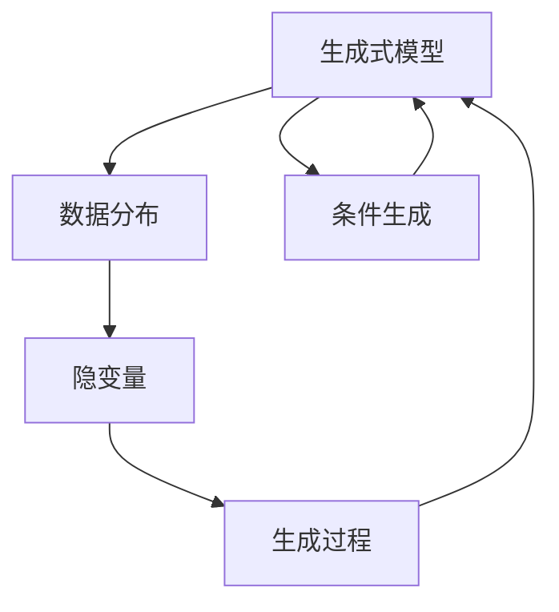

                 

# 第十四章：高级主题：生成式人工智能

## 1. 背景介绍

### 1.1 问题由来
在人工智能（AI）领域，尤其是自然语言处理（NLP）和计算机视觉（CV）领域，生成式人工智能（Generative AI）逐渐成为研究的焦点。从简单的文本生成到复杂的图像生成，生成式AI正在塑造未来的技术和应用。生成式AI的核心是生成模型，其目标是通过学习数据分布生成新的样本，从而实现图像、音频、文本等多种形式的智能生成。

### 1.2 问题核心关键点
生成式AI的主要任务是学习和生成新的数据，涵盖以下几个关键点：

- **数据生成**：学习数据的概率分布，从而生成新的样本。
- **模型架构**：选择和设计适合生成任务的模型结构。
- **训练过程**：设计有效的训练算法和策略。
- **生成策略**：如何控制生成的样本，如控制语言模型的词汇选择、图像的样式和内容等。

### 1.3 问题研究意义
生成式AI的研究和应用对AI领域具有重大意义：

1. **创新应用**：生成式AI能够产生前所未有的内容，如自然语言对话、艺术创作、虚拟现实等，推动艺术、娱乐、设计等领域的创新。
2. **自动化生产**：在工业生产中，生成式AI可以自动生成设计图、广告文案等，减少人工成本，提升效率。
3. **增强现实**：结合增强现实技术，生成式AI可以产生逼真的虚拟对象和环境，提升用户体验。
4. **隐私保护**：通过生成逼真但不具名的数据，可以在保护隐私的同时，进行研究和分析。

## 2. 核心概念与联系

### 2.1 核心概念概述

为了深入理解生成式AI，我们需要掌握一些核心概念：

- **生成式模型**：旨在学习数据的概率分布，从而生成新的样本。包括变分自编码器（VAE）、生成对抗网络（GAN）、自回归模型（如GPT）等。
- **生成过程**：指模型如何从数据分布中生成新的样本。
- **隐变量**：在生成过程中，模型使用的随机变量，控制生成结果的样式和内容。
- **条件生成**：在生成过程中引入额外信息，如文本条件、图像条件等，指导生成特定风格的样本。

### 2.2 核心概念原理和架构的 Mermaid 流程图



### 2.3 核心概念的联系

生成式AI中的核心概念通过以下联系紧密连接：

- **数据分布与生成过程**：数据分布决定了生成过程的起点，生成过程的目标是学习数据分布。
- **隐变量与生成策略**：隐变量控制生成策略，影响生成样本的样式和内容。
- **条件生成与多样性**：条件生成引入多样性，使模型能够生成符合特定需求的样本。

## 3. 核心算法原理 & 具体操作步骤

### 3.1 算法原理概述

生成式AI的核心算法包括生成对抗网络（GAN）、变分自编码器（VAE）、自回归模型等。以GAN为例，其原理是通过两个神经网络，一个生成器（Generator）和一个判别器（Discriminator），通过对抗训练，学习生成逼真的样本。

### 3.2 算法步骤详解

以GAN为例，生成式AI的训练步骤如下：

1. **初始化**：生成器和判别器随机初始化权重。
2. **对抗训练**：生成器尝试生成逼真样本，判别器尝试区分真实样本和生成样本。
3. **更新权重**：根据判别器的反馈，调整生成器和判别器的权重。
4. **收敛**：生成器和判别器达到平衡状态，生成器能够生成高质量的样本。

### 3.3 算法优缺点

生成式AI的优点包括：

- **数据生成能力强**：能够生成高质量、多样性的样本。
- **应用广泛**：适用于图像、文本、音频等多种形式的数据生成。
- **灵活性高**：通过调整模型架构和训练策略，适用于不同的生成任务。

缺点包括：

- **训练难度高**：需要精心设计的对抗训练过程，且训练时间较长。
- **生成质量不稳定**：生成质量受训练过程的影响较大。
- **模型复杂**：生成式模型结构复杂，参数多，训练和推理过程较为复杂。

### 3.4 算法应用领域

生成式AI在多个领域有广泛应用：

- **图像生成**：如GAN在图像生成、图像修复、风格迁移等任务上的应用。
- **文本生成**：如自回归模型在文本生成、文本摘要、对话系统等任务上的应用。
- **音频生成**：如WaveNet在语音合成、音乐创作等任务上的应用。
- **虚拟现实**：如生成逼真的虚拟环境和对象，增强现实体验。
- **艺术创作**：如生成艺术作品、音乐等。

## 4. 数学模型和公式 & 详细讲解 & 举例说明

### 4.1 数学模型构建

以GAN为例，数学模型可以描述为：

- 生成器：$G(z)$，将随机向量$z$转换为生成样本。
- 判别器：$D(x)$，判断样本$x$是真实样本还是生成样本。
- 目标函数：$J(G,D)$，生成器和判别器的对抗损失函数。

### 4.2 公式推导过程

GAN的目标函数为：

$$
J(G,D) = E_{x\sim p_{data}(x)}\log D(x) + E_{z\sim p(z)}\log(1-D(G(z)))
$$

其中$p_{data}(x)$为真实样本的分布，$p(z)$为随机向量$z$的分布。

### 4.3 案例分析与讲解

以GAN生成手写数字为例，训练过程如下：

1. 生成器$G$接受随机向量$z$，输出手写数字图像$x$。
2. 判别器$D$判断图像$x$是真实手写数字图像还是生成手写数字图像。
3. 目标函数$J(G,D)$衡量生成器和判别器的对抗效果。
4. 通过反向传播更新生成器和判别器的权重，最小化目标函数$J(G,D)$。

## 5. 项目实践：代码实例和详细解释说明

### 5.1 开发环境搭建

为了实践生成式AI，需要搭建深度学习开发环境，推荐使用以下工具：

- **Python**：深度学习的主要编程语言。
- **PyTorch**：深度学习框架，支持GPU加速。
- **TensorFlow**：另一个流行的深度学习框架，支持分布式训练。
- **Jupyter Notebook**：交互式编程环境，便于实验和代码调试。

### 5.2 源代码详细实现

以下是一个简单的GAN代码实现，用于生成手写数字：

```python
import torch
import torch.nn as nn
import torch.optim as optim

# 定义生成器和判别器
class Generator(nn.Module):
    def __init__(self):
        super(Generator, self).__init__()
        self.fc = nn.Linear(100, 784)
        self.fc2 = nn.Linear(784, 784)
    
    def forward(self, x):
        x = self.fc(x)
        x = torch.relu(x)
        x = self.fc2(x)
        x = torch.sigmoid(x)
        return x

class Discriminator(nn.Module):
    def __init__(self):
        super(Discriminator, self).__init__()
        self.fc = nn.Linear(784, 1)
    
    def forward(self, x):
        x = self.fc(x)
        x = torch.sigmoid(x)
        return x

# 定义对抗损失函数
def loss_GAN(G, D, x, y):
    x = G(z)
    D_real = D(x)
    D_fake = D(x)
    loss_D_real = nn.BCELoss()(D_real, y)
    loss_D_fake = nn.BCELoss()(D_fake, 1-y)
    loss_G = nn.BCELoss()(D_fake, y)
    loss_D = loss_D_real + loss_D_fake
    return loss_G, loss_D

# 训练过程
def train_GAN(G, D, train_loader, device):
    optimizer_G = optim.Adam(G.parameters(), lr=0.001)
    optimizer_D = optim.Adam(D.parameters(), lr=0.001)
    
    for epoch in range(1000):
        for i, (x, y) in enumerate(train_loader):
            x = x.to(device)
            y = y.to(device)
            optimizer_G.zero_grad()
            optimizer_D.zero_grad()
            
            z = torch.randn((len(x), 100)).to(device)
            G.eval()
            G(z)
            D.eval()
            D(x)
            D(G(z))
            
            loss_G, loss_D = loss_GAN(G, D, x, y)
            loss_G.backward()
            loss_D.backward()
            
            optimizer_G.step()
            optimizer_D.step()
            
            if (i+1) % 100 == 0:
                print(f'Epoch [{epoch+1}/{1000}], Step [{i+1}/{len(train_loader)}], Loss_G: {loss_G.item():.4f}, Loss_D: {loss_D.item():.4f}')

# 运行代码
G = Generator()
D = Discriminator()
G.to(device)
D.to(device)
train_loader = ...
train_GAN(G, D, train_loader, device)
```

### 5.3 代码解读与分析

代码中，我们定义了生成器（Generator）和判别器（Discriminator），使用对抗损失函数（loss_GAN）训练模型。在训练过程中，生成器尝试生成逼真的手写数字图像，判别器尝试区分真实和生成的图像。通过调整生成器和判别器的权重，最小化对抗损失函数，生成器逐渐能够生成高质量的手写数字图像。

## 6. 实际应用场景

### 6.1 图像生成

GAN在图像生成中的应用极为广泛，如GANs for Image Synthesis（ImageNet）论文中，提出了用于图像生成的改进版GAN，并应用于大规模图像生成任务，生成的图像逼真度极高，效果显著。

### 6.2 文本生成

自回归模型（如GPT系列）在文本生成、对话系统等任务上有重要应用。OpenAI的GPT-3模型已经在各种文本生成任务上取得了前所未有的表现，引发了广泛关注。

### 6.3 音频生成

WaveNet等生成模型在语音合成、音乐创作等方面展示了强大的生成能力，通过生成逼真的音频样本，广泛应用于虚拟助手、音乐创作等领域。

### 6.4 未来应用展望

未来，生成式AI将在更多领域发挥重要作用，包括：

- **医疗影像生成**：生成逼真的医疗影像，用于教学和研究。
- **智能设计**：生成建筑设计、服装设计等领域的创意作品。
- **游戏娱乐**：生成逼真的游戏角色、场景等，提升游戏体验。
- **虚拟现实**：生成逼真的虚拟环境和对象，增强现实体验。
- **教育培训**：生成逼真的教学视频和素材，辅助教育培训。

## 7. 工具和资源推荐

### 7.1 学习资源推荐

为了深入学习生成式AI，推荐以下学习资源：

- **Deep Learning Specialization**：由Andrew Ng主讲的Coursera深度学习课程，涵盖深度学习的基础和高级知识。
- **Generative Adversarial Nets (GANs)**：Ian Goodfellow的GAN论文，是GAN领域的经典之作。
- **WaveNet: A Generative Model for Raw Audio**：谷歌发布的WaveNet论文，介绍了生成式模型在语音合成中的应用。
- **Taming Transformers for High-Resolution Image Synthesis**：谷歌发布的用于高分辨率图像生成的Transformer论文。
- **Attention is All You Need**：Transformer模型的原始论文，奠定了自回归模型的基础。

### 7.2 开发工具推荐

以下工具和框架推荐用于生成式AI开发：

- **PyTorch**：深度学习框架，支持动态计算图，易于调试和优化。
- **TensorFlow**：深度学习框架，支持分布式训练和部署。
- **JAX**：高效、可扩展的深度学习库，支持自动微分和分布式训练。
- **Hugging Face Transformers**：包含多种预训练模型和工具，方便生成模型开发。
- **OpenAI Gym**：环境库，用于生成模型在各种环境中的测试和训练。

### 7.3 相关论文推荐

生成式AI领域的研究成果众多，以下是几篇代表性论文：

- **Image Synthesis with Adversarial Networks**：Ian Goodfellow的GAN论文，奠定了生成对抗网络的基础。
- **WaveNet: A Generative Model for Raw Audio**：谷歌发布的WaveNet论文，介绍了用于语音合成的生成模型。
- **Attention is All You Need**：Transformer模型的原始论文，奠定了自回归模型的基础。
- **Taming Transformers for High-Resolution Image Synthesis**：谷歌发布的用于高分辨率图像生成的Transformer论文。
- **Denoising Auto-encoders with Adversarial Training**：使用对抗训练改进自编码器，提升生成质量。

## 8. 总结：未来发展趋势与挑战

### 8.1 研究成果总结

生成式AI的研究和应用取得了显著进展，尤其在图像、文本、音频等生成任务上，取得了前所未有的成果。通过对抗训练、自回归模型等技术，生成模型的生成能力和效果大幅提升。

### 8.2 未来发展趋势

未来生成式AI的发展趋势包括：

- **多样化生成**：生成模型将生成更多样化的内容，涵盖图像、文本、音频等多种形式。
- **实时生成**：生成模型将具备实时生成能力，提高应用效率。
- **跨领域融合**：生成模型将与其他AI技术融合，如强化学习、自然语言处理等，实现更复杂的应用。
- **个性化生成**：生成模型将能够根据用户需求生成个性化内容，提升用户体验。

### 8.3 面临的挑战

生成式AI在应用和发展过程中面临以下挑战：

- **计算资源需求高**：生成模型需要大量的计算资源，对硬件设备提出更高要求。
- **生成质量不稳定**：生成质量受多种因素影响，难以达到理想效果。
- **伦理和安全问题**：生成模型可能产生有害或误导性内容，需要严格监管。
- **数据依赖**：生成模型需要大量的标注数据进行训练，数据获取成本较高。

### 8.4 研究展望

未来的研究方向包括：

- **无监督生成**：通过自监督学习，减少对标注数据的依赖。
- **多模态生成**：将生成模型应用于多模态数据，实现更全面的生成能力。
- **自适应生成**：生成模型能够根据环境变化，动态调整生成策略。
- **分布式生成**：利用分布式计算，提高生成效率和质量。

## 9. 附录：常见问题与解答

### Q1: 什么是生成式AI？

A: 生成式AI是指通过学习和生成新数据来模拟自然现象的技术。它包括生成模型和生成过程，能够生成高质量的图像、音频、文本等。

### Q2: 生成式AI的主要应用有哪些？

A: 生成式AI的应用包括图像生成、文本生成、音频生成、虚拟现实、智能设计等。这些应用正在改变多个行业，推动技术进步。

### Q3: 生成式AI的训练难点有哪些？

A: 生成式AI的训练难点包括对抗训练、生成质量不稳定、计算资源需求高、数据依赖等。需要通过技术创新和算法优化来克服这些困难。

### Q4: 如何评估生成式AI的质量？

A: 生成式AI的质量评估可以从生成样本的逼真度、多样性、流畅性等多个维度进行。常用的评估方法包括PSNR、SSIM等图像质量指标，BLEU、ROUGE等文本质量指标。

### Q5: 未来生成式AI的发展方向有哪些？

A: 未来生成式AI的发展方向包括多样化生成、实时生成、跨领域融合、个性化生成等。这些方向将推动生成式AI在更多领域的应用。

---

作者：禅与计算机程序设计艺术 / Zen and the Art of Computer Programming

