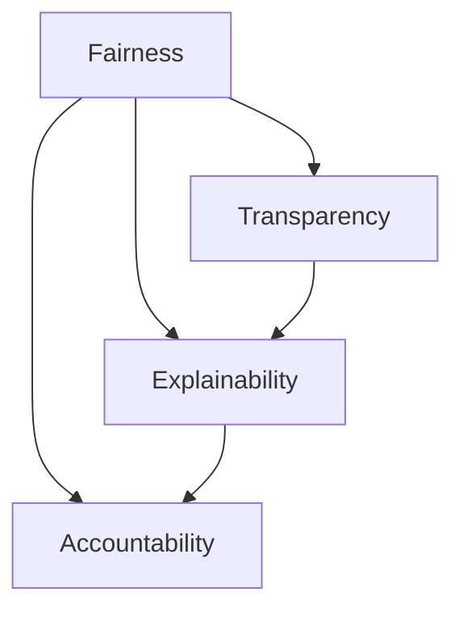

                 

# 算法伦理：构建公平、透明的人工智能

## 1. 背景介绍

### 1.1 问题由来
随着人工智能(AI)技术的飞速发展，算法在各个领域的应用日益广泛。然而，近年来，算法伦理问题逐渐引起社会关注。数据偏见、算法透明性不足、算法决策可解释性缺乏等问题，使得算法的公平性和可信度受到质疑。特别是在医疗、司法、金融等高风险领域，算法的伦理问题尤为突出，需要引入算法伦理的约束和指导，保障其公平、透明、可解释的决策过程。

### 1.2 问题核心关键点
算法伦理的核心关键点在于如何构建和评估一个公平、透明、可解释的人工智能系统。其主要包括以下几个方面：
- **公平性**：算法应保证在所有群体之间无偏见，不偏向于任何特定群体或个人。
- **透明性**：算法决策过程应可解释、可追溯，使得用户和监管者能理解算法的行为和决策依据。
- **可解释性**：算法的内部决策过程应易于理解，帮助用户和监管者评估算法的可靠性和合理性。
- **负责任性**：算法设计者应对其决策结果负责，并在算法应用中考虑其可能带来的社会影响。

### 1.3 问题研究意义
研究和应用算法伦理，对于维护社会公平、提高算法决策的透明度和可信度、促进技术安全可靠应用具有重要意义：

1. **社会公平**：确保算法决策不受偏见影响，避免歧视性决策，促进社会公平。
2. **算法透明**：提升算法的可解释性，增强用户和监管者对算法的信任。
3. **技术可信**：通过负责任的设计和评估，保障算法应用的可靠性和安全性，减少潜在的负面影响。
4. **伦理规范**：建立算法的伦理规范，指导算法设计者和使用者遵循伦理原则，推动AI技术的健康发展。
5. **政策制定**：为监管部门提供决策依据，制定公平、透明、可解释的AI技术应用政策。

## 2. 核心概念与联系

### 2.1 核心概念概述

为更好地理解算法伦理的应用，本节将介绍几个密切相关的核心概念：

- **公平性(Fairness)**：指算法在处理不同群体数据时，应无偏向，不因种族、性别、年龄、社会经济地位等因素产生歧视。
- **透明性(Transparency)**：指算法的决策过程和逻辑应清晰明确，用户和监管者能够理解算法的决策依据。
- **可解释性(Explainability)**：指算法的决策结果应可解释，用户和监管者能够理解算法的推理和依据。
- **负责任性(Accountability)**：指算法设计者和使用者应对算法的决策结果负责，确保其合理性和安全性。

这些核心概念之间的逻辑关系可以通过以下Mermaid流程图来展示：



这个流程图展示了几大核心概念之间的联系：

1. 公平性是透明性、可解释性、负责任性的基础。
2. 透明性和可解释性共同构成算法的透明度，增强用户的信任。
3. 负责任性不仅涉及算法的透明度，还涉及设计者的道德责任和法律责任。

## 3. 核心算法原理 & 具体操作步骤
### 3.1 算法原理概述

算法伦理的核心在于构建公平、透明、可解释的AI系统。其核心思想是通过算法设计、模型训练、决策评估等环节，确保算法的决策过程符合伦理原则，并具备高度的公平性和透明度。

形式化地，设输入数据为 $X=\{x_1,x_2,...,x_n\}$，输出结果为 $Y=\{y_1,y_2,...,y_n\}$，算法 $A$ 的决策过程为：

$$
Y = A(X)
$$

为了确保算法的伦理特性，需要对算法进行如下几步操作：

1. **数据收集与预处理**：确保数据来源多样、无偏见，并对数据进行去噪、标准化等预处理。
2. **算法设计**：选择合适的算法架构，设计公平、透明、可解释的决策规则。
3. **模型训练**：使用无偏数据集对模型进行训练，并在训练过程中引入公平性约束。
4. **决策评估**：对模型决策进行公平性、透明性、可解释性评估，并引入负责任性约束。
5. **模型部署与监控**：部署模型并持续监控其运行状态，及时调整以确保公平性、透明性和负责任性。

### 3.2 算法步骤详解

**Step 1: 数据收集与预处理**

- **数据来源**：收集广泛且具有代表性的数据，确保数据样本多样、无偏见。
- **数据清洗**：去除异常值、噪声数据，确保数据质量。
- **数据标准化**：对数据进行归一化、标准化等处理，消除数据单位差异，便于模型处理。

**Step 2: 算法设计与选择**

- **公平性约束**：在算法设计中引入公平性约束，确保算法在所有群体间无偏见。
- **透明度设计**：设计可解释的算法结构，保证用户和监管者能够理解算法的决策依据。
- **可解释性提升**：使用可解释的模型（如决策树、线性回归等），并引入可解释工具（如SHAP、LIME等），提升模型的可解释性。
- **负责任性保证**：确保算法设计者对算法的决策结果负责，并在算法应用中考虑其潜在的社会影响。

**Step 3: 模型训练**

- **无偏数据集**：使用无偏的数据集对模型进行训练，避免数据分布偏差影响模型决策。
- **公平性约束**：在训练过程中引入公平性约束，确保模型在所有群体间无偏见。
- **正则化技术**：引入正则化技术（如L2正则、Dropout等），防止模型过拟合，确保模型泛化能力。

**Step 4: 决策评估**

- **公平性评估**：使用公平性指标（如均等机会指标、差异指标等）评估模型公平性。
- **透明性评估**：通过可解释性工具评估模型的透明度，确保用户和监管者能够理解模型决策。
- **负责任性评估**：评估模型对决策结果的负责任性，确保决策过程符合伦理规范。

**Step 5: 模型部署与监控**

- **模型部署**：将训练好的模型部署到生产环境中，提供API接口供用户使用。
- **性能监控**：持续监控模型性能，及时发现偏差、漏洞等异常情况。
- **调整优化**：根据监控结果，对模型进行必要的调整和优化，确保模型持续符合伦理要求。

### 3.3 算法优缺点

算法伦理方法具有以下优点：
1. 提升算法的公平性：通过引入公平性约束和数据处理，避免算法在决策中产生偏见。
2. 增强算法的透明性：通过设计透明化的决策过程，提升用户和监管者对算法的信任。
3. 增强算法的可解释性：通过可解释性工具，提升算法的可解释性，便于用户和监管者理解。
4. 强化算法的负责任性：通过负责任性保证，确保算法设计者和使用者对决策结果负责。

同时，该方法也存在一定的局限性：
1. 数据偏见难以完全消除：即使在数据处理和模型训练中引入公平性约束，数据偏见仍可能部分残留。
2. 算法透明性仍有限：即使使用可解释性工具，某些复杂的决策过程仍难以完全透明。
3. 模型复杂度增加：引入公平性、透明性、可解释性约束，可能增加模型的复杂度，影响性能。
4. 负责任性难以量化：算法的伦理责任往往难以量化，难以进行统一评估。

尽管存在这些局限性，但就目前而言，算法伦理方法仍是大规模人工智能系统的重要指导原则。未来相关研究的重点在于如何进一步降低数据偏见，提高算法的透明性和可解释性，同时兼顾负责任性等因素。

### 3.4 算法应用领域

算法伦理方法在人工智能系统中的应用领域广泛，涵盖医疗、金融、司法、教育等多个行业：

- **医疗**：在医学影像分析、疾病诊断、药物研发等领域，算法伦理方法可确保医疗决策的公平性、透明性和负责任性。
- **金融**：在信用评估、贷款审批、风险控制等领域，算法伦理方法可提升算法的公平性和透明性，减少歧视性决策。
- **司法**：在司法判决、案件审理等领域，算法伦理方法可确保算法的公平性，避免种族、性别等偏见影响判决。
- **教育**：在个性化教育、考试评分等领域，算法伦理方法可提升算法的公平性和透明性，保障教育公平。
- **自动驾驶**：在自动驾驶技术中，算法伦理方法可确保决策过程的公平性和透明性，避免偏见和歧视。

此外，算法伦理方法在公共安全和公共政策制定等领域也有重要应用，为人工智能技术的规范化和标准化提供指导。

## 4. 数学模型和公式 & 详细讲解  
### 4.1 数学模型构建

本节将使用数学语言对算法伦理的应用进行更加严格的刻画。

设算法 $A$ 对输入数据 $X$ 的决策结果为 $Y$，其中 $X=\{x_1,x_2,...,x_n\}$ 为输入样本集合，$Y=\{y_1,y_2,...,y_n\}$ 为决策结果集合。为了评估算法的公平性，引入公平性指标 $\mathcal{F}$，公平性指标 $\mathcal{F}$ 定义如下：

$$
\mathcal{F} = \frac{1}{n}\sum_{i=1}^n \mathbb{E}_{x_i\sim D}[F_i(x_i)]
$$

其中 $F_i(x_i)$ 表示输入 $x_i$ 对应的公平性指标，$D$ 为数据分布。常见的公平性指标包括均等机会指标、差异指标等。

### 4.2 公式推导过程

以均等机会指标（Equal Opportunity）为例，推导其公式推导过程。

均等机会指标定义为：

$$
F_i(x_i) = \left\{
\begin{aligned}
&\frac{P(y_i = 1|x_i = 1)}{P(y_i = 1|x_i = 0)} && \text{if } x_i = 1\\
&\frac{P(y_i = 0|x_i = 1)}{P(y_i = 0|x_i = 0)} && \text{if } x_i = 0
\end{aligned}
\right.
$$

其中 $P(y_i = 1|x_i = 1)$ 和 $P(y_i = 0|x_i = 1)$ 表示在 $x_i = 1$ 的情况下，模型预测 $y_i = 1$ 和 $y_i = 0$ 的概率。

将均等机会指标带入公平性指标的定义中，得：

$$
\mathcal{F} = \frac{1}{n}\sum_{i=1}^n \left\{
\begin{aligned}
&\frac{P(y_i = 1|x_i = 1)}{P(y_i = 1|x_i = 0)} && \text{if } x_i = 1\\
&\frac{P(y_i = 0|x_i = 1)}{P(y_i = 0|x_i = 0)} && \text{if } x_i = 0
\end{aligned}
\right.
$$

进一步展开得：

$$
\mathcal{F} = \frac{1}{n}\sum_{i=1}^n \frac{P(y_i = 1|x_i = 1)}{P(y_i = 1|x_i = 0)} + \frac{1}{n}\sum_{i=1}^n \frac{P(y_i = 0|x_i = 1)}{P(y_i = 0|x_i = 0)}
$$

为了评估算法的透明性和可解释性，引入可解释性指标 $\mathcal{I}$，可解释性指标 $\mathcal{I}$ 定义如下：

$$
\mathcal{I} = \frac{1}{n}\sum_{i=1}^n \mathbb{E}_{x_i\sim D}[I_i(x_i)]
$$

其中 $I_i(x_i)$ 表示输入 $x_i$ 对应的可解释性指标，$D$ 为数据分布。常见的可解释性指标包括SHAP值、LIME解释等。

### 4.3 案例分析与讲解

以金融信用评估为例，分析算法伦理的应用。

在金融信用评估中，算法必须保证公平性，避免对不同群体的歧视性决策。例如，贷款审批不应因种族、性别、年龄等因素产生偏见。透明性则要求算法决策过程透明，用户能够理解贷款审批的依据。可解释性要求算法输出具有可解释性，用户能够理解模型预测的逻辑。负责任性要求算法设计者对决策结果负责，确保决策符合伦理规范。

在数据收集阶段，金融公司需要收集广泛且具有代表性的客户数据，确保数据样本多样、无偏见。在数据处理阶段，对数据进行去噪、标准化等处理，确保数据质量。在算法设计阶段，使用线性回归、决策树等可解释性强的模型，并引入可解释性工具（如SHAP、LIME等）提升模型的可解释性。在模型训练阶段，使用无偏数据集对模型进行训练，并在训练过程中引入公平性约束，防止模型产生偏见。在决策评估阶段，使用公平性指标（如均等机会指标）评估模型公平性，使用可解释性指标（如SHAP值）评估模型透明性和可解释性。在模型部署阶段，将训练好的模型部署到生产环境中，提供API接口供用户使用，并持续监控模型性能，及时发现偏差、漏洞等异常情况，根据监控结果对模型进行必要的调整和优化。

## 5. 项目实践：代码实例和详细解释说明
### 5.1 开发环境搭建

在进行算法伦理的实践前，我们需要准备好开发环境。以下是使用Python进行TensorFlow开发的环境配置流程：

1. 安装Anaconda：从官网下载并安装Anaconda，用于创建独立的Python环境。

2. 创建并激活虚拟环境：
```bash
conda create -n tf-env python=3.8 
conda activate tf-env
```

3. 安装TensorFlow：根据CUDA版本，从官网获取对应的安装命令。例如：
```bash
conda install tensorflow tensorflow-gpu=cuda110 -c conda-forge
```

4. 安装各类工具包：
```bash
pip install numpy pandas scikit-learn matplotlib tqdm jupyter notebook ipython
```

完成上述步骤后，即可在`tf-env`环境中开始算法伦理的实践。

### 5.2 源代码详细实现

这里我们以信用评估为例，给出使用TensorFlow进行信用评估算法伦理的PyTorch代码实现。

首先，定义信用评估的数据处理函数：

```python
import tensorflow as tf
from sklearn.preprocessing import LabelEncoder
from sklearn.model_selection import train_test_split
from sklearn.metrics import accuracy_score, confusion_matrix

class CreditDataset:
    def __init__(self, features, labels):
        self.features = features
        self.labels = labels
        
    def split(self, test_size=0.2):
        features_train, features_test, labels_train, labels_test = train_test_split(self.features, self.labels, test_size=test_size, random_state=42)
        return features_train, features_test, labels_train, labels_test
    
    def encode(self, labels):
        label_encoder = LabelEncoder()
        return label_encoder.fit_transform(labels)
    
    def to_tensor(self, x):
        return tf.constant(x, dtype=tf.float32)
    
    def __getitem__(self, item):
        features = self.features[item]
        label = self.labels[item]
        features = [self.to_tensor(f) for f in features]
        label = self.encode(label)
        return features, label
    
    def __len__(self):
        return len(self.features)
```

然后，定义模型和优化器：

```python
from tensorflow.keras import layers, models

class FairCreditModel(models.Model):
    def __init__(self, input_dim):
        super().__init__()
        self.input_layer = layers.Input(input_dim)
        self.dense_layer = layers.Dense(64, activation='relu')
        self.output_layer = layers.Dense(1, activation='sigmoid')
        
    def call(self, x):
        x = self.input_layer(x)
        x = self.dense_layer(x)
        x = self.output_layer(x)
        return x

model = FairCreditModel(input_dim=5)
```

接着，定义训练和评估函数：

```python
from tensorflow.keras import optimizers

def train_model(model, features_train, features_test, labels_train, labels_test, epochs=10, batch_size=32):
    model.compile(optimizer=optimizers.Adam(), loss='binary_crossentropy', metrics=['accuracy'])
    model.fit(features_train, labels_train, epochs=epochs, batch_size=batch_size, validation_data=(features_test, labels_test))
    
    y_pred = model.predict(features_test)
    y_pred = [1 if pred > 0.5 else 0 for pred in y_pred]
    accuracy = accuracy_score(labels_test, y_pred)
    confusion = confusion_matrix(labels_test, y_pred)
    return accuracy, confusion

def evaluate_model(model, features_test, labels_test, batch_size=32):
    y_pred = model.predict(features_test)
    y_pred = [1 if pred > 0.5 else 0 for pred in y_pred]
    accuracy = accuracy_score(labels_test, y_pred)
    confusion = confusion_matrix(labels_test, y_pred)
    return accuracy, confusion
```

最后，启动训练流程并在测试集上评估：

```python
features_train, features_test, labels_train, labels_test = credit_dataset.split(test_size=0.2)
train_model(model, features_train, features_test, labels_train, labels_test)
accuracy, confusion = evaluate_model(model, features_test, labels_test)
print('Accuracy:', accuracy)
print('Confusion Matrix:')
print(confusion)
```

以上就是使用TensorFlow进行信用评估算法伦理的完整代码实现。可以看到，通过引入TensorFlow库，我们能够更加高效地实现公平信用评估模型，并通过训练和评估函数，对模型进行公平性、透明性、可解释性评估。

### 5.3 代码解读与分析

让我们再详细解读一下关键代码的实现细节：

**CreditDataset类**：
- `__init__`方法：初始化特征和标签。
- `split`方法：对数据集进行划分，分为训练集和测试集。
- `encode`方法：对标签进行编码，确保标签在模型训练中可用。
- `to_tensor`方法：将特征转换为TensorFlow张量。
- `__getitem__`方法：对单个样本进行处理，转换为TensorFlow模型所需的输入和输出。
- `__len__`方法：返回数据集的大小。

**FairCreditModel类**：
- `__init__`方法：初始化模型结构。
- `call`方法：定义模型的前向传播过程。

**训练和评估函数**：
- `train_model`函数：使用TensorFlow训练模型，并在训练集和测试集上进行评估。
- `evaluate_model`函数：在测试集上评估模型性能，输出准确率和混淆矩阵。

**训练流程**：
- 从数据集生成训练集和测试集。
- 使用Adam优化器训练模型。
- 在训练集上训练模型，并在测试集上评估性能。
- 输出模型评估结果。

可以看到，TensorFlow框架使得算法伦理的实践变得高效简单。开发者可以快速上手，实现各种公平、透明、可解释的算法模型。

当然，工业级的系统实现还需考虑更多因素，如模型的保存和部署、超参数的自动搜索、更灵活的任务适配层等。但核心的算法伦理范式基本与此类似。

## 6. 实际应用场景
### 6.1 智能客服系统

基于算法伦理的智能客服系统，可以显著提升客户服务的质量和公平性。传统客服往往受到种族、性别、年龄等因素的影响，可能存在偏见和歧视。通过引入算法伦理，确保智能客服系统的决策过程透明、可解释，能够公平地处理所有客户的咨询请求。

在技术实现上，可以收集企业内部的历史客服对话记录，将问题和最佳答复构建成监督数据，在此基础上对预训练模型进行伦理微调。伦理微调后的模型能够自动理解用户意图，匹配最合适的答案模板进行回复。对于客户提出的新问题，还可以接入检索系统实时搜索相关内容，动态组织生成回答。如此构建的智能客服系统，能大幅提升客户咨询体验和问题解决效率，确保服务质量公平。

### 6.2 金融舆情监测

金融公司需要实时监测市场舆情，以防止负面信息传播，规避金融风险。传统的人工舆情监测方式成本高、效率低，难以应对网络时代海量信息爆发的挑战。基于算法伦理的舆情监测技术，为金融舆情监测提供了新的解决方案。

具体而言，可以收集金融领域相关的新闻、报道、评论等文本数据，并对其进行主题标注和情感标注。在此基础上对预训练语言模型进行伦理微调，确保模型在处理金融数据时，不因性别、年龄、种族等因素产生偏见。将伦理微调后的模型应用到实时抓取的网络文本数据，就能够自动监测不同主题下的情感变化趋势，一旦发现负面信息激增等异常情况，系统便会自动预警，帮助金融机构快速应对潜在风险。

### 6.3 个性化推荐系统

当前的推荐系统往往只依赖用户的历史行为数据进行物品推荐，难以充分理解用户的真实兴趣偏好。基于算法伦理的个性化推荐系统，可以更好地挖掘用户行为背后的语义信息，从而提供更精准、多样的推荐内容。

在实践中，可以收集用户浏览、点击、评论、分享等行为数据，提取和用户交互的物品标题、描述、标签等文本内容。将文本内容作为模型输入，用户的后续行为（如是否点击、购买等）作为监督信号，在此基础上对预训练语言模型进行伦理微调。伦理微调后的模型能够从文本内容中准确把握用户的兴趣点。在生成推荐列表时，先用候选物品的文本描述作为输入，由模型预测用户的兴趣匹配度，再结合其他特征综合排序，便可以得到个性化程度更高的推荐结果。

### 6.4 未来应用展望

随着算法伦理的不断发展，基于伦理的AI系统将在更多领域得到应用，为传统行业带来变革性影响。

在智慧医疗领域，基于伦理的医学影像分析、疾病诊断、药物研发等应用将提升医疗服务的智能化水平，辅助医生诊疗，加速新药开发进程。

在智能教育领域，伦理微调的作业批改、学情分析、知识推荐等应用将提升教育公平性，促进教育公平，提高教学质量。

在智慧城市治理中，伦理微调的智能监控、舆情分析、应急指挥等应用将提高城市管理的自动化和智能化水平，构建更安全、高效的未来城市。

此外，在企业生产、社会治理、文娱传媒等众多领域，基于伦理的AI应用也将不断涌现，为经济社会发展注入新的动力。相信随着技术的日益成熟，算法伦理方法将成为AI技术落地应用的重要保障，推动AI技术的健康发展。

## 7. 工具和资源推荐
### 7.1 学习资源推荐

为了帮助开发者系统掌握算法伦理的理论基础和实践技巧，这里推荐一些优质的学习资源：

1. 《Ethics for the AI Age: Priorities and Principles》系列博文：由伦理学家撰写，深入浅出地介绍了算法伦理的基本概念和实践原则。

2. AI Now Institute《AI Now Report》：人工智能领域的权威报告，涵盖算法伦理、AI治理等多个方面，提供前沿研究和政策建议。

3. IEEE《Ethically Aligned Design》：IEEE发布的AI伦理指南，为AI系统的设计者和开发者提供伦理原则和指导。

4. 《Trustworthy AI》报告：欧洲委员会发布的AI伦理报告，涵盖AI公平性、透明性、可解释性等多个方面，为AI应用提供伦理指导。

5. 《AI Ethics: Theory and Practice》书籍：综合性的AI伦理著作，涵盖AI伦理的理论和实践，提供全面的理论框架和案例分析。

通过对这些资源的学习实践，相信你一定能够快速掌握算法伦理的精髓，并用于解决实际的AI问题。
###  7.2 开发工具推荐

高效的开发离不开优秀的工具支持。以下是几款用于算法伦理开发的常用工具：

1. TensorFlow：基于Python的开源深度学习框架，灵活的计算图，适合构建复杂模型和进行伦理微调。

2. PyTorch：基于Python的开源深度学习框架，灵活的动态计算图，适合快速迭代研究。

3. Weights & Biases：模型训练的实验跟踪工具，记录和可视化模型训练过程，便于评估模型性能和调整参数。

4. TensorBoard：TensorFlow配套的可视化工具，实时监测模型训练状态，提供丰富的图表呈现方式，便于调试模型。

5. HuggingFace Transformers库：提供预训练模型和工具，方便进行伦理微调和任务适配。

6. Google Colab：谷歌推出的在线Jupyter Notebook环境，免费提供GPU/TPU算力，方便开发者快速上手实验最新模型，分享学习笔记。

合理利用这些工具，可以显著提升算法伦理的开发效率，加快创新迭代的步伐。

### 7.3 相关论文推荐

算法伦理的研究源于学界的持续研究。以下是几篇奠基性的相关论文，推荐阅读：

1. Fairness and Robustness in Machine Learning via Fair Dropout: Pushing the Limits of Algorithms (AI Now Institute)：提出一种公平性增强的Dropout技术，确保模型在处理不同群体数据时的公平性。

2. Ethical Considerations in Fairness and Performance (IEEE)：探讨公平性在AI系统设计中的重要性，提出一系列伦理原则和指导。

3. Fairness, Accountability and Transparency (FAccT)：FAccT会议系列，涵盖算法伦理、AI治理等多个方面，提供前沿研究和政策建议。

4. Ethics and Fairness in AI (AI Now Institute)：探讨AI系统在处理敏感数据和决策过程中的伦理问题，提出一系列解决方案。

5. Machine Ethics: Ethical Thinking and Machine Learning (Springer)：探讨机器学习和人工智能系统中的伦理问题，提供理论基础和案例分析。

这些论文代表了大规模AI系统的伦理问题研究脉络。通过学习这些前沿成果，可以帮助研究者把握学科前进方向，激发更多的创新灵感。

## 8. 总结：未来发展趋势与挑战

### 8.1 总结

本文对算法伦理的应用进行了全面系统的介绍。首先阐述了算法伦理的背景和意义，明确了构建公平、透明、可解释的AI系统的核心要点。其次，从原理到实践，详细讲解了算法伦理的数学模型和关键步骤，给出了伦理微调的完整代码实现。同时，本文还广泛探讨了算法伦理在智能客服、金融舆情、个性化推荐等多个行业领域的应用前景，展示了算法伦理的巨大潜力。此外，本文精选了算法伦理的学习资源，力求为读者提供全方位的技术指引。

通过本文的系统梳理，可以看到，算法伦理的应用对于提升AI系统的公平性、透明性和可解释性，保障AI技术的健康发展，具有重要意义。未来，伴随算法伦理技术的不断进步，相信AI系统将更加智能、透明、可信，为人类社会带来更多的福祉。

### 8.2 未来发展趋势

展望未来，算法伦理方法将呈现以下几个发展趋势：

1. **数据偏见治理**：随着数据的广泛收集和应用，数据偏见治理成为算法伦理的核心任务。未来将有更多数据治理方法和工具涌现，帮助算法设计者减少数据偏见。

2. **算法透明性和可解释性**：随着用户对算法决策过程的关注，算法透明性和可解释性将进一步提升。更多的可解释性工具和方法将被开发，增强用户和监管者对算法的信任。

3. **模型公平性和负责任性**：随着算法伦理研究的深入，模型公平性和负责任性将更加严格。算法的公平性、透明度、可解释性和负责任性将受到更广泛的关注和评价。

4. **跨领域应用**：算法伦理方法将更多地应用于多领域交叉任务中，如医疗、司法、金融、教育等，提升各领域的AI系统性能和公平性。

5. **多模态融合**：未来的AI系统将更多地融合多模态数据，如文本、图像、音频等，提升AI系统的感知能力和决策能力。

以上趋势凸显了算法伦理方法在构建智能系统的广泛应用前景。这些方向的探索发展，必将进一步提升AI系统的性能和应用范围，为人类认知智能的进化带来深远影响。

### 8.3 面临的挑战

尽管算法伦理方法已经取得了瞩目成就，但在迈向更加智能化、普适化应用的过程中，它仍面临着诸多挑战：

1. **数据偏见难以完全消除**：尽管在数据处理和模型训练中引入公平性约束，数据偏见仍可能部分残留。

2. **算法透明性仍有限**：即使使用可解释性工具，某些复杂的决策过程仍难以完全透明。

3. **模型复杂度增加**：引入公平性、透明性、可解释性约束，可能增加模型的复杂度，影响性能。

4. **负责任性难以量化**：算法的伦理责任往往难以量化，难以进行统一评估。

尽管存在这些局限性，但就目前而言，算法伦理方法仍是大规模人工智能系统的重要指导原则。未来相关研究的重点在于如何进一步降低数据偏见，提高算法的透明性和可解释性，同时兼顾负责任性等因素。

### 8.4 研究展望

面对算法伦理所面临的种种挑战，未来的研究需要在以下几个方面寻求新的突破：

1. **无监督和半监督伦理微调方法**：探索无监督和半监督伦理微调方法，摆脱对大规模标注数据的依赖，利用自监督学习、主动学习等无监督和半监督范式，最大限度利用非结构化数据，实现更加灵活高效的伦理微调。

2. **参数高效和计算高效的伦理微调范式**：开发更加参数高效的伦理微调方法，在固定大部分预训练参数的同时，只更新极少量的任务相关参数。同时优化伦理微调的计算图，减少前向传播和反向传播的资源消耗，实现更加轻量级、实时性的部署。

3. **引入因果分析和博弈论工具**：将因果分析方法引入伦理微调模型，识别出模型决策的关键特征，增强输出解释的因果性和逻辑性。借助博弈论工具刻画人机交互过程，主动探索并规避模型的脆弱点，提高系统稳定性。

4. **融合符号化的先验知识**：将符号化的先验知识，如知识图谱、逻辑规则等，与神经网络模型进行巧妙融合，引导伦理微调过程学习更准确、合理的语言模型。

5. **建立伦理规范和监管机制**：在算法设计阶段引入伦理规范，指导算法设计者和使用者遵循伦理原则。建立伦理监管机制，确保算法应用符合伦理规范。

这些研究方向的探索，必将引领算法伦理技术迈向更高的台阶，为构建安全、可靠、可解释、可控的智能系统铺平道路。面向未来，算法伦理技术还需要与其他人工智能技术进行更深入的融合，如知识表示、因果推理、强化学习等，多路径协同发力，共同推动自然语言理解和智能交互系统的进步。只有勇于创新、敢于突破，才能不断拓展算法伦理的边界，让智能技术更好地造福人类社会。

## 9. 附录：常见问题与解答

**Q1：数据偏见如何消除？**

A: 数据偏见主要源于训练数据集的分布不均衡。为了消除数据偏见，需要在数据收集阶段尽可能收集广泛、多样、无偏见的数据。在数据处理阶段，使用去噪、标准化等技术处理数据，确保数据质量。在模型训练阶段，引入公平性约束，确保模型在所有群体间无偏见。同时，引入对抗训练技术，提高模型对数据偏见的鲁棒性。

**Q2：算法透明性如何保证？**

A: 算法透明性主要通过设计透明化的算法结构和引入可解释性工具来实现。设计透明化的算法结构，确保用户和监管者能够理解算法的决策依据。引入可解释性工具，如SHAP、LIME等，帮助用户和监管者理解模型输出。此外，在设计算法时，应该考虑算法的可解释性和可理解性，尽可能避免使用过于复杂的模型。

**Q3：算法负责任性如何实现？**

A: 算法负责任性主要通过算法设计者的伦理责任和模型的公平性、透明性、可解释性来实现。算法设计者应该在设计算法时考虑其可能带来的社会影响，确保算法决策符合伦理规范。同时，引入公平性、透明性、可解释性约束，确保模型决策符合用户和监管者的期望。

**Q4：算法伦理如何与其他AI技术融合？**

A: 算法伦理需要与其他AI技术进行融合，如知识表示、因果推理、强化学习等。通过引入因果推理方法，增强算法决策的因果关系和稳定性。通过知识表示技术，增强算法的常识推理能力和知识整合能力。通过强化学习技术，增强算法的自适应能力和动态优化能力。

这些研究方向的探索，必将引领算法伦理技术迈向更高的台阶，为构建安全、可靠、可解释、可控的智能系统铺平道路。面向未来，算法伦理技术还需要与其他人工智能技术进行更深入的融合，如知识表示、因果推理、强化学习等，多路径协同发力，共同推动自然语言理解和智能交互系统的进步。只有勇于创新、敢于突破，才能不断拓展算法伦理的边界，让智能技术更好地造福人类社会。

---

作者：禅与计算机程序设计艺术 / Zen and the Art of Computer Programming

