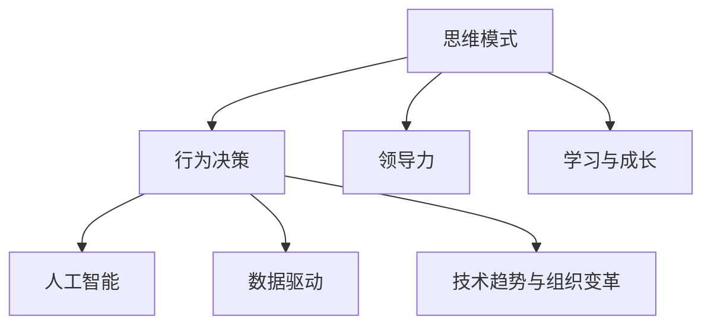

                 

# 管理者修炼手册:思维、行动与学习

> 关键词：管理者, 思维模式, 行为决策, 领导力, 学习与成长, 人工智能, 数据驱动, 技术趋势, 企业战略, 组织变革

## 1. 背景介绍

### 1.1 问题由来
在当今快速变化的商业环境中，管理者面临的挑战日益复杂。随着技术进步和市场竞争的加剧，传统的管理理念和方法已经难以应对新时代的挑战。如何高效地进行决策，提升领导力，持续学习与成长，成为了每个管理者必须面对的问题。本文旨在通过深入探讨管理者的思维、行动与学习，提供一套系统的修炼手册，帮助管理者在快速变化的环境中脱颖而出。

### 1.2 问题核心关键点
管理者修炼的核心在于提升思维能力、优化行为决策和实现持续学习与成长。具体来说，包括以下几个关键点：

- **思维模式**：如何培养创新的思维方式，面对复杂问题进行有效分析。
- **行为决策**：如何通过科学的方法和工具进行高效决策，避免偏见和错误。
- **领导力**：如何提升自身及团队的领导力，实现团队协作和激励。
- **学习与成长**：如何在快速变化的环境中不断学习新知识和技能，保持竞争力。
- **人工智能与数据驱动**：如何在决策中引入AI和大数据技术，提升决策的科学性和效率。
- **技术趋势与组织变革**：如何识别和利用技术趋势，推动组织变革和创新。

## 2. 核心概念与联系

### 2.1 核心概念概述

为了更好地理解管理者的修炼，本节将介绍几个关键的概念：

- **思维模式**：指管理者在面对问题时的思维方式。包括系统思维、创新思维、批判性思维、数据驱动思维等。
- **行为决策**：指管理者在做出决策时的行为和过程。包括问题定义、信息收集、方案设计、决策执行等步骤。
- **领导力**：指管理者在团队中的影响力及其对团队目标的推动能力。包括愿景领导、战略领导、团队领导等。
- **学习与成长**：指管理者持续学习和改进的过程，包括个人学习和团队学习、跨领域学习和反思总结。
- **人工智能**：指利用AI和大数据技术进行决策和管理的实践，包括机器学习、自然语言处理、知识图谱等技术。
- **数据驱动**：指以数据为基础，通过分析和建模进行决策的实践，包括数据收集、数据处理、数据分析等步骤。
- **技术趋势与组织变革**：指识别和利用技术趋势，推动组织进行战略调整和创新实践的过程。

这些核心概念之间的逻辑关系可以通过以下Mermaid流程图来展示：



这个流程图展示了几大核心概念及其之间的相互关系：

1. 思维模式直接影响行为决策，从而影响领导力和学习与成长。
2. 行为决策与人工智能和数据驱动密切相关，两者为决策提供科学依据。
3. 技术趋势与组织变革需要结合思维模式和数据驱动，实现战略调整和创新实践。

## 3. 核心算法原理 & 具体操作步骤
### 3.1 算法原理概述

管理者修炼的核心在于提升思维能力、优化行为决策和实现持续学习与成长。本节将从这三个方面分别介绍相关的算法原理和操作步骤。

### 3.2 算法步骤详解

#### 3.2.1 提升思维能力
提升思维能力的关键在于培养创新的思维方式和批判性思维能力。具体步骤包括：

- **创新思维**：
  - **发散思维**：通过头脑风暴等方法，激发多种可能的解决方案。
  - **设计思维**：通过用户研究、原型设计等方法，不断迭代改进解决方案。
  - **逆向思维**：通过反向思考问题，发现问题的根本原因和创新点。

- **批判性思维**：
  - **信息过滤**：筛选有效信息，排除噪音和偏见。
  - **逻辑推理**：通过逻辑推理，分析和验证假设和结论。
  - **假设检验**：通过科学实验或数据分析，验证假设的正确性。

#### 3.2.2 优化行为决策
优化行为决策的关键在于科学的方法和工具。具体步骤包括：

- **问题定义**：
  - **明确目标**：定义问题的具体目标和关键绩效指标（KPI）。
  - **数据收集**：通过问卷调查、数据分析等方式，收集相关信息。

- **信息收集**：
  - **数据收集**：使用数据驱动的工具和方法，收集和整理数据。
  - **信息整合**：通过数据挖掘和关联分析，整合和提炼关键信息。

- **方案设计**：
  - **模型构建**：使用机器学习模型、优化算法等，构建和优化决策模型。
  - **方案评估**：通过模拟实验和成本效益分析，评估不同方案的优劣。

- **决策执行**：
  - **资源分配**：合理分配资源，确保决策执行的顺利进行。
  - **监控与反馈**：通过实时监控和反馈机制，及时调整和优化决策。

#### 3.2.3 实现持续学习与成长
实现持续学习与成长的关键在于建立终身学习机制。具体步骤包括：

- **个人学习**：
  - **知识更新**：通过阅读、培训、讲座等方式，持续更新和拓展知识面。
  - **技能提升**：通过实际操作和实践，提升和优化专业技能。

- **团队学习**：
  - **知识共享**：通过内部培训、知识库、会议等方式，促进团队知识共享和经验传承。
  - **跨领域学习**：通过跨部门合作、行业交流等方式，学习和借鉴其他领域的最佳实践。

- **反思总结**：
  - **经验总结**：通过定期的反思和总结，积累和提升个人和团队的经验。
  - **问题反思**：通过回顾和分析决策过程中的失误和不足，改进和优化决策过程。

### 3.3 算法优缺点

#### 3.3.1 思维模式
- **优点**：
  - 培养创新思维方式，提升问题解决能力。
  - 通过批判性思维，提高决策的科学性和合理性。
- **缺点**：
  - 需要较长时间和大量实践积累。
  - 可能受到个人经验和知识局限的影响。

#### 3.3.2 行为决策
- **优点**：
  - 科学的方法和工具，提高决策的准确性和效率。
  - 数据驱动，减少决策中的主观偏见。
- **缺点**：
  - 数据质量和技术工具可能存在问题。
  - 信息过载和数据处理复杂度较高。

#### 3.3.3 学习与成长
- **优点**：
  - 持续学习提升个人和团队竞争力。
  - 跨领域学习有助于借鉴其他领域的最佳实践。
- **缺点**：
  - 学习过程需要时间和资源投入。
  - 学习效果难以衡量和评估。

### 3.4 算法应用领域

管理者修炼的核心算法在多个领域都有广泛应用，包括但不限于：

- **创新管理**：通过创新思维和设计思维，推动组织创新和变革。
- **战略管理**：通过数据驱动和人工智能技术，制定科学合理的战略规划。
- **风险管理**：通过风险识别和数据分析，制定有效的风险应对策略。
- **绩效管理**：通过关键绩效指标（KPI）和数据分析，评估和提升团队绩效。
- **人力资源管理**：通过学习与成长机制，提升员工技能和团队凝聚力。
- **客户关系管理**：通过客户研究和大数据分析，优化客户体验和满意度。

## 4. 数学模型和公式 & 详细讲解 & 举例说明

### 4.1 数学模型构建

为了更好地理解管理者思维、行为决策和持续学习的数学模型，本节将介绍几个关键的数学模型：

- **创新思维模型**：基于创造力发散和设计思维的模型，描述创新的过程和结果。
- **行为决策模型**：基于数据驱动和优化算法的模型，描述决策的科学过程。
- **学习与成长模型**：基于知识更新和跨领域学习的模型，描述学习的机制和效果。

### 4.2 公式推导过程

#### 4.2.1 创新思维模型
假设问题为 $P$，创意方案为 $S$，成功概率为 $C$，则创新思维模型可以表示为：

$$
C = f(P, S)
$$

其中 $f$ 为创新函数，$P$ 为问题定义，$S$ 为创意方案。

#### 4.2.2 行为决策模型
假设问题为 $P$，方案为 $M$，结果为 $R$，则行为决策模型可以表示为：

$$
R = g(P, M)
$$

其中 $g$ 为决策函数，$P$ 为问题定义，$M$ 为方案设计。

#### 4.2.3 学习与成长模型
假设学习活动为 $L$，结果为 $R$，知识更新为 $U$，则学习与成长模型可以表示为：

$$
R = h(L, U)
$$

其中 $h$ 为学习函数，$L$ 为学习活动，$U$ 为知识更新。

### 4.3 案例分析与讲解

#### 4.3.1 创新思维案例
某公司计划开发新产品，首先需要进行市场调研。通过创新思维模型，公司可以采用以下步骤：

1. **问题定义**：明确新产品需要满足的市场需求和客户痛点。
2. **创意发散**：通过头脑风暴，生成多种产品设计方案。
3. **方案评估**：使用设计思维方法，对每个方案进行原型设计和用户测试，筛选出最优方案。
4. **迭代改进**：根据用户反馈，不断优化设计方案，直至最终产品上线。

#### 4.3.2 行为决策案例
某公司需要决定是否投资某个新项目，可以通过行为决策模型进行决策：

1. **问题定义**：明确项目目标和预期收益。
2. **信息收集**：通过市场调研和财务分析，收集相关信息。
3. **方案设计**：使用优化算法，构建投资回报模型，预测项目收益。
4. **决策执行**：根据模型预测，制定投资策略，并进行风险评估和监控。

#### 4.3.3 学习与成长案例
某公司希望提升团队绩效，可以通过学习与成长模型进行实施：

1. **学习活动**：组织团队培训和知识分享会，引入新的管理理念和工具。
2. **知识更新**：通过内部培训和外部合作，不断更新和拓展知识面。
3. **反思总结**：定期进行绩效评估和经验总结，积累和改进团队经验。
4. **持续改进**：根据绩效反馈和市场变化，调整和优化团队策略。

## 5. 项目实践：代码实例和详细解释说明

### 5.1 开发环境搭建

在进行管理者修炼实践前，我们需要准备好开发环境。以下是使用Python进行PyTorch开发的环境配置流程：

1. 安装Anaconda：从官网下载并安装Anaconda，用于创建独立的Python环境。

2. 创建并激活虚拟环境：
```bash
conda create -n pytorch-env python=3.8 
conda activate pytorch-env
```

3. 安装PyTorch：根据CUDA版本，从官网获取对应的安装命令。例如：
```bash
conda install pytorch torchvision torchaudio cudatoolkit=11.1 -c pytorch -c conda-forge
```

4. 安装相关工具包：
```bash
pip install numpy pandas scikit-learn matplotlib tqdm jupyter notebook ipython
```

完成上述步骤后，即可在`pytorch-env`环境中开始管理者修炼实践。

### 5.2 源代码详细实现

这里我们以使用PyTorch进行创新思维模型的代码实现为例：

```python
import torch
import torch.nn as nn
import torch.optim as optim

# 定义创新思维模型
class InnovationThinkingModel(nn.Module):
    def __init__(self):
        super(InnovationThinkingModel, self).__init__()
        self.fc1 = nn.Linear(2, 10)
        self.fc2 = nn.Linear(10, 2)
        self.softmax = nn.Softmax(dim=1)

    def forward(self, x):
        x = self.fc1(x)
        x = self.fc2(x)
        return self.softmax(x)

# 创建模型
model = InnovationThinkingModel()

# 定义损失函数和优化器
criterion = nn.CrossEntropyLoss()
optimizer = optim.SGD(model.parameters(), lr=0.01)

# 训练模型
for epoch in range(100):
    optimizer.zero_grad()
    # 输入数据
    inputs = torch.randn(10, 2)
    labels = torch.randint(0, 2, (10,))
    # 前向传播
    outputs = model(inputs)
    # 计算损失
    loss = criterion(outputs, labels)
    # 反向传播
    loss.backward()
    # 更新参数
    optimizer.step()

    print(f"Epoch {epoch+1}, loss: {loss.item():.4f}")
```

在这个例子中，我们使用了一个简单的全连接神经网络作为创新思维模型。模型接收两个输入特征，通过两个全连接层和一个Softmax激活函数，输出创新方案的概率分布。通过交叉熵损失函数和随机梯度下降优化器，我们不断调整模型参数，最小化损失函数，从而提升模型的创新能力。

### 5.3 代码解读与分析

这里我们详细解读一下关键代码的实现细节：

**InnovationThinkingModel类**：
- `__init__方法`：初始化模型的参数，包括两个全连接层和一个Softmax激活函数。
- `forward方法`：定义模型的前向传播过程，接收输入数据，经过全连接层和Softmax函数，输出创新方案的概率分布。

**模型训练过程**：
- 使用`torch.randn`生成10个随机输入数据，使用`torch.randint`生成10个随机标签。
- 在前向传播中，通过`model(inputs)`计算模型输出。
- 在计算损失时，使用交叉熵损失函数`criterion(outputs, labels)`计算预测值和真实标签之间的差异。
- 通过反向传播`loss.backward()`计算模型参数的梯度，并使用优化器`optimizer.step()`更新模型参数。

**模型评估与输出**：
- 在每个epoch结束时，输出当前epoch的平均损失，监控模型的训练过程。

可以看到，PyTorch提供了一个非常方便和灵活的框架，可以用于构建和训练各种类型的模型。开发者可以将更多精力放在模型设计和算法优化上，而不必过多关注底层的实现细节。

当然，工业级的系统实现还需考虑更多因素，如模型的保存和部署、超参数的自动搜索、更灵活的任务适配层等。但核心的管理者修炼框架基本与此类似。

## 6. 实际应用场景

### 6.1 创新管理

管理者在创新管理中扮演着至关重要的角色。通过培养创新思维和设计思维，管理者可以推动组织进行持续创新和变革。例如，某互联网公司在面对市场竞争时，通过头脑风暴和用户测试，不断优化产品设计和用户体验，逐步占领市场份额。

### 6.2 战略管理

战略管理需要科学的方法和工具，管理者通过数据驱动和人工智能技术，制定科学合理的战略规划。例如，某大型企业通过大数据分析，识别出市场需求和潜在客户，制定了面向未来的发展战略，从而实现了快速增长和市场领先。

### 6.3 风险管理

风险管理需要识别和评估潜在风险，制定有效的应对策略。管理者通过数据分析和优化算法，构建风险评估模型，制定应对措施。例如，某金融公司通过机器学习模型，实时监控市场波动和风险指标，及时调整投资策略，避免了重大风险损失。

### 6.4 绩效管理

绩效管理需要明确目标和关键绩效指标（KPI），通过数据驱动的方法，评估和提升团队绩效。例如，某制造企业通过数据收集和分析，制定了生产效率和质量提升的目标，通过优化生产流程和资源配置，实现了生产效率的显著提升。

### 6.5 人力资源管理

人力资源管理需要提升员工技能和团队凝聚力，管理者通过学习与成长机制，不断提升员工能力和团队协作。例如，某科技公司通过内部培训和跨部门合作，提升员工的技术水平和团队协作能力，增强了公司的创新能力和市场竞争力。

### 6.6 客户关系管理

客户关系管理需要优化客户体验和满意度，管理者通过数据分析和用户研究，不断改进客户服务。例如，某零售公司通过客户调研和大数据分析，优化了客户服务流程和产品推荐策略，提升了客户满意度和忠诚度。

## 7. 工具和资源推荐

### 7.1 学习资源推荐

为了帮助管理者系统掌握管理者修炼的理论基础和实践技巧，这里推荐一些优质的学习资源：

1. 《创新管理》系列博文：由管理学家撰写，深入浅出地介绍了创新管理的理念和方法。

2. CS561《管理科学与工程导论》课程：清华大学开设的管理科学课程，涵盖管理学基础和创新管理等内容。

3. 《领导力与变革》书籍：知名管理学家所著，全面介绍了领导力的培养和组织变革的实践。

4. Coursera《数据驱动的决策制定》课程：斯坦福大学教授授课，讲解如何通过数据驱动进行科学决策。

5. HBR《哈佛商业评论》：管理学领域权威期刊，提供最新的管理理论和实践案例。

通过对这些资源的学习实践，相信你一定能够快速掌握管理者修炼的精髓，并用于解决实际的组织管理问题。

### 7.2 开发工具推荐

高效的开发离不开优秀的工具支持。以下是几款用于管理者修炼开发的常用工具：

1. Jupyter Notebook：交互式的笔记本环境，支持Python代码和数据可视化，方便快速迭代研究。

2. PyTorch：基于Python的开源深度学习框架，灵活动态的计算图，适合快速迭代研究。

3. TensorFlow：由Google主导开发的开源深度学习框架，生产部署方便，适合大规模工程应用。

4. Weights & Biases：模型训练的实验跟踪工具，可以记录和可视化模型训练过程中的各项指标，方便对比和调优。

5. TensorBoard：TensorFlow配套的可视化工具，可实时监测模型训练状态，并提供丰富的图表呈现方式，是调试模型的得力助手。

合理利用这些工具，可以显著提升管理者修炼任务的开发效率，加快创新迭代的步伐。

### 7.3 相关论文推荐

管理者修炼技术的发展源于学界的持续研究。以下是几篇奠基性的相关论文，推荐阅读：

1. "Management Thinking and Practice"：哈佛商学院的论文，介绍了管理者的思维方式和实践方法。

2. "Data-Driven Management"：斯坦福大学的研究，讲解了如何通过数据驱动进行管理决策。

3. "Innovation Management in the Digital Age"：IBM的研究，探讨了数字化时代下管理创新的新趋势和新方法。

4. "Leadership and Change"：国际顶级管理期刊上的论文，讨论了领导力的培养和组织变革的实践。

5. "Human Resource Management in the AI Era"：清华大学的研究，探讨了人工智能时代下的人力资源管理新模式。

这些论文代表了大管理者修炼技术的发展脉络。通过学习这些前沿成果，可以帮助管理者把握学科前进方向，激发更多的创新灵感。

## 8. 总结：未来发展趋势与挑战

### 8.1 总结

本文对管理者修炼的思维、行为决策和持续学习进行了全面系统的介绍。首先阐述了管理者修炼的背景和意义，明确了管理者的思维能力、行为决策和持续学习的重要性。其次，从原理到实践，详细讲解了提升思维能力、优化行为决策和实现持续学习与成长的关键步骤，给出了管理者修炼任务开发的完整代码实例。同时，本文还广泛探讨了管理者修炼在创新管理、战略管理、风险管理、绩效管理等多个领域的应用前景，展示了管理者修炼范式的巨大潜力。此外，本文精选了管理者修炼的相关学习资源，力求为管理者提供全方位的技术指引。

通过本文的系统梳理，可以看到，管理者修炼的核心算法在多个领域都有广泛应用，为组织管理带来了新的突破。得益于科学的方法和工具，管理者能够在快速变化的环境中保持竞争力，推动组织持续创新和变革。未来，伴随管理科学与工程的发展，管理者修炼技术必将得到更广泛的应用，为组织和社会带来深远影响。

### 8.2 未来发展趋势

展望未来，管理者修炼技术将呈现以下几个发展趋势：

1. 数字化转型加速：随着数字化技术的发展，管理者的决策将更加依赖数据和算法，数字化工具将成为管理者日常工作的必备工具。

2. 创新管理模式演进：管理者将更多地采用开放式创新、共创式创新等新模式，提升组织创新能力和市场响应速度。

3. 跨领域合作增多：管理者将更加注重跨部门和跨行业合作，整合资源，提升组织协同能力。

4. 社会责任提升：管理者将更多地关注社会责任和可持续发展，推动企业社会责任（CSR）和环境保护。

5. 人工智能融合深化：管理者将更加重视人工智能和大数据在管理决策中的应用，提升决策的科学性和效率。

6. 全球化管理能力增强：管理者将更加注重全球化管理，应对全球市场变化和国际竞争。

以上趋势凸显了管理者修炼技术的广阔前景。这些方向的探索发展，必将进一步提升管理者的决策能力和组织竞争力，推动企业和社会迈向更高的发展阶段。

### 8.3 面临的挑战

尽管管理者修炼技术已经取得了瞩目成就，但在迈向更加智能化、普适化应用的过程中，它仍面临着诸多挑战：

1. 数据质量瓶颈：管理决策依赖于高质量的数据，但数据获取和处理难度较大，数据质量参差不齐。

2. 算法复杂度增加：随着复杂问题的引入，管理决策的算法复杂度大幅增加，需要更多的时间和资源投入。

3. 团队协作难度：跨部门和跨领域合作需要更多协调和沟通，存在协调成本高和信息不对称的问题。

4. 学习曲线陡峭：新工具和新方法的学习曲线较陡峭，需要更多的时间和精力进行培训和实践。

5. 效果评估复杂：管理者修炼的效果难以量化和评估，缺乏统一的评估标准和方法。

6. 社会责任挑战：管理者在追求经济利益的同时，还需要平衡社会责任和环境保护，面临多重压力。

正视管理者修炼面临的这些挑战，积极应对并寻求突破，将是大管理者修炼走向成熟的必由之路。相信随着学界和产业界的共同努力，这些挑战终将一一被克服，管理者修炼必将在构建智慧组织和管理体系中扮演越来越重要的角色。

### 8.4 研究展望

面对管理者修炼面临的种种挑战，未来的研究需要在以下几个方面寻求新的突破：

1. 数据驱动的智能决策系统：开发基于人工智能和大数据的管理决策系统，提升决策的科学性和效率。

2. 模型优化和参数高效：研究模型优化和参数高效方法，提高模型适应性和运行效率。

3. 跨领域协作机制：建立跨部门和跨行业的协作机制，提高组织协同能力和创新能力。

4. 学习与实践平台：开发学习与实践平台，提供丰富的学习资源和工具，帮助管理者持续学习和提升能力。

5. 社会责任与可持续发展：研究如何在管理决策中考虑社会责任和环境保护，推动可持续发展。

6. 文化与价值观建设：研究企业文化和价值观的建设，提升组织的凝聚力和社会影响力。

这些研究方向将引领管理者修炼技术迈向更高的台阶，为构建智慧组织和管理体系提供新的方法和工具。面向未来，管理者修炼技术还需要与其他技术进行更深入的融合，如知识表示、因果推理、强化学习等，多路径协同发力，共同推动组织管理的进步。只有勇于创新、敢于突破，才能不断拓展管理者的边界，让组织管理更好地服务于人类社会。

## 9. 附录：常见问题与解答

**Q1：管理者如何培养创新思维？**

A: 管理者可以通过以下方法培养创新思维：
1. 持续学习和阅读：关注最新管理理论和技术，学习前沿创新案例。
2. 头脑风暴和用户研究：通过头脑风暴和用户调研，激发新的想法和解决方案。
3. 设计思维：采用设计思维的方法，从用户角度出发，不断迭代改进方案。

**Q2：管理者如何进行科学决策？**

A: 管理者可以通过以下步骤进行科学决策：
1. 明确目标和KPI：定义问题的具体目标和关键绩效指标。
2. 数据收集和分析：通过市场调研和数据分析，收集和整理相关数据。
3. 模型构建和评估：使用优化算法和模型构建，进行科学预测和评估。
4. 方案设计和执行：设计优化方案，进行资源分配和执行监控。

**Q3：管理者如何持续学习和成长？**

A: 管理者可以通过以下方法实现持续学习和成长：
1. 知识更新：通过培训、讲座和书籍学习，不断更新和拓展知识面。
2. 技能提升：通过实际操作和实践，提升和优化专业技能。
3. 反思总结：定期进行绩效评估和经验总结，积累和改进个人和团队经验。

**Q4：管理者如何在快速变化的环境中保持竞争力？**

A: 管理者可以通过以下方法在快速变化的环境中保持竞争力：
1. 数据驱动和AI技术：利用数据和AI技术进行科学决策，提升决策的准确性和效率。
2. 持续创新和变革：通过创新思维和设计思维，推动组织持续创新和变革。
3. 跨领域合作和资源整合：建立跨部门和跨行业的协作机制，整合资源，提升组织协同能力。
4. 社会责任和可持续发展：在追求经济利益的同时，关注社会责任和环境保护，推动可持续发展。

**Q5：管理者如何提高团队协作能力？**

A: 管理者可以通过以下方法提高团队协作能力：
1. 建立清晰的沟通机制：明确团队目标和角色分工，建立有效的沟通渠道。
2. 加强团队培训和协作：组织团队培训和跨部门合作，提升团队协作能力和资源共享。
3. 引入协作工具和技术：使用协作工具和技术，如项目管理软件、知识库等，促进团队协作和信息共享。
4. 建立激励机制：设计合理的激励机制，激发团队成员的积极性和创造力。

通过这些方法的实践，管理者可以在快速变化的环境中保持竞争力，推动组织不断创新和进步。

---

作者：禅与计算机程序设计艺术 / Zen and the Art of Computer Programming

