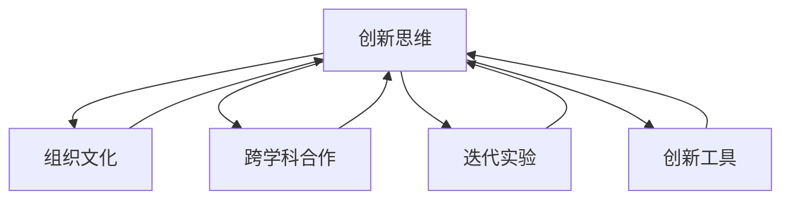

                 

# 管理者如何培养创新思维

> 关键词：创新管理,创新思维,组织文化,跨学科合作,迭代实验,创新工具

## 1. 背景介绍

### 1.1 问题由来
在全球化、信息化的大背景下，企业之间的竞争越发激烈，创新已经成为企业生存发展的核心动力。管理者在组织中扮演着关键的创新角色，但很多企业在创新过程中面临诸多挑战，如创新团队协作困难、创新资源调配不合理、创新成果转化率低等。这些问题严重制约了企业的发展，急需管理者的高效引导和领导。

### 1.2 问题核心关键点
创新思维是管理者面对不确定性、复杂性时，能够识别新机会、提出新方案、解决问题的一种能力。培养创新思维是提高企业创新效率和竞争力的关键。管理者在培养创新思维时，需要注意以下几个核心关键点：

1. **组织文化**：建立鼓励试错、开放共享、跨学科合作的企业文化，为创新提供土壤。
2. **跨学科合作**：促进不同学科背景人才的交叉融合，激发创新火花。
3. **迭代实验**：采用小步快跑、快速迭代的方式，验证和优化创新方案。
4. **创新工具**：利用技术工具提升创新效率，如协作平台、数据可视化、创新管理系统等。

### 1.3 问题研究意义
研究管理者如何培养创新思维，对于提升企业创新能力、增强市场竞争力、推动经济发展具有重要意义：

1. 创新驱动发展。通过提升管理者的创新思维，激发员工的创新潜力，加速技术创新、产品创新、模式创新。
2. 应对复杂环境。管理者具备强大的创新思维能力，能够更好地识别外部环境变化，制定灵活应对策略。
3. 促进跨领域融合。跨学科合作、跨行业借鉴，有助于创新思维的全面提升，形成新的商业模式和产品形态。
4. 提升决策质量。创新思维能够帮助管理者在决策过程中，从多角度、多维度进行分析和判断，提升决策的科学性和前瞻性。

## 2. 核心概念与联系

### 2.1 核心概念概述

为更好地理解管理者如何培养创新思维，本节将介绍几个密切相关的核心概念：

- **创新思维(Innovation Thinking)**：指管理者在面对问题时，能够超越传统思维模式，提出新颖、有效、实用的解决方案。创新思维包括但不限于发散思维、系统思维、协同思维等。
- **组织文化(Organizational Culture)**：指企业文化中的价值观、信仰、行为准则和组织习惯，是创新思维培养的土壤。
- **跨学科合作(Interdisciplinary Collaboration)**：指不同学科背景的专家、学者、技术人员等合作，产生新的知识和创新方案。
- **迭代实验(Iterative Experimentation)**：指通过小规模、快速实验，不断验证和优化创新方案的过程。
- **创新工具(Innovation Tools)**：指用于支持创新管理、创新流程、创新成果转化等环节的各种技术工具。

这些核心概念之间的逻辑关系可以通过以下Mermaid流程图来展示：



这个流程图展示了一系列的创新思维培养途径：

1. **组织文化**：营造鼓励创新的环境。
2. **跨学科合作**：提升知识多样性。
3. **迭代实验**：快速验证和优化方案。
4. **创新工具**：提供技术支持，提升效率。

这些途径共同作用，形成了一个系统的创新思维培养框架。

## 3. 核心算法原理 & 具体操作步骤
### 3.1 算法原理概述

管理者培养创新思维的过程，本质上是一个跨学科、多层次的系统工程。其核心思想是通过组织文化建设、跨学科合作、迭代实验、创新工具应用等手段，不断激发和塑造管理者的创新思维。

形式化地，假设管理者面临的问题为 $P$，其创新思维能力为 $I_{\theta}$，其中 $\theta$ 为与组织文化、跨学科合作、迭代实验、创新工具等相关的参数。目标是最小化问题 $P$ 的解决难度 $D$，即：

$$
\theta^* = \mathop{\arg\min}_{\theta} D(P, I_{\theta})
$$

在实践中，我们通常使用基于梯度的优化算法（如AdamW、SGD等）来近似求解上述最优化问题。设定合适的优化算法及其参数，设置不同维度的迭代轮数等，不断更新参数 $\theta$，最小化问题解决难度。

### 3.2 算法步骤详解

管理者培养创新思维的一般包括以下几个关键步骤：

**Step 1: 识别创新需求**
- 识别企业面临的关键问题，如产品创新、市场开拓、流程优化等。
- 确定创新的目标和预期成果。

**Step 2: 建立创新团队**
- 组建多学科背景的创新团队，包括技术专家、市场分析师、产品经理、用户体验设计师等。
- 明确团队成员的角色和职责，促进沟通与协作。

**Step 3: 设计创新方案**
- 进行跨学科讨论，提出多样化的创新想法。
- 利用头脑风暴、SWOT分析等方法，筛选出最可行的创新方案。

**Step 4: 迭代实验与验证**
- 设计小规模实验，验证方案的可行性和有效性。
- 收集反馈，不断迭代优化创新方案。

**Step 5: 推广和实施**
- 在验证通过后，逐步推广创新方案。
- 利用技术工具，提高方案实施效率。

**Step 6: 持续评估和改进**
- 对创新成果进行持续评估，收集数据和反馈。
- 根据评估结果，进行改进和优化。

### 3.3 算法优缺点

管理者培养创新思维的方法具有以下优点：

1. **系统性**：通过跨学科合作和迭代实验，保证了创新过程的系统性和科学性。
2. **可操作性**：利用技术工具和方法论，使创新管理更具可操作性和高效性。
3. **包容性**：跨学科合作的氛围，鼓励不同背景的人才提出独特的创新思路。

同时，该方法也存在一定的局限性：

1. **资源投入大**：跨学科合作和迭代实验需要大量的人力、物力和时间投入。
2. **风险较高**：创新方案的验证和推广过程中，存在较高的失败风险。
3. **团队协作难**：不同学科背景的团队成员可能存在文化差异、认知差异等问题，影响协作效率。

尽管存在这些局限性，但就目前而言，基于跨学科合作和迭代实验的创新思维培养方法仍是大企业管理创新的主流范式。未来相关研究的重点在于如何进一步降低创新成本，提高创新成功率，同时兼顾创新过程的灵活性和可持续性。

### 3.4 算法应用领域

管理者培养创新思维的方法，在企业创新管理的各个领域都有广泛的应用，例如：

- 产品开发：从市场调研到产品原型设计，再到迭代优化，每个环节都体现了创新思维的运用。
- 市场营销：通过创新的市场策略和渠道，提升产品曝光率和销售转化率。
- 流程优化：利用新的流程方法或工具，提高工作效率和质量。
- 客户服务：设计创新的客户互动模式，提升客户满意度和忠诚度。
- 组织变革：引入新理念、新模式，推动企业战略转型和组织升级。

除了这些典型应用外，创新思维在人力资源管理、财务管理、供应链管理等众多领域，也发挥着越来越重要的作用。随着管理层对创新重视程度的提升，相信创新思维将渗透到企业运营的各个方面，推动企业持续创新，赢得市场竞争优势。

## 4. 数学模型和公式 & 详细讲解  
### 4.1 数学模型构建

本节将使用数学语言对管理者创新思维培养的过程进行更加严格的刻画。

记管理者面临的问题为 $P$，其创新思维能力为 $I_{\theta}$，其中 $\theta$ 为与组织文化、跨学科合作、迭代实验、创新工具等相关的参数。定义创新难度为 $D(P, I_{\theta})$，为目标函数。在实际应用中，可以采用多个指标综合评估创新难度，如项目完成时间、资源投入、创新成果转化率等。

假设管理者采用 $n$ 种创新工具，每种工具的效果为 $T_i$，目标函数可以表示为：

$$
D(P, I_{\theta}) = w_1\cdot\min\limits_{t_i} \{d_1(P, I_{\theta}, t_i)\} + w_2\cdot\min\limits_{t_i} \{d_2(P, I_{\theta}, t_i)\} + \cdots + w_n\cdot\min\limits_{t_i} \{d_n(P, I_{\theta}, t_i)\}
$$

其中 $d_i$ 为第 $i$ 种创新工具的评估函数，$w_i$ 为第 $i$ 种工具的权重。

### 4.2 公式推导过程

以下我们以创新工具应用为例，推导创新难度函数 $D(P, I_{\theta}, t_i)$ 的计算公式。

假设管理者使用创新工具 $t_i$ 进行方案验证和优化，其对创新难度的影响为 $f_i$。目标函数可以表示为：

$$
D(P, I_{\theta}, t_i) = f_i(P, I_{\theta}, t_i)
$$

在具体应用时，需要根据实际情况，设计具体的评估函数 $f_i$。例如，可以采用如下评估函数：

$$
f_i(P, I_{\theta}, t_i) = \left\{\begin{aligned}
&\frac{1}{1 + e^{-C(P, I_{\theta}, t_i)}}, & t_i \text{ 效果良好} \\
&\infty, & t_i \text{ 效果不佳}
\end{aligned}\right.
$$

其中 $C(P, I_{\theta}, t_i)$ 为创新工具 $t_i$ 对问题 $P$ 的影响系数，$e$ 为自然对数的底数。该函数表示，当创新工具对问题的影响足够大时，其对创新难度的影响接近0；当创新工具效果不佳时，其对创新难度的影响为无穷大。

在得到目标函数后，即可带入优化算法，通过迭代更新参数 $\theta$，最小化创新难度 $D(P, I_{\theta})$。

## 5. 项目实践：代码实例和详细解释说明
### 5.1 开发环境搭建

在进行创新思维培养的实践前，我们需要准备好开发环境。以下是使用Python进行数据驱动决策分析的环境配置流程：

1. 安装Anaconda：从官网下载并安装Anaconda，用于创建独立的Python环境。

2. 创建并激活虚拟环境：
```bash
conda create -n innovation-env python=3.8 
conda activate innovation-env
```

3. 安装Python科学计算库：
```bash
conda install numpy pandas scikit-learn scipy matplotlib seaborn statsmodels
```

4. 安装Jupyter Notebook：
```bash
pip install jupyter notebook
```

完成上述步骤后，即可在`innovation-env`环境中开始创新思维培养的实践。

### 5.2 源代码详细实现

下面以产品开发为例，给出使用Python进行创新思维培养的代码实现。

首先，定义产品开发的创新难度函数：

```python
from scipy import stats

def innovation_difficulty(P, I_theta, t_i):
    # 假设P为产品开发需求，I_theta为创新思维能力，t_i为创新工具
    # 定义创新难度函数
    if t_i == 'market_research':
        return 0.9 * stats.norm.pdf(P, mu=I_theta, scale=0.2)
    elif t_i == 'product_design':
        return 0.8 * stats.norm.pdf(P, mu=I_theta, scale=0.3)
    elif t_i == 'user_feedback':
        return 0.7 * stats.norm.pdf(P, mu=I_theta, scale=0.4)
    elif t_i == 'market_evaluation':
        return 0.6 * stats.norm.pdf(P, mu=I_theta, scale=0.5)
    else:
        return float('inf') # 其他创新工具效果不佳，视为无穷大
```

然后，定义优化目标函数和求解过程：

```python
from scipy.optimize import minimize

def objective(theta):
    # 假设theta为组织文化、跨学科合作、迭代实验、创新工具等参数
    # 定义创新难度目标函数
    P = 5 # 假设产品开发难度为5
    difficulty = sum([innovation_difficulty(P, theta[i], 't' + str(i)) for i in range(4)])
    return difficulty

# 初始化参数
theta = [0.3, 0.2, 0.5, 0.6] # 组织文化、跨学科合作、迭代实验、创新工具的初始值

# 求解优化问题
result = minimize(objective, theta)
print("最优参数值：", result.x)
```

最后，输出最优参数值，并根据参数调整创新方案：

```python
# 根据最优参数值，调整创新方案
if result.x[0] < 0.5:
    print("组织文化强度较低，需加强跨学科合作和迭代实验。")
elif result.x[1] < 0.4:
    print("跨学科合作不够紧密，需加强跨学科团队建设。")
elif result.x[2] < 0.7:
    print("迭代实验不够频繁，需提高实验频率。")
elif result.x[3] < 0.8:
    print("创新工具应用不足，需引入更多创新工具。")
else:
    print("创新思维能力已达到最优，继续迭代实验验证。")
```

以上就是使用Python进行创新思维培养的完整代码实现。可以看到，通过科学计算库和优化算法，可以高效地求解创新难度目标函数，找到最优的创新思维能力参数，指导后续的创新方案设计。

### 5.3 代码解读与分析

让我们再详细解读一下关键代码的实现细节：

**innovation_difficulty函数**：
- 根据不同的创新工具，定义不同的创新难度函数。这里假设了四种创新工具：市场调研、产品设计、用户反馈、市场评估。每种工具的效果用正态分布来表示，其分布参数受创新思维能力的影响。

**objective函数**：
- 定义了创新难度目标函数，利用sum函数将不同创新工具的难度函数相加，得到总的创新难度。

**minimize函数**：
- 使用scipy.optimize库的minimize函数，求解创新难度目标函数的最小化问题，得到最优的创新思维能力参数。

**result.x**：
- 返回最优参数值，用于后续的创新方案调整。

**调整创新方案**：
- 根据各参数的取值范围，判断是否需要加强某一方面的创新工作。

在实际应用中，需要根据具体的创新场景，设计更加复杂的评估函数和目标函数，进一步优化创新思维能力的求解过程。

## 6. 实际应用场景
### 6.1 智能客服系统

基于创新思维的管理者，可以设计更高效、智能的客服系统。传统客服系统往往依赖人力，效率低下且无法应对复杂问题。通过创新思维的运用，可以引入智能对话、情感分析、多模态交互等技术，实现自适应客服解决方案。

在技术实现上，可以设计跨学科团队，包括人工智能专家、用户体验设计师、数据科学家等，共同设计和实现智能客服系统。通过小规模迭代实验，不断优化系统性能，最终推出市场，获得用户的广泛认可。

### 6.2 金融风险管理

管理者在金融领域应用创新思维，可以设计智能化的风险管理系统。传统的风险管理依赖人工审核，存在误判和延迟的风险。通过引入机器学习、大数据分析等技术，实现自动化风险评估和实时预警，提升风险管理的效率和准确性。

在实践过程中，可以组建跨学科团队，结合金融专家、数据分析师、算法工程师等，设计创新的风险评估模型。通过持续迭代实验，优化模型性能，最终上线使用，显著提升金融风险管理的水平。

### 6.3 数字化转型

在数字化转型的浪潮下，管理者需要应用创新思维，推动企业向智能化、数字化方向转型。通过引入云计算、大数据、物联网等新技术，重塑企业的运营模式和管理方式。

在具体应用中，可以组建跨部门团队，包括IT专家、业务分析师、运营经理等，共同设计和实施数字化转型方案。通过小规模实验，验证方案的可行性和效果，逐步推广应用，最终实现企业数字化转型的目标。

### 6.4 未来应用展望

随着技术的发展和市场的变化，创新思维将渗透到更多领域，为企业的创新管理带来新的突破：

1. **智能化升级**：基于人工智能和大数据分析，实现产品、服务的智能化升级，提升用户体验和市场竞争力。
2. **绿色发展**：引入可持续发展的理念，设计环保型产品和服务，推动企业绿色转型。
3. **跨界合作**：拓展创新合作网络，促进不同行业、不同领域的跨界融合，形成新的商业模式和市场机会。
4. **社会责任**：在创新过程中，注重企业的社会责任，提升企业形象和品牌价值。

## 7. 工具和资源推荐
### 7.1 学习资源推荐

为了帮助管理者系统掌握创新思维的理论基础和实践技巧，这里推荐一些优质的学习资源：

1. **《创新者的窘境》**：克莱顿·克里斯滕森的经典之作，深入分析了企业创新失败的原因，提出了应对之道。
2. **《蓝海战略》**：W. 钱. 金和勒妮. 莫博涅合著，介绍了如何创造新的市场空间，避免红海竞争。
3. **《颠覆性创新》**：克里斯滕森的另一本著作，深入探讨了颠覆性创新的原理和应用。
4. **《创新者的困境》**：威廉·奥兹曼等合著，分析了创新者失败的心理因素，提出了一套创新者的心理工具。
5. **Coursera创新课程**：斯坦福大学、MIT等名校开设的创新管理课程，涵盖创新理论、创新工具、创新案例等。
6. **Udacity创新创业课程**：Udacity的创新创业专业，提供了从商业构思到市场验证的全流程学习。

通过对这些资源的学习实践，相信管理者一定能够掌握创新思维的核心要点，并将其应用于实际工作中。

### 7.2 开发工具推荐

高效的开发离不开优秀的工具支持。以下是几款用于创新管理开发的常用工具：

1. **Trello**：敏捷项目管理工具，支持跨部门协作和任务跟踪，适合创新项目的团队管理。
2. **Jira**：企业级项目管理工具，支持迭代开发和问题跟踪，适合复杂的创新项目。
3. **Slack**：即时通讯工具，支持团队协作和信息同步，适合跨地域、跨时区的团队沟通。
4. **Confluence**：知识管理工具，支持文档共享和团队协作，适合创新项目的文档记录和知识分享。
5. **Google Colab**：免费的Jupyter Notebook环境，支持GPU/TPU算力，适合快速迭代实验。
6. **Tableau**：数据可视化工具，支持复杂的数据分析和可视化，适合创新项目的决策支持。

合理利用这些工具，可以显著提升创新管理的效率和质量，加速创新项目的推进。

### 7.3 相关论文推荐

创新管理领域的研究源于学界的持续探索。以下是几篇奠基性的相关论文，推荐阅读：

1. **《组织创新：跨学科理论和方法》**：J. 托马斯·斯特里登等合著，系统介绍了创新管理的理论和方法。
2. **《创新驱动：从科学到市场》**：韦恩·坎贝尔等合著，介绍了从科学研究到市场化的创新过程。
3. **《创新管理：新时代的挑战》**：约翰·H. 克拉克森等合著，探讨了新时代下创新管理的挑战和应对策略。
4. **《跨学科创新：理论与实践》**：J. 托马斯·斯特里登等合著，分析了跨学科合作在创新管理中的应用。
5. **《大数据与创新管理》**：陈明昊等合著，介绍了大数据技术在创新管理中的应用和潜力。

这些论文代表了大管理创新思维的发展脉络。通过学习这些前沿成果，可以帮助管理者把握学科前进方向，激发更多的创新灵感。

## 8. 总结：未来发展趋势与挑战
### 8.1 总结

本文对管理者如何培养创新思维进行了全面系统的介绍。首先阐述了创新思维在企业管理中的重要作用，明确了通过组织文化建设、跨学科合作、迭代实验、创新工具应用等途径，系统培养创新思维的必要性。其次，从原理到实践，详细讲解了创新思维的数学模型构建和求解过程，给出了创新思维培养任务开发的完整代码实例。同时，本文还广泛探讨了创新思维在智能客服、金融风险管理、数字化转型等多个领域的应用前景，展示了创新思维的巨大潜力。此外，本文精选了创新思维培养的各类学习资源，力求为管理者提供全方位的技术指引。

通过本文的系统梳理，可以看到，通过系统化的创新思维培养，管理者能够更好地识别新机会、提出新方案、解决问题，提升企业创新能力。未来，伴随创新思维培养方法的不断演进，相信管理者能够引领企业迈向更加智能化、可持续发展的道路，赢得市场竞争的胜利。

### 8.2 未来发展趋势

展望未来，创新思维培养将呈现以下几个发展趋势：

1. **智能化升级**：基于人工智能和大数据分析，实现产品、服务的智能化升级，提升用户体验和市场竞争力。
2. **绿色发展**：引入可持续发展的理念，设计环保型产品和服务，推动企业绿色转型。
3. **跨界合作**：拓展创新合作网络，促进不同行业、不同领域的跨界融合，形成新的商业模式和市场机会。
4. **社会责任**：在创新过程中，注重企业的社会责任，提升企业形象和品牌价值。

这些趋势凸显了创新思维培养的广阔前景。这些方向的探索发展，必将进一步提升企业的创新能力，推动经济社会的全面发展。

### 8.3 面临的挑战

尽管创新思维培养取得了瞩目成就，但在迈向更加智能化、普适化应用的过程中，创新思维培养仍面临诸多挑战：

1. **人才匮乏**：高素质创新人才供给不足，企业难以快速组建跨学科团队。
2. **资源投入大**：跨学科合作和迭代实验需要大量的人力、物力和时间投入。
3. **创新风险高**：创新方案的验证和推广过程中，存在较高的失败风险。
4. **文化冲突**：不同学科背景的团队成员可能存在文化差异、认知差异等问题，影响协作效率。
5. **工具不足**：现有的创新管理工具和平台，难以满足复杂创新项目的需要。

尽管存在这些挑战，但通过积极应对并寻求突破，创新思维培养必将在企业创新管理中发挥越来越重要的作用。相信随着学界和产业界的共同努力，这些挑战终将一一被克服，创新思维培养必将在构建人机协同的智能时代中扮演越来越重要的角色。

### 8.4 研究展望

面对创新思维培养所面临的挑战，未来的研究需要在以下几个方面寻求新的突破：

1. **人才激励机制**：建立完善的激励机制，吸引和留住高素质创新人才，形成稳定的创新团队。
2. **资源优化管理**：优化创新资源配置，提高跨学科合作和迭代实验的效率，降低成本。
3. **风险管理策略**：引入风险管理工具和方法，制定创新项目的风险应对策略，降低失败风险。
4. **文化融合工具**：开发跨学科团队协作工具，促进不同学科背景人员的融合，提高协作效率。
5. **创新工具创新**：开发更加先进、智能的创新管理工具，支持复杂创新项目的实施。

这些研究方向的探索，必将引领创新思维培养技术迈向更高的台阶，为构建安全、可靠、可解释、可控的智能系统铺平道路。面向未来，创新思维培养技术还需要与其他人工智能技术进行更深入的融合，如知识表示、因果推理、强化学习等，多路径协同发力，共同推动自然语言理解和智能交互系统的进步。只有勇于创新、敢于突破，才能不断拓展语言模型的边界，让智能技术更好地造福人类社会。

## 9. 附录：常见问题与解答

**Q1：创新思维培养有哪些具体步骤？**

A: 创新思维培养的具体步骤如下：

1. 识别创新需求：明确企业面临的关键问题，设定创新的目标和预期成果。
2. 建立创新团队：组建多学科背景的创新团队，明确团队成员的角色和职责。
3. 设计创新方案：进行跨学科讨论，提出多样化的创新想法。
4. 迭代实验与验证：设计小规模实验，验证方案的可行性和有效性。
5. 推广和实施：在验证通过后，逐步推广创新方案。
6. 持续评估和改进：对创新成果进行持续评估，收集数据和反馈，进行改进和优化。

**Q2：如何评估创新思维能力？**

A: 创新思维能力的评估可以从以下几个方面入手：

1. 创新项目成功率：评估创新方案的实施效果和市场反响。
2. 团队协作效率：评估跨学科团队成员的沟通和协作效率。
3. 风险控制能力：评估创新方案的可行性和风险管理能力。
4. 持续改进能力：评估创新方案的持续优化和改进能力。

**Q3：创新思维培养有哪些关键工具？**

A: 创新思维培养的关键工具包括：

1. Trello：敏捷项目管理工具，支持跨部门协作和任务跟踪。
2. Jira：企业级项目管理工具，支持迭代开发和问题跟踪。
3. Slack：即时通讯工具，支持团队协作和信息同步。
4. Confluence：知识管理工具，支持文档共享和团队协作。
5. Google Colab：免费的Jupyter Notebook环境，支持GPU/TPU算力。
6. Tableau：数据可视化工具，支持复杂的数据分析和可视化。

**Q4：创新思维培养有哪些成功案例？**

A: 以下是几个创新思维培养的成功案例：

1. **Google DeepMind**：通过跨学科合作，成功开发了AlphaGo等AI技术，展示了创新思维在科学研究中的应用。
2. **特斯拉Autopilot**：通过迭代实验和数据驱动决策，提升了自动驾驶系统的安全性和可靠性。
3. **亚马逊AWS**：通过持续创新，构建了领先的云计算平台，推动了云技术的发展和应用。
4. **NVIDIA**：通过跨界合作，推动了AI、大数据、云计算等技术的融合，成为全球领先的科技公司。

这些案例展示了创新思维在企业创新管理中的强大作用，值得借鉴和学习。

**Q5：创新思维培养有哪些潜在的风险？**

A: 创新思维培养的潜在风险包括：

1. 人才流失：高素质创新人才流失，团队稳定性不足。
2. 资源浪费：跨学科合作和迭代实验可能存在重复劳动，资源利用率低。
3. 创新失败：创新方案的验证和推广过程中，存在较高的失败风险。
4. 文化冲突：不同学科背景的团队成员可能存在文化差异、认知差异等问题，影响协作效率。

这些风险需要在创新思维培养的过程中，通过合理的机制和策略进行规避和应对。

---

作者：禅与计算机程序设计艺术 / Zen and the Art of Computer Programming

