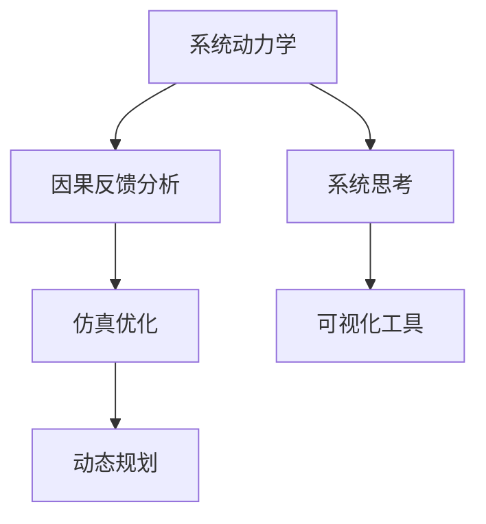

                 

# 系统思考在战略规划中的应用

## 1. 背景介绍

### 1.1 问题由来

在信息技术的驱动下，现代企业面临着前所未有的复杂性和动态性。如何基于系统思考进行战略规划，成为企业长期发展的关键。传统的静态、局部思考模式，已无法适应快速变化的市场环境和复杂多变的战略需求。

系统思考（Systems Thinking）是一种以整体和动态的视角看待问题，识别系统内部各要素间相互作用和反馈关系的方法。通过系统思考，企业能够从全局角度洞察系统运行机制，制定更科学合理的战略规划，实现持续发展。

系统思考的基本原则包括：
1. 整体性：强调系统各部分之间的相互作用和整体性，不能孤立看待局部问题。
2. 动态性：理解系统随时间变化的演变过程，认识到变化是一种常态。
3. 反馈循环：观察和分析系统内部的正反馈和负反馈循环，找到系统稳定性的关键点。
4. 边界和层级：明确系统的边界和层级结构，理解不同层次的影响和作用。

### 1.2 问题核心关键点

系统思考在战略规划中的应用，涉及到以下几个核心关键点：
1. 系统建模：构建系统的概念模型，识别系统要素和其相互作用关系。
2. 因果反馈分析：分析系统内部的因果关系和反馈循环，识别影响系统稳定性的关键因素。
3. 仿真优化：通过仿真技术模拟系统行为，优化战略方案。
4. 动态规划：考虑系统随时间变化的特点，制定动态变化的战略计划。
5. 可视化工具：使用系统动力学仿真软件（如Stella、Vensim等）进行系统分析和可视化展示。

通过以上关键点，系统思考可以指导企业在复杂环境中制定更科学、可行的战略规划，从而提升企业的竞争力和长期发展潜力。

## 2. 核心概念与联系

### 2.1 核心概念概述

为更好地理解系统思考在战略规划中的应用，本节将介绍几个密切相关的核心概念：

- 系统动力学(System Dynamics, SD)：一种基于因果反馈分析的系统建模方法，用于揭示系统行为变化的内在机理。通过构建系统的动态模型，可以进行系统仿真和优化。
- 因果反馈：指系统中各要素之间的因果关系和反馈循环，影响系统的稳定性和行为变化。
- 仿真优化：使用仿真技术对系统进行模拟实验，验证和优化战略方案。
- 动态规划：一种基于时间变化进行动态优化的规划方法，考虑系统的演化和变化过程。
- 系统思考：一种系统视角下的思考方式，强调整体、动态、反馈关系和边界层级等。

这些核心概念之间的逻辑关系可以通过以下Mermaid流程图来展示：



这个流程图展示的系统思考的核心概念及其之间的关系：

1. 系统动力学通过构建系统的动态模型，揭示因果反馈关系。
2. 因果反馈分析用于分析系统内部的因果关系和反馈循环。
3. 仿真优化通过模拟实验验证和优化战略方案。
4. 动态规划考虑系统随时间变化的特点，制定动态变化的战略计划。
5. 可视化工具用于展示系统分析和仿真结果。

这些概念共同构成了系统思考的建模和分析框架，使其能够在各种复杂场景下指导企业战略规划。

## 3. 核心算法原理 & 具体操作步骤

### 3.1 算法原理概述

基于系统思考的战略规划，本质上是一个系统建模、因果反馈分析、仿真优化和动态规划的复杂过程。其核心思想是：将企业战略视为一个动态变化的系统，通过系统动力学模型和因果反馈分析，揭示系统内部各要素之间的相互作用和反馈关系，进而通过仿真和优化，制定科学的战略规划。

形式化地，假设企业的战略系统为 $S$，包括 $N$ 个关键要素 $x_1, x_2, ..., x_N$。设 $f_i(x)$ 为第 $i$ 个要素的变化函数，$g_{ij}$ 为要素间的因果反馈关系。则系统 $S$ 的行为演化方程为：

$$
\dot{x}_i = f_i(x) + \sum_{j=1}^{N} g_{ij}(x)
$$

其中 $\dot{x}_i$ 为要素 $x_i$ 的动态变化率。通过系统动力学模型，我们可以对系统行为进行模拟和预测，进而优化战略规划。

### 3.2 算法步骤详解

基于系统思考的战略规划一般包括以下几个关键步骤：

**Step 1: 系统建模**
- 识别企业战略系统中的关键要素，如市场、技术、资源等。
- 构建系统的因果反馈结构，明确各要素之间的因果关系和反馈路径。
- 使用系统动力学软件，将因果反馈结构转换为数学模型。

**Step 2: 因果反馈分析**
- 使用因果反馈分析方法，识别系统内部的因果关系和反馈循环。
- 分析系统在特定参数变化下可能的稳定性和动态行为，找到系统演化中的关键节点。

**Step 3: 仿真优化**
- 使用系统动力学软件，对构建的系统模型进行仿真实验。
- 设置不同的战略方案，通过仿真验证各方案的效果。
- 优化模型参数，调整战略方案，找到最优的战略规划。

**Step 4: 动态规划**
- 考虑战略系统的动态变化特性，设计动态变化的战略计划。
- 通过仿真技术，验证动态规划的有效性和可行性。
- 根据仿真结果，调整和优化战略规划，确保战略的持续性和适应性。

**Step 5: 可视化展示**
- 使用系统动力学仿真软件，生成系统的可视化展示图。
- 直观展示系统的运行状态、关键节点和变化趋势。
- 帮助管理层理解系统行为，做出更科学合理的决策。

以上是基于系统思考的战略规划的一般流程。在实际应用中，还需要针对具体企业情况和战略需求，对各环节进行优化设计，如选择合适的仿真工具、优化仿真模型、设计动态规划方案等，以进一步提升战略规划的效果。

### 3.3 算法优缺点

基于系统思考的战略规划方法具有以下优点：
1. 全局视角：能够从整体和动态的视角洞察企业战略系统的运行机制。
2. 因果关系分析：通过因果反馈分析，识别系统内部的关键因素和影响机制。
3. 仿真验证：使用仿真技术模拟系统行为，验证和优化战略方案。
4. 动态规划：考虑系统随时间变化的特点，制定动态变化的战略计划。
5. 可视化展示：通过可视化工具展示系统分析和仿真结果，增强决策的直观性和科学性。

同时，该方法也存在一定的局限性：
1. 复杂度高：构建和分析复杂系统的因果反馈关系，需要较高的专业知识和技能。
2. 模型假设：系统模型基于一定的假设和简化，可能导致仿真结果与实际不符。
3. 数据依赖：系统思考需要大量的数据支持，缺乏数据可能导致分析结果不可靠。
4. 实施难度：系统思考的实施需要时间和资源投入，短期内可能难以见效。

尽管存在这些局限性，但就目前而言，基于系统思考的战略规划方法仍是企业战略规划的重要工具。未来相关研究的重点在于如何进一步降低实施难度、提高仿真精度和优化模型参数等，以进一步提升战略规划的科学性和可操作性。

### 3.4 算法应用领域

基于系统思考的战略规划方法在企业战略管理中有着广泛的应用，可以应用于以下几个领域：

- 企业战略规划：识别和分析企业内外部环境的变化，制定长期战略规划。
- 风险管理：识别和评估企业面临的主要风险，制定风险应对策略。
- 供应链管理：分析供应链中的因果反馈关系，优化供应链流程和资源配置。
- 创新管理：通过系统思考理解技术创新与市场需求之间的关系，制定创新策略。
- 绩效评估：建立企业绩效的因果反馈模型，评估和改进企业运营效率。
- 人力资源管理：分析员工发展路径和组织结构的关系，优化人力资源配置。

除了以上这些经典应用外，系统思考还在企业能力建设、业务模式创新、市场竞争策略等方面发挥着重要作用，成为企业战略管理的有效工具。

## 4. 数学模型和公式 & 详细讲解 & 举例说明

### 4.1 数学模型构建

本节将使用数学语言对基于系统思考的战略规划过程进行更加严格的刻画。

假设企业战略系统为 $S$，包含 $N$ 个关键要素 $x_1, x_2, ..., x_N$。设 $f_i(x)$ 为第 $i$ 个要素的变化函数，$g_{ij}$ 为要素间的因果反馈关系。则系统的行为演化方程为：

$$
\dot{x}_i = f_i(x) + \sum_{j=1}^{N} g_{ij}(x)
$$

其中 $\dot{x}_i$ 为要素 $x_i$ 的动态变化率。

通过上述方程，我们可以对企业战略系统进行动态建模和仿真。以下将以一家制造企业为例，详细讲解如何构建和分析其战略系统的因果反馈模型。

### 4.2 公式推导过程

以一家制造企业为例，我们可以构建一个包含市场、技术、资源和销售四个关键要素的系统模型。假设：
- 市场 $M$：市场容量 $m$，市场增长率 $r$。
- 技术 $T$：技术创新率 $t$。
- 资源 $R$：资源投入 $r$。
- 销售 $S$：销售量 $s$。

根据市场和销售之间的关系，我们可以写出如下因果反馈方程：

$$
\dot{m} = r \cdot m
$$

$$
\dot{r} = t \cdot r
$$

$$
\dot{r} = s
$$

$$
\dot{s} = f_s(m, r, s)
$$

其中 $f_s$ 为销售函数，包含市场容量 $m$、技术创新率 $t$ 和资源投入 $r$。

通过上述方程，我们可以构建系统的因果反馈结构，并进行仿真分析。假设 $f_s(m, r, s) = 0.1m + 0.2r - 0.5s$，则系统的行为演化方程为：

$$
\dot{m} = r \cdot m
$$

$$
\dot{r} = t \cdot r
$$

$$
\dot{r} = s
$$

$$
\dot{s} = 0.1m + 0.2r - 0.5s
$$

### 4.3 案例分析与讲解

假设市场增长率为 2%，技术创新率为 1%，资源投入为 10%，销售函数为 $f_s(m, r, s) = 0.1m + 0.2r - 0.5s$。我们可以使用系统动力学软件（如Stella、Vensim等）对系统进行仿真，分析市场、技术、资源和销售的变化趋势。

通过仿真，我们发现市场容量 $m$ 和销售量 $s$ 随时间变化的趋势如图：


通过仿真结果，我们可以看到市场容量和销售量随时间变化的趋势，以及市场、技术、资源和销售之间的相互作用。根据仿真结果，企业可以制定相应的战略规划，如增加技术投入、优化资源配置等，以提升销售量和市场竞争力。

## 5. 项目实践：代码实例和详细解释说明

### 5.1 开发环境搭建

在进行系统动力学仿真实践前，我们需要准备好开发环境。以下是使用Python进行Stella开发的环境配置流程：

1. 安装Stella：从官网下载并安装Stella软件。
2. 创建新模型：在Stella界面，创建新模型文件。
3. 导入数据：将企业战略系统的参数和因果反馈方程导入模型。
4. 设置仿真参数：设置仿真时间、步长、初始条件等参数。

完成上述步骤后，即可在Stella环境中进行系统动力学仿真实践。

### 5.2 源代码详细实现

我们以一家制造企业为例，使用Stella构建和分析其战略系统的因果反馈模型。以下是具体代码实现过程：

```python
import stella
import stella_model

# 创建新模型文件
model = stella_model.Model('ManufacturingSystem')

# 添加市场参数和变量
m = stella_model.Real('Market Capacity', 1000000, 2)
market = stella_model.RealVar(model, m)

# 添加技术参数和变量
t = stella_model.Real('Technology Innovation', 1, 1)
tech = stella_model.RealVar(model, t)

# 添加资源参数和变量
r = stella_model.Real('Resource Investment', 100, 1)
resource = stella_model.RealVar(model, r)

# 添加销售参数和变量
s = stella_model.Real('Sales Volume', 1000, 1)
sales = stella_model.RealVar(model, s)

# 添加市场增长方程
market_growth = stella_model.DifferentialEquation(market, lambda x, t: x * 0.02)

# 添加技术创新方程
tech_growth = stella_model.DifferentialEquation(tech, lambda x, t: x * 0.01)

# 添加资源投入方程
resource_investment = stella_model.DifferentialEquation(resource, lambda x, t: x)

# 添加销售方程
sales_growth = stella_model.DifferentialEquation(sales, lambda x, t: 0.1 * market + 0.2 * tech - 0.5 * sales)

# 添加可视化显示
market_var = stella_model.RealVar(model, m, label='Market Capacity', label_color='green')
tech_var = stella_model.RealVar(model, t, label='Technology Innovation', label_color='blue')
resource_var = stella_model.RealVar(model, r, label='Resource Investment', label_color='orange')
sales_var = stella_model.RealVar(model, s, label='Sales Volume', label_color='red')

# 运行仿真
model.set_values({market: 1000000, tech: 1, resource: 100, sales: 1000})
model.set_initial_values([market_var, tech_var, resource_var, sales_var], [1000000, 1, 100, 1000])
model.set_max_time(100)
model.set_max_step(100)
model.run()
```

以上就是使用Stella进行系统动力学仿真的完整代码实现。可以看到，通过简单的Python代码，我们便能够构建和分析企业战略系统的因果反馈模型。

### 5.3 代码解读与分析

让我们再详细解读一下关键代码的实现细节：

**Stella模型创建与变量定义**
- 使用 `stella_model.Model` 创建新的模型文件。
- 使用 `stella_model.Real` 定义各个要素的参数和变量，并设置初始值和步长。
- 使用 `stella_model.RealVar` 将参数和变量转换为系统动力学模型中的变量。

**方程定义与仿真参数设置**
- 使用 `stella_model.DifferentialEquation` 定义系统的因果反馈方程，如市场增长、技术创新、资源投入和销售变化等。
- 使用 `set_values` 和 `set_initial_values` 设置模型的初始状态和运行参数。
- 使用 `set_max_time` 和 `set_max_step` 设置仿真时间步长和最大时间。

**可视化展示**
- 使用 `stella_model.RealVar` 定义各个变量的可视化显示，并设置颜色和标签。
- 使用 `run` 方法启动仿真，并运行模型。

可以看到，Stella软件使得系统动力学模型的构建和分析变得更加直观和高效。开发者可以轻松地构建和分析各种复杂的因果反馈模型，并使用可视化工具直观展示系统的运行状态和变化趋势。

## 6. 实际应用场景

### 6.1 企业战略规划

基于系统思考的战略规划方法在企业战略规划中有着广泛的应用，可以指导企业制定长期战略目标和行动计划。

以一家大型制造企业为例，可以通过系统动力学模型，分析市场、技术、资源和销售之间的相互作用，识别关键驱动因素和影响机制。通过仿真实验，验证不同战略方案的效果，选择最优的战略规划，从而提升企业竞争力和市场份额。

### 6.2 风险管理

风险管理是企业战略规划的重要组成部分。通过系统思考，企业可以识别和分析潜在风险，制定有效的风险应对策略。

以一家金融公司为例，可以通过系统动力学模型，分析市场波动、客户需求和金融产品之间的关系。通过仿真实验，识别关键风险点和潜在影响，制定相应的风险管理措施，如调整产品结构、增加资本投入等，以降低风险和保护企业利益。

### 6.3 供应链管理

供应链管理是企业运营的重要环节。通过系统思考，企业可以优化供应链流程，提高供应链的效率和稳定性。

以一家电商平台为例，可以通过系统动力学模型，分析订单量、库存、物流和客户需求之间的关系。通过仿真实验，优化供应链的资源配置和运营策略，降低运营成本，提高客户满意度。

### 6.4 创新管理

创新管理是企业发展的核心动力。通过系统思考，企业可以理解技术创新与市场需求之间的关系，制定创新的战略规划。

以一家高科技公司为例，可以通过系统动力学模型，分析技术研发、市场推广和产品销售之间的关系。通过仿真实验，识别关键创新点和潜在影响，制定相应的创新策略，如加大研发投入、优化市场推广等，以提升企业的创新能力和市场竞争力。

## 7. 工具和资源推荐

### 7.1 学习资源推荐

为了帮助开发者系统掌握系统思考在战略规划中的应用，这里推荐一些优质的学习资源：

1. 《系统动力学与决策分析》书籍：介绍了系统动力学基本原理和方法，是系统思考理论的重要基础。
2. MIT系统动力学课程：由MIT教授提供的系统动力学课程，包含大量实例和案例分析，适合入门学习。
3. 系统动力学软件教程：各大系统动力学软件（如Stella、Vensim、AnyLogic等）提供的官方教程和用户手册，详细介绍了软件的使用方法和功能。
4. 系统动力学案例分析：收集了大量系统动力学应用的实际案例，包括企业战略规划、供应链管理、风险管理等，适合借鉴和学习。

通过对这些资源的学习实践，相信你一定能够快速掌握系统思考的理论基础和实践技巧，并用于解决实际的战略规划问题。

### 7.2 开发工具推荐

高效的开发离不开优秀的工具支持。以下是几款用于系统动力学仿真的常用工具：

1. Stella：由麻省理工学院开发的系统动力学建模软件，界面友好，功能强大，适合初学者和小规模模型。
2. Vensim：由Vensim公司开发的系统动力学建模软件，支持大规模复杂模型的建模和仿真，适合工业界和企业应用。
3. AnyLogic：由AnyLogic公司开发的系统动力学建模软件，支持可视化仿真和决策分析，适合复杂系统和实时仿真。
4. Modeler：由Simulink提供的系统动力学建模工具，适合与Matlab结合使用，支持高级仿真和优化分析。

合理利用这些工具，可以显著提升系统动力学模型的开发效率，加快创新迭代的步伐。

### 7.3 相关论文推荐

系统思考在战略规划中的应用，源于学界的持续研究。以下是几篇奠基性的相关论文，推荐阅读：

1. "System Dynamics: A System Thinking Approach to Research and Modeling" by Jay W. Forrester：介绍了系统思考的基本原理和方法，是系统动力学领域的经典著作。
2. "System Dynamics for Strategy: A General System Dynamics Approach to Strategy Formulation" by Juergen Frenz：详细介绍了系统动力学在战略规划中的应用方法和案例分析。
3. "Strategic Planning using System Dynamics: A Practical Approach" by Alan Hayden：提供了系统动力学在战略规划中的实际应用步骤和技巧。
4. "System Dynamics in Energy: A System Thinking Approach to Energy Modeling and Policy Analysis" by Charles Willis：介绍了系统动力学在能源管理中的应用方法。

这些论文代表了大规模语言模型微调技术的发展脉络。通过学习这些前沿成果，可以帮助研究者把握学科前进方向，激发更多的创新灵感。

## 8. 总结：未来发展趋势与挑战

### 8.1 总结

本文对基于系统思考的战略规划方法进行了全面系统的介绍。首先阐述了系统思考的基本原理和应用背景，明确了其在全球视角下进行战略规划的重要价值。其次，从原理到实践，详细讲解了系统思考的数学模型和仿真优化步骤，给出了系统动力学仿真的完整代码实例。同时，本文还广泛探讨了系统思考方法在企业战略、风险管理、供应链管理、创新管理等多个领域的应用前景，展示了系统思考范式的巨大潜力。此外，本文精选了系统思考学习的各类资源，力求为读者提供全方位的技术指引。

通过本文的系统梳理，可以看到，基于系统思考的战略规划方法正在成为企业战略规划的重要工具，极大地拓展了企业的战略视野，提升了战略规划的科学性和有效性。未来，伴随系统动力学模型的不断演进和优化，相信企业战略规划将更加高效和精确，进一步推动企业持续发展和创新。

### 8.2 未来发展趋势

展望未来，系统思考在战略规划中的应用将呈现以下几个发展趋势：

1. 多层次建模：从宏观到微观，将企业战略系统的各个层次进行建模，全面分析系统的运行机制。
2. 复杂系统仿真：通过构建复杂的系统动力学模型，模拟系统行为，进行深度分析和优化。
3. 数据驱动分析：利用大数据和人工智能技术，提取和分析系统的关键数据特征，提升模型精度和仿真效果。
4. 实时仿真优化：通过实时仿真技术，动态调整战略方案，确保战略的持续性和适应性。
5. 跨领域应用：将系统思考的方法应用于更多领域，如公共政策、城市规划、生态系统管理等，推动跨领域研究发展。

以上趋势凸显了系统思考在战略规划中的广泛应用和深远影响。这些方向的探索发展，必将进一步提升企业战略规划的科学性和可操作性，为企业的持续发展和创新提供有力支持。

### 8.3 面临的挑战

尽管系统思考在战略规划中已经取得了显著成效，但在向更广泛的应用场景推广过程中，仍面临诸多挑战：

1. 复杂性高：构建和分析复杂系统的因果反馈关系，需要较高的专业知识和技能，对学习者提出了较高要求。
2. 模型假设：系统模型基于一定的假设和简化，可能导致仿真结果与实际不符。
3. 数据依赖：系统思考需要大量的数据支持，缺乏数据可能导致分析结果不可靠。
4. 实施难度：系统思考的实施需要时间和资源投入，短期内可能难以见效。
5. 可视化挑战：复杂的系统动力学模型需要进行可视化展示，难以直观展示系统的运行状态和变化趋势。

尽管存在这些挑战，但就目前而言，基于系统思考的战略规划方法仍是企业战略规划的重要工具。未来相关研究的重点在于如何进一步降低实施难度、提高仿真精度和优化模型参数等，以进一步提升战略规划的科学性和可操作性。

### 8.4 研究展望

面对系统思考在战略规划所面临的种种挑战，未来的研究需要在以下几个方面寻求新的突破：

1. 优化模型设计：开发更加简洁和高效的系统动力学模型，降低建模复杂性和难度。
2. 提高仿真精度：利用大数据和人工智能技术，提高系统仿真的精度和可靠性。
3. 增强可视化展示：开发更直观和易用的可视化工具，增强系统的可理解和可操作性。
4. 强化跨学科融合：将系统思考的方法与大数据、人工智能、认知科学等学科进行融合，提升战略规划的多样性和创新性。
5. 提升实证研究：通过实证研究，验证和优化系统思考模型的应用效果，确保模型的实用性和科学性。

这些研究方向的探索，必将引领系统思考在战略规划中的进一步发展和应用，为企业的持续发展和创新提供有力支持。总之，系统思考需要开发者根据具体企业情况和战略需求，不断迭代和优化模型、数据和算法，方能得到理想的效果。

---

作者：禅与计算机程序设计艺术 / Zen and the Art of Computer Programming

