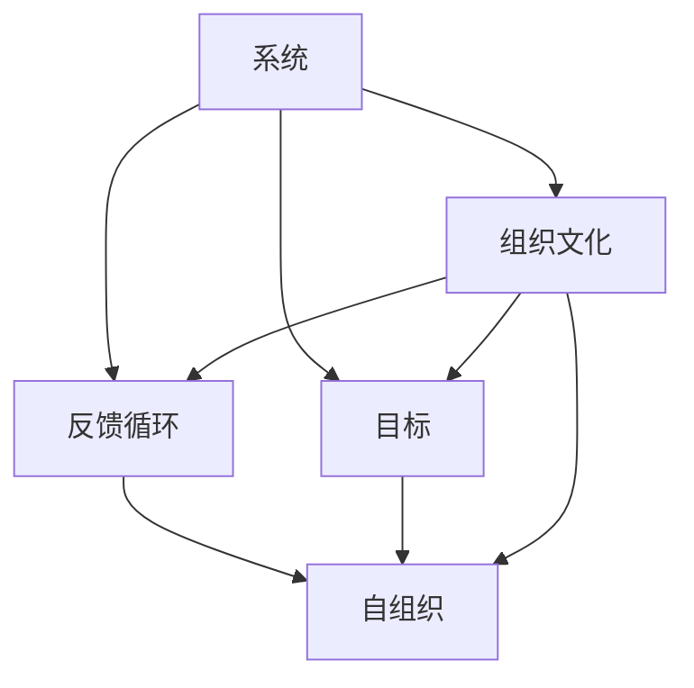

                 

# 系统思考对于管理复杂项目的重要性

> 关键词：系统思考, 复杂项目, 管理, 敏捷, 反馈循环, 自组织, 组织文化, 模型, 系统思维

## 1. 背景介绍

在当今快速变化的技术和商业环境中，复杂项目的管理和执行变得尤为关键。这些项目不仅涉及多个学科和团队，还面临着各种不确定性和复杂性。传统的线性思维和单点优化方法已经不足以应对这种多维度、多层次的挑战。系统思考提供了一种全新的视角，能够帮助项目团队从整体和全局的角度审视问题，提升项目管理的系统性和科学性。

### 1.1 问题由来

复杂项目的管理涉及多个关键因素，包括但不限于：
- **资源管理**：确保高效利用人力、物力、财力等资源。
- **风险管理**：识别、评估和缓解项目中潜在的风险因素。
- **质量管理**：保障最终交付的产品或服务符合预期的质量标准。
- **时间管理**：确保项目按计划完成，不延期或超预算。
- **沟通管理**：在不同利益相关者之间建立有效的沟通机制。

这些管理维度互相影响，任何一个环节的疏漏都可能导致项目失败。而系统思考提供了一种跨学科、跨层次的视角，能够帮助项目团队系统化地处理这些问题。

### 1.2 问题核心关键点

系统思考的核心在于理解和建模复杂系统的相互依赖和相互作用。具体而言，系统思考的关键点包括：
- **整体性**：系统思考强调系统的整体性，关注系统的结构、功能、行为和动态变化。
- **关联性**：系统中的各个部分之间存在复杂的关联和反馈机制，需要进行综合考虑。
- **动态性**：系统是不断变化的，需要动态地分析和调整。
- **目标一致性**：系统的所有部分应朝着相同的目标努力，而不是各自为政。
- **外部环境**：系统不是孤立存在的，需要考虑与外部环境的相互作用。

这些关键点要求项目管理者具备全局视野，关注系统的动态变化，并能够从整体和关联的角度来设计和优化项目的各个方面。

### 1.3 问题研究意义

系统思考对于管理复杂项目具有重要意义：
- **提升决策质量**：系统思考能够帮助项目管理者全面评估项目的各个方面，避免单一视角导致的决策失误。
- **增强团队协作**：系统思考强调各团队和部门之间的协同工作，提升团队整体绩效。
- **促进创新**：系统思考鼓励跨学科、跨领域的创新思维，推动项目的突破性进展。
- **优化资源配置**：通过系统思考，可以更合理地分配和利用项目资源，避免资源浪费。
- **应对不确定性**：系统思考帮助项目管理者更好地理解和应对项目中的不确定性和复杂性。

本文将系统思考的核心概念、原理、操作步骤，以及具体的应用实例和未来发展趋势进行详细探讨，旨在帮助项目管理者更好地应用系统思考，提升复杂项目的成功率。

## 2. 核心概念与联系

### 2.1 核心概念概述

系统思考是一种复杂性管理的方法论，旨在通过整体和关联的视角，理解和管理复杂系统。其核心概念包括：

- **系统**：由相互依赖的多个部分组成的整体，具有整体性、关联性和动态性。
- **目标**：系统的所有部分应共同努力，朝着系统的总目标前进。
- **反馈循环**：系统中的各个部分之间存在复杂的相互作用和反馈机制，影响系统的稳定性和行为。
- **自组织**：系统能够通过自身的动态调整和优化，维持和提升整体性能。
- **组织文化**：支持系统思考的企业文化，鼓励跨学科、跨部门的合作和创新。

这些核心概念之间存在紧密的联系和相互作用，共同构成了系统思考的理论基础和方法论。

### 2.2 核心概念原理和架构的 Mermaid 流程图



该图表展示了系统思考中各核心概念的相互关系。系统通过明确的目标和复杂的反馈循环进行动态调整，自组织和组织文化进一步支持和优化这一过程。

## 3. 核心算法原理 & 具体操作步骤

### 3.1 算法原理概述

系统思考的管理算法主要基于以下几个核心原理：
- **系统动力学**：通过建立系统的动态模型，理解系统的行为和反馈机制。
- **因果环路图(CRPs)**：绘制系统的因果关系图，识别关键变量和关键决策点。
- **仿真和实验**：使用仿真和实验方法，测试和管理系统的行为和性能。
- **系统调整和优化**：根据仿真和实验结果，调整系统参数和结构，优化系统性能。

这些原理共同构成了系统思考的核心算法框架，帮助项目管理者从整体和关联的视角，科学地管理和优化复杂项目。

### 3.2 算法步骤详解

系统思考的管理算法步骤如下：
1. **建立系统模型**：使用系统动力学或因果环路图等工具，建立系统的动态模型。
2. **识别关键变量和决策点**：通过因果环路图，识别系统的关键变量和决策点。
3. **仿真和实验**：使用仿真或实验方法，测试系统的行为和性能。
4. **分析和优化**：根据仿真和实验结果，分析系统行为，进行参数调整和结构优化。
5. **持续改进**：持续监测和改进系统性能，确保系统稳定性和目标一致性。

这些步骤需要跨学科、跨部门的协作和共同努力，才能确保系统的整体优化和目标一致性。

### 3.3 算法优缺点

系统思考管理算法的优点包括：
- **全局视角**：通过整体和关联的视角，帮助项目管理者全面评估项目的各个方面。
- **动态优化**：能够动态地调整和优化系统参数，提升系统性能。
- **跨学科协作**：鼓励跨学科、跨部门的合作和创新，提升团队整体绩效。

其缺点包括：
- **复杂性高**：系统思考需要高度的抽象和模型构建能力，可能对初学者有一定难度。
- **数据需求高**：需要大量高质量的数据和仿真实验，可能耗时较长。
- **资源投入高**：需要跨学科、跨部门的资源投入和协作，可能面临资源协调的挑战。

尽管存在这些挑战，系统思考在复杂项目管理和优化中仍具有重要价值，能够帮助项目管理者提升决策质量，增强团队协作，促进创新和资源优化。

### 3.4 算法应用领域

系统思考在多个领域都有广泛应用，包括但不限于：
- **项目管理**：提升项目管理的系统性和科学性，优化资源配置，降低风险。
- **组织变革**：通过系统思考，推动组织变革和转型，提升组织绩效。
- **创新管理**：支持跨学科、跨领域的创新思维，推动技术突破和业务创新。
- **战略规划**：通过系统思考，制定和实施系统的战略规划，提升组织的竞争力和适应性。
- **社会治理**：在社会治理中，系统思考有助于理解和应对复杂的社会问题，提升治理效果。

这些应用领域展示了系统思考在提升复杂系统管理能力方面的广泛价值。

## 4. 数学模型和公式 & 详细讲解 & 举例说明

### 4.1 数学模型构建

系统思考的数学模型通常基于系统动力学理论，通过建立系统的动态方程组，模拟系统的行为和反馈机制。以下是一个简单的系统动力学模型示例：

$$
\begin{cases}
\frac{dX}{dt} = rX - aXY \\
\frac{dY}{dt} = bXY - cY
\end{cases}
$$

其中，$X$ 和 $Y$ 表示系统的两个关键变量，$r, a, b, c$ 为系统的参数。

### 4.2 公式推导过程

假设系统由两个变量 $X$ 和 $Y$ 组成，其动态变化由以下方程组描述：

$$
\begin{cases}
\frac{dX}{dt} = rX - aXY \\
\frac{dY}{dt} = bXY - cY
\end{cases}
$$

对该系统进行稳态分析，求解其稳态解，可以得到系统的稳态点 $(X_s, Y_s)$：

$$
\begin{cases}
X_s = \frac{r}{a} \\
Y_s = \frac{bX_s}{c}
\end{cases}
$$

通过对系统的因果环路图进行分析，可以识别出系统的关键决策点，如 $r, a, b, c$ 的取值。通过仿真实验，测试系统的行为和性能，可以进行参数调整和结构优化，确保系统稳定性和目标一致性。

### 4.3 案例分析与讲解

以下是一个简单的系统思考案例分析：

假设某公司生产销售一种产品，销售收入 $X$ 和生产成本 $Y$ 的动态关系由以下方程组描述：

$$
\begin{cases}
\frac{dX}{dt} = rX - aXY \\
\frac{dY}{dt} = bXY - cY
\end{cases}
$$

其中，$r$ 为销售增长率，$a$ 为销售与生产成本的关联系数，$b$ 为生产成本与销售的关联系数，$c$ 为生产成本的降低率。

通过建立系统的因果环路图，可以识别出关键变量和决策点。例如，销售增长率 $r$ 的取值直接影响销售收入 $X$，但生产成本 $Y$ 的降低率 $c$ 也对 $X$ 有重要影响。

通过仿真实验，测试系统的行为和性能，可以发现当 $c$ 过低时，生产成本过高，导致销售收入 $X$ 增长缓慢。因此，可以通过调整 $c$ 的取值，优化生产成本，提升销售收入 $X$。

## 5. 项目实践：代码实例和详细解释说明

### 5.1 开发环境搭建

项目实践需要准备以下开发环境：
1. **安装Python和相关库**：确保Python版本为3.6或以上，并安装必要的库，如SimPy、PyCSP等。
2. **配置仿真环境**：设置仿真实验的环境，如设置仿真时间、初始状态等。
3. **准备仿真数据**：收集和准备系统的仿真数据，用于测试和优化模型。

### 5.2 源代码详细实现

以下是一个简单的系统动力学仿真代码实现：

```python
from simpy import *
from math import exp

env = Simulation()

class System:
    def __init__(self, env, r, a, b, c):
        self.env = env
        self.r = r
        self.a = a
        self.b = b
        self.c = c
        self.X = 0
        self.Y = 0
        self.proc = env.process(self.run())

    def run(self):
        while True:
            self.env.timeout(1)
            dX = self.r * self.X - self.a * self.X * self.Y
            dY = self.b * self.X * self.Y - self.c * self.Y
            self.X += dX
            self.Y += dY
            print(f"X: {self.X}, Y: {self.Y}")

env.process(System(env, r=0.1, a=0.5, b=0.2, c=0.1))

env.run(until=100)
```

该代码实现了基于系统动力学的仿真模型，模拟销售收入 $X$ 和生产成本 $Y$ 的动态变化。

### 5.3 代码解读与分析

**代码解读**：
- 首先导入SimPy库，创建一个仿真环境。
- 定义一个System类，表示系统的动态模型，包含系统的参数和状态变量。
- 在System类的run方法中，模拟系统的动态变化，使用积分公式计算状态变量的变化。
- 在仿真环境中创建System对象，并运行仿真100秒。

**代码分析**：
- 该代码使用SimPy库，方便地构建和运行系统动力学模型。
- 通过控制系统的参数 $r, a, b, c$，可以动态地测试和优化系统的行为和性能。
- 代码简洁明了，易于理解和扩展，适用于复杂系统的仿真和优化。

### 5.4 运行结果展示

运行上述代码，可以得到系统的动态变化轨迹，如销售收入 $X$ 和生产成本 $Y$ 随时间的变化。通过分析和优化，可以调整系统参数，提升系统性能。

## 6. 实际应用场景

### 6.1 智能制造系统

在智能制造系统中，系统思考可以帮助企业优化生产流程，提升生产效率和产品质量。通过系统思考，可以理解各个环节的相互依赖和反馈机制，优化生产资源的配置和调度。例如，通过建立生产线的因果环路图，识别出关键的生产瓶颈和决策点，优化生产流程，提高生产效率。

### 6.2 医疗健康系统

在医疗健康系统中，系统思考可以帮助医院优化资源配置，提升医疗服务质量。通过系统思考，可以理解各个医疗环节的相互依赖和反馈机制，优化资源配置，提高医疗服务效率。例如，通过建立医院的因果环路图，识别出关键的医疗环节和决策点，优化诊疗流程，提升患者满意度。

### 6.3 金融投资系统

在金融投资系统中，系统思考可以帮助投资者优化投资组合，降低风险。通过系统思考，可以理解投资组合中各个资产的相互依赖和反馈机制，优化资产配置，降低投资风险。例如，通过建立投资组合的因果环路图，识别出关键的市场变量和决策点，优化投资策略，提高投资回报率。

### 6.4 未来应用展望

未来，系统思考在复杂项目管理和优化中将有更广泛的应用前景。随着技术的不断进步，系统思考将与人工智能、大数据、物联网等技术进一步融合，提升复杂系统的管理能力。例如，通过人工智能辅助分析系统动力学模型，可以更快地识别系统的关键变量和决策点，优化系统性能。通过大数据分析，可以获取更多高质量的数据和仿真实验结果，提升决策的科学性和可靠性。

## 7. 工具和资源推荐

### 7.1 学习资源推荐

为了帮助项目管理者掌握系统思考的方法论，以下推荐一些优质学习资源：
1. **《系统思考：一种应对复杂性的方法论》**：系统思考的入门书籍，介绍了系统思考的基本概念和原理。
2. **《系统动力学：理论和应用》**：介绍系统动力学的经典教材，详细讲解了系统动力学的建模和仿真方法。
3. **《复杂项目管理的系统思考》**：讲解系统思考在项目管理中的应用案例，帮助管理者提升项目管理的系统性和科学性。
4. **SimPy官网和文档**：SimPy是一种Python仿真库，提供丰富的系统动力学建模和仿真功能，帮助开发者实现复杂的系统模型。
5. **System Dynamics Modeling Society (SDMS) 官网**：提供系统动力学模型和仿真方法的学习资源，包括论文、课程和案例分析。

通过这些学习资源，项目管理者可以系统地掌握系统思考的理论和方法，提升复杂项目管理的系统性和科学性。

### 7.2 开发工具推荐

系统思考的开发工具主要包括系统动力学建模和仿真工具，以下是一些推荐工具：
1. **SimPy**：Python仿真库，支持系统动力学建模和仿真，具有丰富的扩展性和灵活性。
2. **AnyLogic**：商业仿真软件，支持多学科的复杂系统建模和仿真，具有图形化界面和可视化功能。
3. **CPN Tools**：系统仿真和建模工具，支持事件驱动的仿真和因果建模，具有广泛的行业应用。
4. **Vensim**：系统动力学建模和仿真软件，具有图形化界面和丰富的建模功能，支持复杂系统的动态分析和优化。

这些工具能够帮助项目管理者高效地实现系统思考的模型和仿真，提升复杂系统的管理和优化能力。

### 7.3 相关论文推荐

系统思考作为复杂性管理的方法论，已经在多个领域得到了广泛应用。以下是几篇奠基性的相关论文，推荐阅读：
1. **《System Dynamics: A System Thinking Approach to Complexity》**：介绍系统动力学方法论的经典书籍，详细讲解了系统动力学的基本原理和应用方法。
2. **《Theory of the System Dynamics Methodology》**：介绍系统动力学方法论的学术论文，提出系统动力学建模和分析的框架和原则。
3. **《Principles of Model-Based Design》**：介绍系统思维和模型驱动设计的学术书籍，提出基于模型的系统思考方法论。

这些论文代表了大系统管理方法论的发展脉络，帮助研究者把握学科前进方向，激发更多的创新灵感。

## 8. 总结：未来发展趋势与挑战

### 8.1 研究成果总结

系统思考作为复杂性管理的方法论，已经广泛应用于项目管理、组织变革、创新管理等多个领域。通过系统思考，项目管理者可以全面评估系统的各个方面，提升决策质量，增强团队协作，促进创新和资源优化。未来，随着系统思考与人工智能、大数据、物联网等技术的进一步融合，其应用前景将更加广阔。

### 8.2 未来发展趋势

系统思考的未来发展趋势包括：
- **跨学科融合**：系统思考将与更多学科和技术进一步融合，推动复杂系统的综合管理和优化。
- **智能辅助**：通过人工智能和大数据分析，提升系统思考的效率和准确性，帮助项目管理者快速识别系统的关键变量和决策点。
- **自适应学习**：系统思考将具备自适应学习能力，动态调整模型和参数，优化系统性能。
- **全局优化**：系统思考将更加注重全局优化，提升系统的整体性能和适应性。
- **面向未来的设计**：系统思考将面向未来，考虑长期影响和不确定性，提升系统的稳定性和鲁棒性。

这些趋势展示了系统思考在复杂项目管理和优化中的巨大潜力，预示了未来系统思考在复杂系统中的应用前景。

### 8.3 面临的挑战

尽管系统思考在复杂项目管理和优化中具有重要价值，但在实际应用中也面临诸多挑战：
- **复杂性高**：系统思考需要高度的抽象和模型构建能力，对初学者有一定难度。
- **数据需求高**：需要大量高质量的数据和仿真实验，可能耗时较长。
- **资源投入高**：需要跨学科、跨部门的资源投入和协作，可能面临资源协调的挑战。
- **模型复杂性**：系统模型的复杂性可能导致模型构建和分析的困难。
- **系统动态性**：系统是不断变化的，需要动态地调整和优化系统参数，提升系统性能。

这些挑战需要在未来的研究中进一步解决，以充分发挥系统思考在复杂系统管理中的优势。

### 8.4 研究展望

未来的研究需要在以下几个方面寻求新的突破：
- **简化系统模型**：开发更加简洁、易用的系统动力学建模工具，降低系统构建和分析的难度。
- **提升模型自适应性**：开发具有自适应学习能力、动态调整模型的系统思考方法，提升系统优化效果。
- **强化跨学科协作**：加强跨学科、跨部门的协作和资源共享，提升系统思考的实用性和适用性。
- **提高数据质量**：通过大数据技术和人工智能，提高系统思考的数据质量，提升仿真实验的准确性和效率。
- **面向未来的设计**：考虑长期影响和不确定性，设计具有鲁棒性和适应性的系统思考模型。

这些研究方向的探索，将引领系统思考方法论迈向更高的台阶，为复杂系统管理和优化提供更科学、更高效的指导。

## 9. 附录：常见问题与解答

**Q1：系统思考和系统动力学有何区别？**

A: 系统思考是一种方法论，关注复杂系统的整体和关联视角，强调从全局和动态的角度理解和优化系统。系统动力学则是一种具体的系统建模方法，基于系统动力学理论，通过建立系统的动态方程组，模拟系统的行为和反馈机制。系统思考与系统动力学是相互关联的，系统动力学是系统思考中的一种重要工具。

**Q2：系统思考如何应用于项目管理？**

A: 系统思考在项目管理中的应用主要体现在以下几个方面：
- **整体视角**：通过系统思考，全面评估项目的各个方面，避免单一视角导致的决策失误。
- **动态优化**：能够动态地调整和优化项目参数，提升项目性能。
- **跨学科协作**：鼓励跨学科、跨部门的合作和创新，提升团队整体绩效。
- **风险管理**：通过系统思考，识别项目的风险因素和关键决策点，制定风险应对策略。

通过系统思考，项目管理者可以全面地理解和管理复杂项目，提升项目成功率。

**Q3：系统思考需要哪些基础知识？**

A: 系统思考需要具备以下基础知识：
- **复杂系统理论**：理解复杂系统的基本概念和特征。
- **系统动力学**：掌握系统动力学理论和方法，能够建立和仿真系统模型。
- **因果关系分析**：能够识别系统中的因果关系，进行因果环路图建模。
- **数据分析和统计**：掌握数据分析和统计方法，能够处理和分析复杂系统数据。
- **模型优化**：掌握系统模型的优化方法，能够调整和优化系统参数。

这些基础知识为系统思考的实际应用提供了坚实的理论基础和方法论。

**Q4：系统思考在复杂项目中的应用案例有哪些？**

A: 系统思考在复杂项目中的应用案例包括但不限于：
- **智能制造系统**：通过系统思考，优化生产流程，提升生产效率和产品质量。
- **医疗健康系统**：通过系统思考，优化资源配置，提升医疗服务质量。
- **金融投资系统**：通过系统思考，优化投资组合，降低投资风险。
- **城市治理系统**：通过系统思考，优化城市管理，提升城市运行效率和居民满意度。

这些案例展示了系统思考在复杂项目管理和优化中的广泛应用和显著效果。

---

作者：禅与计算机程序设计艺术 / Zen and the Art of Computer Programming

